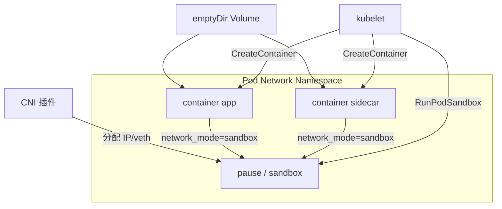
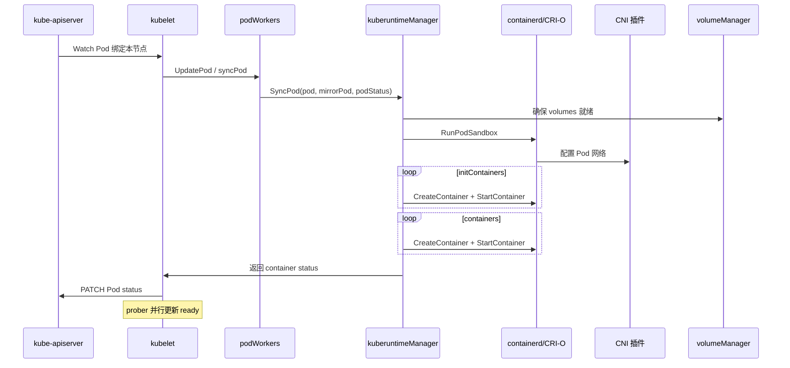

# CrashLoopBackOff 从哪来？Pod、Pause 沙箱、kubelet syncPod 到容器运行时讲透

`kubectl get pod` 显示 `CrashLoopBackOff`；`Init:0/1` 卡半小时；业务容器起来了但 `readiness probe failed`；`kubectl logs` 只能看到主容器、Sidecar 日志要加 `-c`——这些现象都落在 **Pod 作为原子调度单元 → pause/infra 沙箱 → kubelet syncPod → CRI（containerd/CRI-O）** 这条链上。本文按 `kubernetes/kubernetes` 的 `pkg/kubelet/` 与 CRI 契约，把 Phase/Condition、探针、QoS、Volume 挂载与排障串成闭环。

## 阅读地图

1. **第一层：Pod 作为最小调度单元**——解决「为什么不是直接调度容器、Pod spec 里哪些字段原子生效」。
2. **第二层：Pause 沙箱与共享命名空间**——解决「infra 容器干什么、多容器如何同 IP/localhost、PID/IPC 共享选项」。
3. **第三层：Phase/Condition 与探针**——解决「Running 不等于 Ready、CrashLoopBackOff 谁设的、liveness/readiness/startup 区别」。
4. **第四层：QoS、Volume 与 syncPod 调用链**——解决「Guaranteed 怎么算、emptyDir/Secret 怎么挂、kubelet 如何驱动 CRI 建 sandbox/容器」。
5. **第五层：CRI/containerd 观测与 CrashLoop/Init 排障**——解决「crictl 对照、事件到日志、镜像/探针/沙箱失败怎么分」。

## 源码锚点

| 路径 / 符号 | 作用 |
|-------------|------|
| `pkg/kubelet/kubelet.go` | kubelet 主循环、Pod 同步入口 |
| `pkg/kubelet/pod_workers.go` | `managePodLoop`、按 Pod 串行 sync |
| `pkg/kubelet/kuberuntime/kuberuntime_manager.go` | `SyncPod`、容器生命周期总控 |
| `pkg/kubelet/kuberuntime/kuberuntime_sandbox.go` | `createPodSandbox`、`RunPodSandbox` |
| `pkg/kubelet/kuberuntime/kuberuntime_container.go` | `startContainer`、`killContainer` |
| `pkg/kubelet/kuberuntime/instrumented_services.go` | CRI gRPC 封装与 metrics |
| `pkg/kubelet/pod/pod_manager.go` | 本节点 Pod 镜像与 UID 映射 |
| `pkg/kubelet/status/status_manager.go` | 聚合容器状态写 Pod status |
| `pkg/kubelet/prober/prober.go` | liveness/readiness/startup 探针 |
| `pkg/kubelet/prober/worker.go` | 探针 goroutine 周期执行 |
| `pkg/kubelet/volumemanager/` | Volume attach/wait/mount |
| `pkg/kubelet/pleg/` | Pod Lifecycle Event Generator |
| `pkg/apis/core/types.go` | PodPhase、PodCondition 类型定义 |
| `staging/src/k8s.io/cri-api/pkg/apis/runtime/v1/api.proto` | CRI gRPC 接口定义 |
| `staging/src/k8s.io/kubelet/pkg/types/pod_update.go` | Pod 来源：apiserver / static / mirror |
| `cmd/kubelet/app/server.go` | kubelet 启动、CRI socket 配置 |

容器运行时（非 k/k 主仓，对接参考）：

| 路径 | 作用 |
|------|------|
| `containerd/containerd/pkg/cri/sbserver/` | containerd CRI sandbox 服务 |
| `containerd/containerd/pkg/cri/server/` | RunPodSandbox、CreateContainer |
| `cri-o/cri-o/server/` | CRI-O RunPodSandbox 实现 |

## 第一层：Pod 作为最小调度单元

### 概念：调度器绑的是 Pod，不是 Container

Kubernetes **不会**单独调度某个容器；`spec.containers` 列表作为一个 **Pod** 被绑定到同一 `nodeName`，共享 network namespace（默认）与部分存储。Init 容器按顺序执行完毕后，App 容器并行启动。

Pod 关键字段：

```yaml
apiVersion: v1
kind: Pod
metadata:
  name: demo
  namespace: default
  uid: 8a3f...
spec:
  nodeName: worker-1          # scheduler 写入
  restartPolicy: Always       # Always|OnFailure|Never
  containers:
  - name: app
    image: nginx:1.25
    ports:
    - containerPort: 80
  initContainers:
  - name: init-db
    image: busybox:1.36
    command: ['sh', '-c', 'until nslookup mydb; do sleep 1; done']
  volumes:
  - name: cache
    emptyDir: {}
status:
  phase: Running
  conditions:
  - type: PodScheduled
    status: "True"
  - type: Initialized
    status: "True"
  - type: ContainersReady
    status: "True"
  - type: Ready
    status: "True"
  containerStatuses:
  - name: app
    ready: true
    restartCount: 0
    state:
      running:
        startedAt: "2026-09-12T10:00:00Z"
```

### 机制：Pod 来源

kubelet 处理的 Pod 来自（`staging/src/k8s.io/kubelet/pkg/types/pod_update.go`）：

| 来源 | 说明 |
|------|------|
| API Server | 常规调度 Pod |
| Static Pod | `/etc/kubernetes/manifests/` 镜像，apiserver 上可见 mirror Pod |
| DaemonSet | 控制器创建的 Pod |

### 观测

```bash
kubectl get pod demo -o yaml
kubectl get pod demo -o jsonpath='{.spec.nodeName}{"\n"}{.status.phase}{"\n"}'
kubectl explain pod.spec.restartPolicy
```

## 第二层：Pause 沙箱与共享命名空间

### 概念：infra / pause 容器

kubelet 通过 CRI 创建 **Pod Sandbox**（基础设施容器），在 containerd 里常表现为 `pause` 镜像（如 `registry.k8s.io/pause:3.9`，以集群为准）。Sandbox 持有 **network namespace**；业务容器通过 **join sandbox network** 共享同一 IP，localhost 互通。

Sidecar 模式：主容器 + 日志/代理 Sidecar 同 Pod，共享 network NS，Sidecar 可 `127.0.0.1:主容器端口` 抓流量。

### 共享选项

| spec 字段 | 效果 |
|-----------|------|
| 默认 | 共享 network |
| `shareProcessNamespace: true` | 共享 PID NS，可见彼此进程 |
| `hostIPC: true` | 使用宿主机 IPC |
| `hostNetwork: true` | 使用宿主机 network（无 pause IP，端口冲突风险） |
| `hostPID: true` | 使用宿主机 PID |

### 模块分层：Pod 内网络



### CRI：RunPodSandbox

CRI proto（`staging/src/k8s.io/cri-api/pkg/apis/runtime/v1/api.proto`）：

```protobuf
service RuntimeService {
  rpc RunPodSandbox(RunPodSandboxRequest) returns (RunPodSandboxResponse);
  rpc CreateContainer(CreateContainerRequest) returns (CreateContainerResponse);
  rpc StartContainer(StartContainerRequest) returns (StartContainerResponse);
  ...
}
```

kubelet 侧：`pkg/kubelet/kuberuntime/kuberuntime_sandbox.go` 的 `createPodSandbox` 组装 `PodSandboxConfig`（labels、DNS、log directory、Linux 安全配置），调用 `RunPodSandbox`。

### 可执行：节点上对照 sandbox

```bash
# 在 Pod 所在节点
crictl pods --name demo
crictl ps -a | grep demo
crictl inspectp $(crictl pods -q --name demo | head -1)

# containerd（若启用 namespace k8s.io）
ctr -n k8s.io containers list | grep demo
```

## 第三层：Phase/Condition 与探针

### Phase 与 Condition 分工

**Phase**（`Pending`/`Running`/`Succeeded`/`Failed`/`Unknown`）是粗粒度生命周期；**Condition** 细粒度就绪与调度状态。

| Condition | 含义 |
|-----------|------|
| PodScheduled | scheduler 已绑定 node |
| Initialized | 所有 init 容器成功 |
| ContainersReady | 所有普通容器 ready（含 readiness） |
| Ready | 对 Service 就绪（通常同 ContainersReady） |

源码写 status：`pkg/kubelet/status/status_manager.go` 合并 CRI 容器状态与探针结果，PATCH 到 apiserver。

### 探针类型

实现：`pkg/kubelet/prober/prober.go`、`worker.go`

| 探针 | 失败后果 |
|------|----------|
| **liveness** | kubelet **重启容器**（非整个 Pod） |
| **readiness** | 从 Service Endpoint 摘除，不重启 |
| **startup** | 启动宽限期内的 liveness，失败则重启 |

探针方式：`exec`、`httpGet`、`tcpSocket`、`grpc`（以版本为准）。

```yaml
livenessProbe:
  httpGet:
    path: /healthz
    port: 8080
  initialDelaySeconds: 10
  periodSeconds: 10
  failureThreshold: 3
readinessProbe:
  httpGet:
    path: /ready
    port: 8080
  periodSeconds: 5
startupProbe:
  httpGet:
    path: /healthz
    port: 8080
  failureThreshold: 30
  periodSeconds: 10
```

### CrashLoopBackOff 从哪来

容器退出后，kubelet 按 `restartPolicy` 重启。**指数退避**（backoff）期间，Pod 状态显示 `Waiting` reason `CrashLoopBackOff`——这是 **kubelet 状态机** 的表现，不是 CRI 字符串。`restartCount` 递增。

触发链：进程 exit / liveness 失败 → killContainer → 等待 backoff → startContainer → 再失败循环。

```bash
kubectl describe pod demo | grep -A20 "Containers:"
kubectl get pod demo -o jsonpath='{.status.containerStatuses[0].lastState.terminated}{"\n"}'
```

### Init 容器

Init 必须 **Success** 才启动 App 容器。Init 失败且 `restartPolicy=Always` 会重试 Init，表现为 `Init:Error` / `Init:CrashLoopBackOff`。

```bash
kubectl logs demo -c init-db
kubectl describe pod demo | grep -A5 "Init Containers"
```

## 第四层：QoS、Volume 与 syncPod 调用链

### QoS 等级

由 **requests/limits** 推导（非 spec 字段直接写）：

| QoS | 条件 |
|-----|------|
| Guaranteed | 每容器 CPU/Memory 均 requests=limits（且都设） |
| Burstable | 至少一个容器设了 request/limit 但不满足 Guaranteed |
| BestEffort | 无 request/limit |

影响：**内存不足时驱逐顺序** BestEffort → Burstable → Guaranteed（见 `pkg/kubelet/eviction/`）。不决定调度节点（由 requests 参与 scheduler Filter）。

```bash
kubectl get pod demo -o jsonpath='{.status.qosClass}{"\n"}'
```

### Volume 挂载路径

kubelet **volumemanager**（`pkg/kubelet/volumemanager/`）负责 attach（如需）、wait for mount、对 Pod 暴露 `volumeMounts`。emptyDir 在 Pod 目录下；Secret/ConfigMap 先 kubelet 拉取 API 再挂载；PVC 走 CSI。

```yaml
volumes:
- name: config
  configMap:
    name: app-config
containers:
- name: app
  volumeMounts:
  - name: config
    mountPath: /etc/config
    readOnly: true
```

```bash
kubectl describe pod demo | grep -A10 Mounts:
# 节点上
find /var/lib/kubelet/pods/$(kubectl get pod demo -o jsonpath='{.metadata.uid}') -maxdepth 3 -type d
```

### syncPod 调用链



核心函数：`pkg/kubelet/kuberuntime/kuberuntime_manager.go` 的 `SyncPod`：

```go
// 逻辑顺序摘要（非完整源码）
// 1. computePodActions → 决定 start/kill/sandbox 变更
// 2. createPodSandbox 若 sandbox 不存在或 dead
// 3. start init containers 顺序执行
// 4. start 普通 containers
// 5. kill 不应运行的容器
// 6. 清理 sandbox（Pod 删除时）
```

`pkg/kubelet/pod_workers.go` 保证 **同一 Pod UID 串行 sync**，避免并发杀建。

### PLEG

**Pod Lifecycle Event Generator**（`pkg/kubelet/pleg/`）定期向 CRI ListPodSandbox/ListContainers，与 cache  diff，触发 sync。PLEG 不工作会导致 Pod 状态滞后。

```bash
curl -s http://127.0.0.1:10248/healthz   # kubelet health（只读端口以配置为准）
curl -s http://127.0.0.1:10255/metrics  # 旧版只读 metrics；新版本以 10250/auth 为准
curl -sk https://127.0.0.1:10250/metrics  # 需客户端 cert
```

指标 `pleg_relist_duration_seconds`、`pleg_relist_interval` 可观测 PLEG（以 metrics 名为准）。

## 第五层：CRI/containerd 观测与排障

### crictl 常用命令

```bash
export CONTAINER_RUNTIME_ENDPOINT=unix:///run/containerd/containerd.sock
# CRI-O 常见 unix:///var/run/crio/crio.sock

crictl pods
crictl ps -a
crictl logs $(crictl ps -q --name app -l | head -1)
crictl inspect $(crictl ps -q --name app -l | head -1)
crictl stopp $(crictl pods -q --name demo | head -1)
crictl rmp $(crictl pods -q --name demo | head -1)   # 排障用，生产慎删
```

### kubelet 日志

```bash
journalctl -u kubelet -f --no-pager
journalctl -u kubelet | grep -E 'demo|SyncPod|Failed|Error' | tail -50
```

### CrashLoopBackOff 排障表

| 步骤 | 命令 / 动作 |
|------|-------------|
| 看退出码 | `kubectl describe pod` → Last State `Exit Code` |
| 看日志 | `kubectl logs demo -c app --previous` |
| 看镜像 | `kubectl describe pod` → Events `Failed to pull` |
| 看探针 | 临时调大 `initialDelaySeconds` 或改 startupProbe |
| 看命令 | `command`/`args` 是否立即 exit |
| 节点 CRI | `crictl ps -a` 与 `crictl logs` |
| 资源 OOM | Exit Code 137，查 `dmesg` OOM killer |

### Init 卡住

| 现象 | 方向 |
|------|------|
| Init:0/1 长期 | init 命令阻塞（等 DNS/DB） |
| Init:CrashLoopBackOff | init 脚本 exit 非 0 |
| Init 完成 App Pending | 少见；查资源/镜像 |

```bash
kubectl logs demo -c init-db -f
kubectl exec demo -c init-db -- nslookup mydb   # 若已运行
```

### 镜像拉取

```bash
kubectl describe pod demo | grep -i pull
crictl pull nginx:1.25
# 私有仓库：imagePullSecrets、/var/lib/kubelet/config.json
```

### 沙箱 / CNI 失败

Events 含 `FailedCreatePodSandBox`、`networkPlugin cni failed`：

```bash
ls /etc/cni/net.d/
cat /var/log/containers/*demo*   # 或 journalctl -u containerd
```

CNI 在 `RunPodSandbox` 之后配置网络；失败则 sandbox 可能反复创建。

### Readiness 导致 Service 无 endpoint

```bash
kubectl get pod demo -o wide
kubectl get endpointslice -l kubernetes.io/service-name=my-svc
kubectl describe pod demo | grep Readiness
curl http://$(kubectl get pod demo -o jsonpath='{.status.podIP}'):8080/ready
```

### 多容器日志

```bash
kubectl logs demo -c app
kubectl logs demo -c sidecar
kubectl logs demo --all-containers=true
```

### 强制删除 Terminating Pod

```bash
kubectl delete pod demo --grace-period=0 --force
# 节点上若 container 残留
crictl pods | grep demo
crictl rmp -f <sandbox-id>
```

### 静态 Pod 与 mirror

```bash
cat /etc/kubernetes/manifests/static-demo.yaml
kubectl get pod -n kube-system | grep static-demo   # mirror 名带节点后缀
```

## 附录：restartPolicy 行为

| Policy | 容器退出后 |
|--------|------------|
| Always | 总是重启（包括 Init 失败重试 Init） |
| OnFailure | 非 0 退出才重启 |
| Never | 不重启，Pod phase Failed |

Job Pod 常用 `OnFailure` 或 `Never`；Deployment 下 Pod 为 `Always`。

## 附录：资源 limits 与 OOM

容器超过 memory limit，Linux cgroup OOM killer 杀进程，Exit Code **137**。调 limit 或查泄漏。

```bash
kubectl top pod demo    # 需 metrics-server
cat /sys/fs/cgroup/.../memory.max   # cgroup v2 路径因发行版而异
```

## 附录：SecurityContext

`runAsUser`、`readOnlyRootFilesystem`、`capabilities` 在 CRI `LinuxContainerConfig` 下发。权限不足导致 start 失败，查 `crictl inspect` OCI config。

```yaml
securityContext:
  runAsNonRoot: true
  allowPrivilegeEscalation: false
  capabilities:
    drop: ["ALL"]
```

## 附录：preStop 与 grace period

`lifecycle.preStop` hook 在 SIGTERM 前执行；`terminationGracePeriodSeconds` 默认 30。滚动更新时老 Pod 长时间 Terminating 查 preStop 是否阻塞。

```bash
kubectl delete pod demo --grace-period=60
```

## 附录：Downward API

```yaml
env:
- name: POD_NAME
  valueFrom:
    fieldRef:
      fieldPath: metadata.name
```

kubelet 在创建容器前注入 env，不涉及 scheduler。

## 附录：Ephemeral containers（调试用）

```bash
kubectl debug -it demo --image=busybox --target=app
```

临时容器 **不** 重启原容器，用于 nsenter 式排障（以 kubectl 版本为准）。

## 附录：PodDisruptionBudget

不直接影响 syncPod；eviction API 时受 minAvailable 约束。

## 附录：hostname 与 subdomain

`spec.hostname`、`subdomain` 影响 DNS `<hostname>.<subdomain>.<namespace>.svc.cluster.local`（需 Service 与 headless 配置配合）。

## 附录：DNS 配置

```yaml
spec:
  dnsPolicy: ClusterFirst
  dnsConfig:
    nameservers: ["1.1.1.1"]
    searches:
    - ns.svc.cluster.local
```

kubelet 生成 `/etc/resolv.conf` 写入 sandbox。

## 附录：ImagePullPolicy

`Always` / `IfNotPresent` / `Never`；`:latest` 默认 Always，易导致每次 sync 拉镜像。

## 附录：Container 状态机

CRI 容器状态：`Created` → `Running` → `Exited`。kubelet 映射到 `containerStatuses.state.waiting/running/terminated`。

## 附录：SyncLoop 与 housekeeping

kubelet 除 Pod sync 外还有 **syncLoop** 清理 orphaned volume、容器日志轮转（`--container-log-max-size`）、cgroup 驱动（cgroupfs/systemd）。

```bash
cat /var/lib/kubelet/config.yaml | grep -E cgroup|runtime
```

## 附录：Device Plugin 与 CDI

GPU 等设备由 Device Plugin 分配；containerd 可能用 CDI 注入设备节点（以版本为准）。

## 附录：User namespaces（新特性边界）

User namespace 支持因版本/特性门控而异，以集群版本 release note 为准。

## 附录：Pod 删除流程

1. apiserver 设 deletionTimestamp  
2. kubelet watch 到删除，杀容器、StopPodSandbox  
3. volumemanager unmount  
4. status 更新后从 API 移除（finalizer 可能延迟）  

## 附录：Failed 与 Unknown

- **Failed**：RestartPolicy Never/OnFailure 且容器失败终止  
- **Unknown**：kubelet 与 API 失联，Node 可能 NotReady  

## 附录：探针 HTTP 头与 TLS

```yaml
readinessProbe:
  httpGet:
    scheme: HTTPS
    httpHeaders:
    - name: Custom-Header
      value: Awesome
```

## 附录：tcpSocket 探针

无 HTTP 服务时用 `tcpSocket` 只测端口监听，不验 HTTP 路径。

## 附录：exec 探针注意

exec 在 **容器 namespace 内** 执行，依赖容器里有 `/bin/sh` 等；distroless 镜像常失败。

## 附录：Sidecar 就绪与 Pod Ready

所有容器 readiness 均 true，Pod 才 Ready。Sidecar 未 ready 会导致 Deployment 滚动卡住。

```bash
kubectl get pod demo -o jsonpath='{range .status.containerStatuses[*]}{.name}{": ready="}{.ready}{"\n"}{end}'
```

## 附录：shareProcessNamespace 排障

共享 PID 后 `kubectl exec` 可见其他容器进程，便于 jstack；安全边界降低。

## 附录：hostPath 风险

`hostPath` 直接挂宿主机路径，调度不验证路径存在，权限错误导致 mount 失败 Events。

## 附录：subPath

同一 Volume 不同 mountPath 用 `subPath` 隔离；ConfigMap 更新后 subPath **不** 自动热更新（已知行为）。

## 附录：projected volume

多种源投影到同一目录，kubelet 周期性刷新（如 ServiceAccount token）。

## 附录：emptyDir medium Memory

`emptyDir.medium: Memory` 使用 tmpfs，占内存 limit，OOM 风险上升。

## 附录：总结对照

| 环节 | 负责组件 | 关键路径 |
|------|----------|----------|
| 调度绑定 | scheduler | `pkg/scheduler/` |
| Pod 对账 | kubelet podWorkers | `pkg/kubelet/pod_workers.go` |
| Sandbox | kuberuntime + CRI | `kuberuntime_sandbox.go` |
| 业务容器 | kuberuntime + CRI | `kuberuntime_container.go` |
| 网络 | CNI | `/etc/cni/net.d/` |
| 就绪 | prober | `pkg/kubelet/prober/` |
| 状态上报 | status manager | `pkg/kubelet/status/` |

CrashLoop 口诀：**先看 exit code 与 previous logs，再查 probe 与 command，最后 CRI sandbox/CNI**；Init 问题 **只查 init 容器日志**，别误查 app 容器。

## 附录：典型事件字符串速查

| Event Reason | 含义 |
|--------------|------|
| FailedScheduling | scheduler（非 kubelet） |
| FailedMount | volume 挂载失败 |
| FailedPullImage | 镜像拉取 |
| FailedCreatePodSandBox | CRI/CNI sandbox |
| Unhealthy | 探针失败 |
| BackOff | 退避中，即将重试启动 |
| Killing | liveness 失败或删除 Pod |

## 附录：kubectl debug node（节点排障）

```bash
kubectl debug node/worker-1 -it --image=ubuntu
# 新版本可 chroot /host 查 kubelet 目录，以文档为准
```

## 附录：容器运行时切换注意

kubelet `--container-runtime-endpoint` 必须与已安装 runtime 一致；混用 docker shim 与纯 containerd 的历史路径差异大，以节点 `/var/lib/kubelet/` 配置为准。
