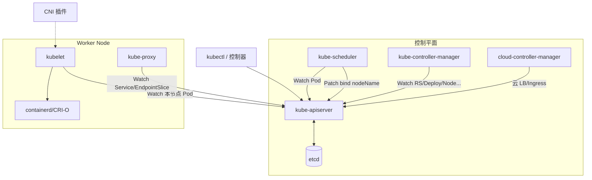
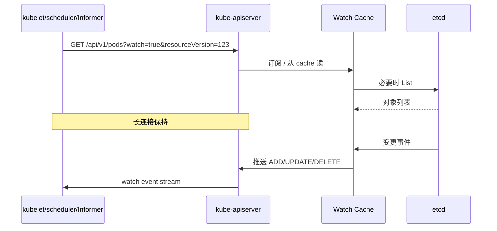
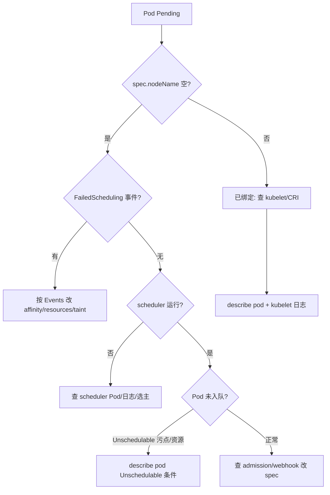

# Pod Pending 找不到凶手？kube-apiserver、etcd、scheduler、controller-manager 分工讲透

`kubectl get pod` 长期 `Pending`；`kubectl get nodes` 有 Ready 节点但调度不上；apiserver 间歇 503；etcd 报警 `database space exceeded`——控制平面五个组件（apiserver、etcd、scheduler、controller-manager、cloud-controller-manager）加 Node 侧 kubelet/kube-proxy，任意一环证书过期、选主失败或资源耗尽都会表现为「Workload 不动」。本文按 `kubernetes/kubernetes` 真实入口与 `pkg/` 实现，把 **Master/Node 分工、组件通信、绑核调度、证书与排障** 串成一条可验证主线。

## 阅读地图

1. **第一层：控制平面与 Node 拓扑**——解决「谁算 Master、谁跑 Workload、静态 Pod 与 kubeadm 布局差在哪」。
2. **第二层：kube-apiserver 与 etcd**——解决「唯一 API 入口如何持久化、Watch 如何支撑全集群 List」。
3. **第三层：kube-scheduler 绑核**——解决「Pending 时 scheduler 做了什么、Filter/Score 框架、Binding 如何写 nodeName」。
4. **第四层：kube-controller-manager 与 Node 组件**——解决「NodeController、ReplicaSet、Service、cloud-controller 各管什么；kubelet/kube-proxy 如何接 CRI/CNI」。
5. **第五层：通信、证书与 Pending/503 排障闭环**——解决「mTLS 链、组件健康检查、从事件到日志的定位顺序」。

## 源码锚点

| 路径 / 符号 | 作用 |
|-------------|------|
| `cmd/kube-apiserver/app/server.go` | apiserver 主入口 |
| `cmd/kube-apiserver/app/options/` | 启动参数：etcd 地址、TLS、准入 |
| `staging/src/k8s.io/apiserver/pkg/storage/etcd3/` | etcd3 存储后端 |
| `cmd/kube-scheduler/app/server.go` | scheduler 入口 |
| `pkg/scheduler/scheduler.go` | `ScheduleOne` 调度主循环 |
| `pkg/scheduler/framework/runtime/framework.go` | 调度 Framework：PreFilter/Filter/Score/Reserve/Bind |
| `pkg/scheduler/framework/plugins/noderesources/` | 资源 Filter（CPU/内存） |
| `pkg/scheduler/framework/plugins/interpodaffinity/` | Pod 亲和/反亲和 |
| `cmd/kube-controller-manager/app/controllermanager.go` | 控制器管理器入口、启动各 controller |
| `pkg/controller/nodelifecycle/node_lifecycle_controller.go` | 节点心跳与 Pod 驱逐 |
| `pkg/controller/replicaset/replica_set.go` | 副本对账 |
| `pkg/controller/service/service_controller.go` | LoadBalancer / NodePort 等 |
| `cmd/kube-cloud-controller-manager/` | 云厂商 LB、Route、Instance（可选） |
| `cmd/kubelet/app/server.go` | kubelet 入口 |
| `pkg/kubelet/kubelet.go` | 节点 Pod 同步主逻辑 |
| `cmd/kube-proxy/app/server.go` | kube-proxy 入口 |
| `pkg/proxy/` | iptables/IPVS/nftables 规则同步 |
| `staging/src/k8s.io/client-go/tools/leaderelection/` | scheduler/controller-manager 选主 |
| `plugin/pkg/admission/` | 准入插件 |

## 第一层：控制平面与 Node 拓扑

### 概念：Master 不是跑业务的机器

**控制平面（Control Plane）** 负责集群决策：API、调度、对账、etcd 持久化。**Node（Worker）** 跑 Pod 的实际进程，由 kubelet 驱动容器运行时。生产上控制平面常 dedicated 节点或托管（EKS/ACK/GKE control plane）。

典型 kubeadm 布局（以集群版本/安装方式为准）：

```
控制平面节点
├── etcd（或外部 etcd 集群）
├── kube-apiserver（静态 Pod，/etc/kubernetes/manifests/）
├── kube-scheduler
├── kube-controller-manager
└── （可选）kube-cloud-controller-manager

Worker 节点
├── kubelet
├── kube-proxy（DaemonSet 或静态 Pod）
└── 容器运行时（containerd / CRI-O）
```

### 机制：静态 Pod 与 DaemonSet

控制平面组件在 kubeadm 安装下常以 **Static Pod** 形式由 kubelet 拉起（manifest 在 `/etc/kubernetes/manifests/`），因此 `kubectl get pod -n kube-system` 能看到 `kube-apiserver-xxx`。kube-proxy 常见为 **DaemonSet**，每节点一份。

### 数据流总览



### 观测拓扑

```bash
kubectl get nodes -o wide
kubectl get pods -n kube-system -o wide
ls /etc/kubernetes/manifests/    # 控制平面节点上
systemctl status kubelet         # Node 上
```

## 第二层：kube-apiserver 与 etcd

### 概念：etcd 是控制面的唯一数据库

所有 API Object（Pod、Node、ConfigMap…）序列化后存 etcd。apiserver 是 **唯一** 应通过业务路径写 etcd 的组件（备份恢复、运维 etcdctl 除外）。多个 apiserver 实例共享同一 etcd，前面挂 LB（或 DNS 轮询），客户端 kubeconfig 的 `server` 指向 VIP。

### apiserver 核心职责

| 职责 | 说明 |
|------|------|
| REST API | GVR 路由、protobuf/JSON 编解码 |
| 认证 | x509 客户端证书、Bearer Token、Webhook |
| 授权 | RBAC、Node、Webhook |
| 准入 | Mutating/Validating Admission |
| Watch | 长连接推送变更给 scheduler/kubelet/Informer |
| Aggregation | 扩展 API Server 聚合 CRD / metrics |

启动链：`cmd/kube-apiserver/app/server.go` → 构建 `GenericAPIServer` → 注册 `pkg/registry/` 下各 REST storage → 连接 `--etcd-servers`。

### etcd 键空间（概念）

对象键类似（前缀以版本为准）：

```
/registry/pods/default/nginx-xxxxx
/registry/nodes/worker-1
/registry/services/specs/default/kubernetes
```

### 调用链：List-Watch



Watch cache 减轻 etcd 读压力，配置见 apiserver `--watch-cache-sizes`（以启动参数为准）。

### 配置与证书

apiserver 常用参数（`/etc/kubernetes/manifests/kube-apiserver.yaml` 或 systemd）：

```yaml
# 片段示例，以实际 manifest 为准
- --etcd-servers=https://127.0.0.1:2379
- --etcd-cafile=/etc/kubernetes/pki/etcd/ca.crt
- --etcd-certfile=/etc/kubernetes/pki/apiserver-etcd-client.crt
- --etcd-keyfile=/etc/kubernetes/pki/apiserver-etcd-client.key
- --client-ca-file=/etc/kubernetes/pki/ca.crt
- --tls-cert-file=/etc/kubernetes/pki/apiserver.crt
- --tls-private-key-file=/etc/kubernetes/pki/apiserver.key
- --authorization-mode=Node,RBAC
- --enable-admission-plugins=NodeRestriction,...
```

```bash
# 检查 apiserver Pod
kubectl get pod -n kube-system -l component=kube-apiserver
kubectl logs -n kube-system kube-apiserver-control-plane -c kube-apiserver --tail=30

# 健康探针
curl -k https://127.0.0.1:6443/livez?verbose
curl -k https://127.0.0.1:6443/readyz?verbose

# etcd 健康（在 etcd 节点）
ETCDCTL_API=3 etcdctl endpoint health \
  --endpoints=https://127.0.0.1:2379 \
  --cacert=/etc/kubernetes/pki/etcd/ca.crt \
  --cert=/etc/kubernetes/pki/etcd/healthcheck-client.crt \
  --key=/etc/kubernetes/pki/etcd/healthcheck-client.key
```

### 排障：apiserver / etcd 异常

| 现象 | 方向 |
|------|------|
| 503 / timeout | apiserver 过载、etcd 慢、网络；查 apiserver `--max-requests-inflight` |
| RBAC 正常但 list 空 | 选错 context；或 namespace |
| etcd no space | 压缩/defrag、quota；查 `etcdctl endpoint status` |
| 证书 x509 expired | `/etc/kubernetes/pki` 与 kubeadm certs renew |

## 第三层：kube-scheduler 绑核

### 概念：scheduler 只做一件事——给未绑定的 Pod 选 Node

Pod 创建后 `spec.nodeName` 为空且处于 Pending，**kube-scheduler** 通过 Informer watch 这些 Pod，运行 **Scheduling Framework** 插件链，选出节点后 **Binding**（PATCH pod/status 或 Bind subresource，以版本实现为准）写入 `nodeName`。容器 **不在 scheduler 里启动**，启动是 kubelet 的事。

### 调度框架阶段

源码：`pkg/scheduler/framework/runtime/framework.go`

| 阶段 | 作用 |
|------|------|
| PreFilter | 预检查，缩小 Node 集合 |
| Filter | 逐节点否决（资源不足、taint、亲和不满足） |
| PostFilter | 预选失败时的 preemption 等 |
| PreScore / Score | 打分优选 |
| Reserve / Permit | 预留、等待（GPU 等） |
| Bind | 写 nodeName |
| PostBind | 清理 |

默认插件在 `pkg/scheduler/framework/plugins/registry.go` 注册；启用/禁用通过 KubeSchedulerConfiguration（`kube-scheduler-config.yaml`）配置。

### 源码：`ScheduleOne`

```go
// pkg/scheduler/scheduler.go（逻辑摘要）
func (sched *Scheduler) ScheduleOne(ctx context.Context) {
    // 从 schedulingQueue 取 Pod
    // framework.RunPreFilter → RunFilterPlugins → RunScorePlugins
    // RunBindPlugins → 绑定 nodeName
}
```

调度队列：`internal/queue/` 处理 Pod 增删改与 backoff。

### 可执行：读 Pending 原因

```bash
kubectl describe pod pending-pod | grep -A5 Events
kubectl get events --field-selector reason=FailedScheduling

# scheduler 日志
kubectl logs -n kube-system -l component=kube-scheduler --tail=100

# 看 Pod 是否被调度
kubectl get pod pending-pod -o jsonpath='{.spec.nodeName}{"\n"}{.status.phase}{"\n"}'
```

### 常见 Filter 失败与 YAML 侧修复

| Events 关键词 | 含义 | 处理 |
|---------------|------|------|
| Insufficient cpu/memory | 节点可分配资源不足 | 缩 requests、加节点、查 overcommit |
| didn't match Pod's node affinity | 亲和/selector 无匹配 | 改 affinity 或给节点打 label |
| had taint X that pod didn't tolerate | Taint 未容忍 | `tolerations` 或 `kubectl taint nodes` |
| Too many pods | maxPods 上限 | 调 kubelet maxPods 或加节点 |
| volume node affinity conflict | PV 拓扑与调度冲突 | 改 storage class / topology |

### 手动绑定（绕过 scheduler，调试用）

```bash
kubectl patch pod pending-pod -p '{"spec":{"nodeName":"worker-1"}}' --type=merge
# 生产慎用：跳过 Filter 可能资源冲突
```

### 优先级与抢占

`PriorityClass` 高的 Pod 可能 **抢占** 低优先级 Pod（Preemption）。源码：`pkg/scheduler/framework/preemption/preemption.go`。

```bash
kubectl get priorityclass
kubectl describe pod high-pri-pod | grep -i preempt
```

## 第四层：kube-controller-manager 与 Node 组件

### kube-controller-manager：一堆 control loop

入口：`cmd/kube-controller-manager/app/controllermanager.go`，通过 **Leader Election** 选主后启动数十个 controller（可通过 `--controllers` 裁剪）。

| Controller | 职责 |
|------------|------|
| Deployment / ReplicaSet | 副本与滚动更新 |
| NodeLifecycle | 节点 Lease 心跳、Unreachable 驱逐 |
| Service / EndpointSlice | ClusterIP 后端列表 |
| PersistentVolume | PV/PVC bind |
| Namespace | Namespace 终止清理 |
| Job / CronJob | 批任务 |
| TTLAfterFinished | 完成 Pod 自动删 |

Node 心跳：kubelet 更新 **Lease** 对象（`coordination.k8s.io/v1`），NodeLifecycle 根据 `node.status.conditions` 标记 `Ready=False` 并驱逐 Pod。

```bash
kubectl get lease -n kube-node-lease
kubectl describe node worker-1 | grep -A3 Conditions
```

### cloud-controller-manager

云环境分离出的控制器：LoadBalancer Service 申请 LB、Node 路由、Instance ID 等。源码：`staging/src/k8s.io/cloud-provider/`。裸金属集群常不部署；Service `type=LoadBalancer` 会 Pending。

```bash
kubectl get pods -n kube-system -l component=cloud-controller-manager
```

### kubelet：节点上的「小控制平面」

入口：`cmd/kubelet/app/server.go`，核心 `pkg/kubelet/kubelet.go`。

职责摘要：

- 向 apiserver **注册 Node**（自 kubelet 启动）
- Watch **绑定到本节点** 的 Pod
- 通过 **CRI** 创建 sandbox 与业务容器
- 挂载 **Volume**（CSI/本地）
- 执行 **liveness/readiness** 探针
- 上报 **Pod/Node status**
- 拉取 **Secret/ConfigMap**（volume 或 env）

kubelet **不调度**；只执行 `spec.nodeName == 本节点` 的 Pod。

```bash
# Node 上
journalctl -u kubelet -f --no-pager | tail -50
crictl pods
crictl ps
```

### kube-proxy：Service 网络规则

Watch Service 与 EndpointSlice，在本机写入 iptables/IPVS/nftables 规则，实现 ClusterIP 负载均衡。入口 `cmd/kube-proxy/app/server.go`，模式 `--proxy-mode=iptables|ipvs|nftables`（以版本为准）。

```bash
kubectl get ds -n kube-system kube-proxy
kubectl logs -n kube-system -l k8s-app=kube-proxy --tail=30
iptables-save | grep KUBE-SVC   # iptables 模式
ipvsadm -Ln                     # ipvs 模式
```

### CRI / CNI / CSI 边界

| 接口 | 负责 | 典型实现 |
|------|------|----------|
| CRI | 容器生命周期 | containerd + cri plugin、CRI-O |
| CNI | Pod 网络 IP、路由 | Calico、Flannel、Cilium |
| CSI | 卷 attach/mount | 云盘插件、Rook-Ceph |

kubelet 调用 CNI 在 **sandbox 创建后** 配网；scheduler **不** 感知 CNI 细节，除非 Resource 插件声明 extended resource。

## 第五层：通信、证书与排障闭环

### 组件间通信：全部走 apiserver HTTPS

scheduler、controller-manager、kubelet、kube-proxy 都是 **apiserver 客户端**，使用 kubeconfig 或 in-cluster SA（`/var/run/secrets/kubernetes.io/serviceaccount/`）。**不**需要 scheduler 直连 kubelet。

mTLS 链（kubeadm 典型）：

```
cluster CA
├── apiserver.crt（server cert）
├── kubelet client cert（system:node:NAME）
├── kube-scheduler client cert
└── kube-controller-manager client cert
```

```bash
openssl x509 -in /etc/kubernetes/pki/apiserver.crt -noout -dates
kubeadm certs check-expiration    # 若使用 kubeadm
```

### 控制平面选主

多副本 scheduler / controller-manager 通过 **Lease** 选主：

```bash
kubectl get lease -n kube-system | grep -E 'scheduler|controller'
```

非 leader 的 scheduler 不执行 ScheduleOne；备 leader 切换时可能有秒级调度停顿。

### Pending 排障决策树



**步骤 1**：`kubectl describe pod` → Events  
**步骤 2**：`kubectl get nodes` → Ready？资源？Taint？  
**步骤 3**：`kubectl logs -n kube-system -l component=kube-scheduler`  
**步骤 4**：若已 nodeName，到对应节点 `journalctl -u kubelet`  
**步骤 5**：存储/PVC Pending 查 `kubectl get pvc`、`kubectl describe pvc`

### 503 / 控制面不可用

```bash
kubectl get --raw /healthz 2>&1
kubectl get --raw /readyz?verbose 2>&1
kubectl get ep -n default kubernetes   # apiserver Endpoints（legacy）或 EndpointSlice
ss -lntp | grep 6443                   # apiserver 节点
```

### Node NotReady 连锁

Node NotReady → NodeLifecycle 标记 → Pod 驱逐 → 工作负载 Pending（若无可调度节点）。查：

```bash
kubectl describe node problem-node
journalctl -u kubelet -n 100
ping / 网络 / CNI 是否正常
```

### 资源超额与 Overcommit

节点 `allocatable` 小于所有 Pod requests 之和时，scheduler Filter 失败。观测：

```bash
kubectl describe node worker-1 | grep -A5 Allocated
kubectl top nodes    # metrics-server 需安装
```

## 附录：kube-apiserver 高可用要点

- 多个 apiserver 实例 + LB；kubeconfig 指向 VIP  
- etcd 奇数节点（3/5）；避免跨 AZ 延迟过大（以 SLA 为准）  
- `--etcd-compaction-interval` 与备份策略  

## 附录：Scheduler 配置文件示例

```yaml
# KubeSchedulerConfiguration v1（字段以当前 API 为准）
apiVersion: kubescheduler.config.k8s.io/v1
kind: KubeSchedulerConfiguration
profiles:
  - schedulerName: default-scheduler
    plugins:
      score:
        disabled:
          - name: NodeResourcesBalancedAllocation
```

```bash
kubectl get cm -n kube-system kube-scheduler -o yaml
```

## 附录：Controller-manager 标志

```bash
# 查看实际启动参数
kubectl get pod -n kube-system kube-controller-manager-control-plane -o yaml | grep -A200 command
```

常用：`--node-monitor-grace-period`、`--pod-eviction-timeout` 影响 Node 故障时 Pod 驱逐速度。

## 附录：Endpoints 与 EndpointSlice

Service 后端由 **EndpointSlice controller**（`pkg/controller/endpointslice/`）维护。kube-proxy 默认 watch EndpointSlice。排障 Service 不通：

```bash
kubectl get endpointslice
kubectl get endpoints
```

## 附录：kubelet 注册与 CSR

bootstrap kubelet 可通过 **CSR** 申请客户端证书（`certificates.k8s.io`）。证书轮换：`kubelet --rotate-certificates=true`（默认 true）。

```bash
kubectl get csr
```

## 附录：Static Pod 镜像与版本 skew

控制平面组件版本应满足官方 **skew policy**（通常 minor 差 1 以内，以文档为准）。kubelet 版本高于 apiserver minor+1 可能被拒。

## 附录：系统组件 Service

`default/kubernetes` Service 指向 apiserver Endpoints，Pod 内访问 API 用 `https://kubernetes.default.svc`。

```bash
kubectl run curl --rm -it --image=curlimages/curl -- curl -k https://kubernetes.default.svc/healthz
```

## 附录：PodSecurity / SCC

Admission 可能禁止 Pod 在某 namespace 调度或创建，表现为 create 失败而非 Pending（以集群策略为准）。

## 附录：Topology Spread Constraints

`topologySpreadConstraints` 由 scheduler 插件 `PodTopologySpread` 处理；不满足时 FailedScheduling 会说明 spread constraint。

```bash
kubectl explain pod.spec.topologySpreadConstraints
```

## 附录：Extended Resources 与 Device Plugin

GPU 等资源由 **Device Plugin** 上报为 `nvidia.com/gpu` 等 extended resource；scheduler `NodeResourcesFit` 检查。Pod requests 无可用节点则 Pending。

```bash
kubectl describe node | grep -A10 Capacity
kubectl get pod -o json | jq '.items[].spec.containers[].resources'
```

## 附录：Multiple schedulers

Pod `spec.schedulerName` 非 default 时使用自定义 scheduler profile；若对应 scheduler 未部署，Pod 永久 Pending。

```bash
kubectl get pod my-pod -o jsonpath='{.spec.schedulerName}{"\n"}'
```

## 附录：Pod 优先级与 QoS 对调度的影响

QoS（Guaranteed/Burstable/BestEffort）由 requests/limits 推导，影响 **驱逐顺序**，不直接决定 scheduler 选节点（除非资源 Filter）。

## 附录：NetworkPolicy 与调度

NetworkPolicy 由 CNI 实现，**不** 参与 scheduler Filter；Pod 调度成功后可能网络不通，别与 Pending 混淆。

## 附录：kube-proxy IPVS 模式

```bash
kubectl edit cm kube-proxy -n kube-system   # 改 config.conf mode: ipvs
# 需重启 kube-proxy Pod，以发行版文档为准
```

## 附录：etcd 备份恢复（运维边界）

```bash
ETCDCTL_API=3 etcdctl snapshot save /backup/etcd-$(date +%F).db \
  --endpoints=https://127.0.0.1:2379 \
  --cacert=... --cert=... --key=...
```

恢复需停 apiserver、按官方 restore 流程（以版本为准），勿在生产随意操作。

## 附录：apiserver 审计与 tracing

排障慢请求：apiserver `--request-timeout`、etcd 延迟 metrics：

```bash
kubectl get --raw /metrics | grep etcd_request
kubectl get --raw /metrics | grep apiserver_request_duration
```

## 附录：组件身份（User-Agent）

apiserver audit 里 `userAgent` 可区分 scheduler、kubelet、kubectl：

```
system:kube-scheduler
system:node:worker-1
kubectl/v1.29.x
```

## 附录：Pod 已绑定仍 Pending

若 `nodeName` 已设但 phase 仍 Pending，多为 **kubelet 未接受**（Node NotReady、Pod 被 admission 拒、CRI 失败）或 **镜像拉取**：

```bash
kubectl describe pod | grep -E 'Ready|ContainersReady|PodScheduled'
```

Condition `PodScheduled=True` 但 `ContainersReady=False` → 查 kubelet/CRI。

## 附录：Taint 管理

```bash
kubectl taint nodes worker-1 dedicated=foo:NoSchedule
kubectl taint nodes worker-1 dedicated=foo:NoSchedule-
```

控制平面节点常有 `node-role.kubernetes.io/control-plane:NoSchedule`，普通 Pod 需 toleration 或去掉 taint（不推荐在 Master 跑业务）。

## 附录：Cordon 与 Drain

```bash
kubectl cordon worker-1
kubectl drain worker-1 --ignore-daemonsets --delete-emptydir-data
```

cordon 后 scheduler 不再绑定新 Pod；drain 驱逐已有 Pod。

## 附录：总结对照

| 组件 | 输入 | 输出 | 关键源码 |
|------|------|------|----------|
| apiserver | HTTP REST | etcd 读写 | `cmd/kube-apiserver` |
| etcd | 键值 | 持久化 | 外部 etcd 项目 |
| scheduler | Pending Pod | nodeName | `pkg/scheduler/` |
| controller-manager | 各类对象 | spec/status 对账 | `pkg/controller/` |
| kubelet | 本节点 Pod | CRI 容器 | `pkg/kubelet/` |
| kube-proxy | Service/EP | 本机规则 | `pkg/proxy/` |

Pending 排障：**先看 Events 是不是 scheduler，再看 nodeName 有没有，最后 kubelet**；503 **先 apiserver/etcd 健康与证书**。
