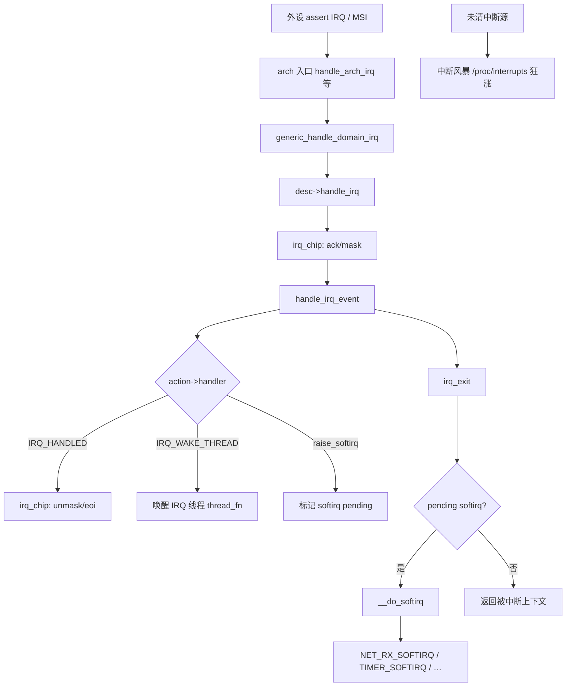
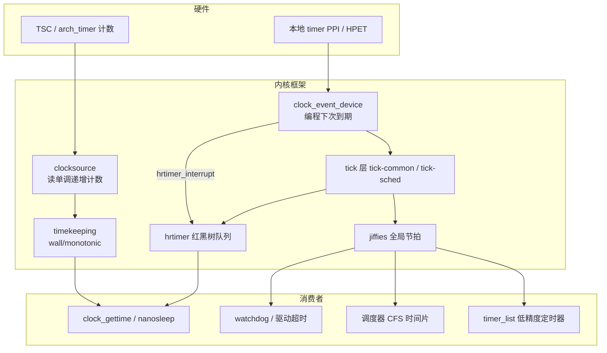

# Linux 中断与时间子系统完整篇：从 request_irq、clockevents 到 hrtimer/jiffies 排障

线上常见三类告警彼此纠缠：`/proc/interrupts` 某行计数秒级暴涨（中断风暴）、`ksoftirqd/0` 长期占满 CPU（下半部堆积）、`clock_gettime` 测出的间隔 P99 突然拉长（tick/hrtimer 唤醒延迟）。它们分属 **通用 IRQ 层** 与 **时间子系统**，但共享同一批 per-CPU 资源：硬中断里关本地 IRQ 的窗口、softirq 批量处理、`clockevent` 编程的 oneshot 到期。只盯 chrony offset 或只绑 IRQ affinity 往往治标不治本。

读驱动代码时常见困惑：`request_irq` 注册的是哪一层 IRQ 号？`jiffies` 与 `ktime` 何时该用？`CONFIG_NO_HZ=y` 后定时器为何「变慢」？这些问题横跨 `kernel/irq/` 与 `kernel/time/`，需要一张统一的调用地图。

本文按内核真实路径，把 **request_irq → irq_chip → irq_exit → __do_softirq** 与 **clockevent → tick → jiffies/hrtimer → timekeeping** 合成一篇可验证长文。读完应能：对照 `/proc/interrupts` 与 `/proc/timer_list` 判断问题在中断侧还是时间侧；按 Kconfig 解释 NO_HZ 下 jiffies 行为；用 Checklist 逐项排除丢失 tick、hrtimer 不准与中断风暴。

---

## 源码锚点

| 路径 | 作用 |
|------|------|
| `kernel/irq/manage.c` | `request_irq`、`request_threaded_irq`、`free_irq`、`__setup_irq` |
| `kernel/irq/chip.c` | `irq_chip`：`mask`/`unmask`/`ack`/`eoi` |
| `kernel/irq/handle.c` | `handle_irq_event`、`handle_irq_event_percpu` |
| `kernel/irq/irqdesc.c` | `irq_desc`、irq 状态、affinity |
| `kernel/softirq.c` | `irq_exit` → `invoke_softirq` → `__do_softirq` |
| `kernel/time/clocksource.c` | 注册/评级 `clocksource`（TSC、arch_timer 等） |
| `kernel/time/clockevents.c` | `clockevents_register_device`、事件设备抽象 |
| `kernel/time/tick-common.c` | `tick_handle_periodic`、`tick_do_update_jiffies64` |
| `kernel/time/tick-sched.c` | NO_HZ：`tick_sched_timer`、idle 停 tick |
| `kernel/time/hrtimer.c` | `hrtimer_interrupt`、`__hrtimer_run_queues` |
| `kernel/time/timer.c` | `timer_list`、`run_timer_softirq`（`TIMER_SOFTIRQ`） |
| `kernel/time/timekeeping.c` | `update_wall_time`、NTP 步进/微调 |
| `include/linux/interrupt.h` | `IRQF_*`、`irqreturn_t` |
| `include/linux/hrtimer.h` | `hrtimer_init`、`HRTIMER_MODE_*` |

IRQ 注册入口（驱动与内核模块通用）：

```c
/* kernel/irq/manage.c → __setup_irq */
int request_threaded_irq(unsigned int irq,
			 irq_handler_t handler,
			 irq_handler_t thread_fn,
			 unsigned long flags,
			 const char *name, void *dev);
/* handler: 硬中断；thread_fn: 可睡眠的 IRQ 线程 */
```

clockevent 设备注册：

```c
/* kernel/time/clockevents.c */
void clockevents_register_device(struct clock_event_device *dev);
/* tick 层绑定 tick_handler，oneshot 模式供 hrtimer 复用 */
```

hrtimer 到期处理：

```c
/* kernel/time/hrtimer.c */
void hrtimer_interrupt(struct clock_event_device *dev)
{
	__hrtimer_run_queues();
	/* reprogram clockevent 到下一最近 hrtimer 到期点 */
}
```

softirq 触发条件：

```c
/* kernel/softirq.c */
asmlinkage __visible void __softirq_entry __do_softirq(void)
{
	unsigned long end = jiffies + MAX_SOFTIRQ_TIME;
	/* 按 pending 位调用 softirq_vec[nr].action() */
}
```

---

## 调用链

### 外设 IRQ 到 softirq（主路径）



### 时间子系统分层与数据流



文字版串联（对照 ftrace 栈）：

```text
clockevent 到期
  → tick_handler (periodic 或 oneshot)
      → tick_do_update_jiffies64 → jiffies++
      → update_process_times / scheduler tick
      → hrtimer_interrupt → __hrtimer_run_queues
  → raise_softirq(TIMER_SOFTIRQ)
      → run_timer_softirq  /* 低精度 timer_list */

用户态读时间
  → clock_gettime
      → timekeeping_get_ns / ktime_get
          → clocksource 计数 + NTP 偏移
```

---

## 重点知识

### 1. request_irq 与 irq_chip：谁管「线」，谁管「活」

`request_irq` / `request_threaded_irq` 在 `kernel/irq/manage.c` 的 `__setup_irq` 中，把 `struct irqaction`（含 `handler`、`thread_fn`、`dev_id`）挂到全局 `irq_desc[irq]`。**handler 运行在硬中断上下文**：不可调度、不可睡眠、不宜长时间持锁。违反约束时内核打印 `BUG: sleeping function called from invalid context`，严重时 watchdog 或 soft lockup。

**irq_chip**（`kernel/irq/chip.c`）封装中断控制器对「一根线」的操作：`irq_mask`、`irq_unmask`、`irq_ack`、`irq_eoi`。ARM GIC、x86 IOAPIC 各自实现 chip；通用层在 `handle_irq_event` 前后按触发类型（边沿/电平）调用 chip，保证应答顺序正确。边沿触发：通常 ack 后线自动恢复；电平触发：必须读设备状态寄存器并写清除位，否则线一直有效。

电平触发 IRQ 若在 handler 返回前未清源，退出 hardirq 立刻再进 → **中断风暴**，`/proc/interrupts` 对应行计数秒级上万，系统卡在 `__do_softirq` 或 hardirq 里，SSH 无响应。此时应优先在驱动 ISR 里确认「读状态 → 写 ACK → 再 unmask」顺序，而不是盲目调大 `printk` 级别。

共享中断必须 `IRQF_SHARED`，且各 `dev_id` 唯一；某 handler 返回 `IRQ_NONE` 表示「不是本设备」，内核继续遍历 action 链。`IRQF_ONESHOT` 常与 `request_threaded_irq` 联用：hardirq 里 mask 该线，等 `thread_fn` 跑完再由内核 unmask，防止线程处理期间重入。线程化路径：`handler` 做最少清源后返回 `IRQ_WAKE_THREAD`，`thread_fn` 在 per-IRQ 内核线程（`irq/<n>-<name>`）里运行，可 `mutex_lock`、阻塞读 I2C。启动参数 `threadirqs` 配合 `CONFIG_IRQ_FORCED_THREADING` 可强制所有非快速 IRQ 线程化，便于用常规栈分析工具看「本应在 hardirq 里的重活」。

线程化 IRQ 在内核里表现为独立线程，可用 `ps` 过滤 `irq/` 前缀观察是否在 D 状态阻塞。

```bash
# 观测 IRQ 分布与绑核
cat /proc/interrupts | column -t
echo <hex_mask> > /proc/irq/<n>/smp_affinity
echo <hex_mask> > /proc/irq/<n>/smp_affinity_list   # 部分内核支持
cat /proc/softirqs
ps -eLo pid,tid,class,rtprio,comm | grep 'irq/'
```

### 2. irq_exit 到 __do_softirq：hardirq 与 softirq 的衔接

`kernel/softirq.c` 中，`irq_exit()` 在**退出最后一层硬中断**且存在 pending softirq 时，调用 `invoke_softirq` → `__do_softirq`。设计意图：hardirq 只做应答与标记，吞吐型工作在 softirq 批量完成，避免在关中断窗口里跑协议栈或遍历定时器链表。

常见向量：`NET_RX_SOFTIRQ`（NAPI 收包）、`TIMER_SOFTIRQ`（`timer_list` 到期）、`TASKLET_SOFTIRQ`（驱动轻量延后，新代码更推荐 threaded IRQ）。`raise_softirq` 可在 hardirq 里调用；`raise_softirq_irqoff` 在已关本地 IRQ 时使用。注意：**softirq 上下文同样不可睡眠**，在 `net_rx_action` 里 `mutex_lock` 仍会触发 BUG。

若单次 `__do_softirq` 超过 `MAX_SOFTIRQ_TIME`（基于 jiffies），剩余 pending 交给 `ksoftirqd/<cpu>`——表现为 **ksoftirqd 占满** 而 hardirq 计数并不高。此时应查 NET_RX 是否因单核 PPS 过高、或某 softirq handler 被异常拉长（如关 preempt 过久），而非继续压缩 hardirq。

网卡完整路径：hardirq → `napi_schedule` → `NET_RX_SOFTIRQ` → `net_rx_action` → 驱动 `poll` → 协议栈。定时器路径：tick 或 `mod_timer` → pending `TIMER_SOFTIRQ` → `run_timer_softirq` → 各 `timer_list` 回调。hrtimer **不经过** TIMER_SOFTIRQ，而走 clockevent oneshot 独立到期。

排障时同时看 `/proc/interrupts` 与 `/proc/softirqs`：IRQ 全堆 CPU0 时，同核 softirq 也会挤在一起，其它核 idle。高 PPS 场景配合 RSS 多队列、RPS/XPS 把软中断分散到处理 CPU；延迟敏感线程用 `taskset` 或 cgroup cpuset 避开「IRQ + softirq 热核」。

```bash
perf top -e irq:softirq_entry -e irq:irq_handler_entry
watch -n1 'cat /proc/softirqs | head -5'
trace-cmd record -e irq:softirq_entry -e irq:irq_handler_exit sleep 3
```

### 3. clocksource 与 clockevent：读时 vs 到时

二者职责严格分离，混谈是排障大坑：

| 框架 | 方向 | 典型硬件 | 内核用途 |
|------|------|----------|----------|
| **clocksource** | 只读递增计数 | TSC、arch_timer | `ktime_get`、timekeeping、性能测量 |
| **clockevent** | 编程「下次 IRQ 时刻」 | 本地 timer PPI、HPET 通道 | 周期性 tick、hrtimer oneshot |

启动时 `clocksource` 框架按 rating 选择最优源（`kernel/time/clocksource.c`）；可通过 boot 参数 `clocksource=xxx` 强制指定，排查 TSC 不稳定或 VM 迁移后的跳变。`clockevents_register_device` 把 per-CPU 事件设备交给 tick 层（`kernel/time/clockevents.c`），每个 CPU 通常绑定本地 arch timer 作为 tick 设备。

**clocksource 异常**表现为 `ktime_get` 回退、性能计数器前后矛盾；**clockevent 编程错误**表现为 tick 丢失、hrtimer 集体迟到、某 CPU 的 `/proc/timer_list` 中 `next event` 长期不更新。虚拟化环境还需注意：guest 的 clockevent 可能是 kvm 模拟的，与 bare metal 行为不同。

```bash
cat /sys/devices/system/clocksource/clocksource0/current_clocksource
cat /sys/devices/system/clockevents/clockevent0/current_device 2>/dev/null
grep -E 'jiffies|clocksource|clockevent' /proc/timer_list | head -25
```

### 4. tick、jiffies、NO_HZ 与「丢失 tick」

`CONFIG_HZ`（常见 250/1000）决定每秒 tick 次数，jiffies 精度 ≈ 1/HZ。`kernel/time/tick-common.c` 中 `tick_do_update_jiffies64` 在 tick 处理路径递增 jiffies，驱动调度器时间片、`timer_list`、watchdog、`process_times` 统计等。`jiffies_64` 是全局变量，用户态通过 `gettimeofday` 间接依赖 timekeeping，而非直接读 jiffies。

tick 处理还调用 `update_process_times` 更新 CPU 时间片、`run_local_timers` 触发 per-CPU 定时器。理解这一点：`timer_list` 的精度上限就是 tick 粒度，除非配置 `CONFIG_NO_HZ_HIGHRES` 等增强路径。

`CONFIG_NO_HZ`（动态 tick，`kernel/time/tick-sched.c`）下，idle CPU 通过 `tick_nohz_idle_enter` 停止周期性 tick，仅在最近 hrtimer 到期或 RCU 需要时 reprogram clockevent——**jiffies 在 idle 核上更新变慢是预期行为**，`/proc/timer_list` 里 idle CPU 的 `idle expires` 会拉得很远。容器/host 混合部署时，guest idle 也会减少 host 侧无效 tick 中断，这是虚拟化省电的基础。

若 **busy 系统** 出现调度延迟异常、watchdog 误报、hrtimer 集体迟到，才怀疑 **丢失 tick**：某驱动路径长时间 `local_irq_disable` 超过一个 tick 窗口，clockevent 到期被延迟处理；或 NO_HZ 迁移/CPU hotplug 边界 bug（查内核版本 release note）。`CONFIG_NO_HZ_FULL` 把 tick 进一步限制在 housekeeping CPU，适合 HPC/实时，但部署复杂，误配会导致 RCU stall。

调试时可临时 `nohz=off` 启动对比现象是否消失；busy 场景用 `trace_irqsoff`、`ftrace function_graph` 找关中断过长片段；对照 `/proc/timer_list` 各 CPU 的 `jiffies` 是否同步推进。

```bash
grep -E 'CONFIG_HZ|CONFIG_NO_HZ|CONFIG_HIGH_RES_TIMERS' /boot/config-$(uname -r)
# 或 zcat /proc/config.gz 2>/dev/null | grep CONFIG_HZ
```

### 5. hrtimer 与 timer_list：两条定时路径

| | `timer_list` | `hrtimer` |
|--|--------------|-----------|
| 实现文件 | `kernel/time/timer.c` | `kernel/time/hrtimer.c` |
| 时间基准 | jiffies | ktime（通常 CLOCK_MONOTONIC） |
| 到期机制 | `TIMER_SOFTIRQ` | clockevent oneshot + `hrtimer_interrupt` |
| 典型精度 | ~1 tick（ms 级） | 亚毫秒～微秒（视 `CONFIG_HIGH_RES_TIMERS`） |
| 用户态接口 | `alarm`、粗粒度内核超时 | `nanosleep`、`timerfd`、精确 deadline |

`hrtimer` 按 CPU 维护红黑树队列（`hrtimer_bases`），最近到期时间决定 clockevent 下次编程值。`hrtimer_interrupt` 在 tick 处理或独立 oneshot 到期时批量执行到期回调；周期定时器在回调里 `hrtimer_forward_now` 并返回 `HRTIMER_RESTART`。内核调度器的 `sched_clock`、CFS 带宽控制、高精度 sleep 都依赖这条路径。

**hrtimer 不准** 常见根因：驱动用 `mod_timer` 做 100µs 采样（选型错误，应改 `hrtimer` 或硬件定时器）；服务器 `CONFIG_HIGH_RES_TIMERS=n`（极少见）；CPU 深度 C-state 导致 wakeup latency 变大；benchmark 用 `CLOCK_REALTIME` 测间隔遭遇 NTP step；hrtimer 回调与 NET_RX softirq 同核，到期被推迟。应用侧延迟测量统一 `clock_gettime(CLOCK_MONOTONIC, …)`；需要不受 freq 调整影响用 `CLOCK_MONOTONIC_RAW`。多媒体同步才考虑 `CLOCK_REALTIME`，且必须处理 step 回调。

```bash
cyclictest -p 80 -i 1000 -l 5000    # 需 rt-tests，评估 wakeup 延迟
grep HRTIMER /proc/timer_list | head
```

### 6. timekeeping 与 NTP/chrony

`kernel/time/timekeeping.c` 维护 `struct timekeeper`：把 clocksource 原始计数转换为 `timespec64` 的 wall time 与 monotonic。`update_wall_time` 在 tick 路径周期性调用，累加 tick 长度；NTP 子系统通过 `ntp_tick_length` 微调每 tick 纳秒数，或通过 `timekeeping_inject_offset` **步进** wall time。

用户态 `clock_gettime(CLOCK_REALTIME)` 读 wall time；`CLOCK_MONOTONIC` 读自 boot 起单调时间，允许 NTP freq 微调但不 step。`hrtimer` 默认 CLOCK_MONOTONIC，不受 step 影响；若业务用 REALTIME 做绝对 deadline，chrony 一次大步进会导致「所有绝对定时器同时错位」。容器里还需注意 PID namespace 与 time namespace（较新内核）对 clock 视图的影响。

生产环境 chrony 监控 offset 与 last adjust；步进前后检查 cron、证书有效期校验、分布式事务超时等依赖 wall clock 的业务。虚拟机场景同时看 host/guest 时间同步策略，避免双重 NTP 打架。

```bash
chronyc tracking
timedatectl status
adjtimex -p                                    # 查看 tick 微调状态
```

### 7. Kconfig 与内核参数速查

| 选项 / 参数 | 含义 |
|-------------|------|
| `CONFIG_HZ` | tick 频率，影响 jiffies 粒度与定时器中断开销 |
| `CONFIG_HIGH_RES_TIMERS` | 启用 hrtimer 高精度 oneshot |
| `CONFIG_NO_HZ` / `CONFIG_NO_HZ_FULL` | 动态 tick / 全核 tickless（实时/低延迟场景需评估） |
| `CONFIG_IRQ_FORCED_THREADING` + `threadirqs` | 强制 threaded IRQ，便于栈分析与减少 hardirq 占用 |
| `CONFIG_GENERIC_IRQ_DEBUGFS` | debugfs 查看 irq 内部状态 |
| `clocksource=tsc` | 启动时指定 clocksource，排查源切换问题 |
| `nohz=off` | 关闭动态 tick，对比 tick 相关故障 |

`make menuconfig` 中 IRQ 相关项在 **General setup → Timers subsystem** 与 **Kernel Features**；修改 HZ 或 HIGH_RES_TIMERS 需重编内核，运行时只能调 affinity、coalescing 等外围参数。发行版内核可用 `/boot/config-$(uname -r)` 或 `zcat /proc/config.gz` 核对实际编译选项，避免文档默认值与现场不符。

### 8. 性能优化：先度量，再动刀

优化顺序：**PPS/延迟基线 → 定位瓶颈 CPU → 最小改动验证**。无数据支撑的「调小 HZ」「盲目绑核」可能恶化尾延迟。

- **IRQ 侧**：多队列网卡开 RSS/NAPI；`smp_affinity` 或 irqbalance 分散 hardirq；ethtool 调 interrupt coalescing（降 PPS 换延迟，需压测 trade-off）；未知设备 spam IRQ 时在内核侧 rate limit（驱动层更应清源）。
- **softirq 侧**：RPS/RFS 把 NET_RX 分散到处理 CPU；`/proc/sys/net/core/rps_sock_flow_entries` 与队列 map 配合；极高 PPS 评估 XDP 绕过部分协议栈路径。
- **时间侧**：延迟敏感线程与 heavy IRQ/softirq 异核；`isolcpus` + `nohz_full` 用于实时分区（需整体方案，非单点 sysctl）；固定 tick（`nohz=off`）在实时采样场景有时反而更可预测，与 tickless 省电目标相反，需按负载选型。

案例：10GbE 中断全在 CPU0，配置 RSS 与 irq affinity 后吞吐提升约 40%——根因是单核 hardirq + softirq 饱和，而非协议栈算法。改动后应用 `iperf3` + `mpstat -P ALL 1` 确认各核利用率均衡，并用 `ethtool -c` 记录 coalescing 参数便于回滚。

### 9. 三类典型故障：现象 → 根因 → 命令

**中断风暴**：某 IRQ 计数暴涨、系统无响应。根因：电平触发未清设备状态；handler 误返回 `IRQ_HANDLED`；共享 IRQ 标志/ dev_id 错误；MSI 映射重复导致一报多处理。命令：`cat /proc/interrupts` 定位号 → `trace-cmd record -e irq:irq_handler_entry -e irq:irq_handler_exit` → 查驱动 ISR 是否写 ACK/EOI；临时 `echo 0 > /proc/sys/kernel/printk` 前保存 dmesg。修复后回归压测确认计数随负载线性增长而非指数。

**丢失 tick / jiffies 异常**：busy 下调度延迟尖刺、watchdog 超时。根因：长时间关中断；clockevent reprogram 错误；特定 NO_HZ 版本 bug；迁移过程中 tick 设备未正确 handoff。命令：`trace_irqsoff`、`/proc/timer_list` 看各 CPU `jiffies` 与 `next_timer`；对比 `nohz=off` 启动是否缓解。

**hrtimer 不准 / 定时器集体漂移**：根因：`HIGH_RES_TIMERS` 关闭；jiffies 定时器硬做亚毫秒；NTP step 影响 REALTIME 逻辑；深度 C-state。命令：`cyclictest`、`grep CONFIG_HIGH_RES_TIMERS`、改用 MONOTONIC；查 `intel_pstate`/`cpufreq` 策略是否过于激进。

---

## Checklist

- [ ] 能口述「clockevent 到期 → tick → jiffies++ → hrtimer_interrupt」与「IRQ → irq_exit → __do_softirq」两条链，并指出对应源文件
- [ ] 读 `/proc/interrupts` 与 `/proc/softirqs`，确认 IRQ/softirq 未单核打满
- [ ] 区分 clocksource（读时）与 clockevent（到时），能查看 `current_clocksource`
- [ ] 按精度在 `timer_list`/jiffies 与 hrtimer 间正确选型；延迟测量用 `CLOCK_MONOTONIC`
- [ ] 核对 `CONFIG_HZ`、`CONFIG_HIGH_RES_TIMERS`、`CONFIG_NO_HZ` 与现场现象一致
- [ ] 中断风暴时定位 IRQ 号，确认 handler 清源与 irq_chip ack/eoi 顺序
- [ ] NO_HZ 环境下理解 idle 核 jiffies 更新变慢属预期；busy 延迟异常才查丢失 tick
- [ ] 生产用 chrony 监控 offset；NTP step 后检查依赖 `CLOCK_REALTIME` 的业务
- [ ] 高 PPS 场景评估 IRQ affinity、NAPI、中断合并与 RPS/XPS 组合，改动前后有 P99 基线

---

## 小结

Linux 将 **异步事件（IRQ + irq_chip + softirq）** 与 **时间推进（clocksource + clockevent + tick + timekeeping）** 拆成两层正交框架，再在 jiffies/hrtimer 上服务调度器与用户态。IRQ 路径追求「极短 hardirq + 批量 softirq」；时间路径追求「精确读时 + 按需到时」，NO_HZ 在二者交汇处做省电权衡。

排障时先定现象属于中断侧还是时间侧，再沿本文锚点下钻：风暴看 irq_chip 与 ISR 清源；ksoftirqd 打满看 NET_RX 与 affinity；定时不准看 hrtimer 与 clocksource/clockevent 配置。多数线上问题落在 affinity 未配、hardirq 过重、定时器类型选错、NO_HZ 与 REALTIME 误用四类。用 Checklist 逐项验证，通常能在不改内核的前提下收敛到具体一层。
