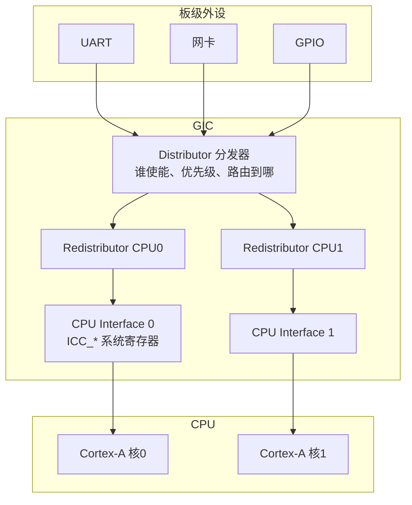
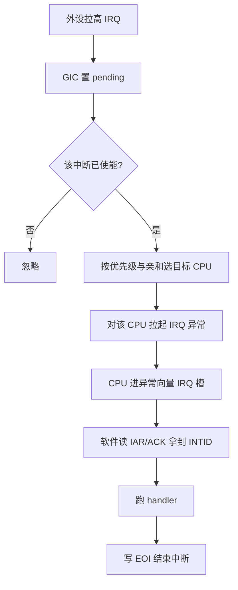
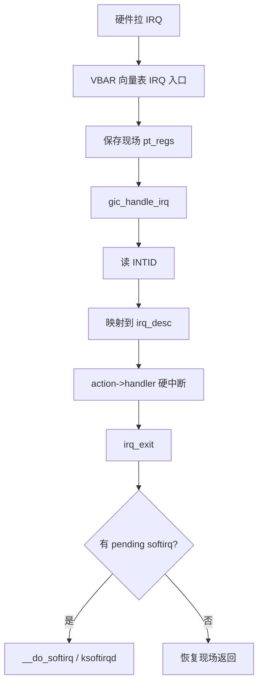
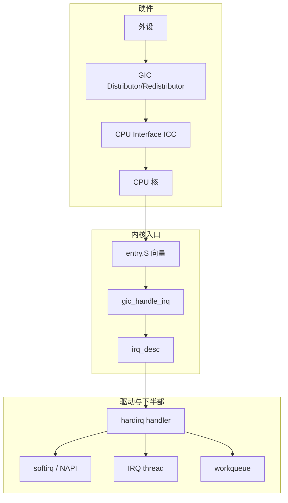

# 一篇搞懂 Linux 中断：从引脚、GIC 到 softirq 的完整链路

很多人第一次读驱动代码，看到 `request_irq()` 就懵：中断是硬件拉一根线？还是软件里的一个回调？为什么有 hardirq、softirq、threaded IRQ？ARM 板上的 **GIC** 又插在哪一层？

本文按「硬件现象 → 中断控制器 GIC → CPU 异常入口 → Linux 通用 IRQ 层 → 驱动注册 → 下半部」一条线讲完，目标是：**读完能自己对照 `/proc/interrupts`、设备树和 `request_irq` 把整条路画出来**。

---

## 源码锚点

| 路径 | 作用 |
|------|------|
| `arch/arm64/kernel/entry.S` | 异常向量表；IRQ 槽跳进内核 |
| `arch/arm64/kernel/irq.c` | `handle_arch_irq`、架构侧 IRQ 入口 |
| `drivers/irqchip/irq-gic-v3.c` | GICv3 驱动：Distributor / Redistributor |
| `drivers/irqchip/irq-gic.c` | GICv2 驱动（很多老板子） |
| `include/linux/irqchip/arm-gic-v3.h` | `GICD_*` / `GICR_*` 寄存器偏移 |
| `kernel/irq/manage.c` | `request_irq` / `request_threaded_irq` |
| `kernel/irq/chip.c` / `kernel/irq/irqdesc.c` | `irq_desc`、irqchip 操作 |
| `kernel/irq/irqdomain.c` | hwirq ↔ Linux virq 映射 |
| `kernel/softirq.c` | `irq_exit` → `__do_softirq` |
| `include/linux/interrupt.h` | `IRQF_*`、`request_irq` 声明 |
| `Documentation/core-api/irq/` | 内核官方 IRQ 文档 |

驱动侧最常见的注册：

```c
/* include/linux/interrupt.h */
int request_threaded_irq(unsigned int irq,
			 irq_handler_t handler,
			 irq_handler_t thread_fn,
			 unsigned long flags,
			 const char *name, void *dev);
```

GICv3 Distributor 使能相关寄存器（头文件常量）：

```c
/* include/linux/irqchip/arm-gic-v3.h */
#define GICD_CTLR			0x0000
#define GICD_ISENABLER			0x0100
#define GICD_IPRIORITYR			0x0400
/* Redistributor / CPU interface 另有 GICR_*、系统寄存器 ICC_* */
```

---

## 先建立直觉：中断到底是什么？

把 CPU 想象成一个**只会按序执行指令**的工人。外设（网卡、UART、定时器）有事要办时，不能指望工人不停轮询「有没有活」——那样太费电、太慢。于是外设拉高一根（或一组）信号：**「我有事」**。这就是硬件中断请求。

CPU 在合适的时机（当前指令边界、且本核未关中断）响应：

1. 记下「我刚才执行到哪」
2. 跳到约定好的入口（异常向量）
3. 跑内核的中断处理代码
4. 处理完再回到刚才的地方

所以：**中断 = 硬件异步事件 + CPU 被迫切换执行路径 + 软件恢复现场**。  
用户态的 `SIGINT`、内核的 softirq，名字里都有「中断」，但和「引脚拉高」不是同一层——后面会分层讲清。


---

## 硬件层：IRQ 编号不是「随便一个整数」

在 ARM 体系里，常见三类中断源（以 GIC 术语）：

| 类型 | 典型范围（概念） | 含义 |
|------|------------------|------|
| **SGI** | 0–15 | Software Generated Interrupt，核间 IPI（调度、TLB 刷等） |
| **PPI** | 16–31 | Private Peripheral Interrupt，每核私有（本地定时器等） |
| **SPI** | 32 起 | Shared Peripheral Interrupt，板级外设共享，可路由到多核 |

注意：

- **hwirq**：控制器眼里的硬件号（设备树 `interrupts = <GIC_SPI 40 …>` 里的 40）。
- **virq / Linux IRQ**：`request_irq(irq, …)` 里的 `irq`，是 Linux 映射后的号。  
  两者通过 **irqdomain** 转换；不要假定「设备树写 40，驱动里就 request 40」。

设备树里常见写法（示意）：

```dts
interrupts = <GIC_SPI 40 IRQ_TYPE_LEVEL_HIGH>;
interrupt-parent = <&gic>;
```

启动后内核把该 SPI 映射成某个 virq，再出现在 `/proc/interrupts` 左列。

---

## GIC：ARM 板上的「中断总机」

没有 GIC，几十上百根外设 IRQ 线没法有序送到多核 CPU。  
**GIC（Generic Interrupt Controller）** 就是 ARM 生态的标准中断控制器。嵌入式/服务器常见 **GICv2**、**GICv3**（服务器还有 v4，虚拟化更强）。

### GICv3 三大块（先记名字）



用大白话：

1. **Distributor（GICD）**  
   全局配置：某 SPI 开不开、优先级多少、**发给哪个 CPU**（亲和）。寄存器如 `GICD_ISENABLER`、`GICD_IPRIORITYR`。

2. **Redistributor（GICR）**  
   每个 CPU 一份，管该核的 PPI/SGI，以及 GICv3 下与该核相关的投递状态。

3. **CPU Interface**  
   GICv3 里大量变成 **系统寄存器 `ICC_*`**（EL1 可见）：CPU 问「当前最高优先级待处理中断是谁？」、写 EOI 表示「我处理完了」。

GICv2 则是 MMIO 的 **GICC**（CPU interface）+ **GICD**，没有 Redistributor 这套拆分，但「总机 → 分到核 → CPU 应答」的逻辑一样。

### 一次 SPI 从拉线到 CPU 的硬件路径



关键点：

- **优先级**：高优先级可抢占低优先级（嵌套），但 Linux hardirq 里通常尽量短，避免复杂嵌套逻辑。
- **亲和（affinity）**：SPI 可以绑到特定 CPU；Linux 用 `/proc/irq/<n>/smp_affinity` 改的就是这类路由。
- **电平 vs 边沿**：电平中断在源未清掉前会一直 pending；边沿是「变沿锁存」。驱动/硬件描述错了，会出现「进一次就再也不来」或「狂风暴雨」。

内核驱动：`drivers/irqchip/irq-gic-v3.c`（或 `irq-gic.c`）在启动早期探测设备树里的 `arm,gic-v3`，映射寄存器，挂上 irqchip 回调（mask/unmask/eoi/set_affinity…）。

---

## CPU 异常入口：从「向量表」进内核

ARM64 发生 IRQ 时，硬件根据 **VBAR_EL1** 找到向量表，跳到对应 slot（见 `arch/arm64/kernel/entry.S` 的 `vectors`）。  
内核保存通用寄存器到 `pt_regs`，最终走到架构注册的 `handle_arch_irq`，再进入通用层。

概念调用链：

```text
硬件 IRQ
  → vectors 中 IRQ 槽 (entry.S)
      → 保存 pt_regs
          → handle_arch_irq / gic_handle_irq
              → 从 GIC 取 INTID
                  → handle_domain_irq / generic_handle_irq
                      → desc->handle_irq → action->handler()
```



---

## Linux 通用 IRQ 层：三件套

把「控制器细节」和「驱动回调」拆开，靠这三样：

### 1. `irq_desc`（每个 Linux IRQ 一个描述符）

里面挂着：

- 状态（disabled / pending…）
- `irq_data`（含 hwirq、chip）
- `action` 链表（共享中断时多个 `irqaction`）

### 2. `irq_chip`（操作「这根线」的硬件方法）

例如 GIC 实现：`irq_mask`、`irq_unmask`、`irq_eoi`、`irq_set_affinity`。  
驱动**一般不直接碰 GIC 寄存器**，而是通过 chip 回调。

### 3. `irq_domain`（hwirq ↔ virq）

设备树中断说明符 → 域映射 → 得到 `request_irq` 用的号。  
多级级联（GPIO 控制器再接 GIC）也靠 domain 树。

---

## 驱动怎么接上：`request_irq` 全家桶

```c
err = request_irq(irq, my_isr, IRQF_SHARED, "mydev", priv);
/* 或更推荐可能睡眠的处理： */
err = request_threaded_irq(irq, my_hard_isr, my_thread_fn,
			   IRQF_ONESHOT, "mydev", priv);
```

| API | 何时用 |
|-----|--------|
| `request_irq` | 硬中断里就能干完，且**不可睡眠** |
| `request_threaded_irq` | hardirq 只应答/清状态；耗时、可能睡眠放 `thread_fn` |
| `devm_request_*` | 绑定 device 生命周期，免手动 free |

常用 `IRQF_*`（见 `interrupt.h`）：

- `IRQF_SHARED`：多设备共享同一线（老式 PCI/平台常见）
- `IRQF_ONESHOT`：线程化时 hardirq 结束后暂不重新打开，防重入风暴
- `IRQF_TRIGGER_*`：触发类型；常与设备树一致
- `IRQF_NO_SUSPEND`：休眠时仍要醒（RTC/唤醒源等，慎用）

**硬中断上下文禁区**：不能 `mutex_lock`、不能主动调度睡眠、尽量少 `printk`。干不完就：置位、清硬件、`wake_up` / `napi_schedule` / `tasklet_schedule` / 交给 threaded IRQ。

---

## 下半部：softirq、tasklet、workqueue

硬中断要**极短**。重活放到「下半部」：

| 机制 | 可睡眠 | 典型场景 |
|------|--------|----------|
| **softirq** | 否 | 网络 RX/TX、timer、block 等高频批处理 |
| **tasklet** | 否 | 驱动轻量延后（同 CPU 串行语义）；新代码更少用 |
| **workqueue** | 是 | 需要睡眠、与文件系统/用户态交互 |
| **threaded IRQ** | 线程里可睡 | 现代驱动首选之一 |

触发关系（简化）：

```text
hardirq handler
  → raise_softirq / napi_schedule / tasklet_schedule / wake 线程
irq_exit()
  → 若有 pending softirq → __do_softirq()
      → 过久则交给 ksoftirqd/<cpu>
```

源码：`kernel/softirq.c` 的 `__do_softirq()`；网络常走 `NET_RX_SOFTIRQ` → NAPI poll。

---

## 把整条链路串起来（一张总图）



**记忆口诀**：  
外设喊一声 → GIC 当总机选核 → CPU 进向量表 → Linux 找到 `irq_desc` → 驱动 hardirq → 必要时下半部。

---

## 观测与配置（能动手才算懂）

```bash
# 看每个 IRQ 落在哪些 CPU、名字是什么
cat /proc/interrupts

# softirq 计数
cat /proc/softirqs

# 绑核（hex mask，例：绑到 CPU0 → 1；CPU0+1 → 3）
echo 2 > /proc/irq/<n>/smp_affinity

# 设备树 / 平台拿到的 IRQ 号（示意）
grep -r interrupt /proc/device-tree/ 2>/dev/null | head
```

排障常见现象：

| 现象 | 可能原因 |
|------|----------|
| `/proc/interrupts` 计数不涨 | 没使能、亲和到别的核、电平未清、request 错号 |
| 单核 100%、其它空闲 | SPI 全堆 CPU0；未开多队列/亲和 |
| soft lockup / 延迟尖刺 | hardirq 过重；应下半部或 threaded |
| 进一次再也不进 | 边沿丢了、EOI/unmask 顺序错、ONESHOT 使用不当 |

---

## 重点知识速记

1. **中断先是硬件事件**，GIC 负责仲裁、优先级、投递到哪颗 CPU。  
2. **GICv3 = Distributor + 每核 Redistributor + CPU Interface（ICC）**；SPI 走 Distributor，PPI/SGI 偏私有。  
3. Linux 用 **irqdomain** 把 hwirq 变成 virq；驱动只认 virq。  
4. **hardirq 短、不可睡**；重活 → softirq / threaded / workqueue。  
5. **亲和与多队列**决定性能是否单核打满。  
6. 读代码顺序建议：`request_irq` → `handle_irq_event` → `irqchip` → `irq-gic-v3.c` → `entry.S`。

---

## Checklist

- [ ] 能用自己的话区分：硬件 IRQ 线、GIC INTID、Linux virq
- [ ] 能画出：外设 → GIC → CPU 向量 → `irq_desc` → handler
- [ ] 知道 SPI / PPI / SGI 各自典型用途
- [ ] 说明为何 hardirq 里不能 `mutex_lock`
- [ ] 会看 `/proc/interrupts`、`/proc/softirqs`，并改 `smp_affinity`
- [ ] 能在驱动里正确选择 `request_irq` vs `request_threaded_irq`
- [ ] 对照板子设备树，找到某个外设的 `GIC_SPI` 号并在 `/proc/interrupts` 对上名字

---

> 成稿路径：`articles/csdn-merged/Linux内核-中断处理从硬件到GIC完整篇.md`  
> 主题：硬件中断原理 + GICv2/v3 + Linux IRQ 子系统 + softirq/threaded IRQ
