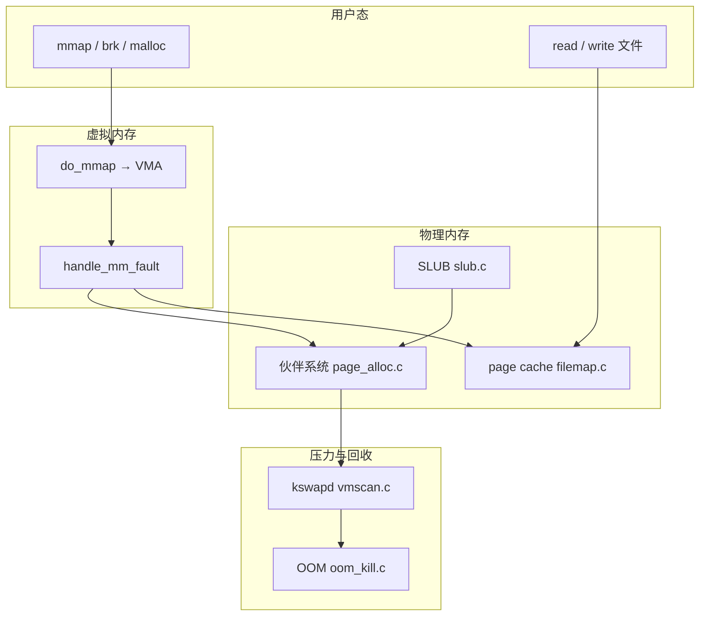
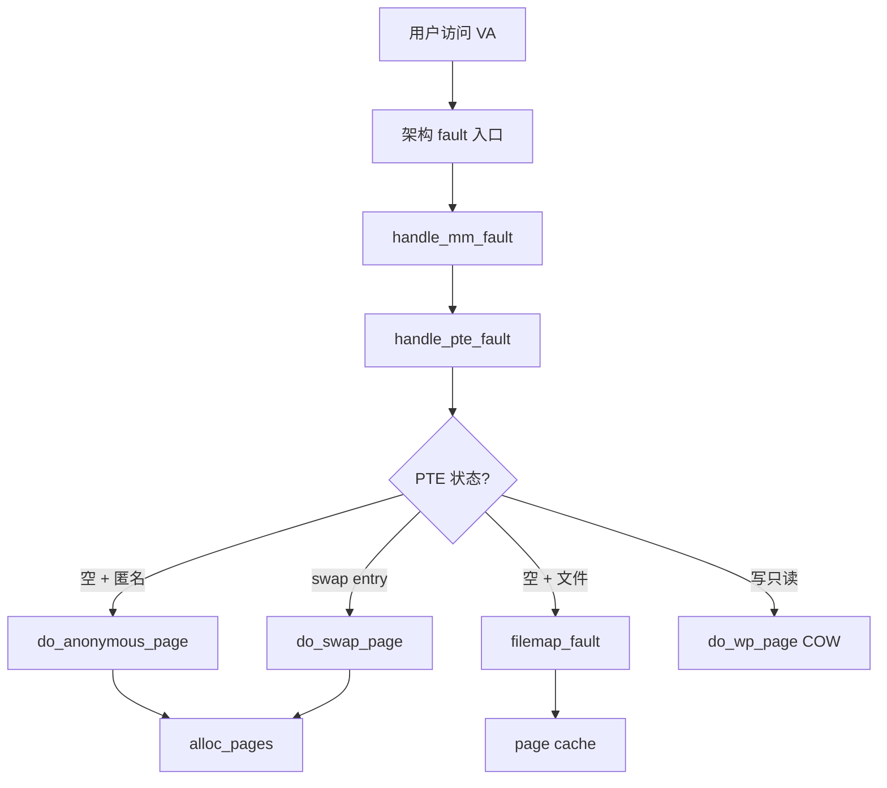
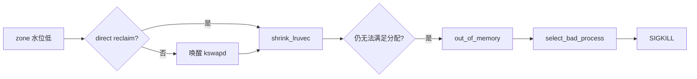

# Linux 内核内存管理完整篇：伙伴系统、SLUB、缺页、page cache 与 OOM 实战

线上 OOM、`pgmajfault` 飙升、容器内存「泄漏」、THP 卡顿——很多排障卡在「只知道 malloc 失败，不知道内核哪条路径在要内存」。本文把 **Linux 内核内存管理** 从物理页分配、内核对象缓存、进程虚拟地址空间、缺页与 page cache，到 cgroup 限额与 OOM 选杀，合成一篇可对照源码与 `/proc` 验证的完整闭环。

## 源码锚点

| 路径 | 作用 |
|------|------|
| `mm/page_alloc.c` | 伙伴系统：`alloc_pages`、`__free_pages`、zone 水位 |
| `mm/slub.c` | SLUB：`kmem_cache_alloc`、`kmalloc` 底层 |
| `mm/memory.c` | `handle_mm_fault`、`do_anonymous_page`、`do_swap_page` |
| `mm/filemap.c` | 文件映射缺页、`filemap_fault`、page cache |
| `mm/vmscan.c` | 回收：`shrink_lruvec`、`kswapd` |
| `mm/oom_kill.c` | `out_of_memory`、`select_bad_process` |
| `mm/mmap.c` | `do_mmap`、`vm_area_struct` 建立 |
| `mm/memcontrol.c` | cgroup v2 memory：`memory.max`、`memory.high` |
| `include/linux/mm.h` | `struct page`、`vm_fault` |
| `include/linux/mm_types.h` | `vm_area_struct`、`mm_struct` |

伙伴分配入口（概念）：

```c
/* mm/page_alloc.c */
struct page *alloc_pages(gfp_t gfp_mask, unsigned int order)
{
	return __alloc_pages(gfp_mask, order, NUMA_NO_NODE, NULL);
}
```

缺页处理入口：

```c
/* mm/memory.c */
vm_fault_t handle_mm_fault(struct vm_area_struct *vma,
			   unsigned long address, unsigned int flags,
			   struct pt_regs *regs)
```

## 调用链

### 内存管理子系统总览



### 缺页 fault 分支



### 回收与 OOM 路径



### 文字补充（kmalloc 路径）

```text
kmalloc → __kmalloc → kmem_cache_alloc(slub.c)
  → per-CPU freelist → partial slab → alloc_pages
```

## 重点知识

### 1. 伙伴系统与 GFP

- **伙伴系统**按 2^n 页合并/拆分空闲块；`order=0` 为一页（通常 4KiB）。
- **zone** 区分 DMA 可寻址范围与 NORMAL；ARM64/ x86_64 常见无 HIGHMEM。
- **GFP 标志**决定分配行为：`GFP_KERNEL`（可 reclaim+IO）、`GFP_ATOMIC`（原子上下文，不睡眠）、`__GFP_NOFAIL`（尽量等到有页）。
- 观测：`/proc/buddyinfo`、`/proc/zoneinfo`、`/proc/pagetypeinfo`。

### 2. SLUB 与 kmalloc

- 内核对象（`task_struct`、`inode`、驱动私有结构）走 **slab cache**；`kmalloc` 按 size 映射到通用 cache。
- **per-CPU freelist** 降低锁争用；调试泄漏用 `kmemleak`、`/sys/kernel/slab/`。
- 驱动里大缓冲优先 **dma_alloc_coherent** / **alloc_pages**；小结构才 `kmalloc`。

### 3. VMA 与页表

- `vm_area_struct` 描述 `[vm_start, vm_end)`、权限 `VM_READ|WRITE|EXEC`、文件映射 `vm_file`。
- 用户态 `mmap()` → `do_mmap()` 建 VMA；**首次 touch 才缺页分配物理页**（延迟分配）。
- 四级页表 PGD→P4D→PUD→PMD→PTE；TLB shootdown 在跨 CPU unmap 时产生开销。

### 4. page cache 与写回

- 文件读经 **page cache** 缓存；`mmap` 文件与 `read()` 共享同一套 cache 页。
- 脏页由 **writeback** 线程按 `dirty_ratio` / `dirty_bytes` 刷盘。
- `Cached` 高不一定是泄漏——看 **`MemAvailable`**；回收 cache 可缓解压力（实验机 `drop_caches`）。

### 5. Major / Minor fault

- **Minor**：页已在 RAM，只建 PTE。
- **Major**：需读盘或 swap-in。
- 命令：`grep pgmajfault /proc/vmstat`；`ps -o min_flt,maj_flt -p <pid>`。

### 6. cgroup memory 与容器

```bash
# cgroup v2 示例
cat /sys/fs/cgroup/<slice>/memory.current
cat /sys/fs/cgroup/<slice>/memory.max
cat /sys/fs/cgroup/<slice>/memory.events   # oom_kill, max 等
```

- `memory.max` 硬上限；触顶 cgroup OOM 杀容器内进程，不一定触发全局 OOM。
- `memory.high` 节流：超过后 reclaim 压力增大。

### 7. OOM Killer 与保护

- 全局 OOM：`dmesg | grep -i 'out of memory'`。
- **`oom_score_adj`**：`-1000` 可免杀（仍非绝对）；关键守护进程应显式设置。
- 误杀链：未调 adj → 杀数据库 → 业务雪崩。

### 8. THP / 透明大页

- THP 合并 2MiB 大页，吞吐好但合并可能阻塞毫秒级；数据库/低延迟服务常 `never` 或 `madvise`。
- 观测：`grep -i huge /proc/meminfo`；`cat /sys/kernel/mm/transparent_hugepage/enabled`。

### 9. 性能调优与常见坑

| 现象 | 常见原因 | 方向 |
|------|----------|------|
| 内存满但 cache 大 | page cache 占用 | 看 MemAvailable；调 dirty 参数 |
| swap 狂增 | 匿名页过多 / swappiness 高 | 降 swappiness；加 RAM；mlock 关键段 |
| 容器 OOM | memory.max 过小 | 调限额或应用 RSS |
| latency 尖刺 | THP 合并 / direct reclaim | THP 策略；预留 memory.low |
| D 状态堆积 | 等 I/O 非缺 CPU | 查 block 层，非盲目加核 |

常用 sysctl（以本机为准）：

```bash
sysctl vm.swappiness vm.dirty_ratio vm.dirty_background_ratio
sysctl vm.overcommit_memory vm.min_free_kbytes
```

### 10. 观测命令速查

```bash
cat /proc/meminfo
grep -E 'pgfault|pgmajfault|pswpin|pswpout|oom_kill' /proc/vmstat
cat /proc/<pid>/status | grep -E 'VmRSS|VmSwap|VmPeak'
cat /proc/<pid>/smaps_rollup
cat /proc/buddyinfo
# 压力测试后
dmesg -T | tail -50
```

## Checklist

- [ ] 能说出 `alloc_pages` → zone 水位 → kswapd 的关系
- [ ] 能画出 `handle_mm_fault` 下匿名/文件/swap 三条分支
- [ ] 区分 `Cached` 与真正不可回收的 RSS；会看 `MemAvailable`
- [ ] 会用 `pgmajfault`、`VmSwap` 判断是否在换页/读盘
- [ ] 容器场景检查过 `memory.max` / `memory.events`
- [ ] 关键进程配置过 `oom_score_adj` 并验证 `/proc/<pid>/oom_score_adj`
- [ ] 调 THP / dirty 参数前记录 baseline 与 `dmesg` OOM 日志

---

> 合并源：`Linux内核/chapters/041~043、045~047`（内存管理系列）  
> 成稿：`csdn-merged/Linux内核-内存管理完整篇.md`
