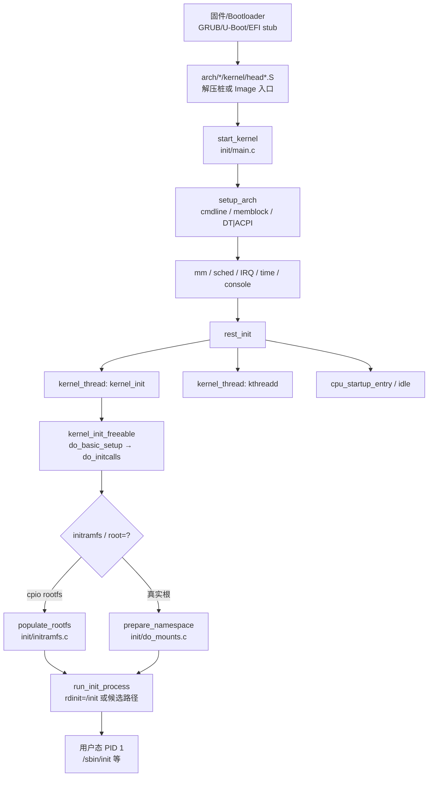
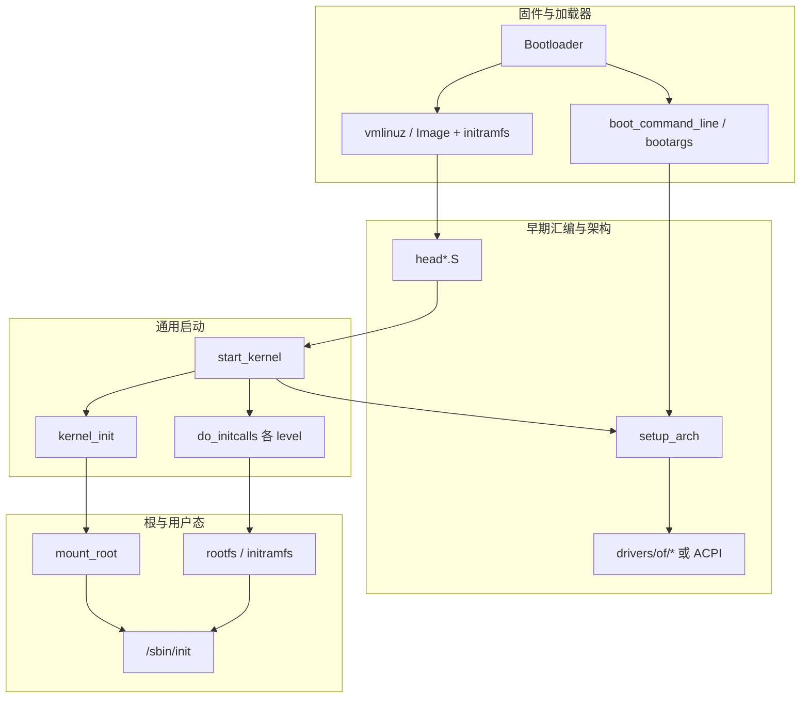

# Linux 内核启动完整篇：从 start_kernel、initcall 到 rootfs 与启动排障

换内核后黑屏、`VFS: Unable to mount root fs`、云主机缺 `virtio_blk`、串口无日志——故障几乎都卡在 **早期启动链**，而不是业务驱动本身。很多人一上来改驱动 `probe` 或重装用户态服务，却跳过了「镜像是否解压成功、cmdline 是否生效、initcall 卡在哪、根设备有没有出现、`/sbin/init` 能不能 exec」这几层。

本文把解压/early setup → `start_kernel` → 子系统与 initcall → `kernel_init` 挂根 → `/sbin/init` 合成一条可对照源码与 `dmesg`/`initcall_debug` 验证的闭环，覆盖配置、常见卡死点与启动耗时优化，便于板级与服务器场景共用同一套排障顺序。

---

## 源码锚点

| 路径 | 作用 |
|------|------|
| `arch/*/kernel/head*.S` | 汇编入口：页表/MMU、保存 DTB/`boot_params`，跳入 C |
| `arch/*/kernel/setup.c` | `setup_arch`：cmdline、memblock、DT/ACPI |
| `init/main.c` | `start_kernel`、`rest_init`、`kernel_init`、`do_basic_setup`、`do_initcalls`、`run_init_process` |
| `include/linux/init.h` | `early_initcall` / `core_initcall` / … / `late_initcall`、`__setup` |
| `init/do_mounts.c` | `prepare_namespace`、`mount_root`、`root=` / `rootwait` |
| `init/initramfs.c` | `populate_rootfs`：cpio 解压到 rootfs |
| `drivers/of/fdt.c`、`drivers/of/base.c` | FDT 扫描、`unflatten_device_tree`、OF 运行时树 |
| `Documentation/admin-guide/kernel-parameters.txt` | 启动参数约定 |
| `Documentation/admin-guide/initrd.rst` | initramfs / initrd 行为 |

C 入口骨架（版本细节以你树内 `init/main.c` 为准）：

```c
/* init/main.c */
asmlinkage __visible void __init start_kernel(void)
{
	/* setup_arch → mm_* → sched_init → init_IRQ → …
	   → console_init → … → rest_init() */
}

static noinline void __ref rest_init(void)
{
	/* kernel_thread(kernel_init, …);
	   kernel_thread(kthreadd, …);
	   cpu_startup_entry(…);  // 当前上下文 eventual idle */
}

static int __ref kernel_init(void *unused)
{
	/* kernel_init_freeable() → do_basic_setup()/do_initcalls
	   → prepare_namespace（按配置）
	   → run_init_process(rdinit/init=/sbin/init/…) */
}
```

initcall 等级（由早到晚，摘自 `include/linux/init.h`）：

```c
early_initcall / pure_initcall / core_initcall / postcore_initcall /
arch_initcall / subsys_initcall / fs_initcall / rootfs_initcall /
device_initcall / late_initcall
/* __initcall(fn) 等价于 device_initcall(fn) */
```

---

## 调用链

### 启动主路径（TD）



### 分层与数据流（TB）



文字版对照：

```text
Bootloader 加载镜像 + 传入 cmdline/DTB
  → head*.S（开 MMU / 保存 boot args）
  → start_kernel()
      → setup_arch(&command_line)
      → 内存 / 调度 / 中断 / 时间 / 控制台 …
      → rest_init()
          → kernel_init 线程 + kthreadd
kernel_init
  → do_basic_setup() → do_initcalls()   /* 含 rootfs_initcall(populate_rootfs) 等 */
  → prepare_namespace() / mount_root()  /* root=、rootwait、rootfstype= */
  → run_init_process(… /sbin/init …)
```

---

## 重点知识

### 1. 解压与 early setup：先有「能跑 C」的最小环境

启动链真正从固件把控制权交给 Bootloader 之后才进入「内核视角」：BIOS/UEFI POST 或嵌入式 ROM → GRUB / U-Boot / EFI stub 加载镜像，再跳入架构汇编。

- **x86**：常见 `vmlinuz` 含压缩内核与解压桩；GRUB/EFI stub 把控制权交给架构入口（如 `arch/x86/kernel/head_64.S`），`boot_params` 携带 cmdline、initrd 位置、屏幕与内存映射等。
- **arm64**：多为未压缩 `Image`；Bootloader 约定 **x0 = DTB 物理地址**、Image 按约定对齐，入口在 `arch/arm64/kernel/head.S`（`primary_entry` → 建早期页表 → 开 MMU → `__primary_switched` → `start_kernel`）。
- **压缩路径**（如 arm32 `zImage`）另有 `arch/arm/boot/compressed/head.S` 自解压；排障时必须分清「解压前无串口」和「已进入 `start_kernel` 仍卡死」。

早期物理内存由 **memblock** 管理，伙伴系统与 slab 就绪后再过渡；这一阶段改错保留内存或 DTB `/memory`，后面会表现为随机 panic 或设备地址错乱。极早阶段普通 `printk` 可能还不可见，需要 `earlyprintk` / `earlycon`，而不是只翻后期 `dmesg`。

### 2. `start_kernel`：只做「能调度、能中断、能打日志」的最小集

`start_kernel`（`init/main.c`）是通用启动中枢。读源码时按阶段跳读，不必一次啃完所有 `init_*`：

| 阶段 | 代表调用 | 你要搞懂什么 |
|------|----------|--------------|
| 架构 | `setup_arch` | cmdline、memblock、DT/ACPI、early ioremap |
| 内存 | `mm_*`（如 `mm_core_init`/`mem_init`，随版本命名） | 后续分配依赖页分配器就绪 |
| 调度 | `sched_init` | 才能创建 `kernel_init` / `kthreadd` |
| 中断 | `init_IRQ` | 架构 IRQ 控制器挂上 |
| 时间 | `time_init` 等 | clocksource / tick |
| 控制台 | `console_init` | `printk` 真正落到终端 |
| 收尾 | `rest_init` | 拉起 `kernel_init`、`kthreadd`，本上下文 eventual idle |

设计意图：**硬件探测尽量推迟到 initcall**，避免在「还不能排障」的阶段塞进过多驱动依赖。卡在 `console_init` 之前时，现场往往只有黑屏——先解决 early console，再谈驱动。

`rest_init` 用 `kernel_thread` 创建的 `kernel_init` 仍是**内核线程**；用户态 PID 1 要等到后面 `run_init_process` 成功 `exec` 才出现。很多人把「内核起来了」和「已经进了 `/sbin/init`」混为一谈，排障会走错层。

### 3. DT / ACPI：启动策略与设备拓扑的输入面

| 平台 | 关键输入 | 典型路径 |
|------|----------|----------|
| ARM/arm64 | DTB：`/memory`、`/chosen/bootargs`、`reserved-memory`、`stdout-path` | `setup_arch` → `early_init_dt_scan` / `unflatten_device_tree`（`drivers/of/fdt.c`、`drivers/of/base.c`） |
| x86 | ACPI 表 + cmdline | `setup_arch` 一侧解析 `boot_params` |

设备匹配链：`compatible` ↔ `of_device_id` ↔ `platform_driver.probe`。根文件系统所在的 mmc/sdhci/nvme/virtio 必须在挂根前 probe 成功——`dmesg` 里看不到块设备节点，改 `root=` 没有意义。嵌入式先核对 DT 与驱动是否匹配；x86/云主机先核对 virtio/SCSI 是否进了 initramfs。若错误留下 `acpi=off`，可能让中断路由或存储控制器枚举异常，表象同样是「根不出现」，根因却在固件表解析而非文件系统本身。

### 4. cmdline 与 `__setup`：启动策略开关，不是装饰

Bootloader 传入的字符串最终落到 `boot_command_line`，由解析逻辑分发给各 `__setup` / `early_param` 回调（宏在 `include/linux/init.h`）。`root=`、`rootwait`、`init=`、`rdinit=`、`console=`、`initcall_debug` 都会在这里生效。

生产环境常见隐性损伤：排障时临时加的 `acpi=off`、`nomodeset`、`init=/bin/bash` 留在 `/etc/default/grub` 的 `GRUB_CMDLINE_LINUX` 里，机器「能开」但性能、图形或正常多用户启动已偏离预期。改参数前先读 `Documentation/admin-guide/kernel-parameters.txt`，改完用 `cat /proc/cmdline` 核对实际生效值。

### 5. initcall 级别：驱动能否在挂根前就绪

`do_basic_setup` → `do_initcalls` 按链接进内核的 `.initcallN.init` 段顺序调用函数指针。宏与 level 定义在 `include/linux/init.h`：

```text
early → pure/core/postcore → arch → subsys → fs → rootfs → device → late
```

- `rootfs_initcall`：常挂 `populate_rootfs` 一类「先铺早期 rootfs」的工作。
- `device_initcall`：覆盖大量内建驱动；`__initcall(fn)` 等价于此级。
- 模块的 `module_init` 不在这条冷启动段里跑，要靠 initramfs 里的 `modprobe` 或后续加载。

排障首选 cmdline：`initcall_debug`。日志会打印每个 initcall 符号与耗时；卡死点往往停在某一个函数名上——用 `rg`/`cscope` 反查该符号所属驱动即可。比盲目加 `printk` 快一个数量级。若日志显示某 initcall 耗时数秒却最终返回，则属于性能问题而非死锁，应与「再也没有下一行 calling」的真卡死区分开。

### 6. `kernel_init` → 挂根 → `/sbin/init`

`kernel_init` 在 `kernel_init_freeable` 中跑完 `do_basic_setup` 等之后，进入挂根与 exec 用户态。两条常见路径不要混：

1. **initramfs 路径**（`init/initramfs.c`）：将内嵌或 Bootloader 传入的 cpio 解压到 rootfs；常配合 `rdinit=/init`。用户态脚本典型动作是挂 `proc`/`sys`、`modprobe` 根设备驱动、等待块设备节点、挂真实根、再 `switch_root`（或 `pivot_root`）到真实根上的 `/sbin/init`。
2. **内核直接挂根**（`init/do_mounts.c`）：`prepare_namespace` / `mount_root` 解析 `root=`、`rootwait`、`rootfstype=`，由内核完成挂载，再 `run_init_process`。

`run_init_process` 候选顺序（逻辑示意，以树内为准）：`rdinit` → `init=` → `/sbin/init` → `/etc/init` → `/bin/init` → `/bin/sh`；全失败则 `panic("No working init found.")`。

| 参数 | 含义 | 常见坑 |
|------|------|--------|
| `root=` | 根设备 | 节点与真实块设备不符；UUID/PARTUUID 写错 |
| `rootwait` | 等待慢速设备出现 | eMMC/USB/virtio 探测晚，缺此参数即挂根失败 |
| `rootfstype=` | 文件系统类型 | 驱动未编入内核且未进 initramfs |
| `init=` | 用户态入口 | 排障用 `/bin/sh` 遗留在生产 GRUB |
| `rdinit=` | initramfs 入口 | 与镜像内 `/init` 脚本约定不一致 |
| `console=` / `earlycon=` | 日志出口 | 未配则「黑屏」，无法区分卡在哪一层 |

### 7. 配置落地：GRUB、menuconfig 与版本三件套

```bash
cat /proc/cmdline
uname -r
ls /lib/modules/$(uname -r)/
# Debian/Ubuntu
sudo update-initramfs -u -k $(uname -r)
# Fedora/RHEL 系常见
# dracut --force
```

- GRUB：编辑 `/etc/default/grub` 的 `GRUB_CMDLINE_LINUX`，再 `update-grub`（或发行版等价命令）；保留上一版内核与 initramfs 作为回退条目。
- 自建内核：`make menuconfig` 决定根设备/FS 是 `=y` 还是 `=m`；`LOCALVERSION` 要与模块目录命名一致，否则极易 vermagic 不匹配。
- **三件套对齐**：运行中内核（`uname -r`）、`/lib/modules/$(uname -r)`、对应 initramfs。只换 `vmlinuz`、不重建 initramfs，是云主机与板级启动失败的头号原因。

### 8. 对照日志的阅读模板与常见卡死点

启动成功时，可按时间线在串口/`dmesg` 中定位阶段：

```text
Booting Linux on physical CPU ...     # 进入 head / start_kernel 一带
Kernel command line: ...              # cmdline 已解析
OF: fdt: ... / Machine model: ...     # DT 侧（ARM）
... initcall 与驱动 probe ...
VFS: Mounted root ...                 # 挂根成功
Run /sbin/init as init process        # run_init_process 成功
```

| 现象 | 优先怀疑 | 动作 |
|------|----------|------|
| 无任何日志 | 串口/`earlycon`/`console=` | 加 `earlycon`、`console=ttyS0,115200` 或板级 UART |
| 停在某 initcall | 驱动依赖/硬件/死锁 | `initcall_debug` 定位符号后反查源码 |
| `Unable to mount root fs` | 缺块设备/FS 驱动、`root=` 错 | 重建 initramfs；补 `virtio_blk`/`mmc`/`nvme`；加 `rootwait` |
| 换内核进不了系统 | initramfs 过旧、vermagic | `dracut --force` / `update-initramfs`；核对三件套 |
| `Invalid module format` | 模块与运行中内核不一致 | 重装匹配的模块树 |
| `No working init found` | 根上无可用 init、动态链接库缺失 | `init=/bin/sh` 进急救壳检查 `/sbin/init` 与依赖 |
| 启动慢 | initramfs 过大、用户态串行 | 精简 cpio；`systemd-analyze blame` |

云主机典型复盘：升级内核包后只更新了镜像、未强制重建 initramfs → 缺 `virtio_blk` → 根挂不上。修复是重建并保留 GRUB 回退，而不是改业务服务配置。同类问题在嵌入式上常表现为「换了 Image 却忘了同步 modules 与 DTB」。

急救入口：启动菜单编辑 cmdline，临时加 `init=/bin/sh` 或 `single`，确认根与驱动正常后再恢复正式 `init=`。确认修复后务必删掉临时参数，避免下次冷启动再次掉进急救壳。

### 9. 启动耗时优化与边界

先度量，再裁剪：

- **内核侧**：用 `initcall_debug` 找出超长 initcall；把用不到的驱动改成模块或直接关掉；精简 initramfs（少装无关 firmware/模块）。避免生产遗留 `acpi=off`/`nomodeset`。
- **用户态侧**：`systemd-analyze blame` / `critical-chain` 定位慢单元；相对 SysV 串行脚本，systemd 并行依赖通常更短。
- **勿混用手段**：`nohz_full` 影响的是空闲 CPU tick，不是「缩短到 login 的冷启动」主路径。

安全是另一条轴：Secure Boot 校验内核/引导签名；`lockdown` 限制 `/dev/mem` 等接口；IMA/EVM 可度量启动链。它们解释「为什么被拒绝启动或被拒绝读内存」，与「挂不上根」要分开排查。

从核（SMP）简记：arm64 常见路径是 PSCI `CPU_ON` → `secondary_entry`（`head.S`）→ `secondary_start_kernel`。主 CPU 能进系统、从核起不来时，先查 ATF/PSCI 与 DT `enable-method`，不要先怀疑 `root=`。

---

### 10. 动手验证：一条可复现的排障闭环

现场建议固定顺序，避免「同时改三个变量」：

1. **先拿到日志**：串口或带外控制台；cmdline 临时加 `earlycon`（或板级等价）与 `loglevel=8`。仍无输出则怀疑供电、镜像加载地址、串口引脚/波特率，而不是 VFS。
2. **再分段卡点**：能看到 `Linux version` 说明已进 `start_kernel` 一带；能看到 `Kernel command line` 说明 cmdline 已解析；出现驱动 probe 却挂根失败，优先查 initramfs 与 `root=`；出现 `Run /sbin/init` 后仍回不了登录界面，问题多半已落到用户态单元或 getty。
3. **用 `initcall_debug` 钉符号**：若停在某一 `calling xxx+0x0` 不再返回，把 `xxx` 反查到具体 `.c`，核对时钟、电源域、DT `compatible`、依赖的 regulator/gpio 是否就绪。
4. **挂根失败最小化实验**：临时 `init=/bin/sh`（或进 initramfs 的 `/init` 急救壳），确认 `/dev` 下是否有根设备、`lsmod`/`cat /proc/modules` 是否已加载对应驱动；确认后再 `switch_root` 或修正 cmdline。
5. **改完必回归**：去掉临时参数，确认正式 cmdline 与 initramfs 已写入配置管理，并保留可回退的上一版内核条目。

嵌入式与服务器差异只在「谁提供根设备驱动」：板级常把 mmc/nand 编进内核（`=y`）；发行版云镜像则依赖 initramfs 装 virtio/nvme。机制相同，包装不同。

---

## Checklist

- [ ] 能口述 `head*.S` → `start_kernel` → `rest_init` → `kernel_init` → `run_init_process` 主链，并指出 `init/main.c` / `do_mounts.c` / `init.h`
- [ ] 分清卡点在：解压前、`setup_arch` 前、`console_init` 前、某 initcall、挂根、还是 exec init
- [ ] 会用 `initcall_debug` + `earlycon`/`console=` 拿到可定位日志
- [ ] `uname -r`、`/lib/modules/$(uname -r)`、initramfs 三者一致；换内核后已重建
- [ ] `root=` / `rootwait` / `rootfstype=` / `rdinit` / `init=` 与板级或云盘实际设备匹配
- [ ] 根设备驱动在内核内建或 initramfs 内（云主机核对 virtio；嵌入式核对 mmc/nvme）
- [ ] 排障临时参数（`init=/bin/sh`、`single`、`acpi=off` 等）未污染生产 cmdline
- [ ] 启动变慢时先 `initcall_debug` / `systemd-analyze`，再谈裁剪与并行
- [ ] 能根据 `dmesg` 关键字把阶段映射到源码文件（`head*.S` / `main.c` / `do_mounts.c` / 用户态 init）

---

## 小结

内核启动的设计意图是：**汇编打好最小运行环境 → `start_kernel` 拉起调度/中断/日志 → initcall 分阶段挂驱动 → `kernel_init` 挂根并 exec PID 1**。排障按「有无 early 日志 → 卡在哪个 initcall → 根设备是否出现 → init 是否可执行」分层推进；配置上把 cmdline 与 initramfs 纳入版本管理，升级内核必重建、必留回退。把这条链走通之后，再读具体总线驱动或文件系统实现才不会迷失在海量 `probe` 日志里。

一句话自检：若你能指着一份串口日志，说出每一段对应 `head*.S`、`setup_arch`、`do_initcalls`、`prepare_namespace` 还是用户态 `/sbin/init`，这篇的目标就达到了。
