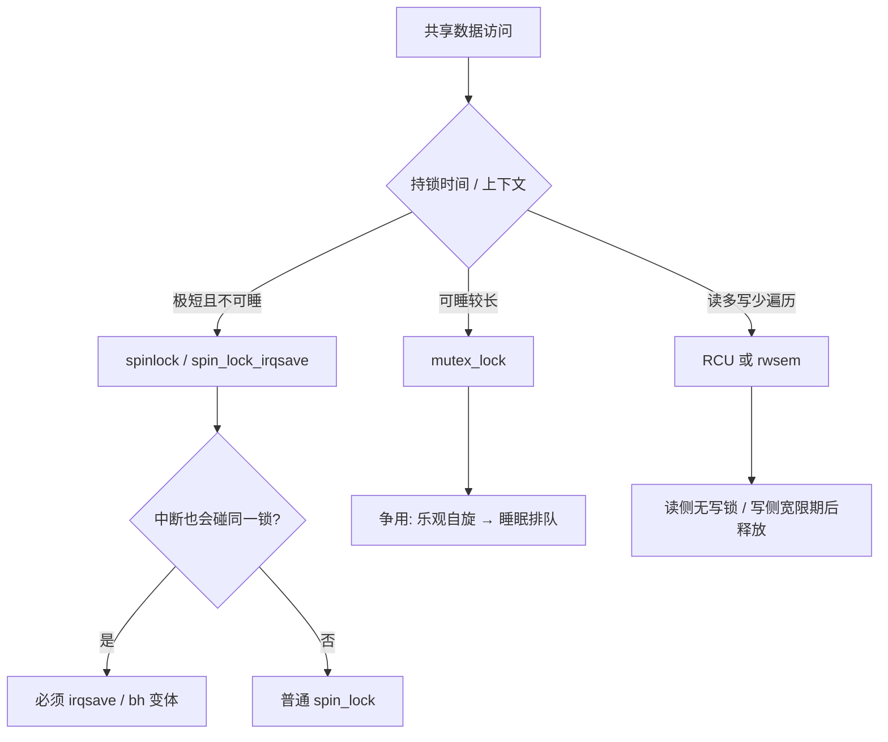
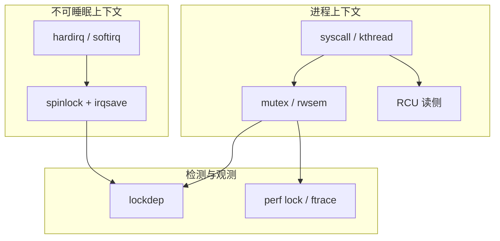

# Linux 内核同步机制完整篇：spinlock、mutex、rwsem、RCU 选型与死锁排查

驱动里随便一把锁就能把板子锁死：硬中断里 `mutex_lock`、AB-BA 死锁、RCU 读侧睡眠、自旋锁临界区过长导致软锁——这些都不是「概念不懂」，而是 **原语语义与上下文约束** 没对齐。本文按「能睡 / 不能睡 / 读多写少」把常用同步原语串成选型闭环，并落到源码路径与 lockdep/`perf lock` 验证。

---

## 源码锚点

| 路径 | 作用 |
|------|------|
| `include/linux/spinlock.h` | `spin_lock` / `spin_lock_irqsave` 等 |
| `kernel/locking/spinlock.c` | 自旋锁慢路径（视配置） |
| `include/linux/mutex.h` | `mutex_lock` / `mutex_trylock` |
| `kernel/locking/mutex.c` | mutex 排队、乐观自旋、慢路径 |
| `include/linux/rwsem.h` | 读写信号量 |
| `kernel/locking/rwsem.c` | rwsem 实现 |
| `include/linux/rcupdate.h` | `rcu_read_lock`、`synchronize_rcu`、`call_rcu` |
| `kernel/rcu/` | RCU 宽限期与回调 |
| `kernel/locking/lockdep.c` | 锁依赖图、死锁检测 |
| `include/linux/seqlock.h` | seqlock：读多写少的轻量方案 |
| `Documentation/locking/` | 官方锁定文档 |

自旋锁与关中断变体：

```c
/* include/linux/spinlock.h（用法层面） */
spin_lock_irqsave(&lock, flags);
/* 临界区：不可睡眠 */
spin_unlock_irqrestore(&lock, flags);
```

RCU 读侧与延迟释放：

```c
/* include/linux/rcupdate.h */
rcu_read_lock();
p = rcu_dereference(gp);
/* 只读访问 p，不可阻塞（非 PREEMPT_RT 经典语义） */
rcu_read_unlock();

/* 写侧更新后 */
call_rcu(&old->rcu, free_cb);   /* 或 synchronize_rcu() 同步等待 */
```

---

## 调用链

### 争用路径对比



### 模块分层（谁保护什么）



---

## 重点知识

### 1. 选型第一原则：上下文能不能睡

| 场景 | 推荐 | 禁止 |
|------|------|------|
| 硬中断 / 关抢占临界区极短 | `spinlock`（常配 `irqsave`） | `mutex`、可能调度的分配 |
| 进程上下文、临界区较长 | `mutex` | 长时间占着 spinlock |
| 读多写少链表/树遍历 | RCU（读扩展）或 `rwsem` | 粗粒度一把大 mutex 扫全表 |
| 计数器 / 标志 | `atomic_t`、`refcount_t` | 无必要的大锁 |

硬中断里拿 mutex → 可能直接 BUG 或死锁；进程上下文里长时间 spin → 浪费 CPU、抬高延迟。

### 2. spinlock：忙等与中断变体

自旋锁持有期间**禁止睡眠**（包括可能触发调度的 `GFP_KERNEL` 分配、`mutex_lock`、`copy_to_user` 等）。若同一把锁也会在中断里获取，进程上下文必须用 `spin_lock_irqsave`（或明确的 `_bh`/`_irq` 变体），否则中断可重入同一锁导致自死锁。

### 3. mutex：可睡、可排队、可乐观自旋

`mutex_lock` 在争用时可以阻塞；现代实现常对「持有者正在跑」做乐观自旋，减少切换。适合驱动 `probe`、文件系统、多数 syscall 路径。注意：

- 同一线程不可重入同一 mutex（非递归锁）。
- 定义**全局锁顺序**（例如先 A 后 B），避免 AB-BA。
- `mutex_lock_interruptible` 用于可被信号打断的路径。

### 4. rwsem：读者共享、写者独占

适合「读远多于写」且读侧可睡的场景。写者要等所有读者离开；读者过多时写延迟会变差。内核里 `mmap_sem`/`mmap_lock` 一类路径是典型用户。

### 5. RCU：读侧极快，写侧付宽限期成本

- 读：`rcu_read_lock`/`unlock` + `rcu_dereference`。
- 写：发布用 `rcu_assign_pointer`；回收用 `synchronize_rcu`（同步等宽限期）或 `call_rcu`（异步回调）。
- 读侧经典约束：不可阻塞（`PREEMPT_RT`/`CONFIG_PREEMPT` 细节以当前内核文档为准）。
- 适合：以查找/遍历为主、更新较少的全局结构（路由表、设备列表等）。

与 spinlock/mutex 分工：RCU 换的是「写延迟与内存短暂多活」；不是万能锁替代品。

### 6. 内存序与无锁

`smp_mb`/`smp_rmb`/`smp_wmb`、`atomic_cmpxchg`、`READ_ONCE`/`WRITE_ONCE` 防止编译器与 CPU 重排导致的「看见半初始化对象」。无锁算法仍要证明 ABA 与回收安全——多数驱动优先用成熟原语，而不是手写无锁。

### 7. 配置、检测与排障

```bash
# 打开 lockdep（调试内核）
# Kernel hacking → Lock debugging: prove locking correctness

dmesg | grep -i lockdep
cat /proc/lockdep_stats 2>/dev/null

perf lock record -a -- sleep 5
perf lock report

# 跟踪慢路径
echo 'mutex_lock*' > /sys/kernel/debug/tracing/set_ftrace_filter
echo function > /sys/kernel/debug/tracing/current_tracer
```

常见故障：

| 故障 | 根因 | 处理 |
|------|------|------|
| soft lockup / 看门狗 | 自旋过久或关抢占过久 | 缩短临界区、拆锁、改 mutex |
| AB-BA deadlock | 锁顺序不一致 | 统一层级；lockdep 会报 |
| RCU stall | 读侧关抢占过久/死循环 | 查 `rcu_read_lock` 区间 |
| 中断上下文睡 | 误用 mutex | 改为 spin 或把工作甩到线程 |

---

## Checklist

- [ ] 能按「能否睡眠 / 持锁时长 / 是否进中断」选出 spinlock、mutex、rwsem、RCU
- [ ] 知道同一锁若在 IRQ 中使用，进程侧必须 `irqsave`（或等价关闭）
- [ ] 能说明 `call_rcu` 与 `synchronize_rcu` 的差异
- [ ] 写驱动时定义了锁顺序，并在调试内核上跑过 lockdep
- [ ] 会用 `perf lock` 看争用，而不是只靠猜
- [ ] 理解 RCU 读侧约束与写侧宽限期成本
- [ ] 能区分「死锁」与「活锁/长时间自旋」的表象差异

---

## 小结

内核同步的设计意图是：**用不同原语匹配不同并发与上下文约束，用 lockdep 把错误锁顺序尽早暴露**。选型先问上下文，再问持锁时间与读写比；排障用 lockdep + `perf lock` + RCU stall 日志，比反复改「再加一把大锁」可靠得多。
