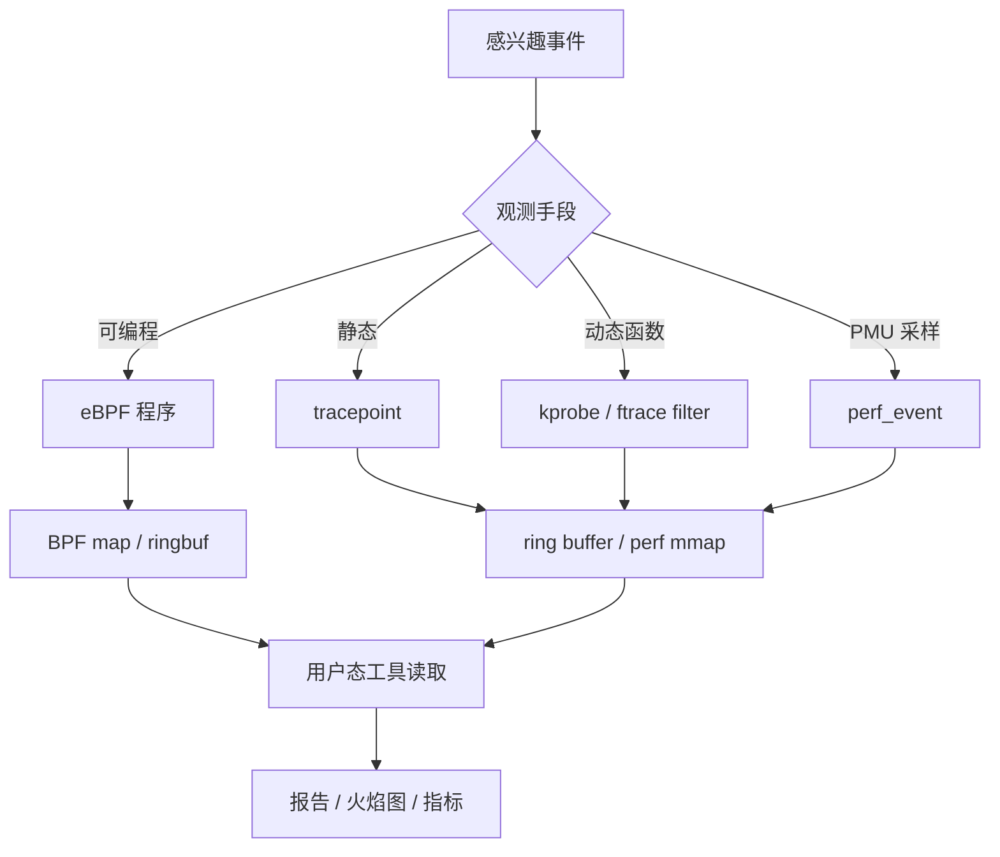
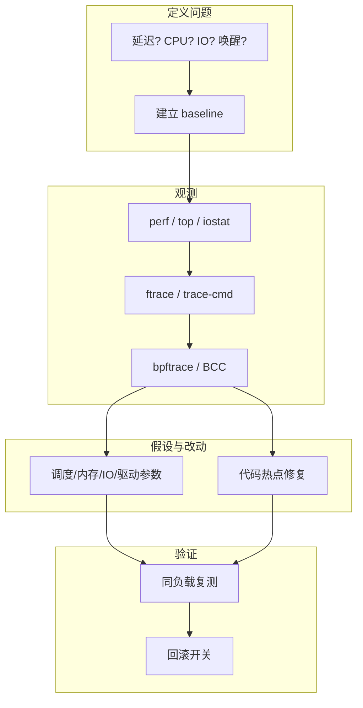

# Linux 性能调优与追踪完整篇：ftrace、perf、eBPF 从采样到落地验证

CPU 被打满却说不清热点、延迟尖刺只能「重启试一下」、上线后回归全靠猜——缺的不是参数列表，而是 **可复现的观测路径**：从 tracepoint/kprobe 到采样火焰图，再到改参与回归对比。本文把 ftrace、`perf_event`、eBPF/bpftrace、常见调优开关与排障顺序合成一篇闭环。

---

## 源码锚点

| 路径 | 作用 |
|------|------|
| `kernel/trace/ftrace.c` | ftrace 核心、function tracer |
| `kernel/trace/trace.c` | tracefs 环形缓冲与输出 |
| `include/linux/ftrace.h` | ftrace API |
| `kernel/events/core.c` | `perf_event` 子系统 |
| `kernel/kprobes.c` | kprobe 动态插桩 |
| `kernel/bpf/` | eBPF 验证器、地图、运行时 |
| `kernel/trace/bpf_trace.c` | BPF 与 tracing 衔接 |
| `fs/tracefs/` / `debugfs` | 用户态控制面（挂载点因发行版而异） |
| `tools/perf/` | 用户态 perf 工具 |
| `Documentation/trace/`、`Documentation/bpf/` | 官方追踪与 BPF 文档 |

ftrace 控制面（示意）：

```bash
# 通常需要 root；路径可能是 /sys/kernel/tracing
mount | grep tracefs
cd /sys/kernel/tracing
echo function > current_tracer
echo do_sys_openat2 > set_ftrace_filter   # 示例符号以本机为准
echo 1 > tracing_on
cat trace | head
echo 0 > tracing_on
```

perf 采样骨架：

```bash
perf record -F 99 -g -- ./app
perf report
# 或系统范围
perf top
perf record -a -g -- sleep 10
```

---

## 调用链

### 观测数据从内核到用户态



### 调优闭环分层



---

## 重点知识

### 1. 先定性，再选工具

| 症状 | 先看 | 深挖 |
|------|------|------|
| CPU 高 | `perf top`/`record -g` | 符号、锁、软中断 |
| 延迟尖刺 | `cyclictest`、调度/中断追踪 | `irqsoff`/`preemptirqsoff`、唤醒链 |
| IO 等 | `iostat`、`perf` block 事件 | 电梯、队列深度、FS 回写 |
| 内存 | `/proc/meminfo`、`psi` | reclaim、oom、cgroup 限制 |

没有 baseline（同负载下的延迟/CPU/带宽数字）就改 `sysctl`，属于盲调。

### 2. ftrace：低成本看清调用与关闭抢占

- **function / function_graph**：看谁调用谁、耗时轮廓。
- **irqsoff / preemptoff**：关中断/关抢占过久（驱动里常见）。
- **sched / wakeup**：任务为何睡、被谁唤醒。

```bash
trace-cmd record -e sched:sched_switch -e sched:sched_wakeup sleep 5
trace-cmd report | head
```

注意：过滤不当时开销与 trace 体积会爆；生产先短时、窄 filter。

### 3. perf：PMU 采样与火焰图

`perf_event` 把硬件计数器/软件事件接到统一接口；`perf record` 采样调用栈，适合「CPU 花在哪」。

```bash
# 权限相关
sysctl kernel.perf_event_paranoid
# 常见：cache-misses、cycles、page-faults
perf stat -e cycles,cache-misses,page-faults -- ./app
```

解读要点：采样有偏差；内联/缺符号会「糊」；先保证 vmlinux/debuginfod 或至少 kallsyms 可读。

### 4. eBPF：验证后可编程观测

流程：编写（或 bpftrace 一行）→ **verifier** 保证安全 → 加载 → 挂到 kprobe/tracepoint/XDP 等 → map/ringbuf 汇总。

```bash
# 示例：统计 syscall 次数（语法随 bpftrace 版本微调）
bpftrace -e 'tracepoint:raw_syscalls:sys_enter { @[comm] = count(); }'
```

约束：

- 无 verifier 通过则无法加载——这是特性不是障碍；
- 生产控制 attach 范围与采样率，避免自扰动；
- 权限：通常需要 `CAP_BPF`/`CAP_PERFMON` 或 root（视内核与发行版）。

### 5. kprobe 与开销意识

kprobe 可动态插到几乎任意内核函数，但：

- 热路径高频命中会显著扰动；
- 部分函数不可探测或随版本改名；
- 优先用稳定 **tracepoint**，kprobe 作补充。

### 6. 配置与安全

```bash
# 追踪文件系统
mount -t tracefs tracefs /sys/kernel/tracing
# BPF 文件系统（部分工具需要）
mount -t bpf bpf /sys/fs/bpf
```

| 项 | 说明 |
|----|------|
| `kernel.perf_event_paranoid` | 控制非特权 perf 能力 |
| debugfs/tracefs 权限 | 避免无关用户读内核地址信息 |
| 生产追踪 | 限时、限事件、有回滚 |

### 7. 从观测到改参：几类高频旋钮（先测后改）

| 领域 | 示例入口 | 说明 |
|------|----------|------|
| 调度 | `schedutil`、CPU 亲和、`nice`/cgroup cpu | 先确认是否真 CPU 饱和 |
| 内存 | `vm.swappiness`、`vfs_cache_pressure`、cgroup 限制 | 配合 PSI/`meminfo` |
| 网络 | `somaxconn`、队列、NAPI/中断开销 | 先 `ss`/`perf` 再改 |
| 块 IO | 调度器、队列深度、`ionice` | 先分清读/写/刷新 |
| 驱动 | 线程化 IRQ、合并工作、避免关中断过久 | 用 `irqsoff` 验证 |

原则：**一次只改一类变量**，保留开关与回滚命令。容器/ cgroup 场景下，宿主机 `sysctl` 与容器限额要分开看。

### 8. 常见坑

| 坑 | 结果 | 处理 |
|----|------|------|
| 无符号表 | 火焰图全是地址 | 安装 debug 包 / 带 vmlinux |
| 同时开太多 tracer | 机器变慢、数据失真 | 单次一种目的 |
| 只调参不复测 | 「好像好了」 | 固定负载脚本对比 |
| 把平均当尾延迟 | P99 仍炸 | 看直方图/百分位 |
| 在生产长期开 function tracer | 吞吐断崖 | 限时、窄 filter、事后关闭 |
---

## Checklist

- [ ] 调优前有书面 baseline（负载描述 + 关键指标）
- [ ] 能说明 ftrace / perf / eBPF 各自擅长的问题类型
- [ ] 会用 `perf record -g` + `report` 定位用户/内核热点
- [ ] 会在 tracefs 上做一次窄过滤的 function 追踪并关闭
- [ ] 优先选用 tracepoint，明白 kprobe 的开销与版本风险
- [ ] 知道 `perf_event_paranoid` 与 tracefs 挂载对工具的影响
- [ ] 每次改动可回滚，并用同一负载复测验证

---

## 小结

内核已经把观测做成可组合管线：**事件源 → 缓冲/映射 → 用户态分析**。调优的设计意图不是堆参数，而是用 ftrace/perf/eBPF 把假设证伪或证实。顺序固定为：定性 → 选工具 → 短时窄范围采集 → 改一处 → 对比 baseline。
