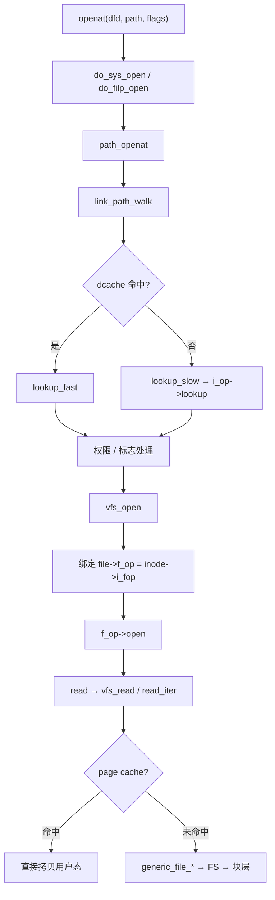
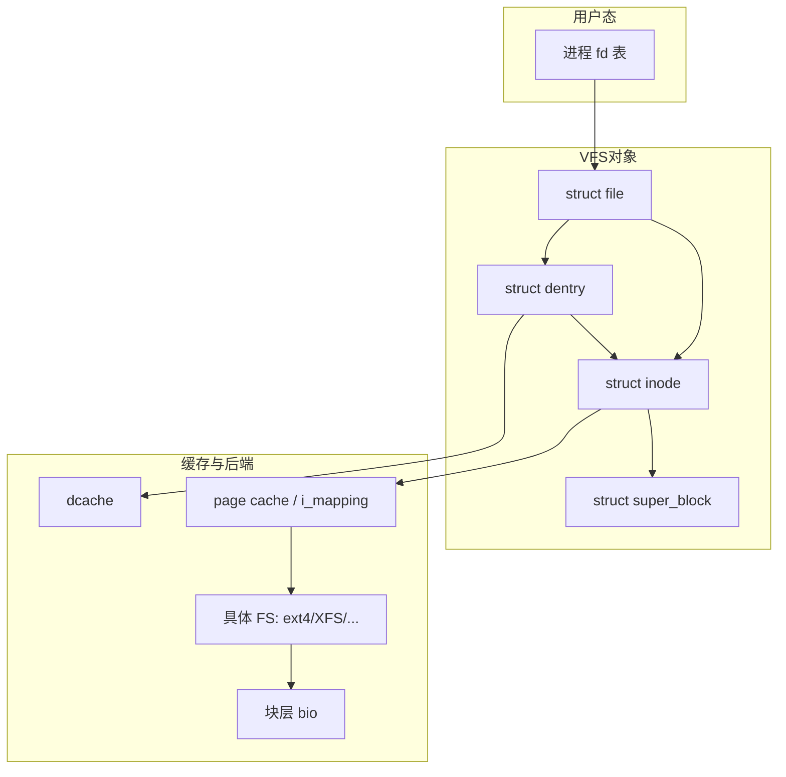

# Linux VFS 完整篇：从 path_openat、dentry/inode 到 page cache 与挂载排障

`open` 返回诡异 errno、海量小文件把内存打满、`O_DIRECT` 对齐失败、容器 overlay 写放大被误判成「磁盘慢」——根因多半落在 **VFS 对象模型与挂载/缓存策略**，而不是某一个具体 FS 的业务逻辑。本文把路径查找、打开绑定、读写与 page cache、挂载选项与观测命令合成一篇闭环，便于对照源码与 `strace`/`findmnt` 验证。

---

## 源码锚点

| 路径 | 作用 |
|------|------|
| `fs/namei.c` | `path_openat`、`link_path_walk`、lookup 快/慢路径 |
| `fs/open.c` | `do_sys_open` / `do_filp_open`、`vfs_open` |
| `fs/read_write.c` | `vfs_read` / `vfs_write`、`vfs_iter_*` |
| `fs/dcache.c` | dentry 缓存、negative dentry、回收协作 |
| `fs/inode.c` | inode 生命周期、权限相关入口 |
| `fs/super.c` | `super_block`、挂载/卸载协作 |
| `mm/filemap.c` | page cache：`filemap_read` / `generic_file_*` |
| `include/linux/fs.h` | `inode`、`file`、`file_operations`、`super_operations` |
| `include/linux/dcache.h` | `struct dentry` |
| `Documentation/filesystems/vfs.rst` | VFS 方法表总览 |

打开后用户态 fd 对应的内核对象：

```c
/* include/linux/fs.h */
struct file {
	const struct file_operations *f_op;
	struct inode *f_inode;
	void *private_data;
	loff_t f_pos;
	/* … */
};

struct file_operations {
	struct module *owner;
	ssize_t (*read)(struct file *, char __user *, size_t, loff_t *);
	ssize_t (*write)(struct file *, const char __user *, size_t, loff_t *);
	ssize_t (*read_iter)(struct kiocb *, struct iov_iter *);
	int (*open)(struct inode *, struct file *);
	/* … */
};
```

路径打开逻辑骨架（版本细节以树内符号为准）：

```c
/* 用户态 openat → 系统调用 → fs/namei.c / fs/open.c */
path_openat(...)
  → link_path_walk          /* 逐组件 */
  → lookup_fast(dcache) 或 lookup_slow(→ inode->i_op->lookup)
  → 处理 O_CREAT / O_TRUNC / 尾随斜线等
  → vfs_open
      → file->f_op = fops_get(inode->i_fop)
      → f_op->open(inode, file)   /* 具体 FS 或设备 fops */
```

---

## 调用链

### 打开与读写主路径



### 对象分层与缓存协作



---

## 重点知识

### 1. 四件套分工先分清，再谈「慢」

| 对象 | 职责 | 排障信号 |
|------|------|----------|
| **dentry** | 路径组件缓存（含 negative） | 找不到路径、海量小文件内存涨 |
| **inode** | 元数据 + `i_op`/`i_fop` + `i_mapping` | 权限/大小/时间戳异常 |
| **file** | 一次打开会话（位置、模式、`private_data`） | 打开后读写/ioctl 失败 |
| **super_block** | 一个挂载实例的 FS 全局状态 | 挂载只读、配额、冻结 |

故障先归类：**路径找不到**（dentry/权限）还是 **打开后读写失败**（f_op/块层），避免一上来改 FS 调优参数。

### 2. `file->f_op` 在 open 时钉死

后续 `read`/`write`/`ioctl` 都走这张表。设备节点会在字符/块层替换 fops（如 `chrdev_open`）；普通文件则是具体 FS 的 `file_operations`。挂错类型、overlay 层错乱、错误的 inode，都会进错操作集。

### 3. dcache、negative dentry 与内存压力

海量小文件遍历会堆 dentry/inode；`vm.vfs_cache_pressure` 影响回收积极性。negative dentry 加速「反复查不存在路径」，也能在并发创建场景下制造短暂「看不见刚创建的文件」的错觉——结合业务与 `strace` 看是 ENOENT 还是竞态。

### 4. page cache、回写与 `O_DIRECT`

- 缓冲 I/O：命中 `i_mapping` 则少读盘；脏页经 writeback 回盘。
- `O_DIRECT`：绕过 page cache，偏移/长度需按逻辑块对齐，否则常见 `EINVAL`。
- 观测脏页与回写：`/proc/meminfo` 的 `Dirty`/`Writeback`，配合 `iostat -x`。

### 5. 挂载选项与容器场景

```bash
findmnt -T /path/to/file
mount | grep <mp>
# 常见：noatime 降元数据写；ro/nodev/nosuid 安全边界
cat /proc/sys/vm/vfs_cache_pressure
```

| 场景 | 建议 | 常见坑 |
|------|------|--------|
| 数据库数据目录 | 单独挂载、评估 `noatime` | atime 更新放大写 |
| 容器 rootfs | 理解 overlay 上层写放大 | 误判底层磁盘慢 |
| SSD | `discard`/`fstrim` 策略明确 | 盲目 discard 拖延迟 |
| 只读根 | `ro` + 可写目录分离 | 应用写日志失败 |

### 6. 挂载与超级块：VFS 的另一半入口

打开路径管「文件」，挂载路径管「一棵树挂到哪里」。用户态 `mount` 最终落到 VFS 的挂载点与 `super_block` 装配：类型、标志（`MS_RDONLY` 等）、选项字符串交给具体 FS 的 `fill_super`/`get_tree` 一类入口（现代用 fs_context）。排障时：

- `findmnt -o TARGET,SOURCE,FSTYPE,OPTIONS -T <path>` 看实际生效选项；
- 只读根上写失败先看挂载 flags，再看应用路径是否写到只读层；
- 绑定挂载/`rbind` 容易造成「同一 inode 多个路径」的认知错乱，删文件前先 `findmnt`。

### 7. 写路径与回写（和读对称）

```text
write → vfs_write / write_iter
  → 缓冲写：标记 page dirty → 稍后 writeback → FS → bio
  → O_SYNC/fdatasync：在返回前推进完整性语义（细节随 FS）
```

脏页过高时，应用线程可能被卡住参与回写——表象是「业务变慢」，根因在写放大或落盘瓶颈。配合 `Dirty`/`Writeback` 与 FS journal 模式（如 ext4 data=ordered）一起看。

### 8. 观测与排障命令

```bash
strace -e openat,open,stat,read,write cat /path/to/file
cat /proc/meminfo | grep -E 'Cached|Dirty|Writeback'
iostat -x 1
slabtop -o | head   # 关注 dentry/inode 相关 slab
# 权限与挂载
namei -l /path/to/file
ls -ld $(dirname /path/to/file)
```

| 现象 | 优先怀疑 | 核对点 |
|------|----------|--------|
| `ENOENT`/`EACCES` | 路径/权限/挂载 | `namei`、`findmnt` |
| `EINVAL` on direct I/O | 对齐 | 块大小、缓冲地址 |
| 内存持续升高 | dentry/inode/page cache | `slabtop`、`vfs_cache_pressure` |
| 写延迟尖刺 | 脏页回写/日志 | `Dirty`、journal、`iostat` |
| 容器内写爆盘 | overlay 上层 | `df` 分层、`docker system df` 等 |
---

## Checklist

- [ ] 能口述 `path_openat` → dentry lookup → `vfs_open` → `f_op->open` 的链
- [ ] 分清故障在路径查找、权限、还是 `f_op`/块层
- [ ] `strace` 的 open 标志与 errno 能对应到 VFS 分支
- [ ] 理解 dentry/inode/file/super_block 各自职责
- [ ] 海量小文件场景评估过 `vfs_cache_pressure` 与目录布局
- [ ] `O_DIRECT`/挂载选项（`noatime` 等）按业务验证，而非照抄博客
- [ ] 容器 overlay 写放大与底层磁盘延迟能区分排查

---

## 小结

VFS 的设计意图是：**用统一对象模型让 ext4/XFS/NFS/proc 共享系统调用入口**。排障按「路径 → 绑定 f_op → 缓存/块层 → 挂载选项」分层推进；调优先改可观测、可回滚的挂载与压力参数，再碰具体 FS 内部。
