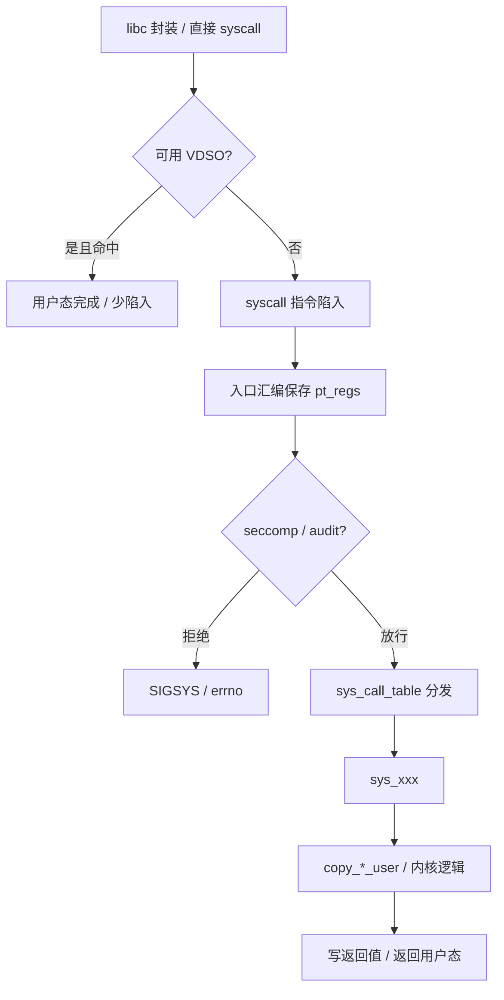
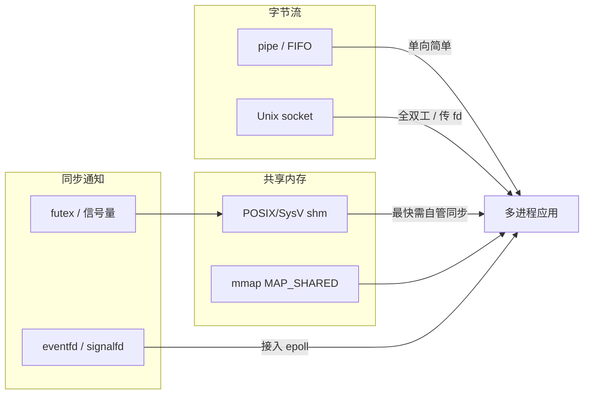

# Linux 系统调用与 IPC 完整篇：从 syscall 入口、VDSO 到 pipe/shm/futex 选型

日志代理 CPU 打满、多进程共享内存偶发脏数据、容器里 `ptrace`/`seccomp` 行为异常——问题常出在 **用户态进出内核的网关** 与 **IPC 语义选型**，而不是业务代码某一行。本文沿 syscall 入口、VDSO、`copy_*_user`、常见 IPC 与安全边界写成一篇可验证闭环。

---

## 源码锚点

| 路径 | 作用 |
|------|------|
| `arch/*/kernel/entry*.S` 或 `entry/` | 架构侧 syscall 入口、保存 `pt_regs` |
| `kernel/sys_ni.c` / 各 `sys_*.c` | 具体系统调用实现 |
| `include/linux/syscalls.h` | syscall 声明宏 |
| `mm/util.c` 等 | `copy_from_user` / `copy_to_user` 相关 |
| `fs/pipe.c` | pipe/FIFO |
| `ipc/shm.c`、`ipc/mqueue.c` | System V shm / POSIX mq（视配置） |
| `kernel/futex/*.c` 或 `kernel/futex.c` | futex（pthread 同步底座） |
| `kernel/fork.c` / `kernel/exit.c` | 进程生命周期与资源继承 |
| `net/unix/` | Unix domain socket |
| `kernel/seccomp.c` | seccomp 过滤 |
| `Documentation/userspace-api/seccomp_filter.rst` | seccomp 文档 |

用户态陷入后的逻辑骨架：

```c
/* 用户态 libc → syscall 指令 → 架构入口保存 pt_regs
   → 查 sys_call_table[nr] → 调用 sys_xxx(regs...)
   → 返回值写回寄存器 → 返回用户态 */

/* 典型数据边界 */
if (copy_from_user(kbuf, ubuf, len))
	return -EFAULT;
```

VDSO：内核映射到用户地址空间的页面，部分高频调用（如部分 `clock_gettime` 路径）可避免完整陷入。

---

## 调用链

### 一次系统调用



### IPC 选型数据流



---

## 重点知识

### 1. 系统调用是唯一合法内核入口（常规路径）

用户态不能直接调内核函数；经 syscall 门禁后才能碰内核对象。设计意图：

- 统一鉴权、审计、`seccomp`、命名空间边界；
- 用 `copy_*_user` 防止内核直接解引用用户指针。

排障首选：`strace -f -tt` 看 nr、参数与 errno，而不是先猜内核 bug。

### 2. VDSO：少陷入换吞吐

高频时间类调用常走 VDSO。观测：

```bash
ldd ./app | grep vdso
# 或
cat /proc/self/maps | grep vdso
strace -e clock_gettime date   # 视实现可能几乎无输出
```

调优时：减少无必要的 syscall 次数（批量 I/O、用户态缓存）往往比「换更快的 syscall」更有效。

### 3. IPC 怎么选

| 机制 | 特点 | 适用 | 坑 |
|------|------|------|-----|
| pipe/FIFO | 单向字节流，简单 | 父子/有名管道流水线 | 容量有限；FIFO 权限 |
| Unix socket | 全双工，可传 fd | 本地服务、SCM_RIGHTS | 路径/抽象命名空间 |
| 共享内存 | 无拷贝，最快 | 大数据块共享 | **必须**自管同步 |
| futex | 用户态快路径 + 内核慢路径 | pthread 锁/条件变量 | 误用导致挂死 |
| eventfd/signalfd | 与 epoll 友好 | 事件驱动服务 | 水平/边沿触发搞混 |
| 信号 | 异步通知 | 生命周期、简单事件 | 可重入、丢失语义 |

日志代理、零拷贝转发可看 `splice`/`tee`（pipe ↔ socket），用 CPU 占用验证收益。

### 4. 共享内存无锁 = 定时炸弹

`shmget`/`shmat` 或 `mmap(MAP_SHARED)` 只解决「看见同一页」。多写者必须用 futex/posix 锁/原子变量约定协议。多读者可考虑 seqlock/RCU 风格用户态协议，但要证明 ABA 与回收。

### 5. 安全边界：seccomp、ptrace、命名空间

```bash
# ptrace 范围（发行版默认可能非 0）
sysctl kernel.yama.ptrace_scope
# 消息队列等资源上限
ulimit -a
# 容器默认 seccomp 过宽/过严都会出「偶发 EPERM」
```

| 风险 | 表现 | 对策 |
|------|------|------|
| TOCTOU | `access` 后 `open` 被替换 | 直接 `open` + `O_NOFOLLOW` 等 |
| seccomp 过宽 | 沙箱可 `execve` 逃逸 | 白名单最小化 |
| seccomp 过严 | 正常 libc 调用失败 | 对照 `strace` 补齐 |
| shm 权限 | 无关进程可附着 | mode + 命名空间隔离 |

### 6. 关键 IPC 的内核落点（读码地图）

| 用户 API | 内核大致落点 | 备注 |
|----------|--------------|------|
| `pipe`/`pipe2` | `fs/pipe.c` | 环形缓冲，大小有上限 |
| `mkfifo` | 文件系统特殊 inode + pipe 实现 | 权限与存在性走 VFS |
| `socketpair` / `AF_UNIX` | `net/unix/` | 可 `SCM_RIGHTS` 传 fd |
| `mmap(MAP_SHARED)` | 内存管理 + 文件/`MAP_ANONYMOUS` | 与进程 `mm` 相关 |
| SysV `shm*` | `ipc/shm.c`（若启用） | 注意 `ipcrm` 泄漏 |
| `futex` | `kernel/futex*` | pthread 锁慢路径 |
| `eventfd` | `fs/eventfd.c` | 常与 epoll 搭配 |

读源码时先跟 **成功路径**，再跟 `-EFAULT`/`-EINVAL`/`-EAGAIN` 分支，避免在架构入口汇编里迷路。

### 7. 性能要点

- 批量：`readv`/`writev`、`sendmmsg`、减少往返次数。
- 大块数据优先 `mmap`/shm，小消息用 socket/pipe。
- `perf trace` / `bpftrace` 看热点 syscall，再决定是否合并调用。
- 父子进程优先考虑 `socketpair`+`fork` 传控制面，大数据走独立 shm。

```bash
strace -c -f ./app          # 统计 syscall 耗时占比
perf trace -p <pid> -- sleep 5
ipcs -m                     # 看 SysV shm 是否泄漏
ls -l /dev/shm              # POSIX shm 常见挂载点
```
---

## Checklist

- [ ] 能说明 syscall 入口：保存寄存器 → 查表 → `sys_xxx` → 返回
- [ ] 知道何时可能走 VDSO，并用 `/proc/self/maps` 确认
- [ ] 按「是否共享地址空间 / 是否需要传 fd / 是否要进 epoll」选 IPC
- [ ] 共享内存路径有明确同步协议，而不是「先跑起来再说」
- [ ] 会用 `strace -c`/`perf trace` 找 syscall 热点
- [ ] 容器场景核对过 seccomp 与 `ptrace_scope`
- [ ] 理解 `copy_from_user` 失败返回 `-EFAULT` 的边界含义

---

## 小结

系统调用把「谁能进内核、怎样带参数」收口；IPC 把「进程间如何交换」按拷贝成本与同步复杂度分层。选型先定数据形态与同步需求，再用 `strace`/`perf` 验证陷入次数与错误码；安全上把 seccomp 与指针拷贝当成默认防线，而不是事后补丁。
