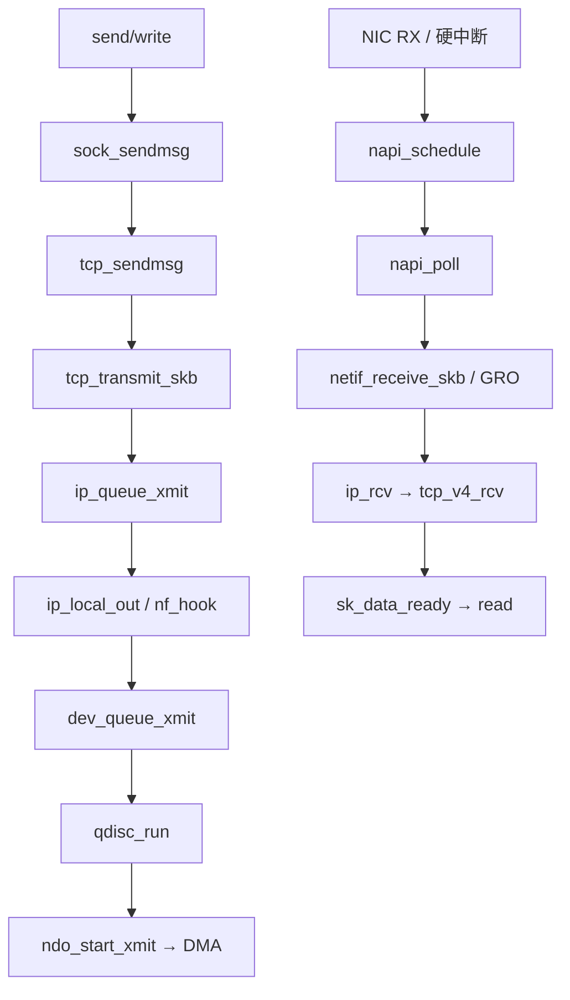

# Linux 网络协议栈完整篇：从 sock_sendmsg、sk_buff 到 NAPI 收发包与排障

跨洲吞吐上不去、`connect` 超时却 `ping` 正常、收包 CPU 飙在 `softirq`、调了 `tcp_rmem` 仍无感——根因多半落在 **socket → TCP/IP → qdisc → 驱动** 某一层，而不是某一个 `sysctl` 名字写错。本文沿发包与收包主路径对照源码锚点，把状态机、sysctl、NAPI/GRO、常见坑与可执行 Checklist 合成一篇闭环，便于用 `ss`/`tcpdump`/`softnet_stat` 验证。

---

## 源码锚点

| 路径 | 作用 |
|------|------|
| `net/socket.c` | `sock_sendmsg`、`__sys_sendmsg` 等系统调用入口 |
| `include/net/sock.h` | `struct sock`（协议无关状态、队列、回调） |
| `net/ipv4/tcp.c` / `tcp_output.c` / `tcp_input.c` | `tcp_sendmsg`、`tcp_transmit_skb`、`tcp_rcv_established` |
| `net/ipv4/tcp_ipv4.c` | `tcp_v4_rcv`、`tcp_v4_connect` |
| `net/ipv4/ip_output.c` / `ip_input.c` | `ip_queue_xmit`、`ip_rcv` |
| `net/core/skbuff.c`、`include/linux/skbuff.h` | skb 生命周期与 `head/data/tail/end` |
| `net/core/dev.c`、`include/linux/netdevice.h` | `dev_queue_xmit`、`netif_receive_skb`、`napi_struct` |
| `net/sched/sch_generic.c` | qdisc 入队/出队 |
| `net/ipv4/fib_*.c`、`net/netfilter/` | FIB 选路与 netfilter 挂钩 |
| `Documentation/networking/` | 网络子系统文档总览 |

核心对象：

```c
/* include/linux/skbuff.h */
struct sk_buff {
	struct sk_buff *next, *prev;
	struct sock *sk;
	sk_buff_data_t tail, end;
	unsigned char *head, *data;
	unsigned int truesize;
	/* … */
};

/* include/linux/netdevice.h */
struct napi_struct {
	unsigned long state;
	int weight;
	int (*poll)(struct napi_struct *, int);
	struct net_device *dev;
	/* … */
};
```

发包骨架：`sock_sendmsg` → `tcp_sendmsg` → `tcp_transmit_skb`/`tcp_write_xmit` → `ip_queue_xmit` → `ip_local_out` → `dev_queue_xmit` → qdisc → `ndo_start_xmit` → DMA。
---

## 调用链

### 发包与收包主路径



### 分层与数据流


---

## 重点知识

### 1. 发送路径：从 `sock_sendmsg` 到 `ndo_start_xmit`

`struct socket` 是 BSD 门面；状态在 `struct sock`/`tcp_sock`（窗口、重传队列、`sk_write_queue`）。`sock_sendmsg` → `tcp_sendmsg` 装 skb，受发送窗口、拥塞窗口、qdisc、驱动 ring 共同约束。

| 层 | 瓶颈表象 |
|----|----------|
| socket | `ss` 的 `Send-Q` 打满 |
| TCP | `ss -tin` 低 cwnd、高 retrans |
| qdisc | `tc -s qdisc` 深度涨 |
| 驱动 | `ethtool -S` drop / tx_timeout |

skb 层间推拉 `data`/`tail`，避免整包拷贝；TSO/GSO 推迟分段以降 CPU——抓包见大段不一定是线速异常。

### 2. 接收路径与 NAPI / GRO

NIC DMA → 硬中断 `napi_schedule` → softirq `napi_poll`（受 budget）→ GRO / `netif_receive_skb` → `ip_rcv` → `tcp_v4_rcv` → socket 队列 → `sk_data_ready`。

- **NAPI**：抑中断风暴；`/proc/net/softnet_stat` 的 `time_squeeze` 升 → 预算不够或单核过载。
- **GRO**：聚合后 `tcpdump` 可能见「巨帧」，非网卡乱发超长帧。
- **多队列**：RSS/RPS/RFS 打散 softirq；单核 100% 其它核空闲优先查亲和，勿盲目加 `rmem`。

进阶：XDP、sockmap、kTLS 改变处理/丢弃层级，排障时纳入路径图。

### 3. TCP 状态机、窗口与拥塞控制

三次握手 / 四次挥手、滑动窗口与拥塞控制决定「能不能发出去、以多快发出去」：

| 算法族 | 行为特征 | 实践注意 |
|--------|----------|----------|
| Reno/CUBIC | 丢包驱动降窗 | 高丢包链路易吞吐塌陷 |
| BBR | 估带宽与 RTT | 常需 **fq** qdisc；注意 bufferbloat |

只改 `tcp_congestion_control=bbr` 不配 `fq`，收益常打折；效果以本机 `ss -tin` 的 cwnd/rtt/delivery_rate 为准。`somaxconn` / `tcp_max_syn_backlog` 过小 → SYN 丢或 `connect` 超时；SYN cookie 抗洪不能掩盖 backlog 配错。长连接关注 keepalive 与防火墙对 `ESTABLISHED` 的超时。

### 4. sysctl 配置与可验证调优

配置写入 `/etc/sysctl.d/`，改前用 `ss`/`nstat` 建基线：

```bash
sysctl net.core.rmem_max net.core.wmem_max
sysctl net.ipv4.tcp_rmem net.ipv4.tcp_wmem
sysctl net.core.somaxconn net.ipv4.tcp_max_syn_backlog
sysctl net.ipv4.tcp_congestion_control net.ipv4.conf.all.rp_filter
sysctl net.core.netdev_budget net.core.netdev_max_backlog
tc qdisc replace dev eth0 root fq          # BBR 常配
ss -tin state established; ethtool -g eth0
ethtool -S eth0 | grep -iE 'drop|err|miss'
```

| 参数族 | 作用 | 常见坑 |
|--------|------|--------|
| `tcp_rmem`/`tcp_wmem` | 套接字缓冲自动调节 | 未按 BDP（带宽×RTT）估算 |
| `rmem_max`/`wmem_max` | 缓冲上限 | `setsockopt` 被截断 |
| `somaxconn`/`tcp_max_syn_backlog` | 监听与半连接 | 高并发建连超时 |
| `rp_filter` | 反向路径过滤 | 非对称路由误丢包 |
| `netdev_max_backlog` | softirq 前积压 | softnet drop |
| `tcp_congestion_control`+qdisc | 拥塞与 pacing | BBR 无 fq |

FIB 最长前缀匹配选路；ARP/NDISC 解析下一跳。`ping` 通只说明 ICMP 可达，TCP 仍可能卡在策略路由、conntrack 或半连接队列。

### 5. 常见坑与排障顺序

固定顺序：**复现 → 收集 `ss`/`nstat`/`softnet_stat`/`ethtool -S`/抓包 → 对比近期 sysctl/qdisc/防火墙变更 → 最小化隔离 → 记下根因与回归项**。

| 现象 | 优先怀疑 | 核对命令/点 |
|------|----------|-------------|
| `connect` 超时、`ping` 正常 | 半连接队列、防火墙、路由/NAT | `ss -s`、SYN 抓包、`iptables`/`nft`、路由对称性 |
| 吞吐上不去 | cwnd/RTT、缓冲不足、qdisc、丢包 | `ss -tin`、BDP、`tc -s`、对端重传 |
| softirq CPU 打满 | 单队列、RPS 未开、budget、GRO 关闭 | `softnet_stat`、`/proc/interrupts`、RSS/RPS |
| 合法包被丢 | `rp_filter`、netfilter、conntrack 满 | sysctl、`nft`、`conntrack -S` |
| 抓包见「巨帧」 | GRO/GSO/TSO | 关闭 GRO 对比或看驱动 offload 状态 |
| 内核丢包难定位 | skb 在钩子处被释放 | `dropwatch`、`bpftrace` 跟 `kfree_skb` |

观测速查：`ss -s`、`ss -tin`、`cat /proc/net/softnet_stat`、`nstat`、SYN 抓包、`perf top -e softirq_entry`。安全侧：SYN cookie、nft 限速、TLS/kTLS；调优与加固分开，避免为抗洪关掉必要 backlog。

---

## Checklist

- [ ] 能口述 `sock_sendmsg` → `tcp_sendmsg` → `ip_queue_xmit` → `dev_queue_xmit` → `ndo_start_xmit` 及文件位置
- [ ] 能口述收包：`napi_schedule` → `napi_poll` → `netif_receive_skb` → `ip_rcv`/`tcp_v4_rcv` → `sk_data_ready`
- [ ] 分清瓶颈在应用阻塞、TCP 窗口/拥塞、qdisc、还是驱动 ring（`ss`/`tc`/`ethtool`）
- [ ] 调 `tcp_rmem`/`wmem` 前算过 BDP，并确认 `rmem_max`/`wmem_max` 未截断
- [ ] 启用 BBR 时已确认 qdisc 为 `fq`（或等价 pacing）
- [ ] `connect` 失败查过半连接队列、防火墙与路由对称性，而非只加超时
- [ ] 非对称路由评估过 `rp_filter`；GRO 大包未误判为网卡故障
- [ ] 调优前有 `ss`/`nstat`/`softnet_stat` 基线，配置可回滚

---

## 小结

设计意图：**`sk_buff` 统一包模型，socket/`sock` 隔离协议，NAPI 把收包挪到可控 softirq，qdisc 分隔协议决策与设备出队**。排障按「系统调用 → 协议状态 → netfilter/路由 → qdisc → 驱动/NAPI」推进；优先改可观测、可回滚的缓冲/队列/亲和，再碰拥塞算法与卸载。
