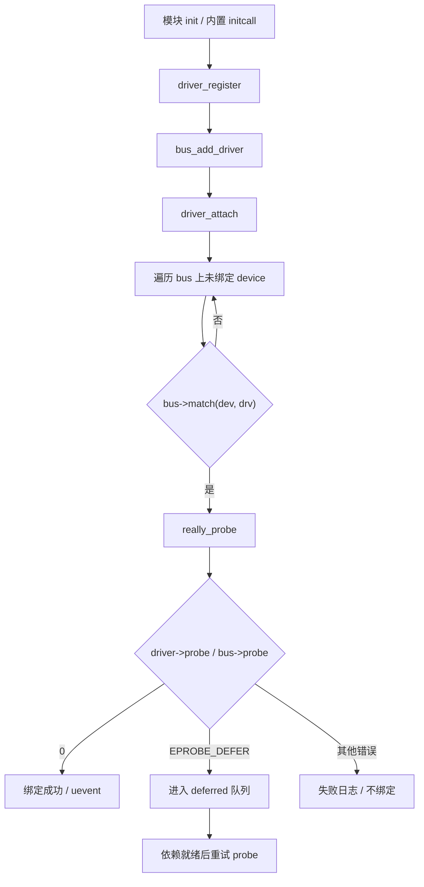
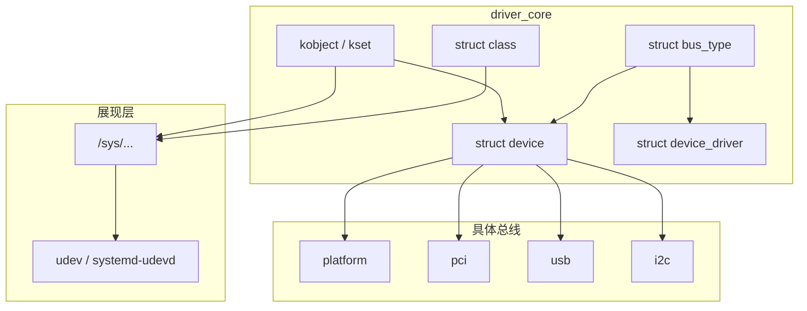

# Linux 设备驱动模型完整篇：bus/device/driver、sysfs、延迟 probe 与绑定排障

设备在 `/sys` 里看得见却不 `probe`、`compatible` 对了仍不绑驱动、上电顺序一变就随机失败——根因常在 **driver core 的匹配、绑定与依赖等待**，而不是 `probe` 函数体本身。本文把 kobject/sysfs、bus 三件套、`really_probe`、deferred probe、uevent/udev 与实战命令合成一篇闭环。

---

## 源码锚点

| 路径 | 作用 |
|------|------|
| `drivers/base/core.c` | `device_add` / `device_register`、sysfs 挂接 |
| `drivers/base/bus.c` | `bus_add_driver`、按 bus 遍历匹配 |
| `drivers/base/driver.c` | `driver_register` / `driver_attach` |
| `drivers/base/dd.c` | `__device_attach`、`really_probe`、deferred probe |
| `drivers/base/class.c` | `class`、设备节点类属性 |
| `lib/kobject.c` | kobject 引用与 sysfs 目录 |
| `include/linux/device.h` | `struct device` |
| `include/linux/device/driver.h` | `struct device_driver` |
| `include/linux/device/bus.h` | `struct bus_type`（`match`/`probe`/`remove`） |
| `include/linux/mod_devicetable.h` | `of_device_id` 等匹配表 |
| `Documentation/driver-api/driver-model/` | 设备模型文档 |

核心结构（字段以当前树为准）：

```c
/* include/linux/device/bus.h */
struct bus_type {
	const char *name;
	int (*match)(struct device *dev, struct device_driver *drv);
	int (*probe)(struct device *dev);
	int (*remove)(struct device *dev);
	/* … */
};

/* include/linux/device/driver.h */
struct device_driver {
	const char *name;
	struct bus_type *bus;
	struct module *owner;
	const struct of_device_id *of_match_table;
	int (*probe)(struct device *dev);
	int (*remove)(struct device *dev);
	/* … */
};
```

注册与绑定入口：

```c
driver_register(&my_drv);
/* → bus_add_driver → driver_attach
   → 对每个未绑定 device：bus->match → really_probe */

device_register(&my_dev);
/* → device_add → 尝试 device_attach → match/probe */
```

---

## 调用链

### 驱动侧绑定主路径



### 分层：kobject → 设备模型 → 具体总线



---

## 重点知识

### 1. 三件套：device / driver / bus

- **device**：硬件实例（或虚拟设备），挂在某条 bus 上，暴露资源与 sysfs。
- **driver**：驱动逻辑，声明所属 bus 与匹配表（如 `of_match_table`）。
- **bus**：定义 **如何 match**、以及默认的 probe/remove 约定。

匹配成功只代表「认领权」；真正初始化在 `probe`。排障时先确认 **match 是否发生**，再看 **probe 返回值**。

### 2. `really_probe` 与 `EPROBE_DEFER`

依赖的时钟、GPIO、供电、regulator 尚未就绪时，`probe` 应返回 `-EPROBE_DEFER`，由 driver core 稍后重试。硬编码 `msleep` 等依赖、或忽略 defer，会导致「冷启动偶发失败、热插拔却正常」一类问题。

资源申请优先 `devm_*`（devres）：错误路径自动释放，减少泄漏。

### 3. sysfs、uevent 与 udev

`device_add` 后在 `/sys` 建立目录与属性；成功绑定会发 uevent，udev 可按规则创建 `/dev` 节点、改权限。调试时：

```bash
ls -l /sys/bus/platform/devices/
ls -l /sys/bus/platform/drivers/
# 看驱动绑定
cat /sys/devices/.../driver_override 2>/dev/null
udevadm info -a -n /dev/xxx
dmesg | grep -iE 'probe|defer|of:'
```

### 4. platform / DT 与 PCI/USB 差异

| 总线 | 发现方式 | 匹配关键 | 典型坑 |
|------|----------|----------|--------|
| platform | DT/`platform_device` | `compatible` / 名称 | 漏节点、overlay 未加载 |
| PCI | 枚举配置空间 | `pci_device_id` | 电源/IOMMU、BAR 映射 |
| USB | 总线枚举 | idVendor/idProduct 等 | 接口驱动 vs 设备驱动混淆 |
| I2C/SPI | 适配器 + DT 子节点 | `compatible` + reg | 地址/总线号错 |

生命周期模式相近：match → probe → remove；资源描述方式不同。

### 5. runtime PM 与 probe 纪律

- `probe` 内避免长时间睡眠阻塞整条依赖链；能推迟的初始化放到工作队列。
- 实现 runtime PM 时明确：谁在用设备、idle 超时后关时钟/电源域。
- sysfs 可写属性必须做权限与输入校验，避免本地提权面。

### 6. class、cdev 与「看得见设备却没节点」

driver core 的绑定只解决「驱动认领设备」。字符设备还要把 `cdev` 挂到 `inode`，并用 `class_create`/`device_create`（或等价）导出 uevent，udev 才创建 `/dev/xxx`。PCI/USB 网卡等则更多靠子系统自己的 netdev/块设备注册。分层记忆：

1. bus 绑定成功 → `/sys/.../driver` 有符号链接；
2. 子系统注册用户可见对象 → 才有 `/dev` 或 `ip link`；
3. 权限由 udev 规则与 `MODE`/`GROUP` 决定。

### 7. 模块与 initcall 顺序

内置驱动靠 initcall 级别；可加载模块靠 `modprobe` 与 softdep。依赖供应商驱动（时钟、pinctrl、电源）未就绪时，消费者应 defer，而不是假定「谁先谁后固定」。查看：

```bash
lsmod
modinfo my_driver.ko
# 内核命令行可临时：my_driver.dyndbg=+p 等（视模块参数）
cat /sys/kernel/debug/devices_deferred 2>/dev/null
```

### 8. 绑定失败速查

| 现象 | 核对 |
|------|------|
| 有 device 无 driver 链接 | match 表、`compatible`、模块是否加载 |
| 有链接但功能异常 | `probe` 返回 0 但资源错；看 `dmesg` |
| 随机 defer 打满 | 依赖环或提供者从未注册 |
| `/dev` 无节点 | class/cdev 未注册，或 udev 规则过滤 |

```bash
# 强制解绑/绑定（平台示例，慎用于生产）
echo xxx > /sys/bus/platform/drivers/xxx_drv/unbind
echo xxx > /sys/bus/platform/drivers/xxx_drv/bind
modinfo my_driver.ko
modprobe my_driver
```
---

## Checklist

- [ ] 能画出 `driver_register` → `match` → `really_probe` 的链
- [ ] 知道 `-EPROBE_DEFER` 的正确用法，而不是盲目 `msleep`
- [ ] 能用 `/sys/bus/.../devices` 与 `drivers` 判断是否已绑定
- [ ] probe 错误路径用 `devm_*` 或成对释放，无资源泄漏
- [ ] DT `compatible` 与 `of_match_table` 字符串完全一致（含厂商前缀）
- [ ] 理解 uevent → udev → `/dev` 节点这一跳，能查 udev 规则
- [ ] 区分「未 match」与「match 后 probe 失败」两类日志

---

## 小结

设备模型把异构总线收成同一套 **注册、匹配、绑定、展现** 骨架：kobject 支撑 sysfs，bus 定义 match，`really_probe` 承接初始化与 defer。排障顺序固定为：**模块是否在 → match 是否命中 → probe 返回值 → 依赖是否 defer → udev 节点**。
