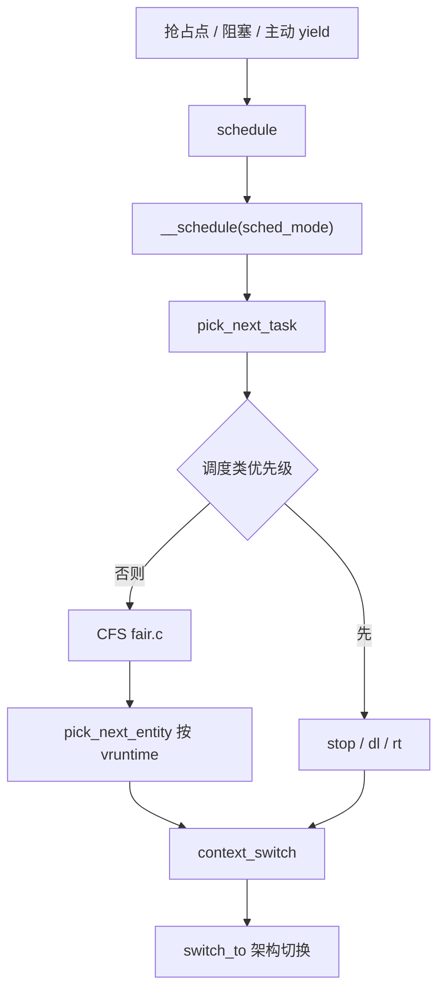
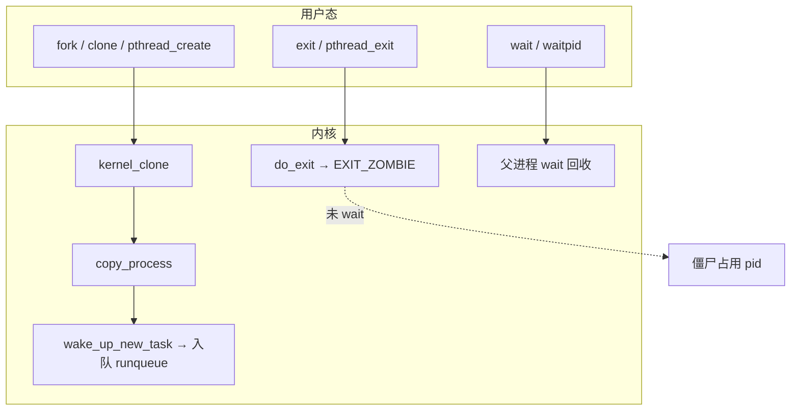

# Linux 进程调度完整篇：从 task_struct、fork 到 CFS/实时类与排障

线上 CPU 打满、延迟抖动、`D` 状态误判、僵尸堆积——根因常落在 **进程模型与调度路径**，而不是「再加几核」。本文把进程创建、状态机、CFS/实时调度类、上下文切换、cgroup 配额与观测命令合成一篇闭环，方便对照源码与 `perf sched` 验证。

---

## 源码锚点

| 路径 | 作用 |
|------|------|
| `include/linux/sched.h` | `task_struct`、`sched_entity`、进程状态宏 |
| `kernel/fork.c` | `copy_process`、`kernel_clone`（fork/clone 核心） |
| `kernel/sched/core.c` | `schedule`、`__schedule`、`scheduler_tick`、唤醒入口 |
| `kernel/sched/fair.c` | CFS：`entity_key`/`vruntime`、`pick_next_entity`、负载均衡相关 |
| `kernel/sched/rt.c` | `SCHED_FIFO`/`SCHED_RR` 实时类 |
| `kernel/sched/deadline.c` | `SCHED_DEADLINE` |
| `kernel/exit.c` | `do_exit`、僵尸与 `wait` 回收 |
| `arch/*/kernel/process.c` 等 | 架构侧 `switch_to` / 上下文切换 |
| `Documentation/scheduler/sched-design-CFS.rst` | CFS 设计说明 |

进程描述符关键字段（示意）：

```c
/* include/linux/sched.h */
struct task_struct {
	unsigned int			__state;
	int				prio, static_prio, normal_prio;
	const struct sched_class	*sched_class;
	struct sched_entity		se;	/* CFS */
	struct sched_rt_entity		rt;
	struct mm_struct		*mm;
	pid_t				pid;
	/* ... */
};
```

主动调度入口：

```c
/* kernel/sched/core.c */
asmlinkage __visible void __sched schedule(void)
{
	struct task_struct *tsk = current;

	sched_submit_work(tsk);
	do {
		preempt_disable();
		__schedule(SM_NONE);
		sched_preempt_enable_no_resched();
	} while (need_resched());
}
```

---

## 调用链

### 选路与切换（主路径）



### 创建与退出（分层）



---

## 重点知识

### 1. 进程 vs 线程：资源与调度单位

Linux 几乎不区分「内核线程对象」：`CLONE_THREAD` 共享 `mm`/`fs`/`files` 等，仍各自是一个 `task_struct`，独立上 CPU。排障时用 `ps -eLf` / `/proc/<pid>/status` 的 `NSpid`、`Threads` 看清共享关系，不要只看进程树。

### 2. 状态机：RUNNING / 可中断睡 / D 状态

- `TASK_RUNNING`：可运行（含正在跑与在 runqueue 上等 CPU）。
- `TASK_INTERRUPTIBLE`：可被信号打断的睡眠（常见于锁、管道、网络）。
- `TASK_UNINTERRUPTIBLE`（`D`）：多数等磁盘/设备完成；**CPU 空闲但 load 高** 时优先查块设备与 NFS，而不是盲目加核。
- `EXIT_ZOMBIE`：已退出、资源大部分释放，仍占一个 pid 槽，等父进程 `wait`。

查 `D`：`cat /proc/<pid>/stack`、`echo w > /proc/sysrq-trigger`（受控环境）。

### 3. CFS：vruntime 是公平尺子

CFS 用红黑树按 `vruntime` 排序；每次运行按权重累加虚拟时间。`nice` 映射权重：nice 越低权重越大，同等墙上时间累加更少 vruntime，从而更常被选中。树里只有**可运行**实体；睡眠任务出队，唤醒再入队并做放置补偿，避免「睡很久醒来垄断 CPU」。

### 4. 调度类分层

`pick_next_task` 按类优先级遍历：`stop` → `deadline` → `rt` → `fair` → `idle`。实时任务饥饿普通任务时，用 `kernel.sched_rt_runtime_us` / `sched_rt_period_us` 限制 RT 带宽；嵌入式周期任务再评估 `SCHED_DEADLINE`。

### 5. fork / COW 与调度入队

`copy_process` 复制 `task_struct`，页表写时复制；`wake_up_new_task` 把新任务挂到目标 CPU 的 runqueue。线程爆炸（每请求一线程）会放大：`task_struct`+内核栈内存、切换与 cache 颠簸。生产上线程池规模宜贴近 CPU 核数与 I/O 模型。

### 6. 配置与观测

```bash
# 策略与亲和
chrt -p <pid>
taskset -cp <pid>
nice -n 5 ./workload

# cgroup v2 CPU
echo 100000 100000 > /sys/fs/cgroup/.../cpu.max   # 限 100%
echo 200 > /sys/fs/cgroup/.../cpu.weight

# 调度痕迹
perf sched record -a -- sleep 5
perf sched latency
perf sched map

# 统计
grep -E 'nr_switches|nr_running' /proc/sched_debug 2>/dev/null
cat /proc/<pid>/sched
```

常用 sysctl：`kernel.sched_latency_ns`、`kernel.sched_min_granularity_ns`、`kernel.sched_wakeup_granularity_ns`（具体名随版本略有差异，以 `sysctl -a | grep sched` 为准）。

### 7. 常见坑

| 现象 | 常见根因 | 对策 |
|------|----------|------|
| load 高、CPU 空 | 大量 `D` 等 IO | 查磁盘/NFS/锁，看 `/proc/<pid>/stack` |
| 延迟毛刺 | 线程过多或 RT 占满 | 限线程、限 RT 带宽、绑核隔离 |
| 僵尸堆积 | 父进程未 `wait` | 修信号处理/`SA_NOCLDWAIT`/监督进程 |
| 容器「卡死」 | `cpu.max` 过紧 | 对照 `cpu.stat` throttled |

---

## Checklist

- [ ] 能指出 `schedule` → `__schedule` → `pick_next_task` → CFS/`rt` 的文件位置
- [ ] 能说明 vruntime 与 nice 权重的关系，以及睡眠任务为何出队
- [ ] 面对 `D` 状态会先查内核栈与 IO，而不是只加 CPU
- [ ] 会用 `chrt`/`taskset`/`cpu.max` 做策略、亲和与配额验证
- [ ] 会用 `perf sched latency/map` 看切换与延迟
- [ ] 知道僵尸需父进程回收，能解释 fork 风暴的危害
- [ ] 理解 RT/DL 优先于 CFS，并知道 RT 带宽限制入口

---

## 小结

进程调度的设计意图是：**用统一的 `task_struct` 描述一切可调度实体，用调度类分层保证实时性，用 CFS 的 vruntime 在普通任务间做公平份额**。读码从 `fork.c` 的创建与 `sched/core.c` 的切换两端夹击，再用 `perf sched` 闭环验证，比背概念更有效。
