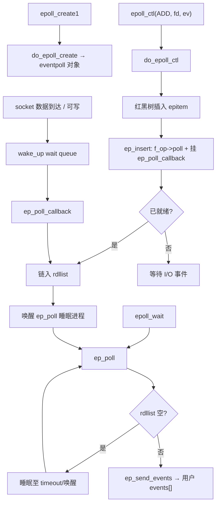
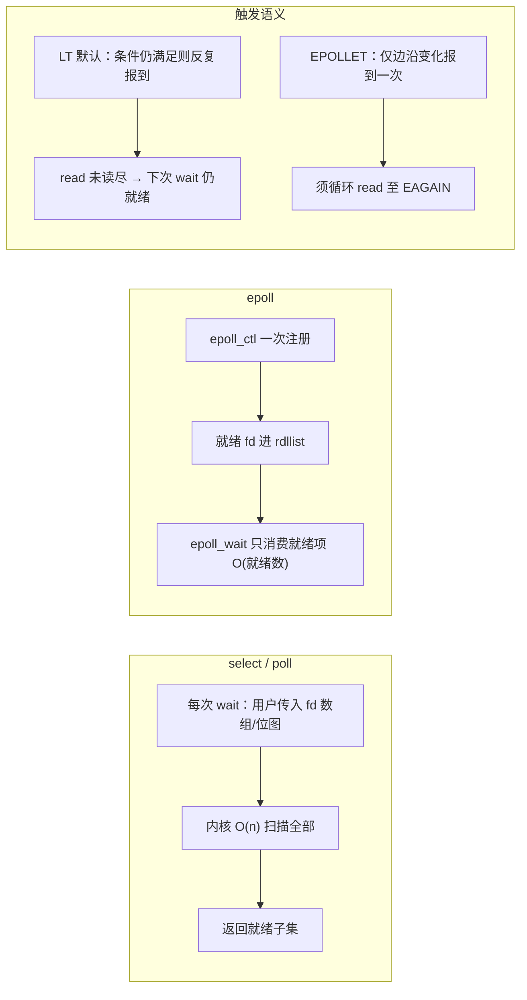
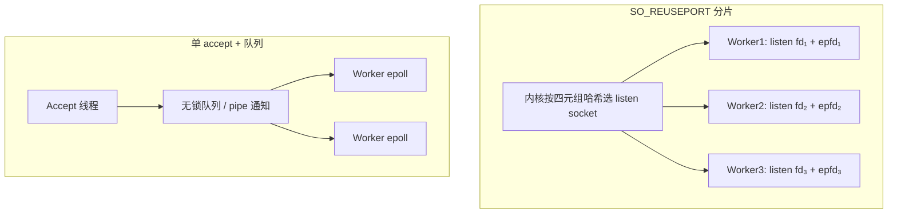

# Linux I/O 多路复用完整篇：select/poll/epoll 对比、就绪模型与排障

高并发服务里 CPU 飙高却吞吐上不去、`epoll_wait` 空转或漏事件、ET 模式下连接「假死」——根因往往在 **就绪语义（LT/ET）、fd 生命周期与非阻塞读写** 没对齐，而不是「用了 epoll 就一定快」。

I/O 多路复用让单线程（或少量线程）同时监视大量 fd：**内核维护「谁就绪」**，用户态在 `select`/`poll`/`epoll_wait` 返回后处理 I/O。本文从就绪模型 → `select`/`poll`/`epoll` 机制对比 → `fs/eventpoll.c` 主链 → LT/ET/ONESHOT → 与非阻塞配合 → 惊群与上限 → 选型排障，形成闭环。076 已单独发过 epoll 源码精读；本篇合并 073–075、077–079，侧重 **概念—机制—实践—排障** 全链路，不重复 076 的逐行源码 walkthrough。

---

## 源码锚点

| 路径/符号 | 作用 |
|-----------|------|
| `fs/select.c` | `core_sys_select`、`do_select`；`poll`/`ppoll` 共用 poll 框架 |
| `fs/eventpoll.c` | `do_epoll_create`、`do_epoll_ctl`、`ep_poll`、`ep_send_events` |
| `include/uapi/linux/eventpoll.h` | `epoll_event`、`EPOLLIN`/`EPOLLET`/`EPOLLONESHOT` |
| `include/linux/eventpoll.h` | 内核 `eventpoll`、`epitem` 声明 |
| `epitem` | 每个被监控 fd 在红黑树中的节点，挂 wait queue 回调 |
| `ep_poll` | `epoll_wait` 内核入口：等就绪链表或超时 |
| `EPOLLET` | 边沿触发：仅状态**变化**时上报 |
| `EPOLLONESHOT` | 一次事件后自动 disarm，需 `EPOLL_CTL_MOD` 重新武装 |
| socket `->poll` / wait queue | 数据到达时 `wake_up` → epoll 回调 |

用户态 API 骨架：

```c
/* epoll — 现代 Linux 高并发首选 */
int epfd = epoll_create1(EPOLL_CLOEXEC);
struct epoll_event ev = { .events = EPOLLIN | EPOLLET, .data.fd = fd };
epoll_ctl(epfd, EPOLL_CTL_ADD, fd, &ev);
int n = epoll_wait(epfd, events, maxevents, timeout);

/* select — 兼容最广，fd 集合拷贝 + 线性扫描 */
fd_set rfds;
FD_ZERO(&rfds); FD_SET(fd, &rfds);
select(fd + 1, &rfds, NULL, NULL, &tv);

/* poll — 无 FD_SETSIZE 硬限，仍 O(n) 扫描 */
struct pollfd pfd = { .fd = fd, .events = POLLIN };
poll(&pfd, 1, timeout);
```

内核侧 `epitem`（概念）：每个 `(epfd, fd)` 对应一棵树节点 + wait queue 回调；就绪项串在 `rdllist`（就绪链表）上，由 `ep_poll_callback` 链入。

---

## 调用链

### epoll 主链：ctl 注册 → 就绪唤醒 → wait 取事件



### select/poll/epoll 扫描模型与 LT/ET 数据流



文字版 epoll 链（与 076 互补，便于 strace 对照）：

```text
epoll_create1 → do_epoll_create
epoll_ctl(ADD) → do_epoll_ctl → ep_insert → 目标 file 的 poll 回调
I/O 就绪 → ep_poll_callback → rdllist → 唤醒 ep_poll
epoll_wait → ep_poll → ep_send_events 拷贝到用户态
```

---

## 重点知识

### 1. 就绪模型：level-triggered 与 edge-triggered

| 模式 | 标志 | 语义 | 用户态要求 |
|------|------|------|------------|
| 水平触发 LT | 默认（无 `EPOLLET`） | fd **仍满足**可读/可写条件，每次 `wait` 都可再报 | 可读一部分即可；易用 |
| 边沿触发 ET | `EPOLLET` | 仅在 **状态变化**（不可读→可读）时报一次 | **必须**非阻塞 + 循环读到 `EAGAIN` |
| 单次触发 | `EPOLLONESHOT` | 报一次后 disarm，防多线程重复消费 | 处理完 `EPOLL_CTL_MOD` 重新武装 |

`select`/`poll` 语义等价于 **LT**：条件持续满足则反复就绪。ET 减少重复通知，但漏读即「饿死」——生产网络库标配 `SOCK_NONBLOCK | EPOLLET` + drain 循环。

### 2. select / poll / epoll 对比与选型

| 维度 | select | poll | epoll |
|------|--------|------|-------|
| fd 上限 | `FD_SETSIZE`（通常 1024，可编译改） | 仅受 `RLIMIT_NOFILE` | 受 `RLIMIT_NOFILE` + `max_user_watches` |
| 注册成本 | 每次 `select` 传 fd_set | 每次 `poll` 传数组 | `epoll_ctl` 一次，后续只 `wait` |
| wait 复杂度 | O(n) 扫描位图 | O(n) 扫描 pollfd | O(就绪数) 取 rdllist |
| fd 表示 | 位图，大 fd 需 `nfds= max+1` | `struct pollfd` 数组 | 内核红黑树，用户只收事件 |
| 跨平台 | POSIX 广泛 | POSIX | Linux 特有 |
| 典型场景 | 少量 fd、移植优先 | 中等连接、代码简单 | 高并发 TCP/UDP 服务器 |

**选型建议**：Linux 上新服务默认 **epoll**；需跨平台或 fd < 几十 可用 `poll`；遗留/嵌入式 libc 仅 `select` 时注意 `FD_SETSIZE`。连接数上千仍用 `poll` 扫描全表，CPU 会花在「等不到事件的 fd」上。

### 3. epoll 为何能撑高并发（机制层）

- **注册与等待分离**：`epoll_ctl` 把 `epitem` 插入红黑树并挂回调；`epoll_wait` 热路径只遍历 **就绪链表**，不扫全表。
- **回调驱动**：socket 等在 wait queue 上 `wake_up` → `ep_poll_callback` → 链入 `rdllist`，避免轮询睡眠中的 fd。
- **代价**：每 fd 需显式 `ADD`/`DEL`；ET/ONESHOT 语义要严格；关闭 fd 前须 `DEL` 或保证生命周期，否则 **fd 号复用** 导致野事件。

`epoll_event.data` 是用户私有字段（常存 fd 或指针），内核不解释。

### 4. 与非阻塞 I/O 配合

多路复用解决 **「等谁」**；非阻塞解决 **「读空/写满时不挂死线程」**。二者常一起用：

```c
/* 接受连接后设非阻塞 */
int fl = fcntl(cfd, F_GETFL, 0);
fcntl(cfd, F_SETFL, fl | O_NONBLOCK);

/* ET 读循环 */
for (;;) {
	ssize_t n = read(cfd, buf, sizeof(buf));
	if (n > 0) { /* 处理 */ continue; }
	if (n == 0) { /* 对端关闭 */ break; }
	if (errno == EAGAIN || errno == EWOULDBLOCK) break;
	/* 真错误 */
}
```

**阻塞 fd + epoll** 的坑：`epoll_wait` 返回可读后，`read` 仍可能阻塞（对端慢、半包等），工作线程被拖死。监听 socket 可阻塞 accept，已接入连接建议非阻塞。

### 5. 惊群（thundering herd）

**经典惊群**：多个进程/线程 **同时** `accept` 同一 listening fd（或都 `epoll_wait` 同一批 fd），内核唤醒多个 waiter，仅一个成功，其余空醒再睡——CPU 抖动。

| 场景 | 说明 | 常见对策 |
|------|------|----------|
| pre-fork + accept | 多进程抢 listen fd | `SO_REUSEPORT` 每进程独立 listen；或单 accept 分发 |
| EPOLLET + 多线程 | 多线程 `epoll_wait` 同 epfd | 单 reactor 或多 epfd 分片；`EPOLLONESHOT` 防重复 |
| Linux 2.6+ accept | 已做「唤醒一个」优化 | 仍建议明确模型，别假设「内核全搞定」 |

`EPOLLONESHOT`：事件触发后内核 disarm 该 epitem，其他线程不会再收到同一 fd 的重复就绪，处理完需 `epoll_ctl(MOD)` 重新监听。

### 6. 最大 fd 与系统限制

| 限制项 | 查看/调整 | 现象 |
|--------|-----------|------|
| 进程 fd 数 | `ulimit -n` / `RLIMIT_NOFILE` | `EMFILE`、`Too many open files` |
| epoll 监控项 | `cat /proc/sys/fs/epoll/max_user_watches` | `epoll_ctl` 失败（ENOMEM 类） |
| select 位图 | `FD_SETSIZE`（glibc 默认 1024） | fd ≥ 1024 用 `FD_SET` 未定义行为 |
| 系统总 fd | `/proc/sys/fs/file-max` | 全局耗尽 |

生产部署：systemd `LimitNOFILE=`、容器 cgroup、与连接池/超时关闭联动，避免只抬 ulimit 不回收 fd。

### 7. 配置与观测

```bash
#  syscall 轨迹
strace -e select,poll,ppoll,epoll_create1,epoll_ctl,epoll_wait ./server

# 句柄与 epoll 监控数
ulimit -n
cat /proc/sys/fs/epoll/max_user_watches
ls -l /proc/$PID/fd | wc -l

# 连接规模旁证
ss -s
ss -tan state established | wc -l

# 热点：是否卡在 wait
perf record -e syscalls:sys_enter_epoll_wait -p $PID -- sleep 5
perf report
```

对比实验：同连接数下 `poll` vs `epoll` 看 CPU；ET 模式下故意不读尽，观察是否不再唤醒。

### 8. 常见坑与排障

| 现象 | 根因 | 对策 |
|------|------|------|
| ET 下连接无响应 | 未读到 `EAGAIN` | 非阻塞 + drain 循环 |
| 偶发错 fd 事件 | 关 fd 未 `EPOLL_CTL_DEL`，号被复用 | 关闭路径 DEL；或 `data.ptr` 带 generation |
| `epoll_wait` 饿死 | `maxevents` 过小且未循环取尽 | 增大 batch 或 LT 下循环 wait |
| 工作线程卡死 | 阻塞 `read`/`write` | 连接设 `O_NONBLOCK` |
| ONESHOT 后永不就绪 | 未 `MOD` 重新武装 | 处理完 `epoll_ctl(MOD)` |
| CPU 高、QPS 低 | 仍用 select/poll 扫万级 fd | 换 epoll；或减少无效 fd |
| 多线程竞态 | 同 fd 多线程同时读写 | 连接绑定线程；或 ONESHOT + 队列 |
| LT + 高活跃 fd | 同一 fd 每次 wait 都报 | 改 ET 或应用层去重 |

**select 特有问题**：每次调用需把 fd_set **从用户拷入内核**；返回集被改写，需 `FD_SET` 重建。大 fd 值使 `nfds` 很大，扫描仍 O(n)。

**poll 特有问题**：无 1024 硬限，但 wait 仍线性扫 `nfds` 个 `pollfd`；返回时检查 `revents`。

### 9. 与驱动 / 其他 fd 类型

字符设备、eventfd、timerfd、signalfd 均可进 epoll，前提是 **`file_operations.poll` + `poll_wait`** 正确实现（驱动里 `poll_wait` 挂 wait queue，有数据时 `wake_up`）。用户态 pipe、socket、tty 已由内核子系统接好；自研驱动漏 `wake_up` 会表现为 epoll 永不就绪。

### 10. LT / ET 完整读写循环（可对照 `strace` 验证）

**水平触发 LT**（默认，无 `EPOLLET`）：每次 `epoll_wait` 返回后，只要接收缓冲区仍有数据，下次 wait 仍会报 `EPOLLIN`。读循环可以「读一批就返回」，不必强制 drain；但若长期只读一部分，高 QPS 下同一 fd 会反复占用 `events[]`，增加调度开销。

```c
/* LT 读：读到 EAGAIN 或本次无数据即可退出 */
static void handle_read_lt(int epfd, int cfd, struct epoll_event *ev)
{
	char buf[4096];
	for (;;) {
		ssize_t n = read(cfd, buf, sizeof(buf));
		if (n > 0) {
			/* 业务处理 buf[0..n) */
			continue;
		}
		if (n == 0) {
			epoll_ctl(epfd, EPOLL_CTL_DEL, cfd, NULL);
			close(cfd);
			return;
		}
		if (errno == EAGAIN || errno == EWOULDBLOCK)
			break;   /* LT：留数据在缓冲，下次 wait 再报 */
		perror("read");
		break;
	}
}
```

**边沿触发 ET**（`EPOLLET`）：内核仅在「不可读→可读」边沿上报一次。若只读一部分，剩余数据不会再次唤醒 epoll，连接表现为假死。必须 **非阻塞 + 循环读到 `EAGAIN`**；写侧同理，循环 `write` 直到 `EAGAIN` 或写完。

```c
/* ET 读：必须 drain 至 EAGAIN */
static void handle_read_et(int epfd, int cfd)
{
	char buf[4096];
	for (;;) {
		ssize_t n = read(cfd, buf, sizeof(buf));
		if (n > 0) {
			/* 处理 */
			continue;
		}
		if (n == 0) {
			epoll_ctl(epfd, EPOLL_CTL_DEL, cfd, NULL);
			close(cfd);
			return;
		}
		if (errno == EAGAIN || errno == EWOULDBLOCK)
			break;   /* ET：必须读到这里，否则饿死 */
		perror("read");
		break;
	}
}

/* ET 写：可写边沿只报一次，须循环写 */
static void handle_write_et(int cfd, const void *data, size_t len)
{
	const char *p = data;
	while (len) {
		ssize_t n = write(cfd, p, len);
		if (n > 0) {
			p += n;
			len -= n;
			continue;
		}
		if (n < 0 && (errno == EAGAIN || errno == EWOULDBLOCK))
			break;   /* 发送缓冲满，等下次 EPOLLOUT 边沿 */
		perror("write");
		break;
	}
}
```

注册时 ET 监听 socket 的典型组合：`EPOLLIN | EPOLLOUT | EPOLLET | EPOLLRDHUP`，且 `accept` 后立刻 `fcntl(..., O_NONBLOCK)`。`EPOLLRDHUP` 用于检测对端半关闭，避免 ET 下漏读 FIN。

### 11. epoll 与多线程 accept 策略

多线程高并发服务器常见三种模型，选型直接影响是否惊群、连接分配是否均匀：

| 模型 | 做法 | 优点 | 注意 |
|------|------|------|------|
| 单 accept 线程 | 仅一个线程 `accept`，连接 fd 投递队列给 worker | 无 listen fd 惊群 | accept 线程可能成为瓶颈 |
| 多线程共 epfd | 多 worker 同调 `epoll_wait(epfd)` | 实现简单 | 需 `EPOLLONESHOT` 或连接绑定，防同 fd 重复消费 |
| `SO_REUSEPORT` | 每线程独立 `socket+bind+listen+epoll` | 内核哈希分发连接，无惊群 | 需 Linux 3.9+；进程/线程数与 CPU 核数匹配 |

`SO_REUSEPORT` 骨架（与 Nginx/部分 Go net 库同类思路）：

```c
int ls = socket(AF_INET, SOCK_STREAM | SOCK_NONBLOCK, 0);
int on = 1;
setsockopt(ls, SOL_SOCKET, SO_REUSEPORT, &on, sizeof(on));
/* bind + listen 后，每 worker 线程独立 epoll_ctl(ADD, ls, EPOLLIN|ET) */
```

多线程 **共用一个 epfd** 时，推荐 **EPOLLONESHOT**：某 worker 被唤醒处理 fd 后，其他线程不会再收到该 fd 的就绪事件；处理完须 `epoll_ctl(EPOLL_CTL_MOD, ...)` 重新武装。若用 LT 且多线程同时 `read` 同一 cfd，会出现数据竞争与重复唤醒。



### 12. timerfd / eventfd 接入 epoll

除 socket 外，定时与线程间通知也常进 epoll，实现 **单线程统一事件源**（Reactor 核心模式）。

**timerfd**（`#include <sys/timerfd.h>`）：到期可读，`read` 返回 uint64_t 溢出次数；精度由内核 hrtimer 保证，比 `sleep` + 轮询更适合集成进 `epoll_wait` 循环。

```c
int tfd = timerfd_create(CLOCK_MONOTONIC, TFD_NONBLOCK | TFD_CLOEXEC);
struct itimerspec its = {
	.it_value = { .tv_sec = 1, .tv_nsec = 0 },
	.it_interval = { .tv_sec = 1, .tv_nsec = 0 },
};
timerfd_settime(tfd, 0, &its, NULL);
struct epoll_event ev = { .events = EPOLLIN | EPOLLET, .data.fd = tfd };
epoll_ctl(epfd, EPOLL_CTL_ADD, tfd, &ev);
/* epoll_wait 返回后 */
uint64_t exp;
read(tfd, &exp, sizeof(exp));  /* 必须读，否则 LT 下反复就绪 */
```

**eventfd**（`#include <sys/eventfd.h>`）：其他线程 `write(eventfd, &val, 8)` 唤醒 epoll 主循环，常用于 **跨线程任务投递**（替代 pipe 写端，语义更轻）。

```c
int efd = eventfd(0, EFD_NONBLOCK | EFD_CLOEXEC);
epoll_ctl(epfd, EPOLL_CTL_ADD, efd, &(struct epoll_event){
	.events = EPOLLIN, .data.fd = efd });
/* 工作线程通知 */
uint64_t one = 1;
write(efd, &one, sizeof(one));
/* 主循环 */
uint64_t cnt;
read(efd, &cnt, sizeof(cnt));
```

二者在内核均实现 `->poll`，走与 socket 相同的 `ep_poll_callback` → `rdllist` 路径（见 `fs/timerfd.c`、`fs/eventfd.c`）。

### 13. busy-loop、超时与 `epoll_wait` 行为

| `timeout` | 行为 | 典型用途 |
|-----------|------|----------|
| `-1` | 无就绪则永久睡眠，直到事件或信号 | 纯事件驱动服务 |
| `0` | 不睡眠，立即返回（busy-poll 探针） | 合并定时逻辑、低延迟探活 |
| `>0` | 最多等待 ms，超时返回 0 | 周期性 housekeeping、优雅退出 |

**busy-loop 陷阱**：`timeout=0` 在循环中调用且无其他阻塞，会导致 **100% CPU 空转**。正确用法是：要么 `timeout=-1` 完全事件驱动，要么 `timeout>0` 作为「最长空闲时间」，在返回 0 时做超时任务。混合 timerfd 时，通常 `epoll_wait(..., -1)`，由 timerfd 承担周期唤醒，避免人为 busy-poll。

**信号打断**：`epoll_wait` 可被信号中断返回 `-1/EINTR`；生产代码须重试或配合 `signalfd` 将信号纳入 epoll 统一管理。

### 14. epoll 与 io_uring 对比（选型参考）

Linux 5.1+ 的 **io_uring**（`io_uring_setup` / `io_uring_enter`，实现于 `io_uring/`）提供共享环形队列，可在 **一次系统调用中批量提交读写 accept**，并支持 `IORING_OP_POLL_ADD` 等等价多路复用语义。与 epoll 对比如下：

| 维度 | epoll | io_uring |
|------|-------|----------|
| 成熟度 | 极高，POSIX 生态广泛示例 | 新，高性能库（tokio-uring 等）在跟进 |
| 模型 | 就绪通知：用户再 `read`/`write` | 可就绪可完成：内核代提交 SQE |
| 系统调用 | `wait` + 每次 I/O 常各一次 | 批量提交 + 批量收割，syscall 更少 |
| 适用 | 通用 TCP/UDP、中间件 | 极端 IOPS、NVMe、自定义零拷贝 |
| 学习成本 | 低 | 需理解 SQ/CQ、固定 buffer 注册 |

**结论**：绝大多数网络服务 **epoll + 非阻塞** 仍是最稳默认；当 profiling 显示 syscall 占比极高、且内核 ≥5.10 时，再评估 io_uring 或 `IORING_SETUP_SQPOLL`。二者可共存：io_uring 的 poll 与 epoll 内核侧均依赖 wait queue，但用户 API 完全不同，不宜混用同一抽象层而不加封装。

### 15. 内核 `epitem` / `rbr` 结构简述

`fs/eventpoll.c` 中每个 epoll 实例对应 `struct eventpoll`（定义于 `include/linux/eventpoll.h`），核心字段：

- **`rbr`**：红黑树根，存所有监控项；键为 `(struct file *, fd)` 映射的 `epitem`，保证 `epoll_ctl(ADD)` 时 O(log n) 查重与删除。
- **`rdllist`**：就绪链表，由 `ep_poll_callback` 在 I/O 就绪时链入；`epoll_wait` 只遍历此链表，不扫描 `rbr` 全树。
- **`ovflist`**：就绪链表关闭时的溢出单链表（极端并发下使用）。

每个 **`struct epitem`** 关联一个被监控 fd 的 `struct file *`，内含：

- 红黑树节点 `rbn`、就绪链表节点 `rdllink`；
- `wait`：`wait_queue_entry`，挂到目标 file 的 poll 等待队列；
- `event`：用户传入的 `epoll_event`（含 `events` 与 `data`）；
- `next`：串接就绪项。

`ep_insert`（ADD 路径）调用目标 `file->f_op->poll`，若已就绪则直接 `ep_poll_callback` 链入 `rdllist`；否则仅挂回调。socket 数据到达时 `sock_def_readable` → `wake_up` → `ep_poll_callback` → 唤醒 `ep_poll` 中睡眠的进程。理解 **rbr 与 rdllist 分离** 即可解释「为何 epoll_ctl 一次、wait 只处理活跃 fd」。

### 16. `max_user_watches` 调优

每个 `epoll_ctl(ADD)` 会在全局计数上占用一个 watch（所有 epoll 实例合计）。上限由 **`/proc/sys/fs/epoll/max_user_watches`** 控制，默认常见为 `/proc/sys/fs/file-max` 量级的一定比例（因内核版本与发行版而异）。

```bash
# 查看
cat /proc/sys/fs/epoll/max_user_watches

# 临时调大（需 root；容器内可能只读）
sudo sysctl -w fs.epoll.max_user_watches=2000000

# 持久化：/etc/sysctl.d/99-epoll.conf
# fs.epoll.max_user_watches = 2000000
```

**何时需要调**：单进程监控连接数超过默认 watch（如百万连接网关、长连接推送）；`epoll_ctl` 返回 `-1` 且 `errno` 为 `ENOMEM`/`EPERM` 时查 dmesg 与上述 sysctl。**注意**：抬 watch 上限不替代 **fd 回收** 与 `ulimit -n`；watch 数 ≈ 仍在 epoll 中的 fd 数，关闭 fd 前 `DEL` 可及时释放 watch。Kubernetes / systemd 部署时同时检查 cgroup `pids.max` 与 `LimitNOFILE=`。

---


---

*合并自：Linux系统编程/chapters/073–075、077–079（IO 多路复用）；076 已独立发布 epoll 源码精读，本篇不重复其逐函数分析。*（2026-09-07）
