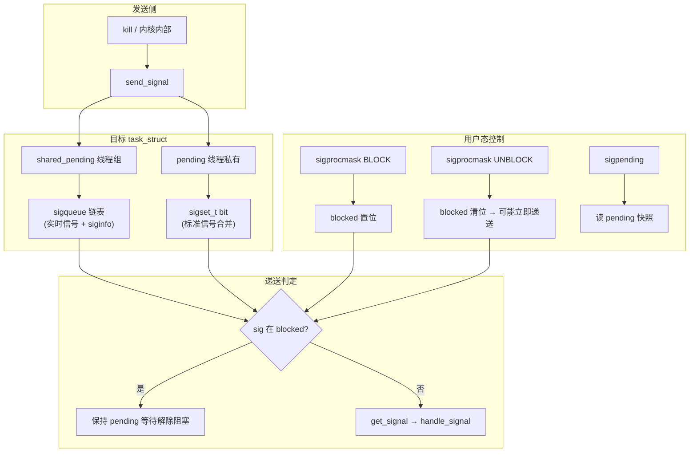

# Linux 信号处理完整篇：从 sigaction、掩码到内核发送与可重入排障

`SIGCHLD` 收不到、`EINTR` 让 read 永远失败、handler 里调 `printf` 偶发死锁、多线程程序 `pthread_kill` 后行为诡异——根因往往在 **信号语义（丢失/排队）、掩码与 pending 队列、handler 可重入边界**，而不是业务逻辑本身。

信号是内核向进程/线程投递的**异步软件中断**：默认动作（终止/忽略/停止/继续）、自定义 handler、或阻塞等待。与硬件中断不同，信号处理发生在**返回用户态**的路径上：内核不在中断上下文里直接调用你的 C 函数，而是修改用户栈、保存 `ucontext`，再跳转到 `sa_handler`。理解这一点，就能解释为何 handler 限制如此之多、为何 `volatile sig_atomic_t` 足够同步、为何 self-pipe 成为经典模式。

本文从 POSIX API → glibc → 内核 `kernel/signal.c` → `arch/*/kernel/signal*.c` 构建栈帧 → 用户 handler → `rt_sigreturn` 的完整链路，覆盖标准/实时信号、掩码、自管道、多线程、`signalfd` 与排障 Checklist。源 chapter（025–030）为提纲；正文按真实符号与 `man 7 signal` 重写。

---

## 源码锚点

| 路径/接口 | 作用 |
|-----------|------|
| `kernel/signal.c` | 发送、排队、出队、`handle_signal`、`dequeue_signal` |
| `include/linux/sched/signal.h` | `struct sigpending`、`k_sigaction`、`signal_struct` |
| `man 2 sigaction` / `rt_sigaction` | 注册 handler、`SA_*` 标志 |
| `man 2 sigprocmask` / `pthread_sigmask` | 阻塞/解除阻塞信号集 |
| `man 2 sigpending` | 查询 pending ∩ ~blocked |
| `man 7 signal` | `SA_RESTART`、async-signal-safe 列表 |
| `man 2 signalfd` | 把信号转为 fd 事件，接入 `epoll` |
| `arch/*/kernel/signal*.c` | 架构相关帧、`setup_rt_frame`、`restore_sigcontext` |
| `kernel/exit.c` | 进程退出时向父进程发 `SIGCHLD` |
| `include/uapi/asm-generic/signal.h` | `sigaction`、`sigset_t` 用户可见定义 |

`signal_struct`（线程组级）与 `sighand_struct`（共享 handler 表）在 `signal.h` 中定义：同一进程内多线程**共享** `sighand->action[]`，但 **`blocked` 每线程一份**。因此 `sigaction` 影响全进程 handler 表，而 `sigprocmask` 只影响调用线程。

内核侧 pending 与 action 骨架（简化）：

```c
/* include/linux/sched/signal.h */
struct sigpending {
	struct list_head list;
	sigset_t signal;   /* 哪些信号 pending（标准信号按 bit） */
};

struct k_sigaction {
	struct sigaction sa;
};

/* task_struct 中（概念上）：
 *   blocked   — 线程私有阻塞掩码
 *   pending   — 线程私有 pending
 *   signal->shared_pending — 线程组共享 pending（部分信号）
 *   sighand->action[] — 各信号的 k_sigaction
 */
```

用户态注册 handler（**禁止**再用已废弃的 `signal()`）：

```c
#include <signal.h>
#include <string.h>

static void on_term(int sig, siginfo_t *info, void *ctx)
{
	(void)sig; (void)info; (void)ctx;
	/* 仅 async-signal-safe 调用 */
	const char msg[] = "got SIGTERM\n";
	write(STDERR_FILENO, msg, sizeof msg - 1);
}

static void install_handlers(void)
{
	struct sigaction sa;
	memset(&sa, 0, sizeof sa);
	sa.sa_sigaction = on_term;
	sigemptyset(&sa.sa_mask);
	sa.sa_flags = SA_SIGINFO;   /* 需要 siginfo 时 */
	/* sa.sa_flags |= SA_RESTART;  被信号打断的慢 syscall 自动重启 */

	sigaction(SIGTERM, &sa, NULL);
	sigaction(SIGINT,  &sa, NULL);
}
```

掩码与 pending 查询：

```c
sigset_t set, old;
sigemptyset(&set);
sigaddset(&set, SIGUSR1);
sigprocmask(SIG_BLOCK, &set, &old);   /* 阻塞 SIGUSR1 */

sigset_t pend;
sigpending(&pend);                    /* 返回「已到达且仍 pending」的集 */
```

---

## 调用链

### 从 kill / sigaction 到 handle_signal

```mermaid
flowchart TD
    A["用户态 kill/tgkill/raise"] --> B["syscall → kill_something()"]
    B --> C["send_signal() / complete_signal()"]
    C --> D{目标线程掩码 blocked?}
    D -->|未阻塞| E["标记 pending / 实时信号入队 sigqueue"]
    D -->|已阻塞| F["仅 pending，不立即递送"]
    E --> G["need_resched / 标记 TIF_SIGPENDING"]
    G --> H["从 syscall/中断返回用户态前"]
    H --> I["get_signal()"]
    I --> J{有未阻塞 pending?}
    J -->|否| K[继续用户代码]
    J -->|是| L["dequeue_signal()"]
    L --> M["handle_signal()"]
    M --> N{handler 或默认动作?}
    N -->|默认| O["_exit / stop / core 等]
    N -->|自定义| P["setup_rt_frame() 压栈"]
    P --> Q["用户态 sa_handler / sa_sigaction"]
    Q --> R["syscall rt_sigreturn"]
    R --> S[恢复原上下文继续执行]

    U["sigaction()"] --> V["rt_sigaction → do_sigaction()"]
    V --> W["写入 sighand->action[sig]"]
    W --> M
```

**读链要点**：信号**发送**可在任意上下文（syscall、内核 timer、驱动）；**递送**（运行 handler）几乎总在「即将返回用户态」时由 `get_signal()` 触发。因此 handler 不会嵌套在另一个 syscall 内核路径中间，但可能嵌套在另一个 handler 之后（若 `SA_NODEFER` 且同信号再次到达）。

### 信号屏蔽、pending 与实时队列数据流



---

## 重点知识

### 1. 标准信号 vs 实时信号

POSIX 把 1–31 划为**标准信号**，`SIGRTMIN`–`SIGRTMAX`（Linux 上通常 32–64）为**实时信号**。二者在内核数据结构上的差异直接决定应用语义：

| 维度 | 标准信号 1–31 | 实时信号 SIGRTMIN–SIGRTMAX |
|------|-----------------|----------------------------|
| 排队 | **不排队**：同号多次发送可能只保留 1 次 pending bit | **排队**：每次 `kill` 分配 `sigqueue`，链表 FIFO |
| 携带信息 | 一般无完整 `siginfo`（`SA_SIGINFO` 时部分可用） | 每次带 `si_code`/`si_pid`/用户指针等 |
| 默认 handler | 多为终止/忽略/停止 | 默认终止 |
| 典型用途 | 生命周期 SIGTERM/SIGCHLD/SIGPIPE | 自定义事件、线程间带数据通知 |
| 资源上限 | 占 pending bit，无单独配额 | 受 `RLIMIT_SIGPENDING` 约束 |

`SIGKILL`/`SIGSTOP` **不可捕获、不可阻塞、不可忽略**——内核保证管理员/父进程能终止或暂停失控任务；优雅退出用 `SIGTERM` 并 `wait` 超时，再 `SIGKILL`。`SIGCONT` 与 `SIGSTOP`/`SIGTSTP` 成对，用于 job control。

**设计启示**：需要「计数型」通知（如完成了 N 个任务）不要用标准信号裸奔，应改用实时信号、`eventfd`、或 pipe 字节流。

### 2. sigaction 与 SA_RESTART

`sigaction(2)` 替代已废弃的 `signal(2)`：后者在不同 Unix 上语义不一致（是否自动阻塞、是否重启 syscall 各异），glibc 文档明确不推荐。

- **`SA_SIGINFO`**：handler 原型为 `void handler(int, siginfo_t *, void *)`，第三参数指向 `ucontext_t`，可读取被中断时的寄存器（调试/采样用，handler 内改 context 需极谨慎）。
- **`SA_RESTART`**：被信号打断的**慢系统调用**（如 `read`、`accept`、`recv`）在 handler 返回后自动重启，而非返回 `-1/EINTR`。不设此标志则必须在主循环显式处理 `EINTR`——网络服务常见「读直到 EAGAIN 或 EINTR 重试」写法即源于此。
- **`sa_mask`**：handler 执行期间**额外阻塞**的信号集，防止嵌套调用同一 handler；内核还会自动阻塞**当前正在处理的信号**（除非 `SA_NODEFER`）。
- **`SA_RESETHAND`**：handler 执行一次后恢复默认动作（类似旧 `signal` 行为，少见）。
- **`SA_ONSTACK`**：在 `sigaltstack` 提供的备用栈上运行 handler，适合栈溢出保护或深栈 handler（需先 `sigaltstack` 注册）。

glibc 的 `sigaction` 包装最终进入 **`rt_sigaction`** syscall，内核 **`do_sigaction()`** 写入 `current->sighand->action[sig-1]`（注意内核下标从 0 起）。

### 3. 可重入与 async-signal-safe

handler 运行在**任意用户代码被打断**的上下文，与主线程**逻辑并发**；POSIX 要求 handler 内只能调用 `man 7 signal` **Async-signal-safe** 列表中的函数（约四十个：`read`/`write`/`_exit`/`sem_post`/`kill` 等）。

**为何 malloc/printf 不行**：glibc 的 malloc 持有 arena 锁；若主线程正 malloc 时被信号打断，handler 再 malloc 会**自锁死**。printf 同理缓冲锁。这不是「小概率」，是确定性隐患。

**正确模式**：

1. **标志位**：`volatile sig_atomic_t got_sig = 0;`，handler 置位，主循环轮询（简单但可能延迟）。
2. **自管道**：handler 仅 `write(pipefd, &byte, 1)`；主循环 `poll/epoll` 读 pipe（libevent/libuv 内置类似机制）。
3. **signalfd**：阻塞信号集 + fd 读 `signalfd_siginfo`（见 §8）。
4. **专用信号线程**：其他线程全阻塞，该线程 `sigwaitinfo` 循环。

自管道完整骨架：

```c
static int pipefd[2];
static volatile sig_atomic_t got_sig;

static void on_sig(int sig)
{
	got_sig = sig;
	char b = 1;
	while (write(pipefd[1], &b, 1) == -1 && errno == EINTR)
		;
}

static int setup_selfpipe(void)
{
	if (pipe(pipefd) < 0) return -1;
	fcntl(pipefd[0], F_SETFL, O_NONBLOCK);
	fcntl(pipefd[1], F_SETFL, O_NONBLOCK);
	/* 注册 on_sig ... */
	return 0;
}
```

**errno 规则**：handler 可能打断正设置 `errno` 的 syscall；若 handler 调用了可能改 errno 的函数，返回前应 `int saved = errno; ... errno = saved;`。

### 4. 多线程与 pthread_sigmask

Linux 线程是 **1:1**（`clone(CLONE_THREAD)`），每个 `task_struct` 有独立 `blocked`、`pending`；**handler 表 `sighand` 全进程共享**。信号递送规则：

1. 内核选**任意一个**未阻塞该信号的线程递送（具体策略与信号类型有关，如 `SIGSEGV` 往往发给肇事线程）。
2. **`pthread_kill(tid, sig)`** 可指定目标线程（`tgkill` syscall）。
3. **`raise(sig)`** 等价于向当前线程发信号。

**工程惯例**：

- **计算线程**全部 `pthread_sigmask(SIG_BLOCK, &all, NULL)`，避免在持锁区被信号打断。
- **主线程或专用线程**负责 `sigwait`/`signalfd`/pipe 统一处理 `SIGTERM`、`SIGUSR*`。
- 不要用信号做**线程间频繁通信**——开销与语义都不如条件变量 + `eventfd`；信号适合生命周期与异常通知。

```c
void *worker(void *arg)
{
	sigset_t set;
	sigfillset(&set);
	pthread_sigmask(SIG_BLOCK, &set, NULL);
	/* 业务：此处收到的 kill 会 pending 到解除阻塞或 signalfd 消费 */
	return NULL;
}

void sig_thread_main(void)
{
	sigset_t waitset;
	sigemptyset(&waitset);
	sigaddset(&waitset, SIGTERM);
	for (;;) {
		int sig;
		if (sigwait(&waitset, &sig) == 0)
			handle_shutdown(sig);
	}
}
```

注意：`sigwait` 与 `signalfd` 要求目标信号在**调用线程**已被阻塞，否则可能竞态——先 block 再创建 signalfd。

**忽略 vs 阻塞 vs 捕获**：`SIG_IGN` 递送时直接丢弃；阻塞是暂存 pending 待以后处理；捕获则运行 handler。排障时对照 `/proc/pid/status` 的 `SigIgn`/`SigBlk`/`SigCgt`，勿把「忽略了」误判为「handler 没跑到」。

### 5. sigpending、sigsuspend 与 EINTR 排障

- **`sigpending(&set)`**：返回 **pending ∩ 任意时刻可观测** 的集合——已被阻塞挂起、尚未运行 handler 的信号也在内。与「是否已注册 handler」无关。
- **`sigsuspend(&mask)`**：**原子**替换 blocked 并睡眠，直到有非 blocked 信号到达；返回时通常已运行 handler，blocked 恢复原状（除被 handler 改动的部分）。
- **`sigtimedwait`**：带超时的同步等待，适合线程主循环。

**EINTR 三层原因**：

1. 慢 syscall 被信号打断且未设 `SA_RESTART`。
2. 某些接口规范上**永不** SA_RESTART（如部分 `ioctl`、`sem_wait`）。
3. 应用**故意**用信号中断阻塞 I/O 以实现可取消操作——此时应检查返回值并重试或退出。

观测与调试：

```bash
kill -USR1 <pid>
kill -l
cat /proc/<pid>/status | grep -E 'Sig(Pnd|Blk|Cgt|Ign)|ShdPnd'
# SigPnd=线程 pending, SigBlk=blocked, ShdPnd=共享 pending
strace -f -e trace=kill,tgkill,rt_sigaction,rt_sigprocmask,rt_sigreturn -p <pid>
gdb -p <pid> -ex 'info signals'   # 查看哪些被 blocked/ignored
```

`/proc/pid/status` 的 `SigCgt`（caught）与 `SigIgn`（ignored）可快速确认 handler 是否生效，排障「注册了 handler 仍默认终止」时常用。

### 6. 内核发送路径（读码抓手）

`kernel/signal.c` 中与排障最相关的符号：

- **`send_signal()` / `send_signal_locked()`**：把信号挂到目标 `task_struct`；标准信号设 bit，实时信号分配 `struct sigqueue` 入链。
- **`complete_signal()`**：唤醒目标（`signal_wake_up`），必要时给 `TIF_SIGPENDING`。
- **`get_signal()`**：返回用户态前调用，循环 `dequeue_signal()` 直到 pending 空或需停止。
- **`handle_signal()`**：决定默认动作或调用 `setup_rt_frame()` 构建用户态栈帧。
- **`do_sigaction()` / `do_sigprocmask()` / `do_sigpending()`**：三套 syscall 入口，分别改 action、blocked、查询 pending。

读 `dequeue_signal()` 可理解 **shared_pending vs 线程 pending** 的优先级：同一线程组内，部分信号（如 `SIGCHLD`）先进共享队列，再按线程掩码递送。

### 7. SIGCHLD 与僵尸进程

子进程退出时内核向父进程发 `SIGCHLD`（标准信号，**可能合并**）。正确收尸模式：

```c
static void on_chld(int sig, siginfo_t *info, void *ctx)
{
	(void)sig; (void)info; (void)ctx;
	int saved = errno;
	while (waitpid(-1, NULL, WNOHANG) > 0)
		;
	errno = saved;   /* 恢复 errno：handler 可能打断 syscall */
}

/* 安装时 sa.sa_flags = SA_SIGINFO | SA_RESTART;
 * sa.sa_flags |= SA_NOCLDSTOP;  若不想在 stop/continue 时也收到 */
```

若父进程 busy-loop 不 wait，子进程变 **僵尸**（`Z` 状态）；与 handler 是否注册无关——**必须** wait/waitpid。

### 8. signalfd 接入 epoll

适合 nginx/redis 一类事件循环，避免在 handler 写业务：

```c
#include <sys/signalfd.h>

sigset_t mask;
sigemptyset(&mask);
sigaddset(&mask, SIGTERM);
sigaddset(&mask, SIGINT);
pthread_sigmask(SIG_BLOCK, &mask, NULL);  /* 阻塞后由 signalfd 消费 */

int sfd = signalfd(-1, &mask, SFD_NONBLOCK | SFD_CLOEXEC);
/* epoll_ctl(EPOLL_CTL_ADD, sfd, ...) */
struct signalfd_siginfo fdsi;
read(sfd, &fdsi, sizeof fdsi);   /* 主循环中读，非 handler */
```

`signalfd` 读到的 `fdsi` 含 `ssi_signo`、`ssi_pid`、`ssi_int` 等，等效于多次 `sigwaitinfo` 但可与其他 fd 同 poll。

### 9. 典型坑速查

| 现象 | 常见根因 |
|------|----------|
| handler 里 malloc 崩溃 | 堆非 async-signal-safe，与主线程 allocator 重入 |
| SIGCHLD 丢失 | 标准信号不排队；handler 内 `waitpid(-1,WNOHANG)` 循环直到返回 0 |
| 子进程退出僵尸 | 从未 wait；或 handler 只 wait 一次 |
| 多线程只收一次 | 信号被某一未阻塞线程消费；改掩码或 signalfd 集中处理 |
| read 永远 EINTR | 未设 SA_RESTART 且未重试 |
| SA_RESTART 仍 EINTR | `select`/`poll`/`sem_wait` 等 POSIX 规定不可自动重启 |
| 实时信号泄漏 | 队列深度受 `RLIMIT_SIGPENDING` 限制；storm 时 `-1/EAGAIN` |
| 调试器下行为不同 | `ptrace` 会改变信号递送；`SA_RESTART` 与 gdb 断点交互需单独测 |

### 10. 最小验证实验

**实验 A — 掩码与 pending**：

```bash
# 终端1：阻塞 SIGUSR1 后查 pending
gcc -o sigtest sigtest.c && ./sigtest
# 终端2：kill -USR1 <pid> 三次
# 预期：sigpending 显示 USR1 pending，handler 不执行直到 UNBLOCK
```

**实验 B — SA_RESTART**：

```c
/* 对阻塞 read(STDIN) 分别设/不设 SA_RESTART，终端 kill -USR1 自己 */
/* 不设：read 返回 -1 EINTR；设：read 继续阻塞 */
```

**实验 C — 实时信号排队**：

```bash
kill -RTMIN+1 <pid>   # 连发 5 次
# handler 应触发 5 次（在队列上限内）；对比 SIGUSR1 连发可能只 1 次
```

用 `strace -f -e rt_sigreturn,rt_sigaction` 可看到 handler 返回时的 sigreturn 路径，确认自定义 handler 确实被内核调度。

**与守护进程联动**：长期运行的服务通常在初始化早期完成全部 `sigaction` 注册，并在主循环或 signalfd 分支里处理 `SIGTERM` 触发清理钩子（关闭监听 fd、刷盘、停止 worker）。这与《守护进程与服务完整篇》中的 systemd 监督模型衔接——进程内 graceful shutdown，进程外 `KillMode`/`TimeoutStopSec` 兜底。

---

排障时优先对照 `/proc/<pid>/status` 的 `SigPnd`/`SigBlk`/`SigIgn`/`SigCgt` 与 `ShdPnd`（共享 pending），再结合 `strace -e trace=signal` 看递送时机；实时信号风暴还要查 `ulimit -i`（`RLIMIT_SIGPENDING`）是否打满导致 `sigqueue` 失败。

---

## Checklist

- [ ] 全部用 `sigaction`，明确 `SA_SIGINFO`/`SA_RESTART`/`sa_mask`；禁用 `signal()`；`SIGPIPE` 等常需显式 `SIG_IGN` 或 handler
- [ ] handler 仅 async-signal-safe；复杂逻辑经 `sig_atomic_t`、self-pipe 或 `signalfd` 转交主循环；handler 内保存/恢复 `errno`
- [ ] 多线程明确「谁阻塞、谁处理」；工作线程 `pthread_sigmask` 阻塞异步信号；`signalfd`/`sigwait` 前先 block 目标信号
- [ ] 需多次通知或带 `siginfo` 时用 `SIGRTMIN+n`；`SIGCHLD` 在 handler 内 `waitpid` 循环直到 `WNOHANG` 返回 0
- [ ] 慢 syscall 要么 `SA_RESTART`，要么 `while` 重试；可中断 I/O 则 intentional 处理并写清注释
- [ ] daemon 捕获 `SIGTERM`/`SIGHUP` 做优雅退出与 reload；子进程必须 wait 防僵尸
- [ ] `strace` 确认 `rt_sigaction`/`rt_sigprocmask`/`rt_sigreturn`；`/proc/<pid>/status` 对照 SigPnd/SigBlk/ShdPnd
- [ ] 与 epoll 集成优先 signalfd；自管道 fd 设 `O_NONBLOCK` 防 handler 阻塞

---

*合并自：Linux系统编程/chapters/025–030-信号处理*（2026-09-07）
