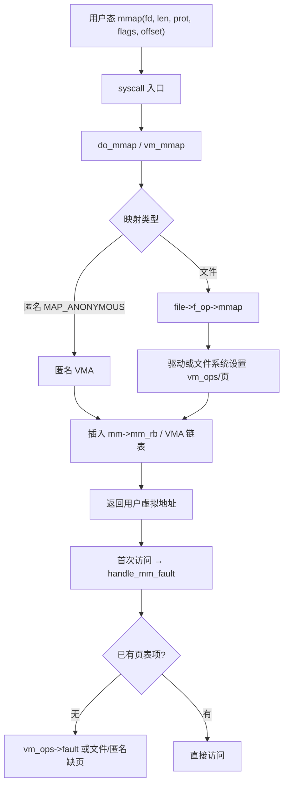
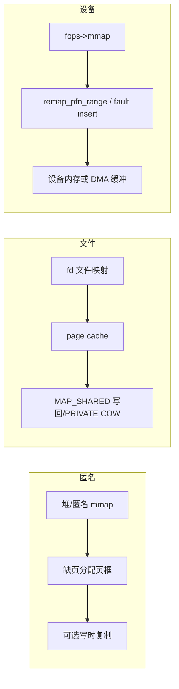

# Linux 内存映射 mmap 完整篇：从用户态 API、VMA 到缺页与驱动实现

`mmap` 之后第一次访问就 SIGSEGV、文件映射与预期内容不一致、驱动里实现了 `fops->mmap` 但用户态读到的全是 0——多半不是「指针用错」，而是 **映射类型（文件/匿名/设备）、权限与缺页路径** 没对齐。

`mmap` 把「以字节流读写」变成「按页映射进进程地址空间」：共享库、帧缓冲、DMA 缓冲、环形队列零拷贝都靠它。本文从用户态 API → 内核 `do_mmap`/`vma` → 缺页 → 驱动 `vm_operations_struct` → 排障 Checklist 闭环。源 chapter（085–090）为提纲；正文按主线 mm 与真实符号重写。

---

## 源码锚点

| 路径 | 作用 |
|------|------|
| `mm/mmap.c` | `do_mmap`、VMA 插入与合并、权限检查 |
| `include/linux/mm.h` | `vm_area_struct`、`vm_operations_struct`、`do_mmap`/`vm_mmap` |
| `mm/memory.c` | `handle_mm_fault` 一带缺页处理 |
| `mm/filemap.c` 等 | 文件映射与 page cache 交互 |
| `include/linux/fs.h` | `file_operations.mmap` |
| `man 2 mmap` | 用户态标志：`MAP_SHARED`/`PRIVATE`/`ANONYMOUS` 等 |

用户态 API：

```c
void *p = mmap(NULL, length,
	       PROT_READ | PROT_WRITE,
	       MAP_SHARED,   /* 或 MAP_PRIVATE / MAP_ANONYMOUS */
	       fd, offset);
if (p == MAP_FAILED) /* errno: EINVAL/ENOMEM/EACCES/... */
	perror("mmap");
/* 使用 p[i] —— 可能触发缺页 */
munmap(p, length);
```

内核侧核心结构：

```c
/* include/linux/mm.h */
struct vm_area_struct {
	unsigned long vm_start, vm_end;
	struct file *vm_file;
	unsigned long vm_pgoff;          /* 页为单位的偏移 */
	pgprot_t vm_page_prot;
	unsigned long vm_flags;          /* VM_READ/WRITE/SHARED/... */
	const struct vm_operations_struct *vm_ops;
	/* ... */
};

struct vm_operations_struct {
	void (*open)(struct vm_area_struct *vma);
	void (*close)(struct vm_area_struct *vma);
	vm_fault_t (*fault)(struct vm_fault *vmf);
	/* ... */
};
```

驱动实现 `mmap` 的常见写法：

```c
static int my_mmap(struct file *file, struct vm_area_struct *vma)
{
	struct my_dev *priv = file->private_data;
	/* 把设备缓冲区页映射进用户 VMA */
	return remap_pfn_range(vma, vma->vm_start,
			       page_to_pfn(priv->page),
			       vma->vm_end - vma->vm_start,
			       vma->vm_page_prot);
	/* 或：vma->vm_ops = &my_vm_ops; 在 fault 里 insert_pfn */
}
```

---

## 调用链

### 用户态 mmap 到建立 VMA



### 三类映射数据流



---

## 重点知识

### 1. 标志位决定语义

| 标志 | 含义 | 典型用途 |
|------|------|----------|
| `MAP_SHARED` | 修改对其他映射/文件可见（按对象语义） | 共享内存、帧缓冲 |
| `MAP_PRIVATE` | 写时复制，不写穿到底层文件 | 可执行文件私有映射 |
| `MAP_ANONYMOUS` | 无文件，内容填 0 | 大块堆外内存 |
| `MAP_FIXED` | 强制地址（危险，慎用） | 特殊加载器 |
| `PROT_*` | 页权限；与 `vm_page_prot` 相关 | 与 NX/W^X 策略相关 |

`offset` 必须按页对齐；长度不足一页也按页粒度记账。`EINVAL` 常见原因：对齐、长度 0、prot/flags 非法组合。

### 2. VMA：进程地址空间的「一段合同」

每次成功 `mmap`（及 `brk`/栈扩展等）对应一个或多个 `vm_area_struct`。排障时：

```bash
cat /proc/<pid>/maps
cat /proc/<pid>/smaps   # 更细：RSS、PSS、Locked
```

看权限列（`r-xp`/`rw-s` 等）是否与 `PROT_`/`MAP_SHARED` 一致；看路径是文件、`anon` 还是 `/dev/...`。

### 3. 缺页才是「真正分配/插入页」的时刻

`mmap` 多数情况下只建立 VMA，**不一定立刻分配物理页**。第一次读/写触发缺页：

- 匿名：分配页框并清零  
- 文件：从 page cache / 文件系统读入  
- 设备：走 `vm_ops->fault` 或已在 `mmap` 里 `remap_pfn_range` 建好映射  

因此「mmap 成功但一访问就挂」要查：权限、是否已 `munmap`、设备 `fault` 是否失败、文件是否被截断（`SIGBUS`）。

### 4. 驱动里两种主流做法

1. **`remap_pfn_range`（或 `vm_iomap_memory`）**  
   在 `mmap` 调用时直接填页表。适合固定物理区、寄存器窗、已分配的 DMA 页。注意缓存属性（`pgprot_noncached` 等）与用户可写范围，避免把内核任意物理页暴露出去。

2. **延迟 `fault`**  
   `vma->vm_ops = &ops`，在 `fault` 里 `vmf_insert_pfn` / 填 page。适合大范围、稀疏访问。

安全红线：校验 `vma->vm_pgoff` 与长度，防止用户映射越过缓冲区；不要把任意 `__pa` 开放给用户。

### 5. 与 `read`/`write` 如何选型

| 场景 | 更合适 |
|------|--------|
| 小而偶发控制消息 | `read`/`write`/`ioctl` |
| 大块流式、零拷贝 | `mmap` 或 `splice`/`sendfile` |
| 寄存器级访问 | `mmap` 非缓存窗或专用 ioctl |
| 跨进程共享 | `MAP_SHARED` + 文件（memfd/shm）或 ashmem 类机制 |

### 6. 常见坑

| 坑 | 现象 | 对策 |
|----|------|------|
| 未页对齐 offset | `EINVAL` | `offset & (PAGE_SIZE-1) == 0` |
| `MAP_PRIVATE` 当共享用 | 他进程看不见修改 | 改 `MAP_SHARED` 或用显式 IPC |
| 映射后关闭 fd 仍用 | 多数情况合法，但勿误判生命周期 | 以 `munmap` 为准；文档写清 |
| 文件被截断 | 访问洞外 → `SIGBUS` | 锁文件大小或处理信号 |
| 驱动未改 `vm_page_prot` | 设备内存缓存不一致 | 按 SoC 要求设 noncached/writecombine |
| 忘记 `vm_ops->close` 释放 | 泄漏 | close/munmap 路径对称 |

### 7. 最小自测

```bash
# 匿名
python3 - <<'PY'
import mmap
m = mmap.mmap(-1, 4096)
m[0:5] = b'hello'
print(m[:5])
m.close()
PY

# 文件
dd if=/dev/zero of=/tmp/t bs=4096 count=1
# 再写小 C 程序 MAP_SHARED 读写验证
```

驱动：`mmap` 后用户态写魔数，驱动或另一映射读回比对。

---

## Checklist

- [ ] `length>0`、`offset` 页对齐；失败时打印 `errno`
- [ ] 共享语义选对 `MAP_SHARED`/`PRIVATE`；匿名用 `MAP_ANONYMOUS` 且 fd=-1
- [ ] `/proc/self/maps` 能看到对应 VMA 与权限
- [ ] 理解「mmap 成功 ≠ 已分配页」；大页/锁页场景另验 `mlock`
- [ ] 驱动校验映射范围；物理窗设置正确 cache 属性
- [ ] `munmap`/文件释放/模块卸载无 UAF；`vm_ops.close` 对称
- [ ] 截断、权限不足、缺页失败路径有明确信号/返回值
- [ ] 性能场景对比 `read` vs `mmap`，避免无依据的「全面 mmap」

---

*合并自：Linux系统编程/chapters/085–090-内存映射*（2026-09-06）
