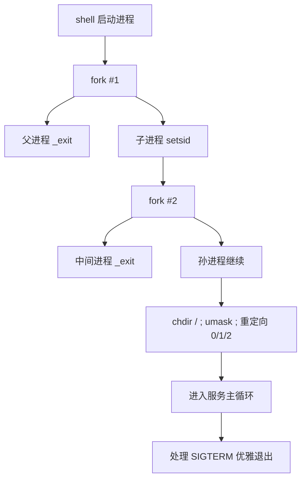
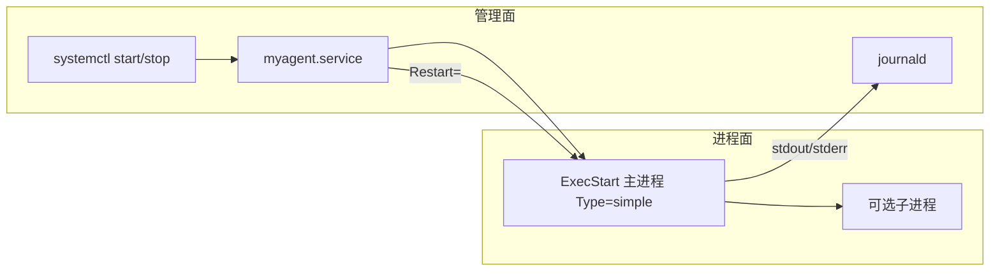

# Linux 守护进程与服务完整篇：从 daemonize、systemd 到 pidfile 与排障

手写 `while(1)` 后台程序一重启就没了、用 `&` 挂起却仍占着终端、或 systemd 单元 `active (running)` 却立刻退出——问题通常在 **会话/控制终端、文件描述符、工作目录与监督模型**，而不是业务循环本身。

传统 Unix 用「双重 fork + setsid」把进程从终端剥离；现代发行版则把长期服务交给 **systemd（或同等 init）** 监督：崩溃拉起、依赖排序、日志进 journal。本文覆盖经典 daemonize、为何优先用 systemd、pidfile/权限、信号与 Checklist。源 chapter（109–114）为提纲；正文按 POSIX/`daemon(3)` 与 systemd 实践重写。

---

## 源码锚点

| 路径/接口 | 作用 |
|-----------|------|
| `man 3 daemon` / glibc `daemon()` | 库封装的后台化（内部仍是 fork/setsid 一类步骤） |
| `man 2 fork` / `setsid` / `chdir` / `umask` / `open` | 经典 daemonize 原语 |
| `man 7 signal` / `sigaction` | `SIGTERM`/`SIGHUP` 优雅退出与热加载 |
| `man 5 systemd.service` | unit 类型、`Type=`、`Restart=`、`User=` |
| `man 1 systemctl` / `journalctl` | 启停与日志 |
| `/run` / `pidfile` 惯例 | 运行时 pid、锁文件 |

经典步骤（理解用；新项目优先 systemd）：

```c
#include <unistd.h>
#include <fcntl.h>
#include <stdlib.h>

static int daemonize(void)
{
	pid_t pid = fork();
	if (pid < 0) return -1;
	if (pid > 0) _exit(0);          /* 父进程退出 */

	if (setsid() < 0) return -1;    /* 新会话，脱离控制终端 */

	pid = fork();                   /* 再 fork，防止重新获得终端 */
	if (pid < 0) return -1;
	if (pid > 0) _exit(0);

	umask(0);
	if (chdir("/") < 0) return -1;

	close(STDIN_FILENO);
	close(STDOUT_FILENO);
	close(STDERR_FILENO);
	open("/dev/null", O_RDONLY);    /* fd 0 */
	open("/dev/null", O_RDWR);      /* 1 */
	open("/dev/null", O_RDWR);      /* 2 */
	return 0;
}
```

glibc 捷径（注意移植与行为差异）：

```c
/* man 3 daemon: nochdir, noclose */
if (daemon(0, 0) < 0) {
	perror("daemon");
	exit(1);
}
```

最小 systemd unit 示例：

```ini
# /etc/systemd/system/myagent.service
[Unit]
Description=My Agent
After=network-online.target
Wants=network-online.target

[Service]
Type=simple
ExecStart=/usr/local/bin/myagent --config /etc/myagent.conf
Restart=on-failure
RestartSec=2
User=myagent
Group=myagent
WorkingDirectory=/
# 不要在程序里再双重 fork；交给 systemd

[Install]
WantedBy=multi-user.target
```

---

## 调用链

### 经典双重 fork 脱离终端



### 现代监督：systemd 与进程的关系



---

## 重点知识

### 1. 「后台」≠「守护进程」

| 做法 | 结果 | 问题 |
|------|------|------|
| `cmd &` | 后台但可能仍在同一会话 | 终端关闭可能收到 `SIGHUP` |
| `nohup cmd &` | 忽略 HUP，输出进 nohup.out | 无崩溃拉起、无依赖管理 |
| 双重 fork daemonize | 脱离终端 | 无监督；日志与权限需自管 |
| systemd/service | 监督、依赖、日志一体 | 需正确写 unit，程序勿再抢 daemonize |

生产环境：**让 init 监督**，程序保持前台（`Type=simple`）是默认最佳实践。

### 2. `Type=` 选错会导致「假死」或「误杀」

| Type | 含义 | 适用 |
|------|------|------|
| `simple` | `ExecStart` 即主进程 | 大多数长驻服务（推荐） |
| `forking` | 进程自己 fork 后父退出，需 `PIDFile=` | 老式 daemonize 程序 |
| `notify` | 就绪后 `sd_notify` | 需要明确 ready 的服务 |
| `oneshot` | 跑完即结束 | 初始化脚本 |

把已 daemonize 的程序配成 `simple`，systemd 可能跟踪错 pid；把前台程序配成 `forking` 又会一直等 pidfile——**二选一对齐**。

### 3. pidfile 与单实例

传统锁：

```c
/* 伪代码：打开 /run/myagent.pid，flock，写入 getpid() */
```

systemd 下多数场景 **不需要** 自管 pidfile；若必须兼容老工具，用 `Type=forking` + `PIDFile=` 并保证 fork 后写文件再通知就绪。

`/run` 为 tmpfs，重启清空——适合运行时文件，不要放配置。

### 4. 信号约定

| 信号 | 常见语义 |
|------|----------|
| `SIGTERM` | 停止：刷盘、关 socket、退出 0 |
| `SIGINT` | 交互中断；服务里可同 TERM |
| `SIGHUP` | 重载配置（若支持）；systemd 可用 `ExecReload=` |
| `SIGKILL` | 不可捕获；仅作最后手段 |

```c
static volatile sig_atomic_t stop;

static void on_term(int sig) { (void)sig; stop = 1; }

/* main 循环 while (!stop) ... 退出前清理 */
```

### 5. 日志：别再只写自己的文件

- systemd 服务：打 **stdout/stderr**（或 `StandardOutput=journal`），用 `journalctl -u myagent -f`
- 若必须文件日志：处理轮转、权限、磁盘满；仍建议同步一份到 journal
- 千万别在关闭 fd 后继续 `printf` 到已重定向到 `/dev/null` 的描述符还以为有日志

### 6. 权限与安全

- `User=`/`Group=` 降权；能力用 `CapabilityBoundingSet=`/`AmbientCapabilities=` 精细放权  
- 配置目录权限、密钥勿 world-readable  
- `ProtectSystem=`/`ProtectHome=`/`NoNewPrivileges=` 等沙箱指令按需打开  

### 7. 常见坑

| 坑 | 现象 | 对策 |
|----|------|------|
| 程序内双重 fork + `Type=simple` | 服务立刻 inactive | 去掉 daemonize 或改 `forking` |
| 忽略 `SIGTERM` | `systemctl stop` 卡住直至超时强杀 | 处理 TERM 并快速退出 |
| 工作目录在卸载点 | 异常或占住挂载 | `chdir("/")` 或 unit 设 `WorkingDirectory=` |
| 依赖网络未声明 | 启动过早 bind 失败 | `After=`/`Wants=network-online.target` |
| 仅 `&` 部署 | 重启丢失 | 安装 unit 并 `enable` |
| 日志全丢 | 关 fd 后无 journal | 前台运行交给 systemd |

### 8. 验证命令

```bash
sudo systemctl daemon-reload
sudo systemctl enable --now myagent
systemctl status myagent -l
journalctl -u myagent -n 100 --no-pager
# 崩溃拉起
sudo kill -9 $(systemctl show -p MainPID --value myagent)
sleep 2; systemctl is-active myagent
```

---


---

*合并自：Linux系统编程/chapters/109–114-守护进程与服务*（2026-09-06）
