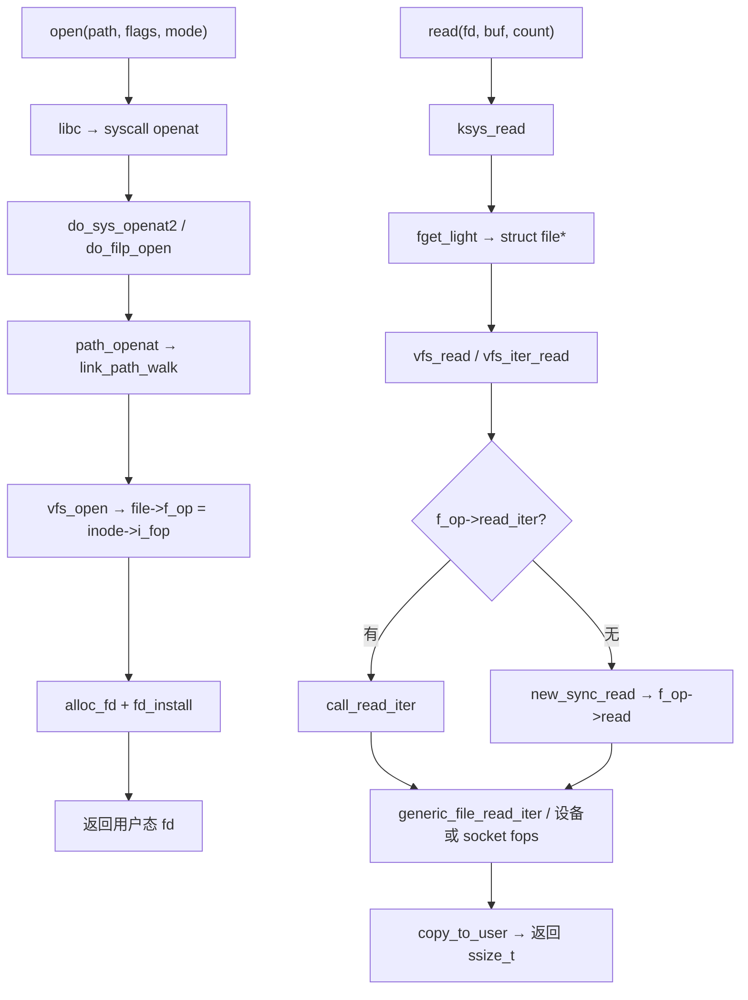
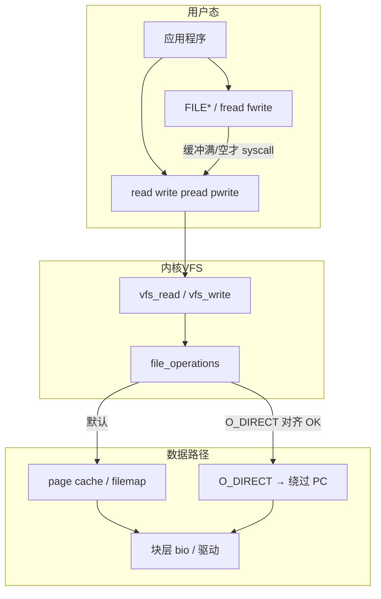

# Linux 文件 I/O 完整篇：从 open/read/write 到 VFS 与排障

`read` 只返回 512 字节、`write` 后另一进程读不到、`O_NONBLOCK` 下忙等还是 `EAGAIN`、开了 `O_DIRECT` 仍走 page cache——多半不是「磁盘坏了」，而是 **短读写语义、stdio 缓冲、fd 表与 VFS 标志** 没对齐。缓冲 I/O 与直接 I/O 选型错误还会把延迟和一致性一起搞乱。

POSIX `open/read/write/lseek/close` 是进程与内核 `struct file` 之间的契约：fd 只是进程 fdtable 里的索引，真正读写走 `vfs_read`/`vfs_write` 再落到具体 `file_operations`。本文从用户态 API → glibc 缓冲 → 系统调用 → VFS → page cache/块层 → `strace`/proc 观测 → Checklist 闭环。合并源 chapter（001–006）为提纲；正文按真实内核路径与符号重写。

---

## 源码锚点

| 路径 | 作用 |
|------|------|
| `fs/open.c` | `do_sys_openat2`、`do_filp_open`、`vfs_open`、分配 fd |
| `fs/namei.c` | `path_openat`、`link_path_walk`、lookup |
| `fs/read_write.c` | `vfs_read`、`vfs_write`、`vfs_iter_read`/`write` |
| `fs/file.c` | `alloc_fd`、`fd_install`、`get_file`、`__close_fd` |
| `include/linux/fs.h` | `struct file`、`file_operations`、`f_pos` |
| `include/linux/fdtable.h` | 进程 `files_struct` / fd 位图与 `fdtable` |
| `mm/filemap.c` | 普通读写的 page cache 路径 |
| `man 2 open/read/write/lseek/close` | 用户态标志与 errno 语义 |

用户态最小读写循环（必须处理短返回与 `EINTR`）：

```c
int fd = open("data.bin", O_RDONLY);
char buf[4096];
ssize_t n;
for (;;) {
	n = read(fd, buf, sizeof buf);
	if (n > 0) { /* 处理 buf[0..n) */ break; }
	if (n == 0) break;              /* EOF */
	if (errno == EINTR) continue;
	perror("read"); break;
}
lseek(fd, 0, SEEK_SET);
close(fd);
```

内核侧 fd 与文件对象：

```c
/* include/linux/fs.h */
struct file {
	const struct file_operations *f_op;
	struct inode		*f_inode;
	loff_t			f_pos;
	fmode_t			f_mode;
	unsigned int		f_flags;   /* O_NONBLOCK 等 */
	void			*private_data;
};

struct file_operations {
	ssize_t (*read)(struct file *, char __user *, size_t, loff_t *);
	ssize_t (*write)(struct file *, const char __user *, size_t, loff_t *);
	ssize_t (*read_iter)(struct kiocb *, struct iov_iter *);
	ssize_t (*write_iter)(struct kiocb *, struct iov_iter *);
	int (*open)(struct inode *, struct file *);
	/* ... */
};
```

`f_pos` 由 `read`/`write` 更新；`pread`/`pwrite` 使用临时 kiocb 偏移而不改 `f_pos`（多线程安全读不同区域的关键）。`f_mode` 含 `FMODE_LSEEK`、`FMODE_PREAD` 等能力位，驱动可在 `open` 时清除不支持的操作。

`dup2` 只复制 fd 表项，共享同一 `struct file`（引用计数 +1）：

```c
/* 标准重定向：stdout → logfile */
int logfd = open("/var/log/app.log", O_WRONLY|O_CREAT|O_APPEND, 0644);
dup2(logfd, STDOUT_FILENO);
if (logfd > STDERR_FILENO) close(logfd);
```

---

## 调用链

### 用户态 open/read 到 VFS



### 缓冲层与数据流（stdio vs 系统调用 vs 直接 I/O）



---

## 重点知识

### 1. POSIX 五件套语义

| API | 要点 | 常见 errno |
|-----|------|------------|
| `open`/`openat` | `O_RDONLY`/`O_WRONLY`/`O_RDWR`；`O_CREAT` 需 mode；`O_APPEND` 写追加 | `ENOENT`、`EACCES`、`EEXIST`、`EMFILE` |
| `read`/`write` | **可短返回**；不等于请求长度不等于错误 | `EINTR` 可重试；`EAGAIN` 非阻塞 |
| `lseek` | `SEEK_SET/CUR/END`；管道/FIFO/socket 不支持 | `ESPIPE` |
| `close` | 释放 fd 槽位；最后一个 `struct file` 引用才真正关闭 | 重复 close 未定义；勿 double-close |
| `dup`/`dup2`/`fcntl(F_DUPFD)` | 共享偏移与标志；`dup2(old,new)` 原子替换 | `EBADF` |
| `pread`/`pwrite` | 不改变 `f_pos` 的 positional I/O | 同 read/write errno |
| `readv`/`writev` | 矢量 I/O，一次 syscall 多缓冲 | 仍可能短返回 |

`read`/`write` 循环模板：直到读满/写完或 EOF/错误；每次 `EINTR` 重试同一调用。写磁盘日志时建议 `write` 循环至完成或 `ENOSPC`，不要假设一次 `write` 等于 `count`。

**`pread`/`pwrite`**：带偏移的一次性读写，不修改 `file->f_pos`。多线程共享同一 fd 读不同区域时，用 `pread` 可避免 `lseek`+`read` 之间的竞态（另一线程改 `f_pos` 导致读错偏移）。内核路径：`vfs_read`/`vfs_write` 传入 `&kiocb.ki_pos` 而非始终用 `f_pos`。注意：`pread` 仍可能短返回，循环语义与 `read` 相同。

```c
/* 线程 A 读 offset=0，线程 B 读 offset=4096，同一 fd 无锁也安全 */
ssize_t n = pread(fd, buf, len, (off_t)4096);
if (n < 0 && errno == EINTR) /* 重试 */;
```

**`readv`/`writev`**：一次 syscall scatter/gather 多个用户缓冲，减少用户态/内核态切换。实现走 `vfs_readv`/`vfs_writev` → `do_iter_read`/`do_iter_write` → `call_read_iter`/`call_write_iter`，底层 `struct iov_iter` 遍历 iovec。大包头+payload 场景常用；每个 iovec 仍受短返回约束，总返回字节数是所有 iovec 已填/已消费之和。

```c
struct iovec iov[2] = {
	{ .iov_base = hdr,  .iov_len = sizeof hdr },
	{ .iov_base = body, .iov_len = body_len },
};
ssize_t n = readv(fd, iov, 2);  /* 可能只填满 hdr 就返回 */
```

**`sendfile`/`splice` 简述**：零拷贝把数据从文件 fd 推到 socket fd（或 pipe），避免 `read`+`write` 双重复制到用户态。`sendfile(out_fd, in_fd, offset*, count)` 典型路径：`do_sendfile` → 文件 `read_iter` 与 socket `write_iter` 在内核 page cache 与 socket 缓冲间搬运。`splice` 通过内核 pipe 作中转，可在两 fd 间移动数据（`tee` 复制 pipe 内容而不落用户态）。限制：in_fd 需支持 `splice_read`；out 为 socket 或 pipe 时收益最大；普通文件→普通文件有时仍经 page cache 拷贝。`strace` 看到 `-ENOSYS`/短写 fallback 时改用手动 `read`/`write` 或 `copy_file_range`（同 FS 内核内拷贝）。

```c
/* 静态文件 HTTP 发送常见模式 */
off_t off = 0;
sendfile(socket_fd, file_fd, &off, file_size);
/* off 被更新；若需并发发送同一 file 多连接，每连接独立 off 或 pread+write */
```

### 2. 打开标志：`O_NONBLOCK` 与 `O_DIRECT`

**`O_NONBLOCK`**：打开时写入 `file->f_flags`。对 socket、pipe、某些字符设备，`read`/`write` 无数据时返回 `-1` 且 `errno=EAGAIN`/`EWOULDBLOCK`（同值）。普通磁盘文件通常仍阻塞；别在块文件上指望非阻塞语义。

**`O_DIRECT`**：尽量绕过 page cache，用户缓冲区与文件偏移/长度需满足对齐（通常 512B 与逻辑块大小）。未对齐 → `EINVAL`。数据库、流媒体自建缓存常用；小随机读写可能更慢。与 `stdio` 全缓冲叠加时，仍可能因 libc 缓冲产生「以为写盘了其实还在用户缓冲」的错觉——要么 `fflush`+`fsync`，要么对 fd 用 `setvbuf(..., _IONBF)` 或直接 syscall。

读路径上 `O_DIRECT` 绕过 page cache 直读块设备；写路径需保证扇区对齐，否则部分 FS 在内核 `generic_file_direct_write` 就拒绝。网络文件系统（NFS）对 `O_DIRECT` 支持因服务端而异，失败时去掉该标志对比 latency。调试对齐：`posix_memalign` 分配，长度用 `st_blksize` 倍数。

其他常用标志：

| 标志 | 作用 |
|------|------|
| `O_SYNC`/`O_DSYNC` | 写路径更严格落盘语义（性能换一致性） |
| `O_TRUNC` | 可写打开时截断 |
| `O_EXCL`+`O_CREAT` | 原子创建，存在则失败 |
| `O_CLOEXEC` | `exec` 时自动关闭，防 fd 泄漏 |
| `O_NOATIME` | 读不更新 access time，批处理扫描常用 |

`openat(dirfd, path, ...)` 相对目录 fd 解析路径，配合 `O_CLOEXEC` 可避免 TOCTOU（多线程同时 `open` 同一路径时 `chdir` 竞态）。`AT_FDCWD` 表示相对 cwd。容器内 bind mount 后应用应对 **绝对 fd**（`/proc/self/fd/` 或 `openat`）而非硬编码宿主机路径。

### 3. stdio 缓冲 vs 系统调用

glibc `FILE*` 三层缓冲：

| 模式 | 行为 | 典型 |
|------|------|------|
| 全缓冲 `_IOFBF` | 缓冲满才 `write` | 普通磁盘 `FILE*` |
| 行缓冲 `_IOLBF` | 遇 `\n` 刷新 | 终端 stdout |
| 无缓冲 `_IONBF` | 每次 `fread`/`fwrite` 对应 syscall | `stderr`、调试 |

坑：

- `printf` 无 `\n` 崩溃前看不到输出 → `fflush(stdout)` 或 `\n`。
- `fork` 后子进程继承 stdio 缓冲内容 → 子进程前 `fflush` 或 `_exit`，避免重复输出。
- `fread` 返回 `< nmemb` 需用 `feof`/`ferror` 区分 EOF 与错误。
- 日志重定向：`dup2` 之后若仍用 `printf`，缓冲在 libc；高可靠场景对 **fd** 用 `write` 或 `setvbuf(_IONBF)`。

**`FILE*` 与 fd 混用**：`fileno(fp)` 取底层 fd 后对该 fd 直接 `read`/`write` 会绕过 stdio 缓冲，导致 `fread` 看不到新数据或重复读。要么全程 fd，要么 `fflush(fp)` 后再 syscall，且勿对同一 fd 既 `fclose` 又 `close`。

### 4. fd 表、`dup2` 与标准流

进程 `task_struct → files_struct → fdtable`：`fd` 是数组下标，`struct file*` 在内核堆上共享。`RLIMIT_NOFILE` 软限制决定 `open` 上限；systemd `LimitNOFILE=`、容器 cgroup 可能再压低。`EMFILE` 是当前进程 fd 表满；`ENFILE` 是系统级 `file` 结构耗尽，少见但需重启或杀泄漏进程。

- `dup2(3,1)`：fd 1 指向与 fd 3 相同的 `struct file`；**共享 `f_pos`**，并发写需外部同步。
- Shell 重定向、`daemon` 化（`stdin/stdout/stderr` → `/dev/null` 或 log）都靠 `dup2`。
**`fcntl(F_GETFL/F_SETFL)`**：读取/修改 `file->f_flags` 中与 `O_ACCMODE` 无关的可变位。典型用法：socket 或 pipe 已 `open` 后动态切非阻塞，无需重建 fd。

```c
int flags = fcntl(fd, F_GETFL);
if (flags == -1) { perror("F_GETFL"); return; }
if (fcntl(fd, F_SETFL, flags | O_NONBLOCK) == -1)
	perror("F_SETFL");
/* F_GETFL 返回值含 O_RDONLY/O_WRONLY/O_RDWR 编码，改标志时用 | O_NONBLOCK，勿覆盖访问模式 */
```

`F_GETFD`/`F_SETFD` 管 **fd 描述符级** 标志（如 `FD_CLOEXEC`），与 `F_GETFL` 不是同一层：`F_GETFL` → `struct file` 行为；`F_GETFD` → fdtable 条目是否 `exec` 时关闭。

POSIX `open(..., O_CLOEXEC)` 或 `pipe2(..., O_CLOEXEC)` 保证 `execve` 成功后子镜像不继承该 fd，防泄漏到 untrusted 子进程。多线程陷阱：`fork` 与 `exec` 之间若有其他线程 `open` 未设 `CLOEXEC`，子进程会继承全部 fd——daemon 化应在 **单线程段** 完成 `dup2`+`close` 扫 fd，或遍历 `/proc/self/fd` 对不需要的 fd 设 `FD_CLOEXEC`。`pthread_atfork` 可注册 prepare/parent/child 钩子，但最稳仍是显式 `fcntl(F_SETFD, FD_CLOEXEC)` 或 `O_CLOEXEC` 打开。systemd `PrivateTmp`/`PrivateDevices` 不改变已打开 fd，只影响新 `open` 路径。

观测：

```bash
ls -l /proc/self/fd/
readlink /proc/<pid>/fd/3
cat /proc/<pid>/fdinfo/3
```

### 5. 错误路径与 errno 分类

| 类别 | errno | 策略 |
|------|-------|------|
| 可重试 | `EINTR` | 同一 syscall 重试 |
| 非阻塞暂无数据 | `EAGAIN` | `poll`/`select`/`epoll` 后再读 |
| 资源耗尽 | `EMFILE`/`ENFILE` | 提 ulimit、查 fd 泄漏 |
| 参数/对齐 | `EINVAL` | `O_DIRECT` 对齐、非法 whence |
| 已关闭/坏 fd | `EBADF` | 生命周期 bug |
| 磁盘满 | `ENOSPC` | 写路径必须处理 |
| 只读 FS | `EROFS` | 配置或挂载只读 |

**`ENOSPC` / 磁盘满排障步骤**：

1. 确认 errno：应用日志或 `strace -e write` 看到 `write(...)=-1 ENOSPC`。
2. 看分区：`df -h` 找 100% 挂载点；`df -i` 查 inode 耗尽（也会 `ENOSPC`）。
3. 找大文件/目录：`du -xh --max-depth=1 /var`；`lsof +L1` 查已删除但仍被进程占用的文件（`df` 不降）。
4. 写路径策略：循环写遇 `ENOSPC` 应停止并告警，勿无限重试；临时文件用 `write` 失败即 `unlink` 半成品。
5. 容器/overlay：宿主机或 volume 满同样返回 `ENOSPC`，进容器内 `df` 可能只看到 overlay 层，需查 bind mount 源。
6. 配额：XFS project quota、`quota` 命令超限也会表现为写失败，errno 可能是 `EDQUOT` 而非 `ENOSPC`。

```bash
df -h; df -i
du -sh /var/log/* 2>/dev/null | sort -h | tail
lsof +L1 2>/dev/null | head
strace -e write -p <pid> 2>&1 | grep ENOSPC
```

**短写**：磁盘满、信号打断、某些网络路径都会出现；必须循环写剩余字节。读端 EOF 返回 `0`。

### 6. 观测与排障

**strace**（先看 syscall，再决定是否下内核）：

```bash
strace -e trace=open,openat,read,write,lseek,close,dup,dup2 -f ./app
strace -yy -e read,write -s 128 ./app    # 打印 fd 指向路径
strace -e pread64,pwrite64,readv,writev,sendfile,splice ./app
```

`-f` 跟多线程/子进程；`pread64` 是 64 位内核上 `pread` 的 strace 名。看到 `readv` 只返回部分总长时，在用户态推进 iovec 指针继续读，勿当成 EOF。

**proc**：

```bash
cat /proc/<pid>/limits          # Max open files
cat /proc/<pid>/fdinfo/<n>       # pos、flags、mflags
pidstat -d 1 -p <pid>           # 进程级 IO
```

**`/proc/<pid>/fdinfo/<n>` 字段解读**（内核 `proc_fdinfo` 输出，随内核版本略有增减）：

| 字段 | 含义 |
|------|------|
| `pos` | 当前文件偏移，对应 `struct file->f_pos`；pipe/socket 常为 0 或无意义 |
| `flags` | 八进制，含 `O_RDONLY(0)`/`O_WRONLY(1)`/`O_RDWR(2)` 低 2 位及 `O_NONBLOCK` 等 |
| `mnt_id` | 挂载命名空间 id，跨 mount ns 对比 fd 是否同一文件系统 |
| `ino` | inode 号，与 `stat` 对照 |
| `lock` | 是否持有 POSIX 建议锁（`F_SETLK`） |
| `mflags` | 如 `MNT_READONLY` 等挂载相关只读标记 |

示例：

```bash
$ cat /proc/self/fdinfo/3
pos:    4096
flags:  0100000          # O_APPEND 等组合以实际为准
mnt_id: 23
ino:    1234567
```

配合 `readlink /proc/<pid>/fd/n` 得路径；`flags` 与 `fcntl(F_GETFL)` 应一致。多线程下 `pos` 突变说明共享 fd 未用 `pread` 或外部加锁。审计 fd 泄漏时对比 `ls /proc/<pid>/fd | wc -l` 与业务预期连接数，突增多为 `close` 遗漏或 `O_CLOEXEC` 缺失。

**对齐验证 `O_DIRECT`**：

```c
posix_memalign((void**)&buf, 4096, 4096);
int fd = open("big.bin", O_RDONLY | O_DIRECT);
/* buf 与 count 须为 512/4096 倍数，offset 亦同 */
```

现象对照：

| 现象 | 可能根因 |
|------|----------|
| 子进程重复日志 | `fork` 未 `fflush` stdio |
| `read` 永远 4KB 倍数 | 正常；循环直到 `< count` 或 0 |
| `O_DIRECT` EINVAL | 缓冲/长度/偏移未对齐 |
| 非阻塞仍阻塞 | 对象是 regular file，或忘 `fcntl O_NONBLOCK` |
| fd 泄漏 EMFILE | 异常路径未 `close`；缺 `O_CLOEXEC` |
| `pread` 与 `lseek` 结果不一致 | 另一线程改 `f_pos`；应统一 `pread` |
| `readv` 只填第一个 iovec | 短返回正常；循环推进 iov base/len |
| `sendfile` 返回 `-1 EINVAL` | out 不是 socket、或 in 不支持 |
| `fdinfo pos` 不回绕 | 大文件偏移；64 位 `off_t` 与日志格式 |

**fsync 与 write 返回**：`write` 成功只表示数据进内核 page cache 或队列；掉电安全需 `fsync(fd)` 或 `O_SYNC` 打开。数据库 redo 与 WAL 必须在 `ENOSPC` 分支停止并切换只读，避免部分页持久化。

### 7. 与 mmap / VFS / 异步 I/O 如何选型

流式 I/O、pipe/socket 用 `read`/`write`+`poll`；大块随机访问用 `mmap`；自建缓存用 `O_DIRECT`。VFS 层 dentry/inode 细节见《Linux VFS 完整篇》，本篇聚焦 **fd 语义与用户态正确用法**。

**与 aio / io_uring 的边界**：Linux 原生 aio（`io_submit`）对普通文件支持长期不完整，生产异步读盘更常直接用 **io_uring**（`IORING_OP_READ/WRITE`）或线程池 + blocking `pread`；socket 可用 `epoll`，与文件 fd 的 async 路径不要混为一谈——本篇的短返回、`f_pos`、`O_DIRECT` 对齐规则在 io_uring 提交侧仍然适用。io_uring 固定缓冲注册（`IORING_REGISTER_BUFFERS`）与 `O_DIRECT` 对齐要求可同时满足，但错误处理仍要区分 `-EAGAIN` 与短 CQE。

```bash
# 短读：pipe 写 2 字节，read 4096 仍只返回 2
python3 -c "import os;r,w=os.pipe();os.write(w,b'hi');print(os.read(r,4096))"
strace -e write ./a.out   # 对比 printf 有无 \n 时的 write 次数
```

**调试习惯**：先 `strace -c` 统计 syscall 占比，确认是否 stdio 缓冲导致 write 次数过少；再 `-yy` 打印 fd 路径。内核读码时从 `ksys_read` 跟到具体 `f_op->read_iter`，区分 generic_file_read_iter（page cache）与 socket 的 sk_read_iter，避免把网络短返回当成磁盘错误。持久化相关 bug 优先查 `fsync` 返回值而非仅 `write`。

---

## Checklist

- [ ] `open`/`openat` 用 `O_CLOEXEC`；多线程 `fork`+`exec` 前关闭或设 CLOEXEC 全部业务 fd
- [ ] `FILE*` 与 fd 不混用除非 `fflush`；`fileno` 后 syscall 知悉缓冲失效
- [ ] 打开标志明确：`O_APPEND`/`O_CREAT`/`O_EXCL`/`O_CLOEXEC`；需要非阻塞则 `O_NONBLOCK` 或 `fcntl`
- [ ] 使用 `O_DIRECT` 时缓冲与长度/偏移对齐；失败打印 `errno=EINVAL`
- [ ] stdio 与 syscall 混用时：`fork` 前 `fflush`；关键路径 `setvbuf(_IONBF)` 或直接 `write`
- [ ] `dup2` 后关闭多余 fd；确认 `/proc/self/fd` 无泄漏；生产调大 `RLIMIT_NOFILE` 有依据
- [ ] 所有 `open` 失败路径不泄漏已打开 fd；`close` 配对（含错误分支）
- [ ] `strace -f` 覆盖 pread64/readv/sendfile；对照内核 `read_write.c` 短返回分支
- [ ] 多线程共享 fd 读不同偏移用 `pread`/`pwrite`，避免 `lseek` 竞态
- [ ] 多 iovec 用 `readv`/`writev` 减 syscall；仍按短返回写循环
- [ ] 静态文件→socket 优先考虑 `sendfile`/`splice`；失败再 fallback read/write
- [ ] `fcntl F_GETFL/F_SETFL` 改 `O_NONBLOCK`；`F_SETFD` 设 `FD_CLOEXEC`；`exec` 前扫 fd
- [ ] 读 `/proc/<pid>/fdinfo/<n>` 对照 `pos`/`flags`/`ino` 与 `strace` 行为
- [ ] 用 `strace -e openat,read,write,close` 与 `/proc/<pid>/fdinfo` 复现问题
- [ ] 写路径 `ENOSPC` 有运维 runbook：`df`/`df -i`/`lsof +L1`/volume 配额
- [ ] 异步读盘：评估 io_uring 或线程池 + `pread`；勿假设 libaio 覆盖普通文件
- [ ] 持久化：`write` 成功后按需 `fsync`；掉电场景不用 `O_DIRECT`  alone 代替 fsync

---

*合并自：Linux系统编程/chapters/001–006-文件IO操作*（2026-09-07）
