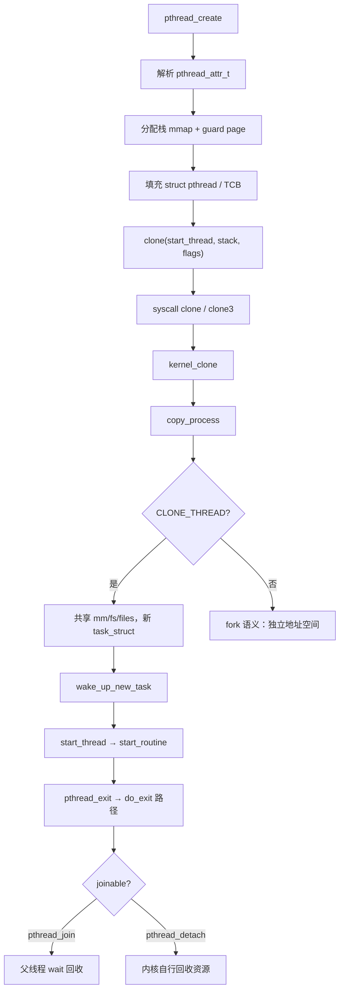
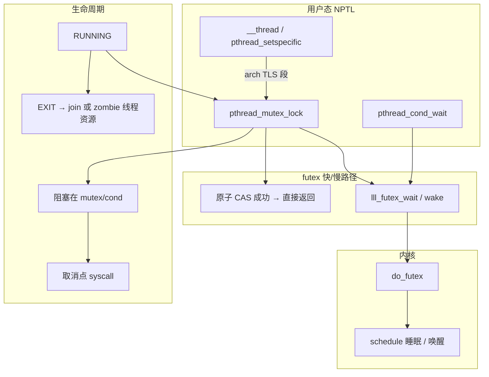

# Linux 线程编程完整篇：从 pthread 到 clone、TLS 与死锁排障

多线程服务偶发卡死、`pthread_create` 返回 `EAGAIN`、子线程里 `fork` 后子进程再 `exec` 挂起、或 `__thread` 变量「串线」——根因常在 **NPTL 与 clone 语义、TLS 布局、futex 慢路径、取消点与 fork 规则**，而不是业务逻辑本身。本文沿 glibc NPTL → `clone`/`clone3` → `kernel_clone` → futex 把创建、同步、回收与排障串成闭环，合并 Linux 系统编程 049–054 提纲并重写为可对照源码验证的正文。目标读者：已会基本 `pthread` API，需要在生产环境定位线程泄漏、死锁或与 `fork`/信号交互问题的 C/C++ 开发者。

---

## 源码锚点

| 路径/接口 | 作用 |
|-----------|------|
| `nptl/pthread_create.c` | `__pthread_create_2_1`：建栈、填 `struct pthread`、调 `clone` |
| `sysdeps/unix/sysv/linux/clone.S` / `clone3` | 用户态陷入创建线程 |
| `kernel/fork.c` | `kernel_clone`、`copy_process`（fork/线程共用） |
| `include/uapi/linux/sched.h` | `CLONE_VM`、`CLONE_THREAD`、`CLONE_SIGHAND` 等 |
| `nptl/pthread_join.c` / `nptl/pthread_detach.c` | 回收与 detach 状态机 |
| `nptl/pthread_mutex_lock.c`、`nptl/pthread_cond_wait.c` | mutex/cond 用户态快路径 + futex 慢路径 |
| `sysdeps/nptl/lowlevellock.h` | `lll_lock` / `lll_futex_wait` 封装 |
| `kernel/futex/futex.c`（或 `kernel/futex.c`） | `do_futex`：pthread 锁/条件变量内核底座 |
| `sysdeps/x86_64/nptl/tls.h`、`arch/*/include/asm/tls.h` | TLS：`%fs`/`TPIDR`、TSD、`errno` |
| `nptl/pthread_cancel.c`、`cancellation.c` | 取消点与异步取消 |
| `man 3 pthread_attr_setstacksize` | 栈大小默认与 `PTHREAD_STACK_MIN` |

`pthread_create` 核心骨架（glibc，示意）：

```c
/* nptl/pthread_create.c — 逻辑压缩 */
int __pthread_create_2_1(pthread_t *newthread, const pthread_attr_t *attr,
                         void *(*start_routine)(void *), void *arg)
{
	/* 分配/映射栈 + guard page；填充 struct pthread（含 tid、join 状态） */
	/* clone 标志：CLONE_VM | CLONE_FS | CLONE_FILES | CLONE_SIGHAND
	   | CLONE_THREAD | CLONE_SYSVSEM | CLONE_SETTLS | CLONE_PARENT_SETTID ... */
	ret = clone(start_thread, stack, clone_flags, pd, &pd->tid, ...);
	/* 失败则释放栈；成功则 *newthread = (pthread_t) pd */
}
```

内核侧与 fork 共用创建路径：

```c
/* kernel/fork.c — 概念骨架 */
pid_t kernel_clone(struct kernel_clone_args *args)
{
	/* copy_process：复制 task_struct，按 flags 共享 mm/files/fs 等 */
	/* wake_up_new_task：入 runqueue；CLONE_THREAD 时与组长同 TGID */
}
```

---

## 调用链

### ① `pthread_create` → `clone` → 内核线程对象



### ② 同步原语与线程生命周期（数据流）



---

## 重点知识

### 1. 线程 vs 进程：Linux 的统一模型

Linux **不单独实现「线程内核对象」**：NPTL 线程即带 `CLONE_THREAD | CLONE_VM` 的 `task_struct`，与组长共享 `mm`（地址空间）、`files`、`fs`，但各有独立内核栈、调度实体与 TLS。`getpid()` 返回 **线程组 ID（TGID）**；`gettid()` / `pthread_self` 对应真实 TID。

| 维度 | 进程（fork） | NPTL 线程 |
|------|--------------|-----------|
| 地址空间 | 独立 `mm`（COW） | 共享 `mm` |
| PID 语义 | 新 TGID | 同 TGID，新 TID |
| 信号 | 独立处理需另行设计 | 默认共享信号处理 |
| 创建成本 | 页表 COW，较重 | 栈 + TCB，较轻 |
| 同步 | 常靠 IPC | 直接共享内存 + mutex |

排障：`ps -eLf`、`/proc/<pid>/task/`、`cat /proc/<tid>/status | grep -E 'Name|Threads'`。

`clone` 标志（`include/uapi/linux/sched.h`）决定「像进程还是像线程」：

| 标志 | 含义 |
|------|------|
| `CLONE_VM` | 共享地址空间（线程必需） |
| `CLONE_THREAD` | 同线程组，共享 TGID |
| `CLONE_SIGHAND` | 共享信号处理函数表 |
| `CLONE_FILES` / `CLONE_FS` | 共享 fd 表 / fs 结构 |
| `CLONE_SETTLS` | 设置 arch TLS 描述符 |
| `CLONE_CHILD_CLEARTID` | 退出时在 `clear_child_tid` 写 0 并 futex wake（供 join） |

NPTL 创建线程时组合上述标志；`fork()` 等价于 `clone` 不带 `CLONE_VM`。因此 **gdb 里看线程与看进程用的是同一套 `task_struct`**，只是共享资源 bitmask 不同。

较新 glibc 在支持时走 **`clone3`**（`syscall(__NR_clone3, &cl_args, sizeof cl_args)`），用 `struct clone_args` 一次性传入 stack/tls/flags，减少参数寄存器拼装错误；排障时 `strace` 可能看到 `clone3` 而非传统 `clone`。无论哪条路径，内核入口最终汇聚到 `kernel_clone`。

线程调度与进程无本质区别：每个 TID 独立参与 CFS，`nice`/`sched_setscheduler`/`pthread_setschedparam` 作用在 **线程** 粒度。`pthread_setaffinity_np` 绑核只影响目标线程，不会自动把同进程其他 worker 绑过去——线程池场景要对每个 worker 分别设置，或创建后统一 inherit 属性。

### 2. 属性与栈：`pthread_attr_t`

默认栈大小因架构/glibc 而异（x86_64 常见 **8 MiB** 量级），线程多时会吃光虚拟地址空间：

```c
pthread_attr_t attr;
pthread_attr_init(&attr);
pthread_attr_setstacksize(&attr, 256 * 1024);   /* 深递归/大帧才调大 */
pthread_attr_setdetachstate(&attr, PTHREAD_CREATE_JOINABLE);
pthread_create(&tid, &attr, worker, NULL);
pthread_attr_destroy(&attr);
```

要点：

- 低于 `PTHREAD_STACK_MIN` 会失败；`pthread_attr_getstack` 可拿 guard page 边界做栈溢出检测。
- **虚拟内存 ≠ RSS**：上千线程 × 默认栈 → `vm.max_map_count` / 地址空间耗尽，表现为 `EAGAIN`。
- 可用 `pthread_attr_setguardsize` 调整 guard page；栈溢出会 SIGSEGV 在 guard 上，而非 silent 踩邻线程。
- `pthread_setname_np` / `prctl(PR_SET_NAME)` 便于 `top -H`、`perf` 对号入座。

### 3. mutex / cond 与 futex

`pthread_mutex_t` 先走用户态原子操作；争用时 `futex(FUTEX_WAIT)` 睡在内核，释放时 `FUTEX_WAKE`。`pthread_cond_wait` **必须**在持锁状态下调用，内部释放 mutex → futex 睡 → 唤醒后再加锁。

```c
pthread_mutex_lock(&m);
while (!ready)
	pthread_cond_wait(&cv, &m);   /* 用 while 防虚假唤醒 */
pthread_mutex_unlock(&m);
```

内核落点：`kernel/futex/futex.c` 的 `do_futex`；用户态封装在 `sysdeps/nptl/lowlevellock.h`。排障挂死：`strace -f -p <pid>` 看是否全员 `futex(..., FUTEX_WAIT, ...)`。

mutex 类型选型：

| 类型 | 行为 | 典型用途 |
|------|------|----------|
| `PTHREAD_MUTEX_DEFAULT` | 可能带优先级继承/鲁棒性（实现相关） | 一般互斥 |
| `PTHREAD_MUTEX_ERRORCHECK` | 重复 lock 返回 `EDEADLK` | 调试期暴露逻辑错误 |
| `PTHREAD_MUTEX_RECURSIVE` | 同线程可重入 | 递归函数，慎用 |
| `PTHREAD_MUTEX_ADAPTIVE_NP` | 争用时短暂 spin 再 futex | 临界区极短、低争用 |

条件变量配对规则：`signal` 唤醒一个等待者，`broadcast` 唤醒全部；**唤醒后仍要抢 mutex**，所以「被唤醒 ≠ 条件已成立」，必须用 `while` 重检。`pthread_cond_timedwait` 返回 `ETIMEDOUT` 时同样要检查谓词。

读写锁 `pthread_rwlock_t` 适合读多写少；写者优先策略因 glibc 版本而异，高争用时仍可能饥饿——热点写路径别指望 rwlock 自动公平。

### 4. TLS：`__thread`、TSD 与 arch TLS

每线程私有数据靠 **TLS 段**（x86_64 常用 `%fs` 基址 + `struct pthread` 偏移）：

- `__thread int x;` → 编译器生成 TLS 访问；链接需 `-pthread`。
- `pthread_key_create` / `pthread_setspecific` → NPTL 动态 TSD 表。
- `errno` 在 NPTL 下为 **线程局部**；错误用法：把 `errno` 存到全局后在另一线程读。

读码：`sysdeps/x86_64/nptl/tls.h`；内核 `CLONE_SETTLS` 把用户 TCB 指针写入新任务。

`struct pthread`（TCB）在 `%fs` 负偏移处可找到：`self` 指针、调度优先级、特定字段缓存、`errno` 位置等。`pthread_self()` 返回的 `pthread_t` 本质上常是该结构地址，而非纯 TID——**不要假设 `pthread_t` 与 `pid_t` 可互转**；需要内核 TID 时用 `syscall(SYS_gettid)` 或 `pthread_getthreadid_np`（glibc 2.30+）。

动态库加载顺序影响 TLS：`dlopen` 的 `RTLD_LOCAL` 模块 TLS 与主程序布局由 linker 决定；`__thread` 变量地址在 `fork` 后子进程仍有效，但 **多线程 fork 规则仍约束子进程能做什么**。

### 5. `pthread_join` 与 `pthread_detach`

| API | 语义 | 未调用后果 |
|-----|------|------------|
| `pthread_join` | 阻塞等线程结束，取返回值，回收 TCB/栈 | joinable 线程结束仍占资源；重复 join → `EINVAL` |
| `pthread_detach` | 线程结束自动回收 | 无法再 join；若仍需结果须用别的同步 |
| 创建时 `PTHREAD_CREATE_DETACHED` | 同 detach | 同上 |

`pthread_join` 内部：`pthread_join_common` → 等待 `pd->joinstate` → 类似 futex 等待退出事件。生产环境：**线程池** 通常长期 joinable + 统一 join，或 detach + 用条件变量传结果，避免「射后不理」泄漏。

退出路径：`pthread_exit(ret)` → `exit()`  syscall 或 NPTL 清理 → 写 `clear_child_tid` → futex wake 阻塞在 join 上的线程。若整个进程 `main` 返回而仍有 joinable 线程运行，C 运行时可能 **`abort`**（glibc 会调 `__nptl_deallocate_tsd` 等）；正确做法是 main 结束前 join 全部 worker，或全局 detach 策略一致。

### 6. 取消点（cancellation）

默认 **延迟取消（deferred）**：只在取消点（`pthread_testcancel`、`read`、`write`、`sleep`、`pthread_cond_wait` 等阻塞 syscall）生效。异步取消可在任意指令点打断，易留下持锁中间态——**除非极特殊场景，保持默认 deferred**。

若在自定义循环中无取消点，需 `pthread_testcancel()` 或改取消类型。持锁区被 cancel 时，用 `pthread_cleanup_push/pop` 释放锁：

```c
pthread_cleanup_push((void (*)(void *))pthread_mutex_unlock, &mu);
pthread_mutex_lock(&mu);
/* 临界区 — 取消时会先执行 unlock */
pthread_mutex_unlock(&mu);
pthread_cleanup_pop(0);
```

**信号与多线程**：信号可投递到进程内任一线程（传统语义）；应用应 `pthread_sigmask` 屏蔽工作线程上的异步信号，单独开 **sigwait 线程** 处理 `SIGTERM`/`SIGINT`，避免在随机 worker 里做非 async-signal-safe 操作。`signalfd` + epoll 是更现代的事件化方案。

### 7. 死锁：条件、检测与规避

经典四条件：互斥、占有且等待、不可抢占、循环等待。NPTL 中典型场景：

| 场景 | 表现 | 对策 |
|------|------|------|
| AB-BA 两把锁 | 两线程交叉加锁 | **全局锁顺序**；`pthread_mutex_trylock` + 退避 |
| 持锁调 `pthread_cond_wait` 参数错 | 未定义行为 / 死锁 | 必须传入当前已持有的 mutex |
| 忘记唤醒 | 全员 `FUTEX_WAIT` | `signal/broadcast` 配对；用 `while` 检查条件 |
| `fork` 后子进程持锁 | 子进程可能只复制「持锁线程」 | 见下节 |

检测：`gdb attach` → `info threads` → `thread apply all bt`；或 `pstack`/`eu-stack` 看是否卡在 `__lll_lock_wait`。预防：`pthread_mutexattr_setprotocol(..., PTHREAD_PRIO_INHERIT)` 仅解决优先级反转，不替代锁顺序。

**优先级反转**（低优先级持锁，高优先级等锁，中优先级抢占低优先级）：持有 mutex 的线程若被更高 nice 的线程饿死，RT 线程可能被间接阻塞。`PTHREAD_PRIO_INHERIT` 临时提升持有者优先级；嵌入式 RT 场景还可配合 `SCHED_FIFO` 与隔离核，但别在用户态 busy-loop。

最小可复现死锁（调试学习用）：

```c
pthread_mutex_t a = PTHREAD_MUTEX_INITIALIZER, b = PTHREAD_MUTEX_INITIALIZER;
/* 线程1: lock(a); lock(b);  线程2: lock(b); lock(a); → AB-BA */
```

线上更隐蔽的是：**在持锁时调用外部回调**（插件、日志库再入锁）——规范是持锁期间不调未知用户代码，或回调规范禁止再抢同序锁。

### 8. 与 `fork` 的交互（POSIX 规则）

**规则**：多线程进程里，子进程（`fork` 返回 0）**只允许**调用 async-signal-safe 函数直到 `execve`；其他线程持有的锁在子进程里**无人释放**。

正确模式：

```c
/* 父进程：fork 前只留单线程，或 fork 专用 pthread_atfork 处理器 */
pthread_atfork(prepare, parent, child);
/* prepare：锁住全局锁；parent：解锁；child：解锁并重置状态 */
pid_t pid = fork();
if (pid == 0) {
	/* 子进程：不碰 malloc、不 printf、不调 pthread_* */
	_execve(...);
	_exit(127);
}
```

反模式：线程池活跃时直接 `fork` 做 shell 命令（常见库：`system()`、`popen()`）→ 随机死锁。替代：`posix_spawn`、pipe + 单线程子进程、或 fork 前 `pthread_kill` 停其他线程（仍需谨慎）。

`pthread_atfork` 三回调语义：

| 阶段 | 调用时机 | 典型用途 |
|------|----------|----------|
| `prepare` | fork 前，父进程 | 锁住全局互斥，防止其他线程持锁 |
| `parent` | fork 后，父进程 | 解锁 |
| `child` | fork 后，子进程 | 解锁并重置单例状态 |

注意：`prepare` 里获取的锁必须在 `child` 里释放——子进程只有单线程，**不会**自动继承其他 pthread 的上下文。Redis、PostgreSQL 等老牌 C 项目都在库层封装了 `atfork` 处理器；自研库若内部有静态 mutex，对外提供 `fork-safe` 文档或禁用多线程+fork 组合。

### 9. 常见坑

| 坑 | 现象 | 对策 |
|----|------|------|
| 未 join 的 joinable 线程 | 虚拟内存/线程描述符泄漏 | join 或 detach |
| 默认 8M 栈 × 万级线程 | `EAGAIN`、OOM | 减小 `stacksize`、线程池、调 `vm.max_map_count` |
| 数据竞争无锁 | 偶发错数、崩溃 | `-fsanitize=thread`、mutex/atomic |
| `errno` 跨线程 | 误判错误码 | 每线程立即读 errno |
| 信号与多线程 | 信号递送到任一线程 | `pthread_sigmask`、专用 sigwait 线程 |
| `fork` + 多线程 | 子进程 hang | `posix_spawn` / `atfork` |
| 在信号处理函数里 `pthread_mutex_lock` | 若主线程已持锁则死锁 | 仅用 async-signal-safe API |
| 虚假唤醒 | 条件未满足却返回 | `while` 包 `cond_wait` |
| 线程局部存储地址泄露 | 把 `__thread` 指针交给其他线程 | 只传值或堆对象；跨线程用同步 |
| glibc 与内核版本错配 | 旧 glibc + 新内核 futex 特性 | 对齐发行版 tested 组合 |

**内存可见性**：mutex 释放-获取建立 happens-before；裸写共享变量无锁即使「32 位对齐」也不保证可见性——用 `atomic_*` 或 mutex。编译器优化 (`-O2`) 下普通变量可能被寄存器缓存，别靠「直觉顺序」。C11 `stdatomic.h` 与 GCC `__atomic_*` builtins 均可，关键是明确 memory order；默认 `memory_order_seq_cst` 最省心但可能过重。

### 10. 验证命令

```bash
# 线程与栈
ps -eLf | grep myapp
ls /proc/$(pidof myapp)/task/
cat /proc/$(pidof myapp)/limits | grep stack

# 跟踪创建与 futex
strace -f -e clone,clone3,futex ./myapp

# 死锁/竞争
gcc -pthread -fsanitize=thread -g -o t t.c && ./t
gdb -p $(pidof myapp) -ex 'thread apply all bt' -ex quit

# TLS / 库
ldd ./myapp | grep libpthread
readelf -p .note.ABI-tag ./myapp

# 映射数量（线程多时必须看）
cat /proc/$(pidof myapp)/maps | wc -l
sysctl vm.max_map_count

# perf 看线程切换
perf stat -e context-switches,cpu-migrations -p $(pidof myapp) sleep 5
```

### 11. 设计取舍：何时不用裸 pthread

| 方案 | 优点 | 代价 |
|------|------|------|
| 裸 pthread + mutex | 零依赖、可控 | 生命周期/池化/队列自管 |
| 线程池（自研或 lib） | 摊薄创建成本 | 任务队列边界要设计 |
| OpenMP / TBB | 数据并行省事 | 嵌套并行与 IO 模型受限 |
| 事件驱动 + 线程池 | 高并发 IO | 回调拆分心智负担 |

经验法则：**CPU 并行**用固定规模线程池（≈核数或核数+少量）；**IO 并行**用 async + 少量 worker；避免「一请求 `pthread_create` 一次」——创建路径要走 mmap 栈、`clone`、`wake_up_new_task`，突发流量下 latency 尖刺明显。

读 glibc NPTL 源码建议顺序：`pthread_create.c`（创建）→ `pthread_mutex_lock.c` + `lowlevellock.h`（futex 封装）→ `pthread_cond_wait.c`（cond 与 mutex 协作）→ `pthread_join.c`（`CLONE_CHILD_CLEARTID` 收尾）。内核侧对照 `fork.c` 里 `copy_process` 对 `CLONE_*` 的分支，再用 `strace -f` 跑最小样例，比单看 man page 更快建立肌肉记忆。下文默认 **glibc NPTL + 现代 x86_64 内核**；musl/bionic 在 TLS 布局与默认栈大小上可能有差异，排障时请先确认 `ldd` 链接的 libc 版本号。

---

## Checklist

上线或 Code Review 线程模块前，请逐项勾选（生产环境建议存档备查）：

- [ ] 能画出 `pthread_create` → `clone` → `kernel_clone` → `copy_process` 的调用关系
- [ ] 知道线程与 fork 在 `CLONE_VM`/`CLONE_THREAD` 上的差异，会用 `gettid` 排障
- [ ] 创建前明确 **join 还是 detach**，线程池有统一回收策略
- [ ] 按负载设置 `pthread_attr_setstacksize`，大规模线程验证过 `vm.max_map_count`
- [ ] mutex/cond 成对使用，`cond_wait` 外层用 `while`，理解 futex 慢路径
- [ ] `__thread`/TSD 不跨线程共享指针；`errno` 不被其他线程间接读取
- [ ] 多线程进程避免裸 `fork`+`system`；必要时 `pthread_atfork` 或 `posix_spawn`
- [ ] 死锁时用 `strace futex` / `gdb thread apply all bt` 定位，锁顺序文档化
- [ ] 多线程 + 外部命令执行路径已改为 `posix_spawn` 或单线程 fork 包装
- [ ] 高线程数服务核对过 `/proc/pid/maps` 行数与 `vm.max_map_count`

---

*合并自：Linux系统编程/chapters/049–054-线程编程*（2026-09-07）
