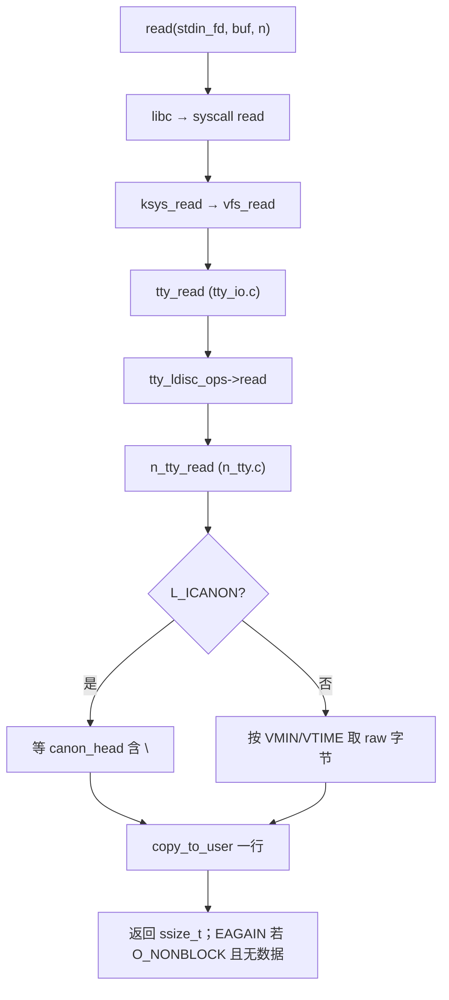
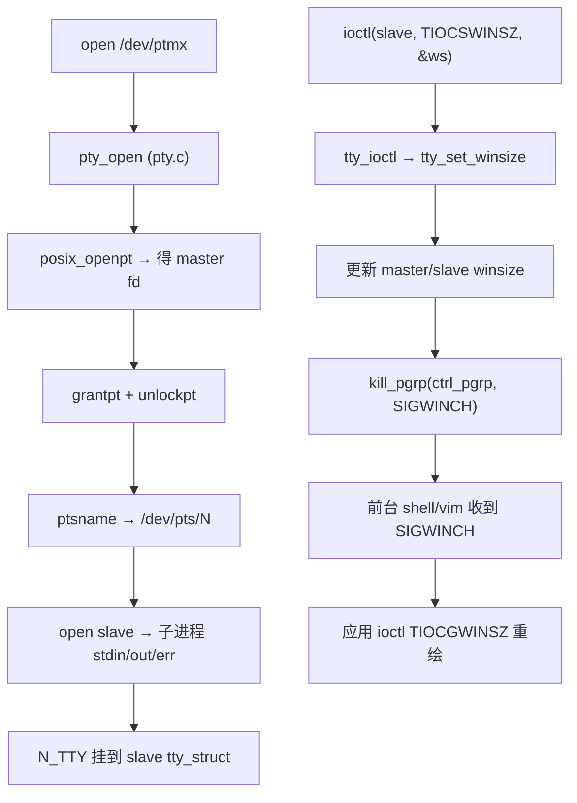

# Linux 终端编程完整篇：从 termios、TTY 到伪终端 PTY 与排障

`read(STDIN)` 不敲回车永不返回、密码仍被回显、`vim` 在管道里乱码、SSH 改窗口大小后 `top` 布局错位、`script` 录屏子进程认为不是 TTY——根因多半不在应用逻辑，而是 **termios 标志（ICANON/ECHO）、线路规程 N_TTY、PTY 主从配对、窗口 ioctl 与 SIGWINCH** 没对齐。

终端（TTY）是字符设备 + **线路规程（line discipline）** 的组合：驱动收硬件/PTY 字节，N_TTY 做行编辑、回显、信号字符（Ctrl-C → SIGINT），`read` 才看到「一行」或按 VMIN/VTIME 的原始字节。伪终端（PTY）用 master/slave 一对 fd 模拟这套行为，让 `ssh`、`tmux`、`script`、Python `pty` 能在非物理终端上跑交互程序。与《Linux 文件 I/O 完整篇》中的短返回、`O_NONBLOCK` 不同，TTY 的「短读」常意味着 **行规程尚未凑满一行** 或 **VMIN/VTIME 计时未到**，不能照搬普通文件 fd 的循环读模板。

本文从 POSIX `termios` → glibc `tcgetattr` → 内核 `tty_io.c`/`n_tty.c`/`pty.c` → `stty`/`strace`/proc 观测 → Checklist 闭环。合并源 chapter（097–102）为提纲；正文按真实内核路径与符号重写。

---

## 源码锚点

| 路径/接口 | 作用 |
|-----------|------|
| `drivers/tty/tty_io.c` | `tty_read`/`tty_write`、`tty_ioctl`、`tty_open`、会话与前台进程组 |
| `drivers/tty/n_tty.c` | N_TTY 线路规程：`n_tty_read`、`n_tty_write`、`ICANON`/`ECHO` 处理 |
| `drivers/tty/pty.c` | PTY 分配、`pty_open`、`/dev/ptmx` 与 `/dev/pts/N` |
| `include/linux/tty.h` | `struct tty_struct`、`tty_ldisc_ops`、窗口尺寸字段 |
| `man 3 termios` | `tcgetattr`/`tcsetattr`、`cfmakeraw`、`c_lflag` 语义 |
| `man 4 tty_ioctl` | `TIOCSWINSZ`/`TIOCGWINSZ`、`TIOCSCTTY`、`TIOCGPGRP` |
| `man 7 signal` | `SIGWINCH` 递送时机（窗口变化 → 前台进程组） |

用户态保存/恢复 termios（交互程序进 raw 模式的标准写法）：

```c
#include <termios.h>
#include <unistd.h>

static struct termios saved;

static int tty_raw(int fd)
{
	if (tcgetattr(fd, &saved) == -1)
		return -1;
	struct termios raw = saved;
	cfmakeraw(&raw);                    /* 清 ICANON、ECHO、ISIG 等 */
	raw.c_cc[VMIN]  = 1;                  /* 非规范：至少读 1 字节 */
	raw.c_cc[VTIME] = 0;                  /* 无超时 */
	return tcsetattr(fd, TCSANOW, &raw);
}

static void tty_restore(int fd)
{
	tcsetattr(fd, TCSANOW, &saved);
}
```

内核侧 TTY 与线路规程（概念骨架，见 `include/linux/tty.h` 中 `struct tty_struct`、`tty_operations`；用户态 `termios` 与内核 `ktermios` 字段一一对应，由 `n_tty_set_termios` 同步到 `n_tty_data`）：

```c
struct tty_struct {
	struct tty_driver *driver;
	struct tty_ldisc_ops *ldisc;   /* 默认 N_TTY：n_tty.c */
	struct ktermios termios;       /* 内核 termios 镜像 */
	struct winsize winsize;        /* TIOCSWINSZ 更新此字段 */
	struct pid *ctrl_pgrp;         /* 前台进程组，SIGWINCH 目标 */
	/* link：PTY master ↔ slave */
	struct tty_struct *link;
	void *disc_data;               /* N_TTY 时为 struct n_tty_data */
};

struct tty_ldisc_ops {
	ssize_t (*read)(struct tty_struct *, struct file *, u8 *, size_t, void **, unsigned long);
	ssize_t (*write)(struct tty_struct *, const u8 *, size_t);
	void (*set_termios)(struct tty_struct *, const struct ktermios *old);
	/* ... */
};
```

N_TTY 读路径在 `n_tty.c` 中按 `L_ICANON(tty)` 分支：**规范模式**等到行尾（`\n`）才向用户缓冲推数据；**非规范模式**按 `VMIN`/`VTIME` 立即返回可用字节。

---

## 调用链

### 用户态 read 到 N_TTY 规范/原始模式



### PTY 创建与窗口 resize → SIGWINCH



---

## 重点知识

### 1. termios 四组标志与 c_cc

POSIX `struct termios`（`man termios`）四组：

| 字段 | 典型标志 | 作用 |
|------|----------|------|
| `c_iflag` | `ICRNL`、`IXON`、`IGNBRK` | 输入预处理：CR→NL、软件流控 |
| `c_oflag` | `OPOST`、`ONLCR`、`OLCUC` | 输出后处理：换行映射 |
| `c_cflag` | `CS8`、`CREAD`、`PARENB` | 波特率/数据位/校验（PTY 上多为忽略） |
| `c_lflag` | **`ICANON`**、**`ECHO`**、**`ISIG`**、`ECHOE`、`IEXTEN` | 规范模式、回显、信号字符 |

**`ICANON`（规范模式）**：输入经行编辑缓冲，`read` 通常整行返回（遇 `\n` 或 EOF 字符）。行内 Backspace、Ctrl-U 杀行由 N_TTY 在 `n_tty_receive_char` 路径处理，应用层 `read` 看不到中间编辑过程。规范模式下 **`read` 可能返回少于请求的长度**，但语义上是一「行」；缓冲区满时行为由 `N_TTY_BUF_SIZE` 与驱动 throttle 决定。

**`ECHO` / `ECHOE` / `ECHOK`**：`ECHO` 驱动回显输入；`ECHOE` 让擦除符显示为退格效果；`ECHOK` 在 kill 行时回显换行。关 `ECHO` 做密码输入时，常同时关 `ECHOE|ECHOK` 避免驱动仍做视觉擦除。

**`ISIG`**：`INTR_CHAR`（常 Ctrl-C）、`QUIT_CHAR`、`SUSP_CHAR` 触发信号。`cfmakeraw()` 会清 `ISIG`，故 raw 模式下 Ctrl-C 只是字节 `0x03`，不会自动 SIGINT——需要程序自己解释或恢复 `ISIG`。

**输入/output 翻译**：`ICRNL` 把输入 CR 变 NL；`ONLCR` 把输出 NL 变 CR+LF。串口终端与 PTY 默认值不同，跨平台 TUI 常显式 `cfmakeraw` 避免「多一个 `\r`」类 bug。

**`c_cc[]` 控制字符**（规范模式下）：

| 宏 | 含义 |
|----|------|
| `VEOF` | Ctrl-D，EOF |
| `VERASE` | 擦除 |
| `VKILL` | 杀行 |
| `VINTR` | 中断 → SIGINT |
| `VQUIT` | Quit → SIGQUIT |
| `VSUSP` | 暂停 → SIGTSTP |
| `VMIN`/`VTIME` | **非规范模式**下读语义（见 §6） |

**系统调用映射**：glibc `tcgetattr`/`tcsetattr` 封装 `ioctl(fd, TCGETS/TCSETS/TCSETSW/TCSETSF, &termios)`，最终进入 `tty_ioctl` → `n_tty_set_termios` 或驱动 `set_termios`。`TCSANOW` 对应 `TCSETS`，立即改内核与 discipline 状态。

观测当前终端（可执行）：

```bash
stty -a                    # 人类可读 flags
stty -a </dev/tty          # 明确对控制终端
python3 -c "import termios,sys; t=termios.tcgetattr(sys.stdin); print(t)"
# 对比文件描述符 0 与 /dev/tty（可能不同：daemon 重定向后）
python3 -c "import termios,os; print('stdin',termios.tcgetattr(0)); print('tty',termios.tcgetattr(open('/dev/tty')))"
```

### 2. 原始模式（raw mode）与 cfmakeraw

**原始模式**不是单一内核开关，而是用户态约定：清除 `ICANON | ECHO | ISIG | IEXTEN`，常配合 `VMIN=1, VTIME=0`，使 `read` 每按键（或每字节）返回。`vim`、`less`、`ssh` 客户端、全屏 TUI 都需此模式；否则按键被行规程「吃掉」或要等回车才进应用缓冲。

glibc **`cfmakeraw(3)`** 等价于清以下位：`IGNBRK|BRKINT|PARMRK|ISTRIP|INLCR|IGNCR|ICRNL|IXON`；`OPOST`；`ECHO|ECHONL|ICANON|ISIG|IEXTEN`；并设 `VMIN=1, VTIME=0`。它 **不会** 改 `c_cflag` 波特率位，PTY 上通常无影响。

```c
struct termios t;
tcgetattr(STDIN_FILENO, &t);
cfmakeraw(&t);
t.c_oflag |= OPOST;   /* 有的程序保留输出处理，按需求调整 */
t.c_iflag &= ~ICRNL;  /* 若需区分 CR 与 NL，进一步收紧 */
tcsetattr(STDIN_FILENO, TCSANOW, &t);
```

**`tcsetattr` 的 when 参数**：

| 宏 | 含义 | 使用场景 |
|----|------|----------|
| `TCSANOW` | 立即生效 | 进 raw 模式 |
| `TCSADRAIN` | 等输出队列发完 | 退出 TUI 前避免截断 |
| `TCSAFLUSH` | 丢弃未读输入再改 | 清掉半行垃圾再读密码 |

**必须保存并恢复**：异常退出（SIGSEGV）若未 restore，shell 会「不回显、不回车」，用户以为终端坏了。可靠程序在 `SIGINT`/`SIGTERM` handler 里只做 async-signal-safe 的 restore，或 `_exit` 前恢复。

```c
static void on_exit_sig(int sig)
{
	tty_restore(STDIN_FILENO);   /* tcsetattr only; async-signal-safe on Linux */
	raise(sig);                  /* 重新触发默认动作 */
}
```

```bash
stty sane                 # 恢复常见 cooked 设置
reset                     # terminfo 全重置
```

**与 cbreak 的区别**：BSD `cbreak` 仅关 `ICANON` 但常保留 `ISIG`/`ECHO`；Linux 无单独 API，需手动改 `c_lflag`。调试时确认你到底要「逐键读」还是「仍要行编辑/信号」。

### 3. TTY 线路规程与 N_TTY

Linux 默认线路规程 **N_TTY**（`n_tty.c` 文件头注释：原在 `tty_io.c`，后拆分）。`struct n_tty_data` 维护环形缓冲：`read_head`/`read_tail`、`canon_head`（规范模式下行尾位置）、`commit_head`（已提交给 `read` 的边界）以及 echo 队列。

**输入路径**：PTY master 写入 → `pty_write` → 对端 slave 的 `n_tty_receive_buf` → 按 `char_map` 处理特殊字符（擦除、kill、flow control）→ 入环形缓冲。若 `L_ECHO(tty)`，字符同时进入 echo 路径写回 master。

**输出路径**：应用 `write(slave)` → `n_tty_write` → 若 `OPOST` 开启则做输出处理 → 写到 master 读端（终端模拟器显示）。

切换 `ICANON` 时 `n_tty_set_termios` 会重置 `canon_head` 与 `read_flags`（源码：`old->c_lflag ^ tty->termios.c_lflag & ICANON` 分支）。因此 **运行时切换 canonical ↔ raw 会清空未提交的输入缓冲**——在 shell 脚本里对同一 fd 反复切模式要小心。

内核还维护 `ldata->icanon` 与 `ldata->raw` 快捷标志；`n_tty_read` 入口先判 `icanon`，规范模式走 `canon_copy_from_read_buf` 等到 `\n`，非规范模式直接按 `read_tail` 与 `VMIN`/`VTIME` 计时器返回。

PTY 类型在 `n_tty_check_unthrottle` 等对 `TTY_DRIVER_TYPE_PTY` 有特殊流控：master 读慢时 slave 写端可能阻塞，影响 `script`/管道背压。SSH 大流量输出时若 master 不及时 `read`，远端 `write` 会卡住——这是 TTY 层反压，不是 TCP 问题。

**其他线路规程**：串口常用同一 N_TTY；极少见的 `HDLC`、`SLIP` 等以不同 `ldisc` 注册。用户态 **`TIOCSETD`/`TIOCGETD`** 可切换 discipline；PTY 交互场景几乎始终 N_TTY。

```bash
# 查看当前 line discipline（十进制 0 = N_TTY）
cat /proc/tty/driver/pty 2>/dev/null | head
# 或 strace 应用 startup 时的 TIOCGETD
strace -e ioctl your_app 2>&1 | grep TIOC
```

### 4. 伪终端 PTY：master / slave

| 端 | 设备 | 典型持有者 |
|----|------|------------|
| Master | `/dev/ptmx` 打开后的 fd | `sshd`、`tmux`、`script`、Python `pty` 父进程 |
| Slave | `/dev/pts/N` | 子 shell、`vim`、远程登录会话 |

内核 `pty.c` 维护 **Unix98 PTY**：`ptmx` 为克隆设备，每次 `open` 分配一对 `(master, /dev/pts/N)`。Master 侧 `write` 成为 slave 侧 `read` 的数据源；slave 的 `write` 从 master `read` 可见——与物理终端「键盘线/显示线」类比。

创建流程（POSIX + Linux）：

```c
#include <stdlib.h>
#include <fcntl.h>
#include <unistd.h>
#include <pty.h>           /* glibc: openpty */

int master, slave;
openpty(&master, &slave, NULL, NULL, NULL);
/* 或：m = posix_openpt(O_RDWR|O_NOCTTY); grantpt(m); unlockpt(m); ptsname(m) */
```

子进程侧：

```c
if (fork() == 0) {
	setsid();
	ioctl(slave, TIOCSCTTY, 0);   /* 设为控制终端，可选 */
	dup2(slave, STDIN_FILENO);
	dup2(slave, STDOUT_FILENO);
	dup2(slave, STDERR_FILENO);
	if (slave > STDERR_FILENO) close(slave);
	execlp("bash", "bash", NULL);
}
close(slave);   /* 父进程只保留 master */
/* 父：poll(master)+read/write 转发，或传 winsize */
```

**`grantpt`/`unlockpt`**：调整 slave 节点权限并解锁，否则非 root 无法 `open /dev/pts/N`。**`ptsname`** 返回 slave 路径，仅在 unlock 后有效。

**`isatty(fd)`** 检测 fd 是否终端（`ioctl(TCGETS)` 成功）；批处理管道里为 false 时，许多程序关闭颜色/进度条——这是行为差异而非 bug。GNU `ls --color=auto`、Cargo/npm 进度条都依赖此检测。

**OpenSSH 路径简述**：`sshd` session 为每个登录 `fork`，父持 master、子把 slave 设为 stdio 并 `exec` shell；客户端 resize 经 SSH 协议传到服务端，对 master 做 `TIOCSWINSZ`，slave 侧 shell 收 SIGWINCH。

录屏与复现（可执行）：

```bash
script -q /tmp/sess.log bash -c 'stty -a; echo ok'
# 强制分配 PTY 跑单测（GitHub Actions 常用）
script -q -c 'pytest -s tests/test_cli.py' /dev/null
# 回放
cat /tmp/sess.log
```

Python 最小 PTY（可执行）：

```python
import pty, os, sys
pty.spawn(["bash", "-c", "stty -a; exec bash"])
# 或 subprocess 需要更细控制时：
import subprocess, pty, select
master, slave = pty.openpty()
proc = subprocess.Popen(["bash"], stdin=slave, stdout=slave, stderr=slave, close_fds=True)
os.close(slave)
```

**常见坑**：父进程未 `close(slave)` 导致子进程永不会 EOF；master 不读导致子 `write` 阻塞；在 master 上做 `tcsetattr` 无效——**termios 必须作用在 slave**（或 stdin 已 dup 成 slave 的 fd）。

### 5. TIOCSWINSZ 与 SIGWINCH

窗口大小由 `struct winsize { ws_row, ws_col, ws_xpixel, ws_ypixel }` 表示。`ioctl(fd, TIOCSWINSZ, &ws)` 写入内核 `tty_struct->winsize`（`man 4 tty_ioctl`：内核不拿它排版，但会通知应用）。`TIOCGWINSZ` 读取当前值；`ncurses`/`readline` 在 SIGWINCH 后内部会调前者。

**窗口变化时**，内核向 **该 TTY 的前台进程组** 发 **`SIGWINCH`**（默认忽略；全屏程序需捕获并重读尺寸）。若信号被阻塞（`sigprocmask`），则标记 pending，解除阻塞后递送——多线程程序应用 **`pthread_sigmask`** 与主线程同步处理 flag。

```c
#include <sys/ioctl.h>
#include <signal.h>

static volatile sig_atomic_t win_resized;

static void on_winch(int sig) { (void)sig; win_resized = 1; }

void install_winch(void)
{
	struct sigaction sa = { .sa_handler = on_winch, .sa_flags = SA_RESTART };
	sigemptyset(&sa.sa_mask);
	sigaction(SIGWINCH, &sa, NULL);
}

void refresh_winsize(int fd)
{
	struct winsize ws;
	if (ioctl(fd, TIOCGWINSZ, &ws) == -1)
		return;
	/* 用 ws.ws_row / ws.ws_col 重绘 UI；ncurses: endwin+refresh 或 resize_term */
}
```

**PTY 转发 winsize**：仅改 SSH 客户端窗口不够，服务端必须在 **master fd** 上 ioctl，内核同步到 slave 并 SIGWINCH 给远端 shell。自写 PTY 网关时，父进程在侦测到 resize 后：

```c
ioctl(master, TIOCSWINSZ, &ws);   /* 与终端模拟器行为一致 */
```

终端模拟器、SSH 客户端在 resize 时对 **slave** 侧发 `TIOCSWINSZ`；本地测 SIGWINCH：

```bash
# 查当前 winsize（需 TTY fd）
stty size
python3 -c "import fcntl,struct,sys; ws=struct.pack('HHHH',0,0,0,0); print(struct.unpack('HHHH', fcntl.ioctl(sys.stdout,0x5413,ws)))"
# 另开终端对目标 session 发 WINCH（调试）
kill -WINCH $(ps -o pid= -p $(ps -o sid= -p $$))
```

**与 SIGWINCH 相关的坑**：handler 里调 `printf`/`malloc` 不安全；在 handler 里做复杂 curses 可能死锁。标准做法：handler 置 `volatile sig_atomic_t`，主循环 `poll` 返回后读 winsize 并重绘。

### 6. 阻塞读、非阻塞读与 VMIN/VTIME

**阻塞读（默认）**：规范模式下 `read` 阻塞到一行就绪；非规范 + `VMIN>0` 阻塞到至少 `VMIN` 字节。PTY master 无数据时，slave 侧 `read` 同样睡眠在 `n_tty_read` 的 wait queue 上，直到有输入或信号打断。

**`O_NONBLOCK`**：对 TTY 设 `fcntl(fd, F_SETFL, flags|O_NONBLOCK)` 后，无数据时 `read` 返回 `-1`，`errno=EAGAIN`。适合事件循环 + `poll`/`epoll`。注意：**规范模式 + O_NONBLOCK** 时，尚无完整一行也会 EAGAIN，应用需循环等或改非规范。

**`SA_RESTART` 与 EINTR**：慢系统调用被信号打断时返回 `-1/EINTR`；若 `sigaction` 设了 `SA_RESTART`，部分调用会自动重启。TUI 常在主循环显式重试 `read`，而不是依赖 `SA_RESTART` 覆盖所有路径。

**非规范 VMIN/VTIME 组合**（`ICANON` 关闭时，`man termios`）：

| VMIN | VTIME | 行为 |
|------|-------|------|
| 0 | 0 | 非阻塞：有则返回，无则 EAGAIN（需 O_NONBLOCK） |
| >0 | 0 | 阻塞直到 VMIN 字节 |
| 0 | >0 | 定时读：超时返回已有字节（0.1s×VTIME） |
| >0 | >0 | 阻塞，首字节后按 VTIME 间隔收包 |

游戏/串口协议常用 `VMIN=0, VTIME>0` 做「等一包或超时」；聊天客户端常用 `VMIN=1, VTIME=0` 逐键响应。

```c
struct termios t;
tcgetattr(fd, &t);
t.c_lflag &= ~ICANON;
t.c_cc[VMIN]  = 0;
t.c_cc[VTIME] = 5;   /* 0.5s */
tcsetattr(fd, TCSANOW, &t);
```

配合 `poll`（比忙等 `O_NONBLOCK` 更省 CPU）：

```c
struct pollfd p = { .fd = fd, .events = POLLIN };
for (;;) {
	if (poll(&p, 1, -1) <= 0) {
		if (errno == EINTR) continue;
		break;
	}
	ssize_t n = read(fd, buf, sizeof buf);
	if (n < 0 && errno == EINTR) continue;
	if (n <= 0) break;
	/* 处理 buf */
}
```

**`select`/`epoll` 注意**：TTY 可读不等于「有一整行」；规范模式下内核可能在行未完整前不标记可读，或可读后一次 `read` 仍只给部分缓冲——与 socket 字节流语义不同，需按 TTY 规则设计协议。

### 7. 会话、控制终端与常见故障

**会话（session）与进程组（process group）**：登录 shell 通常是会话首进程（session leader），其 PGID 等于 PID。PTY slave 上的 shell 持有 **控制终端（controlling terminal）**；内核在 `tty_io.c` 里维护 `tty->ctrl_pgrp`，向 TTY 产生的信号（`SIGINT`、`SIGQUIT`、`SIGTSTP`、`SIGWINCH`）发给该前台组。

- **`TIOCSCTTY`**：会话首进程且无已有控制终端时，可把打开的 slave 设为控制终端；守护进程应 **`O_NOCTTY`** 打开 `/dev/tty*`，避免意外抢占。
- **前台进程组**：Shell 用 `tcsetpgrp(STDIN_FILENO, pgid)`（底层 `TIOCSPGRP`）把作业调到前台；后台作业读 TTY 会收到 **`SIGTTIN`**（默认停止）。
- **SIGHUP**：终端断开（master 关闭、SSH 断线）时 slave 驱动对控制进程发 SIGHUP；`nohup`、`disown`、`setsid`+无控制终端可规避。

**`tty_ioctl` 与 winsize**（`tty_io.c`）：`TIOCSWINSZ`/`TIOCGWINSZ` 经 `tty_set_winsize` 更新 `tty->winsize`，并同步到 `tty->link`（PTY 对端）。随后 `do_resize` 路径对前台组发 SIGWINCH。全屏程序忽略该信号则布局停留在旧行列数。

**cooked vs raw 对照**（便于读 `stty -a`）：

| stty 名 | termios | 含义 |
|---------|---------|------|
| `icanon` | `ICANON` | 行缓冲 |
| `-echo` | `ECHO` off | 不回显 |
| `isig` | `ISIG` | Ctrl-C 等产生信号 |
| `opost` | `OPOST` | 输出后处理 |
| `min N` / `time N` | `VMIN`/`VTIME` | 非规范读参数 |

```bash
# 一行切 raw 再恢复（调试 TUI）
stty -F /dev/tty raw -echo; read -n1 k; stty -F /dev/tty sane
# 看前台进程组是否与 shell 一致
ps -o pid,pgid,sid,tty,comm -p $$,$(ps -o pgid= -p $$ | tr -d ' ')
```

| 现象 | 可能根因 | 验证 |
|------|----------|------|
| 密码明文显示 | 未清 `ECHO` | `stty -echo` / `termios` |
| 管道里 `read` 一次读不完一行 | 非 TTY，无 ICANON | `isatty` |
| 子程序无颜色 | stdout 非 TTY | `script`/`pty` 包装 |
| resize 后 UI 错位 | 未处理 SIGWINCH | `strace -e ioctl` 看 WINSZ |
| Ctrl-C 杀不掉 raw 程序 | `ISIG` 已关 | 用 `kill -INT` |
| master 关闭后子进程挂 | SIGHUP | `setsid`+忽略或 re-parent |
| CI 里提示 "not a terminal" | 无 PTY | `script -q -c 'cmd' /dev/null` |
| 回车变成 ^M 显示 | CR/LF 映射 | `stty -a` 看 icrnl/onlcr |

**strace 观测**：

```bash
strace -e read,write,ioctl,tcgetattr,tcsetattr -f ./your_tui
strace -e ioctl -yy ./app 2>&1 | grep -E 'WINSZ|TCGETS|TCSETS|TIOCSCTTY'
```

**proc**：

```bash
ls -l /proc/self/fd/0
readlink /proc/self/fd/0          # -> /dev/pts/3 或 pipe:[...]
cat /proc/self/stat | awk '{print "sid", $6, "pgrp", $7}'
# fd 0 的 flags 含 O_NONBLOCK 时 read 可能 EAGAIN
cat /proc/self/fdinfo/0
```

**与 stdio 的交互**：终端上 glibc 默认 **行缓冲 stdout**（`isatty` 为真时 `_IOLBF`），与内核 `ICANON` 是两层缓冲。`printf` 无 `\n` 不 flush 时，即使用户已敲回车也可能看不到输出——TUI 程序常对 stdout 设 `_IONBF` 或 `write` 直出。

**排障顺序**：`isatty` → `stty -a </dev/tty` → `readlink /proc/self/fd/0` → `strace -e read,ioctl` → 对照 `n_tty.c` 中 `ICANON`/`ECHO` 分支。改 termios 后行为仍异常，确认是否 fork 后子进程继承旧属性、或是否在 **不同 fd**（`/dev/tty` vs pipe）上调用 `tcsetattr`。

---


---

*合并自：Linux系统编程/chapters/097–102-终端编程*（2026-09-08）
