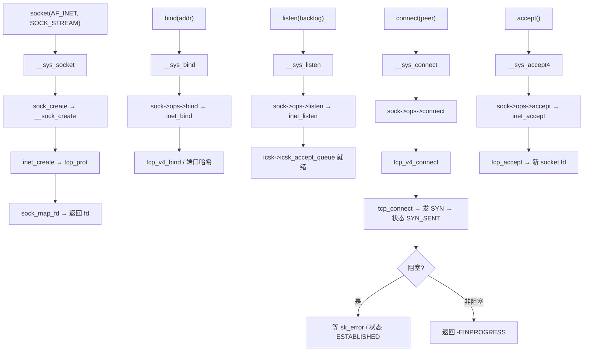
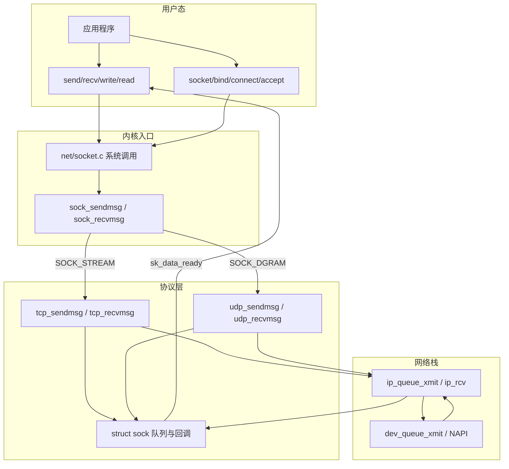

# Linux 网络套接字完整篇：从 socket/bind/listen 到 TCP 收发与排障

`bind` 报 `EADDRINUSE` 但 `ss` 看不到占用、非阻塞 `connect` 返回 `-1` 却 `errno=EINPROGRESS` 不知何时可读、对端 RST 后 `write` 触发 `EPIPE`/`SIGPIPE`、UDP `recvfrom` 丢包却无任何 errno——多半是 **socket 生命周期、阻塞语义与 `struct sock` 状态** 没对齐，而不是「网络坏了」。

POSIX `socket/bind/listen/accept/connect` 与 `send/recv` 是进程与内核 `struct socket`/`struct sock` 之间的契约：fd 仍走 VFS（`struct file` 挂 `socket_file_ops`），但读写语义由协议 `proto_ops`/`inet_protosw` 决定，**不是**普通磁盘文件的 `read_iter`。同一进程可同时持有数千连接 fd，瓶颈常在 `accept` 速率、非阻塞 I/O 与 `SO_*` 默认值，而非 `socket()` 本身。本文从用户态 API → glibc → 系统调用 → `net/socket.c` → TCP/UDP 协议实现 → `SO_*`/非阻塞 → 常见 errno → `strace`/`ss` 观测 → Checklist 闭环。合并源 chapter（061–066）为提纲；正文按真实内核路径与符号重写。

---

## 源码锚点

| 路径 | 作用 |
|------|------|
| `net/socket.c` | `__sys_socket`、`__sys_bind`、`__sys_listen`、`__sys_accept4`、`__sys_connect`、`sock_sendmsg`/`sock_recvmsg` |
| `include/linux/socket.h` | `struct socket`（BSD 层：`struct file *file`、`const struct socket_ops *ops`、`struct sock *sk`） |
| `include/net/sock.h` | `struct sock`（协议无关：队列、`sk_data_ready`、`sk_write_space`、标志位） |
| `net/ipv4/af_inet.c` | `inet_create`、`inet_bind`、`inet_listen`、`inet_stream_ops` |
| `net/ipv4/tcp_ipv4.c` | `tcp_v4_connect`、`tcp_v4_rcv` |
| `net/ipv4/tcp.c` | `tcp_sendmsg`、`tcp_recvmsg`、`tcp_accept` |
| `net/ipv4/udp.c` | `udp_sendmsg`、`udp_recvmsg` |
| `man 2 socket/bind/listen/accept/connect/send/recv` | 用户态语义与 errno |
| `man 7 socket`、`man 7 tcp` | `SO_*`/`TCP_*` 选项 |

用户态 TCP 服务端最小骨架（必须处理 `EINTR`、短返回与错误路径 `close`）：

```c
int fd = socket(AF_INET, SOCK_STREAM | SOCK_CLOEXEC, 0);
struct sockaddr_in addr = { .sin_family = AF_INET, .sin_port = htons(8080),
                            .sin_addr.s_addr = htonl(INADDR_ANY) };
int one = 1;
setsockopt(fd, SOL_SOCKET, SO_REUSEADDR, &one, sizeof one);

if (bind(fd, (struct sockaddr *)&addr, sizeof addr) < 0) { perror("bind"); return 1; }
if (listen(fd, SOMAXCONN) < 0) { perror("listen"); return 1; }

for (;;) {
	struct sockaddr_in cli;
	socklen_t len = sizeof cli;
	int cfd = accept4(fd, (struct sockaddr *)&cli, &len, SOCK_CLOEXEC);
	if (cfd < 0) { if (errno == EINTR) continue; perror("accept"); break; }
	/* read/write cfd … */
	close(cfd);
}
close(fd);
```

内核侧对象分层：

```c
/* include/linux/socket.h — VFS 与协议栈之间的 BSD 门面 */
struct socket {
	socket_state		state;
	short			type;          /* SOCK_STREAM / SOCK_DGRAM */
	unsigned long		flags;
	const struct socket_ops *ops;  /* socket 层操作 */
	struct sock		*sk;           /* 协议状态在这里 */
	struct file		*file;
};

/* include/net/sock.h — 协议无关 socket 状态（节选） */
struct sock {
	struct sock_common	__sk_common;
	socket_lock_t		sk_lock;
	struct sk_buff_head	sk_receive_queue;
	struct sk_buff_head	sk_write_queue;
	void			(*sk_data_ready)(struct sock *sk);
	int			(*sk_backlog_rcv)(struct sock *sk, struct sk_buff *skb);
	/* … */
};
```

`socket()` 创建 `struct socket` + 分配 fd；`bind`/`listen`/`connect` 经 `sock->ops->*` 进入 INET 层；数据面 `send`/`recv` 统一走 `sock_sendmsg`/`sock_recvmsg` → 具体 `tcp_sendmsg` 或 `udp_sendmsg`。

**与文件 I/O 的差异**：socket fd 的 `struct file->f_op` 为 `socket_file_ops`，`read`/`write` 最终到 `sock_read_iter`/`sock_write_iter`，而非 `generic_file_read_iter`。因此《文件 I/O 完整篇》里的 `O_DIRECT`、`lseek`、`sendfile` 对 socket **不适用**；非阻塞靠 `O_NONBLOCK`/`fcntl`，背压表现为 `EAGAIN` 或发送窗口阻塞，而非磁盘 short read。`include/linux/socket.h` 中 `SOL_SOCKET` 层选项与 `netinet/tcp.h` 中 `TCP_*` 选项分属不同 `setsockopt` level，混用 level 会 `ENOPROTOOPT`。

---

## 调用链

### 用户态 socket/connect 到 TCP 建连



### 分层与 TCP/UDP 数据流



文字版收发链（与 `strace` 对照）：

```text
send(fd, buf, n, 0)
  → __sys_sendto / __sys_sendmsg     /* net/socket.c */
      → sock_sendmsg
          → tcp_sendmsg              /* net/ipv4/tcp.c */
              → sk_stream_write_queue / tcp_push
              → tcp_transmit_skb → ip_queue_xmit

recv(fd, buf, n, 0)
  → __sys_recvfrom
      → sock_recvmsg
          → tcp_recvmsg
              → 从 sk_receive_queue 拷贝到用户态
              → 空且阻塞 → 睡眠；非阻塞 → -EAGAIN
```

---

## 重点知识

### 1. 六件套语义：socket / bind / listen / accept / connect / close

| API | 要点 | 常见 errno |
|-----|------|------------|
| `socket` | `AF_INET`/`AF_INET6`；`SOCK_STREAM`/`SOCK_DGRAM`；`SOCK_CLOEXEC`/`SOCK_NONBLOCK` | `EAFNOSUPPORT`、`EPROTONOSUPPORT` |
| `bind` | 本地地址+端口；`INADDR_ANY` 监听全部网卡 | `EADDRINUSE`、`EACCES`（特权端口 <1024） |
| `listen` | 仅用于 `SOCK_STREAM`；`backlog` 受 `somaxconn` 截断 | `ENOTSOCK`、`EOPNOTSUPP` |
| `accept`/`accept4` | 从已完成三次握手队列取连接；返回**新 fd** | `EINTR`、`ECONNABORTED` |
| `connect` | 客户端建连；UDP 也可 `connect` 固定对端 | `ECONNREFUSED`、`ETIMEDOUT`、`EINPROGRESS` |
| `close`/`shutdown` | `close` 释放 fd；`shutdown(SHUT_WR)` 半关闭写端 | 重复 close 未定义 |

`listen` 的 `backlog` 不是「最大连接数」，而是 **已完成握手等待 `accept` 的队列长度** 与半连接队列策略共同决定；高并发服务要同时调 `net.core.somaxconn`、`net.ipv4.tcp_max_syn_backlog`，并用 `ss -lnt` 看 `Recv-Q`/`Send-Q`。

客户端 `connect` 在三次握手完成后才返回（阻塞模式）；内核状态从 `CLOSED` → `SYN_SENT` → `ESTABLISHED`。若指定了源地址或端口冲突，可能在 `tcp_v4_connect` 早期失败并返回 `EADDRNOTAVAIL`。IPv6 路径对应 `tcp_v6_connect`（`net/ipv6/tcp_ipv6.c`），系统调用入口仍为 `__sys_connect`，排障思路与 v4 相同。

### 2. TCP 与 UDP 差异

| 维度 | TCP (`SOCK_STREAM`) | UDP (`SOCK_DGRAM`) |
|------|---------------------|---------------------|
| 语义 | 面向连接、可靠、有序字节流 | 无连接、报文边界、不保证到达 |
| 建连 | 必须 `connect`（客户端）或 `accept`（服务端） | 可直接 `sendto`；`connect` 后可用 `write`/`send` |
| 读写 | **字节流无消息边界**；`recv` 可能拆包/粘包 | 一次 `sendto` 对应一个 datagram；大于 MTU 需应用分片 |
| 内核路径 | `tcp_v4_connect` / `tcp_sendmsg` | `udp_sendmsg`（无连接状态机） |
| 背压 | 发送窗口满 → 阻塞或 `EAGAIN` | socket 发送缓冲满 → 丢包或阻塞 |

UDP 服务端最小样例（无 `listen`/`accept`）：

```c
int fd = socket(AF_INET, SOCK_DGRAM | SOCK_CLOEXEC, 0);
bind(fd, (struct sockaddr *)&addr, sizeof addr);
for (;;) {
	char buf[2048];
	struct sockaddr_in peer;
	socklen_t plen = sizeof peer;
	ssize_t n = recvfrom(fd, buf, sizeof buf, 0,
	                     (struct sockaddr *)&peer, &plen);
	if (n < 0) { if (errno == EINTR) continue; break; }
	sendto(fd, buf, n, 0, (struct sockaddr *)&peer, plen);
}
```

UDP 排障：`recvfrom` 返回 `-1` 且 `errno=ECONNREFUSED` 常见于对已 `connect` 的 UDP 在对端 ICMP Port Unreachable 后首次读。TCP 粘包靠应用层协议（长度前缀/分隔符），不是 `TCP_NODELAY` 能单独解决的。

**TCP 三次握手与队列**：客户端 `connect` → 内核 `tcp_v4_connect` 发 SYN；服务端 SYN 到达 → 进半连接队列（`SYN_RECV`）；第三次 ACK 完成 → 连接进入全连接队列，等待 `accept`。`listen(backlog)` 与 `somaxconn` 限制全连接队列；`tcp_max_syn_backlog` 与 syncookie 影响半连接。`accept` 仅从全连接队列取 fd，不参与握手——因此 `strace` 里服务端可能先看到大量 `poll`/`epoll_wait`，再在连接就绪后 burst `accept4`。

### 3. 非阻塞与 `fcntl` / `SOCK_NONBLOCK`

创建时：`socket(..., SOCK_STREAM | SOCK_NONBLOCK)` 或 `accept4(..., SOCK_NONBLOCK)`。

已存在 fd：

```c
int fl = fcntl(fd, F_GETFL);
fcntl(fd, F_SETFL, fl | O_NONBLOCK);
```

非阻塞语义：

| 场景 | 阻塞 fd | 非阻塞 fd |
|------|---------|-----------|
| `read`/`recv` 无数据 | 睡眠 | `-1`，`errno=EAGAIN`/`EWOULDBLOCK` |
| `write`/`send` 缓冲满 | 睡眠 | `-1`，`EAGAIN` |
| `connect` 进行中 | 等完成 | 立即 `-1`，`errno=EINPROGRESS`；用 `poll`/`select`/`epoll` 监视 **可写** 或 **异常**，再 `getsockopt(SO_ERROR)` 确认 |

`connect` + `EINPROGRESS` 标准模板：

```c
int err = 0;
socklen_t elen = sizeof err;
if (connect(fd, addr, addrlen) < 0 && errno != EINPROGRESS) { /* 真错误 */ }
/* poll 等 POLLOUT */
if (getsockopt(fd, SOL_SOCKET, SO_ERROR, &err, &elen) < 0 || err != 0) {
	/* err 为内核 connect 失败码，如 ECONNREFUSED */
}
```

配合 I/O 多路复用（`epoll` LT/ET）时，ET 模式必须循环 `read` 至 `EAGAIN`，否则后续事件饿死——详见《I/O 多路复用完整篇》。

高并发服务端典型模式：`listen fd` 设非阻塞 + `epoll_ctl(ADD, EPOLLIN)`；事件循环里 **循环 `accept4` 直到 `EAGAIN`**（避免单次只 accept 一个而积压全连接队列），每个 `cfd` 设非阻塞 + `EPOLLIN|EPOLLET|EPOLLRDHUP`，读循环至 `EAGAIN`。`EPOLLRDHUP` 可检测对端关闭写端（半关闭或 FIN），比仅靠 `read==0` 更早感知。

```c
for (;;) {
	int n = epoll_wait(epfd, evs, MAX, -1);
	for (int i = 0; i < n; i++) {
		if (evs[i].data.fd == lfd) {
			while ((cfd = accept4(lfd, NULL, NULL,
			                     SOCK_NONBLOCK|SOCK_CLOEXEC)) >= 0)
				epoll_ctl(epfd, EPOLL_CTL_ADD, cfd, &ev_in);
			continue;
		}
		/* drain cfd until EAGAIN */
	}
}
```

### 4. 常用 `SO_*` / `TCP_*` 选项

| 选项 | 层级 | 作用 | 典型坑 |
|------|------|------|--------|
| `SO_REUSEADDR` | socket | `TIME_WAIT` 期间可重新 `bind` 同端口 | 不等于 `SO_REUSEPORT`；多进程绑定需后者 |
| `SO_REUSEPORT` | socket | 多进程/线程负载均衡同一端口 | 需内核 ≥3.9；与 `SO_REUSEADDR` 组合使用 |
| `SO_KEEPALIVE` | socket | 开启 TCP keepalive 探测 | 默认间隔很长；细调用 `TCP_KEEPIDLE`/`TCP_KEEPINTVL` |
| `TCP_NODELAY` | TCP | 关闭 Nagle，小包低延迟 | 高频小包场景常用；与 `write` 合并策略权衡 |
| `SO_RCVBUF`/`SO_SNDBUF` | socket | 设置收发缓冲（内核可能翻倍） | 受 `net.core.rmem_max`/`wmem_max` 截断 |
| `SO_LINGER` | socket | `close` 时是否等待发送完 / 发 RST | `l_onoff=1,l_linger=0` → 粗暴 RST |
| `SO_RCVTIMEO`/`SO_SNDTIMEO` | socket | 读写超时 | 与 `alarm`/非阻塞 + `poll` 择一，勿混用多套超时 |
| `MSG_NOSIGNAL` | send 标志 | 避免 `SIGPIPE` | 等价于 `signal(SIGPIPE, SIG_IGN)` 的局部版 |

`setsockopt` 在 `bind`/`listen`/`connect` **之前** 设置才保证全程生效（如 `TCP_NODELAY`、`SO_REUSEADDR`）。

**`TIME_WAIT` 与 `SO_REUSEADDR`**：主动关闭方常进入 `TIME_WAIT`（默认 2×MSL），占用本地四元组。重启同端口服务时 `bind` 可能 `EADDRINUSE`——`SO_REUSEADDR` 允许 bind 处于 `TIME_WAIT` 的地址（Linux 语义）；但 **不能** 让两个进程同时 `listen` 同一 `(ip,port)`，除非 `SO_REUSEPORT`。用 `ss -o state time-wait sport = :8080` 确认是否 TW 堆积。

**半关闭与 `SO_LINGER`**：`shutdown(fd, SHUT_WR)` 发 FIN，仍可读；对端继续写会收到 RST 若本端已 close。`SO_LINGER {on,0}` 使 `close` 发 RST 而非四次挥手，常用于避免 `TIME_WAIT` 堆积，但可能导致对端 `ECONNRESET`。生产环境优先正常挥手 + `SO_REUSEADDR`，而非滥用 `linger=0`。

### 5. 常见 errno 与处理策略

| errno | 含义 | 策略 |
|-------|------|------|
| `EINTR` | 信号打断 | 同一 syscall 重试 |
| `EAGAIN`/`EWOULDBLOCK` | 非阻塞暂无数据/空间 | `poll`/`epoll` 后再读写 |
| `EINPROGRESS` | 非阻塞 `connect` 进行中 | 等可写 + `SO_ERROR` |
| `ECONNREFUSED` | 对端无监听 / RST 拒绝 | 检查地址端口、防火墙 |
| `ECONNRESET` | 对端发 RST 或异常关闭 | 读可能返回 0 或此错；写也可能触发 |
| `EPIPE` | 向已关闭连接写 | 捕获或 `MSG_NOSIGNAL`；默认还发 `SIGPIPE` |
| `ETIMEDOUT` | 连接或读写超时 | 调路由/防火墙；非阻塞 + 应用超时 |
| `EADDRINUSE` | 端口占用 | `ss -lntp`；`SO_REUSEADDR`；杀占用进程 |
| `EMFILE`/`ENFILE` | fd 耗尽 | `ulimit -n`；`accept` 过快未 `close` |
| `ENOTCONN` | UDP/TCP 未 connect 就 send | 先 `connect` 或改用 `sendto` |
| `EISCONN` | 重复 connect 已连接 TCP | 每 fd 只 connect 一次 |

**信号与 errno**：慢系统调用被信号打断返回 `EINTR` 时应重试；`SIGPIPE` 默认终止进程，网络服务通常全局 `SIG_IGN` 或对单次 `send` 用 `MSG_NOSIGNAL`。不要把 `ECONNRESET` 当成可忽略日志——往往意味着对端崩溃或中间设备发 RST，应计指标并关闭 fd。

**`ECONNRESET` vs `EPIPE`**：读路径上对端 RST 常见 `read` 返回 `-1`/`ECONNRESET` 或先收到 FIN 再 0；写路径上本端仍写 → `EPIPE`。半关闭：`shutdown(SHUT_WR)` 后仍可读对端数据，直到收到 FIN。

**`send`/`recv` 与 `write`/`read`**：socket fd 可用任意一组；`send/recv` 多 `flags` 参数（`MSG_DONTWAIT`、`MSG_PEEK`、`MSG_NOSIGNAL`）。`MSG_PEEK` 窥视数据不移除接收队列，调试协议头有用。`MSG_WAITALL` 尽量读满 `len`（仍可能被信号/错误打断）。内核最终都到 `sock_sendmsg`/`sock_recvmsg`。

短写循环（TCP 发送缓冲未满时也可能短返回）：

```c
ssize_t send_all(int fd, const void *buf, size_t len) {
	const char *p = buf;
	while (len) {
		ssize_t n = send(fd, p, len, MSG_NOSIGNAL);
		if (n > 0) { p += n; len -= n; continue; }
		if (n < 0 && errno == EINTR) continue;
		if (n < 0 && (errno == EAGAIN || errno == EWOULDBLOCK)) return -1; /* 交 poll */
		return -1;
	}
	return 0;
}
```

### 6. `strace` 与 `ss` 观测

**strace**（先看 syscall，再下内核）：

```bash
# 服务端：建连 + accept + 一次 echo
strace -f -e trace=network,socket,bind,listen,accept4,read,write,close \
  -yy -s 128 ./tcp_server

# 客户端：connect + send
strace -e trace=network,connect,sendto,recvfrom,write,read,getsockopt \
  ./tcp_client 127.0.0.1 8080

# 非阻塞 connect：应看到 connect → EINPROGRESS → poll → getsockopt(SO_ERROR)
strace -e connect,poll,getsockopt,write,read ./nb_client
```

`-yy` 打印 fd 对应 socket 地址；`network` 类 trace 含 `socket/bind/listen/accept` 等。看到 `sendmsg`/`recvmsg` 时对应内核 `__sys_sendmsg` → `sock_sendmsg`。

**ss**（替代 netstat，看队列与 TCP 内部状态）：

```bash
ss -lntp                    # 监听端口与进程
ss -tn state established     # 已建立连接
ss -tin                     # 含 cwnd/rtt/retrans（需权限）
ss -s                       # 汇总：TCP 各状态计数、重传
ss -o state time-wait       # TIME_WAIT 占用（bind 失败常查）
ss -K dst 1.2.3.4 dport = 443   # 诊断性发 RST（慎用生产）
```

现象对照：

| 现象 | 可能根因 | 验证 |
|------|----------|------|
| `bind EADDRINUSE` | 端口占用或 `TIME_WAIT` | `ss -lntp`、``ss -o state time-wait sport = :8080`` |
| `accept` 慢 | 三次握手队列满 | `ss -lnt` 看 `Recv-Q` vs `Send-Q` |
| `connect ETIMEDOUT` | 路由/防火墙/半连接丢 SYN | `tcpdump` SYN、`ss -s` |
| 非阻塞 `connect` 假失败 | 未处理 `EINPROGRESS` | `strace` 见 `EINPROGRESS` 后缺 `poll` |
| 空闲连接被踢 | NAT/防火墙超时 | `SO_KEEPALIVE` 或应用心跳 |
| 写一次小报文延迟大 | Nagle | `TCP_NODELAY` 或合并写 |
| `Recv-Q` 涨、`read` 慢 | 应用读不及 | 加大并发读或降对端发送 |

**proc 补充**：

```bash
cat /proc/sys/net/core/somaxconn
cat /proc/net/sockstat          # TCP inuse/orphan/tw
cat /proc/<pid>/fdinfo/<n>      # socket 的 inode、协议信息
```

**`strace` 输出解读示例**（服务端首次连接）：

```text
socket(AF_INET, SOCK_STREAM|SOCK_CLOEXEC, IPPROTO_IP) = 3
setsockopt(3, SOL_SOCKET, SO_REUSEADDR, [1], 4) = 0
bind(3, {sa_family=AF_INET, sin_port=htons(8080), sin_addr=inet_addr("0.0.0.0")}, 16) = 0
listen(3, 128) = 0
accept4(3, {sa_family=AF_INET, ...}, [128->16], SOCK_CLOEXEC) = 4
read(4, "hello\n", 4096) = 6
write(4, "hello\n", 6) = 6
```

若 `bind` 见 `EADDRINUSE`，同一 `strace` 会话里不应有成功的 `listen`；用 `ss -lntp sport = :8080` 找占用进程 PID，与 `strace` 的 `-p` 目标交叉验证。客户端非阻塞 connect 典型序列：`connect(...) = -1 EINPROGRESS` → `poll([{fd=3, events=POLLOUT}], 1, ...) = 1` → `getsockopt(3, SOL_SOCKET, SO_ERROR, [0], ...) = 0` → 此后 `write`/`read` 才可靠。

### 7. 内核读码：`net/socket.c` 到 `tcp_v4_connect`

跟一次非阻塞 `connect` 时建议断点/Trace 顺序：

```text
__sys_connect                    /* net/socket.c */
  → security_socket_connect
  → sock->ops->connect           /* inet_stream_ops.connect */
      → inet_stream_connect      /* net/ipv4/af_inet.c */
          → tcp_v4_connect       /* net/ipv4/tcp_ipv4.c */
              → tcp_connect      /* net/ipv4/tcp_output.c */
                  → 构造 SYN skb，tcp_set_state(TCP_SYN_SENT)
                  → tcp_connect_init / 选源端口与路由
  非阻塞：in_progress → release_sock → return -EINPROGRESS
  阻塞：  tcp_connect 后 sleep，直到 ESTABLISHED 或 sk_err
```

`send` 路径：`__sys_sendto` → `sock_sendmsg` → `sock_sendmsg_nosec` → `tcp_sendmsg`。`tcp_sendmsg` 将用户数据拷贝进 `sk_write_queue` 的 skb，在窗口与拥塞允许时 `tcp_push` → `tcp_write_xmit` → `tcp_transmit_skb`。用户态 `write` 返回成功只表示数据进入 **socket 发送缓冲/队列**，不等于对端已收到——需应用协议 ACK 或查 `ss -tin` 的 `Send-Q`/重传。

### 8. 与协议栈完整篇的边界

本篇聚焦 **BSD socket API 正确用法与 fd 级排障**；`sk_buff`、NAPI、拥塞控制、`tcp_transmit_skb` 之后的路径见《Linux 网络协议栈完整篇》。调试习惯：先用 `strace -e network` 确认用户态 syscall 序列是否与预期一致，再用 `ss -tin` 看内核 TCP 窗口/重传，最后才抓包或跟内核 `tcp_v4_connect`/`tcp_sendmsg`。

**排障固定顺序**：复现 → `strace -yy -e network` 看 syscall 序列 → `ss -lnt`/`ss -tin`/`ss -s` 看队列与状态 → `tcpdump -i any port N` 看 SYN/RST/FIN → 对比近期 sysctl/防火墙变更 → 最小化单连接实验 → 记录根因与回归用例。

```bash
# 最小验证：本机 TCP echo
nc -l 9999 &
echo hello | nc 127.0.0.1 9999
ss -tn sport = :9999

# connect 被拒：strace 见 ECONNREFUSED，tcpdump 见 RST
python3 -c "import socket;s=socket.socket();s.connect(('127.0.0.1',1))"
ss -s | head
```

| 现象 | strace 特征 | ss 特征 |
|------|-------------|---------|
| 全连接队列满 | `accept4` 前有大量就绪连接但 app 未 accept | `Recv-Q` 接近 backlog |
| 半连接 SYN 洪水 | 客户端 `connect` 超时 | `ss -s` 中 `SYN-RECV` 飙高 |
| 对端 RST | `read=-1 ECONNRESET` 或 `write=-1 EPIPE` | 连接消失或 `CLOSE-WAIT` 堆积 |
| 缓冲截断 | `setsockopt` 成功但吞吐不变 | `ss -tin` 的 `skmem` 触顶 |
| fd 泄漏 EMFILE | `strace` 连续 `socket/accept` 无 `close` | `/proc/<pid>/fd` 数量异常 |

**与 epoll 联用注意**：监听 fd 与普通连接 fd 应分开注册事件；`listen` fd 仅关心 `EPOLLIN`（可读表示可 `accept`），连接 fd 关心 `EPOLLIN|EPOLLOUT|EPOLLERR|EPOLLHUP|EPOLLRDHUP`。错误 fd 若未从 epoll 删除，会 busy loop——`EPOLLERR`/`EPOLLHUP` 分支里 `close` 并 `EPOLL_CTL_DEL`。

---


---

*合并自：Linux系统编程/chapters/061–066-网络套接字*（2026-09-08）。与《I/O 多路复用完整篇》《Linux 网络协议栈完整篇》交叉阅读效果更佳。
