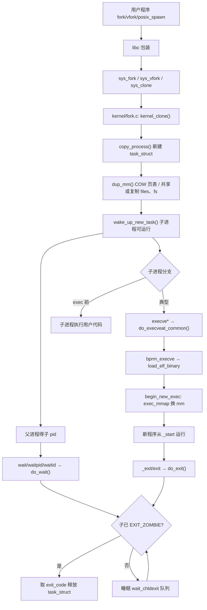
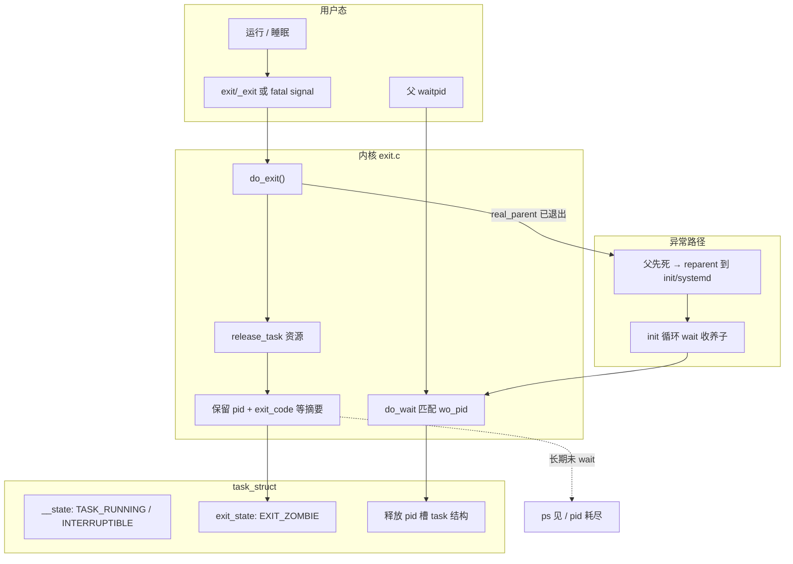

# Linux 进程控制完整篇：从 fork/exec/wait 到 clone 与僵尸进程排障

子进程泄漏、`defunct` 僵尸占满 pid、`exec` 后仍跑父进程代码、shell 脚本 `$?` 与真实退出码不一致——这些线上故障几乎都落在 **创建 → 换镜像 → 回收** 这条链路上，而不是业务逻辑本身。POSIX 进程控制三件套 `fork`/`exec`/`wait` 背后，内核统一走 `kernel_clone`、 `do_execveat_common`、`do_exit`/`do_wait`；用户态还有 `vfork`、`posix_spawn`、`pidfd` 等变体。本文把系统编程视角与内核锚点对齐，便于对照源码与 `/proc` 排障。源 chapter（013–018）为提纲；正文按 man page 与 upstream 内核重写。

掌握这条链的验收标准很简单：任意时刻 `ps` 里不应有与你服务相关的 `Z` 状态；任意子进程退出码都能被父进程或 init 正确解析；strace 上能看到成对的 `clone/execve` 与 `wait4`。

---

## 源码锚点

| 路径/符号 | 作用 |
|-----------|------|
| `kernel/fork.c` — `kernel_clone()`、`copy_process()` | fork/vfork/clone 统一入口；复制或共享 `task_struct`、mm、files、signal |
| `kernel/fork.c` — 历史 `_do_fork()` | v5.10 前内部包装，现已被 `kernel_clone()` 取代，读老资料时注意版本 |
| `include/linux/sched.h` — `struct task_struct` | pid、父指针、`mm`、`files`、`signal`、`exit_state` |
| `fs/exec.c` — `do_execveat_common()` | execve/execveat 核心：参数/env 拷贝、`bprm_execve`、换地址空间 |
| `fs/exec.c` — `begin_new_exec()` | `exec_mmap` 替换 `mm`、清 O_CLOEXEC fd、重置信号处理 |
| `fs/binfmt_elf.c` — `load_elf_binary()` | ELF 解析、映射 PT_LOAD、设置入口与 auxv |
| `kernel/exit.c` — `do_exit()` | 线程/进程退出、资源释放、进入 `EXIT_ZOMBIE` |
| `kernel/exit.c` — `do_wait()` / `kernel_waitid()` | 父进程回收子进程、取退出状态 |
| `man 2 fork` / `clone` / `execve` / `waitpid` / `waitid` | 用户态契约 |
| `man 2 pidfd_open` / `CLONE_PIDFD` | 5.3+ 用 fd 等待/发信号，避免 pid 复用竞态 |

最小 shell 式进程创建（理解用）：

```c
#include <unistd.h>
#include <sys/wait.h>
#include <stdio.h>
#include <stdlib.h>

int main(void)
{
	pid_t pid = fork();
	if (pid < 0) {
		perror("fork");
		return 1;
	}
	if (pid == 0) {
		/* 子进程：地址空间仍与父相同，直到 exec 或写时复制 */
		execl("/bin/ls", "ls", "-l", (char *)NULL);
		perror("execl");   /* 只有 exec 失败才会执行到这里 */
		_exit(127);
	}
	/* 父进程 */
	int status;
	if (waitpid(pid, &status, 0) < 0) {
		perror("waitpid");
		return 1;
	}
	if (WIFEXITED(status))
		printf("child exited %d\n", WEXITSTATUS(status));
	else if (WIFSIGNALED(status))
		printf("child killed by signal %d\n", WTERMSIG(status));
	return 0;
}
```

---

## 调用链

### fork → exec → wait 主链



### 进程状态、僵尸与回收



---

## 重点知识

### 1. fork / vfork / clone / posix_spawn 怎么选

| 接口 | 内核路径 | 特点 | 适用 |
|------|----------|------|------|
| `fork()` | `sys_fork` → `kernel_clone(SIGCHLD)` | 复制地址空间（COW）；父子的「谁先跑」由调度决定 | 通用；注意大地址空间进程 fork 成本 |
| `vfork()` | `CLONE_VFORK \| CLONE_VM` | 子与父共享 mm，子 exec/_exit 前父阻塞 | 历史优化；**子必须尽快 exec 或 _exit**，否则 UB |
| `clone()` | 可配 `CLONE_*` | 线程=`CLONE_VM\|CLONE_THREAD`；容器常用 namespace 标志 | pthread、容器运行时 |
| `posix_spawn()` | 通常 vfork/clone 实现 + 前置动作 | 文件动作、调度、信号掩码在 exec 前原子配置 | **推荐**替代手写 fork+exec 序列的服务/工具 |

现代 glibc 的 `fork()` 在多数架构走 `clone()` 包装，语义仍是「子进程独立地址空间 + 共享写时复制页」。不要在新代码里主动 `vfork()`，除非维护极老路径；新服务优先 `posix_spawn` 或语言运行时封装。

读内核时版本要对齐：`kernel_clone(struct kernel_clone_args *args)` 自 v5.10 起取代内部 `_do_fork()`，二者职责相同——校验 `clone_flags`、调 `copy_process()`、写 `parent_tid`/`child_tid`、处理 `CLONE_VFORK` 的 `vfork_done` 完成量，最后 `wake_up_new_task()`。`sys_fork` 等价 `kernel_clone(SIGCHLD, 0)`；`sys_vfork` 带 `CLONE_VFORK | CLONE_VM`；pthread 的 `clone` 则堆叠 `CLONE_VM | CLONE_THREAD | CLONE_SIGHAND` 等。用户态看到的 API 差异，最终都落在 **同一套 `copy_process` 分支** 上。

### 2. 写时复制（COW）与 fork 后该做什么

`copy_process()` → `dup_mm()` 并不立即复制全部物理页，而是复制页表项并把可写映射标为 **只读**；父或子**首次写入**该页时触发缺页，内核分配新物理页、更新 PTE，这就是 COW。只读段（代码、只读数据）可长期共享，因此「fork 后立即 exec 且父进程不再碰子进程会写的页」成本最低。

观测 COW 行为：

```bash
# 父进程 fork 后、子 exec 前，对比 PSS
grep -E '^(Pss|Rss|Shared)' /proc/self/smaps_rollup
# 子进程写入大数组后，父进程 RSS/PSS 可能同步抬升
```

工程约束：

- fork 后父进程若持有 **大堆/大块 mmap**，在子 `exec` 完成前，任一侧写入都会触发 COW，短时内存接近翻倍。
- **典型正确模式**：`fork` → 子进程 **只做** `dup2`/`fcntl`/`execve`（或 `posix_spawn` 的文件 action），不在子侧解析 JSON/拉配置。
- **多线程 + fork**：POSIX 规定子进程里只有调用 `fork` 的线程存活；若其他线程正持有 `malloc` 锁、pthread  mutex，子进程可能永久死锁。glibc 文档要求子进程路径仅调用 **async-signal-safe** 函数直到 `exec`。这也是容器运行时、语言 VM 更倾向 `posix_spawn`/`clone` 指定栈的原因之一。

### 3. execve 族：谁替换谁、什么会丢

| 函数 | 要点 |
|------|------|
| `execve(path, argv, envp)` | 系统调用本体；成功 **不返回** |
| `execv` / `execvp` / `execle` | libc 变体：是否搜 `PATH`、是否传 env |
| `execveat(dirfd, path, ...)` | 相对目录 fd 打开，利于 `O_CLOEXEC` 与 TOCTOU 防护 |

内核路径：`SYSCALL_DEFINE*execve*` → `do_execveat_common()` → `bprm_execve()` → `search_binary_handler()`（ELF 在 `fs/binfmt_elf.c`）→ `begin_new_exec()` → `load_elf_binary()`。`begin_new_exec()` 做几件对排障至关重要的事：

1. **`exec_mmap()`**：释放旧 `mm`，建立新地址空间——旧堆、栈、映射全部消失。
2. **`do_close_on_exec()`**：关闭带 `FD_CLOEXEC` 的描述符；未设 CLOEXEC 的 fd **会继承**到新程序（常见安全/端口占用 bug）。
3. **信号与凭证**：用户态 handler 清为默认/忽略策略；setuid 位在此刻生效（`install_exec_creds`）。
4. **`de_thread()`**：同线程组其他线程全部退出——**多线程程序不能指望 exec 后还有兄弟线程**。

脚本 `#!<interpreter>` 由内核读 shebang 后再 exec 解释器；`argv[0]` 仍是脚本路径，与直接 `execve` 二进制一致。

`posix_spawn` 把「fork 后、exec 前」的 fd 操作收敛到 libc，减少竞态：

```c
#include <spawn.h>
#include <sys/wait.h>

extern char **environ;

posix_spawn_file_actions_t actions;
posix_spawn_file_actions_init(&actions);
posix_spawn_file_actions_adddup2(&actions, logfd, STDOUT_FILENO);
posix_spawn_file_actions_addclose(&actions, listen_fd);

pid_t pid;
char *argv[] = { "worker", NULL };
posix_spawn(&pid, "/usr/bin/worker", &actions, NULL, argv, environ);
posix_spawn_file_actions_destroy(&actions);
waitpid(pid, &status, 0);
```

常见错误：子进程 `exec` 失败仍 `exit(0)`；父进程不检查 status；`execvp` 搜 `PATH` 时被 trojan 二进制劫持（生产应使用绝对路径 + `execve`）。

### 4. wait / waitpid / waitid 与退出码

```c
pid_t w = waitpid(pid, &status, WNOHANG);  /* 0=仍运行, >0=已回收, -1=错误 */
```

| 宏 | 含义 |
|----|------|
| `WIFEXITED(status)` | 正常 `_exit`/`exit` |
| `WEXITSTATUS(status)` | 低 8 位退出码（0–255） |
| `WIFSIGNALED(status)` | 未捕获信号杀死 |
| `WTERMSIG(status)` | 信号编号 |
| `WIFSTOPPED` / `WIFCONTINUED` | 作业控制 / 继续 |

**status 编码**（便于读 strace）：正常退出时 `(status & 0xff00) == 0`，退出码在 `(status >> 8) & 0xff`；信号终止时低 7 位为 0、中间位标识 core dump。因此 raw `status=65280` 实际是 `exit(255)`，直接打印会误导运维。

`wait()` 等价 `waitpid(-1, &status, 0)`，等待**任意**子进程；`waitpid(-1, ..., WNOHANG)` 常用于事件循环里收割僵尸。`waitpid(-pgid, ...)` 需配合进程组（shell 作业控制）。

`waitid(idtype, id, siginfo, options)` 走 `kernel/exit.c` 的 `kernel_waitid()` → `do_wait()`，可拿 `siginfo_t`（`si_pid`、`si_status`、`si_code`），`idtype` 取 `P_PID`/`P_PGID`/`P_ALL`；`options` 支持 `WEXITED`/`WSTOPPED`/`WCONTINUED`/`WNOHANG`/`WNOWAIT`（仅查状态不回收）。对需要区分 **同一父进程多个子进程** 且要避免误 wait 到无关子进程的场景，`waitpid(具体pid)` 或 `waitid(P_PID, ...)` 比裸 `wait()` 更安全。

Shell 的 `$?` 在子 **正常退出** 时等于 `WEXITSTATUS`；若子被信号杀死，bash 通常报告 128+信号号，与 C 侧 `WIFSIGNALED` 语义对应，**不是** raw wait status 整数。

内核侧：`do_exit()` 把 `task_struct->exit_code` 写入 zombie 摘要；父进程 `do_wait()` 在 `wait_chldexit` 队列睡眠，匹配 `wait_opts.wo_pid`；匹配成功后 `release_task()` 释放 zombie 槽位，**pid 才可被新进程复用**。这正是「先 wait 再假设 pid 仍指向原子进程」会出错的根因。

### 5. 僵尸、孤儿与 init 收养

- **僵尸（Zombie）**：子已 `do_exit`，进入 `EXIT_ZOMBIE`，父未 `wait`。`/proc/<pid>` 仍在，但地址空间已释放；`ps` 状态含 `Z`，命令名后常标 `<defunct>`。占 **pid 与 task 结构摘要**，不占子进程运行时内存。数量触顶 `kernel.pid_max` 或 `RLIMIT_NPROC` 时，`fork` 返回 `EAGAIN`。
- **孤儿（Orphan）**：父先退出，子被 reparent 到 **PID 1**（systemd/init）。init 循环 `wait` 收养子进程，因此 **孤儿不会变僵尸**（除非 init 本身异常——极少见）。若业务 daemon 自己 fork worker 却不 wait，僵尸堆在 **业务进程** 而非 init，表现为该服务 pid 下大量 `Z`。
- **SIGCHLD 被 SIG_IGN**：Linux 语义下等价于自动回收子进程（`SA_NOCLDWAIT` 效果），**不会**产生僵尸；但这是特例，不能替代显式 wait 设计。
- **双重丢失**：父既不在循环 wait，又错误假设「子退出会自动消失」→ 僵尸持续到父进程退出。

`do_exit()` 简要阶段（读 `kernel/exit.c` 时可对照）：退出码写入 `task_struct` → 释放 mm/files 等 → 若还有线程则走 `group_exit` → 置 `EXIT_ZOMBIE` → 向父发 `SIGCHLD`（若未忽略）→ 父 `wait` 后 `release_task()`。

排障命令：

```bash
# 列出僵尸及其父进程
ps -eo pid,ppid,stat,cmd | awk '$3 ~ /Z/ {print}'
# 父进程是否忽略 SIGCHLD（SigIgn 第17位）
cat /proc/<ppid>/status | grep -E '^(Name|Threads|SigIgn|SigCgt)'
# 系统级僵尸计数
grep zombie /proc/stat
# 谁占 pid
cat /proc/sys/kernel/pid_max
```

若父进程是 **无法修改的第三方**（闭源中间件），只能重启父进程或在其外层加监督者；根治必须在 **创建子进程的代码路径** 上补 wait。

### 6. 信号与退出

- 子进程 `_exit(n)` → `WIFEXITED` + `n`（仅低 8 位；`exit(256)` 等价 `exit(0)`）。
- 子进程收到未处理信号 → `WIFSIGNALED`；core dump 时另查 `WCOREDUMP`。
- 父进程可对子 `kill(pid, SIGTERM)`；子应安装 handler 或默认终止。**不要在 handler 里调非 async-signal-safe 函数**。
- `SIGCHLD`：子状态变化时内核可能向父发 SIGCHLD；`SA_RESTART` 与 `wait` 交互需注意 EINTR。生产更稳的是 **显式 waitpid 循环**，而非仅依赖 signal handler。
- 子进程在 handler 里调 `exit()` 可能重复 flush stdio；handler 内应 `_exit()`。父进程收到 SIGCHLD 后应用循环 `waitpid(-1, &st, WNOHANG)` 直到 `ECHILD`，一次 handler 可能对应多个子进程同时退出。

### 7. clone 常用标志与 pidfd

`clone()` / `clone3()` 通过 `flags` 决定共享范围（读 `kernel/fork.c` 中 `copy_process` 分支）：

| 标志 | 效果 |
|------|------|
| `CLONE_VM` | 共享 `mm` → **线程** |
| `CLONE_VFORK` | 共享 mm 且阻塞父，直到子 exec/exit |
| `CLONE_FILES` | 共享 fd 表 |
| `CLONE_FS` | 共享 root/cwd/umask |
| `CLONE_SIGHAND` | 共享信号处理 |
| `CLONE_THREAD` | 同线程组，共享 `getpid()` |
| `CLONE_PIDFD` | 创建时返回 pidfd（与 `CLONE_PARENT_SETTID` 互斥） |
| `CLONE_NEWPID` 等 | 命名空间，容器/runtime 使用 |

pthread 在 Linux 上即 `CLONE_VM | CLONE_FILES | CLONE_SIGHAND | CLONE_THREAD` 的 `clone` 包装；排障时用 `ps -eLf` 看 LWP，与「进程 fork」区分。

**pidfd**（Linux 5.3+）：`pidfd_open(pid, 0)` 或 `clone3`/`CLONE_PIDFD` 获得 fd；子退出时 fd 可读事件；`pidfd_send_signal` 向 **该 fd 绑定的 task** 发信号，避免「数字 pid 已被内核复用到别的程序」的误杀。`waitid(P_PIDFD, pidfd, ...)` 与 epoll 集成比轮询 `waitpid(WNOHANG)` 更干净。监督进程、CI runner、容器 shim 值得默认启用。

### 8. 常见坑

| 坑 | 现象 | 对策 |
|----|------|------|
| fork 后不 wait | 僵尸增多、pid 耗尽 | 每个子进程对应一次 wait；或 `SIG_IGN` + 理解仅适用于特定场景 |
| exec 失败未处理 | 子进程 duplicate 父进程逻辑，端口/锁双开 | exec 后路径 `_exit(127)`；父进程检查 wait status |
| vfork 后子进程改栈/return | 父进程内存损坏 | 禁用 vfork；用 fork 或 posix_spawn |
| 多线程 + fork | 子进程死锁或只留单线程 | 仅 async-signal-safe；或 fork 前 `pthread_atfork`；优先 spawn |
| 文件描述符泄漏进子进程 | 子继承监听 socket | fork 前 `fcntl(F_SETFD, FD_CLOEXEC)`；posix_spawn 文件 action |
| 把 `status` 当退出码打印 | 日志出现 65280 等 | 用 `WEXITSTATUS` |
| 父忽略 SIGCHLD 且不 wait | 僵尸直到父退出 | 要么 wait，要么明确文档化并限制子进程数量 |
| shell 管道未 wait 后台 | 僵尸堆在 shell 脚本 | `wait` 或 `$!` 后 wait |
| 进程数上限 | fork/exec 突然 EAGAIN | 查 `ulimit -u`、`/proc/sys/kernel/pid_max`；exec 路径还受 `RLIMIT_NPROC` 与 `PF_NPROC_EXCEEDED` 影响 |

`do_execveat_common()` 开头会检查 `RLIMIT_NPROC`：setuid 程序若在 `setuid()` 时触顶，真正失败点可能在 **第一次 execve** 才暴露（历史兼容行为）。容器里 `pids.max` cgroup 与 `RLIMIT_NPROC` 叠加，更容易在批量 spawn worker 时撞墙——应在架构层限制并发子进程数，而不是无限 fork。

验证片段：

```bash
# 跟踪创建/替换/回收全链
strace -f -e trace=clone,execve,wait4,exit_group ./your_daemon 2>&1 | tee /tmp/proc.trace
# 僵尸来源树
pstree -p <ppid>
grep -i zombie /proc/stat
# 对比 vfork 路径（老程序）
strace -e trace=vfork,execve legacy_builder 2>&1 | head
# 限制用户进程数，压测僵尸泄漏
ulimit -u 64; ./test_fork_storm
```

**EINTR 与重启**：慢系统调用被信号打断时 `waitpid` 返回 `-1/EINTR`，正确写法是循环重试，或使用 `sigaction` 不设 `SA_RESTART` 时在 handler 里设标志位再 wait。

---


---

*合并自：Linux系统编程/chapters/013–018-进程控制*（2026-09-07）
