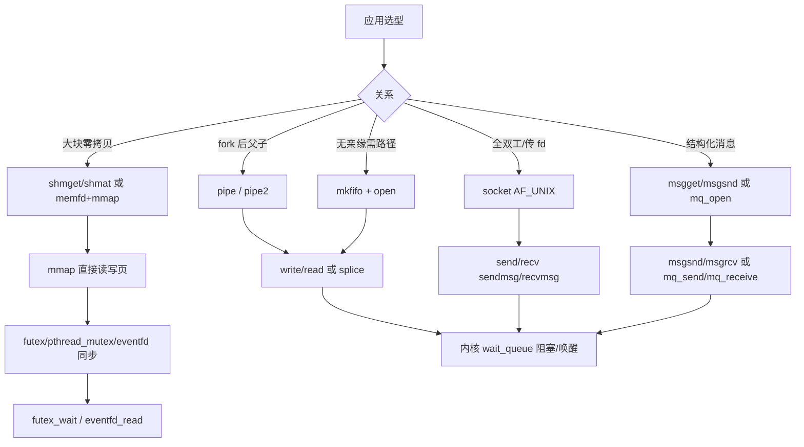
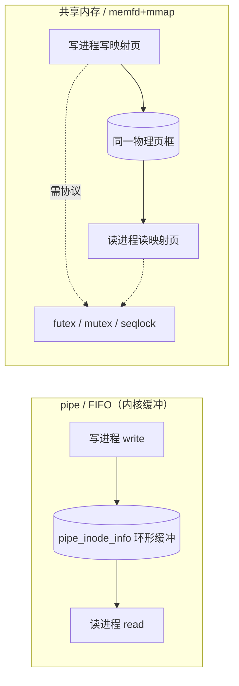

# Linux 进程间通信完整篇：pipe、fifo、Unix socket、共享内存与选型

父子进程 `pipe` 写满后双方死锁、共享内存「看得见却改不对」、FIFO 路径权限正确却 `EPIPE`、Unix socket 传 fd 后对端 `EBADF`——IPC 故障多半不是业务逻辑错，而是 **机制语义、同步协议与 fd 生命周期** 没对齐。

Linux 把进程间交换按「拷贝成本 × 同步复杂度 × 是否传 fd」分层：字节流（pipe/FIFO）、消息（队列）、共享页（shm/memfd+mmap）、全双工本地 socket，以及 futex/eventfd 等同步/通知底座。本文从用户态 API → 内核锚点 → 调用链 → 选型表 → 排障 Checklist 闭环。源 chapter（037–042）为提纲；正文按 `fs/pipe.c`、`net/unix/af_unix.c`、`ipc/shm.c` 等真实符号重写。

---

## 源码锚点

| 路径 | 作用 |
|------|------|
| `fs/pipe.c` | 匿名 pipe、`pipe_inode_info` 环形缓冲、`pipe_read`/`pipe_write` |
| `fs/pipe.c` + VFS | FIFO（`mkfifo`）复用 pipe 实现，走路径权限 |
| `net/unix/af_unix.c` | `AF_UNIX`/`AF_LOCAL` socket、`unix_stream_sendmsg`、SCM_RIGHTS 传 fd |
| `ipc/shm.c` | System V 共享内存 `do_shmget`/`do_shmat`/`shmctl` |
| `ipc/msg.c` | System V 消息队列 `do_msgsnd`/`do_msgrcv` |
| `ipc/mqueue.c` | POSIX 消息队列（挂载 `mqueue` 文件系统） |
| `fs/memfd.c` | `memfd_create` + `mmap(MAP_SHARED)` 现代 POSIX shm 路径 |
| `fs/eventfd.c` | `eventfd` 计数器，常与 `epoll` 搭配作跨线程/进程通知 |
| `kernel/futex/` 或 `kernel/futex.c` | `futex_wait`/`futex_wake`，pthread 锁/条件变量慢路径 |
| `include/uapi/linux/un.h` | `SCM_RIGHTS`、`struct ucred` 等 Unix socket 辅助结构 |

匿名 pipe 最小示例：

```c
#include <unistd.h>
#include <string.h>
#include <stdio.h>

int fds[2];
pipe(fds);                    /* fds[0] 读端, fds[1] 写端 */
/* fork 后：子 close(fds[1]); 父 close(fds[0]); */
write(fds[1], "hi", 2);
char buf[8];
read(fds[0], buf, sizeof(buf));
```

生产建议 `pipe2(fds, O_CLOEXEC)`，避免子进程 `exec` 第三方程序时泄漏 pipe fd。非阻塞 pipe 配合 `poll`：监听读端 `POLLIN`、写端 `POLLOUT`，边缘触发时注意 `EAGAIN` 后重新 arm。

Unix domain socket + 传 fd（`SCM_RIGHTS`，内核 `unix_attach_fds`）：

```c
#include <sys/socket.h>
#include <unistd.h>

void send_fd(int sock, int fd_to_send) {
	struct msghdr msg = {0};
	char buf[CMSG_SPACE(sizeof(int))];
	struct iovec iov = { .iov_base = "!", .iov_len = 1 };
	msg.msg_iov = &iov;
	msg.msg_iovlen = 1;
	msg.msg_control = buf;
	msg.msg_controllen = sizeof(buf);
	struct cmsghdr *c = CMSG_FIRSTHDR(&msg);
	c->cmsg_level = SOL_SOCKET;
	c->cmsg_type = SCM_RIGHTS;
	c->cmsg_len = CMSG_LEN(sizeof(int));
	*(int *)CMSG_DATA(c) = fd_to_send;
	sendmsg(sock, &msg, 0);
	/* 发送后是否 close(fd_to_send) 取决于所有权约定 */
}

int recv_fd(int sock) {
	struct msghdr msg = {0};
	char cbuf[CMSG_SPACE(sizeof(int))];
	char byte;
	struct iovec iov = { .iov_base = &byte, .iov_len = 1 };
	msg.msg_iov = &iov;
	msg.msg_iovlen = 1;
	msg.msg_control = cbuf;
	msg.msg_controllen = sizeof(cbuf);
	recvmsg(sock, &msg, 0);
	struct cmsghdr *c = CMSG_FIRSTHDR(&msg);
	if (c && c->cmsg_type == SCM_RIGHTS)
		return *(int *)CMSG_DATA(c);
	return -1;
}
```

对端收到的是 **新 fd 编号**，指向同一 `struct file`（引用计数 +1）；必须在 `recvmsg` 成功后再 `mmap`/`read`，且发送方若 `close` 过早需按协议确认对端已接收。传 fd 时至少发送 1 字节数据（如上例 `!`），部分内核实现对零长度 iov + SCM_RIGHTS 行为严格。

POSIX 共享内存（推荐新代码）：

```c
#include <sys/mman.h>
#include <sys/syscall.h>
#include <unistd.h>
#include <fcntl.h>

int fd = memfd_create("buf", MFD_CLOEXEC);
ftruncate(fd, 4096);
void *p = mmap(NULL, 4096, PROT_READ | PROT_WRITE,
	       MAP_SHARED, fd, 0);
/* 另一进程：通过 fd 传递（Unix SCM_RIGHTS）或 /proc/<pid>/fd/<n> 继承后 mmap */
```

内核 pipe 核心结构（读码入口）：

```c
/* fs/pipe.c — 简化 */
struct pipe_inode_info {
	unsigned int head, tail, max_usage;
	unsigned int ring_size;
	struct pipe_buffer *bufs;
	/* readers/writers 等待队列 ... */
};
/* pipe_read / pipe_write 在环形缓冲与 wait_queue 间搬运 */
```

---

## 调用链

### 创建 → 读写：按机制分支



### 数据流：pipe 拷贝 vs 共享内存



**语义差异**：pipe 每次 `write`/`read` 经内核拷贝到环形缓冲，容量默认约 64KiB（`pipe-max-size` 可调）；shm 映射后用户态直接触页，无 per-byte 拷贝，但 **多写者必须自带同步**，否则数据竞争。`vmsplice`/`splice` 可把用户页钉住送入 pipe，与文件 I/O 零拷贝章节衔接，适合高性能代理在 pipe 与 socket 间搬运，仍不替代 shm 的随机写共享。

---

## 重点知识

### 1. 匿名管道（pipe）

| 项 | 说明 |
|----|------|
| API | `pipe()`、`pipe2(O_CLOEXEC\|O_NONBLOCK)` |
| 方向 | 单向；全双工需两根 pipe 或改用 socket |
| 生命周期 | 随 fd 引用计数；两端都 close 后内核释放缓冲 |
| 阻塞 | 空读阻塞、满写阻塞；`O_NONBLOCK` → `EAGAIN` |
| 信号 | 读端全关闭后写 → `SIGPIPE`/`EPIPE` |
| 容量 | 默认 64KiB；`fcntl(F_GETPIPE_SZ/F_SETPIPE_SZ)` 可调 |

`pipe2` 一次传入 `O_CLOEXEC|O_NONBLOCK` 比 `pipe` 后再 `fcntl` 少一次竞态窗口（多线程 `fork` 场景）。Shell 管道不设 `O_NONBLOCK`，故阻塞行为是默认预期。

典型：`fork` 前 `pipe`，父关读端、子关写端，配合 `waitpid` 收 stdout。Shell 管道 `cmd1 | cmd2` 即此模型。

pipe 容量默认约 **64KiB**（`pipe-max-size`，可 `fcntl F_SETPIPE_SZ` 调大至上限）。写满后写端阻塞（或非阻塞 `EAGAIN`）；设计协议时要么非阻塞+`poll`，要么独立线程 drain，避免父子双方因缓冲满死锁。`splice` 可把 pipe 一端零拷贝接到 socket，适合代理转发。

### 2. 命名管道（FIFO）

```bash
mkfifo /tmp/myfifo
# 终端 A: cat /tmp/myfifo
# 终端 B: echo hello > /tmp/myfifo
```

-  inode 类型为 FIFO，读写走 `fs/pipe.c` 同一套逻辑。
- **必须两端都 open 才 unblock**：只 open 写端且无读端会阻塞（`O_NONBLOCK` 例外）。
- 权限与路径走 VFS：`chmod`/`umask`、容器内路径可见性。
- 无 seek；半关闭行为同 pipe。

**半关闭语义**：读端全部 `close` 后，写端收到 `SIGPIPE`（默认终止进程）；写端全关后，读端 `read` 返回 0（EOF）。`shutdown`-式半关对 FIFO 用关闭对应 fd 模拟；Unix stream socket 可用 `shutdown(SHUT_WR)` 更精确。

### 3. 消息队列

**System V vs POSIX 对比**（内核 `ipc/msg.c` vs `ipc/mqueue.c`）：

| 维度 | System V 消息队列 | POSIX 消息队列 |
|------|-------------------|----------------|
| API | `msgget`/`msgsnd`/`msgrcv`/`msgctl` | `mq_open`/`mq_send`/`mq_receive`/`mq_close` |
| 命名 | 整数 id + `key_t`（`ftok`/`IPC_PRIVATE`） | 字符串名，挂载在 `mqueue` FS（常 `/dev/mqueue`） |
| 消息类型 | `long mtype` 必选，按类型/范围取 | 无 mtype；可选 `priority`（`mq_send` 第 4 参数） |
| 持久化 | 内核驻留至 `msgctl(IPC_RMID)` | 文件系统 inode，无进程用时仍可存在 |
| 通知 | 无内置；需自旋或 side channel | `mq_notify` 可绑 signal 或线程回调 |
| 观测 | `ipcs -q`、`/proc/sysvipc/msg` | `ls /dev/mqueue`、`/proc/sys/fs/mqueue/*` |
| 限额 | `/proc/sys/kernel/msgmni` 等 | `queues_max`、`msgsize_max`、`msg_max` |
| 新代码 | 遗留系统多 | 推荐（语义清晰、可 notify） |

**System V**（`ipc/msg.c`）：

```c
int id = msgget(IPC_PRIVATE, IPC_CREAT | 0666);
struct { long mtype; char mtext[64]; } msg = { .mtype = 1 };
msgsnd(id, &msg, sizeof msg.mtext, 0);
msgrcv(id, &msg, sizeof msg.mtext, 1, 0);
```

- 按 `mtype` 优先级取消息；内核持久化直到 `msgctl(IPC_RMID)`。
- 观测：`ipcs -q`；泄漏是生产常见问题。

**POSIX**（`ipc/mqueue.c`，挂载点常 `/dev/mqueue`）：

```c
mqd_t mq = mq_open("/myq", O_CREAT | O_RDWR, 0644, NULL);
mq_send(mq, "hi", 2, 0);
```

- 名字以 `/` 开头；有通知（`mq_notify`）可与信号/event 集成。
- 限额：`/proc/sys/fs/mqueue/*`（`queues_max`、`msgsize_max` 等）。

选型：需要 **带类型/优先级的离散消息** 且不想自研协议时用队列；高吞吐大块数据仍优先 shm。SysV `msgrcv` 可按 `mtype` 选择性接收；POSIX `mq_receive` 按 priority 出队。两者都不适合 MB 级 blob——应放 shm 并在 mq 里只传 **偏移/长度/版本号**。

### 4. 共享内存 + 同步

| 方式 | 创建 | 附着 | 备注 |
|------|------|------|------|
| SysV | `shmget` | `shmat`/`shmdt` | `ipcs -m`/`ipcrm`；key 用 `ftok` |
| POSIX | `shm_open` | `mmap` | 对象在 `/dev/shm` |
| 现代 | `memfd_create` | `mmap(MAP_SHARED)` | 无全局名字，靠 fd 传递 |

`shmdt`/`munmap` 只解除本进程映射，不销毁段；SysV 需 `shmctl(IPC_RMID)` 且 attach 计数归零才真正删除。POSIX `shm_unlink` 类似 unlink 名字；memfd 在最后一个 fd `close` 后内核回收页框。

```bash
# SysV 泄漏排查
ipcs -m
ipcrm -m <shmid>
ls -la /dev/shm/
```

**同步不能省**——共享内存 + futex 最小伪代码（用户态协议，非 pthread 封装）：

```c
/* shm 内布局 */
struct shared {
	atomic_uint seq;      /* 奇数=写中，偶数=可读 */
	char payload[4096];
};

/* 写者 */
void publish(struct shared *s, const void *data, size_t n) {
	unsigned seq = atomic_load(&s->seq);
	atomic_store(&s->seq, seq + 1);           /* 变奇：读者应等待 */
	memcpy(s->payload, data, n);
	atomic_store(&s->seq, seq + 2);           /* 变偶：发布完成 */
	syscall(SYS_futex, &s->seq, FUTEX_WAKE, INT_MAX, NULL, NULL, 0);
}

/* 读者 */
void consume(struct shared *s) {
	for (;;) {
		unsigned seq = atomic_load(&s->seq);
		if (seq & 1) {
			syscall(SYS_futex, &s->seq, FUTEX_WAIT, seq, NULL, NULL, 0);
			continue;
		}
		/* 读 s->payload，seq 为偶且稳定 */
		break;
	}
}
```

生产环境更常用 `pthread_mutexattr_setpshared(..., PTHREAD_PROCESS_SHARED)` 或 C11 `atomic` + 文档化 seqlock；上面展示 futex 与 shm 的分工：**数据在页里，睡眠/唤醒走内核 wait_queue**。

**eventfd / signalfd 作通知通道**（`fs/eventfd.c`、`fs/signalfd.c`）：

| 机制 | 语义 | 典型用法 |
|------|------|----------|
| `eventfd(0, EFD_CLOEXEC\|EFD_NONBLOCK)` | 64 位计数器；`write(8)` 增、`read` 减 | 线程池完成通知、与 `epoll` 同 fd 集 |
| `EFD_SEMAPHORE` | 每次 `read` 仅消费 1 | 替代 pipe 传「事件个数」 |
| `signalfd(-1, &mask, SFD_CLOEXEC\|SFD_NONBLOCK)` | 把信号变成可读 fd | 替代 `sigwait`；与 `epoll` 统一事件循环 |

```c
int efd = eventfd(0, EFD_CLOEXEC | EFD_NONBLOCK);
/* 工作线程完成：write(efd, &(uint64_t){1}, 8); */
/* 主线程：epoll_wait 含 efd，read 后处理任务 */
int sfd = signalfd(-1, &blocked_set, SFD_CLOEXEC);
/* epoll 同时监听 socket、efd、sfd，避免 signal handler 里写非 async-signal-safe API */
```

大数据仍走 shm/pipe/socket；eventfd/signalfd 只传 **「有事发生」**，不传 payload。signalfd 读出的 `struct signalfd_siginfo` 含 `ssi_pid`/`ssi_signo`，可区分 SIGCHLD 与 SIGUSR1；eventfd 计数大于 1 表示积压多次通知，消费端应循环 `read` 直到 `EAGAIN` 或处理完对应任务数。

### 5. Unix domain socket

```c
struct sockaddr_un addr = { .sun_family = AF_UNIX };
strncpy(addr.sun_path, "/tmp/s.sock", sizeof(addr.sun_path)-1);
bind(listen_fd, (struct sockaddr *)&addr, sizeof addr);
listen(listen_fd, 5);
```

| 能力 | 说明 |
|------|------|
| 全双工 | `SOCK_STREAM` 双向字节流 |
| 数据报 | `SOCK_DGRAM` 保留消息边界 |
| 传 fd | `sendmsg` + `SCM_RIGHTS`（`af_unix.c` 内 `unix_attach_fds`） |
| 凭据 | `SOCK_PASSCRED` / `SCM_CREDENTIALS` 传递 pid/uid |
| 抽象命名 | `\0` 开头 + 字节名，无文件系统路径，避免 stale socket 文件 |

`socketpair(AF_UNIX, SOCK_STREAM, 0, sv)` 一次创建全双工对，无需文件系统路径，适合 **fork 前** 建立父子控制通道再传 `SCM_RIGHTS`。`SOCK_DGRAM` 保留消息边界但 **传 fd 仍常用 stream**。对端 `recvmsg` 必须检查 `cmsg_len` 与 `SCM_RIGHTS` 类型，防伪造 cmsg。

本地 RPC、systemd/journal、Docker/containerd 控制面大量用 `AF_UNIX`。需要 **传 fd + 双向控制** 时优先于 pipe。

### 6. 容器与 namespace 下的 IPC 可见性

Linux IPC 是否「看得见」取决于 **ipc/mount/pid/network namespace** 隔离：

| 机制 | 跨容器典型情况 |
|------|----------------|
| 匿名 pipe | 仅同一 pid ns 内 fork 父子 |
| FIFO 路径 | 需共享 mount ns 或 bind mount 同一路径；不同容器 `/tmp/a.fifo` 不是同一 inode |
| SysV shm/msg | 默认 **ipc ns 隔离**；宿主机 `ipcs` 看不到容器内 id，除非 `--ipc=host` |
| POSIX mq | 依赖挂载 `mqueue`；未挂载 `/dev/mqueue` 时 `mq_open` 失败 |
| Unix socket 文件 | 路径在 bind mount 可见区才可连；抽象命名 `\0xxx` 在同一 **network ns** 内有效 |
| memfd fd | 只能经 **SCM_RIGHTS** 或继承传给同 pid ns / 有意共享 fd 的进程 |

坑：K8s Pod 两容器默认 **共享 ipc ns**（可 shm），但 **不共享 mount ns** 时 FIFO 路径要对齐 volume；`docker run --ipc private` 导致 SysV `ftok` 与宿主机 key 冲突但 id 空间独立。排障先 `lsns -p <pid>` 看 NS 类型，再决定用路径 IPC 还是 fd 传递。

**具体踩坑**：Sidecar 与主容器共享 `emptyDir` 时 FIFO 必须建在该 volume 内；仅 `/tmp` 各自独立则永远连不上。`ftok("/proc/self/exe", 1)` 在容器重启后 inode 变，旧 shm key 失效。`memfd_create` + `SCM_RIGHTS` 不依赖全局 key，是跨容器传大块的首选控制面。Network ns 隔离时 **抽象 Unix socket** 仍可用（不走文件路径），但 cred 传递需同一 UDS 可见性。

### 7. IPC 选型表

| 场景 | 推荐 | 避免 |
|------|------|------|
| shell 风格单向流水线 | pipe / FIFO | shm 大材小用 |
| 父子短消息 | pipe | 命名 FIFO 增复杂度 |
| 无亲缘两进程 + 路径可接受 | FIFO 或 Unix socket | 匿名 pipe |
| 本地服务 RPC / 传 fd | `AF_UNIX` stream | FIFO 不能传 fd |
| MB 级高频共享 | memfd/mmap 或 POSIX shm | pipe 多次拷贝 |
| 离散 typed 消息 | SysV/POSIX mq | 在 shm 上自造无边界协议 |
| 多线程/进程 epoll 驱动 | Unix socket + eventfd 通知 | 轮询 shm 标志位 |
| 跨主机 | 不用上述本地 IPC | 换 TCP/QUIC 等 |
| 信号驱动主循环 | signalfd + epoll | signal handler 里调 malloc/printf |
| 线程池任务完成 | eventfd 计数 | pipe 传 8 字节开销更大 |

性能粗感（同机、实现相关）：**共享内存 > Unix socket ≈ pipe > 消息队列（多一次结构化拷贝）**。Unix socket 本地连接可 **SCM_CREDENTIALS** 校验 peer pid/uid，比 FIFO 路径权限更不易 spoof（仍信内核）。高 QPS 小消息：batch 后写 shm 再 `eventfd_write(1)` 通知，避免每条消息一次 `msgsnd` 系统调用。

### 8. 排障

| 现象 | 常见根因 | 命令/动作 |
|------|----------|-----------|
| 双方阻塞 | FIFO 只 open 一端；pipe 读写端配错 | `strace -f -e open,read,write` |
| `EPIPE` / SIGPIPE | 对端 fd 已关仍 write | 用 `signal(SIGPIPE, SIG_IGN)` 或检查 close 顺序 |
| `EAGAIN` | 非阻塞 + 空/满 | 改阻塞或 `poll` 边缘触发 |
| shm 数据乱 | 无锁多写 | 加 pshared mutex 或 seqlock |
| mq `EMFILE` | 队列数到上限 | `cat /proc/sys/fs/mqueue/queues_max` |
| Unix `EADDRINUSE` | stale `.sock` 文件 | 删文件或抽象命名空间 |
| 传 fd 后对端 EBADF | fd 未 `SCM_RIGHTS` 或已 close | 跟 `sendmsg` cmsg 长度 |
| SysV 资源泄漏 | 未 `ipcrm` | `ipcs -a` 定期巡检 |
| eventfd `EAGAIN` | 非阻塞且计数为 0 仍 read | epoll 可读再 read |
| signalfd 读不到 | mask 未包含该信号 | 检查 `sigprocmask` 与 sfd 创建时 mask |
| 容器 mq 不存在 | 未 mount mqueue | 宿主 `/dev/mqueue` 或 K8s volume |

```bash
# 最小观测套件
strace -f -e trace=pipe,pipe2,socket,connect,sendmsg,recvmsg,mmap,shmget,msgsnd ./app
ls -l /proc/<pid>/fd/
ss -x -a                    # Unix socket
ipcs -a
```

**排障命令完整示例**（按现象复制执行）：

```bash
# 1) 双方阻塞：看谁卡在 open/read
strace -f -tt -e trace=open,openat,read,write -p $(pgrep -n myapp) 2>&1 | tail -20

# 2) FIFO 只开写端：另一终端先 open 读端
mkfifo /tmp/test.fifo
# 终端 A: strace openat /tmp/test.fifo O_RDONLY
# 终端 B: strace openat /tmp/test.fifo O_WRONLY

# 3) SysV 泄漏
ipcs -q -m -s
ipcrm -m <shmid>   # 确认无进程 attach 后再删

# 4) POSIX mq 限额
cat /proc/sys/fs/mqueue/queues_max
ls -la /dev/mqueue/
mq_open 失败时 dmesg | tail

# 5) Unix socket 与传 fd
ss -xlp | grep mysock
strace -e sendmsg,recvmsg -s 200 ./client   # 看 cmsg_type=SCM_RIGHTS

# 6) 容器内 namespace
lsns -p 1
ls -la /proc/1/ns/ipc /proc/1/ns/mnt

# 7) 共享内存数据竞争：配合 perf 或 tsan 难，先用 strace 排除 EAGAIN/EPIPE
# 8) eventfd 积压：read 直到 EAGAIN，计数与任务队列一致
gdb -p <pid> -batch -ex 'call (void)write(2,"mark\n",5)'
```

读内核时跟 **成功路径一条线**：如 `write` → `vfs_write` → `pipe_write` → 拷贝进 `pipe_buffer` → 唤醒读者；对比 `-EAGAIN`、`-EPIPE` 分支。Unix 传 fd 跟 `unix_sendmsg` → `unix_attach_fds` 对照即可。

### 9. 与 mmap 的边界

跨进程大块共享常组合 **memfd/shm + mmap(MAP_SHARED)**（详见 mmap 专题）。IPC 管「谁和谁连、怎么通知」；mmap 管「页怎么映射」。memfd 优势：无全局 key、fd 可经 Unix socket 传递、生命周期跟 fd 引用计数。

**与信号、定时器的组合**：`timerfd_create` 提供到期计数（也可 epoll）；与 eventfd、signalfd 一样属于「fd 化事件」。设计事件循环时统一：`epoll_wait` 监听 socket + eventfd（工作完成）+ signalfd（SIGCHLD 收尸）+ timerfd（心跳），避免多线程抢 `waitpid` 与主循环竞态。子进程退出优先 signalfd 消费，不要在 handler 里调 `malloc`。

---

## Checklist

- [ ] 按「单向/双向、是否传 fd、数据量、是否离散消息」完成选型，而不是默认 socket
- [ ] pipe/FIFO：确认读写端 close 顺序；处理 `SIGPIPE` 或 `MSG_NOSIGNAL`；知 pipe 容量与 `F_SETPIPE_SZ`
- [ ] FIFO：两端 open 策略明确；路径权限与容器 mount 可见
- [ ] 通知用 eventfd/signalfd 进 epoll，payload 走 shm/socket/pipe
- [ ] 传 fd：`sendmsg`/`recvmsg` + `SCM_RIGHTS` 完整 cmsg；约定发送方何时 close
- [ ] SysV vs POSIX mq：按上表选 API；POSIX 查 `/dev/mqueue` 与 `mqueue/*` sysctl
- [ ] 共享内存：futex/pshared mutex 或 seqlock；禁止无锁多写
- [ ] 容器：确认 ipc/mount ns；FIFO 路径与 volume 一致；`--ipc host` 仅必要时
- [ ] 排障：`strace -f`、`ipcs -a`、`ss -xlp`、`lsns -p` 组合复现
- [ ] 压测对比 pipe 拷贝 vs shm+mmap，用数据证明选型而非习惯
- [ ] 主循环 fd 化：socket + eventfd + signalfd + timerfd 统一 epoll
- [ ] 容器 IPC：Sidecar 与主进程 volume 路径一致；SysV key 重启失效改 memfd
- [ ] Unix socket：抽象命名或删 stale `.sock`；`EADDRINUSE` 先 `ss -xlp` 再 unlink

---

*合并自：Linux系统编程/chapters/037–042-进程间通信*（2026-09-07）
