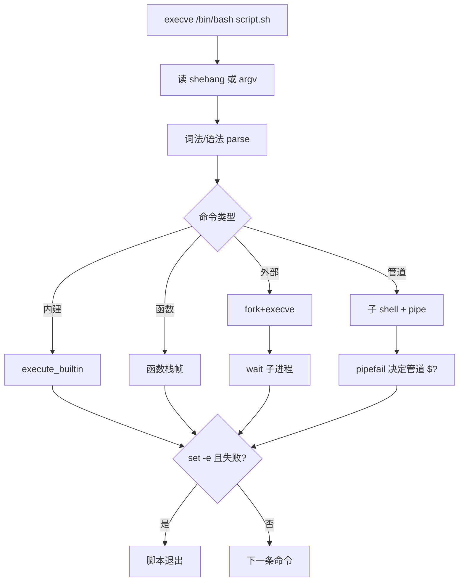

# Linux Shell 脚本完整篇：从 bash 语法、管道到 set -euo 与排障

脚本「本地能跑、CI 偶发失败」、管道里 `$?` 永远是 0、`set -e` 却漏掉函数里的错误——根因多在 **未引用变量、管道子 shell、glob 空匹配、bash/sh 差异** 与 **缺少 `pipefail`**。本文按 bash 真实行为、`/bin/bash` 与 `man bash` 路径展开，可直接在本机对照验证。

## 源码锚点

| 路径 / 手册 | 作用 |
|-------------|------|
| `man bash` / `man 1 bash` | bash 语言、内建、扩展 |
| `man dash` / `man sh` | POSIX sh 子集 |
| `man 1 shellcheck` | 静态检查规则 |
| `/bin/bash` | 多数 Linux 默认交互 shell |
| `/bin/sh` | Debian/Ubuntu 常链 dash；RHEL 可能链 bash |
| `/usr/bin/env bash` | shebang 可移植写法 |
| `bash --version` | 版本与 patch 级别 |
| `readlink -f /bin/sh` | 确认 sh 实际解释器 |
| GNU bash 源码 `bash-5.x/execute_cmd.c` | 命令执行、管道、子 shell |
| `bash-5.x/subst.c` | 变量展开、引号、here-doc |
| `bash-5.x/trap.c` | trap 信号处理 |
| `bash-5.x/options.c` | set -e/-u/-o pipefail |
| `/proc/$$/fd/` | 重定向 fd 观测 |
| `/proc/$$/cmdline` | 实际 argv |

```bash
#!/usr/bin/env bash
set -euo pipefail
IFS=$'\n\t'
log() { printf '[%s] %s\n' "$(date -Is)" "$*" >&2; }
main(){ local d=${1:-.}; log scan "$d"; find "$d" -maxdepth 1 -name '*.sh' -print0 | xargs -0 -r shellcheck -x; }
main "$@"
```

```bash
bash --version; readlink -f /bin/sh; shellcheck --version
```

## 调用链

### 脚本启动 → 命令执行



### 变量展开 → 单词分割 → glob

```mermaid
flowchart LR
    V[$var / ${var}] --> Q{引号}
    Q -->|双引号| DS[展开 保留空格一词]
    Q -->|无引号| WS[IFS 分割]
    Q -->|单引号| LT[字面量]
    WS --> GL[glob * ? []]
    DS --> CMD[argv]
    GL --> CMD
    CS[$(cmd)] --> SUB[子 shell stdout]
    SUB --> Q
    PS["<(cmd)"] --> FD[/dev/fd/N]
    FD --> CMD
```

## 重点知识

### bash 与 sh 的差异

POSIX `sh` 是语言子集；GNU `bash` 含数组、`[[ ]]`、进程替换、`{1..10}` 等。Debian/Ubuntu 的 `/bin/sh` → `dash`；RHEL 可能 → `bash --posix`。

CI 与生产 shebang 不一致是线上经典坑：`#!/bin/sh` 脚本用了 bash 数组会直接 syntax error。

| 特性 | bash | dash/sh |
|------|------|---------|
| 数组 | 支持 |
| [[ ]] | 支持 |
| <(cmd) | 支持 |
| {a..z} | 支持 |

```bash
readlink -f /bin/sh
ls -l /bin/sh
checkbashisms -f deploy.sh 2>/dev/null || true
shellcheck -s sh deploy.sh
```

### 变量、数组与引用

赋值 **无空格**：`name=value`。未引用变量会 undergo 单词分割与 pathname expansion。

参数展开：`${var:-def}` 未设或空取默认；`${var:?msg}` 未设则报错；`${var#pat}` 去前缀。

```bash
arr=(one 'two three' four)
echo "${arr[@]}"    # 各元素一词
echo "${#arr[@]}"   # 个数
declare -A m=([k]=v)
echo "${m[k]}"
readonly VER=1.0
export PATH="/usr/local/bin:$PATH"
```

### 管道与重定向

fd：0 stdin、1 stdout、2 stderr。`2>&1` 把 stderr 并入 stdout；`&>` 同时重定向（bash）。

管道左侧 stdout 接右侧 stdin；stderr 默认仍到终端，需 `2>&1 |` 才能过滤错误。

```bash
cmd >file 2>&1
cmd | tee out.log
exec 3>audit.log; echo ok >&3; exec 3>&-
find /var -name '*.log' -print0 | xargs -0 -r gzip
```

### 函数与作用域

`local` 仅函数内有效；无 `local` 则修改全局。`return N` 只退出函数，不退出脚本。

子 shell `( )` 内变量不影响父 shell；进程替换 `<( )` 在当前 shell 可见 fd。

```bash
die(){ echo "ERR: $*" >&2; exit 1; }
fetch(){ local u=$1; curl -fsSL "$u" || die "curl $u"; }
outer=1; ( outer=2 ); echo "outer=$outer"  # 1
```

### 条件判断与循环

`[[ ]]` 是 bash 关键字，支持 `&&`、`||`、`=~` 正则；`[ ]` 是外部命令 test。

`(( ))` 算术上下文；`for`/`while`/`until` 循环；`read -r` 保留反斜杠。

```bash
for f in /etc/*.conf; do [[ -f "$f" ]] && echo "$f"; done
while IFS= read -r line; do [[ $line =~ ^# ]] && continue; echo "$line"; done < cfg
i=0; while ((i<3)); do echo $i; ((++i)); done
```

### getopts 与参数解析

`getopts optstring var` 解析 `-a -b val`；optstring 里字母后跟 `:` 表示该选项需要参数。

解析完用 `shift $((OPTIND-1))` 处理剩余位置参数；长选项 `--verbose` 需手写或用 GNU getopt。

```bash
usage(){ echo "Usage: $0 [-vf:h]" >&2; exit 1; }
v=0; f=
while getopts ':vf:h' opt; do
  case $opt in v) v=1;; f) f=$OPTARG;; h) usage;;
    :) echo "- $OPTARG needs arg" >&2; usage;;
    \?) echo "bad -$OPTARG" >&2; usage;;
  esac
done
shift $((OPTIND-1))
```

### trap 与信号

`trap 'cmd' SIGNAL`；`EXIT` 伪信号在 shell 退出时执行，适合做清理。

trap 里 `exit` 会再次触发 EXIT trap，避免无限递归；保存 `$?` 再清理后 `exit $ec`。

```bash
tmp=$(mktemp); trap 'rm -f "$tmp"' EXIT
trap 'echo INT; exit 130' INT
cleanup(){ ec=$?; rm -f "$tmp"; exit $ec; }
```

### set -euo pipefail

生产脚本头部三件套：`set -euo pipefail` 与 `IFS=$'\n\t'`。

`-e` 在 if/while 条件、`||`、`&&` 左/右侧不触发；`-u` 对 `${var:-}` 例外。

```bash
set -euo pipefail
bash -c 'set -e; false; echo no' || echo exited
bash -c 'set -eo pipefail; false | true; echo pipe_exit=$?'
set -o | grep -E 'errexit|nounset|pipefail'
```

### 进程替换与 here-doc

`<(cmd)` 把 cmd stdout 暴露为可读路径；`>(cmd)` 写入 cmd stdin。

here-doc `<<EOF` 展开变量；`<<'EOF'` 不展开；`<<-` 允许 leading tab 缩进。

```bash
diff <(sort a) <(sort b)
mapfile -t L < <(grep -v '^#' hosts)
cat <<'EOF' > /etc/app.conf
key=value
EOF
```

### 调试 set -x 与排障

`bash -x script.sh` 或 `set -x` 打印展开后命令；`PS4='+(${BASH_SOURCE}:${LINENO}): '` 定位。

配合 `shellcheck`、最小复现、`env -i` 干净环境、`bash -n` 语法检查。

```bash
export PS4='+(${BASH_SOURCE##*/}:${LINENO}): '
bash -x script.sh 2>&1 | tee /tmp/trace.log
bash -n script.sh
shellcheck -x script.sh
```

### 单词分割、glob 与空匹配

未引用 `$files` 按 IFS 分割；`"$files"` 整串一词。

`shopt -s nullglob` 无匹配时为空；`failglob` 无匹配报错；默认无匹配时字面量 `*.foo`。

```bash
f='a b c'; for x in $f; do echo "|$x|"; done
shopt -s nullglob; echo *.nonexist | wc -w  # 0
shopt -s extglob; rm -v !(*.keep)
```

### 管道子 shell 与状态丢失

bash 管道每段在子 shell 执行；`var=0; echo | while read; do ((var++)); done` 后 var 仍为 0。

改法：`mapfile`、进程替换、临时文件，或 Here String 避免管道。

```bash
count=0; seq 3 | while read _; do ((count++)); done; echo $count  # 0
mapfile -t a < <(seq 3); echo ${#a[@]}  # 3
false | true; echo $?  # 0 无 pipefail
set -o pipefail; false | true; echo $?  # 1
```

### 排障实例

#### 实例 1：set -e 与 if

grep 非 0 在 if 条件内不触发 errexit

```bash
if grep -q root /etc/passwd; then echo ok; fi
```

#### 实例 2：pipefail

无 pipefail 时 $? 为 0

```bash
false | true; echo $?
```

#### 实例 3：nounset

${x:-} 允许未定义

```bash
set -u; echo ${x:-}
```

#### 实例 4：数组与 set -u

空数组访问技巧

```bash
set -u; arr=(); echo ${arr[@]+set}
```

#### 实例 5：glob 字面量

nullglob 未开时可能字面量或 2

```bash
ls *.nope 2>/dev/null; echo $?
```

#### 实例 6：cd 与 errexit

cd 成功继续

```bash
set -e; cd /; pwd
```

#### 实例 7：函数 return

|| true 抑制 errexit

```bash
set -e; f(){ return 1; }; f || true
```

#### 实例 8：trap EXIT

正常退出也执行

```bash
trap 'echo bye' EXIT; exit 0
```

#### 实例 9：exec 替换

exec 后脚本不再继续

```bash
exec true
```

#### 实例 10：BASH_SOURCE

定位脚本路径

```bash
echo ${BASH_SOURCE[0]} $0
```

#### 实例 11：mktemp

安全临时目录

```bash
d=$(mktemp -d); rmdir "$d"
```

#### 实例 12：算术

算术上下文

```bash
((a=1+1)); echo $a
```

#### 实例 13：[[ regex ]]

bash 正则匹配

```bash
[[ abc =~ ^a ]]; echo $?
```

#### 实例 14：export -f

子 bash 调函数

```bash
f(){ echo hi; }; export -f f; bash -c f
```

#### 实例 15：source

加载环境

```bash
. /etc/os-release; echo $ID
```

#### 实例 16：wait 后台

后台 job 退出码

```bash
sleep 1 & wait $!; echo $?
```

#### 实例 17：ulimit

fd 上限

```bash
ulimit -n
```

#### 实例 18：timeout

124 超时码

```bash
timeout 1s sleep 5; echo $?
```

#### 实例 19：xtrace 泄露

trace 可能泄露秘密

```bash
SECRET=abc; set -x; : $SECRET; set +x
```

#### 实例 20：dash  brace

dash 不支持 brace 展开

```bash
dash -c 'echo {1..3}'
```

#### 实例 21：printf

printf 比 echo 可靠

```bash
printf '%s\n' '-n'
```

#### 实例 22：mapfile

整文件读数组

```bash
mapfile -t a < file; printf '%s\n' "${a[@]}"
```

#### 实例 23：coproc

bash 4+ 协进程

```bash
coproc C { read; echo got:$REPLY; }; echo hi >&${C[1]}; read -u ${C[0]} l; echo $l
```

#### 实例 24：nameref

间接引用

```bash
declare -a a=(1 2); declare -n r=a; echo ${r[1]}
```

#### 实例 25：flock

防并发双跑

```bash
flock /tmp/lk -c 'echo locked'
```

#### 实例 26：eval 风险

勿 eval 用户输入

```bash
u='; rm -rf /'; eval "echo $u"
```

#### 实例 27：PATH

cron 需显式 PATH

```bash
PATH=/usr/bin:/bin; type python3
```

#### 实例 28：cron 环境

cron 最小环境

```bash
grep CRON /var/log/syslog | tail -1
```

#### 实例 29：login shell

profile 加载

```bash
bash -lc 'echo $0'
```

#### 实例 30：errexit subshell

子 shell 独立 errexit

```bash
(set -e; false) || echo sub failed
```

#### 实例 31：read -d

NUL 分隔

```bash
printf 'a\0b' | while IFS= read -r -d '' x; do echo "$x"; done
```

#### 实例 32：shopt dotglob

匹配隐藏文件

```bash
shopt -s dotglob; echo .*
```

#### 实例 33：histexpand

脚本里关 history expansion

```bash
set +H
```

#### 实例 34：$RANDOM

bash 伪随机

```bash
echo $RANDOM $RANDOM
```

#### 实例 35：$SECONDS

脚本运行秒数

```bash
sleep 1; echo $SECONDS
```

#### 实例 36：pushd popd

目录栈

```bash
pushd /tmp; pwd; popd
```

#### 实例 37：command builtin

绕过函数 alias

```bash
command -v curl
```

#### 实例 38：type -a

所有解析路径

```bash
type -a ls
```

#### 实例 39：hash -r

清命令缓存

```bash
hash -r
```

#### 实例 40：shopt checkwinsize

窗口 resize 后行列

```bash
shopt checkwinsize
```

#### 深化 1：引号层级

外层双引号内 `"` 转义；单引号内无展开。

```bash
echo "\$HOME is $HOME"; echo '$HOME is literal'
```

#### 深化 2：here-string

<<< 单字符串 here-doc。

```bash
grep foo <<< "$line"
```

#### 深化 3：IFS 只读一次

read 按 IFS 拆字段。

```bash
IFS= read -r a b <<< 'x y z'
```

#### 深化 4：DEBUG trap

每命令前触发，极 verbose。

```bash
trap 'echo line $LINENO' DEBUG
```

#### 深化 5：ERR trap

需 shopt -s extdebug。

```bash
trap 'ec=$?; echo err $ec' ERR
```

#### 深化 6：shopt extdebug

函数调用栈调试。

```bash
shopt -s extdebug
```

#### 深化 7：lastpipe

最后管道段可在当前 shell。

```bash
shopt -s lastpipe
```

#### 深化 8：globstar

递归 glob。

```bash
shopt -s globstar; ls **/*.sh
```

#### 深化 9：nocaseglob

大小写不敏感 glob。

```bash
shopt -s nocaseglob; echo *.TXT
```

#### 深化 10：histappend

多终端追加 history。

```bash
shopt -s histappend
```

#### 深化 11：checkjobs

退出时 warn 后台 job。

```bash
shopt -s checkjobs
```

#### 深化 12：xpg_echo

echo 行为差异。

```bash
shopt -u xpg_echo; echo -n x
```

#### 深化 13：progcomp

tab 补全。

```bash
complete -W 'start stop' svc
```

#### 深化 14：bind key

readline 绑定。

```bash
bind '"\C-l": clear-screen'
```

#### 深化 15：HISTTIMEFORMAT

history 带时间。

```bash
HISTTIMEFORMAT='%F %T '; history 3
```

#### 深化 16：disown

脱离 shell job 表。

```bash
sleep 100 & disown
```

#### 深化 17：jobs -l

后台 job 列表。

```bash
sleep 5 & jobs -l
```

#### 深化 18：fg bg

前后台切换。

```bash
sleep 5 & fg
```

#### 深化 19：kill %1

按 job 号杀。

```bash
sleep 5 & kill %1
```

#### 深化 20：wait -n

bash 4.3+ 任一等。

```bash
sleep 1 & sleep 2 & wait -n
```

#### 深化 21：coproc 读

双向 coproc。

```bash
coproc C { cat; }; echo hi | cat >&${C[1]}; cat <&${C[0]}
```

#### 深化 22：$LINENO

当前行号。

```bash
echo $LINENO
```

#### 深化 23：$FUNCNAME

调用栈名。

```bash
f(){ echo ${FUNCNAME[@]}; }; f
```

#### 深化 24：$BASH_LINENO

调用行号。

```bash
f(){ echo ${BASH_LINENO[0]}; }; f
```

#### 深化 25：$EPOCHSECONDS

bash 5+ UTC 秒。

```bash
echo $EPOCHSECONDS
```

#### 深化 26：$EPOCHREALTIME

浮点 UTC 时间。

```bash
echo $EPOCHREALTIME
```

#### 深化 27：$SHLVL

嵌套 shell 深度。

```bash
bash -c 'echo $SHLVL'
```

#### 深化 28：$PPID

父 pid。

```bash
echo $$ $PPID
```

#### 深化 29：$UID EUID

真实/有效 uid。

```bash
echo UID=$UID EUID=$EUID
```

#### 深化 30：$GROUPS

所属组。

```bash
echo ${GROUPS[@]}
```

### 命令速查

| 场景 | 命令 |
|------|------|
| 语法检查 | `bash -n script.sh` |
| 调试 trace | `bash -x script.sh` |
| 静态 lint | `shellcheck -x script.sh` |
| 查 sh 链接 | `readlink -f /bin/sh` |
| 当前选项 | `set -o` |
| 子 shell pid | `echo $$; (echo $$)` |
| fd 列表 | `ls -l /proc/$$/fd` |

#### 补充：引用与数组展开

bash 脚本应始终引用 `"$var"` 与 `"${arr[@]}"`，并在 CI 固定 bash 版本。

```bash
arr=(a b); echo "${arr[@]}"   # 三词
echo "${arr[*]}"              # 一词
```

#### 技巧 1：${var:-default}

```bash
echo "${UNSET:-fallback}"
```

#### 技巧 2：${var:+alt}

```bash
flag=1; echo "${flag:+verbose}"
```

#### 技巧 3：${#var}

```bash
s=hello; echo ${#s}
```

#### 技巧 4：${var:offset:len}

```bash
echo ${HOME:0:5}
```

#### 技巧 5：${var/pat/rep}

```bash
echo ${PATH//:/\n} | head
```

#### 技巧 6：数组切片

```bash
a=(0 1 2 3); echo ${a[@]:1:2}
```

#### 技巧 7：printf 安全

```bash
printf "%q\n" "$HOME"
```

#### 技巧 8：mapfile 读行

```bash
mapfile -t lines < /etc/hosts; echo ${#lines[@]}
```

#### 技巧 9：readarray

```bash
readarray -t u < /etc/passwd; echo ${u[0]}
```

#### 技巧 10：coproc 协程

```bash
coproc C { sleep 1; echo done; }; cat <&${C[0]}
```

#### 技巧 11：进程替换

```bash
diff <(echo a) <(echo b)
```

#### 技巧 12：here-string

```bash
grep root <<< "$(cat /etc/passwd)"
```

#### 技巧 13：exec 重定向

```bash
exec 3<> /tmp/lock; flock 3
```
