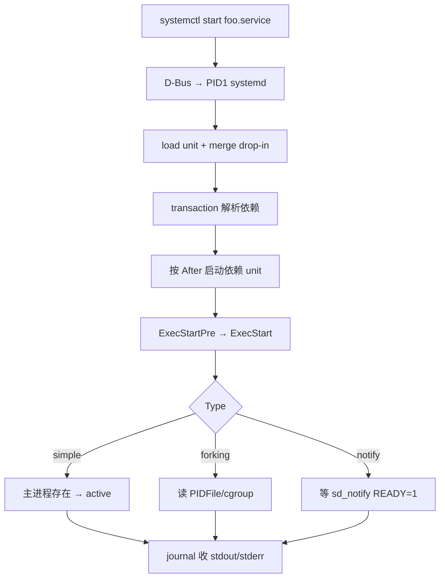
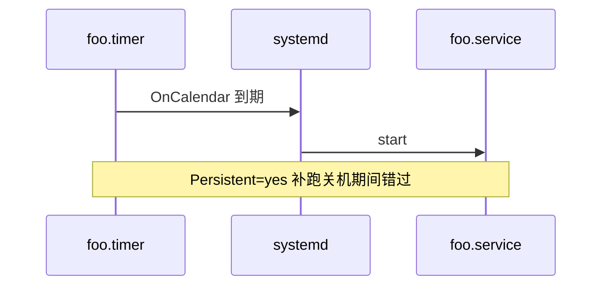

# Linux systemd 服务管理：unit 结构、依赖、Type 与 systemctl 排障

服务「装了却起不来」、改 unit 不生效、开机偶发失败，根因多在 **Type 选错、依赖顺序、drop-in 覆盖、ExecStart 环境** 与 socket 激活。本文按 systemd 真实路径与调用链展开，可直接在本机对照验证。

## 源码锚点

| 路径 / 手册 | 作用 |
|-------------|------|
| `man systemd.service` | [Service] 段字段 |
| `man systemd.unit` | [Unit] 依赖、条件 |
| `man systemd.socket` | Socket 激活 |
| `man systemd.timer` | 定时器 |
| `man systemctl` | 启停、enable |
| `man systemd.exec` | ExecStart/Environment |
| `man sd_notify` | Type=notify |
| `man systemd-analyze` | 启动分析、verify |
| `/lib/systemd/system/` 或 `/usr/lib/systemd/system/` | 包安装 unit（勿手改） |
| `/etc/systemd/system/` | 管理员 unit 与 `.d/` drop-in |
| `/run/systemd/system/` | 运行时 transient unit |
| `/run/systemd/generator/` | fstab 等 generator 产物 |

最小 service：

```ini
[Unit]
Description=Example daemon
After=network-online.target
Wants=network-online.target

[Service]
Type=simple
ExecStart=/usr/local/bin/mydaemon --foreground
Restart=on-failure

[Install]
WantedBy=multi-user.target
```

```bash
systemctl show ssh.service -p FragmentPath -p DropInPaths
systemctl cat ssh.service
systemd --version
```

## 调用链

### systemctl start → active



```text
enable  → /etc/systemd/system/multi-user.target.wants/foo.service 符号链接
daemon-reload → 重扫 unit 目录，不重启已运行进程
restart → stop + start；reload → ExecReload 或信号
```

### socket 激活


### timer → service



## 重点知识

### Unit 类型与命名

扩展名：`.service` `.socket` `.timer` `.target` `.mount` `.path` `.slice` `.scope`。
实例 unit：`getty@tty1.service`；模板 `@` 占位 `%i` `%I`。

```bash
systemctl list-unit-files --type=service
systemctl list-units --type=service --state=failed
systemctl list-units --all 'getty@*'
```

### [Unit] / [Service] / [Install] 字段

| 段 | 常用字段 |
|----|----------|
| [Unit] | Description, Documentation, After, Before, Requires, Wants, Conflicts, Condition*, Assert* |
| [Service] | Type, ExecStart, User, Environment, Restart, WatchdogSec |
| [Install] | WantedBy, RequiredBy, Also, Alias |

Condition 不满足 → **跳过**；Assert 不满足 → **failed**。

### Type 与就绪语义

| Type | 何时算 active | 典型用途 |
|------|---------------|----------|
| simple | ExecStart 主进程已 fork | 前台 daemon、容器 |
| exec | 第一次 exec 成功 | 需确认 exec 成功 |
| forking | PIDFile 或 cgroup 主进程 | nginx、传统 daemon |
| oneshot | 命令结束；常 RemainAfterExit=yes | 初始化脚本 |
| notify | sd_notify(READY=1) | 数据库、慢启动 |
| dbus | BusName= 出现在 bus | D-Bus 服务 |
| idle | 其它 job 清空后启动 | 减少日志交错 |

```ini
[Service]
Type=forking
PIDFile=/run/nginx.pid
ExecStart=/usr/sbin/nginx
ExecReload=/bin/kill -s HUP $MAINPID
```

| 现象 | 可能原因 |
|------|----------|
| active 但无监听 | simple 用于 forking 程序 |
| activating 卡住 | forking 无 PIDFile |
| start 超时 failed | notify 未就绪 |
| 启动即 dead | oneshot 无 RemainAfterExit |

### 依赖：After vs Requires vs Wants

| 指令 | 含义 |
|------|------|
| After=/Before= | **仅排序**，不建立依赖 |
| Requires= | 强依赖；依赖失败则本 unit 失败 |
| Wants= | 弱依赖；依赖失败不影响本 unit |
| BindsTo= | 双向绑定；依赖停则本 unit 停 |
| PartOf= | 停 target 时一并停止 |
| Conflicts= | 互斥 |
| RequiresMountsFor= | 路径必须已挂载 |

网络服务：

```ini
After=network-online.target
Wants=network-online.target
```

`network.target` ≠ 路由/DHCP 就绪；需 `systemd-networkd-wait-online` 或 `NetworkManager-wait-online.service`。

```bash
systemctl status network-online.target
systemd-analyze critical-chain myapp.service
systemctl list-dependencies multi-user.target --reverse | head -40
```

### drop-in 覆盖

**勿改** `/lib/systemd/system/` 包文件。

```bash
systemctl edit foo.service          # → /etc/systemd/system/foo.service.d/override.conf
systemctl edit --full foo.service   # 全量覆盖（慎用）
mkdir -p /etc/systemd/system/foo.service.d
printf '[Service]\nEnvironment=APP_ENV=prod\n' > /etc/systemd/system/foo.service.d/env.conf
systemctl daemon-reload
systemctl restart foo.service
systemctl cat foo.service
systemd-analyze verify foo.service
```

同名字段后者覆盖；Environment 等可多次追加。

### systemctl 操作表

| 命令 | 说明 |
|------|------|
| start/stop/restart | 立即启停 |
| reload | ExecReload，不杀主进程 |
| try-restart | 仅 active 时 restart |
| enable/disable | 开机 symlink |
| enable --now | enable + start |
| mask/unmask | 链 /dev/null，强禁止 |
| is-active/is-enabled/is-failed | 脚本判断 |
| show -p Key | 单属性 |
| reset-failed | 清除 failed 以便重试 |
| list-jobs | 排队 job |

```bash
systemctl enable --now nginx.service
systemctl disable --now legacy-agent.service
systemctl mask broken.service
systemctl is-active --quiet foo && echo ok
```

### ExecStart 与环境

```ini
[Service]
EnvironmentFile=-/etc/default/foo
Environment=LOG_LEVEL=info
WorkingDirectory=/opt/foo
User=foo
Group=foo
ExecStartPre=/usr/bin/mkdir -p /var/run/foo
ExecStart=/usr/bin/foo-daemon
ExecStop=/bin/kill -TERM $MAINPID
PermissionsStartOnly=true
```

`ExecStart` 不经 shell 展开（除非 `/bin/sh -c`）；路径必须绝对。

### Restart 与 StartLimit

| Restart= | 行为 |
|----------|------|
| no | 默认，不重启 |
| on-failure | 异常退出重启 |
| on-success | 非 0 退出重启 |
| always | 总是重启 |

```ini
RestartSec=5
StartLimitIntervalSec=300
StartLimitBurst=5
```

触发 start-limit → failed；`systemctl reset-failed foo` 后修根因再启。

### journalctl 查服务日志

```bash
journalctl -u foo.service -b
journalctl -u foo.service -n 200 --no-pager
journalctl -u foo.service -f
journalctl -u foo.service --since '1 hour ago'
journalctl -u foo.service -p err..alert
journalctl _PID=1234
journalctl -b -1 -u foo
```

```ini
[Service]
StandardOutput=journal
StandardError=inherit
# 或 StandardOutput=append:/var/log/foo.log
```

### Socket 激活配置

```ini
# foo.socket
[Socket]
ListenStream=8080
Accept=no

[Install]
WantedBy=sockets.target
```

```ini
# foo.service
[Service]
Type=simple
ExecStart=/usr/bin/myapp
NonBlocking=yes
```

```bash
systemctl enable --now foo.socket
ss -tlnp | grep 8080
```

`Accept=yes`：每连接独立 service 实例。

### Timer 关联 service

```ini
[Timer]
OnCalendar=*-*-* 02:00:00
Persistent=true
Unit=backup.service

[Install]
WantedBy=timers.target
```

```ini
[Service]
Type=oneshot
ExecStart=/usr/local/bin/backup.sh
```

```bash
systemctl enable --now backup.timer
systemctl list-timers --all
```

### 安全与 cgroup 资源

```ini
[Service]
PrivateTmp=yes
ProtectSystem=strict
ProtectHome=yes
ReadWritePaths=/var/lib/myapp
CapabilityBoundingSet=CAP_NET_BIND_SERVICE
AmbientCapabilities=CAP_NET_BIND_SERVICE
LimitNOFILE=65535
MemoryMax=512M
CPUQuota=50%
WatchdogSec=30
```

```bash
systemd-analyze security foo.service
systemctl show foo -p MemoryCurrent -p CPUUsageNSec
```

### 排障命令链

顺序：`status -l` → `journalctl -u` → `systemctl cat` → `verify` → `critical-chain`。

```bash
systemctl status foo.service -l --no-pager
systemctl show foo -p ActiveState -p SubState -p Result -p ExecMainStatus -p ExecMainCode
journalctl -u foo.service -b --no-pager | tail -80
systemctl cat foo.service
systemd-analyze verify /etc/systemd/system/foo.service
systemd-analyze critical-chain foo.service
```

| 现象/码 | 根因 | 处理 |
|---------|------|------|
| 203/EXEC | 路径不存在/无执行位 | which; ls -l |
| 217/USER | User 不存在 | getent passwd |
| status=127 | PATH 缺命令 | 绝对路径或 Environment |
| activating (start) | Type=forking 无 PID | 改 Type 或 PIDFile |
| activating (notify) | 未 sd_notify | 改 simple 或实现 notify |
| start-limit-hit | 重启过频 | reset-failed; 修根因 |
| dependency failed | Requires 链 failed | status 依赖 unit |
| masked | unit 被 mask | systemctl unmask |
| Permission denied | 权限/SELinux | audit; User/Group |
| 只读文件系统 | 嵌入式 | ReadWritePaths; RuntimeDirectory |

### 启动耗时

```bash
systemd-analyze
systemd-analyze blame | head -20
systemd-analyze critical-chain
systemd-analyze plot > /tmp/boot.svg
```

### 模板 unit 与实例

```bash
systemctl start getty@tty2.service
systemctl enable getty@tty1.service
systemctl show getty@tty1.service -p FragmentPath
```

### RuntimeDirectory / StateDirectory

```ini
[Service]
RuntimeDirectory=myapp
StateDirectory=myapp
LogsDirectory=myapp
ConfigurationDirectory=myapp
```

自动在 `/run/myapp` `/var/lib/myapp` `/var/log/myapp` `/etc/myapp` 建目录并 chown。

### 嵌入式与只读根

| 场景 | 做法 |
|------|------|
| 只读 `/` | unit 放 `/etc/systemd/system/` 或 overlay |
| 无 network-online | After=network.target 或自建 wait |
| 容器非 systemd PID1 | 不用 systemctl；supervisor/前台 |
| Buildroot/Yocto | 镜像阶段 enable；default.target |
| 慢闪存 | TimeoutStartSec=300 |

### generator 与 mount

```bash
systemctl cat boot.mount
ls /run/systemd/generator/*.mount 2>/dev/null
```

### systemd-run 临时 unit

```bash
systemd-run --unit=sleep-test /bin/sleep 600
systemd-run --on-calendar='*:0/5' /path/script.sh
systemd-run -p MemoryMax=100M stress-ng --cpu 1
```

### 完整示例 myweb.service

```ini
[Unit]
Description=MyWeb
After=network-online.target
Wants=network-online.target

[Service]
Type=simple
User=myweb
WorkingDirectory=/opt/myweb
EnvironmentFile=/etc/myweb/env
ExecStart=/opt/myweb/bin/server --port 8080
Restart=on-failure
RestartSec=3
LimitNOFILE=65535

[Install]
WantedBy=multi-user.target
```

```bash
useradd -r -s /sbin/nologin myweb
systemctl daemon-reload
systemctl enable --now myweb.service
curl -I localhost:8080
journalctl -u myweb -f
```
### 生产片段 1：RequiresMountsFor 防 NFS 竞态

NFS 未挂载时不启动：

```ini
[Service]
RequiresMountsFor=/mnt/nfs/app
After=mnt-nfs-app.mount
```

```bash
systemctl show myapp -p RequiresMountsFor
systemctl restart myapp
```

### 生产片段 2：KillMode 与优雅停止

SIGTERM 后 SIGKILL：

```ini
[Service]
KillMode=mixed
KillSignal=SIGTERM
TimeoutStopSec=30
```

```bash
systemctl show myapp -p KillMode
systemctl restart myapp
```

### 生产片段 3：SuccessExitStatus

SIGTERM 视为成功：

```ini
[Service]
SuccessExitStatus=143
```

```bash
systemctl show myapp -p SuccessExitStatus
systemctl restart myapp
```

### 生产片段 4：OOM 策略

降低 OOM 被杀优先级：

```ini
[Service]
OOMPolicy=continue
OOMScoreAdjust=-500
```

```bash
systemctl show myapp -p OOMPolicy
systemctl restart myapp
```

### 生产片段 5：DeviceAllow 串口

嵌入式串口服务：

```ini
[Service]
DeviceAllow=/dev/ttyUSB0 rw
```

```bash
systemctl show myapp -p DeviceAllow
systemctl restart myapp
```

### 生产片段 6：SupplementaryGroups

附加组：

```ini
[Service]
SupplementaryGroups=dialout
```

```bash
systemctl show myapp -p SupplementaryGroups
systemctl restart myapp
```

### 生产片段 7：PrivateNetwork 测试

网络隔离测试：

```ini
[Service]
PrivateNetwork=yes
```

```bash
systemctl show myapp -p PrivateNetwork
systemctl restart myapp
```

### 生产片段 8：Delegate cgroup

容器嵌套 cgroup：

```ini
[Service]
Delegate=yes
```

```bash
systemctl show myapp -p Delegate
systemctl restart myapp
```

### 生产片段 9：LogLevelMax

减少 journal 噪音：

```ini
[Service]
LogLevelMax=warning
```

```bash
systemctl show myapp -p LogLevelMax
systemctl restart myapp
```

### 生产片段 10：NoNewPrivileges

禁止提权：

```ini
[Service]
NoNewPrivileges=yes
```

```bash
systemctl show myapp -p NoNewPrivileges
systemctl restart myapp
```

### 生产片段 11：ProtectKernelTunables

硬化：

```ini
[Service]
ProtectKernelTunables=yes
```

```bash
systemctl show myapp -p ProtectKernelTunables
systemctl restart myapp
```

### 生产片段 12：LockPersonality

禁止 personality：

```ini
[Service]
LockPersonality=yes
```

```bash
systemctl show myapp -p LockPersonality
systemctl restart myapp
```

### 生产片段 13：RestrictAddressFamilies

限制协议族：

```ini
[Service]
RestrictAddressFamilies=AF_INET AF_INET6
```

```bash
systemctl show myapp -p RestrictAddressFamilies
systemctl restart myapp
```

### 生产片段 14：IPAddressDeny/Allow

出站限制：

```ini
[Service]
IPAddressAllow=localhost
IPAddressAllow=10.0.0.0/8
```

```bash
systemctl show myapp -p IPAddressAllow
systemctl restart myapp
```

### 生产片段 15：SystemCallFilter

seccomp 过滤：

```ini
[Service]
SystemCallFilter=@system-service
```

```bash
systemctl show myapp -p SystemCallFilter
systemctl restart myapp
```

### 生产片段 16：NotifyAccess

Type=notify 权限：

```ini
[Service]
NotifyAccess=main
```

```bash
systemctl show myapp -p NotifyAccess
systemctl restart myapp
```

### 生产片段 17：TimeoutStartSec

慢启动硬件：

```ini
[Service]
TimeoutStartSec=120
```

```bash
systemctl show myapp -p TimeoutStartSec
systemctl restart myapp
```

### 生产片段 18：RemainAfterExit oneshot

初始化：

```ini
[Service]
Type=oneshot
RemainAfterExit=yes
ExecStart=/usr/local/bin/init.sh
```

```bash
systemctl show myapp -p Type
systemctl restart myapp
```

### 生产片段 19：PartOf docker

随 docker 停止：

```ini
[Service]
PartOf=docker.service
```

```bash
systemctl show myapp -p PartOf
systemctl restart myapp
```

### 生产片段 20：RefuseManualStart

仅依赖拉起：

```ini
[Service]
RefuseManualStart=yes
```

```bash
systemctl show myapp -p RefuseManualStart
systemctl restart myapp
```

### systemctl show 常用属性

| 属性 | 含义 |
|------|------|
| ActiveState | active/inactive/failed |
| SubState | running/exited/dead/start |
| LoadState | loaded/not-found/masked |
| UnitFileState | enabled/disabled/static |
| FragmentPath | 主 unit 文件路径 |
| DropInPaths | drop-in 列表 |
| ExecMainPID | 主进程 PID |
| ExecMainStatus | 退出码 |
| InvocationID | 本次启动 ID |
| ConditionResult | 条件是否满足 |
| NRestarts | 重启次数 |

```bash
systemctl show ssh.service -p ActiveState -p SubState -p MainPID
systemctl show ssh.service --property=Environment
```
### 排障实例 1：postgres 后启 app

```ini
[Unit]
After=postgresql.service
Wants=postgresql.service
```

```bash
journalctl -u myapp | grep -i connect
```

### 排障实例 2：redis socket

```ini
[Unit]
Requires=redis.socket
After=redis.socket
```

```bash
systemctl status redis.socket
```

### 排障实例 3：多实例 @

```ini
[Unit]
```

```bash
systemctl list-units 'foo@*'
```

### 排障实例 4：alias 名称

```ini
[Unit]
```

```bash
systemctl cat ssh.service
```

### 排障实例 5：default.target

```ini
[Unit]
```

```bash
systemctl set-default multi-user.target
```

### 排障实例 6：rescue 模式

```ini
[Unit]
```

```bash
systemctl emergency
```

### 排障实例 7：isolate

```ini
[Unit]
```

```bash
谨慎：停其它 target
```

### 排障实例 8：daemon-reload 忘

```ini
[Unit]
改 unit 未 reload
```

```bash
systemctl daemon-reload
```

### 排障实例 9：SELinux port

```ini
[Unit]
```

```bash
ausearch -m avc
```

### 排障实例 10：Capabilities 绑低端口

```ini
[Unit]
AmbientCapabilities=CAP_NET_BIND_SERVICE
```

```bash
getcap /usr/bin/myapp
```

### 排障实例 11：postgres 后启 app

```ini
[Unit]
After=postgresql.service
Wants=postgresql.service
```

```bash
journalctl -u myapp | grep -i connect
```

### 排障实例 12：redis socket

```ini
[Unit]
Requires=redis.socket
After=redis.socket
```

```bash
systemctl status redis.socket
```

### 排障实例 13：多实例 @

```ini
[Unit]
```

```bash
systemctl list-units 'foo@*'
```

### 排障实例 14：alias 名称

```ini
[Unit]
```

```bash
systemctl cat ssh.service
```

### 排障实例 15：default.target

```ini
[Unit]
```

```bash
systemctl set-default multi-user.target
```

### 排障实例 16：rescue 模式

```ini
[Unit]
```

```bash
systemctl emergency
```

### 排障实例 17：isolate

```ini
[Unit]
```

```bash
谨慎：停其它 target
```

### 排障实例 18：daemon-reload 忘

```ini
[Unit]
改 unit 未 reload
```

```bash
systemctl daemon-reload
```

### 排障实例 19：SELinux port

```ini
[Unit]
```

```bash
ausearch -m avc
```

### 排障实例 20：Capabilities 绑低端口

```ini
[Unit]
AmbientCapabilities=CAP_NET_BIND_SERVICE
```

```bash
getcap /usr/bin/myapp
```

### 排障实例 21：postgres 后启 app

```ini
[Unit]
After=postgresql.service
Wants=postgresql.service
```

```bash
journalctl -u myapp | grep -i connect
```

### 排障实例 22：redis socket

```ini
[Unit]
Requires=redis.socket
After=redis.socket
```

```bash
systemctl status redis.socket
```

### 排障实例 23：多实例 @

```ini
[Unit]
```

```bash
systemctl list-units 'foo@*'
```

### 排障实例 24：alias 名称

```ini
[Unit]
```

```bash
systemctl cat ssh.service
```

### 排障实例 25：default.target

```ini
[Unit]
```

```bash
systemctl set-default multi-user.target
```

### 排障实例 26：rescue 模式

```ini
[Unit]
```

```bash
systemctl emergency
```

### 排障实例 27：isolate

```ini
[Unit]
```

```bash
谨慎：停其它 target
```

### 排障实例 28：daemon-reload 忘

```ini
[Unit]
改 unit 未 reload
```

```bash
systemctl daemon-reload
```

### 排障实例 29：SELinux port

```ini
[Unit]
```

```bash
ausearch -m avc
```

### 排障实例 30：Capabilities 绑低端口

```ini
[Unit]
AmbientCapabilities=CAP_NET_BIND_SERVICE
```

```bash
getcap /usr/bin/myapp
```

### 单元文件路径速查（包管理对比）

| 发行版 | 包 unit 目录 | 覆盖目录 |
