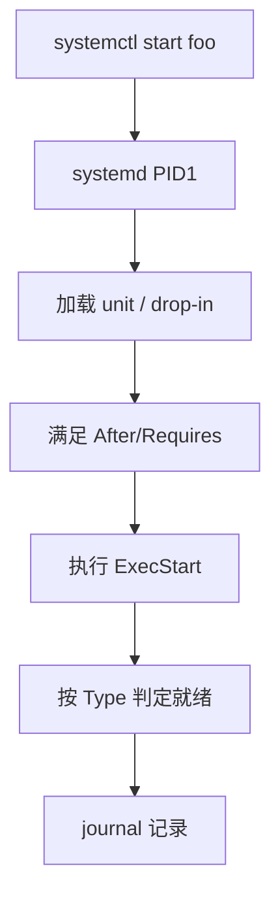

# Linux systemd 服务管理：从 unit 文件到 systemctl 启停与排障

服务「装了却起不来」、开机偶发失败、改完 unit 不生效，多数落在 **依赖顺序、Type 类型、环境变量与 drop-in 覆盖**。本文把 systemd 服务管理从 unit 结构讲到 `systemctl` 排障，便于对照本机验证。

## 源码锚点

| 路径 / 手册 | 作用 |
|-------------|------|
| `man systemd.service` | Service 单元字段语义 |
| `man systemd.unit` | 通用单元、依赖、条件 |
| `man systemctl` | 启停、状态、编辑 |
| `/etc/systemd/system/` | 管理员单元与 drop-in |
| `/lib/systemd/system/` | 软件包默认单元 |

最小 service 示例：

```ini
[Unit]
Description=Example daemon
After=network-online.target
Wants=network-online.target

[Service]
Type=simple
ExecStart=/usr/local/bin/mydaemon
Restart=on-failure

[Install]
WantedBy=multi-user.target
```

## 调用链



```text
enable → 写 want 链接
start → 解析依赖 → fork/exec → 状态 active/failed
reload / daemon-reload → 重新加载单元定义
```

## 重点知识

### Type 决定「成功」含义

- `simple`：ExecStart 一拉起即认为启动（默认常见）。
- `forking`：旧 daemon 双 fork，需 `PIDFile=`。
- `oneshot`：跑完即结束；常配 `RemainAfterExit=yes`。
- `notify`：就绪后经 `sd_notify` 告知，适合真正要等初始化完成的服务。

选错 Type 会出现「systemctl 显示 active 但端口未听」或「一直 activating」。

### 依赖与启动顺序

`After=` 只排序不强制依赖；`Requires=`/`Wants=` 才表达依赖强弱。网络类服务优先 `After=network-online.target`，并理解有的镜像没有真正的 online。

### drop-in 覆盖

```bash
systemctl edit foo.service
# 生成 /etc/systemd/system/foo.service.d/override.conf
systemctl daemon-reload
systemctl restart foo
```

不要直接改 `/lib/systemd/system/` 里的包文件，升级会被覆盖。

### 排障命令

```bash
systemctl status foo.service -l
systemctl show foo -p FragmentPath -p DropInPaths -p ActiveState
journalctl -u foo -b --no-pager | tail -100
systemctl cat foo
systemd-analyze verify /etc/systemd/system/foo.service
```

失败常见原因：`ExecStart` 路径错、权限不足、缺环境变量、`Type=forking` 无 PIDFile、依赖的 socket/网络未好。

### 嵌入式注意

只读根上 unit 放可写覆盖目录；精简系统若无 `network-online.target`，避免死等。容器里 PID1 不一定是 systemd，命令集合不同。
