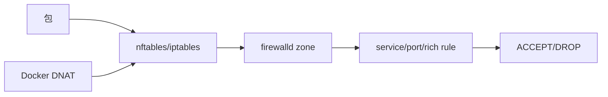
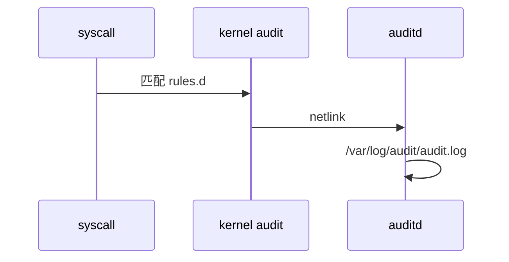

# Linux 安全加固完整篇：从 SSH、防火墙到 SELinux/AppArmor 与审计

「密钥泄露仍被扫端口爆破」「sudo NOPASSWD 全权限」「防火墙开了但 Docker 绕过」——加固失败多在 **默认配置未改、规则顺序错误、MAC 未 Enforcing**。本文按 OpenSSH、firewalld/nftables、auditd 真实路径展开。

## 源码锚点

| 路径 / 配置 | 作用 |
|-------------|------|
| /etc/ssh/sshd_config | SSH 服务端 |
| /etc/ssh/ssh_config | SSH 客户端 |
| man sshd_config | 指令说明 |
| /etc/sudoers | sudo 主配置 |
| /etc/sudoers.d/ | 片段 |
| visudo | 语法校验 |
| /etc/firewalld/ | firewalld zone |
| man firewalld.richlanguage | 富规则 |
| nft list ruleset | nftables |
| /etc/nftables.conf | nft 持久化 |
| /etc/fail2ban/jail.local | fail2ban |
| /etc/selinux/config | SELinux 模式 |
| getenforce / semanage | SELinux |
| /etc/apparmor.d/ | AppArmor profile |
| aa-status | AppArmor |
| /etc/audit/auditd.conf | auditd |
| /etc/audit/rules.d/ | 审计规则 |
| ausearch / aureport | 审计查询 |
| /etc/sysctl.d/ | 内核安全参数 |
| /var/log/auth.log 或 secure | 认证日志 |

```bash
sshd -T | grep -Ei 'permitroot|password|pubkey'; sudo -l; firewall-cmd --list-all 2>/dev/null || nft list ruleset | head
```

## 调用链

### SSH 认证

```mermaid
flowchart TD
    C[ssh user@host] --> T[TCP 连接]
    T --> S[sshd Accept
    S --> V{认证}
    V -->|Pubkey| K[authorized_keys]
    V -->|Password| P[PAM]
    K --> OK{通过?}
    P --> OK
    OK -->|是| SH[shell/ForceCommand]
    OK -->|否| F[失败→fail2ban]
```

### 防火墙 zone



### auditd 事件



## 重点知识

### 最小权限原则

账户：禁用无用账号；服务用专用系统用户；禁止共享私钥。

文件：`/etc/shadow` 600；SSH 私钥 600；目录 750。定期审计 SUID/SGID。

```bash
awk -F: '($3==0){print}' /etc/passwd
find / -perm -4000 -type f 2>/dev/null | head
find /home -name id_rsa -exec ls -l {} \;
```

### SSH 加固

推荐：`PermitRootLogin no`、`PasswordAuthentication no`、`PubkeyAuthentication yes`。

限制用户：`AllowUsers deploy` 或 `AllowGroups sshusers`；`MaxAuthTries 3`。

```bash
# /etc/ssh/sshd_config
PermitRootLogin no
PasswordAuthentication no
PubkeyAuthentication yes
MaxAuthTries 3
AllowUsers deploy
sshd -t && systemctl reload sshd
sshd -T | grep -i permitroot
```

### sudo 配置

用 `visudo` 编辑；`NOPASSWD` 仅必要时且 **命令白名单**，禁止 `ALL`。

`Defaults logfile=/var/log/sudo.log` 留痕；`requiretty` 自动化环境常需关闭。

```bash
# /etc/sudoers.d/deploy
deploy ALL=(ALL) NOPASSWD: /bin/systemctl reload nginx
sudo -l -U deploy
grep sudo /var/log/auth.log | tail
```

### firewalld 与 nftables

firewalld：`--permanent` 写入 XML，`--reload` 生效。默认 zone 绑定接口。

Docker 可能插入 DOCKER 链绕过 firewalld 直觉；需 `firewall-cmd --permanent --zone=trusted --change-interface=docker0` 等策略。

```bash
firewall-cmd --get-active-zones
firewall-cmd --list-all --zone=public
firewall-cmd --permanent --remove-service=cockpit
firewall-cmd --reload
nft list ruleset
```

### fail2ban

读 auth 日志匹配失败次数，调用 firewall ban IP。

jail.local 覆盖默认；filter 在 `/etc/fail2ban/filter.d/`。

```bash
# /etc/fail2ban/jail.local
[sshd]
enabled=true
maxretry=5
bantime=3600
fail2ban-client status sshd
```

### SELinux

模式 Enforcing/Permissive/Disabled。容器/自定义端口需 `semanage port`；文件上下文 `semanage fcontext` + `restorecon`。

AVC 拒绝：`ausearch -m avc -ts recent`；`audit2allow` 生成策略（需人工审）。

```bash
getenforce
semanage port -l | grep http
semanage fcontext -a -t httpd_sys_content_t '/web(/.*)?'
restorecon -Rv /web
ausearch -m avc -ts recent
```

### AppArmor

Ubuntu 常见。profile 在 `/etc/apparmor.d/`；`complain` 模式只记不拦。

```bash
aa-status
apparmor_parser -r /etc/apparmor.d/usr.sbin.nginx
journalctl | grep -i apparmor | tail
```

### auditd 审计

规则 `/etc/audit/rules.d/`；`augenrules --load` 加载。跟踪文件 `-w path -p wa -k key`。

```bash
-w /etc/passwd -p wa -k passwd_changes
-a always,exit -F arch=b64 -S execve -k exec
augenrules --load
ausearch -k passwd_changes
aureport -x --summary
```

### 内核 sysctl 安全

防 spoof、icmp redirect、syn flood 等；ASLR `randomize_va_space=2`。

```bash
# /etc/sysctl.d/99-hardening.conf
net.ipv4.conf.all.rp_filter=1
net.ipv4.conf.all.accept_redirects=0
kernel.randomize_va_space=2
kernel.kptr_restrict=2
fs.protected_symlinks=1
sysctl --system
```

### 更新与漏洞响应

订阅 CVE；`unattended-upgrades` 或镜像仓；内核/glibc/OpenSSL 优先。

```bash
apt list --upgradable 2>/dev/null || yum check-update
needs-restarting -r 2>/dev/null
reboot  # 内核更新后
```

### 常见误配

PermitRootLogin yes、chmod 777、sudo NOPASSWD:ALL、firewalld 停、SELinux Disabled、auditd 未启——五条最常见生产事故源。

| 项 | 说明 |
|----|------|
| 误配 | 后果 |
| root SSH | 爆破面 |
| 777 目录 | 任意写 |
| NOPASSWD ALL | 等价 root |
| firewalld 停 | 全端口暴露 |

### 加固实践深化

#### 实践 1：SSH 密钥权限

过宽 sshd 拒绝

```bash
chmod 700 ~/.ssh; chmod 600 ~/.ssh/authorized_keys
```

#### 实践 2：ssh-audit

算法强度审计

```bash
ssh-audit localhost 2>/dev/null || true
```

#### 实践 3：PAM faillock

账户锁定

```bash
faillock --user badguy 2>/dev/null
```

#### 实践 4：sftp chroot

隔离上传

```bash
# Match Group sftp / ChrootDirectory /srv/sftp
```

#### 实践 5：hosts.allow

TCP Wrappers

```bash
grep sshd /etc/hosts.allow 2>/dev/null
```

#### 实践 6：AIDE

完整性

```bash
aide --check 2>/dev/null
```

#### 实践 7：lynis

基线扫描

```bash
lynis audit system 2>/dev/null | tail -5
```

#### 实践 8：TLS 探测

cipher 版本

```bash
openssl s_client -connect host:443 -brief </dev/null
```

#### 实践 9：iptables legacy

与 nft 并存

```bash
iptables -L -n -v | head
```

#### 实践 10：podman rootless

无 root 边界

```bash
podman unshare cat /proc/self/cgroup | head
```

#### 实践 11：SSH ForceCommand

限制 shell

```bash
# ForceCommand /usr/bin/ls
```

#### 实践 12：SSH Match User

按用户策略

```bash
# Match User alice / AllowTcpForwarding no
```

#### 实践 13：firewalld rich

源 IP 白名单

```bash
firewall-cmd --add-rich-rule='rule family=ipv4 source address=10.0.0.0/8 accept'
```

#### 实践 14：nft drop all

默认拒绝

```bash
nft add rule inet filter input drop
```

#### 实践 15：fail2ban unban

解封

```bash
fail2ban-client set sshd unbanip 1.2.3.4
```

#### 实践 16：audit execve

谁 exec 了什么

```bash
ausearch -m EXECVE -ts today
```

#### 实践 17：audit login

登录事件

```bash
ausearch -m USER_LOGIN -ts today
```

#### 实践 18：chattr +i

防篡改标志

```bash
lsattr /etc/passwd
```

#### 实践 19：passwd -l

锁定账户

```bash
passwd -l olduser
```

#### 实践 20：userdel

删户及家目录

```bash
userdel -r serviceacct
```

#### 实践 21：groupmod

sudo 组成员

```bash
getent group sudo
```

#### 实践 22：umask

默认创建权限

```bash
umask 027
```

#### 实践 23：pam_tally2

PAM 模块

```bash
# 旧系统失败计数
```

#### 实践 24：sshd AllowAgentForwarding

代理转发

```bash
sshd -T | grep allowagentforwarding
```

#### 实践 25：sshd X11Forwarding

X11 转发

```bash
sshd -T | grep x11forwarding
```

#### 实践 26：setroubleshoot

SELinux 建议

```bash
sealert -a /var/log/audit/audit.log 2>/dev/null
```

#### 实践 27：sepolicy generate

生成 SELinux 模块草稿

```bash
sepolicy generate --init nginx
```

#### 实践 28：apparmor complain

调试 profile

```bash
aa-complain /usr/sbin/nginx
```

#### 实践 29：apparmor enforce

强制模式

```bash
aa-enforce /usr/sbin/nginx
```

#### 实践 30：auditd space

日志轮转

```bash
grep max_log_file /etc/audit/auditd.conf
```


## CIS 分项检查

### CIS 5.2 SSH 服务端

独立项：禁止空口令、限制 root、强 MAC。
```bash
sshd -T | awk '/permitrootlogin|permitemptypasswords|maxauthtries|logingracetime/ {print}'
awk '/^PermitRootLogin|^PasswordAuthentication|^MaxAuthTries|^LoginGraceTime/ {print NR":"$0}' /etc/ssh/sshd_config
stat -c '%a %U %G' /etc/ssh/sshd_config
find /etc/ssh -name 'ssh_host_*_key' -exec stat -c '%a %n' {} \;
```
期望：`PermitRootLogin no`；host key 600 root:root。

### CIS 5.3 sudo 策略

```bash
visudo -c
grep -rE 'NOPASSWD|ALL=\(ALL\)|!authenticate' /etc/sudoers /etc/sudoers.d/ 2>/dev/null
awk -F: '$3==0 {print}' /etc/passwd
getent group sudo wheel
lastlog | awk '$3!="**Never logged in**" {print}' | head
```

### CIS 3.5 防火墙与 nftables

```bash
systemctl is-enabled firewalld nftables 2>/dev/null
firewall-cmd --get-default-zone 2>/dev/null
firewall-cmd --list-all-zones 2>/dev/null | head -40
nft list ruleset | head -60
ss -lntup | awk 'NR==1 || /0.0.0.0:|\[::\]:/'
```

### CIS 1.6 SELinux 状态

```bash
getenforce
grep ^SELINUX= /etc/selinux/config
sestatus
semanage boolean -l | grep -i httpd | head
ausearch -m avc -ts recent 2>/dev/null | tail -5
```

### CIS 4.1 审计 daemon

```bash
systemctl is-active auditd
auditctl -l
grep -E '^(max_log_file|space_left_action|admin_space_left_action)' /etc/audit/auditd.conf
aureport -s | head -20
ls -la /etc/audit/rules.d/
```

### CIS 3.3 内核网络 sysctl

```bash
sysctl net.ipv4.ip_forward net.ipv4.conf.all.rp_filter net.ipv4.conf.all.accept_redirects
sysctl net.ipv4.tcp_syncookies kernel.randomize_va_space kernel.kptr_restrict
grep -r . /etc/sysctl.d/*.conf 2>/dev/null | grep -v '^#'
sysctl --system 2>&1 | tail -5
```

### CIS 1.8 补丁与软件源

```bash
apt list --upgradable 2>/dev/null | head -20
dnf updateinfo list security 2>/dev/null | head
rpm -q --changelog kernel | head -5
unattended-upgrades -d 2>/dev/null | tail -10
grep -r ^deb /etc/apt/sources.list /etc/apt/sources.list.d/ 2>/dev/null
```

### 漏洞扫描与 SBOM

```bash
# Trivy 主机+镜像
trivy rootfs /
trivy image --severity HIGH,CRITICAL nginx:1.25
# Grype
syft dir:/ -o json > sbom.json
grype sbom:sbom.json
```

```bash
# OpenSCAP
oscap xccdf eval --profile xccdf_org.ssgproject.content_profile_cis /usr/share/xml/scap/ssg/content/ssg-*.xml 2>/dev/null | tail -20
```

### TLS 证书与 cipher 审计

```bash
openssl s_client -connect example.com:443 -servername example.com </dev/null 2>/dev/null | openssl x509 -noout -dates -subject -issuer
testssl.sh --quiet https://example.com 2>/dev/null | grep -E 'NOT ok|OK'
certbot certificates 2>/dev/null
grep -r SSLProtocol /etc/httpd /etc/nginx 2>/dev/null
```

```bash
# 本地 PEM 过期扫描
find /etc/ssl /etc/pki -name '*.pem' -exec openssl x509 -in {} -noout -enddate \; 2>/dev/null
```

### 容器宿主机加固

```bash
docker info --format '{{.SecurityOptions}}'
grep -E 'user.max_user_namespaces|kernel.unprivileged_userns_clone' /proc/sys/*/* 2>/dev/null
systemctl show docker -p ExecStart | tr ' ' '\n' | grep userns
auditctl -w /usr/bin/docker -p wa -k docker_bin
```

| 项 | 建议 | 命令 |
|----|------|------|
| 套接字 | root 才能连 | `ls -l /var/run/docker.sock` |
| 用户命名空间 | 按需关闭 | `sysctl kernel.unprivileged_userns_clone` |
| 镜像签名 | cosign verify | `cosign verify --key cosign.pub img` |

```bash
podman info --format '{{.Host.Security}}'
grep NOFILE /etc/systemd/system/docker.service.d/*.conf 2>/dev/null
```

### 应急响应取证

```bash
# 隔离但保留内存（若可行）
ip link set eth0 down
systemctl stop sshd
# 快照
tar czf /media/usb/evidence-$(hostname)-$(date +%F).tgz /var/log/auth.log /var/log/audit/audit.log /root/.ssh 2>/dev/null
```

```bash
last -20
lastb -20 2>/dev/null
ausearch -m USER_LOGIN -sv no --interpret | tail -20
ss -antp | awk '$1=="ESTAB"'
lsof -i -P -n | head -30
```

```bash
# 哈希可疑二进制
sha256sum /usr/bin/.hidden 2>/dev/null
rpm -Vf /usr/bin/ss 2>/dev/null
debsums -c 2>/dev/null | head
```

### 误配案例与修复

| 误配 | 检测 | 修复 |
|------|------|------|
| `/etc/ssh/sshd_config` 末尾 `PermitRootLogin yes` 覆盖前面 no | 见上节命令 | `sshd -T | grep permitrootlogin`；删重复行，`systemctl reload sshd`。 |
| firewalld public 区 `--add-service=ssh` 但未 `--permanent` | 见上节命令 | 重启丢规则；`firewall-cmd --runtime-to-permanent`。 |
| audit 规则 `-e 2` 未生效 | 见上节命令 | `auditctl -s` 看 enabled；fix `/etc/audit/rules.d/` 后 `augenrules --load`。 |
| `net.ipv4.ip_forward=1` 忘记关 | 见上节命令 | 非网关主机：`sysctl -w net.ipv4.ip_forward=0` 写入 sysctl.d。 |
| Docker 0.0.0.0:2375 无 TLS | 见上节命令 | `ss -lntp | grep 2375`；改 unix socket 或 mTLS。 |
| sudoers `%wheel ALL=(ALL) NOPASSWD: ALL` | 见上节命令 | `grep NOPASSWD /etc/sudoers.d/*`；改回需密码。 |

```bash
# 一键导出加固快照（不含密钥）
{
  echo '== sshd -T =='; sshd -T 2>/dev/null | head -30
  echo '== sudoers =='; visudo -c
  echo '== firewall =='; nft list ruleset 2>/dev/null | head -20
  echo '== selinux =='; getenforce
  echo '== audit =='; auditctl -s
} > /tmp/hardening-snapshot.txt
```

#### 加固演练 1：SSH 密钥轮换

```bash
find /etc/ssh -name 'ssh_host_*_key.pub' -exec ssh-keygen -lf {} \;
ssh-keygen -t ed25519 -f /etc/ssh/ssh_host_ed25519_key -N ''
```

#### 加固演练 2：PAM faillock

```bash
grep pam_faillock /etc/pam.d/system-auth /etc/pam.d/password-auth 2>/dev/null
faillock --user baduser
```

#### 加固演练 3：chroot sftp

```bash
grep -i chroot /etc/ssh/sshd_config
Match Group sftpusers
ChrootDirectory /srv/sftp/%u
```

#### 加固演练 4：nft 限流

```bash
nft list chain inet filter input 2>/dev/null
nft add rule inet filter input tcp dport 22 ct state new limit rate 5/minute accept
```

#### 加固演练 5：AIDE 完整性

```bash
aide --check 2>/dev/null | tail -5
aideinit && mv /var/lib/aide/aide.db.new.gz /var/lib/aide/aide.db.gz
```

### CIS 5.4 账户与口令策略

login.defs 控制 PASS_MAX_DAYS、UMASK。
```bash
grep -E 'PASS_MAX_DAYS|PASS_MIN_DAYS|UMASK|ENCRYPT_METHOD' /etc/login.defs
chage -l root
awk -F: '($2=="" || $2=="!") {print}' /etc/shadow  # 空口令
pam-auth-update --list 2>/dev/null
```

### CIS 2.2 不必要服务

```bash
systemctl list-unit-files --state=enabled --type=service | grep -Ei 'telnet|rsh|ftp|tftp'
ss -lntup | grep -E ':23|:21|:513'
chkconfig --list 2>/dev/null | grep on
rpm -q telnet-server vsftpd 2>/dev/null
```

### CIS 4.2 日志权限

```bash
ls -l /var/log/secure /var/log/auth.log /var/log/audit/audit.log 2>/dev/null
grep ^$ /etc/rsyslog.conf /etc/rsyslog.d/*.conf 2>/dev/null | head
systemctl status rsyslog journald | head -6
journalctl --verify 2>/dev/null | tail -3
```

### CIS 3.7 禁用无线

```bash
nmcli radio wifi 2>/dev/null
rfkill list
lsmod | grep -E 'bluetooth|wifi'
systemctl is-enabled bluetooth 2>/dev/null
```

### CIS 6.1 文件权限审计

```bash
find /etc -perm /077 -type f 2>/dev/null | head -10
find / -xdev -nouser -o -nogroup 2>/dev/null | head
rpm -Va 2>/dev/null | grep '^..5' | head
debsums -c 2>/dev/null | head
```

### Lynis 与 OpenVAS 采样

```bash
lynis audit system --quick 2>/dev/null | tail -30
grep Suggestion /var/log/lynis.log 2>/dev/null | tail -10
gvm-cli socket --xml '<get_tasks/>' 2>/dev/null | head
```

### nginx/apache TLS 片段

```bash
nginx -T 2>/dev/null | grep -E 'ssl_protocols|ssl_ciphers|ssl_prefer'
apachectl -S 2>/dev/null | head
grep -r SSLCertificate /etc/httpd /etc/apache2 2>/dev/null | head
openssl ciphers -v 'ECDHE+AESGCM' | head
```

### 容器 runtime 加固对照

| 检查 | 命令 | 期望 |
|------|------|------|
| seccomp | `docker inspect --format '{{.HostConfig.SecurityOpt}}' id` | 非 unconfined |
| cap drop | `docker inspect --format '{{.HostConfig.CapDrop}}' id` | 去掉 ALL 再 add |
| read-only root | `--read-only` | 真 |
| AppArmor | `docker inspect .HostConfig.SecurityOpt` | docker-default |

```bash
docker run --rm --read-only --cap-drop ALL alpine id
crictl inspect $(crictl ps -q | head -1) 2>/dev/null | jq .info.runtimeSpec.linux.security
```

### 应急隔离 playbook

```bash
# 1. 断外网保内网排障
iptables -I OUTPUT 1 -d 10.0.0.0/8 -j ACCEPT
iptables -A OUTPUT -j DROP
# 2. 保留审计
systemctl restart auditd
auditctl -l | head
# 3. 导出连接
ss -antp > /root/incident-ss.txt
```

### 误配深度案例

| 案例 | 检测 | 修复 |
|------|------|------|
| `/etc/pam.d/sshd` 缺 pam_faillock | `grep faillock /etc/pam.d/sshd` | 复制 password-auth 中 faillock 段 |
| journald 未持久化 | `grep Storage /etc/systemd/journald.conf` | Storage=persistent 后 restart journald |
| IPv6 全暴露 | `ss -lntp6 | grep -v tcp6.*127` | firewall 限制 ::/0 listener |
| world-writable cron | `find /etc/cron* -perm -002` | chmod o-w |
| nginx 以 root 运行 | `ps -o user,cmd -C nginx | head` | user nginx; 或 setcap |

```bash
sshd -T | grep -Ei 'ciphers|macs|kexalgorithms' | tr ',' '\n' | head -15
update-crypto-policies --show 2>/dev/null
```

### 合规快照命令组

#### 快照 1：账户指纹

```bash
getent passwd | awk -F: '$3>=1000 && $3<65534 {print $1,$3,$7}'
```

#### 快照 2：监听端口

```bash
ss -lntup | awk 'NR>1{print $5,$7}' | sort -u
```

#### 快照 3：SUID 列表

```bash
find /usr /bin -xdev -perm -4000 -type f 2>/dev/null | head -20
```

#### 快照 4：计划任务

```bash
systemctl list-timers --all | head -15
```

#### 快照 5：内核模块

```bash
lsmod | awk 'NR>1{print $1,$2}' | sort -k2 -rn | head
```

#### 快照 6：挂载选项

```bash
findmnt -lo TARGET,OPTIONS | grep -v nodev
```

#### 快照 7：PAM 栈

```bash
grep -v '^#' /etc/pam.d/sshd | head -10
```

#### 快照 8：DNS 信任

```bash
resolvectl domain 2>/dev/null; cat /etc/resolv.conf
```

#### 快照 9：时间同步

```bash
timedatectl show | grep -E 'NTPSynchronized|Timezone'
```

#### 快照 10：容器套接字

```bash
ls -l /var/run/docker.sock /run/podman/podman.sock 2>/dev/null
```

### SSH 客户端加固

```bash
ssh -G user@host 2>/dev/null | grep -Ei 'ciphers|macs|hostkeyalgorithms'
grep -Ei 'HashKnownHosts|StrictHostKeyChecking' /etc/ssh/ssh_config /etc/ssh/ssh_config.d/* 2>/dev/null
```

### sudo 日志与 I/O 日志

```bash
grep -r logfile /etc/sudoers /etc/sudoers.d/ 2>/dev/null
grep iolog_dir /etc/sudoers 2>/dev/null
tail /var/log/sudo.log 2>/dev/null
```

### firewalld rich rule 样例

```bash
firewall-cmd --permanent --add-rich-rule='rule family=ipv4 source address=10.0.0.0/8 port port=22 protocol=tcp accept'
firewall-cmd --reload
firewall-cmd --list-rich-rules
```

### audit 关键规则样例

```bash
grep -r execve /etc/audit/rules.d/
auditctl -w /etc/passwd -p wa -k passwd_changes
ausearch -k passwd_changes -ts recent 2>/dev/null | tail
```

### sysctl 硬化片段文件

```bash
cat > /etc/sysctl.d/99-hardening.conf <<'EOF'
net.ipv4.conf.all.send_redirects = 0
net.ipv4.conf.all.accept_source_route = 0
fs.protected_hardlinks = 1
EOF
sysctl --system | tail -5
```

#### 工具链 1：ModSecurity 采样

```bash
nginx -V 2>&1 | grep -i modsecurity
tail /var/log/modsec_audit.log 2>/dev/null
```

#### 工具链 2：ClamAV 更新

```bash
freshclam 2>/dev/null | tail -3
clamscan -r /tmp 2>/dev/null | tail -3
```

#### 工具链 3：RKHunter

```bash
rkhunter --check --sk 2>/dev/null | tail -5
grep Warning /var/log/rkhunter.log 2>/dev/null
```

#### 工具链 4：USB 存储禁

```bash
grep usb-storage /etc/modprobe.d/* 2>/dev/null
lsmod | grep usb_storage
```

#### 工具链 5：密码哈希

```bash
grep ENCRYPT_METHOD /etc/login.defs
awk -F: '{print $2}' /etc/shadow | head | cut -c1-3
```

### 最小暴露服务基线

```bash
systemctl list-units --type=service --state=running --no-pager | wc -l
ss -lntup | awk 'NR>1{print $5}' | sort -u
```


#### 基线延伸 1：空口令账户

```bash
awk -F: '($2=="" || $2=="x") && $1!="root" {print $1}' /etc/shadow
```

