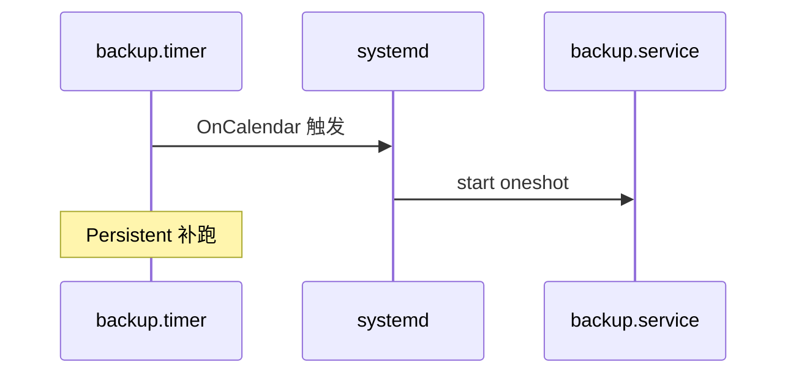
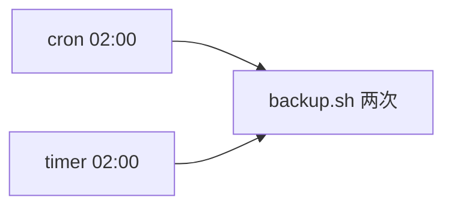

# Linux 定时任务：crontab、/etc/cron 与 systemd timer 完整篇

备份双跑、错过整点补跑、容器时区错乱，来自 **cron 与 systemd timer 并存、anacron 补跑、Persistent** 混用。本文按真实路径讲清调度配置与坑。

## 源码锚点

| 路径 / 手册 | 作用 |
|-------------|------|
| `man crontab` / `man 5 crontab` | 用户 crontab |
| `man cron` | cron 守护进程 |
| `man anacron` | 非 7x24 补跑 |
| `man systemd.timer` / `man systemd.time` | timer 与 OnCalendar |
| `/var/spool/cron/crontabs/` | Debian 用户 crontab |
| `/var/spool/cron/` | RHEL 用户 crontab |
| `/etc/crontab` | 系统 crontab（含用户列） |
| `/etc/cron.d/` | 包 drop-in |
| `/etc/cron.{hourly,daily,weekly,monthly}/` | 目录批次 |
| `/etc/anacrontab` | anacron |
| `/etc/systemd/system/*.timer` | 管理员 timer |
| `/etc/timezone` `/etc/localtime` | 时区 |

## 调用链

### cron 每分钟扫描

```mermaid
flowchart TD
    A[cron 每分钟] --> B[/etc/crontab]
    B --> C[/etc/cron.d/*]
    C --> D[/var/spool/cron/*]
    D --> E{字段匹配?}
    E -->|是| F[fork exec 命令]
    E -->|否| G[下一条]
    F --> H[syslog / mail]
```

### timer → service



### 双跑风险



## 重点知识

### crontab 五字段

| 字段 | 范围 |
|------|------|
| 分 | 0-59 |
| 时 | 0-23 |
| 日 | 1-31 |
| 月 | 1-12 |
| 周 | 0-7（0与7=周日） |

```bash
crontab -e
crontab -l
sudo crontab -u www-data -e
```

```cron
*/5 * * * * /usr/local/bin/check.sh
0 9 * * 1-5 /usr/local/bin/report.sh
MAILTO=admin@example.com
PATH=/usr/local/sbin:/usr/local/bin:/sbin:/bin
```

**日+周**：`0 0 1 * 1` = 每月1号且周一，不是「或」。

### /etc/crontab 与 cron.d

```cron
17 * * * * root cd / && run-parts --report /etc/cron.hourly
25 6 * * * root test -x /usr/sbin/anacron || run-parts --report /etc/cron.daily
```

```bash
ls /etc/cron.d/
cat /etc/cron.d/php 2>/dev/null || true
run-parts --test /etc/cron.daily
```

### cron 目录与 anacron

```bash
ls /etc/cron.daily/
cat /etc/anacrontab
grep CRON /var/log/syslog
grep CRON /var/log/cron 2>/dev/null
```

anacron 开机补跑 daily/weekly；与 crontab `@daily` **可能重复**执行 run-parts。

### systemd.timer

```ini
[Timer]
OnCalendar=*-*-* 02:00:00
Persistent=true
Unit=backup.service

[Install]
WantedBy=timers.target
```

```ini
[Service]
Type=oneshot
ExecStart=/usr/local/bin/backup.sh
```

```bash
systemctl enable --now backup.timer
systemctl list-timers --all
journalctl -u backup.service -u backup.timer
```

### OnCalendar

```bash
systemd-analyze calendar '*-*-* 02:00:00'
systemd-analyze calendar 'Mon..Fri *-*-* 09:00:00'
systemd-analyze calendar '*-*-01 03:00:00'
```

| 表达式 | 含义 |
|--------|------|
| `*-*-* 02:00:00` | 每天 02:00 |
| `Mon *-*-* 09:00` | 周一 09:00 |
| `*-*-* *:0/15:00` | 每 15 分钟 |
| `hourly` / `daily` / `weekly` | 简写 |

相对：`OnBootSec=5min` `OnUnitActiveSec=1h` 可与 OnCalendar 并存。

### Persistent

`Persistent=true`：关机错过触发点，**开机后立即补跑**一次。
适合 backup/logrotate；不适合 heartbeat（会重复打点）。

### 时区

```bash
timedatectl
timedatectl set-timezone Asia/Shanghai
date
cat /etc/timezone 2>/dev/null
docker exec app date
```

cron 与 OnCalendar 均用 **系统本地时区**；Java 等需单独对齐。

### 双跑规避

```bash
grep -r backup /etc/cron* /var/spool/cron 2>/dev/null
systemctl list-timers | grep backup
flock -n /var/lock/backup.lock /usr/local/bin/backup.sh
```

| 场景 | 后果 | 规避 |
|------|------|------|
| cron + timer 同脚本 | 双备份 | 只留一种 |
| anacron + cron.daily | daily 双跑 | 单链路 |
| Persistent + 手动 cron | 连跑 | 脚本幂等 |

### @ 特殊串

| @reboot @daily @weekly @monthly @hourly | 见 man 5 crontab |

开机任务更稳：`WantedBy=multi-user.target` 或 `OnBootSec=`。

### 输出与邮件

```cron
MAILTO=""
*/10 * * * * /path/script.sh >> /var/log/script.log 2>&1
```

### 排障表

| 现象 | 查 | 因 |
|------|----|----|
| 不执行 | grep CRON syslog | cron 停；语法错 |
| 环境缺 | crontab 设 PATH | cron 极简环境 |
| timer 不触发 | list-timers | 未 enable |
| 差 8h | timedatectl | UTC |
| 补跑 | Persistent | 设计如此 |

### OnCalendar 示例 1：午夜

表达式：`*-*-* 00:00:00`

```bash
systemd-analyze calendar '*-*-* 00:00:00'
```

### OnCalendar 示例 2：每天 12:30

表达式：`*-*-* 12:30:00`

```bash
systemd-analyze calendar '*-*-* 12:30:00'
```

### OnCalendar 示例 3：周末 10 点

表达式：`Sat,Sun *-*-* 10:00`

```bash
systemd-analyze calendar 'Sat,Sun *-*-* 10:00'
```

### OnCalendar 示例 4：每月 1 号

表达式：`*-*-01 00:00:00`

```bash
systemd-analyze calendar '*-*-01 00:00:00'
```

### OnCalendar 示例 5：工作日 8 点

表达式：`Mon..Fri *-*-* 08:00`

```bash
systemd-analyze calendar 'Mon..Fri *-*-* 08:00'
```

### OnCalendar 示例 6：每月 1、15 号

表达式：`*-*-01,15 03:00`

```bash
systemd-analyze calendar '*-*-01,15 03:00'
```

### OnCalendar 示例 7：季度

表达式：`Jan,Apr,Jul,Oct 1 *-*-* 02:00`

```bash
systemd-analyze calendar 'Jan,Apr,Jul,Oct 1 *-*-* 02:00'
```

### OnCalendar 示例 8：每 5 分钟

表达式：`*-*-* *:0/5:00`

```bash
systemd-analyze calendar '*-*-* *:0/5:00'
```

### OnCalendar 示例 9：带时区（systemd 230+）

表达式：`*-*-* 02:00:00 Europe/Berlin`

```bash
systemd-analyze calendar '*-*-* 02:00:00 Europe/Berlin'
```

### crontab 模式 1：每 5 分钟

```cron
*/5 * * * * /path/to/cmd
```

### crontab 模式 2：每 2 小时整

```cron
0 */2 * * * /path/to/cmd
```

### crontab 模式 3：每天 04:30

```cron
30 4 * * * /path/to/cmd
```

### crontab 模式 4：周日 0 点

```cron
0 0 * * 0 /path/to/cmd
```

### crontab 模式 5：每月 1 号

```cron
0 0 1 * * /path/to/cmd
```

### crontab 模式 6：开机（cron 语义）

```cron
@reboot /path/to/cmd
```

### crontab 模式 7：每年 1 月 1 日

```cron
0 0 1 1 * /path/to/cmd
```

### 运维命令组 21

```bash
systemctl status cron 2>/dev/null || systemctl status crond
pgrep -a cron
crontab -l
sudo ls -la /var/spool/cron/
systemctl list-timers --all
journalctl -u backup.timer -u backup.service -n 30
grep -r 'OnCalendar\|crontab' /etc/systemd/system/ /etc/cron* 2>/dev/null | head
timedatectl show -p Timezone -p LocalRTC
flock -n /tmp/test.lock echo ok || echo locked
run-parts --test /etc/cron.daily 2>/dev/null | head
anacron -T 2>/dev/null || cat /etc/anacrontab
```

### 运维命令组 22

```bash
systemctl status cron 2>/dev/null || systemctl status crond
pgrep -a cron
crontab -l
sudo ls -la /var/spool/cron/
systemctl list-timers --all
journalctl -u backup.timer -u backup.service -n 30
grep -r 'OnCalendar\|crontab' /etc/systemd/system/ /etc/cron* 2>/dev/null | head
timedatectl show -p Timezone -p LocalRTC
flock -n /tmp/test.lock echo ok || echo locked
run-parts --test /etc/cron.daily 2>/dev/null | head
anacron -T 2>/dev/null || cat /etc/anacrontab
```

### 运维命令组 23

```bash
systemctl status cron 2>/dev/null || systemctl status crond
pgrep -a cron
crontab -l
sudo ls -la /var/spool/cron/
systemctl list-timers --all
journalctl -u backup.timer -u backup.service -n 30
grep -r 'OnCalendar\|crontab' /etc/systemd/system/ /etc/cron* 2>/dev/null | head
timedatectl show -p Timezone -p LocalRTC
flock -n /tmp/test.lock echo ok || echo locked
run-parts --test /etc/cron.daily 2>/dev/null | head
anacron -T 2>/dev/null || cat /etc/anacrontab
```

### 运维命令组 24

```bash
systemctl status cron 2>/dev/null || systemctl status crond
pgrep -a cron
crontab -l
sudo ls -la /var/spool/cron/
systemctl list-timers --all
journalctl -u backup.timer -u backup.service -n 30
grep -r 'OnCalendar\|crontab' /etc/systemd/system/ /etc/cron* 2>/dev/null | head
timedatectl show -p Timezone -p LocalRTC
flock -n /tmp/test.lock echo ok || echo locked
run-parts --test /etc/cron.daily 2>/dev/null | head
anacron -T 2>/dev/null || cat /etc/anacrontab
```

### 运维命令组 25

```bash
systemctl status cron 2>/dev/null || systemctl status crond
pgrep -a cron
crontab -l
sudo ls -la /var/spool/cron/
systemctl list-timers --all
journalctl -u backup.timer -u backup.service -n 30
grep -r 'OnCalendar\|crontab' /etc/systemd/system/ /etc/cron* 2>/dev/null | head
timedatectl show -p Timezone -p LocalRTC
flock -n /tmp/test.lock echo ok || echo locked
run-parts --test /etc/cron.daily 2>/dev/null | head
anacron -T 2>/dev/null || cat /etc/anacrontab
```

### 运维命令组 26

```bash
systemctl status cron 2>/dev/null || systemctl status crond
pgrep -a cron
crontab -l
sudo ls -la /var/spool/cron/
systemctl list-timers --all
journalctl -u backup.timer -u backup.service -n 30
grep -r 'OnCalendar\|crontab' /etc/systemd/system/ /etc/cron* 2>/dev/null | head
timedatectl show -p Timezone -p LocalRTC
flock -n /tmp/test.lock echo ok || echo locked
run-parts --test /etc/cron.daily 2>/dev/null | head
anacron -T 2>/dev/null || cat /etc/anacrontab
```

### 运维命令组 27

```bash
systemctl status cron 2>/dev/null || systemctl status crond
pgrep -a cron
crontab -l
sudo ls -la /var/spool/cron/
systemctl list-timers --all
journalctl -u backup.timer -u backup.service -n 30
grep -r 'OnCalendar\|crontab' /etc/systemd/system/ /etc/cron* 2>/dev/null | head
timedatectl show -p Timezone -p LocalRTC
flock -n /tmp/test.lock echo ok || echo locked
run-parts --test /etc/cron.daily 2>/dev/null | head
anacron -T 2>/dev/null || cat /etc/anacrontab
```

### 运维命令组 28

```bash
systemctl status cron 2>/dev/null || systemctl status crond
pgrep -a cron
crontab -l
sudo ls -la /var/spool/cron/
systemctl list-timers --all
journalctl -u backup.timer -u backup.service -n 30
grep -r 'OnCalendar\|crontab' /etc/systemd/system/ /etc/cron* 2>/dev/null | head
timedatectl show -p Timezone -p LocalRTC
flock -n /tmp/test.lock echo ok || echo locked
run-parts --test /etc/cron.daily 2>/dev/null | head
anacron -T 2>/dev/null || cat /etc/anacrontab
```

### 运维命令组 29

```bash
systemctl status cron 2>/dev/null || systemctl status crond
pgrep -a cron
crontab -l
sudo ls -la /var/spool/cron/
systemctl list-timers --all
journalctl -u backup.timer -u backup.service -n 30
grep -r 'OnCalendar\|crontab' /etc/systemd/system/ /etc/cron* 2>/dev/null | head
timedatectl show -p Timezone -p LocalRTC
flock -n /tmp/test.lock echo ok || echo locked
run-parts --test /etc/cron.daily 2>/dev/null | head
anacron -T 2>/dev/null || cat /etc/anacrontab
```

### 运维命令组 30

```bash
systemctl status cron 2>/dev/null || systemctl status crond
pgrep -a cron
crontab -l
sudo ls -la /var/spool/cron/
systemctl list-timers --all
journalctl -u backup.timer -u backup.service -n 30
grep -r 'OnCalendar\|crontab' /etc/systemd/system/ /etc/cron* 2>/dev/null | head
timedatectl show -p Timezone -p LocalRTC
flock -n /tmp/test.lock echo ok || echo locked
run-parts --test /etc/cron.daily 2>/dev/null | head
anacron -T 2>/dev/null || cat /etc/anacrontab
```

### 运维命令组 31

```bash
systemctl status cron 2>/dev/null || systemctl status crond
pgrep -a cron
crontab -l
sudo ls -la /var/spool/cron/
systemctl list-timers --all
journalctl -u backup.timer -u backup.service -n 30
grep -r 'OnCalendar\|crontab' /etc/systemd/system/ /etc/cron* 2>/dev/null | head
timedatectl show -p Timezone -p LocalRTC
flock -n /tmp/test.lock echo ok || echo locked
run-parts --test /etc/cron.daily 2>/dev/null | head
anacron -T 2>/dev/null || cat /etc/anacrontab
```

### 运维命令组 32

```bash
systemctl status cron 2>/dev/null || systemctl status crond
pgrep -a cron
crontab -l
sudo ls -la /var/spool/cron/
systemctl list-timers --all
journalctl -u backup.timer -u backup.service -n 30
grep -r 'OnCalendar\|crontab' /etc/systemd/system/ /etc/cron* 2>/dev/null | head
timedatectl show -p Timezone -p LocalRTC
flock -n /tmp/test.lock echo ok || echo locked
run-parts --test /etc/cron.daily 2>/dev/null | head
anacron -T 2>/dev/null || cat /etc/anacrontab
```

### 运维命令组 33

```bash
systemctl status cron 2>/dev/null || systemctl status crond
pgrep -a cron
crontab -l
sudo ls -la /var/spool/cron/
systemctl list-timers --all
journalctl -u backup.timer -u backup.service -n 30
grep -r 'OnCalendar\|crontab' /etc/systemd/system/ /etc/cron* 2>/dev/null | head
timedatectl show -p Timezone -p LocalRTC
flock -n /tmp/test.lock echo ok || echo locked
run-parts --test /etc/cron.daily 2>/dev/null | head
anacron -T 2>/dev/null || cat /etc/anacrontab
```

### 运维命令组 34

```bash
systemctl status cron 2>/dev/null || systemctl status crond
pgrep -a cron
crontab -l
sudo ls -la /var/spool/cron/
systemctl list-timers --all
journalctl -u backup.timer -u backup.service -n 30
grep -r 'OnCalendar\|crontab' /etc/systemd/system/ /etc/cron* 2>/dev/null | head
timedatectl show -p Timezone -p LocalRTC
flock -n /tmp/test.lock echo ok || echo locked
run-parts --test /etc/cron.daily 2>/dev/null | head
anacron -T 2>/dev/null || cat /etc/anacrontab
```

### 运维命令组 36

```bash
systemctl status cron 2>/dev/null || systemctl status crond
pgrep -a cron
crontab -l
sudo ls -la /var/spool/cron/
systemctl list-timers --all
journalctl -u backup.timer -u backup.service -n 30
grep -r 'OnCalendar\|crontab' /etc/systemd/system/ /etc/cron* 2>/dev/null | head
timedatectl show -p Timezone -p LocalRTC
flock -n /tmp/test.lock echo ok || echo locked
run-parts --test /etc/cron.daily 2>/dev/null | head
anacron -T 2>/dev/null || cat /etc/anacrontab
```

### 运维命令组 37

```bash
systemctl status cron 2>/dev/null || systemctl status crond
pgrep -a cron
crontab -l
sudo ls -la /var/spool/cron/
systemctl list-timers --all
journalctl -u backup.timer -u backup.service -n 30
grep -r 'OnCalendar\|crontab' /etc/systemd/system/ /etc/cron* 2>/dev/null | head
timedatectl show -p Timezone -p LocalRTC
flock -n /tmp/test.lock echo ok || echo locked
run-parts --test /etc/cron.daily 2>/dev/null | head
anacron -T 2>/dev/null || cat /etc/anacrontab
```

### 运维命令组 38

```bash
systemctl status cron 2>/dev/null || systemctl status crond
pgrep -a cron
crontab -l
sudo ls -la /var/spool/cron/
systemctl list-timers --all
journalctl -u backup.timer -u backup.service -n 30
grep -r 'OnCalendar\|crontab' /etc/systemd/system/ /etc/cron* 2>/dev/null | head
timedatectl show -p Timezone -p LocalRTC
flock -n /tmp/test.lock echo ok || echo locked
run-parts --test /etc/cron.daily 2>/dev/null | head
anacron -T 2>/dev/null || cat /etc/anacrontab
```

### 运维命令组 39

```bash
systemctl status cron 2>/dev/null || systemctl status crond
pgrep -a cron
crontab -l
sudo ls -la /var/spool/cron/
systemctl list-timers --all
journalctl -u backup.timer -u backup.service -n 30
grep -r 'OnCalendar\|crontab' /etc/systemd/system/ /etc/cron* 2>/dev/null | head
timedatectl show -p Timezone -p LocalRTC
flock -n /tmp/test.lock echo ok || echo locked
run-parts --test /etc/cron.daily 2>/dev/null | head
anacron -T 2>/dev/null || cat /etc/anacrontab
```

### 运维命令组 40

```bash
systemctl status cron 2>/dev/null || systemctl status crond
pgrep -a cron
crontab -l
sudo ls -la /var/spool/cron/
systemctl list-timers --all
journalctl -u backup.timer -u backup.service -n 30
grep -r 'OnCalendar\|crontab' /etc/systemd/system/ /etc/cron* 2>/dev/null | head
timedatectl show -p Timezone -p LocalRTC
flock -n /tmp/test.lock echo ok || echo locked
run-parts --test /etc/cron.daily 2>/dev/null | head
anacron -T 2>/dev/null || cat /etc/anacrontab
```

### 运维命令组 41

```bash
systemctl status cron 2>/dev/null || systemctl status crond
pgrep -a cron
crontab -l
sudo ls -la /var/spool/cron/
systemctl list-timers --all
journalctl -u backup.timer -u backup.service -n 30
grep -r 'OnCalendar\|crontab' /etc/systemd/system/ /etc/cron* 2>/dev/null | head
timedatectl show -p Timezone -p LocalRTC
flock -n /tmp/test.lock echo ok || echo locked
run-parts --test /etc/cron.daily 2>/dev/null | head
anacron -T 2>/dev/null || cat /etc/anacrontab
```

### 运维命令组 42

```bash
systemctl status cron 2>/dev/null || systemctl status crond
pgrep -a cron
crontab -l
sudo ls -la /var/spool/cron/
systemctl list-timers --all
journalctl -u backup.timer -u backup.service -n 30
grep -r 'OnCalendar\|crontab' /etc/systemd/system/ /etc/cron* 2>/dev/null | head
timedatectl show -p Timezone -p LocalRTC
flock -n /tmp/test.lock echo ok || echo locked
run-parts --test /etc/cron.daily 2>/dev/null | head
anacron -T 2>/dev/null || cat /etc/anacrontab
```

### 运维命令组 43

```bash
systemctl status cron 2>/dev/null || systemctl status crond
pgrep -a cron
crontab -l
sudo ls -la /var/spool/cron/
systemctl list-timers --all
journalctl -u backup.timer -u backup.service -n 30
grep -r 'OnCalendar\|crontab' /etc/systemd/system/ /etc/cron* 2>/dev/null | head
timedatectl show -p Timezone -p LocalRTC
flock -n /tmp/test.lock echo ok || echo locked
run-parts --test /etc/cron.daily 2>/dev/null | head
anacron -T 2>/dev/null || cat /etc/anacrontab
```

### 运维命令组 44

```bash
systemctl status cron 2>/dev/null || systemctl status crond
pgrep -a cron
crontab -l
sudo ls -la /var/spool/cron/
systemctl list-timers --all
journalctl -u backup.timer -u backup.service -n 30
grep -r 'OnCalendar\|crontab' /etc/systemd/system/ /etc/cron* 2>/dev/null | head
timedatectl show -p Timezone -p LocalRTC
flock -n /tmp/test.lock echo ok || echo locked
run-parts --test /etc/cron.daily 2>/dev/null | head
anacron -T 2>/dev/null || cat /etc/anacrontab
```

### 运维命令组 45

```bash
systemctl status cron 2>/dev/null || systemctl status crond
pgrep -a cron
crontab -l
sudo ls -la /var/spool/cron/
systemctl list-timers --all
journalctl -u backup.timer -u backup.service -n 30
grep -r 'OnCalendar\|crontab' /etc/systemd/system/ /etc/cron* 2>/dev/null | head
timedatectl show -p Timezone -p LocalRTC
flock -n /tmp/test.lock echo ok || echo locked
run-parts --test /etc/cron.daily 2>/dev/null | head
anacron -T 2>/dev/null || cat /etc/anacrontab
```

### 运维命令组 46

```bash
systemctl status cron 2>/dev/null || systemctl status crond
pgrep -a cron
crontab -l
sudo ls -la /var/spool/cron/
systemctl list-timers --all
journalctl -u backup.timer -u backup.service -n 30
grep -r 'OnCalendar\|crontab' /etc/systemd/system/ /etc/cron* 2>/dev/null | head
timedatectl show -p Timezone -p LocalRTC
flock -n /tmp/test.lock echo ok || echo locked
run-parts --test /etc/cron.daily 2>/dev/null | head
anacron -T 2>/dev/null || cat /etc/anacrontab
```

### 运维命令组 47

```bash
systemctl status cron 2>/dev/null || systemctl status crond
pgrep -a cron
crontab -l
sudo ls -la /var/spool/cron/
systemctl list-timers --all
journalctl -u backup.timer -u backup.service -n 30
grep -r 'OnCalendar\|crontab' /etc/systemd/system/ /etc/cron* 2>/dev/null | head
timedatectl show -p Timezone -p LocalRTC
flock -n /tmp/test.lock echo ok || echo locked
run-parts --test /etc/cron.daily 2>/dev/null | head
anacron -T 2>/dev/null || cat /etc/anacrontab
```

### 运维命令组 48

```bash
systemctl status cron 2>/dev/null || systemctl status crond
pgrep -a cron
crontab -l
sudo ls -la /var/spool/cron/
systemctl list-timers --all
journalctl -u backup.timer -u backup.service -n 30
grep -r 'OnCalendar\|crontab' /etc/systemd/system/ /etc/cron* 2>/dev/null | head
timedatectl show -p Timezone -p LocalRTC
flock -n /tmp/test.lock echo ok || echo locked
run-parts --test /etc/cron.daily 2>/dev/null | head
anacron -T 2>/dev/null || cat /etc/anacrontab
```

### 运维命令组 49

```bash
systemctl status cron 2>/dev/null || systemctl status crond
pgrep -a cron
crontab -l
sudo ls -la /var/spool/cron/
systemctl list-timers --all
journalctl -u backup.timer -u backup.service -n 30
grep -r 'OnCalendar\|crontab' /etc/systemd/system/ /etc/cron* 2>/dev/null | head
timedatectl show -p Timezone -p LocalRTC
flock -n /tmp/test.lock echo ok || echo locked
run-parts --test /etc/cron.daily 2>/dev/null | head
anacron -T 2>/dev/null || cat /etc/anacrontab
```

### 运维命令组 50

```bash
systemctl status cron 2>/dev/null || systemctl status crond
pgrep -a cron
crontab -l
sudo ls -la /var/spool/cron/
systemctl list-timers --all
journalctl -u backup.timer -u backup.service -n 30
grep -r 'OnCalendar\|crontab' /etc/systemd/system/ /etc/cron* 2>/dev/null | head
timedatectl show -p Timezone -p LocalRTC
flock -n /tmp/test.lock echo ok || echo locked
run-parts --test /etc/cron.daily 2>/dev/null | head
anacron -T 2>/dev/null || cat /etc/anacrontab
```

### 运维命令组 52

```bash
systemctl status cron 2>/dev/null || systemctl status crond
pgrep -a cron
crontab -l
sudo ls -la /var/spool/cron/
systemctl list-timers --all
journalctl -u backup.timer -u backup.service -n 30
grep -r 'OnCalendar\|crontab' /etc/systemd/system/ /etc/cron* 2>/dev/null | head
timedatectl show -p Timezone -p LocalRTC
flock -n /tmp/test.lock echo ok || echo locked
run-parts --test /etc/cron.daily 2>/dev/null | head
anacron -T 2>/dev/null || cat /etc/anacrontab
```

### 运维命令组 53

```bash
systemctl status cron 2>/dev/null || systemctl status crond
pgrep -a cron
crontab -l
sudo ls -la /var/spool/cron/
systemctl list-timers --all
journalctl -u backup.timer -u backup.service -n 30
grep -r 'OnCalendar\|crontab' /etc/systemd/system/ /etc/cron* 2>/dev/null | head
timedatectl show -p Timezone -p LocalRTC
flock -n /tmp/test.lock echo ok || echo locked
run-parts --test /etc/cron.daily 2>/dev/null | head
anacron -T 2>/dev/null || cat /etc/anacrontab
```

### 运维命令组 54

```bash
systemctl status cron 2>/dev/null || systemctl status crond
pgrep -a cron
crontab -l
sudo ls -la /var/spool/cron/
systemctl list-timers --all
journalctl -u backup.timer -u backup.service -n 30
grep -r 'OnCalendar\|crontab' /etc/systemd/system/ /etc/cron* 2>/dev/null | head
timedatectl show -p Timezone -p LocalRTC
flock -n /tmp/test.lock echo ok || echo locked
run-parts --test /etc/cron.daily 2>/dev/null | head
anacron -T 2>/dev/null || cat /etc/anacrontab
```

### 运维命令组 55

```bash
systemctl status cron 2>/dev/null || systemctl status crond
pgrep -a cron
crontab -l
sudo ls -la /var/spool/cron/
systemctl list-timers --all
journalctl -u backup.timer -u backup.service -n 30
grep -r 'OnCalendar\|crontab' /etc/systemd/system/ /etc/cron* 2>/dev/null | head
timedatectl show -p Timezone -p LocalRTC
flock -n /tmp/test.lock echo ok || echo locked
run-parts --test /etc/cron.daily 2>/dev/null | head
anacron -T 2>/dev/null || cat /etc/anacrontab
```

### 运维命令组 56

```bash
systemctl status cron 2>/dev/null || systemctl status crond
pgrep -a cron
crontab -l
sudo ls -la /var/spool/cron/
systemctl list-timers --all
journalctl -u backup.timer -u backup.service -n 30
grep -r 'OnCalendar\|crontab' /etc/systemd/system/ /etc/cron* 2>/dev/null | head
timedatectl show -p Timezone -p LocalRTC
flock -n /tmp/test.lock echo ok || echo locked
run-parts --test /etc/cron.daily 2>/dev/null | head
anacron -T 2>/dev/null || cat /etc/anacrontab
```

### 运维命令组 57

```bash
systemctl status cron 2>/dev/null || systemctl status crond
pgrep -a cron
crontab -l
sudo ls -la /var/spool/cron/
systemctl list-timers --all
journalctl -u backup.timer -u backup.service -n 30
grep -r 'OnCalendar\|crontab' /etc/systemd/system/ /etc/cron* 2>/dev/null | head
timedatectl show -p Timezone -p LocalRTC
flock -n /tmp/test.lock echo ok || echo locked
run-parts --test /etc/cron.daily 2>/dev/null | head
anacron -T 2>/dev/null || cat /etc/anacrontab
```

### 运维命令组 58

```bash
systemctl status cron 2>/dev/null || systemctl status crond
pgrep -a cron
crontab -l
sudo ls -la /var/spool/cron/
systemctl list-timers --all
journalctl -u backup.timer -u backup.service -n 30
grep -r 'OnCalendar\|crontab' /etc/systemd/system/ /etc/cron* 2>/dev/null | head
timedatectl show -p Timezone -p LocalRTC
flock -n /tmp/test.lock echo ok || echo locked
run-parts --test /etc/cron.daily 2>/dev/null | head
anacron -T 2>/dev/null || cat /etc/anacrontab
```

### 运维命令组 59

```bash
systemctl status cron 2>/dev/null || systemctl status crond
pgrep -a cron
crontab -l
sudo ls -la /var/spool/cron/
systemctl list-timers --all
journalctl -u backup.timer -u backup.service -n 30
grep -r 'OnCalendar\|crontab' /etc/systemd/system/ /etc/cron* 2>/dev/null | head
timedatectl show -p Timezone -p LocalRTC
flock -n /tmp/test.lock echo ok || echo locked
run-parts --test /etc/cron.daily 2>/dev/null | head
anacron -T 2>/dev/null || cat /etc/anacrontab
```

### 运维命令组 60

```bash
systemctl status cron 2>/dev/null || systemctl status crond
pgrep -a cron
crontab -l
sudo ls -la /var/spool/cron/
systemctl list-timers --all
journalctl -u backup.timer -u backup.service -n 30
grep -r 'OnCalendar\|crontab' /etc/systemd/system/ /etc/cron* 2>/dev/null | head
timedatectl show -p Timezone -p LocalRTC
flock -n /tmp/test.lock echo ok || echo locked
run-parts --test /etc/cron.daily 2>/dev/null | head
anacron -T 2>/dev/null || cat /etc/anacrontab
```

### 运维命令组 61

```bash
systemctl status cron 2>/dev/null || systemctl status crond
pgrep -a cron
crontab -l
sudo ls -la /var/spool/cron/
systemctl list-timers --all
journalctl -u backup.timer -u backup.service -n 30
grep -r 'OnCalendar\|crontab' /etc/systemd/system/ /etc/cron* 2>/dev/null | head
timedatectl show -p Timezone -p LocalRTC
flock -n /tmp/test.lock echo ok || echo locked
run-parts --test /etc/cron.daily 2>/dev/null | head
anacron -T 2>/dev/null || cat /etc/anacrontab
```

### 运维命令组 62

```bash
systemctl status cron 2>/dev/null || systemctl status crond
pgrep -a cron
crontab -l
sudo ls -la /var/spool/cron/
systemctl list-timers --all
journalctl -u backup.timer -u backup.service -n 30
grep -r 'OnCalendar\|crontab' /etc/systemd/system/ /etc/cron* 2>/dev/null | head
timedatectl show -p Timezone -p LocalRTC
flock -n /tmp/test.lock echo ok || echo locked
run-parts --test /etc/cron.daily 2>/dev/null | head
anacron -T 2>/dev/null || cat /etc/anacrontab
```

### 运维命令组 63

```bash
systemctl status cron 2>/dev/null || systemctl status crond
pgrep -a cron
crontab -l
sudo ls -la /var/spool/cron/
systemctl list-timers --all
journalctl -u backup.timer -u backup.service -n 30
grep -r 'OnCalendar\|crontab' /etc/systemd/system/ /etc/cron* 2>/dev/null | head
timedatectl show -p Timezone -p LocalRTC
flock -n /tmp/test.lock echo ok || echo locked
run-parts --test /etc/cron.daily 2>/dev/null | head
anacron -T 2>/dev/null || cat /etc/anacrontab
```

### 运维命令组 64

```bash
systemctl status cron 2>/dev/null || systemctl status crond
pgrep -a cron
crontab -l
sudo ls -la /var/spool/cron/
systemctl list-timers --all
journalctl -u backup.timer -u backup.service -n 30
grep -r 'OnCalendar\|crontab' /etc/systemd/system/ /etc/cron* 2>/dev/null | head
timedatectl show -p Timezone -p LocalRTC
flock -n /tmp/test.lock echo ok || echo locked
run-parts --test /etc/cron.daily 2>/dev/null | head
anacron -T 2>/dev/null || cat /etc/anacrontab
```

