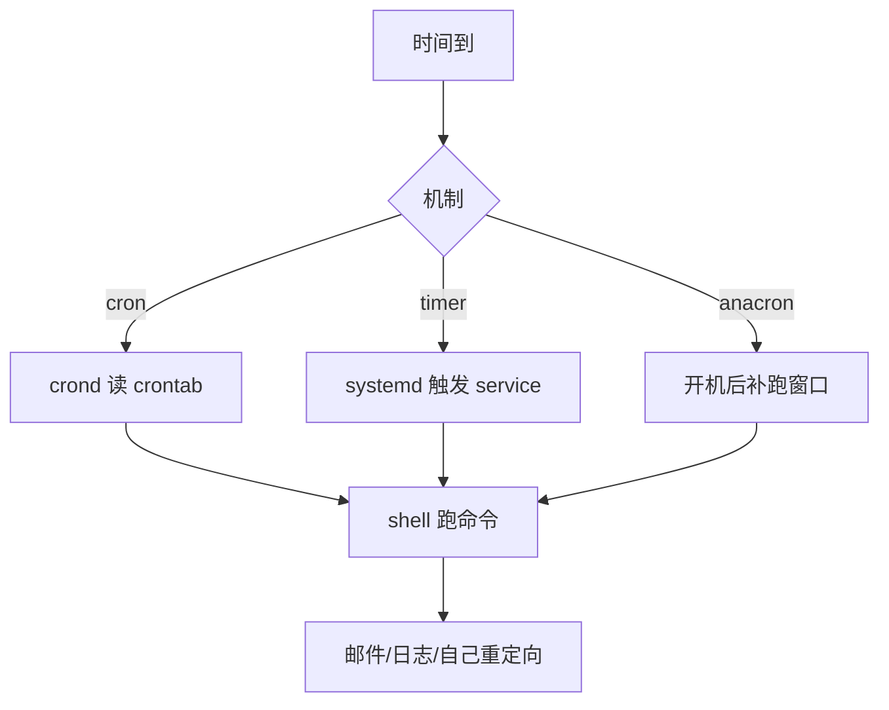

# Linux 定时任务：crontab、anacron 与 systemd timer

定时任务「漏跑、跑两次、时区错乱」，常见于 **cron 与 systemd timer 混用、休眠机器、UTC/本地时混淆**。本文对照三类机制，给出选择与排障路径。

## 源码锚点

| 路径 / 手册 | 作用 |
|-------------|------|
| `man crontab` | 用户任务表 |
| `man cron` / `/etc/cron.*` | 系统 cron 目录 |
| `man anacron` | 非 7×24 主机补跑 |
| `man systemd.timer` | timer 单元 |
| `man systemd.time` | 日历与单调时间表达式 |

timer 示例：

```ini
[Unit]
Description=Run backup daily

[Timer]
OnCalendar=*-*-* 02:30:00
Persistent=true

[Install]
WantedBy=timers.target
```

配套 `backup.service` 写实际 `ExecStart=`。

## 调用链



## 重点知识

### crontab 要点

```bash
crontab -e
# m h dom mon dow command
grep CRON /var/log/syslog 2>/dev/null | tail
journalctl -u cron -b | tail
```

默认环境变量极少（常只有 `SHELL`/`PATH` 子集）。脚本应用绝对路径，输出重定向到日志。

### systemd timer 优点

- 依赖、资源限制、沙箱可复用 service 能力。
- `systemctl list-timers` 一眼看下次触发。
- `Persistent=true` 利于休眠后补跑。

```bash
systemctl list-timers --all
systemctl status backup.timer backup.service
```

### 何时用谁

| 场景 | 更合适 |
|------|--------|
| 用户级简单脚本 | crontab |
| 要可靠依赖/日志/权限 | systemd timer |
| 桌面/笔记本非全天开机 | anacron 或 Persistent timer |

### 常见坑

- 夏令时/时区：`timedatectl` 先确认。
- cron 里 `%` 有特殊含义，需转义。
- 同时装 timer 与 crontab 跑同一任务 → 双份执行。
