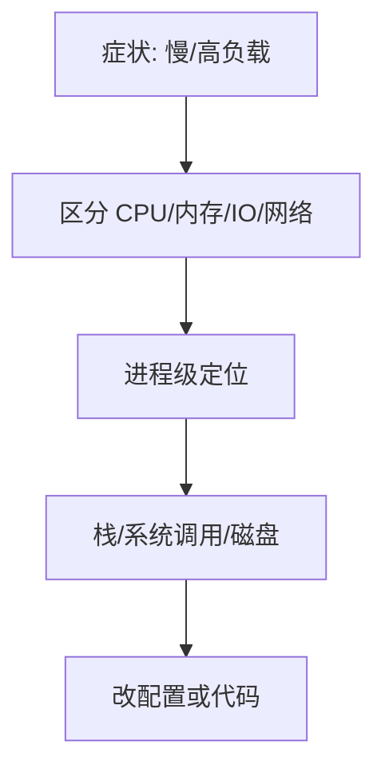

# Linux 性能监控：CPU、内存、IO 与常用工具

负载高不一定是 CPU 忙，也可能是 **IO 等待、软中断、内存回收**。先建立「看什么指标」，再用工具验证。

## 源码锚点

| 路径 / 手册 | 作用 |
|-------------|------|
| `/proc/stat` `/proc/meminfo` `/proc/diskstats` | 内核计数 |
| `man top` / `man htop` | 交互观察 |
| `man pidstat` `man iostat` `man vmstat` | sysstat |
| `man perf` | 采样分析 |

## 调用链



## 重点知识

### 一分钟定位

```bash
uptime
vmstat 1 5
free -h
iostat -xz 1 5
mpstat -P ALL 1 5
```

- `wa` 高 → IO；`si/hi` 高 → 中断/软中断。
- `free` 看 `available`，不要只看 `used`。

### 进程级

```bash
pidstat -u -r -d 1 5
ps aux --sort=-%cpu | head
ps aux --sort=-%mem | head
```

### 深一点

```bash
perf top
perf record -g -- sleep 10; perf report
```

嵌入式无 perf 时，退回 `/proc` 与应用内埋点。

### 常见误判

- 负载 = 可运行+不可中断睡眠队列长度，不等于「CPU 百分比」。
- 缓存占用大不是泄漏；看 reclaim 与 `MemAvailable`。
