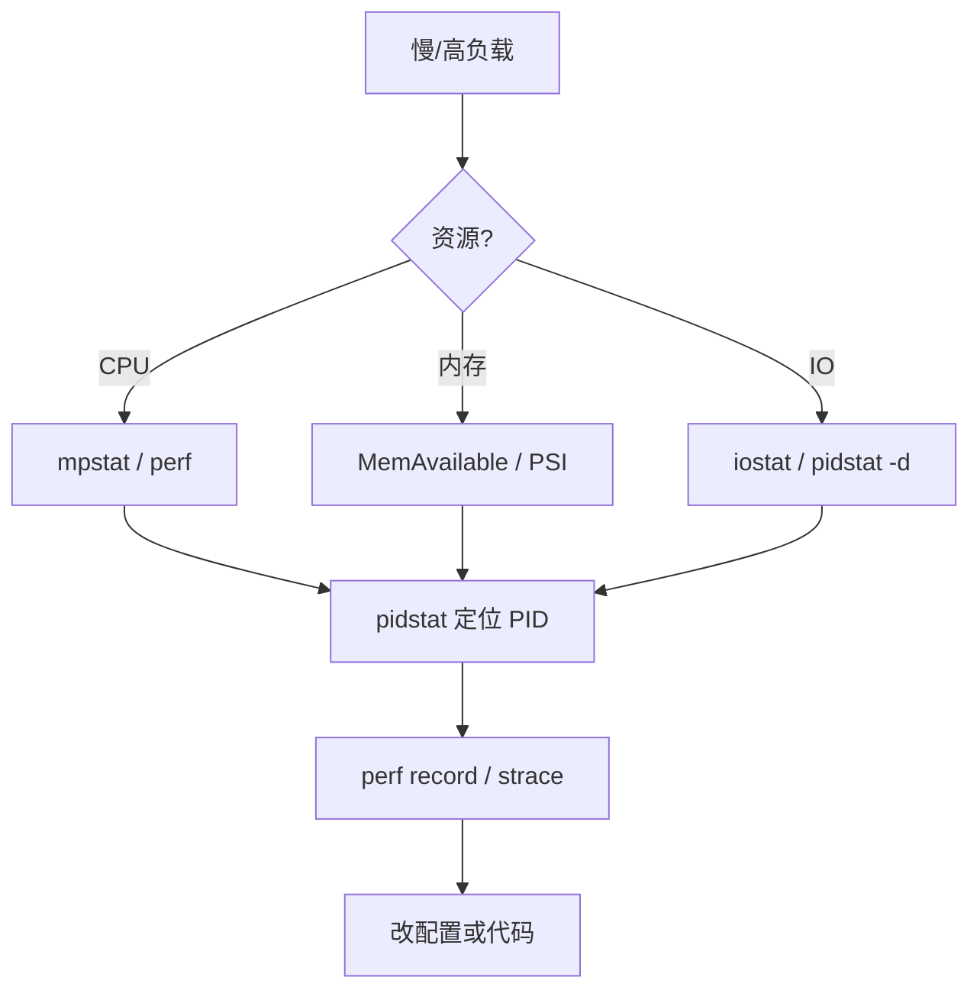
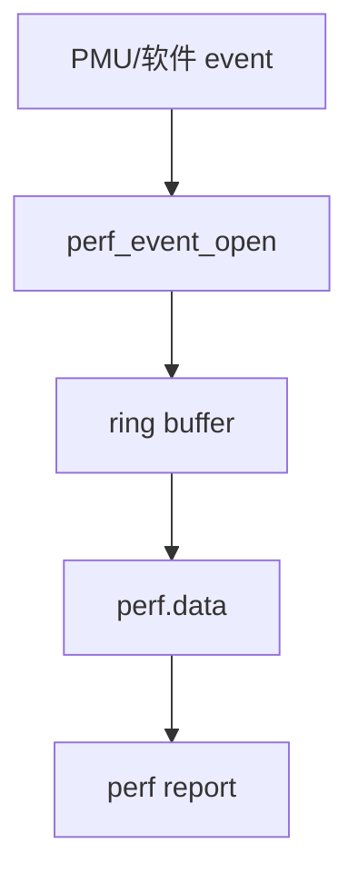

# Linux 性能监控完整篇：load、/proc、sysstat 与 perf 误判排障

负载 32 但 CPU 空闲、内存 used 90% 却还能跑、`iowait` 飙高找不到进程——三类误判都来自 **把单一指标当结论**。load average 是运行队列长度（含 D 状态）；`free` 的 used 含可回收 cache；IO 瓶颈可能在块层而非某个 PID 的 `%CPU`。

本文合并 Linux 运维 chapter 079–084（源文为提纲），从 **`/proc` 计数 → vmstat/iostat/mpstat/pidstat → perf** 建立可复现观测路径，并覆盖嵌入式裁剪场景。

---

## 源码锚点

| 路径 | 作用 |
|------|------|
| `/proc/stat` | CPU jiffies、ctxt、processes |
| `/proc/meminfo` | MemAvailable、Cached、Swap |
| `/proc/vmstat` | pgfault、pgscan、oom_kill |
| `/proc/loadavg` | 1/5/15 load |
| `/proc/diskstats` | 块设备 IO 计数 |
| `/proc/PID/stat` `status` `io` `smaps` | 进程资源 |
| `/proc/interrupts` `/proc/softirqs` | 中断 |
| `/proc/pressure/{cpu,memory,io}` | PSI（5.x+） |
| `kernel/sched/loadavg.c` | load 计算 |
| `kernel/events/core.c` | perf_event |
| `man proc`(5) | /proc 字段 |
| `man vmstat`(8) `iostat`(8) `mpstat`(8) `pidstat`(8) | sysstat |
| `man perf`(1) | perf 采样 |

---

## 调用链

### 从症状到根因



### /proc 到工具

```mermaid
flowchart LR
    SCHED[scheduler] --> STAT[/proc/stat]
    MM[mm] --> MEM[/proc/meminfo]
    BLK[block] --> DS[/proc/diskstats]
    STAT --> vmstat & mpstat
    DS --> iostat
    MEM --> vmstat
    STAT --> perf
```

### perf 采样



---

## 重点知识

### 1. load average 不是 CPU%

`/proc/loadavg` 来自 `kernel/sched/loadavg.c`：可运行 + 不可中断（D）任务的指数移动平均。

```bash
uptime
cat /proc/loadavg
nproc
```

| 组合 | 含义 |
|------|------|
| load 高 + idle 高 | D 状态（IO）或尖峰 |
| load ≈ CPU 核数 | 常正常 |
| load >> 核数 + us+sy 高 | CPU 饱和 |

```bash
ps aux | awk '$8 ~ /D/ {print $0}'
mpstat -P ALL 1 3
```

### 2. vmstat

```bash
vmstat 1 5
# procs r b | memory swpd free buff cache | swap si so | io bi bo | system in cs | cpu us sy id wa st
```

| 列 | 解读 |
|----|------|
| r | 运行队列长度 |
| b | 阻塞任务（多为 D） |
| si/so | swap 进出；持续非 0 危险 |
| bi/bo | 块 IO KB/s |
| wa | iowait 占比 |
| st | 虚拟化 steal |

```bash
vmstat -d 1 3
vmstat -m
```

### 3. iostat

```bash
iostat -xz 1 5
# await ms, %util
```

await 与 util 同高 → 磁盘忙。SSD 上 util 100% 仍可能有队列深度。

```bash
pidstat -d 1 5
iotop -o
iostat -c 1 5
```

### 4. mpstat

```bash
mpstat -P ALL 1 5
```

单核 `%usr` 100% → 线程未 spread。`%soft` 高查 `/proc/softirqs`（NET_RX、BLOCK）。

### 5. pidstat

```bash
pidstat -u -r -d -w 1 5
pidstat -t -p PID 1
ps aux --sort=-%cpu | head
ps aux --sort=-%mem | head
top -H -p PID
```

### 6. /proc/stat 算 CPU

```bash
grep '^cpu ' /proc/stat
# user nice system idle iowait irq softirq steal guest
```

两次采样差分：各字段 delta / total delta = 占比。`idle+iowait` 不应单独当「空闲」而不看 wa。

### 7. /proc/meminfo

```bash
grep -E 'MemTotal|MemFree|MemAvailable|Cached|SReclaimable|Swap' /proc/meminfo
free -h
cat /proc/pressure/memory
```

**MemAvailable** 是能否再分配的关键；Cached 大可回收。OOM 前看 swap si/so 与 `oom_kill` in vmstat。

### 8. /proc/vmstat

```bash
grep -E 'pgscan|pgsteal|pgfault|oom_kill|thp_' /proc/vmstat
```

pgscan 高 steal 低 → 内存压力真实；不是「used 大」alone。

### 9. /proc/diskstats

```bash
cat /proc/diskstats
```

字段见 `Documentation/ABI/testing/procfs-diskstats`。iostat 数据源；手工算 IOPS = delta(rio+wio)/Δt。

### 10. /proc/PID

```bash
cat /proc/PID/status | grep -E 'VmRSS|VmSwap|Threads'
cat /proc/PID/io
grep Pss /proc/PID/smaps_rollup
```

PSS 适合 shared lib；`read_bytes` 累计 IO。

### 11. perf 基础

```bash
perf list
perf stat -e cycles,instructions,cache-misses -- ./app
perf top
perf record -F 99 -g -- sleep 10
perf report --stdio | head -60
sysctl kernel.perf_event_paranoid
```

`-g` 需要 frame pointer 或 debug symbols。

### 12. perf 与火焰图

```bash
perf record -F 99 -a -g -- sleep 30
perf script | stackcollapse-perf.pl | flamegraph.pl > fg.svg
```

无符号 → 安装 debuginfo 包。

### 13. sar 历史

```bash
sar -u 1 3
sar -r
sar -b
sar -n DEV
ls /var/log/sysstat/
```

依赖 sysstat cron；incident 对比 yesterday `sar -f /var/log/sysstat/saXX`。

### 14. PSI

```bash
cat /proc/pressure/cpu
cat /proc/pressure/memory
cat /proc/pressure/io
```

`avg10` 持续 >10：10s 内资源导致 stall。

### 15. CPU 误判

| 误判 | 验证 |
|------|------|
| load=CPU% | mpstat + D 状态 |
| 单进程 200% CPU | top -H 多线程 |
| sy 高 | perf trace syscalls |
| 容器内 CPU 低 | cgroup cpu.stat |

### 16. 内存误判

| 误判 | 验证 |
|------|------|
| free 少 | MemAvailable |
| RSS 涨=泄漏 | smaps, pmap |
| swap 用=慢 | si/so 持续 + major fault |

### 17. IO 误判

| 误判 | 验证 |
|------|------|
| wa 高=磁盘坏 | NFS, iotop |
| await 低 util 高 | SSD 队列 |
| CPU 低但慢 | pidstat -d, strace |

### 18. 一分钟脚本

```bash
echo '=== uptime ==='; uptime
echo '=== vmstat ==='; vmstat 1 3
echo '=== mem ==='; free -h; grep MemAvailable /proc/meminfo
echo '=== disk ==='; iostat -xz 1 2
echo '=== mpstat ==='; mpstat -P ALL 1 2
echo '=== top cpu/mem ==='; ps aux --sort=-%cpu | head -3; ps aux --sort=-%mem | head -3
echo '=== D state ==='; ps aux | awk '$8~/D/'
echo '=== psi ==='; cat /proc/pressure/* 2>/dev/null
```

### 19. 嵌入式裁剪

| 手段 | 说明 |
|------|------|
| `/proc/loadavg` | 零依赖 |
| BusyBox top/ps | 极小 |
| tracefs ftrace | 内核自带 |
| getrusage 埋点 | 应用内 |
| 静态 perf | 需 CONFIG + 符号 |

```bash
while sleep 5; do cat /proc/loadavg; done
```

### 20. 网络 CPU

```bash
ss -s
ss -ti | grep -i retrans
cat /proc/net/softnet_stat
nstat -az | grep -i retrans
```

重传高 → 链路问题，非 CPU 算力。

### 21. cgroup

```bash
systemd-cgtop
cat /sys/fs/cgroup/system.slice/*/cpu.stat
cat /sys/fs/cgroup/system.slice/*/memory.current
docker stats --no-stream
```

CPU quota 导致 load 高但 `%CPU` 显示 capped。

### 22. 中断亲和

```bash
cat /proc/interrupts | grep eth0
cat /proc/irq/N/smp_affinity_list
grep soft /proc/softirqs
```

### 23. OOM

```bash
dmesg | grep -i oom
journalctl -k | grep oom
grep oom_kill /proc/vmstat
cat /proc/PID/oom_score_adj
```

### 24. strace 点杀

```bash
strace -c -p PID
strace -T -e trace=read,write -p PID
```

生产短时 `-c` 统计即可。

### 25. 小结

先 **load/vmstat 定性**，再 **iostat/pidstat 定位**，最后 **perf 看栈**。内存看 MemAvailable 与 PSI，IO 看 await 与 D 状态。

### 26. /proc/stat 字段逐项

| 字段 | 含义 |
|------|------|
| user | 用户态 jiffies |
| nice | 低优先级用户态 |
| system | 内核态 |
| idle | 空闲 |
| iowait | 等 IO（idle 子集） |
| irq | 硬中断处理 |
| softirq | 软中断 |
| steal | 虚拟化被偷 |
| guest | 运行虚拟机 |

### 27. vmstat 输出示例解读

```
procs -----------memory---------- ---swap-- -----io---- -system-- ------cpu-----
 r  b   swpd   free   buff  cache   si   so    bi    bo   in   cs us sy id wa st
 2  1      0 123456  12345 234567    0    0    10    20 5000 8000 10  5 70 15  0
```

- `r=2`：两进程争 CPU；`b=1`：一进程 D 状态
- `wa=15`：优先 iostat/pidstat -d
- `si/so=0`：未 swap 抖动

### 28. iostat 扩展列

```bash
iostat -xmd 1 3   # -m MB, -d 设备, -x 扩展
```

r_await / w_await 读写分开；svctm 已废弃勿用。

### 29. mpstat 与单核热点

```bash
mpstat -P ALL 1 1 | tail -n +4 | sort -k12 -n | head
```

### 30. top 批模式

```bash
top -b -n1 -o %CPU | head -20
top -b -n1 -o %MEM | head -20
```

### 31. 案例：MySQL 慢但 CPU 低

wa 30%，iostat await 50ms，pidstat -d 见 mysqld。磁盘或 innodb_io_capacity；非加 CPU。

验证命令留档：`uptime`/`vmstat`/`iostat`/`pidstat` 输出各一屏。

### 32. 案例：Java 堆满但 MemAvailable 足

RSS 大 + 堆内对象；看 smaps 与 GC 日志，不是 OS OOM。

验证命令留档：`uptime`/`vmstat`/`iostat`/`pidstat` 输出各一屏。

### 33. 案例：Nginx worker 一核 100%

mpstat 见 cpu3 100%；`top -H` 绑 worker 到多核或 `worker_processes auto`。

验证命令留档：`uptime`/`vmstat`/`iostat`/`pidstat` 输出各一屏。

### 34. 案例：kswapd 占 CPU

vmstat 见 si/so；MemAvailable 低；减 cache 占用或增 RAM。

验证命令留档：`uptime`/`vmstat`/`iostat`/`pidstat` 输出各一屏。

### 35. 案例：软中断 NET_RX 高

小包风暴；RPS/RFS、GRO、驱动升级。

验证命令留档：`uptime`/`vmstat`/`iostat`/`pidstat` 输出各一屏。

### 36. 案例：steal 高

云主机超售；换规格或宿主机。

验证命令留档：`uptime`/`vmstat`/`iostat`/`pidstat` 输出各一屏。

### 37. 案例：load 尖刺 cron

cron 短任务堆积；load 1min 高但 15min 低。

验证命令留档：`uptime`/`vmstat`/`iostat`/`pidstat` 输出各一屏。

### 38. 案例：fio 压测对照

变更前后 `fio --name=t --rw=randread --bs=4k --iodepth=32 --runtime=30` 固定 baseline。

验证命令留档：`uptime`/`vmstat`/`iostat`/`pidstat` 输出各一屏。

### 39. 案例：perf paranoid

非 root perf：`sysctl -w kernel.perf_event_paranoid=2` 或组 `@perf_event`。

验证命令留档：`uptime`/`vmstat`/`iostat`/`pidstat` 输出各一屏。

### 40. 案例：kptr_restrict

perf 内核符号：`sysctl kernel.kptr_restrict=0` 仅调试机。

验证命令留档：`uptime`/`vmstat`/`iostat`/`pidstat` 输出各一屏。

### 41. sysstat 安装与启用

```bash
# Debian/Ubuntu
apt install sysstat && sed -i 's/ENABLED="false"/ENABLED="true"/' /etc/default/sysstat
systemctl enable --now sysstat
# RHEL
yum install sysstat && systemctl enable --now sysstat
```

### 42. 容器 host 视图

在 host 上 `pidstat -p $(docker inspect --format '{{.State.Pid}}' cid)` 看真实消耗。

### 43. Kubernetes 节点

```bash
kubectl top node
kubectl describe node | grep -A5 Conditions
```
DiskPressure/MemoryPressure 触发 eviction。

### 44. 延迟百分位

应用层 histogram（Prometheus histogram_quantile）比 avg CPU 更能反映尾延迟。

### 45. 观测纪律

一次 incident 只改一个变量；baseline 与 after 用相同负载脚本；保存原始 `/proc` 快照。
### 46. top 交互字段

| 字段 | 含义 |
|------|------|
| VIRT | 虚拟地址空间 |
| RES | 常驻物理页 |
| SHR | 共享页 |
| %CPU | 采样窗口内核态+用户态占比 |
| TIME+ | 累计 CPU 时间 |
| ni | nice 值 |

```bash
top -b -n1 -1 -p PID    # 单进程
top -H -p PID           # 线程
```

### 47. htop 与 lsof

```bash
htop -d 10
lsof -p PID | wc -l
ls /proc/PID/fd | wc -l
cat /proc/sys/fs/file-nr
```

fd 接近系统上限时表现为 connect/open 失败，而非 CPU 高。

### 48. free 各列

```bash
free -h -w    # wide，含 shared
```

- **available**（新 free）：≈ MemAvailable
- **buff/cache**：可回收页缓存
- 不要用 `used/total` 单比值判断 OOM

### 49. swappiness 与 refault

```bash
sysctl vm.swappiness
grep pgmajfault /proc/vmstat
grep refault /proc/vmstat 2>/dev/null
```

major fault 持续升 → 真实内存压力；swappiness 只影响回收积极性。

### 50. 块层 queue 与 scheduler

```bash
cat /sys/block/vda/queue/scheduler
cat /sys/block/nvme0n1/queue/nr_requests
cat /sys/block/vda/queue/read_ahead_kb
```

变更 scheduler 前后各跑 30s `iostat -xz 1`，对比 await 分布。

### 51. NFS / 网络文件系统

```bash
nfsstat -c
nfsiostat 1 3
mount | grep nfs
```

本地 `wa` 高但磁盘 util 低 → 可能是 NFS 客户端等服务器。

### 52. 软中断与 RPS

```bash
cat /proc/softirqs
grep NET_RX /proc/softirqs
```

多队列网卡未开 RPS 时单 CPU soft 飙高：

```bash
echo f > /sys/class/net/eth0/queues/rx-0/rps_cpus   # 按 CPU 掩码设
```

### 53. numa 与跨节点

```bash
numactl --hardware
numastat -p PID
grep NUMA /proc/PID/numa_maps 2>/dev/null
```

远程节点访问拉高 latency 与 `sys`。

### 54. THP 透明大页

```bash
cat /sys/kernel/mm/transparent_hugepage/enabled
grep thp_ /proc/vmstat
```

数据库/Redis 常建议 `madvise` 或 `never`；latency 尖刺先查 THP 合并/分裂。

### 55. perf stat 事件组

```bash
perf stat -e cycles,instructions,cache-references,cache-misses,branch-misses -- ./app
# IPC = instructions/cycles
```

IPC 低 + cache-miss 高 → 内存/缓存问题；IPC 正常 cycles 高 → 真 CPU 算力。

### 56. perf record 采样率

```bash
perf record -F 99 -g --call-graph dwarf,8192 -- sleep 10
perf record -e cpu-clock -g -- ./app
```

频率过高扰动 workload；生产 49–99Hz 常见。

### 57. perf top 实时

```bash
perf top -e cpu-clock --sort comm,dso
perf top -K -e cycles:u    # 仅用户态
```

### 58. bpftrace 一行观测

```bash
bpftrace -e 'tracepoint:syscalls:sys_enter_openat / comm == "myapp" / { @[args->filename] = count(); }'
bpftrace -e 'kprobe:vfs_read { @bytes = hist(nbytes); }'
```

需 CAP_BPF；短时运行。

### 59. ftrace function_graph

```bash
cd /sys/kernel/tracing
echo function_graph > current_tracer
echo do_sys_openat2 > set_graph_function
echo 1 > tracing_on
head trace
echo 0 > tracing_on
```

看清内核函数耗时轮廓；勿长期开。

### 60. trace-cmd / sched 延迟

```bash
trace-cmd record -e sched:sched_switch -e sched:sched_wakeup sleep 5
trace-cmd report | less
```

唤醒链：谁 sleep、谁 wake、延迟多久。

### 61. cyclictest（RT）

```bash
cyclictest -p 80 -t 4 -n 100000 -m -a 0-3
```

max latency 与 avg 分开记录；与 load 高但 idle 高并存时查 RT 线程。

### 62. stress-ng 对照负载

```bash
stress-ng --cpu 4 --timeout 60s &
vmstat 1
mpstat -P ALL 1
```

建立可控 baseline 再对比调优参数。

### 63. /proc/net/dev

```bash
cat /proc/net/dev
nload eth0
sar -n DEV 1 3
```

RX/TX errors、drops 高 → 驱动/ ring 不足，表现为「网络慢像 CPU 忙」。

### 64. ss 与 backlog

```bash
ss -lnt
ss -s
ss -tan state time-wait | wc -l
```

SYN backlog 满表现为 connect timeout，top 仍 idle。

### 65. systemd-cgtop 与 slice

```bash
systemd-cgtop
systemctl status user.slice
cat /sys/fs/cgroup/user.slice/user-1000.slice/memory.current
```

用户 session 泄漏内存占 cgroup quota。

### 66. docker stats 与 cgroup v2

```bash
docker stats --no-stream
cat /sys/fs/cgroup/system.slice/docker-*.scope/memory.max
cat /sys/fs/cgroup/system.slice/docker-*.scope/cpu.stat
```

`cpu.stat` 中 `usage_usec`、`nr_throttled` 看限流。

### 67. 嵌入式：/proc 最小集

无 sysstat 时周期性采集：

```sh
DATE=$(date -Iseconds)
LOAD=$(cut -d' ' -f1-3 /proc/loadavg)
MEM=$(grep MemAvailable /proc/meminfo)
echo "$DATE $LOAD $MEM" >> /var/log/minimal-metrics.log
```

### 68. 嵌入式：BusyBox ps

```bash
ps w | sort -k7 -rn | head    # 按 VSZ 或按列调整
cat /proc/loadavg
```

列含义随 BusyBox 版本略异，以 `ps --help` 为准。

### 69. 嵌入式：drop_caches 仅实验

```bash
sync
echo 3 > /proc/sys/vm/drop_caches
```

仅测试 cache 影响；**生产勿随意**，会导致 IO 突增。

### 70. 误判：僵尸进程

```bash
ps aux | awk '$8=="Z" {print}'
```

Z 进程不占 CPU，但占 PID；大量僵尸查父进程是否 read 子 exit status。

### 71. 误判：iowait 与磁盘 util 背离

NFS、iSCSI、MD 等待时 wa 高而本地盘 util 低；用 `pidstat -d` 找读者。

### 72. 误判：steal 与 load

云主机 steal 高 → load 可能升但 guest idle 低；升级规格或迁移宿主机。

### 73. 误判：THP 与 latency

P99 尖刺、avg CPU 正常；查 THP 与 `perf stat -e page-faults`。

### 74. 完整排障剧本：Web 慢

```bash
# 1 系统
uptime; vmstat 1 3; free -h; iostat -xz 1 3
# 2 进程
pidstat -u -d 1 5; ss -s
# 3 栈
perf record -F 99 -p $(pgrep -n nginx) -g -- sleep 15
perf report --stdio | head -40
```

记录每步输出再改配置。

### 75. 完整排障剧本：批处理跑不动

```bash
mpstat -P ALL 1 5
pidstat -u 1 5 | sort -k8 -rn | head
perf top -e cycles
grep Dirty /proc/meminfo
```

单核 100% → 并行度；Dirty 高 → 回写 IO。

### 76. sar 读历史

```bash
sar -f /var/log/sysstat/sa$(date +%d) -u
sar -f /var/log/sysstat/sa$(date +%d) -r
sar -f /var/log/sysstat/sa$(date +%d) -b
```

对比 incident 前后同日时段。

### 77. nmon 快照

```bash
nmon -f -s 10 -c 30   # 10s 间隔 30 次
# 生成 nmon 文件用 nmon analyzer 或 nmonchart
```

### 78. glances 一体化

```bash
glances -1    # 单核视图
glances --export csv --export-csv-file /tmp/g.csv
```

### 79. /proc/schedstat

```bash
cat /proc/PID/schedstat
# 格式因内核版本：time_on_cpu, time_waiting, timeslices
```

waiting 高 → 等 CPU；结合 mpstat 队列。

### 80. pressure stall 与 OOM score

```bash
cat /proc/pressure/memory
cat /proc/PID/oom_score
echo -100 > /proc/PID/oom_score_adj   # 降低 OOM 优先级，需 root
```

### 81. ionice 与 blkio

```bash
ionice -c 3 -p PID    # idle class
cat /proc/PID/io
```

备份任务占满 disk 时业务 await 升；ionice/nice 分离 CPU 与 IO 优先级。

### 82. 时钟与 NTP

```bash
timedatectl
chronyc tracking
```

时间跳变影响日志关联与 TLS；与 perf 采样窗口对齐。

### 83. 内核版本与工具版本

```bash
uname -r
perf --version
vmstat -V
```

文档字段以本机 `man proc` 为准；内核升级后 PSI/tracepoint 可能新增。

### 84. 保存证据包

```bash
mkdir /tmp/incident-$(date +%s) && cd $_
uptime > uptime.txt
vmstat 1 5 > vmstat.txt
free -h > free.txt
iostat -xz 1 5 > iostat.txt
mpstat -P ALL 1 5 > mpstat.txt
ps auxf > ps.txt
grep -E '.' /proc/pressure/* > psi.txt 2>/dev/null
tar czf ../incident.tgz .
```

### 85. 与开发协作：flame graph

把 `perf script` 输出给开发；注明负载、版本、是否 container 内采集。

### 86. 容量规划指标

长期保留：P95 CPU、P99 latency、磁盘 await P95、swap si 非零分钟数、PSI avg10 超阈次数。

### 87. 小结

**load/vmstat 定性 → iostat/pidstat 定位 → perf 看栈**；内存看 MemAvailable 与 PSI；IO 看 await 与 D 状态；嵌入式退化到 `/proc` 周期采集，原则不变。

### 88. dstat 多资源

```bash
dstat -tcndylp --top-cpu --top-io 1 5
```

同时看 CPU/磁盘/net；无 dstat 时用 vmstat+iostat 组合。


### 89. nstat 网络栈计数

```bash
nstat -az | head -30
nstat -s  # 汇总
```

TcpRetransSegs 增 → 重传；与 perf 无关的网络慢。


### 90. turbostat 电源/CPU

```bash
turbostat --Summary --Interval 1 --Count 5
```

Intel/AMD 服务器看 C-state 驻留；CPU 「空闲」可能在 deep C-state 唤醒慢。


### 91. turboboost 与频率

```bash
grep MHz /proc/cpuinfo
cat /sys/devices/system/cpu/cpu0/cpufreq/scaling_governor
```

降频表现为 sy+us 不高但任务慢；`cpupower frequency-info`。


### 92. memtier / redis 压测对照

应用层 benchmark 与 OS 指标同屏采集；OS CPU 低但 QPS 低 → 锁/单线程/外部依赖。


### 93. /proc/buddyinfo

```bash
cat /proc/buddyinfo
grep -i frag /proc/pagetypeinfo
```

内存碎片化严重时分配慢、direct reclaim 多；看 `dmesg` page allocation failure。


### 94. slabtop

```bash
slabtop -o
grep -i slab /proc/meminfo
```

内核 slab 泄漏表现为 `SUnreclaim` 持续涨。


### 95. perf mem 内存访问

```bash
perf mem record ./app
perf mem report
```

load/store 延迟与 NUMA 节点；需硬件支持。


### 96. perf lock 争用

```bash
perf lock record ./app
perf lock report
```

用户态 mutex 争用；表现为 CPU 不高但吞吐低。


### 97. 容器 perf 进 pid namespace

```bash
nsenter -t $(docker inspect --format '{{.State.Pid}}' cid) -p perf record -g -p 1 -- sleep 5
```

或在 host 上 `-p` 容器 init PID。


### 98. 指标告警阈值示例

| 指标 | 关注阈值（视 SLA 调整） |
|------|----------------------|
| load_1min | > 2× CPU 核数持续 5min |
| MemAvailable | < 10% MemTotal |
| iowait | > 20% 持续 |
| await | > 2× baseline |
| PSI memory avg10 | > 25 |


### 99. 文档化 ADR 模板

Incident 报告含：现象、时间线、命令输出摘要、根因、修复、回归负载结果。便于下次同类问题 5 分钟定性。


### 100. 终章小结

性能监控的本质是 **分层排除**：系统 → 进程 → 栈 → 配置。掌握 `/proc` 读法与 sysstat/perf 工具链，嵌入式与服务器同源；切忌单指标下结论。

