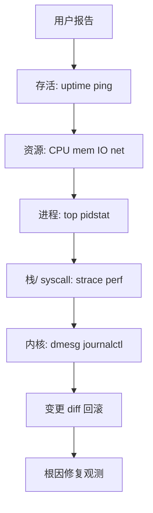
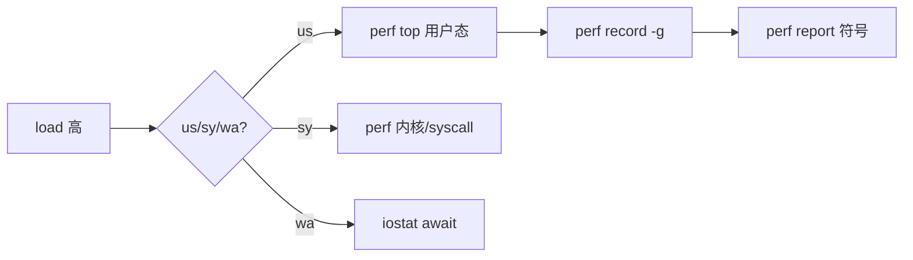
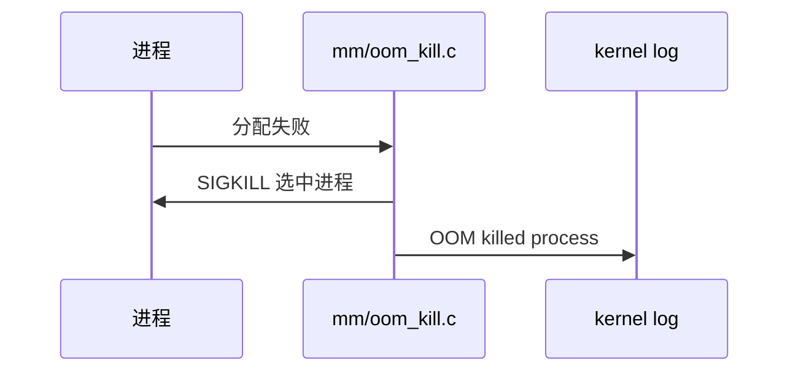

# Linux 故障排查完整篇：从 CPU/内存/IO/网络到内核日志闭环

线上「CPU 不高却卡顿」「内存还有却 OOM」「ping 通但业务超时」——需要 **分层排查：现象→资源→进程→内核→变更** 闭环。本文按 `/proc`、`sysstat`、`perf`、`journalctl` 真实路径展开。

## 源码锚点

| 路径 / 工具 | 作用 |
|-------------|------|
| /proc/stat | CPU jiffies |
| /proc/meminfo | 内存明细 |
| /proc/loadavg | R 队列 |
| /proc/PID/status | VmRSS/State |
| /proc/PID/smaps_rollup | PSS 内存 |
| /proc/diskstats | 块 IO |
| /proc/net/dev | 网卡计数 |
| /proc/net/tcp | TCP 表 |
| /sys/block/*/stat | 磁盘统计 |
| kernel/sched/core.c | CFS 调度 |
| mm/vmscan.c | 内存回收 |
| block/blk-core.c | 块 IO |
| net/core/dev.c | 网络设备 |
| man top | 交互 CPU/内存 |
| man pidstat | 按进程统计 |
| man vmstat | r/b/swap |
| man iostat | 磁盘利用率 |
| man sar | 历史 sysstat |
| man perf | 采样 profiling |
| man trace-cmd | ftrace |
| man journalctl | systemd 日志 |
| man dmesg | 内核 ring buffer |
| man ss | socket |
| man tcpdump | 抓包 |
| man core(5) | coredump |

```bash
vmstat 1 5; pidstat -u -r -d 1 3; journalctl -p err -b --no-pager | tail -20
```

## 调用链

### 分层排查闭环



### CPU 高 → 热点



### 内存 OOM 链



## 重点知识

### 分层排查与 USE 方法

自上而下：现象→主机→进程→内核→变更。复现优先；二分隔离版本/机房/节点。

USE：Utilization 利用率、Saturation 排队、Errors 错误；CPU/内存/磁盘/网络各过一遍。

```bash
uptime
free -h
vmstat 1 3
iostat -xz 1 3
ss -s
```

### CPU：top、pidstat、load

`top` 行 `%Cpu(s)`：us 用户、sy 内核、wa IO 等待、st steal。load average 是可运行+不可中断任务数，不等于 CPU%。

16 核机器 load 16 表示满负载；单核 load 16 表示严重排队。结合 `nproc` 与 mpstat 各核分布。

| 项 | 说明 |
|----|------|
| load 高 us 低 | 等 IO 或锁 |
| 单核 100% | 线程热点 |

```bash
top -bn1 | head -20
mpstat -P ALL 1 3
pidstat -u -h -p ALL 1 3
ps -eo pid,cmd,%cpu --sort=-%cpu | head
```

### 内存：free、vmstat、smaps

`MemAvailable` 比 `free` 更能反映可分配内存。Cached/Buffer 可回收；AnonPages 难回收。

OOM：`dmesg`/`journalctl -k` 含 `Out of memory`；`oom_score_adj` 影响牺牲顺序（-1000 到 1000）。

```bash
grep MemAvailable /proc/meminfo
pidstat -r -p PID 1 3
cat /proc/PID/smaps_rollup
dmesg -T | grep -i oom
```

### IO：iostat、pidstat -d

`iostat -x`：`%util`≈100% 表示磁盘饱和；`await` 平均 IO 延迟。vmstat 的 `b` 为不可中断睡眠进程数。

区分 rotational（HDD）与 SSD；`lsblk -d -o NAME,ROTA` 查是否旋转介质。

```bash
iostat -xz 1 5
pidstat -d 1 5
cat /proc/diskstats
iotop -o -b -n 3
```

### 网络：ss、sar、tcpdump

`ss -tan` 看 ESTAB/TIME-WAIT/SYN-RECV；`ss -ti` 看 tcp_info 的 rtt/cwnd。

ping 通但业务超时：查 DNS、MTU、防火墙、应用层连接池、TLS。

```bash
ss -s
ss -tan state time-wait | wc -l
sar -n DEV 1 3
tcpdump -i any -nn host REMOTE and port 443 -c 20
```

### perf 与 ftrace

`perf record -g` 采样调用栈；`perf stat` 计数 cache miss/syscalls。需 CAP_SYS_ADMIN 或调整 `kernel.perf_event_paranoid`。

ftrace：`trace-cmd record -e sched_switch` 或 debugfs `/sys/kernel/debug/tracing/`。

```bash
perf top
perf record -a -g -- sleep 10
perf report --stdio | head -60
perf stat -p PID sleep 5
```

### journalctl 与 dmesg

`journalctl -b` 本次启动；`-k` 仅内核；`-u unit` 服务；`-p err..alert` 高优先级。

时间线对齐：业务日志 timestamp 与 `journalctl --since` 交叉；`-b -1` 上次启动。

```bash
journalctl -p err -b --no-pager
journalctl -k -b | tail -40
dmesg -T --level=err,warn
journalctl --disk-usage
```

### coredump 分析

systemd-coredump：`/proc/sys/kernel/core_pattern` 管道到 systemd-coredump；`coredumpctl list` 列记录。

分析：`coredumpctl gdb /path/to/binary` 或 `gdb core PID`。

```bash
ulimit -c unlimited
sysctl kernel.core_pattern
coredumpctl list | tail
coredumpctl info PID
```

### 常见故障树

整机慢且 wa 高→磁盘瓶颈→iostat/iotop。单服务慢→该 PID CPU/IO→pidstat/strace。

刚发布才出现→配置/代码 diff→回滚验证。凌晨定时→cron/timer→journalctl --since。

| 项 | 说明 |
|----|------|
| 现象 | 下一步 |
| CPU us 100% | perf top -p PID |
| 内存 OOM | dmesg oom; smaps |
| 连接超时 | ss; tcpdump |
| D 状态多 | cat /proc/PID/stack |

### 故障场景命令链

#### CPU us 100%

```bash
top -bn1 | head -15
pidstat -u 1 5
perf top -p PID
perf record -g -p PID -- sleep 30
perf report --stdio
```

#### load 高 CPU 低

```bash
uptime
vmstat 1
ps aux | awk '$8~/D/'
cat /proc/PID/stack
```

#### 内存 OOM

```bash
dmesg -T | grep -i oom
journalctl -k | grep -i oom
cat /proc/PID/oom_score_adj
```

#### swap thrash

```bash
vmstat 1
free -h
cat /proc/sys/vm/swappiness
pidstat -W 1 5
```

#### 磁盘 await 高

```bash
iostat -xz 1 5
pidstat -d 1 5
iotop -o
```

#### 网络 RTT

```bash
ss -tin
ping -c 20 host
mtr -rwz host
```

#### 连接暴涨

```bash
ss -s
ss -tan state time-wait | wc -l
sysctl net.ipv4.ip_local_port_range
```

#### SYN 堆积

```bash
ss -tan state syn-recv
sysctl net.ipv4.tcp_max_syn_backlog
```

#### DNS 慢

```bash
time getent hosts example.com
dig +trace example.com
```

#### 服务超时

```bash
strace -p PID -tt -e trace=network
tcpdump -i any host remote -w /tmp/c.pcap
```

#### 内核 panic

```bash
journalctl -k -b -1
dmesg -T
kdumpctl status
```

#### fd 耗尽

```bash
lsof | wc -l
cat /proc/sys/fs/file-nr
ulimit -n
```

#### inode 耗尽

```bash
df -i
find /mount -xdev | wc -l
```

#### 僵尸进程

```bash
ps aux | awk '$8=="Z"'
grep PPid /proc/PID/status
```

#### 软锁

```bash
dmesg | grep -i watchdog
echo l > /proc/sysrq-trigger
```

#### 上下文切换多

```bash
pidstat -w 1 5
vmstat 1
perf stat -e context-switches sleep 5
```

#### cache 压力

```bash
perf stat -e cache-misses,cache-references sleep 5
free -h
```

#### NUMA 不均

```bash
numactl -H
numastat -p PID
```

#### TCP 重传

```bash
ss -ti | grep retrans
nstat -az | grep TcpRetrans
```

#### 磁盘只读

```bash
dmesg | grep -i 'read-only'
mount | grep ro,
```

#### systemd 失败

```bash
systemctl --failed
journalctl -u svc -b
```

#### 磁盘满

```bash
df -h
du -xhd1 /var | sort -hr | head
```

#### journal 满

```bash
journalctl --disk-usage
journalctl --vacuum-size=500M
```

#### CPU steal 高

```bash
mpstat -P ALL 1 3
# 虚拟化宿主机争抢
```

#### THP 问题

```bash
cat /sys/kernel/mm/transparent_hugepage/enabled
grep AnonHuge /proc/meminfo
```

### sar 与 sysstat 历史

```bash
sar -u 1 3; sar -r 1 3; sar -b 1 3; sar -n DEV 1 3; sar -q 1 3
ls /var/log/sysstat/
systemctl status sysstat  # 或 sadc cron
```

#### 工具 1：mpstat 多核

对比各 CPU 是否单核热点

```bash
mpstat -P ALL 1 2
```

#### 工具 2：dstat

CPU disk net 综合

```bash
dstat -cdngy 1 5
```

#### 工具 3：lsof 端口

占用端口的进程

```bash
lsof -i :8080
```

#### 工具 4：strace 统计

syscall 聚合计数

```bash
strace -c -p PID
```

#### 工具 5：blktrace

块层延迟

```bash
blktrace -d /dev/sda -o - | blkparse -i - | head
```

#### 工具 6：nstat

网络栈计数器

```bash
nstat -az | head
```

#### 工具 7：slabtop

内核 slab

```bash
slabtop -o | head
```

#### 工具 8：perf sched

调度延迟

```bash
perf sched record -- sleep 5; perf sched latency
```

#### 工具 9：biolatency

bcc IO 延迟分布

```bash
biolatency-bpfcc 5
```

#### 工具 10：time -v

页 fault context switch

```bash
/usr/bin/time -v cmd
```

#### 工具 11：nicstat

网卡吞吐 util

```bash
nicstat 1 3
```

#### 工具 12：iftop

连接级流量

```bash
iftop -i eth0
```

#### 工具 13：nload

实时带宽

```bash
nload eth0
```

#### 工具 14：htop

树形进程视图

```bash
htop -p PID
```

#### 工具 15：pstree

进程树

```bash
pstree -ap PID
```

#### 工具 16：systemd-cgtop

cgroup 资源

```bash
systemd-cgtop
```

#### 工具 17：pressure

PSI 压力

```bash
cat /proc/pressure/{cpu,memory,io}
```

#### 工具 18：bpftrace

eBPF 动态追踪

```bash
bpftrace -e 'tracepoint:syscalls:sys_enter_openat { @=count(); }'
```

#### 工具 19：opensnoop

跟踪 open

```bash
opensnoop-bpfcc
```

#### 工具 20：execsnoop

跟踪 exec

```bash
execsnoop-bpfcc
```

#### 工具 21：cachestat

页 cache 命中

```bash
cachestat-bpfcc 5
```

#### 工具 22：runqlat

运行队列延迟

```bash
runqlat-bpfcc 5
```

#### 工具 23：fileslower

慢文件 IO

```bash
fileslower-bpfcc
```

#### 工具 24：syscount

syscall 频率

```bash
syscount-bpfcc
```

#### 工具 25：klockstat

内核锁统计

```bash
cat /proc/lock_stat
```

#### 工具 26：ftrace function

函数图 trace

```bash
echo function > /sys/kernel/debug/tracing/current_tracer
```

#### 工具 27：kprobe

动态内核探针

```bash
perf probe --add do_sys_open
```

#### 工具 28：turbostat

Intel CPU 指标

```bash
turbostat --Summary --show Busy,IPC,PkgWatt sleep 5
```

#### 工具 29：rdmsr

硬件计数

```bash
# 需 msr 模块
```

#### 工具 30：ip -s

链路层错误计数

```bash
ip -s link show eth0
```


## 场景化命令链

### CPU 持续飙高

```bash
pidstat -u 1 5
ps -eo pid,ppid,cmd,%cpu --sort=-%cpu | head -15
perf top -g -- sleep 10
cat /proc/loadavg
mpstat -P ALL 1 3
```

### 内存泄漏嫌疑

```bash
pmap -x $(pgrep -n app)
grep -E 'VmRSS|VmSize' /proc/$(pgrep -n app)/status
valgrind --leak-check=summary ./app 2>&1 | tail -20
cat /proc/meminfo | grep -E 'Anon|Slab|SUnreclaim'
smem -rk | head
```

### 磁盘空间打满

```bash
df -hT
du -xhd1 /var | sort -hr | head
lsof +L1 | head -20
find /var/log -type f -size +100M -ls
journalctl --disk-usage
```

### 网络丢包与重传

```bash
ss -ti | head -30
netstat -s | grep -i retrans
ethtool -S eth0 | grep -i error
ping -c 20 -i 0.2 target
mtr -rwzc 50 target
```

### DNS 解析失败

```bash
resolvectl status 2>/dev/null || cat /etc/resolv.conf
dig +trace example.com
dig @8.8.8.8 example.com +stats
systemd-resolve --statistics 2>/dev/null
tcpdump -ni any port 53 -c 10
```

### 时间漂移与 NTP

```bash
timedatectl status
chronyc tracking
chronyc sources -v
ntpq -p 2>/dev/null
hwclock --show
```

### inode 耗尽

```bash
df -ih
find /var/spool -xdev -type f | wc -l
for d in /var/*; do echo $(find "$d" -xdev -type f 2>/dev/null | wc -l) $d; done | sort -n | tail
ls -li /var/spool | head
```

### 文件描述符耗尽

```bash
cat /proc/sys/fs/file-nr
ulimit -n
lsof | awk '{print $1}' | sort | uniq -c | sort -rn | head
ls /proc/$(pgrep -n nginx)/fd | wc -l
grep 'Too many open files' /var/log/syslog
```

### 内核 panic 与 kdump

```bash
grep crashkernel /proc/cmdline
systemctl status kdump
ls -lh /var/crash/*/vmcore 2>/dev/null
makedumpfile -c -d 31 /proc/vmcore dump.lzo 2>/dev/null
crash /usr/lib/debug/lib/modules/$(uname -r)/vmlinux /var/crash/*/vmcore
```

未配 kdump 时：`journalctl -k -b -1 | tail -50` 看上次的 panic 尾。

### 变更回滚

```bash
# 包回滚（RHEL 系）
dnf history list | head
dnf history undo LAST
# Debian
grep ' install ' /var/log/dpkg.log | tail -5
apt install package=1.2.3-1
```

```bash
# 配置回滚（etckeeper）
etckeeper vcs log -5
etckeeper vcs checkout HEAD~1 -- /etc/nginx/nginx.conf
nginx -t && systemctl reload nginx
```

```bash
# 容器镜像
docker history myapp:broken
docker tag myapp:good myapp:latest
kubectl rollout undo deployment/myapp
```

### 证据保全

```bash
mkdir -p /evidence/$(hostname)-case01
cd /evidence/$(hostname)-case01
ps auxww > ps.txt
ss -antp > ss.txt
iptables-save > iptables.txt 2>/dev/null
cp /var/log/syslog . 2>/dev/null
tar czf logs.tgz /var/log --ignore-failed-read
sha256sum *.txt *.tgz > MANIFEST.sha256
```

内存镜像（慎用，需足够空间）：

```bash
cat /proc/iomem | grep -i System RAM
lime-forensics /evidence/mem.lime 2>/dev/null
```

### 综合排障矩阵

| 信号 | 第一层 | 第二层 |
|------|--------|--------|
| load 高 CPU 低 | iowait | `iostat -xz 1` |
| swap 抖动 | 内存压力 | `/proc/pressure/memory` |
| 连接堆积 | 应用慢 | `ss -antp state established` |
| 单核 100% | 绑核/IRQ | `cat /proc/interrupts` |

```bash
vmstat 1 5
iostat -xz 1 3
sar -n DEV 1 3
```

### 软锁与 hung task

```bash
echo 0 > /proc/sys/kernel/hung_task_timeout_secs
dmesg | grep -i 'blocked for more than'
cat /proc/PID/stack
echo w > /proc/sysrq-trigger
```

### NFS 卡死

```bash
nfsstat -c
cat /proc/net/rpc/nfs
mount | grep nfs
strace -p $(pgrep -n nfs) -e poll 2>&1 | head
```

### TCP 半连接堆积

```bash
ss -ant state syn-recv | wc -l
sysctl net.ipv4.tcp_syncookies
nstat -az | grep -i listen
iptables -L -n -v | head
```

### 磁盘只读 remount

```bash
dmesg | grep -i 'read-only file system'
mount | grep 'ro,'
touch /tmp/t 2>&1
smartctl -H /dev/sda 2>/dev/null
```

### cgroup 内存压力拖慢

```bash
cat /proc/pressure/memory
systemd-cgtop -m | head
cat /sys/fs/cgroup/system.slice/memory.events
```

### systemd 单元反复重启

```bash
systemctl status unit -l --no-pager
journalctl -u unit -b --no-pager | tail -40
systemd-analyze critical-chain unit
coredumpctl list | tail
```

### 变更窗口与回滚检查表

```bash
snap list --all | awk '/disabled/{print $1, $3}'
helm history myrel -n prod | tail -5
git -C /etc rev-parse HEAD 2>/dev/null
rpm -qa --last | head -10
```

### 证据链哈希清单

```bash
EV=/evidence/case-$(date +%s)
mkdir -p $EV && cd $EV
cp /proc/cpuinfo /proc/meminfo /proc/cmdline .
ss -anp > ss-anp.txt
netstat -rn > routes.txt 2>/dev/null
find /var/log -type f -mtime -1 -ls > recent-logs.txt
sha256sum * > MANIFEST.sha256
```

### 延迟与排队观测

```bash
sar -q 1 5
cat /proc/schedstat
perf sched latency 2>/dev/null | head -20
```

### 块设备与文件系统只读

```bash
dmesg | grep -i 'Buffer I/O error'
cat /sys/block/sda/ro
touch /probe 2>&1 | tee /tmp/ro-test.err
```

### 线程与锁竞争

```bash
ps -eLf | wc -l
cat /proc/loadavg
perf lock record sleep 5 2>/dev/null; perf lock report 2>/dev/null | head
```

### 路由与策略路由

```bash
ip rule list
ip route show table all | head -20
tracepath example.com
```

### 容器节点排障

```bash
crictl ps -a | head
journalctl -u kubelet -n 30 --no-pager
dmesg | grep -i cgroup | tail
```

### 收尾：归档本次排查包

```bash
tar czf /tmp/triage-$(hostname)-$(date +%F).tgz /evidence 2>/dev/null
ls -lh /tmp/triage-*.tgz 2>/dev/null | tail -1
```


#### 指标延伸 1

```bash
cat /proc/loadavg
```

