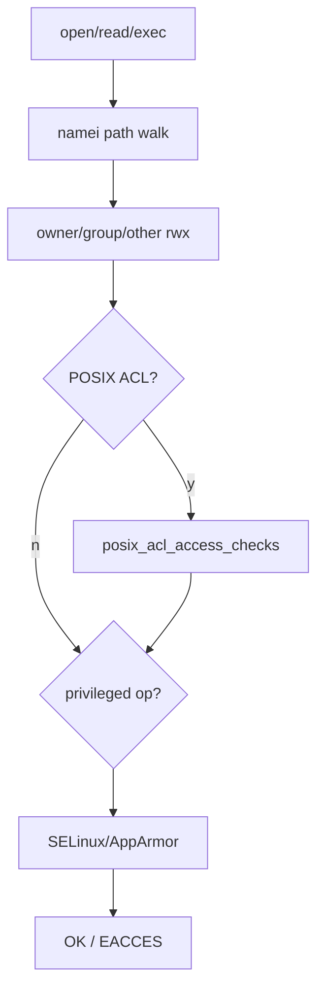
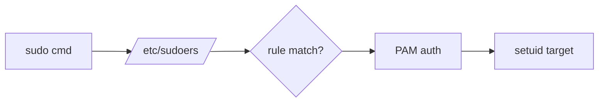
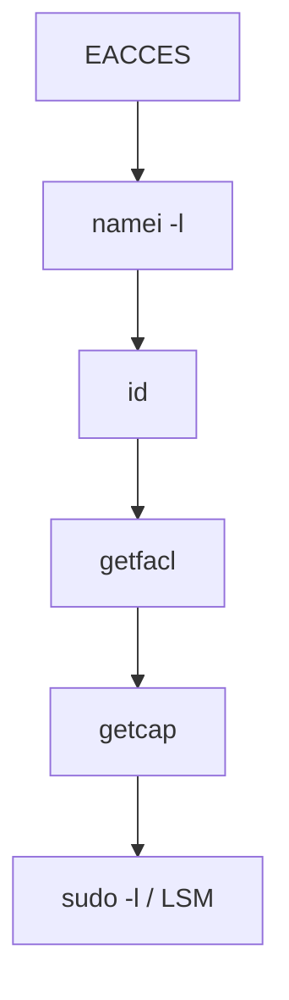

# Linux 权限完整篇：DAC、ACL、capability、sudo 与 LSM 排障

「chmod 777 仍 Permission denied」「root 不能 ping」「sudo 配了仍 denied」——命中 **ACL、capability、sudoers、LSM** 不同层。权限检查顺序：**路径 DAC → ACL → capability（特权操作）→ LSM**。

本文合并 Linux 运维 chapter 013–018，锚定 `fs/namei.c`、`fs/posix_acl.c`、`security/commoncap.c` 等。

---

## 源码锚点

| 路径 | 作用 |
|------|------|
| `fs/namei.c` | 路径解析、may_* |
| `fs/permission.c` | generic_permission |
| `fs/posix_acl.c` | ACL 检查 |
| `kernel/capability.c` | capget/capset |
| `security/commoncap.c` | 文件 cap |
| `security/selinux/` | SELinux |
| `security/apparmor/` | AppArmor |
| `/etc/passwd` `/etc/group` `/etc/shadow` | 账户 |
| `/etc/sudoers` `/etc/sudoers.d/` | sudo |
| `man acl`(5) `man capabilities`(7) `man sudoers`(5) | 手册 |

---

## 调用链

### open 权限



### sudo



### 排障顺序



---

## 重点知识

### 1. DAC 与 chmod

```bash
ls -l file
stat -c '%a %U %G %n' file
chmod 2770 dir
chmod u+s file   # setuid，慎用
```

| 位 | 文件 | 目录 |
|----|------|------|
| r | 读 | ls |
| w | 写 | 创建/删除/改名 |
| x | 执行 | **cd/访问子项** |

### 2. 目录 x 与 namei

```bash
namei -l /data/app/config.yaml
```

每层目录需 **x**；缺 x 则无法到达深层。

### 3. sticky 1777

`/tmp`：`drwxrwxrwt`。sticky 防用户互删他人文件。

```bash
chmod +t /shared
ls -ld /shared
```

### 4. setuid/setgid

setuid 文件：euid→owner。setgid 目录：新建文件继承组。

```bash
find /usr -perm -4000 -type f -ls 2>/dev/null | head
```

### 5. umask

```bash
umask
umask 022
```
文件默认 666&~umask，目录 777&~umask。

### 6. ACL

```bash
getfacl file
setfacl -m u:alice:rwx file
setfacl -m g:dev:rx file
setfacl -m m::rwx file
setfacl -m d:u:bob:rw dir/
setfacl -x u:alice file
setfacl -b file
```

mask 限制 named user/group effective 权限。

### 7. ACL 与 cp/rsync

```bash
cp -a src dst
rsync -aAX src/ dst/
```

### 8. capability

```bash
grep Cap /proc/self/status
capsh --print
getcap -r /usr/bin 2>/dev/null
setcap cap_net_raw+ep /usr/bin/ping
```

| cap | 用途 |
|-----|------|
| CAP_NET_RAW | ping |
| CAP_NET_BIND_SERVICE | bind <1024 |
| CAP_DAC_OVERRIDE | 绕过 DAC 读写文件 |

### 9. 容器 capability

```bash
docker run --cap-drop=ALL --cap-add=NET_BIND_SERVICE ...
```

同样二进制 host 能跑 container 不能 → 查 cap。

### 10. sudoers

```bash
visudo -c
sudo -l -U alice
```

```
alice ALL=(ALL) NOPASSWD: /bin/systemctl restart myapp
Defaults env_reset
Defaults secure_path="/usr/local/sbin:..."
```

`requiretty` 导致 cron sudo 失败；`secure_path` 找不到自定义路径。

### 11. SELinux

```bash
getenforce
ls -Z /path
ps -eZ
ausearch -m avc -ts recent
restorecon -Rv /var/www
semanage fcontext -a -t httpd_sys_content_t '/data/www(/.*)?'
```

### 12. AppArmor

```bash
aa-status
aa-complain /usr/sbin/nginx
journalctl | grep DENIED
```

### 13. id 与组

```bash
id alice
groups alice
usermod -aG dev alice   # 需重新登录
newgrp dev
```

### 14. 排障顺序

1. `namei -l`
2. `id`
3. `ls -l` + `getfacl`
4. `getcap` / `/proc/PID/status`
5. `sudo -l` / `visudo -c`
6. `ausearch` / `aa-status`
7. `mount` 看 noexec/nosuid/ro

```bash
namei -l /path
getfacl /path
sudo -l
```

### 15. systemd User/Capabilities

```ini
[Service]
User=app
AmbientCapabilities=CAP_NET_BIND_SERVICE
CapabilityBoundingSet=CAP_NET_BIND_SERVICE
NoNewPrivileges=true
```

### 16. mount 选项

`noexec` 脚本不能执行；`nosuid` 忽略 setuid；`ro` 只读。

### 17. chattr +i

```bash
lsattr file
chattr +i file
```
root 也无法改内容直到 `-i`。

### 18. NFS ACL

NFSv4：`nfs4_getfacl`/`nfs4_setfacl`；客户端 `acl` 挂载选项。

### 19. 审计

```bash
auditctl -w /etc/shadow -p wa -k shadow
ausearch -k shadow
```

### 20. 小结

排障 **`namei → getfacl → getcap → sudo/LSM`**；避免未查就 chmod 777。

### 21. 案例：目录无 x

bob 无法 cd proj；namei 见 proj drwxr-x--- 无 other/group x。

```bash
namei -l <path>
getfacl <path>
id
```

### 22. 案例：ACL mask

alice rwx 有效只 r；setfacl -m m::rwx。

```bash
namei -l <path>
getfacl <path>
id
```

### 23. 案例：容器无 ping

缺 CAP_NET_RAW；--cap-add 或 tcp 探测。

```bash
namei -l <path>
getfacl <path>
id
```

### 24. 案例：sudo secure_path

/opt/bin 不在 secure_path；ln -s 或改 Defaults。

```bash
namei -l <path>
getfacl <path>
id
```

### 25. 案例：SELinux httpd

文件 context 错；restorecon 或 semanage fcontext。

```bash
namei -l <path>
getfacl <path>
id
```

### 26. 案例：sticky 缺失

world-writable 无 t；用户互删文件。

```bash
namei -l <path>
getfacl <path>
id
```

### 27. 案例：numeric uid

chown 后旧 uid 数字残留；ls -n。

```bash
namei -l <path>
getfacl <path>
id
```

### 28. 案例：default ACL

新建文件无组权限；setfacl -d。

```bash
namei -l <path>
getfacl <path>
id
```

### 29. 案例：pam_limits

too many open files；/etc/security/limits.d。

```bash
namei -l <path>
getfacl <path>
id
```

### 30. 案例：hidepid

mount hidepid=2 非 root 不见进程。

```bash
namei -l <path>
getfacl <path>
id
```

### 31. chmod 数字对照

| 符号 | 数字 |
|------|------|
| rwx | 7 |
| rw- | 6 |
| r-x | 5 |
| r-- | 4 |
| --- | 0 |

目录 2770 = setgid + rwxrws---。

### 32. getfacl 输出解读

```
# file: foo
# owner: root
# group: root
user::rw-
user:alice:rwx   # effective:rwx 受 mask 影响
group::r--
mask::rwx
other::---
```

### 33. sudo vs su

```bash
sudo -u www-data cmd
su - www-data -s /bin/bash -c cmd
runuser -u www-data -- cmd
```

### 34. 最小权限部署

服务账户：无 login shell `/sbin/nologin`；目录 owner 服务用户；仅必要 port capability；sudo 限定命令路径。

### 35. 权限变更流程

变更前 `getfacl`/`ls -l` 存档；变更后 `sudo -u app test -r file` 验证；文档记录 reason。
### 36. 特殊位 suid/sgid/sticky 数值

| 八进制附加 | 含义 |
|------------|------|
| 4000 | setuid |
| 2000 | setgid |
| 1000 | sticky |

`chmod 4755` = setuid + rwxr-xr-x。

### 37. 权限算术练习

目录 `drwxr-x--- root dev`：用户 alice 不在 dev → other 无 x → `namei` 在目录层失败。

```bash
sudo -u alice namei -l /path/in/dev
getfacl /path/in/dev
```

### 38. ACL default 与 mkdir

```bash
mkdir /data/new
getfacl /data/new    # 继承 default ACL 条目
```

无 default 时新建文件仅 owner/group/other。

### 39. ACL 与 chmod 交互

`chmod` 改 group/other 会 **重算 mask**（部分系统）；改后 `getfacl` 复查 effective。

### 40. getfacl -R 与备份

```bash
getfacl -R /data > /root/acls-backup.txt
setfacl --restore=/root/acls-backup.txt
```

### 41. capability 集详解

进程四集（`man capabilities`）：

- **Permitted**：允许启用的上限
- **Effective**：当前生效
- **Inheritable**：exec 可继承
- **Bounding**：hard 上限

文件 capability：**cap_setuid** 等可在 exec 时进入 permitted。

### 42. capsh 实验

```bash
capsh --drop=cap_net_raw -- -c 'ping -c1 127.0.0.1'
capsh --caps="cap_net_bind_service=ep" -- -c './bind80'
```

### 43. setcap 与安全

```bash
setcap cap_sys_admin+ep /tmp/evil    # 危险
find / -type f -perm /6000 2>/dev/null
getcap -r / 2>/dev/null | grep -v '^/usr'
```

定期审计 file cap 与 setuid。

### 44. sudoers 别名

```
User_Alias ADMINS = alice, bob
Cmnd_Alias SERVICES = /bin/systemctl restart *, /bin/systemctl status *
ADMINS ALL=(root) SERVICES
```

`visudo -c` 必跑。

### 45. sudo -l 解读

```bash
sudo -l
sudo -l -U deploy
```

`(ALL : ALL) ALL` vs `(root) NOPASSWD: /path`；不匹配时 **command not allowed**。

### 46. sudo 与 cron

cron 环境极简；`sudo` 失败常见：

- `requiretty` → 注释或 `Defaults !requiretty`
- `PATH` 不含脚本路径 → 绝对路径
- `MAILTO` 空仍 stderr

```bash
sudo grep -r requiretty /etc/sudoers /etc/sudoers.d/
```

### 47. PAM limits

```bash
grep pam_limits /etc/pam.d/su /etc/pam.d/sshd
cat /etc/security/limits.conf
ulimit -a
sudo -u app ulimit -n
```

「Too many open files」是 limits 非 DAC。

### 48. SELinux context 类型

```bash
ls -Z /var/www/html
ps -eZ | grep httpd
semanage fcontext -l | grep httpd
restorecon -Rv /var/www
```

文件 context 与进程 domain 不匹配 → AVC deny。

### 49. SELinux port

```bash
semanage port -l | grep http
semanage port -a -t http_port_t -p tcp 8080
```

非标准端口 httpd 绑定需 port 标签。

### 50. SELinux boolean 常用

```bash
getsebool httpd_can_network_connect
setsebool -P httpd_can_network_connect 1
getsebool httpd_can_network_connect_db
```

### 51. audit2allow 谨慎

```bash
ausearch -m avc -ts recent
audit2allow -a
# 勿盲目 -M 加载；理解 type 再写 local policy
```

### 52. AppArmor profile 模式

```bash
aa-status
cat /etc/apparmor.d/usr.sbin.nginx
aa-complain /usr/sbin/nginx
aa-enforce /usr/sbin/nginx
```

complain 只记日志；enforce 拦截。

### 53. AppArmor 与路径

profile 按 **程序路径**；升级 nginx 包路径变需更新 profile。

### 54. LSM 与 DAC 同时拒绝

先解决 DAC（namei/getfacl），再 LSM；DAC 过仍 deny 几乎必是 SELinux/AppArmor。

### 55. mount namespace 与权限

容器内 root 对 host 文件无权限；`docker exec` 内 `getfacl` 与 host 不同视图。

### 56. user namespace root

rootless 容器内 uid 0 映射 host 非特权 uid；`cap` 受限。

### 57. /etc/passwd 字段

```
name:passwd:UID:GID:GECOS:home:shell
```

UID 0 即 root；`/sbin/nologin` 禁止交互登录。

### 58. /etc/shadow

```bash
ls -l /etc/shadow
sudo chage -l user
passwd -S user
```

账户过期、密码过期、锁定（!）表现各异。

### 59. 组文件 /etc/group

```
group:passwd:GID:user_list
```

主组在 passwd GID；附加组在 group 第四字段或 `gpasswd -a`。

### 60. newgrp 与 sg

```bash
newgrp dev
sg dev -c 'touch /data/dev-only/file'
```

临时切换 effective group。

### 61. setfacl 与 NFS 客户端

```bash
mount | grep acl
nfs4_getfacl /mnt/nfs/file
```

NFSv4 ACL 与 POSIX 工具可能不同。

### 62. 只读 bind mount

```bash
mount -o bind,ro /src /dst
```

业务写失败 → 查 mount 选项非 chmod。

### 63. noexec 挂载

```bash
mount | grep noexec
```

脚本有 x 仍 cannot execute；`bash script.sh` 可读但直接 exec 不行。

### 64. 私有 /tmp PrivateTmp

systemd `PrivateTmp=true` 服务见 `/tmp` 与 host 不同；排障找 `/tmp/systemd-private-*`。

### 65. ProtectSystem / ReadWritePaths

```ini
ProtectSystem=strict
ReadWritePaths=/var/lib/app /run/app
```

写 `/etc` 失败是 systemd 沙箱非 DAC。

### 66. CapabilityBoundingSet 与 AmbientCapabilities

```ini
CapabilityBoundingSet=CAP_NET_BIND_SERVICE CAP_DAC_READ_SEARCH
AmbientCapabilities=CAP_NET_BIND_SERVICE
```

Bounding 裁掉则无法 file cap 提权到该 cap。

### 67. NoNewPrivileges

阻止 setuid/file cap 提权；与 `setcap` 二进制 exec 交互需实测。

### 68. polkit pkexec

桌面提权 `pkexec cmd`；日志 `journalctl | grep polkit`。

### 69. 文件 lease 与 fcntl

权限够仍 EACCES 少见情况：mandatory lock、immutable（chattr +i）。

### 70. 案例：cron 写日志 Permission denied

cron 用户 vs 目录 other 无 w；或 ACL 无 cron 用户；`namei -l` 到文件。

### 71. 案例：www-data 读配置

nginx User www-data；配置 640 root:root → deny；改 group 或 ACL `u:www-data:r`。

### 72. 案例：docker socket

`/var/run/docker.sock` 属 root:docker 660；用户加 docker 组 **需重新登录**。

### 73. 案例：git hooks noexec

`/tmp` noexec 或 hook shebang 执行失败；`bash hook.sh` 绕过。

### 74. 案例：LDAP sssd 缓存

`id` 与 nss 不一致；`sss_cache -E` 后重试；非 chmod 问题。

### 75. 审计 world-writable

```bash
find /var /opt /data -type d -perm -0002 ! -perm -1000 2>/dev/null
find / -type f -perm -4000 2>/dev/null | head -20
```

### 76. 最小权限部署模板

服务用户：`useradd -r -s /sbin/nologin app`；目录 `chown app:app`；`setfacl` 仅协作组；sudo 单命令；cap 仅 `NET_BIND_SERVICE`；SELinux 专用 type。

### 77. 排障命令一键组

```bash
namei -l "$path"
id; groups
ls -la "$path"
getfacl "$path"
getcap "$(which relevant-bin)" 2>/dev/null
sudo -l 2>/dev/null
getenforce 2>/dev/null
aa-status 2>/dev/null | head
```

### 78. 与 Kubernetes SecurityContext

```yaml
securityContext:
  runAsUser: 1000
  runAsNonRoot: true
  capabilities:
    drop: ["ALL"]
    add: ["NET_BIND_SERVICE"]
```

Pod 内 permission denied 对照 host DAC 无关。

### 79. fs.protected 系列

```bash
sysctl fs.protected_regular fs.protected_symlinks fs.protected_hardlinks
```

防止 tmp 下 symlink  trick；表现为 root 也无法 follow 恶意链接。

### 80. 小结

Linux 权限层：**路径 DAC（含目录 x）→ ACL → capability → sudo 策略 → LSM → mount/namespace 沙箱**。固定顺序 `namei → id → getfacl → getcap → sudo/LSM`，避免未验证就 `chmod 777`。

### 81. facl 与 default mask

```bash
setfacl -m d:m::rwx /data/shared
setfacl -m d:u:deploy:rwx /data/shared
```

default mask 限制新建对象 effective ACL。


### 82. 递归 chown 与 ACL

`chown -R` 不改 ACL named user；迁移后 `getfacl -R` 清理冗余条目。


### 83. systemd DynamicUser

```ini
DynamicUser=yes
StateDirectory=app
```

运行时临时 uid；`/var/lib/app` 由 systemd 创建，权限随 unit 声明。


### 84. tmpfiles.d

```bash
cat /usr/lib/tmpfiles.d/app.conf
# d /run/app 0750 app app -
systemd-tmpfiles --create
```


### 85. ACL 与 Samba

Samba `vfs objects = acl_xattr`；Windows ACL 与 POSIX 映射复杂，以 `getfacl` 与 smb 日志对照。


### 86. 文件属性 lsattr

```bash
lsattr -R /etc | grep i
```

immutable 导致 root 无法 vim 保存。


### 87. IMA/EVM 简述

完整性度量（IMA）与 EVM 保护 xattr；`getattr` 失败或 verify 失败表现为 read/exec deny，超越 DAC。


### 88. Landlock 简述

进程自愿沙箱（5.13+）；应用自限文件访问；strace 见 landlock syscalls。


### 89. seccomp

```bash
grep Seccomp /proc/PID/status
systemd-analyze security my.service
```

seccomp 拦 syscall 表现为 EPERM，非 EACCES。


### 90. namespaces 总览

user/mount/pid/net/ipc/uts/cgroup/time；权限问题常是 **view 不同** 而非 chmod 错。


### 91. idmap 与 subuid

```bash
cat /etc/subuid /etc/subgid
grep rootless /etc/docker/daemon.json
```

rootless 容器 uid 映射；host 上 `ls -n` 看 numeric owner。


### 92. 共享目录协作模式

setgid 目录 + 组 dev：`chmod 2770` + `chgrp dev`；新建文件组=dev。ACL 补充外部协作者。


### 93. umask 与服务

systemd `UMask=0027` 影响 runtime 创建文件默认 mode；与 package 安装权限不同。


### 94. 只读 rootfs

容器/OSTree 只读根；写 /etc 失败。`mount | grep ro`。


### 95. 案例：logrotate create 权限

logrotate `create 640 app adm` 与目录 ACL 冲突；rotate 后新 log 不可写。


### 96. 案例：systemd LogsDirectory

```ini
LogsDirectory=app
```
目录 `/var/log/app` 归 `app:app`；其他用户 tail 需 ACL 或 adm 组。


### 97. 案例：SSH ForceCommand

forced command 绕过 shell 但 scp 仍走 sftp；权限问题在 target 路径非 sshd_config。


### 98. 案例：container volume uid

bind mount host 目录 uid 1000；镜像内 nginx uid 101 → deny。fix：`chown 101:101` 或 `--user`。


### 99. 权限变更评审

变更单含：路径、旧 mode/ACL、新 mode/ACL、影响用户、回滚 `setfacl --restore`、验证命令 `sudo -u app test -r`。


### 100. 终章小结

EACCES/EPERM 先 **namei 路径** 再 **身份与 ACL** 再 **cap/sudo** 再 **LSM/沙箱**。理解目录 x 与 mask 可解决半数工单；容器与 systemd 沙箱是近年新增高频层。


### 101. 附录：常用八进制

755 目录 / 644 文件为常见默认；750 协作目录；600 私密文件；1777 公共 tmp；4755 setuid（慎用）。


### 102. 附录：getfacl 错误

`Operation not supported` → 文件系统未挂 acl；`Permission denied` 改 ACL 需 owner 或 CAP_FOWNER。


### 103. 附录：sudoers 调试

```bash
sudo -n true && echo ok || echo fail
sudo -l -U user 2>&1
visudo -c -f /etc/sudoers.d/snippet
```


### 104. 附录：SELinux 临时 permissive

```bash
getenforce
sudo setenforce 0   # 仅排障，勿长期
sudo setenforce 1
```


### 105. 附录：AppArmor aa-logprof

从新 DENIED 日志生成规则增量；测试后 aa-enforce。


### 106. 快速参考：排障命令顺序

```bash
# 1 路径
namei -l "$TARGET"
# 2 身份
id; groups
# 3 DAC + ACL
ls -la "$TARGET"; getfacl "$TARGET"
# 4 特权
getcap "$(command -v "$BIN" 2>/dev/null)" 2>/dev/null; grep Cap /proc/self/status
# 5 sudo / LSM
sudo -l 2>/dev/null; getenforce 2>/dev/null; aa-status 2>/dev/null | head -3
```

每一层未通过即停，修复后再从 namei 重跑。
