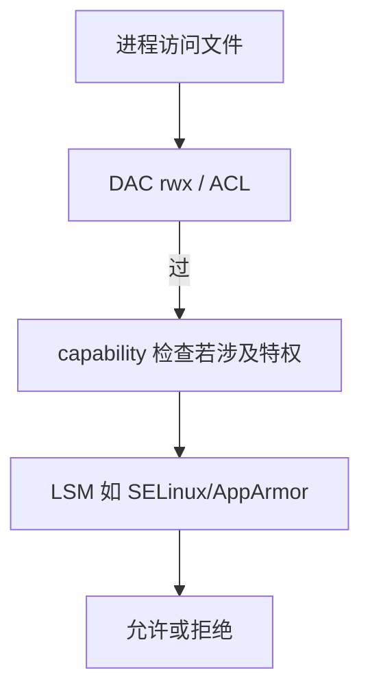

# Linux 权限：模式位、ACL 与 capability

「加了 sudo 仍失败」「服务能读文件用户不能」，要分清 **DAC 模式位、POSIX ACL、capability、安全模块** 哪一层在拒绝。

## 源码锚点

| 路径 / 手册 | 作用 |
|-------------|------|
| `man chmod` `man chown` | 基础 DAC |
| `man setfacl` `man getfacl` | ACL |
| `man capabilities` | 细粒度特权 |
| `man sudoers` | 提权策略 |

## 调用链



## 重点知识

### 模式位与目录执行位

目录 `x` 表示可进入；无 `x` 时即使有 `r` 也无法 `cd`。共享目录常用 `1777`（sticky）防互删。

### ACL

```bash
setfacl -m u:alice:rwx /data/proj
getfacl /data/proj
setfacl -m d:u:alice:rx /data/proj   # 默认 ACL
```

拷贝时注意 `cp -a` 是否保留 ACL。

### capability

```bash
getcap /usr/bin/ping
setcap cap_net_raw+ep /path/to/bin
```

容器里常丢 capability，表现为「同样二进制主机正常、容器失败」。

### 排障顺序

`namei -l` 看路径组件权限 → `id` 看组 → `getfacl` → `ausearch`/审计或 LSM 日志。
