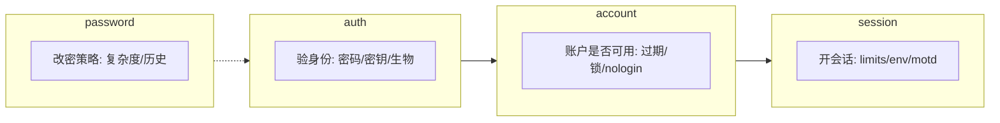
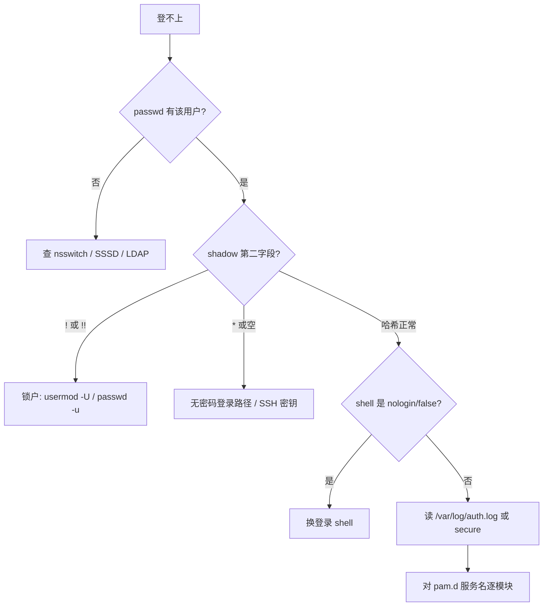

# 密码对了仍 Login incorrect？从 passwd/shadow 到 PAM 栈与 sudoers 排透

SSH 提示密码错误、本地能登远程不行、`usermod -L` 之后忘了解锁、shell 写成 `/sbin/nologin`——表面都是「登不上」，根因落在 **账户文件、NSS 查找、PAM 栈、sudoers、会话环境** 不同层。本文合并 Linux 运维 chapter 007–012，按真实路径与调用链讲清「谁查用户、谁验密、谁开会话」。

---

## 阅读地图

本文分 **5 层**，每层一个主问题：

| 层 | 主问题 | 你读完能做什么 |
|----|--------|----------------|
| 1 | 账户存在哪里 | 读懂 `/etc/passwd` `/etc/shadow` `/etc/group`，对上 UID/GID |
| 2 | 用户怎么增删改 | 用 `useradd`/`usermod`/`userdel` 与 `login.defs` 可控建户 |
| 3 | 名字怎么解析成 UID | 用 `nsswitch` + glibc NSS 查清 files/sss/ldap 优先级 |
| 4 | 登录为何被拒 | 读 PAM `auth/account/session/password` 栈，定位 pam_unix/nologin |
| 5 | 提权与排障 | 配 `sudoers`，按日志把「无法登录 / 锁户 / nologin」一次拆开 |

---

## 源码锚点

上游与本机可对照的真实路径（发行版包装路径可能带 `/usr` 前缀，以本机 `dpkg -L`/`rpm -ql` 为准）：

| 路径 | 作用 |
|------|------|
| `glibc/nss/nsswitch.c` | 解析 `/etc/nsswitch.conf`，加载 NSS 模块 |
| `glibc/nss/getpwnam_r.c` / `getpwuid_r.c` | 按名/按 UID 查用户 |
| `glibc/nss/files/files-pwd.c` | `files` 后端读 `/etc/passwd` |
| `glibc/nss/files/files-grp.c` | 读 `/etc/group` |
| `shadow-utils`：`src/useradd.c` `usermod.c` `userdel.c` | 改账户数据库的命令实现 |
| `shadow-utils`：`lib/`、`libmisc/` | 写 passwd/shadow 的库逻辑与锁文件 |
| `/etc/login.defs` | UID/GID 范围、默认 umask、口令天数、加密算法提示 |
| `/etc/default/useradd` | useradd 默认 shell、HOME 基目录等 |
| Linux-PAM：`libpam/pam_start.c` `pam_authenticate.c` `pam_acct_mgmt.c` `pam_open_session.c` | PAM 会话生命周期 |
| Linux-PAM：`modules/pam_unix/` | 对照 `/etc/shadow` 验密、改密 |
| Linux-PAM：`modules/pam_nologin.c` | `/etc/nologin` 存在则拒绝非 root |
| Linux-PAM：`modules/pam_limits.so` → `/etc/security/limits.conf` | 会话资源限制 |
| `/etc/pam.d/*`、`/etc/security/*` | 服务栈与访问/限制配置 |
| `sudo`：`plugins/sudoers/` | 解析 `/etc/sudoers` 与 `/etc/sudoers.d/` |
| `man 5 passwd` `man 5 shadow` `man 5 group` `man 7 PAM` `man 5 sudoers` | 字段与语义权威说明 |

本机模块（Debian/Ubuntu 系常见）：

```text
/lib/x86_64-linux-gnu/security/pam_unix.so
/lib/x86_64-linux-gnu/security/pam_nologin.so
/lib/x86_64-linux-gnu/security/pam_limits.so
/etc/pam.d/sshd
/etc/pam.d/common-auth
/etc/pam.d/sudo
```

RHEL/Rocky 系常见落在 `/lib64/security/`，且多用 `/etc/pam.d/system-auth`、`password-auth` 而非 Debian 的 `common-*`。

---

## 调用链

### 登录总览：从 sshd 到 shell

```mermaid
flowchart TD
    A[sshd / login / gdm] --> B[PAM pam_start]
    B --> C[auth: pam_authenticate]
    C --> D[account: pam_acct_mgmt]
    D --> E[session: pam_open_session]
    E --> F[setuid/setgid + 启动 shell]
    C --> G[NSS getpwnam_r]
    G --> H[/etc/nsswitch.conf]
    H --> I[files / sss / ldap ...]
    I --> J[/etc/passwd + /etc/shadow]
```

### PAM 四管理组



### 排障决策树



---

## 重点知识

### 第 1 层：账户数据库——passwd / shadow / group

#### 1.1 `/etc/passwd` 七字段

格式（`man 5 passwd`）：

```text
name:password:UID:GID:GECOS:home:shell
```

| 字段 | 含义 | 运维注意 |
|------|------|----------|
| name | 登录名 | 勿随意改名；程序常缓存 UID |
| password | 历史占位，现代几乎总是 `x` | 真哈希在 shadow |
| UID | 数字身份 | 内核只认 UID，不认名字 |
| GID | 主组 | 辅组在 `/etc/group` |
| GECOS | 注释（全名等） | `chfn` 可改 |
| home | 家目录 | 不存在也能登录，但配置文件找不到 |
| shell | 登录 shell | `/usr/sbin/nologin`、`/bin/false` 禁交互登录 |

查看：

```bash
getent passwd alice
getent passwd 1000
awk -F: '$3>=1000 && $3<65534 {print}' /etc/passwd
```

`getent` 走 NSS，比直接 `cat /etc/passwd` 更能反映 LDAP/SSSD 用户。

#### 1.2 `/etc/shadow` 口令与老化

权限通常 `0640`，属主 `root:shadow`。字段（`man 5 shadow`）：

```text
name:password:lastchg:min:max:warn:inactive:expire:reserved
```

| 第二字段形态 | 含义 |
|--------------|------|
| `$6$...` / `$y$...` 等 | 有哈希（SHA-512 / yescrypt 等，以平台为准） |
| `!` 或 `!!` 前缀 | **锁定**（`usermod -L` / `passwd -l`） |
| `*` | 无密码登录（系统账户常见） |
| 空 | 空密码（极危险，现代 PAM 常拒绝） |

口令策略字段与 `chage` 对应：

```bash
sudo chage -l alice
sudo chage -M 90 -W 7 -I 14 alice   # 最长 90 天，提前 7 天警告，过期后 14 天禁用
sudo passwd -S alice                 # 状态：P/L/NP 等
```

`ENCRYPT_METHOD` 在 `/etc/login.defs`（本机常见 `SHA512`）；实际哈希由 `pam_unix`/`crypt` 决定，改算法后**旧哈希仍可用**，新改密才用新算法。

#### 1.3 `/etc/group` 与辅组

```text
group_name:password:GID:user_list
```

```bash
getent group docker
id alice
groups alice
```

把用户加进辅组必须 **追加**，否则冲掉原有辅组：

```bash
# 错误：可能丢掉原有组
usermod -G docker alice

# 正确：追加
usermod -aG docker alice
# 或
gpasswd -a alice docker
```

组变更对**已登录会话不生效**，需重新登录或 `newgrp`。

#### 1.4 为何拆成 passwd + shadow

设计动机：

1. **权限分离**：世界可读的 passwd 供 `ls` 显示名字；密文仅 root/shadow 组可读。
2. **工具链稳定**：大量程序只读 passwd；验密走 PAM → pam_unix → shadow。
3. **老化策略**：天数、锁定、失效放在 shadow，不污染 passwd。

对应 glibc：`getpwnam_r` 填 `struct passwd`；`getspnam_r`（需特权）读 `struct spwd`。

---

### 第 2 层：UID/GID 与 useradd / usermod

#### 2.1 UID 区间惯例

`/etc/login.defs`（数值以本机为准，下表为常见默认）：

| 区间 | 典型用途 |
|------|----------|
| 0 | root |
| 1–999（或 1–499） | 系统账户 |
| `UID_MIN`–`UID_MAX`（常 1000–60000） | 普通用户 |
| 65534 | `nobody` |

```bash
grep -E '^(UID_|GID_|SYS_UID_|CREATE_HOME|UMASK|ENCRYPT_METHOD)' /etc/login.defs
```

容器/NFS 场景：两边 UID 不一致会导致「名字对、权限错」。用 `ls -n` 看数字 UID。

#### 2.2 创建用户

```bash
# 交互式建户（Debian 系常用 adduser 包装）
sudo adduser alice

# 脚本友好：useradd
sudo useradd -m -s /bin/bash -c 'Alice' -G sudo,docker alice
sudo passwd alice
```

关键选项：

| 选项 | 作用 |
|------|------|
| `-m` / `-M` | 创建 / 不创建家目录 |
| `-d /path` | 指定 HOME |
| `-s /bin/bash` | 登录 shell |
| `-u 1050` | 指定 UID |
| `-g dev` | 主组 |
| `-G a,b` | 辅组（创建时） |
| `-r` | 系统账户（UID 落在 SYS 区间） |
| `-e YYYY-MM-DD` | 账户过期日 |
| `-f N` | 口令过期后多少天禁用 |

默认值还看 `/etc/default/useradd`（如 `HOME=/home`、`SHELL=/bin/sh`）。

#### 2.3 修改与删除

```bash
sudo usermod -s /bin/bash alice
sudo usermod -d /home/alice2 -m alice    # 改 HOME 并搬目录
sudo usermod -L alice                    # 锁：shadow 哈希前加 !
sudo usermod -U alice                    # 解锁
sudo usermod -e 2026-12-31 alice         # 账户过期
sudo userdel -r alice                    # 删用户并删 HOME（慎用）
```

锁户 vs 禁 shell：

| 手段 | 效果 | 典型命令 |
|------|------|----------|
| 锁密码 | 密码登录失败；SSH 公钥仍可能成功 | `usermod -L` / `passwd -l` |
| nologin shell | 交互登录被拒；部分服务账户仍可用 | `usermod -s /usr/sbin/nologin` |
| 账户过期 | `pam_unix` account 阶段失败 | `usermod -e` / `chage -E` |
| `/etc/nologin` | 全机非 root 登录拒绝 | `pam_nologin` |

#### 2.4 批量与一致性

```bash
# 从文件建户（newusers）
sudo newusers users.txt

# 校验一致性（影子与 passwd 对齐）
sudo pwck -r
sudo grpck -r
```

改 `/etc/passwd` 手改后务必 `pwck`；生产优先用 `useradd`/`usermod`，避免半行损坏。

#### 2.5 家目录骨架

`/etc/skel/` 在 `useradd -m` 时复制到新 HOME：

```bash
ls -la /etc/skel
# .bashrc .profile .bash_logout 等
```

定制全局默认环境可改 skel，而不是事后对每个用户 `cp`。

---

### 第 3 层：NSS——名字如何变成 UID

#### 3.1 `/etc/nsswitch.conf`

本机示例：

```text
passwd:         files systemd
group:          files systemd
shadow:         files
hosts:          files mdns4_minimal [NOTFOUND=return] dns
```

含义：查用户先 `files`（`/etc/passwd`），再 `systemd`（动态用户等）。若写 `files sss`，则本地没有再问 SSSD。

```bash
getent passwd alice          # 按当前 nsswitch 查
getent -s files passwd alice # 强制 files 后端（glibc 较新版本支持）
```

#### 3.2 调用链（设计意图）

1. 应用调用 `getpwnam("alice")`。
2. glibc 读 nsswitch，按序 `dlopen` `libnss_files.so.2`、`libnss_sss.so.2` 等。
3. 第一个返回成功的后端胜出；`[NOTFOUND=return]` 等动作控制是否继续。

因此：**本地有同名用户会挡住 LDAP 同名用户**——排障时先 `getent`，再对比 `grep alice /etc/passwd`。

#### 3.3 与 PAM 的分工

| 组件 | 回答的问题 |
|------|------------|
| NSS | 用户/组**是谁**（UID、HOME、shell） |
| PAM | **允不允许**登录、密码对不对、会话怎么建 |

SSSD/LDAP 场景：NSS 提供枚举与属性，`pam_sss.so` 做认证。两者配置必须指向同一身份源，否则出现「能 `id` 不能登录」或反过来。

#### 3.4 观测命令

```bash
getent passwd | wc -l
id alice
namei -l /home/alice
ls -n /home | head
# 若用 SSSD
sssctl user-checks alice 2>/dev/null
systemctl status sssd
```

---

### 第 4 层：PAM 栈——auth / account / session / password

#### 4.1 服务文件怎么找

PAM 按**服务名**找配置：`sshd` → `/etc/pam.d/sshd`；`sudo` → `/etc/pam.d/sudo`；`login` → `/etc/pam.d/login`。

Debian/Ubuntu 常用 `@include common-auth` 等；RHEL 用 `system-auth` / `password-auth`。改公共文件影响所有 include 它的服务。

#### 4.2 控制标志

| 标志 | 失败时 | 成功时 |
|------|--------|--------|
| `required` | 记失败，继续跑完栈再失败 | 继续 |
| `requisite` | **立刻失败返回** | 继续 |
| `sufficient` | 继续（忽略本模块失败，若前面无 required 失败） | 若此前无失败则可提前成功 |
| `optional` | 通常忽略 | 继续 |
| `[success=N default=...]` | 复杂跳转（Debian common-auth 常见） | 跳过后续 N 个模块 |

读不懂跳转时，用 `pamtester` 或临时把 `LOGLEVEL` 提高，对照 `auth.log`。

#### 4.3 Debian `common-auth` 读法（本机真实结构）

典型片段逻辑：

```text
auth  [success=2 default=ignore]  pam_unix.so nullok_secure
auth  [success=1 default=ignore]  pam_sss.so use_first_pass
auth  requisite                   pam_deny.so
auth  required                    pam_permit.so
auth  optional                    pam_cap.so
```

含义概要：

1. `pam_unix` 成功则跳过后面 2 个模块（跳过 sss 与 deny）。
2. 否则试 `pam_sss`；成功则跳过 deny。
3. 都失败则 `pam_deny` requisite 直接拒绝。
4. `pam_permit` 保证栈有明确成功码；`pam_cap` 可选提权能力。

排障「密码明明对」：确认打的是**哪一个**后端（unix vs sss），以及 `use_first_pass` 是否吃掉了空密码。

#### 4.4 `sshd` 栈里的 account / session

本机 `/etc/pam.d/sshd` 关键顺序（摘要）：

```text
@include common-auth
account  required  pam_nologin.so
@include common-account
session  required  pam_loginuid.so
@include common-session
session  required  pam_limits.so
session  required  pam_env.so
```

- **auth**：验密/密钥相关（SSH 公钥主要由 sshd 自己处理，PAM 仍可能跑）。
- **pam_nologin**：`/etc/nologin` 存在则非 root 拒绝（维护窗口常用）。
- **common-account**：账户过期、`pam_unix` account 等。
- **session**：limits、环境变量、motd、SELinux 上下文等。

维护窗口：

```bash
echo "系统维护中" | sudo tee /etc/nologin
# 结束后
sudo rm -f /etc/nologin
```

#### 4.5 口令模块 `common-password`

改密走 `passwd` 命令 → PAM password 组 → 常含：

- `pam_pwquality.so` / `pam_cracklib.so`：复杂度
- `pam_unix.so obscure sha512 remember=5`：写 shadow、记历史

策略文件常见：`/etc/security/pwquality.conf`。

```bash
# 测试复杂度（不要在生产瞎试 root）
sudo apt install libpam-pwquality   # Debian 系示例
grep -v '^#' /etc/security/pwquality.conf | grep -v '^$'
```

#### 4.6 调试 PAM

```bash
# Debian/Ubuntu
sudo tail -f /var/log/auth.log
# RHEL
sudo tail -f /var/log/secure

# 或 journald
journalctl -u ssh -f
journalctl _COMM=sshd -f

# 模块级：在对应行加 debug（测完删掉）
# auth required pam_unix.so debug
```

`pam_unix` 日志常见关键字：`authentication failure`、`account expired`、`password expired`。

#### 4.7 与 SSH 配置的交叉

即使 PAM 通过，`sshd_config` 仍可挡：

```bash
grep -E '^(PermitRootLogin|PasswordAuthentication|AllowUsers|DenyUsers|UsePAM|AuthenticationMethods)' /etc/ssh/sshd_config
```

| 现象 | 优先查 |
|------|--------|
| 密码对但 SSH 拒绝 | `PasswordAuthentication`、`AllowUsers`、fail2ban |
| 仅 root 不行 | `PermitRootLogin`、`pam_securetty` |
| 密钥可以密码不行 | PAM unix / 锁户 / 过期 |
| 密码可以密钥不行 | `~/.ssh` 权限、SELinux context |

---

### 第 5 层：sudoers 与提权

#### 5.1 文件与语法

```bash
sudo visudo          # 编主文件，带语法检查
sudo visudo -f /etc/sudoers.d/alice
sudo visudo -c       # 只检查
sudo -l -U alice     # 看某用户有效规则
```

规则骨架：

```text
alice  ALL=(root) NOPASSWD: /bin/systemctl restart nginx
%sudo  ALL=(ALL:ALL) ALL
Defaults env_reset
Defaults secure_path="/usr/local/sbin:/usr/local/bin:/usr/sbin:/usr/bin:/sbin:/bin"
```

| 片段 | 含义 |
|------|------|
| `alice` / `%group` | 谁 |
| `ALL=` | 在哪些主机 |
| `(root)` / `(ALL)` | 以谁运行 |
| 命令列表 | 允许的绝对路径命令 |
| `NOPASSWD:` | 免密（仍走 PAM session 等） |

**必须用绝对路径**；`sudo` 默认 `secure_path`，用户自定义 `PATH` 里的同名命令可能找不到。

#### 5.2 sudo 与 PAM

`/etc/pam.d/sudo` 通常 `@include common-auth`，因此：

- 锁户用户：`sudo` 也可能失败（取决于规则与认证要求）。
- `NOPASSWD` 仍可能执行 account/session 模块。

#### 5.3 常见坑

| 坑 | 表现 | 处理 |
|----|------|------|
| 手改 sudoers 语法错 | 所有 sudo 失败 | 用 root 壳或单用户 `pkexec`/`visudo` 修复 |
| `requiretty` | cron/ansible sudo 失败 | 去掉或对命令 `!requiretty` |
| `secure_path` | 找不到 `/opt/...` | 写绝对路径或改 Defaults |
| 辅组刚加 | `sudo -l` 仍无组权限 | 重新登录 |
| 命令参数过严 | 多一个参数就拒绝 | 规则写清或用脚本包装 |

```bash
# 验证
sudo -u alice sudo -l
```

---

### 排障专题：无法登录 / 锁户 / nologin

#### 场景 A：Password authentication failed

逐步：

```bash
getent passwd alice
sudo passwd -S alice
sudo chage -l alice
sudo grep alice /etc/shadow | cut -d: -f2 | head -c 20; echo
```

- 哈希以 `!` 开头 → `sudo usermod -U alice` 或 `passwd -u`。
- `passwd -S` 显示锁定 → 同上。
- 账户过期 → `sudo chage -E -1 alice`。
- 本地无用户但 LDAP 有 → 查 `nsswitch` 与 `pam_sss`。

#### 场景 B：登录后立即退出 / This account is currently not available

```bash
getent passwd alice | awk -F: '{print $7}'
grep nologin /etc/shells   # nologin 通常不在 shells
```

```bash
sudo usermod -s /bin/bash alice
```

系统服务账户应保持 nologin，不要给 daemon 开 bash。

#### 场景 C：全员无法登录，root 本地可以

```bash
ls -l /etc/nologin
# pam_nologin 生效
sudo rm -f /etc/nologin
```

#### 场景 D：SSH 拒绝，控制台正常

```bash
sudo sshd -T | grep -Ei 'permitroot|passwordauth|allowusers|denyusers|usepam'
sudo journalctl -u ssh -n 50 --no-pager
```

对照 `/etc/pam.d/sshd` 与 `/etc/ssh/sshd_config`。

#### 场景 E：sudo: account validation failure

```bash
sudo passwd -S $USER
chage -l $USER
grep '^auth\|^account' /etc/pam.d/sudo /etc/pam.d/common-account
```

常与账户过期、`pam_unix` account、或 LDAP 不可达有关。

#### 场景 F：家目录权限导致环境异常

```bash
namei -l /home/alice
sudo chmod 700 /home/alice
sudo chown alice:alice /home/alice
```

SSH 对 `~/.ssh` 要求严格：`.ssh` 700、`authorized_keys` 600。

#### 场景 G：UID 冲突与孤儿文件

```bash
awk -F: '{print $3}' /etc/passwd | sort | uniq -d
find / -xdev -uid 1005 -ls 2>/dev/null | head
```

删用户后未 `-r`，文件以数字 UID 残留；重建同名不同 UID 会「权限全错」。

---

### 可执行操作手册（按任务）

#### 新建业务用户并给 sudo 重启某服务

```bash
sudo useradd -m -s /bin/bash -c 'app ops' appops
sudo passwd appops
echo 'appops ALL=(root) NOPASSWD: /bin/systemctl restart myapp.service' | sudo tee /etc/sudoers.d/appops
sudo chmod 440 /etc/sudoers.d/appops
sudo visudo -c
sudo -u appops sudo -l
```

#### 临时禁用某人密码登录但保留密钥

```bash
sudo usermod -L alice
# SSH 公钥仍可按 sshd 配置工作；去掉密钥再彻底禁用
```

#### 强制下次登录改密

```bash
sudo chage -d 0 alice
```

#### 审计谁能登录

```bash
awk -F: '$7 !~ /nologin|false/ {print $1,$3,$7}' /etc/passwd
sudo awk -F: '($2 !~ /^[!*]/ && $2!="") {print $1}' /etc/shadow
```

---

### 与权限篇的边界

- **本篇**：身份从哪来、如何认证、会话如何建立、sudo 规则。
- **权限/ACL 篇**：已登录后 DAC/ACL/capability/LSM 如何判 `EACCES`。

排障口诀：**先 NSS 有人，再 shadow/PAM 肯认，再 shell/nologin 肯进，最后 sudoers 肯提权**。

---

### 发行版差异速记

| 项 | Debian/Ubuntu | RHEL/Rocky/Alma |
|----|---------------|-----------------|
| PAM 公共文件 | `common-auth` 等 + `pam-auth-update` | `system-auth` `password-auth` |
| 建户友好命令 | `adduser` | 多用 `useradd` |
| 认证日志 | `/var/log/auth.log` | `/var/log/secure` |
| 集中身份 | `pam_sss` / `sssd` | 同左，默认集成更常见 |
| sudo 组名 | 常 `sudo` | 常 `wheel` |

配置路径以本机文件为准；模块 so 在 `/lib/.../security` 或 `/lib64/security`。

---

### 源码级：验密时发生了什么（简化）

1. `sshd` 调 `pam_start("sshd", user, ...)`。
2. `pam_authenticate` 按 `/etc/pam.d/sshd` 拉模块链。
3. `pam_unix.so` 调 `getpwnam_r` → NSS；再 `getspnam_r` 读哈希。
4. 用 `crypt(3)`（或 libxcrypt）比对；失败返回 `PAM_AUTH_ERR`。
5. 成功则 `pam_acct_mgmt`：查过期、`pam_nologin` 等。
6. `pam_open_session`：`pam_limits`、`pam_env`、`pam_motd`…
7. 守护进程 `setgid`/`initgroups`/`setuid`，exec shell。

任意一步失败，对用户都可能只显示笼统的 `Permission denied` / `Login incorrect`——**必须看 auth 日志里的模块名**。

---

### 配置文件权限底线

```bash
sudo sh -c 'stat -c "%a %U:%G %n" /etc/passwd /etc/shadow /etc/group /etc/gshadow /etc/sudoers'
# 期望大致：
# passwd  644 root:root
# shadow  640 root:shadow   (或 600)
# group   644 root:root
# sudoers 440 root:root
```

shadow/sudoers 被改成世界可读是严重事故；发现后立刻收紧权限并轮换相关密钥/口令。

---

### 实践：在测试机验证整条链

```bash
# 1. 建测试用户
sudo useradd -m -s /bin/bash pamtest && sudo passwd pamtest

# 2. NSS
getent passwd pamtest

# 3. 锁与解锁
sudo usermod -L pamtest
sudo passwd -S pamtest
sudo usermod -U pamtest

# 4. nologin
sudo usermod -s /usr/sbin/nologin pamtest
# 尝试 su - pamtest 应失败
sudo usermod -s /bin/bash pamtest

# 5. PAM 日志（另开终端 tail -f auth.log）
su - pamtest -c 'id'

# 6. sudoers 片段
echo 'pamtest ALL=(root) NOPASSWD: /usr/bin/true' | sudo tee /etc/sudoers.d/pamtest
sudo chmod 440 /etc/sudoers.d/pamtest
sudo -u pamtest sudo /usr/bin/true && echo OK

# 7. 清理
sudo userdel -r pamtest
sudo rm -f /etc/sudoers.d/pamtest
```

把每一步的成功/失败与日志行对应起来，比背配置更有用。

---

### 集中身份（SSSD）最小对照

当 `nsswitch` 含 `sss` 且 `common-auth` 含 `pam_sss.so`：

```bash
systemctl status sssd
realm list 2>/dev/null
getent passwd 'alice@example.com'
sssctl domain-list 2>/dev/null
```

故障模式：

| 现象 | 常见因 |
|------|--------|
| `id` 通、登录失败 | PAM 未配 sss / 时钟偏移 Kerberos |
| 登录通、组不全 | `id_provider` 与组枚举超时 |
| 离线时不能登 | `cache_credentials` 未开或缓存过期 |

域集成细节以 `sssd.conf` 与平台手册为准；本篇强调它与 **files 后端的优先级** 和 **PAM 模块是否一致**。

---

### 安全与最小权限要点（嵌入运维动作，非清单套话）

- 业务进程用独立 UID，勿共用一个「运维大号」。
- 交互账户与服务账户分离：服务账户 `nologin` + 无有效密码哈希。
- sudo 按命令授权，避免长期 `NOPASSWD: ALL`。
- 改 PAM 先在一台测试机；Debian 优先 `pam-auth-update` 管理包模块，手改标注清楚以免升级覆盖。
- 对 `/etc/shadow`、`/etc/sudoers` 做变更审计（`aureport` / 配置管理 diff）。

---

### 关键词对照表（排障搜日志用）

| 日志/报错片段 | 优先层 |
|---------------|--------|
| `authentication failure` | PAM auth / 密码 / 锁户 |
| `account expired` / `password expired` | shadow 老化 / chage |
| `not available` / nologin | shell 字段 |
| `/etc/nologin` | pam_nologin |
| `User not known to the underlying authentication module` | NSS 无此用户 |
| `sudo: no tty present` | requiretty |
| `sorry, you must have a tty` | 同上 |
| `error in module` | pam.d 语法或 so 缺失 |

---

### 小结：五层如何叠在一起

1. **文件层**定义「有哪些账户」：passwd/shadow/group。
2. **工具层**保证一致写入：useradd/usermod + login.defs。
3. **NSS 层**决定「按名能查到谁」：files 优先还是目录服务。
4. **PAM 层**决定「这一次登录是否放行」：auth → account → session。
5. **sudoers 层**决定「放行之后能以谁跑什么」。

现场口令：**getent → passwd -S / chage → pam.d 服务名 → auth.log 模块名 → sudo -l**。把这一串跑通，绝大多数「登不上」不必猜。

---

### 附录：字段速查与命令索引

**passwd 字段位置（awk）：**

```bash
awk -F: '{printf "%-16s UID=%-6s GID=%-6s shell=%s\n",$1,$3,$4,$7}' /etc/passwd
```

**shadow 是否锁定：**

```bash
sudo awk -F: '$2 ~ /^!/ {print $1,"LOCKED"}' /etc/shadow
```

**最近登录：**

```bash
lastlog -u alice
last -a | head
```

**失败登录（需 audit/btmp）：**

```bash
sudo lastb | head
sudo aureport -au -i 2>/dev/null | tail
```

**PAM 模块是否存在：**

```bash
ls /lib/*/security/pam_unix.so /lib64/security/pam_unix.so 2>/dev/null
```

**手动模拟账户查找：**

```bash
python3 - <<'PY'
import pwd
u = pwd.getpwnam('root')
print(u.pw_uid, u.pw_dir, u.pw_shell)
PY
```

以上命令均可在本机直接跑；结果随发行版略有差异，以手册与本机文件为准。

---

### 再补一层：systemd 动态用户与 files 的关系

现代发行版 nsswitch 常见 `passwd: files systemd`。`User=` 写成 `User=mydaemon` 且 unit 带 `DynamicUser=yes` 时，可能出现**临时 UID**，不一定落盘在 `/etc/passwd`。

```bash
systemctl show some.service -p User -p DynamicUser -p UID
getent passwd mydaemon
```

排障服务权限时：若 `getent` 有而 `grep /etc/passwd` 无，先想到 systemd NSS，而不是「passwd 丢行」。

---

### 登录 shell 与 `/etc/shells`

`chsh` 通常要求新 shell 列在 `/etc/shells`：

```bash
cat /etc/shells
sudo chsh -s /bin/bash alice
```

`/usr/sbin/nologin` 一般**不在**列表中——这是故意的，避免普通用户把自己改回可登录 shell（管理员用 `usermod -s` 仍可改）。

---

### 密码哈希前缀识别

| 前缀 | 算法（常见） |
|------|----------------|
| `$1$` | MD5（过时） |
| `$5$` | SHA-256 |
| `$6$` | SHA-512 |
| `$y$` | yescrypt（较新 Debian/Ubuntu） |
| `$2a$` / `$2y$` | bcrypt（视配置） |

```bash
sudo getent shadow alice | cut -d: -f2 | cut -d'$' -f1-2
```

升级加密方法后，用 `passwd` 让用户重设，才能换新前缀；仅改 `ENCRYPT_METHOD` 不会重写旧哈希。

---

### 文件锁与并发修改

shadow-utils 写账户时使用锁文件（常见 `/etc/passwd.lock`、`/etc/shadow.lock` 一类实现细节以版本为准）。若 `useradd` 报文件忙：

```bash
sudo lsof /etc/passwd /etc/shadow 2>/dev/null
# 避免并行跑多个配置管理工具同时改账户
```

配置管理（Ansible `user` 模块等）与手工 `vipw` 并发是经典事故源。

---

### `vipw` / `vigr`

必须手改时：

```bash
sudo vipw          # 编辑 passwd，完成后可能提示编 shadow
sudo vipw -s       # shadow
sudo vigr          # group
```

不要用普通编辑器直接改完留下错误权限或半行——`vipw` 会处理锁与基本检查。

---

### 容器与宿主机用户命名空间

在 User Namespace 映射下，容器内 UID 0 可能是宿主机高位 UID。排障「容器里是 root、宿主机看文件属主是 100000」属正常映射，不是 passwd 坏了。

```bash
cat /proc/self/uid_map
ls -n /var/lib/docker 2>/dev/null | head
```

本篇账户模型仍适用；叠加一层映射后，**以宿主机数字 UID 为准做 chown**。

---

### 收束：把 chapter 007–012 收成一条线

源章节标题分散在「概念 / 机制 / 技术点 / 源码 / 配置 / 排障」，实质同一条链：

**账户文件 → 管理命令 → NSS 解析 → PAM 认证授权会话 → sudo 提权 → 对照日志排障。**

锚在 glibc NSS、shadow-utils、Linux-PAM、sudoers 真实路径上验证，即可在生产把「Login incorrect」从猜谜变成定位。
