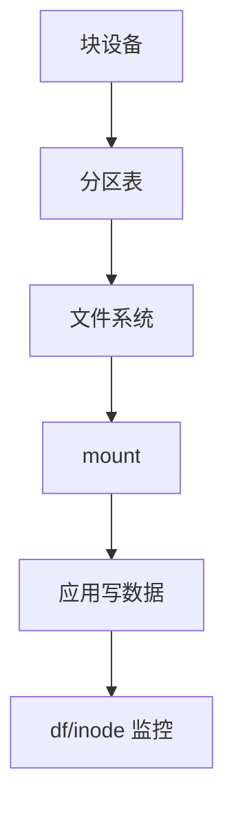

# Linux 磁盘管理：分区、文件系统、挂载与扩容

磁盘满、只读挂载、扩容后系统看不见空间，步骤要固定：**分区 → 文件系统 → fstab/挂载 → 监控 inode 与只读原因**。

## 源码锚点

| 路径 / 手册 | 作用 |
|-------------|------|
| `man fdisk` `man parted` | 分区 |
| `man mkfs` `man fsck` | 造/检文件系统 |
| `man mount` `man findmnt` | 挂载命名空间视图 |
| `/etc/fstab` | 持久挂载 |
| `man lsblk` | 块设备拓扑 |

## 调用链



## 重点知识

```bash
lsblk -f
findmnt
df -hT
df -i
mount | column -t
```

### fstab

用 UUID/PARTUUID，避免设备名漂移：

```bash
blkid
# UUID=...  /data  ext4  defaults,noatime  0  2
```

### 扩容思路

虚拟盘先在平台扩容 → `partprobe`/`growpart` → `resize2fs`/`xfs_growfs`。XFS 通常不能在线缩减。

### 只读与只读根

`dmesg` 寻 I/O error；嵌入式只读根把可写点放到 data 分区。`mount -o remount,rw` 只是权宜。
