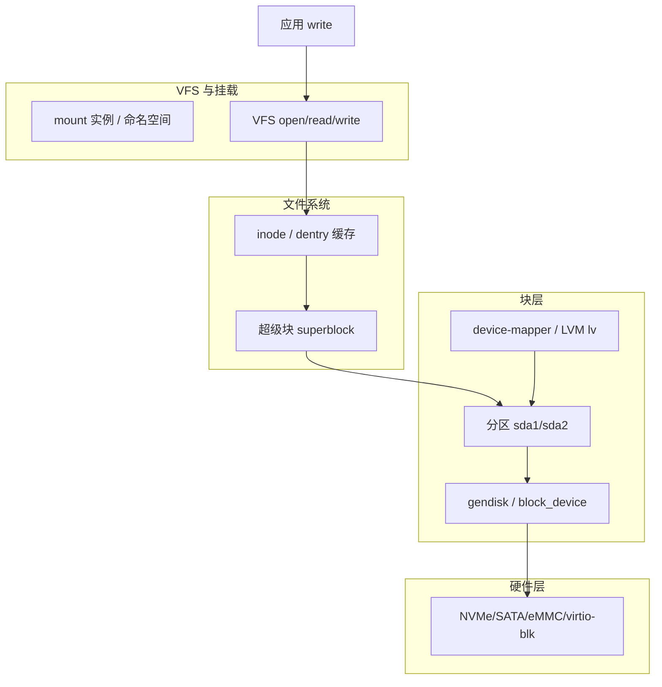
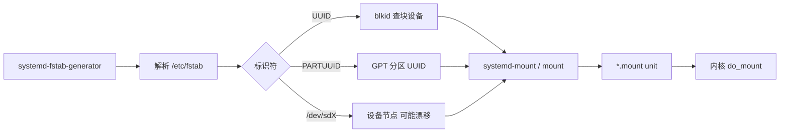

# Linux 磁盘与文件系统管理完整篇：从 lsblk 到 fstab、扩容、inode 与只读根排障

磁盘满却 `df` 还有空间、云盘扩容后分区未变、`/dev/sdb1` 重启变 `sdc1` 导致 fstab 挂载失败、根分区突然只读——四类故障分别落在 **块设备拓扑、分区表、文件系统元数据、I/O 错误与挂载选项** 不同环节。运维若只记 `fdisk`/`mkfs` 命令而不理解 **VFS → 块层 → 分区 → 文件系统 → mount 命名空间** 链路，排障会反复试错。

本文合并 Linux 运维 chapter 049–054，按主线内核与用户态工具路径，覆盖 **lsblk、分区、mkfs、fstab、UUID、扩容、inode、只读根、fsck**，给出源码锚点、调用链与可复现实验命令。

---

## 源码锚点

| 路径 / 手册 | 作用 |
|-------------|------|
| `block/blk-core.c` | 块设备核心：`submit_bio`、`generic_make_request` |
| `block/partition/core.c` | 分区表解析、`add_partition` |
| `fs/ext4/super.c` | ext4 超级块、`ext4_fill_super` |
| `fs/xfs/xfs_super.c` | XFS 挂载与 grow 入口 |
| `fs/mount.h` / `fs/namespace.c` | VFS mount 命名空间、`do_mount` |
| `fs/inode.c` | inode 分配与 `i_nlink` |
| `fs/ext4/ialloc.c` | ext4 inode 位图分配 |
| `fs/ext4/super.c` → `ext4_remount` | 只读 remount 路径 |
| `fs/fs-writeback.c` | 脏页回写、只读触发条件 |
| `man lsblk` `man blkid` | 块设备拓扑与标识 |
| `man fdisk` `man parted` `man sgdisk` | 分区工具 |
| `man mkfs.ext4` `man mkfs.xfs` | 格式化 |
| `man mount` `man findmnt` | 挂载与视图 |
| `/etc/fstab` | 持久挂载配置 |
| `man fsck` `man e2fsck` `man xfs_repair` | 文件系统检查修复 |
| `man growpart` `man resize2fs` `man xfs_growfs` | 在线扩容 |
| `man lvm` / `device-mapper` | LVM 逻辑卷路径 |

块 I/O 提交骨架（`block/blk-core.c` 逻辑）：

```c
/* bio 从文件系统经块层到驱动 */
blk_qc_t submit_bio(struct bio *bio)
{
    /* 分区 remapping → 队列 → 驱动 .queue_rq */
    return submit_bio_noacct(bio);
}
```

---

## 调用链

### ① 从物理盘到应用读写



### ② 启动挂载与 fstab 解析



文字版主路径：

```text
write(2) → vfs_write → ext4_file_write_iter
  → 页缓存 dirty → writeback → bio → 分区 remap → 驱动
mount(2) → do_mount → fill_super → 读 superblock → 挂到 mount tree
```

---

## 一、块设备拓扑：lsblk 与 blkid

### 1.1 lsblk 读什么

`lsblk` 从 sysfs `/sys/block/` 与 `/sys/dev/block/` 读取 **gendisk** 拓扑，展示 **disk → partition → mapper** 树，不依赖挂载状态。

```bash
lsblk -o NAME,SIZE,TYPE,FSTYPE,FSVER,LABEL,UUID,MOUNTPOINTS,MODEL,SERIAL
lsblk -f          # 等价于常用 FSTYPE/UUID/LABEL 列
lsblk -d -o NAME,ROTA,DISC-GRAN,DISC-MAX,DISC-ZERO  # 对齐与旋转介质
lsblk --json | jq '.blockdevices[]'
```

字段含义：
- **TYPE=disk**：整盘；**part** 为分区；**lvm** 为 DM 逻辑卷；**crypt** 为 LUKS 映射。
- **ROTA=1**：HDD；**0** 为 SSD/NVMe。
- **MOUNTPOINTS**：可能为空——未挂载的分区照样存在。

### 1.2 设备名漂移问题

传统 `/dev/sdX` 按 ** SCSI/ATA 枚举顺序** 命名，热插拔、控制器变化会导致 **sdb ↔ sdc 对调**。NVMe 为 `/dev/nvme0n1p1` 相对稳定，但仍应使用 UUID。

```bash
# 查看 udev 属性
udevadm info -q property -n /dev/sda1 | grep -E 'ID_SERIAL|ID_PARTUUID|ID_FS_UUID'
ls -l /dev/disk/by-uuid/
ls -l /dev/disk/by-partuuid/
```

### 1.3 blkid 与文件系统探测

```bash
blkid                    # 缓存 + 探测
blkid -p /dev/nvme0n1p2  # 强制探测未挂载分区
wipefs -n /dev/sdb       # 预览超级块/签名（不破坏）
```

`blkid` 读取各文件系统在固定偏移处的 **magic**（如 ext4 0x438、xfs 0x0），与 `/lib/udev/rules.d/60-persistent-storage.rules` 配合生成 `/dev/disk/by-uuid` 符号链接。

---

## 二、分区：GPT、MBR 与工具选型

### 2.1 GPT vs MBR

| 特性 | MBR (DOS) | GPT |
|------|-----------|-----|
| 最大磁盘 | 2 TiB（32bit LBA） | 9.4 ZiB 量级 |
| 分区数 | 4 主分区或 3+扩展 | 128 默认（可调） |
| 分区 UUID | 无标准 PARTUUID | 有 PARTUUID |
| UEFI 启动 | 需特殊 BIOS boot | ESP 分区 FAT |
| 冗余头 | 无 | 主备 GPT 头 |

2020 年后新装系统 **一律 GPT**；仅 legacy BIOS 小盘或特殊镜像才考虑 MBR。

### 2.2 fdisk（GPT 交互式）

```bash
sudo fdisk /dev/nvme0n1
# g  创建 GPT
# n  新分区 → 号/起始扇区/大小
# t  改类型（Linux=8300, LVM=8E00, ESP=EF00）
# p  打印
# w  写入（不可逆，写前确认盘符）
sudo partprobe /dev/nvme0n1   # 通知内核重读分区表
```

内核路径：`block/partition/core.c` 中 `check_partition()` 按 **EFI GPT / MSDOS / ...** 顺序探测；`add_partition()` 注册 `/dev/nvme0n1pN`。

### 2.3 parted / sgdisk（脚本友好）

```bash
# 非交互：整盘一个分区从 1MiB 对齐开始
sudo parted -s /dev/vdb mklabel gpt
sudo parted -s /dev/vdb mkpart primary ext4 1MiB 100%
sudo parted -s /dev/vdb align-check optimal 1

# sgdisk：GPT 专用
sudo sgdisk -n 1:0:+100G -t 1:8300 /dev/vdb
sudo sgdisk -p /dev/vdb
```

**1 MiB 对齐**：避免 SSD 擦除块与 4K 扇区不对齐导致性能下降；`fdisk` 默认常从 2048 扇区（1MiB@512B）开始。

### 2.4 常见分区布局

服务器典型：
- `/boot` 或 `/boot/efi`（UEFI FAT ESP）
- `/` ext4/xfs
- `/var` 或 `/data` 独立分区隔离日志与业务
- **swap** 分区或 swapfile（见后文）

嵌入式典型：
- **只读 squashfs root** + **可写 /data** 分区
- **dual-bank A/B** 升级分区
- eMMC 整盘少量分区，避免频繁 repartition

---

## 三、mkfs 与文件系统选型

### 3.1 ext4

默认通用 FS，支持在线 resize（`resize2fs`），journal 模式 data=ordered 默认。

```bash

sudo mkfs.ext4 -L rootfs -m 1 /dev/nvme0n1p2   # -m 1 保留 1% root 块

sudo tune2fs -l /dev/nvme0n1p2 | grep -E 'Block count|Inode count|Reserved'

```

**Reserved block percentage** 默认 5% 仅 root 可写——大容量数据盘应 `-m 0` 或 `tune2fs -m 0`。

### 3.2 XFS

大文件/高并发写友好；**只能 grow 不能 shrink**；延迟分配与 reflink（较新内核）。

```bash

sudo mkfs.xfs -f -L data /dev/mapper/vg0-lv_data

sudo xfs_info /mount/point

```

### 3.3 btrfs（简述）

CoW、子卷、快照；生产需关注 **qgroup、balance、metadata 占用**。

```bash

sudo mkfs.btrfs -L backup /dev/sdc1

sudo btrfs filesystem show

sudo btrfs subvolume list /mnt

```

### 3.4 FAT/exFAT

ESP、SD 卡、UEFI；无 Unix 权限。

```bash

sudo mkfs.vfat -F 32 -n EFI /dev/nvme0n1p1

```

### 3.5 格式化前确认

**三重确认**：设备节点、容量、`lsblk` 树位置；误 `mkfs` 无 undo。

```bash

export TARGET=/dev/sdb1

lsblk $TARGET && read -p 'Confirm mkfs target' x

sudo wipefs -a $TARGET   # 清除旧签名（谨慎）

sudo mkfs.ext4 $TARGET

```

---

## 四、mount、findmnt 与挂载命名空间

### 4.1 临时挂载

```bash
sudo mount /dev/mapper/vg0-lv_home /home
sudo mount -o ro,noatime,nodiratime /dev/sdb1 /mnt/backup
sudo mount -t tmpfs -o size=512M tmpfs /run/myapp
findmnt /home
findmnt -D   # df 风格
findmnt -R / # 递归树
cat /proc/mounts
```

常用挂载选项：
- **noatime**：不更新 access time，减写放大。
- **nodiratime**：目录 atime 不单独更新。
- **defaults**：rw,suid,dev,exec,auto,nouser,async（因 FS 而异）。
- **noexec,nodev,nosuid**：不可信介质安全加固。
- **discard**：SSD TRIM（`fstrim` 定时更安全可控）。

### 4.2 持久挂载 /etc/fstab

fstab 六列：`设备 挂载点 类型 选项 dump fsck`

```bash
# /etc/fstab 示例
UUID=b3a9...   /              ext4    defaults,noatime    0 1
UUID=c7f2...   /boot/efi      vfat    umask=0077          0 2
UUID=d1e8...   /data          xfs     defaults            0 0
tmpfs          /tmp           tmpfs   defaults,size=2G    0 0
LABEL=backup   /mnt/backup    ext4    defaults,nofail     0 2
```

字段说明：
- **dump**：`dump(8)` 备份标志，现多填 0。
- **fsck 最后一列**：0=不检；根分区通常 1；其他 2。`systemd-fstab-generator` 据此生成 `pass` 参数。
- **nofail**：设备缺失时不阻塞 boot（可移动盘、云盘）。
- **_netdev**：网络盘（NFS/CIFS）须等网络就绪。

验证 fstab 语法：

```bash
sudo findmnt --verify --verbose
sudo mount -a   # 挂载所有 fstab 项（改 fstab 后必做）
```

### 4.3 systemd 与 fstab

systemd 将 fstab 转为 `*.mount` unit：

```bash
systemctl cat -.mount
systemctl status home.mount
systemctl show home.mount -p What -p Where -p Options
```

若 `mount -a` 失败但 `systemctl start xxx.mount` 成功，查 **unit 依赖** 与 `_netdev`、`x-systemd.requires=` 选项。

### 4.4 挂载命名空间

容器与 `unshare -m` 有独立 mount tree；宿主机 `findmnt` 看不到容器内挂载，需 `nsenter`：

```bash
sudo nsenter -t $(pidof mycontainer) -m findmnt
lsns -t mount
```

---

## 五、UUID、PARTUUID 与持久标识

### 5.1 为何不用 /dev/sdX

udev 规则 `/lib/udev/rules.d/60-persistent-storage.rules` 在 block 设备 add 事件创建 by-uuid 链接；**枚举顺序变化** 时 sdX 漂移，UUID 不变。

### 5.2 获取标识符

```bash
blkid /dev/nvme0n1p2
# UUID="..." TYPE="ext4" PARTUUID="..."
lsblk -o NAME,UUID,PARTUUID,FSTYPE
sudo tune2fs -U random /dev/sdb1   # 强制新 UUID（克隆盘冲突时用）
```

### 5.3 fstab 写法对比

| 写法 | 优点 | 缺点 |
|------|------|------|
| UUID= | FS 级，跨分区表 | 格式化后变 |
| PARTUUID= | 分区级，重装 FS 仍有效 | 仅 GPT |
| LABEL= | 人类可读 | 不保证唯一 |
| /dev/disk/by-id/... | 物理盘绑定 | 路径长；换盘需改 |

克隆镜像后 **UUID 冲突**：第二块盘 UUID 相同会导致 mount 错盘；`tune2fs -U` 或 `xfs_admin -U generate` 改新 UUID。

### 5.4 initramfs 中的 root=

内核参数 `root=UUID=...` 或 `root=PARTUUID=...` 须与 fstab 一致；dracut/initramfs 须含 `blkid` 缓存或早期 udev。

```bash
grep root= /proc/cmdline
sudo update-initramfs -u   # Debian/Ubuntu
sudo dracut -f             # RHEL 系
```

---
## 六、LVM 路径：PV、VG、LV

### 6.1 概念

```text
Physical Volume (PV) → Volume Group (VG) → Logical Volume (LV) → mkfs → mount
/dev/sdb1            → vg0              → lv_data            → ext4
```

### 6.2 创建流程

```bash
sudo pvcreate /dev/sdb /dev/sdc
sudo vgcreate vg0 /dev/sdb /dev/sdc
sudo lvcreate -L 500G -n lv_data vg0
sudo mkfs.xfs /dev/vg0/lv_data
grep lv_data /etc/fstab   # 用 /dev/vg0/lv_data 或 UUID
```

### 6.3 扩展 VG/LV

```bash
# 新盘加入 VG
sudo pvcreate /dev/sdd
sudo vgextend vg0 /dev/sdd
sudo lvextend -L +200G /dev/vg0/lv_data
# ext4:
sudo resize2fs /dev/vg0/lv_data
# xfs:
sudo xfs_growfs /mount/point
```

### 6.4 查看与诊断

```bash
sudo pvs; sudo vgs; sudo lvs
sudo pvdisplay; sudo lvdisplay
sudo lvs -o +devices   # LV 条带在哪些 PV
```

LVM 在块层之上再叠 **device-mapper** 目标（`drivers/md/dm-table.c`）；`lsblk` 会显示 `vg0-lv_data` 下挂真实分区。

---

## 七、扩容完整流程

### 7.1 云盘 / 虚拟盘扩容（最常见）

顺序固定：**平台扩容量 → 内核见盘变大 → 分区变大 → 文件系统 grow**。

```bash
# 1. 云平台控制台扩磁盘（如 100G→200G）
# 2. 内核重扫（virtio/scsi）
echo 1 | sudo tee /sys/block/vdb/device/rescan
# 或
sudo partprobe

# 3. 分区 grow（GPT 末尾分区）
sudo growpart /dev/vdb 1
# 或 parted:
# sudo parted /dev/vdb resizepart 1 100%

# 4. 文件系统
sudo resize2fs /dev/vdb1              # ext4
sudo xfs_growfs /mount                # xfs 挂载点
sudo btrfs filesystem resize max /mnt # btrfs
```

**growpart** 来自 `cloud-guest-utils`，只扩展 **分区末尾对齐** 的分区；中间分区需 `parted move` 等复杂操作。

### 7.2 未分区整盘扩容

若数据在 `/dev/vdb` 无分区，直接：

```bash
sudo resize2fs /dev/vdb
```

### 7.3 LVM 在线扩

见 6.3；优势是 **文件系统可跨 PV 条带**，缩容难（xfs 不支持 shrink LV 内 xfs）。

### 7.4 缩容（高风险）

- ext4：`resize2fs -M` 缩 FS → `lvreduce`/`parted` 缩分区（需离线或极谨慎）。
- xfs：**不支持 shrink**；只能备份 → 重建 → 恢复。

### 7.5 扩容后空间未出现

排查树：

```bash
lsblk    # DISK SIZE 是否变大？
sudo fdisk -l /dev/vdb   # 分区 SIZE 是否变大？
df -hT /mount
sudo dumpe2fs -h /dev/vdb1 | grep 'Block count'   # ext4 块数
```

常见遗漏：只扩了云盘 **未 growpart**；或 **xfs_growfs 用了设备而非挂载点**。

---

## 八、inode 耗尽：df 有空间却无法创建文件

### 8.1 机制

每个文件/目录/symlink 占一个 **inode**；ext4 创建时 `ext4_new_inode()` 扫描 inode 位图；耗尽返回 **ENOSPC**，与 block 空闲无关。

```bash
df -h /var
df -i /var
# IUse% 100% → inode 问题
```

### 8.2 典型场景

- 大量 **小文件**（邮件队列、PHP session、npm cache、容器 layer）。
- **ext4 inode 数在 mkfs 时固定**（默认按容量估算）；小分区 inode 密度不足。

```bash
sudo dumpe2fs -h /dev/sda1 | grep -i inode
# Inode count: ...
# Inodes per group: ...
```

### 8.3 应急

```bash
# 找目录 inode 占用（慢但有效）
sudo find /var/spool -xdev -type f | awk -F/ '{print NF}' | sort -n | tail
# 或
sudo ncdu -x /var

# 删小文件、清 cache、合并日志
sudo journalctl --vacuum-size=500M
```

### 8.4 根治

- 重建 FS 时 **增大 inode  ratio**：`mkfs.ext4 -N 10000000` 或 `-i bytes-per-inode`（更小=更多 inode）。
- 换 **xfs**（动态 inode）或 btrfs。
- 业务改 **对象存储** 少文件数。

### 8.5 与 block 耗尽区分

| 现象 | inode 满 | block 满 |
|------|----------|----------|
| df -h | 可能有 Avail | Use% 100% |
| df -i | IUse% 100% | 正常 |
| 错误 | No space left (often ENOSPC) | 同上，需 `-i` 区分 |
| touch 空文件 | 失败 | 失败 |

---

## 九、只读根分区与 remount

### 9.1 内核为何 remount ro

ext4/xfs 在检测到 **I/O error**、元数据不一致或管理员 `mount -o remount,ro` 时会转为只读，防止进一步破坏。`dmesg` 常现：

```text
EXT4-fs error (device sda2): I/O error while writing ...
Remounting filesystem read-only
```

### 9.2 诊断命令

```bash
mount | grep ' / '
findmnt -no OPTIONS /
dmesg -T | tail -50
sudo smartctl -a /dev/sda
cat /sys/block/sda/sda2/ro   # 1=强制只读块层
```

### 9.3 临时读写 remount

```bash
sudo mount -o remount,rw /
```

若立即回 ro，说明 **底层 I/O 仍失败**（坏块、线缆、RAID 降级、云盘限流），非单纯 fstab 选项。

### 9.4 嵌入式只读根设计

```text
squashfs / (ro) + overlayfs 或独立 /data (rw)
或 ext4 root + ro 挂载选项 + remount,rw 仅维护模式
```

`/etc/fstab` 示例：

```text
/dev/mmcblk0p2  /       ext4  ro,noatime  0 1
/dev/mmcblk0p3  /data   ext4  defaults   0 2
```

可写路径：**/var/log → tmpfs 或 /data/var**；否则 ro 根上写日志失败。

### 9.5 fs 错误计数

ext4 挂载选项 **errors=remount-ro**（默认）/ **errors=continue** / **errors=panic**；生产数据盘建议默认 remount-ro。

```bash
sudo tune2fs -l /dev/sda2 | grep 'Errors behavior'
```

---

## 十、fsck 与文件系统修复

### 10.1 何时跑 fsck

- 非正常关机、I/O 错误后。
- fstab **pass 非 0** 且 `systemd-fsck@.service` 计数超限。
- 手动：`touch forcefsck` 或 `tune2fs -C max /dev/sda1`。

### 10.2 ext4：e2fsck

```bash
# 必须卸载或使用只读
sudo umount /dev/sda2
sudo e2fsck -f -y /dev/sda2
# -f 强制检查即使看起来 clean
# -n 只读预览（不修复）
sudo e2fsck -n /dev/sda2
```

**根分区** 无法 umount：单用户模式或 initramfs shell 中 fsck，或 `systemd.unit=rescue.target`。

### 10.3 XFS：xfs_repair

```bash
sudo umount /dev/mapper/vg0-lv
sudo xfs_repair /dev/mapper/vg0-lv
# 严重损坏：xfs_repair -L 清空 log（丢部分最近写）
```

### 10.4 启动时 fsck 链

```mermaid
flowchart TD
    BOOT[boot] --> GEN[systemd-fstab-generator]
    GEN --> FSCK[systemd-fsck@dev-xxx.service]
    FSCK --> E2F[e2fsck / xfs_repair]
    E2F -->|pass| MOUNT[local-fs.target]
    E2F -->|fail| EMERG[emergency.target / 维护 shell]
```

### 10.5 只读 fsck 预览

```bash
sudo e2fsck -n /dev/sdb1
sudo xfs_repair -n /dev/sdc1
```

---

## 十一、监控与容量规划

### 11.1 日常观测

```bash
df -hT
df -i
lsblk -f
sudo du -xhd1 /var | sort -h
sudo ncdu -x /
```

Prometheus node_exporter：`node_filesystem_avail_bytes`、`node_filesystem_files_free`。

### 11.2 告警阈值

- block 使用 **>85%** 预警，**>95%** 紧急（ext4 预留块后实际更紧）。
- inode **>90%** 预警。
- **dmesg I/O error** 立即工单。

### 11.3 fstrim（SSD）

```bash
sudo fstrim -av
systemctl enable fstrim.timer   # 多数发行版默认
```

---

## 十二、典型故障案例

### 案例 1：fstab 写错 UUID，启动进 emergency

**现象**：kernel 能挂载 root，后续 `local-fs.target` 失败。

**定位**：

```bash
systemctl status mnt-data.mount
journalctl -b -u systemd-fsck@dev-...
findmnt --verify
```

**修复**：initramfs 下 `blkid`，改 `/etc/fstab`，`mount -a` 验证。

### 案例 2：云盘扩容后 df 不变

**根因**：只扩虚拟盘，未 `growpart` + `resize2fs`。

**验证**：`lsblk` 见 disk 200G、partition 仍 100G。

### 案例 3：大量小文件导致 ENOSPC

**根因**：inode 100%。

**验证**：`df -i`；`ncdu` 找目录。

### 案例 4：数据库写失败，根只读

**根因**：磁盘坏块或 RAID 电池失效。

**验证**：`dmesg` EXT4-fs error；`smartctl` Reallocated_Sector_Ct。

### 案例 5：Docker 占满 /var

**根因**：overlay2 与 container log。

**处理**：`docker system prune`；日志 **json-file max-size**；独立 `/var/lib/docker` 分区。

---

## 十三、swap：分区 vs swapfile

### 13.1 swap 分区

```bash
sudo mkswap /dev/nvme0n1p3
sudo swapon /dev/nvme0n1p3
grep swap /etc/fstab
```

### 13.2 swapfile（灵活）

```bash
sudo fallocate -l 4G /swapfile
sudo chmod 600 /swapfile
sudo mkswap /swapfile
sudo swapon /swapfile
# fstab: /swapfile none swap sw 0 0
```

**注意**：btrfs 上 swapfile 需 `NODATACOW` 等限制；xfs/ext4 较 straightforward。

### 13.3 swappiness

```bash
cat /proc/sys/vm/swappiness   # 默认 60
sudo sysctl vm.swappiness=10  # 服务器减 swap 倾向
```

---

## 十四、LUKS 加密盘（简述）

```bash
sudo cryptsetup luksFormat /dev/sdb1
sudo cryptsetup open /dev/sdb1 crypt_data
sudo mkfs.ext4 /dev/mapper/crypt_data
# fstab: /dev/mapper/crypt_data + crypttab 条目
```

`lsblk` TYPE=crypt；性能开销在 CPU AES-NI 通常可接受。

---

## 十五、内核 sysfs 与调试

```bash
# 块层统计
cat /sys/block/sda/stat
# 强制只读
echo 1 | sudo tee /sys/block/sda/ro

# 清除 dirty 页（极端调试，生产勿用）
# sync; echo 3 | sudo tee /proc/sys/vm/drop_caches
```

---

## 十六、ext4 日志模式（调优参考）

| data= | 含义 | 性能 | 安全 |
|-------|------|------|------|
| ordered | 数据写先于 metadata commit | 中 | 高 |
| writeback | 数据可后于 metadata | 高 | 低 |
| journal | 数据也 journal | 低 | 最高 |

```bash
sudo tune2fs -o journal_data_writeback /dev/sda1  # 慎用
mount -o data=ordered /dev/sda1 /mnt
```

---

## 十七、配额（quota）防单用户占满

```bash
sudo apt install quota   # 或 yum
# /etc/fstab 选项 usrquota,grpquota
sudo quotacheck -cum /home
sudo quotaon /home
sudo edquota username
sudo repquota -a
```

xfs 用 `xfs_quota`；与 inode/block 双限。

---

## 十八、NFS/CIFS 挂载要点

```bash
# fstab
server:/export  /mnt/nfs  nfs  defaults,_netdev,nofail,x-systemd.automount  0 0
```

**_netdev** 防 boot 卡死；**soft vs hard** mount 影响 IO hang 行为。

---

## 十九、RAID 与 multipath（生产常见）

```bash
cat /proc/mdstat
sudo mdadm --detail /dev/md0
sudo multipath -ll
```

扩容 RAID 成员盘后须 **grow RAID → grow partition → grow FS** 全链一致。

---

## 二十、性能观测：iostat / blktrace

```bash
iostat -xz 1
sudo blktrace -d /dev/nvme0n1 -o - | blkparse -i -
```

高 **await** 与 **util%** 饱和指向磁盘瓶颈，非 CPU。

---

## 二十一、/dev 节点与 maj:min

```bash
stat /dev/sda1
ls -l /dev/sda1
# brw-rw---- 8, 1 → major 8 minor 1
```

容器 bind-mount 块设备需 **--device** 与 cgroup 权限。

---

## 二十二、删除分区与签名

```bash
sudo wipefs -a /dev/sdb1
sudo parted /dev/sdb rm 1
# 或 sgdisk -d 1 /dev/sdb
```

**wipefs** 只清签名不删分区表；**sgdisk --zap-all** 清 GPT。

---

## 二十三、loop 设备与镜像

```bash
sudo losetup -fP disk.img
sudo losetup -a
sudo mount /dev/loop0p1 /mnt
```

Kubernetes/容器镜像层亦基于 loop/overlay。

---

## 二十四、atime 与 relatime

内核默认 **relatime**：仅当 atime 早于 mtime/ctime 才更新。fstab **noatime** 进一步减写。

---

## 二十五、dir_index 与大目录

ext4 默认 **dir_index**（htree）；单目录百万文件仍慢，应分 shard 目录。

```bash
sudo tune2fs -l /dev/sda1 | grep dir_index
```

---

## 二十六、lazy init 与 mkfs 后首次挂载

xfs/ext4 mkfs 后 **lazy inode table init** 可能占 CPU；挂载后后台完成。

---

## 二十七、journal 外置（ext4 高级）

```bash
# 不推荐随意改；journal 通常在 FS 内
sudo dumpe2fs -h /dev/sda1 | grep journal
```

---

## 二十八、只读 bind mount

```bash
sudo mount --bind /data/readshare /srv/readonly
sudo mount -o remount,bind,ro /srv/readonly
```

---

## 二十九、迁移：tar/rsync/dd

```bash
# rsync 在线迁移（保留权限）
sudo rsync -aAXxH --info=progress2 /old/ /new/
# 块级 dd（同容量，慢）
sudo dd if=/dev/sda of=/dev/sdb bs=64M status=progress conv=fsync
```

换盘后用 **新 UUID** 更新 fstab。

---

## 三十、e2label 与 xfs_admin

```bash
sudo e2label /dev/sda1 NEWLABEL
sudo xfs_admin -L newlabel /dev/mapper/vg-lv
```

---

## 附录 A：命令速查

| 任务 | 命令 |
|------|------|
| 拓扑 | `lsblk -f` |
| 标识 | `blkid` |
| 分区 | `fdisk` / `parted` / `growpart` |
| 格式化 | `mkfs.ext4` / `mkfs.xfs` |
| 挂载 | `mount` / `findmnt` |
| 持久 | `/etc/fstab` + UUID |
| 扩容 | `growpart` + `resize2fs`/`xfs_growfs` |
| inode | `df -i` |
| 只读 | `dmesg` + `mount -o remount,rw` |
| 修复 | `e2fsck` / `xfs_repair` |

---

## 附录 B：ext4 挂载失败常见 dmesg

```text
VFS: Can't find ext4 filesystem
→ 未 mkfs 或 wipefs 清签名

EXT4-fs (sda1): mounting ext3 filesystem using the ext4 driver
→ 正常兼容

EXT4-fs (sda1): couldn't mount because of unsupported optional features
→ 新 FS 特性旧内核（如 metadata_csum）→ 升级内核或 tune2fs 降特性
```

---

## 附录 C：XFS 挂载失败

```text
XFS (dm-0): Mounting V5 Filesystem
XFS (dm-0): Corruption of in-memory data detected
→ xfs_repair 或从备份恢复
```

---

## 附录 D：systemd mount 单元调试

```bash
systemd-analyze critical-chain local-fs.target
systemctl list-units --failed
journalctl -b | grep -i 'mount\|fsck'
```

---

## 附录 E：/etc/fstab 与 crypttab 联用

```bash
# /etc/crypttab
crypt_data UUID=xxxx none luks

# /etc/fstab
/dev/mapper/crypt_data  /secure  ext4  defaults  0 2
```

`systemd-cryptsetup@.service` 在 local-fs 前解密。

---

## 附录 F：ZFS（若安装 zfsutils）

```bash
zpool list
zpool status
zfs set compression=lz4 pool/dataset
```

与 LVM 二选一为主；混用增加排障复杂度。

---

## 附录 G：e2fsprogs 版本与特性

```bash
e2fsck -V
tune2fs -O ^metadata_csum /dev/sda1   # 旧内核兼容时关闭新特性
```

---

## 附录 H：partprobe vs kpartx

```bash
sudo partprobe /dev/sdb
sudo kpartx -av disk.img   # 分区映射到 /dev/mapper/loop0p1
```

---

## 附录 I：脏数据与 sync

```bash
sync
cat /proc/meminfo | grep Dirty
```

只读 remount 前 **sync** 减少丢数据； hung 时可用 SysRq：`echo s > /proc/sysrq-trigger`。

---

---

## 附录 J–T：速查补充

**fallocate/dd 预分配**、**/var 独立分区**、**noatime**、**blkdiscard**、**by-path**、**umount EBUSY**（`lsof`/`fuser`）、**GPT 头 verify**（`gdisk -v`）、**/etc/mtab** 符号链接、综合采集脚本见上文「附录 T」与第十二节案例。

*合并自 Linux 运维 049–054；实验请在 KVM 快照或 loop 镜像上进行。*

