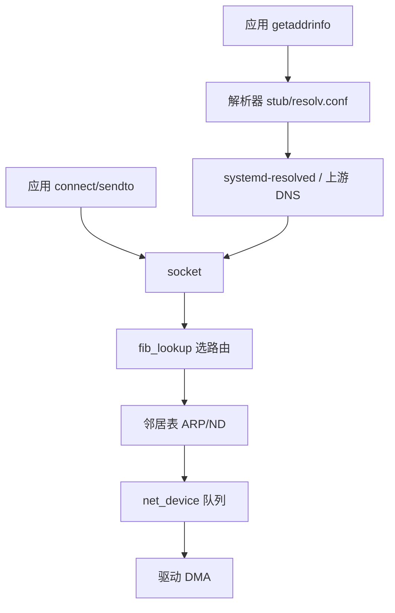

# Linux 网络配置完整篇：iproute2、路由、DNS、ss 与分层排障

「`ip addr` 有地址、`ping` 网关通、但 curl 域名超时」——四层现象对应 **L2 链路、L3 路由、DNS 解析、L4 防火墙/策略路由** 不同断点。若同时存在 NetworkManager、systemd-networkd、/etc/network/interfaces 手写配置，还会出现 **后写覆盖先写、dhcp 抢静态** 的互踩。

本文合并 Linux 运维 chapter 037–042，以 **iproute2** 为主轴，覆盖路由、DNS/systemd-resolved、`ss`、连通性分层排障、多网络管理器冲突与 **network namespace**，附内核锚点与可复现命令。

---

## 源码锚点

| 路径 / 手册 | 作用 |
|-------------|------|
| `net/core/dev_ioctl.c` | 链路 up/down、MTU |
| `net/ipv4/devinet.c` | IPv4 地址 `inet_ioctl` |
| `net/ipv4/route.c` / `fib_rules.c` | 路由表、策略路由 |
| `net/ipv4/arp.c` | ARP 邻居解析 |
| `net/ipv6/addrconf.c` | IPv6 SLAAC/DAD |
| `net/ipv6/route.c` | IPv6 路由 |
| `net/core/neighbour.c` | 邻居表通用实现 |
| `net/socket.c` | socket 创建入口 |
| `man ip` `man ss` | iproute2 用户态 |
| `man resolvectl` `man systemd-resolved.service` | DNS 栈 |
| `/etc/systemd/network/*.network` | systemd-networkd 配置 |
| `/etc/NetworkManager/system-connections/` | NM 连接配置 |
| `man ip-netns` | 网络命名空间 |

路由查找骨架（IPv4 FIB）：

```c
/* fib_lookup → 匹配 prefix + scope + table */
int fib_lookup(struct net *net, struct flowi4 *flp,
               struct fib_result *res, unsigned int flags);
```

---

## 调用链

### ① 应用发包到 wire



### ② systemd-networkd 配置生效链

```mermaid
flowchart LR
    NETFILE[/etc/systemd/network/10-eth0.network] --> GENERATOR[systemd-network-generator]
    GENERATOR --> LINK[systemd-networkd
    LINK --> RTNETLINK[rtnetlink NEWADDR/ROUTE]
    RTNETLINK --> KERNEL[内核 net/core]
    KERNEL --> IP[ip addr/route 可见]
```

文字路径：

```text
connect() → 路由 → output 设备 → 需要 L2 地址？→ neigh_resolve → dev_queue_xmit
getaddrinfo() → /etc/nsswitch.conf hosts: files dns → resolved 或 /etc/resolv.conf
```

---

## 一、iproute2 基础：link、addr、route

### 1.1 为何弃用 ifconfig/route（net-tools）

`ifconfig` 不显示 **多 IP、secondary 地址、详细路由表**；`route -n` 不展示 **policy routing**。`ip` 通过 **netlink (rtnetlink)** 与内核对话，信息完整且脚本友好。

### 1.2 链路层 ip link

```bash
ip -br link                    # 简要 UP/LOWER_UP
ip link show dev eth0
ip link set eth0 up
ip link set eth0 mtu 9000     # jumbo frame，需交换机配合
ip link set eth0 promisc on     # 抓包/桥接
ip -s link show eth0            # 统计 RX/TX error/drop
```

**LOWER_UP**：物理/虚拟链路已 carrier（网线插好、veth 对端 up）。**state UP** 仅 administratively up，可无 carrier。

### 1.3 地址 ip addr

```bash
ip -br addr
ip addr show dev eth0
ip addr add 192.168.10.5/24 dev eth0
ip addr add 192.168.10.6/24 dev eth0 label eth0:1   # secondary
ip addr del 192.168.10.6/24 dev eth0
ip addr flush dev eth0          # 清所有地址（谨慎）
```

IPv6：

```bash
ip -6 addr show
ip -6 addr add 2001:db8::1/64 dev eth0
# SLAAC 默认路由常来自 RA，见 ip -6 route
```

### 1.4 路由 ip route

```bash
ip route show
ip route show table all
ip route get 8.8.8.8            # 模拟单包选路
ip route get 8.8.8.8 from 10.0.0.5 iif eth1

# 默认网关
ip route add default via 192.168.1.1 dev eth0
ip route add default via 192.168.1.1 dev eth0 metric 100

# 静态网段
ip route add 10.20.0.0/16 via 10.0.0.254 dev eth0
ip route replace 10.20.0.0/16 via 10.0.0.254 dev eth0
ip route del 10.20.0.0/16
```

**scope link** 直连路由；**proto kernel** 为内核根据地址自动生成；**proto static** 为管理员添加。

### 1.5 邻居表 ip neigh

```bash
ip neigh show
ip neigh show dev eth0
ip -s neigh show                # 统计
# 静态 ARP（防 ARP 欺骗或无 ARP 环境）
ip neigh add 192.168.1.1 lladdr aa:bb:cc:dd:ee:ff dev eth0 nud permanent
```

状态 **REACHABLE/STALE/DELAY/FAILED**：FAILED 且 ping 不通时查 L2/L3。

---

## 二、策略路由与多路由表

### 2.1 ip rule

默认 **main 表 (254)** + **local 表 (255)**。策略路由用 **ip rule** 按源/目的/标记选表。

```bash
ip rule show
ip route show table main
ip route show table local

# 示例：来自 10.0.0.0/8 的流量走 table 100
echo '100 corp' >> /etc/iproute2/rt_tables   # 命名 table 100
ip route add default via 10.0.0.1 dev eth1 table corp
ip rule add from 10.0.0.0/8 table corp priority 100
```

### 2.2 fwmark 与 VPN/容器

```bash
# iptables/nft 给包打 mark，ip rule 选表（OpenVPN/wireguard 常见）
ip rule add fwmark 0x1 table vpn
ip route add default dev tun0 table vpn
```

### 2.3 多默认路由与 metric

```bash
ip route add default via 192.168.1.1 dev eth0 metric 100
ip route add default via 192.168.2.1 dev eth1 metric 200
```

内核选 **metric 最小** 的默认路由；主备 failover 可配合 **dhcp 或脚本** 改 metric。

### 2.4 排障：ip route get

```bash
ip route get 203.0.113.5 from 192.168.1.10 iif eth0
```

输出含 **dev、src、uid**；与预期不符即策略路由或 RPDB 问题。

---

## 三、DNS 与 systemd-resolved

### 3.1 解析路径

```text
应用 → glibc getaddrinfo()
  → /etc/nsswitch.conf (hosts: files dns)
  → /etc/resolv.conf（常指向 127.0.0.53 stub）
  → systemd-resolved → 上游 DNS / LLMNR / mDNS
```

### 3.2 resolvectl

```bash
resolvectl status
resolvectl query example.com
resolvectl dns eth0 192.168.1.1
resolvectl domain eth0 ~corp.local
systemctl status systemd-resolved
```

**Global DNS** vs **Link DNS**（每接口）；**Routing Domain** `~.` 表示默认域。

### 3.3 /etc/resolv.conf 形态

| 形态 | 含义 |
|------|------|
| nameserver 127.0.0.53 | resolved stub（Ubuntu 默认） |
| nameserver 8.8.8.8 | 直连公共 DNS（可能 bypass resolved） |
| 符号链接 → ../run/systemd/resolve/stub-resolv.conf | 托管 |

```bash
ls -l /etc/resolv.conf
cat /etc/resolv.conf
```

### 3.4 静态 DNS（绕过 NM 混乱）

**/etc/systemd/resolved.conf**：

```ini
[Resolve]
DNS=1.1.1.1#cloudflare-dns.com
FallbackDNS=8.8.8.8
Domains=~.
DNSSEC=no
```

改后 `systemctl restart systemd-resolved`。

### 3.5 dns 通但应用不通

- 查 **search domain** 拼接错误：`resolvectl status` 看 Domain。
- **IPv6 AAAA** 优先但 v6 路由不通 → `gai.conf` 或禁用 AAAA（临时 `dig A` 验证）。
- 容器内 **独立 resolv.conf**，非宿主机拷贝。

```bash
dig +short A example.com
dig +short AAAA example.com
getent hosts example.com
```

---

## 四、ss：套接字与连接状态

### 4.1 为何用 ss 替代 netstat

`ss` 直接从 **/proc/net/tcp** 等或 netlink 读取，速度快；支持 **filter、timer、 cgroup**。

### 4.2 常用模式

```bash
ss -lntup          # 监听 TCP/UDP + 进程
ss -tan state established
ss -tan '( dport = :443 )'
ss -o state established '( dport = :22 )'   # timer 信息
ss -K dst 203.0.113.1 dport = 443           # 发 RST 踢连接（慎用）
ss -i               # TCP 内部信息（cwnd 等）
ss -n sport = :8080
```

### 4.3 与 iptables/nft 对照

```bash
ss -lntup | grep 8080
sudo nft list ruleset | grep 8080
sudo iptables -L INPUT -n -v
```

「服务起不来」：**ss 无 LISTEN** → 进程未 bind；**有 LISTEN 外网不通** → 防火墙/SG。

### 4.4 SYN 积压与半连接

```bash
ss -tan | awk 'NR==1 || $1=="SYN-RECV"' | head
sysctl net.ipv4.tcp_max_syn_backlog
sysctl net.core.somaxconn
```

---

## 五、连通性分层排障

### 5.1 分层模型

| 层 | 验证命令 | 失败含义 |
|----|----------|----------|
| L1 链路 | `ip link` LOWER_UP | 网线/光模块/VLAN |
| L2 邻居 | `ip neigh`；`ping` 同网段 | ARP/ND 失败 |
| L3 地址 | `ip addr` | 无 IP/mask 错 |
| L3 路由 | `ip route`；`ping` 网关 | 无 default/错 gateway |
| L3 跨网 | `ping -c3 1.1.1.1` | 上游路由/NAT/ACL |
| L4+ | `curl -v`；`nc -vz host port` | 防火墙/服务未 listen |
| DNS | `dig`/`resolvectl query` | 解析链断裂 |

### 5.2 标准探针序列

```bash
IF=eth0
GW=192.168.1.1
ip -br link show $IF
ip -br addr show $IF
ip route show dev $IF
ping -c 3 -I $IF $GW
ping -c 3 -I $IF 1.1.1.1
resolvectl query www.example.com
curl -4 -v --connect-timeout 5 http://www.example.com/
tracepath -n 8.8.8.8
```

### 5.3 有 IP 不能上网：决策树

```text
ping 网关失败 → L2/L3 本地（VLAN、mask、网关错、interface down）
ping 网关 OK，ping 1.1.1.1 失败 → 默认路由、NAT、出口 ACL、策略路由
ping 1.1.1.1 OK，dig 失败 → DNS/resolved
dig OK，curl 域名失败 → HTTP 代理、TLS、SNI 防火墙
curl IP OK 域名失败 → 纯 DNS
```

### 5.4 tcpdump 定点

```bash
sudo tcpdump -i eth0 -nn host 192.168.1.1 or port 53
sudo tcpdump -i eth0 -nn 'tcp port 443 and (host x.x.x.x)'
```

无 ARP _reply → L2；有 DNS query 无 reply → DNS 服务器/53 拦截。

---

## 六、多网络管理器冲突

### 6.1 三大栈

| 组件 | 配置位置 | 典型场景 |
|------|----------|----------|
| NetworkManager (NM) | `/etc/NetworkManager/`；`nmcli` | 桌面、笔记本、RHEL 默认 |
| systemd-networkd | `/etc/systemd/network/*.network` | 容器主机、嵌入式、Ubuntu Server 可选 |
| ifupdown | `/etc/network/interfaces` | Debian 传统 |

**同一接口被两者配置** → 地址抖动、重复 default route、DNS 被覆盖。

### 6.2 确认谁在管

```bash
networkctl status eth0          # networkd
nmcli dev show eth0
nmcli connection show --active
grep -r . /etc/netplan/ 2>/dev/null   # Ubuntu netplan 为生成层
```

Netplan 输出 YAML → 渲染为 NM 或 networkd 配置。

### 6.3 选型建议

- **服务器**：禁 NM，纯 **systemd-networkd** 或 **ifupdown** 其一。
- **桌面**：保留 NM，**mask networkd** on eth：`systemctl mask systemd-networkd`。

```bash
# 让 NM 不管理某口
nmcli dev set eth0 managed no
# 然后手工 ip 或 networkd
```

### 6.4 重复默认路由

```bash
ip route show default
# 两条 default via 不同 dev → 看 metric
```

删错路由：`ip route del default via x.x.x.x dev ethX`。

### 6.5 cloud-init

云镜像首次 boot **cloud-init** 写 net 配置，与手工 fstab 式 net 冲突；改 `/etc/cloud/cloud.cfg.d/` 禁用 network 模块或让 cloud-init 只跑 once。

---

## 七、network namespace (netns)

### 7.1 概念

netns 隔离 **设备、地址、路由、iptables、/proc/net**；容器默认独立 netns。

```bash
ip netns list
ip netns add testns
ip link add veth0 type veth peer name veth1
ip link set veth1 netns testns
ip addr add 10.200.1.1/24 dev veth0
ip link set veth0 up
ip netns exec testns ip addr add 10.200.1.2/24 dev veth1
ip netns exec testns ip link set veth1 up
ip netns exec testns ip route add default via 10.200.1.1
```

### 7.2 排障容器网络

```bash
PID=$(docker inspect -f '{{.State.Pid}}' myctr)
sudo nsenter -t $PID -n ip addr
sudo nsenter -t $PID -n ip route
sudo nsenter -t $PID -n ss -lntup
```

**看错 namespace** 是容器排障头号误判：宿主机 `ss` 看不到容器内 listen。

### 7.3 veth + bridge（Docker 默认模型）

```bash
brctl show docker0 2>/dev/null || ip link show type bridge
iptables -t nat -L POSTROUTING -n -v | head
```

MASQUERADE 在 **nat POSTROUTING**；缺失则容器无外网。

### 7.4 持久 netns

`ip netns add` 重启丢失；systemd 单元或 `/etc/netns/` 脚本重建；OpenStack/K8s CNI 自行管理。

---

## 八、DHCP 客户端

dhcpcd、dhclient、NetworkManager 内置 DHCP。

```bash
journalctl -u NetworkManager -b | grep -i dhcp
cat /var/lib/dhcp/dhclient.leases 2>/dev/null
nmcli dev show eth0 | grep IP4
```
DHCP 续租失败会导致 **地址过期**；`ip addr` 见 valid_lft forever 为静态。

---

## 九、静态配置 systemd-networkd 示例

```ini
# /etc/systemd/network/10-static.network
[Match]
Name=eth0

[Network]
Address=192.168.50.10/24
Gateway=192.168.50.1
DNS=192.168.50.1
# DHCP=no  implicit when Address=
```

```bash
sudo networkctl reload
sudo networkctl status eth0
sudo networkctl renew eth0   # 若用 DHCP 段
```

---

## 十、NetworkManager nmcli 速查

```bash
nmcli con show
nmcli con add type ethernet ifname eth0 con-name static-eth0   ipv4.addresses 192.168.1.10/24 ipv4.gateway 192.168.1.1   ipv4.dns "8.8.8.8" ipv4.method manual
nmcli con up static-eth0
nmcli dev wifi list   # 无线
nmcli con mod static-eth0 ipv4.dns-search "corp.local"
```

---

## 十一、IPv6 双栈排障

IPv6 有地址无全球路由。

```bash
ip -6 route show
ping -6 -c 3 2001:4860:4860::8888
# 仅 link-local fe80 无 default → RA 或静态 v6 网关缺失
sysctl net.ipv6.conf.all.disable_ipv6   # 临时关 v6 验证 AAAA 问题
```

---

## 十二、防火墙与 nftables 快速对照

```bash
sudo nft list ruleset
sudo iptables -S
sudo ufw status verbose
# 注意 docker 插入 FORWARD 规则
```
**ping 通但 TCP 不通** 多为 **state NEW 被 DROP** 或云 SG 未开 443。

---

## 十三、TCP/IP  sysctl 调优（服务器）

```bash
sysctl net.ipv4.ip_forward          # 路由/NAT 须 1
sysctl net.ipv4.conf.all.rp_filter   # 源验证，多 NIC 可能误杀
sysctl net.core.rmem_max net.core.wmem_max
cat /proc/sys/net/ipv4/tcp_congestion_control
```

---

## 十四、bonding 与 VLAN

```bash
ip link add link eth0 name eth0.100 type vlan id 100
ip link set eth0.100 up
cat /proc/net/bonding/bond0 2>/dev/null
# NM: nmcli con add type vlan ...
```
802.1Q VLAN 子接口 **eth0.100**；bond **mode 802.3ad** 需交换机 LACP。

---

## 十五、wireguard 简述

```bash
wg show
ip link show wg0
ip route show table main | grep wg0
```
wg 接口走 **ip rule fwmark** 或 **AllowedIPs** 自动路由。

---

## 十六、案例库

### 案例 1：Ubuntu 升级后 DNS 127.0.0.53 不通

**现象**：`ping 1.1.1.1` OK，`dig` 超时。

**根因**：resolved 上游 DNS 被 NM 清空；或 **DNSOverTLS** 证书问题。

**修复**：

```bash
resolvectl status
sudo resolvectl dns eth0 192.168.1.1
# 或 /etc/systemd/resolved.conf 写 DNS=
sudo systemctl restart systemd-resolved
```

### 案例 2：双网卡 default route 竞争

**现象**：内网 OK 外网间歇失败。

**根因**：eth0、eth1 各有一条 metric 相同的 default。

**修复**：调整 metric 或 **ip rule** 分流；删多余 `default`。

### 案例 3：Docker 容器无法解析外网

**根因**：容器 `/etc/resolv.conf` 指向宿主机不可达 DNS；或 **iptables MASQUERADE** 缺失。

**修复**：`docker daemon.json` `"dns": ["8.8.8.8"]`；检查 `ip_forward` 与 nat。

### 案例 4：policy routing 遗漏 iif

**现象**：回程不对称，TCP 半开。

**根因**：仅 `from` 规则无 **对称路由**。

**修复**：`ip route get` 从两端验证；必要时 **conntrack** 区分子连接。

### 案例 5：VMware/ KVM 克隆 MAC 冲突

**现象**：同网段 ARP 漂移。

**修复**：改 guest MAC；`ip link set eth0 address xx:xx:xx:xx:xx:xx`。

---

## 十七、/etc/nsswitch.conf 与 hosts 文件

```bash
getent hosts myinternal
grep '^hosts:' /etc/nsswitch.conf
```

`files` 在前则 `/etc/hosts` 优先；**dns** 在后走 resolved。

---

## 十八、/etc/hosts 与本地覆盖

```bash
# /etc/hosts
127.0.0.1   localhost
192.168.1.100 git.internal
```

Kubernetes **CoreDNS** 与 node 级 hosts 叠加时注意优先级。

---

## 十九、时间同步与 TLS

证书验证失败有时非网络断而是 **系统时间漂移**：

```bash
timedatectl status
chronyc tracking
curl -v https://example.com 2>&1 | grep -i cert
```

---

## 二十、HTTP 代理环境变量

```bash
env | grep -i proxy
curl -v http://internal.service
```

`HTTP_PROXY` 导致 **内网直连走代理** 失败；`NO_PROXY` 须含 `.corp.local`。

---

## 二十一、MTU 与 PM TUD

**现象**：大 ping 失败小 ping 通（`ping -M do -s 1472`）。

```bash
ip link show eth0 | grep mtu
tracepath 8.8.8.8
```

隧道/VPN 场景 **MTU 1400** 常见；TCP **MSS clamp** 在 iptables/nft。

---

## 二十二、反向路径过滤 rp_filter

多 homed 服务器：

```bash
sysctl net.ipv4.conf.all.rp_filter
# 2=严格 1=松散 0=关
```

非对称路由时 **rp_filter=1** 可能丢合法包。

---

## 二十三、conntrack 表满

```bash
cat /proc/sys/net/netfilter/nf_conntrack_count
cat /proc/sys/net/netfilter/nf_conntrack_max
dmesg | grep conntrack
```

高连接 NAT 网关须调 **max** 或 **timeout**。

---

## 二十四、监听地址 0.0.0.0 vs 127.0.0.1

```bash
ss -lntp | grep 8080
# 0.0.0.0:8080 对外；127.0.0.1:8080 仅本机
```

---

## 二十五、SO_BINDTODEVICE

多 NIC 绑定出口：

```bash
curl --interface eth1 http://ifconfig.me
```

应用层 **bind to device** 与策略路由需一致。

---

## 二十六、mtr 与 path MTU

```bash
mtr -rwzb 100 8.8.8.8
```

---

## 二十七、LLDP 与物理拓扑

```bash
sudo lldpctl   # 若安装 lldpd
```

数据中心排 L2 环路、错 VLAN。

---

## 二十八、ethtool 链路诊断

```bash
ethtool eth0
ethtool -S eth0 | grep -i error
ethtool -k eth0   # offload
```

**RX errors** 增长查线缆/光模块/SFP 兼容性。

---

## 二十九、无线 wpa_supplicant（简述）

```bash
nmcli dev wifi list
nmcli dev wifi connect SSID password PASS
journalctl -u wpa_supplicant -b
```

---

## 三十、网络命名空间与 perf

```bash
ip netns exec testns ping -c 2 10.200.1.1
```

延迟基线对比宿主机，隔离 **CNI 插件** 开销。

---

## 附录 A：ip 命令字段说明

| 字段 | 含义 |
|------|------|
| valid_lft | DHCP 租约剩余 |
| preferred_lft | 地址首选期 |
| scope global | 全局可达 |
| scope link | 链路本地 |
| proto dhcp | 来源 DHCP |

---

## 附录 B：/proc/net 速查

| 文件 | 内容 |
|------|------|
| /proc/net/dev | 接口计数 |
| /proc/net/route | 路由（十六进制） |
| /proc/net/arp | ARP 表 |
| /proc/net/tcp | TCP socket |
| /proc/net/fib_trie | FIB trie |

---

## 附录 C：systemd-networkd vs NM 决策

**headless 服务器**：networkd + netplan render 或纯 interfaces。

**需要 WiFi/VPN GUI**：NM。

**禁止**：同时 active 且都管 eth0。

---

## 附录 D：cloud-init net 调试

```bash
cloud-init analyze show
cat /run/cloud-init/instance-data.json | jq .ds.meta_data
```

---

## 附录 E：常用 dig 模式

```bash
dig @8.8.8.8 example.com A +trace
dig example.com MX
dig -x 192.168.1.1   # PTR 反向
```

---

## 附录 F：nc 探针

```bash
nc -vz -w 3 host 443
nc -l 9999   # 临时 listen 测防火墙
```

---

## 附录 G：traceroute 变体

```bash
traceroute -n -T -p 443 example.com   # TCP SYN
tracepath6 2001:4860:4860::8888
```

---

## 附录 H：网络性能 iperf3

```bash
iperf3 -s
iperf3 -c server -P 4 -t 30
```

区分 **带宽瓶颈** 与 **DNS/连接建立** 问题。

---

## 附录 I：ARP 表老化

```bash
sysctl net.ipv4.neigh.default.gc_stale_time
ip neigh show | grep STALE
```

---

## 附录 J：TCP TIME_WAIT 堆积

```bash
ss -tan state time-wait | wc -l
sysctl net.ipv4.tcp_tw_reuse   # 谨慎开启
```

---

## 附录 K：SYN flood 防护

```bash
sysctl net.ipv4.tcp_syncookies
```

---

## 附录 L：NetworkManager dispatcher 脚本

`/etc/NetworkManager/dispatcher.d/` 在 **up/down** 事件触发自定义路由/DNS。

---

## 附录 M：ip monitor 实时事件

```bash
ip monitor link addr route
```

---

## 附录 N：batman-adv / mesh（边缘场景）

工业 mesh 仍用 **ip link** 看 interface；路由表可能含 **bat0**。

---

## 附录 O：SR-IOV VF

```bash
lspci | grep Ethernet
ip link show | grep vf
```

虚拟功能 VF 直连 VM，旁路 vSwitch。

---

## 附录 P：综合采集脚本

```bash
{
  echo '=== link/addr ==='; ip -br link; ip -br addr
  echo '=== route ==='; ip route; ip rule
  echo '=== neigh ==='; ip neigh
  echo '=== listen ==='; ss -lntup
  echo '=== dns ==='; resolvectl status 2>/dev/null; cat /etc/resolv.conf
  echo '=== nm ==='; nmcli dev status 2>/dev/null
  echo '=== networkd ==='; networkctl 2>/dev/null
} | tee /tmp/net-report.txt
```

---

*合并自 Linux 运维 037–042；排障时固定从 L1 向上，避免未确认链路就改 DNS。*
---

## 三十一、Netplan 渲染与调试（Ubuntu）

```yaml
# /etc/netplan/01-static.yaml
network:
  version: 2
  renderer: networkd   # 或 NetworkManager
  ethernets:
    eth0:
      addresses: [192.168.10.10/24]
      routes:
        - to: default
          via: 192.168.10.1
      nameservers:
        addresses: [192.168.10.1, 8.8.8.8]
```

```bash
sudo netplan generate
sudo netplan apply
sudo netplan try   # 120s 回滚
networkctl status eth0
```

**renderer** 决定谁消费 YAML；混用 **NM + networkd** 同口必冲突。

---

## 三十二、VRF 轻量隔离

```bash
ip link add vrf-mgmt type vrf table 100
ip link set dev vrf-mgmt up
ip link set dev eth0 master vrf-mgmt
ip route add default via 192.168.1.1 dev eth0 table 100
ip rule add pref 200 oif eth0 lookup 100
ip route show table 100
```

多 **management / production** 平面分流；**ping -I vrf-mgmt** 不对时查 **table 100 default**。

---

## 三三、tcpdump 过滤表达式

```bash
sudo tcpdump -i eth0 -nn 'tcp[tcpflags] & tcp-syn != 0 and tcp[tcpflags] & tcp-ack == 0'
sudo tcpdump -i eth0 -nn port 53 or arp
sudo tcpdump -i eth0 -nn -c 20 'icmp[icmptype]=icmp-echo'
```

**无 SYN-ACK 回程** → 中间防火墙或 **rp_filter**；**有 DNS query 无 reply** → 53 被拦或 upstream 不可达。

---

## 三四、nftables NAT 与容器外网

```bash
sudo nft list table ip nat
# MASQUERADE 典型
# ip saddr 172.17.0.0/16 oif eth0 masquerade
```

容器无外网：查 **ip_forward=1**、**nat POSTROUTING**、**FORWARD chain default policy**。

---

## 三五、ip route flush 与重置

```bash
ip route flush dev eth0
ip addr flush dev eth0
# 恢复靠 DHCP 或 networkd/NM 重载
sudo systemctl restart systemd-networkd
```

维护前 **ip route save > /root/routes.bak**（iproute2 包）。

---

## 三六、弱网与高延迟 DNS

```bash
curl -w '@-' -o /dev/null -s http://example.com <<'FMT'
time_namelookup:  %{time_namelookup}

time_connect:     %{time_connect}

time_appconnect:  %{time_appconnect}

time_total:       %{time_total}

FMT
```

**namelookup 大** → DNS；**connect 大** → 路由/防火墙；**appconnect 大** → TLS。

---

## 三七、/etc/gai.conf 地址排序

```bash
# 优先 IPv4
precedence ::ffff:0:0/96  100
```

**AAAA 优先但 v6 不通** 时 curl 超时；`curl -4` 对比验证。

---

## 三八、systemd-resolved 与 LLMNR/mDNS

```bash
resolvectl status | grep -E 'LLMNR|MulticastDNS'
```

`.local` 名称解析走 **mDNS**；与 **Avahi** 冲突时 **单播 DNS** 更可控。

---

## 四十、网络变更回滚清单

```text
1. ip route save /etc/iproute2/rt_tables 备份
2. netplan try 或 console 带外
3. 云 SG 与主机 nft 同步记录
4. 改 DNS 前 dig @旧服务器 留 baseline
```

---

## 附录 Q：neighbour 表 gc 调优

```bash
sysctl net.ipv4.neigh.default.gc_thresh1=128
sysctl net.ipv4.neigh.default.gc_thresh2=512
sysctl net.ipv4.neigh.default.gc_thresh3=1024
```

**neighbour table overflow** in dmesg → 调阈值或 **缩小 flat 容器网段**。

---

## 附录 R：MPTCP 运维提示

较新内核 **CONFIG_MPTCP**；`ip mptcp endpoint show`。默认 **应用无感**；专用 app 才显式 **IPPROTO_MPTCP**。

---

## 附录 S：wireguard 快速排障

```bash
wg show wg0
ip -4 addr show wg0
ip route show table main | grep wg0
ping -I wg0 -c 2 10.0.0.1
```

**AllowedIPs** 决定哪些前缀进隧道；缺 **default** 则仅 split tunnel。

---

## 附录 T：bridge 与 virbr0

```bash
ip link show type bridge
bridge link show
```

KVM **virbr0** + **dnsmasq** 提供 DHCP；宿主机 **firewalld** 可能 block **FORWARD**。

---

## 附录 U：IP 转发与 /proc/sys

```bash
sysctl net.ipv4.ip_forward
sysctl net.ipv6.conf.all.forwarding
cat /proc/sys/net/ipv4/conf/all/rp_filter
```

路由器/网关角色须 **forward=1**；双 NIC 服务器 **非路由** 仍可能因 **Docker** 打开 forward。

---

## 附录 V：ethtool -K offload

```bash
ethtool -k eth0
```

**lro/gro** 影响抓包与延迟测量；性能测试与 **tcpdump 排障** 时 offload 状态须记录。

---

