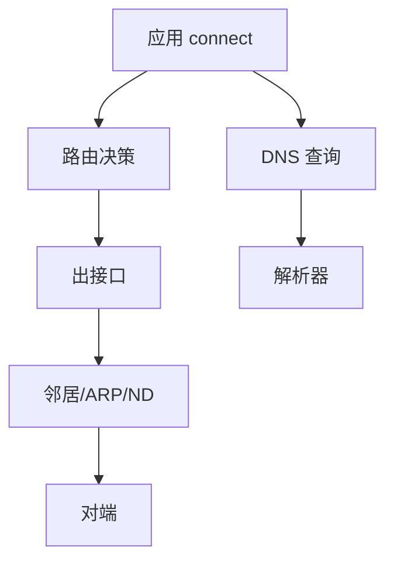

# Linux 网络配置：iproute2、DNS 与连通性排障

「有地址不能上网」按层拆：**链路 → 地址 → 路由 → DNS → 防火墙 → 对端**。工具以 `ip`/`ss` 为主。

## 源码锚点

| 路径 / 手册 | 作用 |
|-------------|------|
| `man ip` | 地址/路由/链路 |
| `man ss` | 套接字 |
| `man resolvectl` | systemd-resolved |
| `/etc/resolv.conf` | DNS（可能被托管） |

## 调用链



## 重点知识

```bash
ip -br link
ip -br addr
ip route
ss -lntup
ping -c 3 网关
ping -c 3 1.1.1.1
resolvectl status 2>/dev/null || cat /etc/resolv.conf
```

### 静态与 DHCP

NetworkManager、systemd-networkd、ifupdown 三选一为主，避免多网络管理器互踩。

### 常见坑

- 有 IPv6 无 IPv4 路由导致应用超时。
- DNS 通但 HTTP 被防火墙拦。
- 容器/`ip netns` 看错命名空间。
