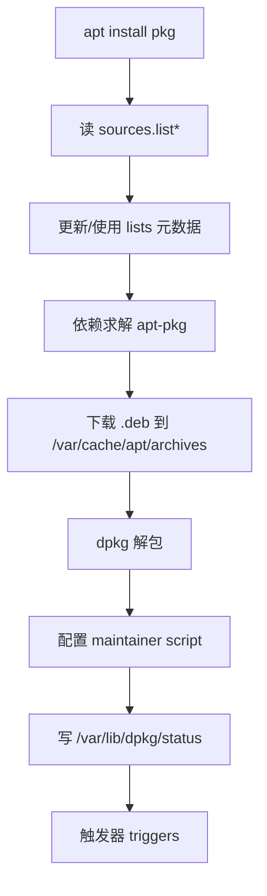
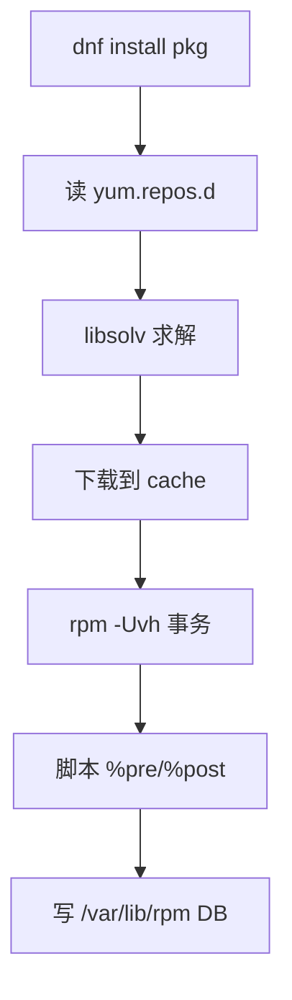
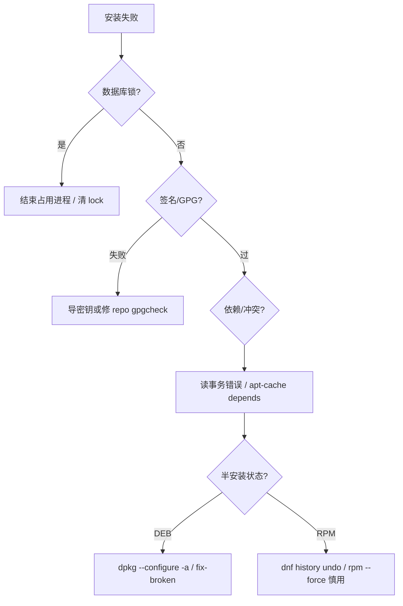

# yum 装完依赖炸了？rpm/dnf 与 dpkg/apt 对照：数据库、repo、签名与 broken 修复

「依赖冲突装不上」「半升级后 apt 全红」「GPG 校验失败」「版本被锁死升不了」——RPM 系与 DEB 系报错话术不同，但故障都落在 **本地软件包数据库、依赖求解器、仓库元数据、签名信任、版本锁定** 五层。本文合并 Linux 运维 chapter 031–036，按两边真实路径对照讲透。

---

## 阅读地图

| 层 | 主问题 | 读完能做什么 |
|----|--------|--------------|
| 1 | 两套生态怎么对应 | rpm/yum/dnf ↔ dpkg/apt 概念与命令对照 |
| 2 | 状态存在哪 | 会查 `/var/lib/rpm`、`/var/lib/dpkg` 与缓存目录 |
| 3 | 依赖如何算 | 读懂 Requires/Depends、冲突、破损状态 |
| 4 | 软件从哪来 | 配 repo/sources、理解元数据刷新与优先级 |
| 5 | 信任与锁定 | GPG/签名校验、versionlock/pin，并修 broken |

---

## 源码锚点

| 路径 | 作用 |
|------|------|
| RPM：`lib/rpmdb.c`、BDB/sqlite 后端 | 已安装包数据库 |
| RPM：`lib/depends.c` 等 | 依赖/冲突检查 |
| `/var/lib/rpm/` | RPM 系本机库（现代多为 sqlite） |
| DNF：`dnf` Python 包、`libdnf` / `libsolv` | 依赖求解（SAT） |
| `/etc/yum.repos.d/*.repo` | yum/dnf 仓库定义 |
| `/var/cache/dnf/` 或 `/var/cache/yum/` | 元数据与包缓存 |
| dpkg：`lib/dpkg/`、`/var/lib/dpkg/status` | DEB 状态真源 |
| `/var/lib/dpkg/info/*.list` | 各包安装文件清单 |
| `/var/lib/dpkg/info/*.md5sums` | 文件完整性（若提供） |
| apt：`apt-pkg/`、`/var/lib/apt/lists/` | 仓库索引缓存 |
| `/etc/apt/sources.list`、`sources.list.d/` | APT 源 |
| `/etc/apt/preferences`、`preferences.d/` | APT pin |
| `/etc/apt/apt.conf.d/` | APT 行为（代理、重试等） |
| `man rpm` `man dnf` `man dpkg` `man apt` `man apt_preferences` | 手册 |

本机（Debian/Ubuntu）可直接验证：

```bash
ls -la /var/lib/dpkg/status /var/lib/dpkg/info | head
ls /etc/apt/sources.list.d/
```

RPM 系机器对照：

```bash
ls /var/lib/rpm/
ls /etc/yum.repos.d/
rpm -qa | head
```

---

## 调用链

### DEB：apt 安装一条包



### RPM：dnf 安装一条包



### broken / 冲突排障顺序



---

## 重点知识

### 第 1 层：两套生态对照

#### 1.1 角色分工

| 角色 | RPM 系 | DEB 系 |
|------|--------|--------|
| 底层包格式 | `.rpm` | `.deb`（ar + tar） |
| 本地数据库工具 | `rpm` | `dpkg` |
| 高阶依赖/仓库 | `yum`（旧）/ `dnf`（新） | `apt` / `apt-get` / `aptitude` |
| 仓库配置 | `/etc/yum.repos.d/*.repo` | `/etc/apt/sources.list*` |
| 求解器 | libsolv（dnf） | apt 内部算法 |
| 典型发行版 | RHEL/Rocky/Fedora/SLES | Debian/Ubuntu |

底层工具**不管仓库**：`rpm -ivh a.rpm`、`dpkg -i a.deb` 缺依赖就失败或留下半配置。高阶工具负责下载依赖并排事务。

#### 1.2 命令速对照

| 任务 | dnf/yum | apt/dpkg |
|------|---------|----------|
| 更新索引 | `dnf makecache` / `dnf check-update` | `apt update` |
| 安装 | `dnf install pkg` | `apt install pkg` |
| 删除 | `dnf remove pkg` | `apt remove` / `apt purge` |
| 升级全部 | `dnf upgrade` | `apt upgrade` / `full-upgrade` |
| 查是否安装 | `rpm -q pkg` | `dpkg -l pkg` / `apt list --installed` |
| 查文件归属 | `rpm -qf /path` | `dpkg -S /path` |
| 列包内文件 | `rpm -ql pkg` | `dpkg -L pkg` |
| 信息 | `dnf info` / `rpm -qi` | `apt show` / `dpkg -s` |
| 搜 | `dnf search` | `apt search` |
| 清缓存 | `dnf clean all` | `apt clean` / `autoclean` |
| 历史 | `dnf history` | `/var/log/apt/history.log` |

```bash
# DEB 本机示例
dpkg -l | head
apt list --installed 2>/dev/null | head
dpkg -S /usr/bin/ls
dpkg -L coreutils | head
```

#### 1.3 包名与提供关系

两边都有「虚拟提供」：

- RPM：`Provides:` / `Obsoletes:` / `Conflicts:`
- DEB：`Provides:` / `Replaces:` / `Conflicts:` / `Breaks:`

```bash
# DEB
apt-cache show nginx | grep -E '^(Package|Version|Depends|Conflicts|Provides):'
apt-cache depends nginx
apt-cache rdepends libssl3 | head

# RPM
rpm -q --provides openssl
dnf repoquery --whatrequires libssl.so.3 2>/dev/null | head
```

「装 A 却卸了 B」往往是 Conflicts/Obsoletes/Breaks，不是随机。

---

### 第 2 层：数据库与磁盘上的真源

#### 2.1 dpkg 数据库（DEB）

核心文件：

| 路径 | 含义 |
|------|------|
| `/var/lib/dpkg/status` | 每个包的 Status/Version/Depends 等 |
| `/var/lib/dpkg/status-old` | 上一份 status 备份 |
| `/var/lib/dpkg/info/PKG.list` | 已安装文件列表 |
| `/var/lib/dpkg/info/PKG.md5sums` | 校验和（若有） |
| `/var/lib/dpkg/info/PKG.conffiles` | 配置文件列表 |
| `/var/lib/dpkg/info/PKG.{pre,post}{inst,rm}` | maintainer scripts |
| `/var/lib/dpkg/updates/` | 事务中的片段 |
| `/var/lib/dpkg/lock*` | 锁 |
| `/var/cache/apt/archives/` | 已下载 deb |
| `/var/lib/apt/lists/` | `apt update` 拉下的索引 |

```bash
# Status 行含义
dpkg -l nginx
# 期望：ii = 已安装且配置完成
# iF / iU / aF 等半状态见 man dpkg
```

`status` 里一段真实结构示例：

```text
Package: acl
Status: install ok installed
Architecture: amd64
Version: 2.2.53-10ubuntu1
Depends: libacl1 (= 2.2.53-10ubuntu1), libc6 (>= 2.33)
```

`Status: install ok installed` 三字段分别大致表示期望动作、错误标志、当前状态——排障 half-installed 就盯这里。

#### 2.2 rpm 数据库（RPM）

| 路径 | 含义 |
|------|------|
| `/var/lib/rpm/rpmdb.sqlite` 等 | 现代 Fedora/RHEL 的 sqlite 库 |
| 旧式 `Packages` BDB | 老系统仍可见 |
| `/var/cache/dnf/` | 元数据、包、solv 缓存 |
| `/var/lib/dnf/history*` | dnf 历史（版本相关） |

```bash
rpm -qa | wc -l
rpm -V coreutils          # 校验文件是否被改（改了会标 SMD...）
rpm --verify-all 2>/dev/null | head
```

数据库损坏时（少见）：`rpm --rebuilddb`（先备份 `/var/lib/rpm`）。

#### 2.3 锁与并发

```bash
# DEB
sudo fuser -v /var/lib/dpkg/lock-frontend /var/lib/dpkg/lock /var/cache/apt/archives/lock
# 常见：未结束的 apt/dpkg、无人值守升级

# RPM
sudo lsof /var/lib/rpm/* 2>/dev/null
sudo dnf clean all   # 不解决锁；应结束占用进程
```

**不要**在进程还在跑时删 lock 文件；先确认无 apt/dpkg/dnf 进程。

#### 2.4 查询「谁占用了这个文件」

```bash
# DEB
dpkg -S /etc/ssh/sshd_config
# RPM
rpm -qf /etc/ssh/sshd_config
```

配置文件被两个包声称拥有时，升级会交互询问（DEB conffile 提示）或按策略覆盖——自动化安装要设 `DEBIAN_FRONTEND=noninteractive` 并预答（需理解风险）。

---

### 第 3 层：依赖解析

#### 3.1 依赖类型对照

| 概念 | RPM 标签 | DEB 字段 |
|------|----------|----------|
| 硬依赖 | `Requires` | `Depends` |
| 预依赖 | （脚本顺序相关） | `Pre-Depends`（更严，配置前必须就绪） |
| 推荐 | `Recommends`（dnf 可关） | `Recommends`（apt 默认装） |
| 建议 | `Suggests` | `Suggests`（默认不装） |
| 冲突 | `Conflicts` | `Conflicts` / `Breaks` |
| 取代 | `Obsoletes` | `Replaces` / `Obsoletes` |
| 提供 | `Provides` | `Provides` |

```bash
# 关闭推荐（瘦身容器常用）
sudo apt install --no-install-recommends pkg
# dnf
sudo dnf install -y pkg --setopt=install_weak_deps=False
```

#### 3.2 求解失败怎么读

APT 典型：

```text
The following packages have unmet dependencies:
 X depends on Y (>= 2.0) but Z is to be installed
 E: Unable to correct problems, you have held broken packages.
```

动作：

```bash
apt-cache policy X Y
apt-cache depends X
sudo apt install -f          # 等价 fix-broken
dpkg --configure -a
apt-mark showhold
```

DNF 典型：

```text
Error: 
 Problem: package A requires B = 1.2, but none of the providers can be installed
```

动作：

```bash
dnf repoquery --requires A
dnf repoquery --whatprovides 'B = 1.2'
dnf install A --allowerasing   # 允许卸冲突包，慎用
dnf check
```

#### 3.3 「版本相等依赖」的坑

DEB 常见 `libfoo1 (= 1.2.3-1)` **严格同版本**。只升级主包不升级库、或混用两个 Ubuntu 口袋，会立刻 broken。

```bash
apt-cache showpkg libssl3 | head -40
```

RPM 用 `so` 名依赖（`libssl.so.3()(64bit)`）有时更弹性，但主版本升级同样会卸一串。

#### 3.4 事务与脚本失败

| 阶段 | DEB | RPM |
|------|-----|-----|
| 解包前 | `preinst` | `%pre` |
| 解包后 | `postinst` | `%post` |
| 删除前 | `prerm` | `%preun` |
| 删除后 | `postrm` | `%postun` |

脚本非 0 退出 → DEB 常留在 `iF`（half-configured）；RPM 事务回滚或留下失败历史。

```bash
# 看 DEB 脚本
ls /var/lib/dpkg/info/nginx.*
sudo bash -x /var/lib/dpkg/info/nginx.postinst configure   # 仅排障时，懂风险再跑

# 日志
sudo tail -100 /var/log/dpkg.log
sudo tail -100 /var/log/apt/term.log
```

---

### 第 4 层：仓库（repo / sources）

#### 4.1 APT 源

```bash
cat /etc/apt/sources.list
ls /etc/apt/sources.list.d/
# 现代 deb822 格式：*.sources
```

一行式：

```text
deb http://archive.ubuntu.com/ubuntu jammy main restricted universe multiverse
deb http://archive.ubuntu.com/ubuntu jammy-updates main restricted universe multiverse
deb http://security.ubuntu.com/ubuntu jammy-security main restricted universe multiverse
```

| 口袋 | 作用 |
|------|------|
| `main` 等组件 | 包分类 |
| `jammy-updates` | 常规更新 |
| `jammy-security` | 安全更新 |
| `jammy-backports` | 较新版本，优先级默认较低 |

```bash
sudo apt update
ls /var/lib/apt/lists/ | head
apt-cache policy nginx
```

`policy` 输出候选版本与 pin 优先级，是查「为什么装的是旧版」的第一工具。

#### 4.2 yum/dnf repo

`/etc/yum.repos.d/example.repo`：

```ini
[appstream]
name=AppStream
baseurl=https://mirror.example/centos/\$releasever/AppStream/\$basearch/os/
# 或 metalink=/mirrorlist=
enabled=1
gpgcheck=1
gpgkey=file:///etc/pki/rpm-gpg/RPM-GPG-KEY-centosofficial
```

```bash
dnf repolist
dnf repoinfo
dnf makecache
```

禁用某源：

```bash
sudo dnf config-manager --set-disabled epel
# 或 repo 文件 enabled=0
```

#### 4.3 元数据过期与混源

| 症状 | 常见因 |
|------|--------|
| 大量 404 | 源迁了、发行版 EOL、口袋名写错 |
| 依赖无解 | 混了两个发行版/两个大版本的源 |
| 突然要降级 | 高优先级源提供了更低版本（少见）或 pin 错误 |

EOL 的 Ubuntu 需 `old-releases.ubuntu.com`（本机若仍指向旧代号，更新失败先查是否 EOL）。

#### 4.4 本地/离线仓

```bash
# DEB：本地目录当源
# deb [trusted=yes] file:/srv/local-debs ./
cd /srv/local-debs && dpkg-scanpackages . /dev/null | gzip > Packages.gz

# RPM
createrepo_c /srv/local-rpms
# 再写 baseurl=file:///srv/local-rpms
```

内网镜像用 `baseurl`/`deb` 指到镜像即可；注意 **GPG** 与 **架构**。

---

### 第 5 层：签名校验与版本锁定

#### 5.1 GPG / 签名

**APT：**

```bash
ls /etc/apt/trusted.gpg.d/
# 新式 signed-by=
# deb [signed-by=/usr/share/keyrings/foo.gpg] https://example.com stable main
sudo apt-key list 2>/dev/null   # 旧接口，逐步淘汰
```

报错 `NO_PUBKEY` / `EXPKEYSIG`：

```bash
# 按发行版文档导入 keyring 到 /usr/share/keyrings/ 并在源中写 signed-by
sudo apt update
```

**DNF/RPM：**

```bash
rpm -qa gpg-pubkey*
sudo rpm --import /etc/pki/rpm-gpg/RPM-GPG-KEY-*
# repo 中 gpgcheck=1 务必保持
```

临时 `gpgcheck=0` 只用于抢救排障，修完立刻改回。

#### 5.2 校验包文件

```bash
# DEB
dpkg --verify coreutils 2>/dev/null | head
debsums -s coreutils 2>/dev/null   # 需 debsums 包

# RPM
rpm -V openssh-server
```

#### 5.3 版本锁定

**APT pin**（`/etc/apt/preferences.d/nginx`）：

```text
Package: nginx
Pin: version 1.18.*
Pin-Priority: 1001
```

```bash
apt-cache policy nginx
sudo apt-mark hold nginx
apt-mark showhold
sudo apt-mark unhold nginx
```

`hold` 阻止升级该包；`Pin-Priority >= 1000` 可强制保留/甚至降级（危险，需理解 policy）。

**DNF versionlock：**

```bash
sudo dnf install python3-dnf-plugin-versionlock
sudo dnf versionlock add nginx-*
sudo dnf versionlock list
sudo dnf versionlock delete nginx-*
```

**yum versionlock** 插件在旧系统类似。

#### 5.4 发行版升级与第三方源

升级大版本前：禁用第三方 `.list`/`.repo`，先保证官方源可 `update`/`upgrade`，再逐个加回。混源是 broken packages 的高频根因。

---

### 排障专题

#### A. `E: Unable to correct problems, you have held broken packages`

```bash
apt-mark showhold
dpkg -l | awk '/^i[^i]/ {print}'     # 非 ii 的包
sudo dpkg --configure -a
sudo apt-get -f install
sudo apt full-upgrade
```

仍失败则对具体包：

```bash
sudo apt install pkg=version
# 或暂时
sudo apt remove --purge conflicting-pkg
```

#### B. dpkg 卡在 half-installed / half-configured

```bash
sudo dpkg -l | grep -E '^i[UF]'
sudo dpkg --configure -a
# 某包脚本死循环时，读 term.log，必要时手动改脚本后 configure（高风险）
sudo apt-get install --reinstall pkg
```

#### C. 锁：`Could not get lock`

```bash
ps aux | grep -E 'apt|dpkg|unattended'
sudo systemctl status unattended-upgrades
# 等其结束；确认无进程后再考虑删陈旧 lock（确认安全）
```

#### D. DNF `Protected packages` / 卸不掉

```bash
dnf remove pkg
# 保护列表
cat /etc/dnf/protected.d/*
```

内核、systemd、dnf 自身常被保护。

#### E. 签名失败

```bash
# APT
sudo apt update 2>&1 | tee /tmp/apt-up.txt
grep -i NO_PUBKEY /tmp/apt-up.txt

# DNF
sudo dnf update 2>&1 | grep -i -E 'gpg|sign'
```

按官方文档装 keyring，避免网上随手 `gpgcheck=0`。

#### F. 404 Not Found

```bash
apt-cache policy pkg
# 检查代号是否 EOL、镜像是否同步、架构是否正确
uname -m
dpkg --print-architecture
```

#### G. 重装坏掉的包

```bash
# DEB
sudo apt install --reinstall coreutils
sudo apt download coreutils && sudo dpkg -i coreutils_*.deb

# RPM
sudo dnf reinstall coreutils
sudo rpm -Uvh --replacepkgs coreutils-*.rpm
```

#### H. 只下载不装

```bash
apt download pkg
sudo apt-get install --download-only pkg
dnf download pkg
```

#### I. 查看一次失败的事务

```bash
# DEB
less /var/log/apt/history.log
less /var/log/apt/term.log

# RPM
dnf history
sudo dnf history info last
sudo dnf history undo last    # 回滚上次，慎用
```

---

### 可执行对照实验（在测试机）

```bash
# --- DEB ---
apt-cache policy bash
dpkg -l bash
dpkg -L bash | head
dpkg -S /bin/bash
apt-cache depends bash | head
# 模拟 hold
sudo apt-mark hold bash
apt-mark showhold
sudo apt-mark unhold bash

# --- 若有 RPM 机 ---
# rpm -q bash; rpm -ql bash | head; rpm -qf /usr/bin/bash
# dnf repoquery --requires bash | head
```

把「查询 → 依赖 → 源优先级 → 锁定」跑一遍，比背报错信息有效。

---

### maintainer script 与配置文件策略

DEB **conffile**：包声明的配置文件，升级时若本地改过，dpkg 会提问保留或覆盖。

```bash
dpkg-query -W -f='${Conffiles}\n' openssh-server
# /var/lib/dpkg/info/openssh-server.conffiles
```

自动化：

```bash
sudo DEBIAN_FRONTEND=noninteractive apt-get install -y -o Dpkg::Options::="--force-confdef" -o Dpkg::Options::="--force-confold" pkg
```

含义：默认选维护者默认，冲突时保留旧文件——仍要在变更窗口验证服务能否起来。

RPM 常用 `%config(noreplace)`：本地改过的配置不覆盖，新文件写成 `.rpmnew`。

```bash
rpm -qc openssh-server
find /etc -name '*.rpmnew' -o -name '*.rpmsave' 2>/dev/null | head
```

---

### 缓存、磁盘与「下了一半」

```bash
du -sh /var/cache/apt/archives /var/lib/apt/lists 2>/dev/null
du -sh /var/cache/dnf 2>/dev/null

sudo apt clean
sudo apt autoclean
sudo dnf clean all
```

磁盘满会导致 dpkg 解包失败并留下半状态——先 `df -h` 再 fix-broken。

---

### 多架构与交叉

```bash
dpkg --print-architecture
dpkg --print-foreign-architectures
# 例：amd64 主机装 i386 库
# sudo dpkg --add-architecture i386 && sudo apt update
```

RPM 有 `x86_64`/`i686`/`noarch`；`dnf` 默认本架构。混架构依赖报错时先看 `rpm -q --qf '%{NAME}.%{ARCH}\n' pkg`。

---

### 优先级与「为什么候选不是最新」

```bash
apt-cache policy nginx
# 看 500 / 100 / 1001 等数字
```

常见优先级：

| 值 | 含义 |
|----|------|
| 500 | 普通仓库默认 |
| 100 | 已安装版本常以此参与比较 |
| <=0 | 禁止自动安装 |
| >=1000 | 强制（可导致降级） |

backports 常通过 pin 保持较低优先级，需显式 `apt install pkg/jammy-backports`。

DNF：

```bash
dnf config-manager --dump | grep -i priority
# repo 内 priority= 数值越小越优先（与发行版文档为准）
```

---

### 安全更新实践

```bash
# DEB：只上安全更新（思路，具体工具随发行版）
sudo unattended-upgrade --dry-run
sudo apt list --upgradable

# RPM
sudo dnf update --security
sudo dnf updateinfo list sec
```

生产建议：**变更窗口 + 快照/备份 + history 可回滚**，避免无监控全库 `upgrade`。

---

### 容器镜像里的包管理

- 官方精简镜像常无 man 页、无 docs；`apt` 需要先 `update`。
- 多层 Dockerfile 应 `update && install && clean` 同一 `RUN`，减小层体积。
- 发行版选择决定包名（`python3` vs `python39` 等），不可假设跨系同名。

```dockerfile
RUN apt-get update \
 && apt-get install -y --no-install-recommends curl ca-certificates \
 && rm -rf /var/lib/apt/lists/*
```

---

### 源码级：为何需要「高阶工具」

设计分层：

1. **rpm/dpkg**：可靠地解包、跑脚本、写数据库——像「本地事务引擎」。
2. **dnf/apt**：拉取远程元数据、跑求解器、下载闭包、再调用底层——像「计划器」。

直接 `dpkg -i` 一堆无序 deb，极易 half-configured；直接 `rpm -Uvh *.rpm` 缺符号提供就失败。生产默认走高阶工具，底层留给抢救。

libsolv（dnf）把依赖当成 SAT 问题求可行解；APT 用自有启发式。两者都可能在「人为 hold + 混源」时无解——此时应减约束（卸 hold、禁第三方源），而不是 `--force` 硬装。

---

### 强制手段（最后手段）

```bash
# DEB —— 可能破坏系统一致性
sudo dpkg -i --force-overwrite pkg.deb
sudo dpkg -i --force-depends pkg.deb   # 极危险

# RPM
sudo rpm -Uvh --nodeps --force pkg.rpm # 极危险
```

强制之后必须紧跟：

```bash
sudo apt-get -f install
# 或
sudo dnf check
rpm -qa --qf '%{NAME}\n' | sort | uniq -d
```

并计划在维护窗口重建一致性（重装冲突包或回滚镜像）。

---

### 日志与审计位置汇总

| 系 | 路径 |
|----|------|
| APT 历史 | `/var/log/apt/history.log` |
| APT 终端 | `/var/log/apt/term.log` |
| dpkg | `/var/log/dpkg.log` |
| DNF | `/var/log/dnf.log`（路径随版本） |
| yum | `/var/log/yum.log` |
| 事务回滚 | `dnf history undo` |

把「谁在何时装了何包」对上变更单，是回溯配置漂移的基本功。

---

### 常见误区（纠正）

**误区 1：apt update 就是升级**  
`update` 只刷新索引；升级是 `upgrade`/`full-upgrade`。

**误区 2：删 lock 能修好一切**  
锁在保护数据库；真修好是等进程结束或杀**确认卡死**的进程。

**误区 3：gpgcheck=0 可长期关**  
等于放弃供应链底线；只允许短暂排障。

**误区 4：versionlock 后忘记录**  
后人 `upgrade` 失败会误判为依赖 bug；锁清单应进文档/配置管理。

**误区 5：混用两个 Ubuntu 代号的源**  
几乎必然 broken；用 `policy` 看候选是否来自奇怪口袋。

---

### 最小急救卡（按系）

**DEB 急救顺序：**

```bash
sudo dpkg --configure -a
sudo apt-get -f install
apt-mark showhold
apt-cache policy 问题包
sudo apt update
# 仍挂：禁第三方源后再 update
```

**RPM 急救顺序：**

```bash
sudo dnf clean all && sudo dnf makecache
sudo dnf check
dnf history
sudo dnf update --nobest   # 某些冲突场景可试，理解后再用
# 签名：rpm --import ...
```

---

### 与「用户/PAM」篇的关系

装 `openssh-server`、`sudo`、`libpam-*` 本身走本篇的包管理；装完后的登录行为走账户与 PAM。**包版本升级可能改 PAM 公共文件**（Debian `pam-auth-update`），升级后若登录异常，两边对照查。

```bash
# 升级后 PAM 相关包
dpkg -l 'libpam*' 'sudo' 'openssh-server' | grep ^ii
```

---

### 附录：字段与子命令速查

**dpkg -l 第一列两个字符（节选）：**

| 字符 | 含义 |
|------|------|
| `ii` | 期望安装，且已安装配置完 |
| `rc` | 已删二进制，配置残留（remove 未 purge） |
| `un` | 未知/未安装 |
| `iF` | 安装未配置完（失败） |
| `iU` | 已解包未配置 |

**rpm 查询格式串：**

```bash
rpm -qa --qf '%{NAME}-%{VERSION}-%{RELEASE}.%{ARCH}\n' | head
rpm -q --qf '%{PREIN}\n' openssh-server | head
```

**apt 子命令：**

```bash
apt why pkg          # 较新 apt：为何装了某包
apt why-not pkg
apt full-upgrade --dry-run
```

**dnf 组与模块（RHEL 系）：**

```bash
dnf group list
dnf module list 2>/dev/null
# 模块流选错会导致「版本锁死在旧流」
```

模块（AppStream module）是 RPM 系特有复杂度：某语言运行时锁在 stream 上，表现像「怎么也升不到新版」。处理：`dnf module reset` / `switch-to`（先读发行版文档）。

---

### 实战案例串讲

#### 案例 1：第三方源导致 OpenSSL 冲突

现象：`apt install` 提示 `libssl` 版本无法满足。  
查：`apt-cache policy libssl3` 发现候选来自来历不明源。  
处理：移走该 `.list`，`apt update`，再 `-f install`。

#### 案例 2：`held broken packages` 其实是 hold

现象：安全更新装不上。  
查：`apt-mark showhold` 见 `libc6`。  
处理：评估后 `unhold`，或暂时只给安全口袋更高 pin。

#### 案例 3：dnf 事务中断电

现象：开机后 rpm 报 DB 忙或包不完整。  
查：`dnf history` 最后一条失败；`rpm -V` 一批关键包。  
处理：备份后 `dnf history redo`/`undo`，或重装受损包；必要时 `--rebuilddb`。

#### 案例 4：配置文件被覆盖

现象：升级 nginx 后站点挂。  
查：DEB 是否选了维护者版本；RPM 是否出现 `.rpmnew` 未合并。  
处理：从备份/`*.ucf-dist`/`*.rpmnew` 合并配置，`nginx -t` 后 reload。

#### 案例 5：容器里 apt update 失败

现象：证书错误或时间不对。  
查：`date`、`ca-certificates` 包是否装、是否用了 HTTP 镜像。  
处理：先装/更新 `ca-certificates`，校正时间，再 update。

---

### 知识面补全：下载代理与企业镜像

```bash
# APT
# /etc/apt/apt.conf.d/proxy.conf
# Acquire::http::Proxy "http://proxy:8080";

# DNF
# /etc/dnf/dnf.conf
# proxy=http://proxy:8080
```

企业内网常自建 Pulp/Nexus/Aptly 镜像：主机只指向内网 URL，**GPG key 同步**与 **口袋/repo id 对齐**仍必须。

---

### 卸载残留

```bash
# DEB：remove 留配置，purge 删配置
sudo apt remove pkg
sudo apt purge pkg
sudo apt autoremove --purge

# RPM
sudo dnf remove pkg
# 配置常留 *.rpmsave；需人工清理
```

`autoremove` 会删「自动安装且不再需要」的依赖——先 `apt autoremove --dry-run` 看列表，避免误删元包拉进来的组件。

---

### 把 chapter 031–036 收成一条线

源章节关键词「apt yum dnf；pin；repo GPG」对应本篇五层：

**格式与工具对照 → 本地数据库 → 依赖求解 → 仓库元数据 → 签名与版本锁定 → broken 急救。**

现场口令：**policy/repoquery → 看 Status/history → 查 hold/versionlock → 验 GPG → fix-broken/check**。两边命令不同，层同一套。

---

### 收束对照表（贴终端）

| 你要问的事 | DEB | RPM |
|------------|-----|-----|
| 装了什么版本 | `apt-cache policy` / `dpkg -s` | `rpm -qi` / `dnf info` |
| 谁依赖我 | `apt-cache rdepends` | `dnf repoquery --whatrequires` |
| 文件属谁 | `dpkg -S` | `rpm -qf` |
| 为何不升级 | `policy` + `hold` + pin | `versionlock` + module |
| 如何回滚 | 重装旧版 deb / 快照 | `dnf history undo` |
| 库坏了 | 备份后修 status / 重装 | `--rebuilddb` |

以平台手册与本机路径为准；不确定的发行版差异（尤其商业 RHEL 订阅源、Ubuntu ESM）按厂商文档叠加，不臆造错误码。
