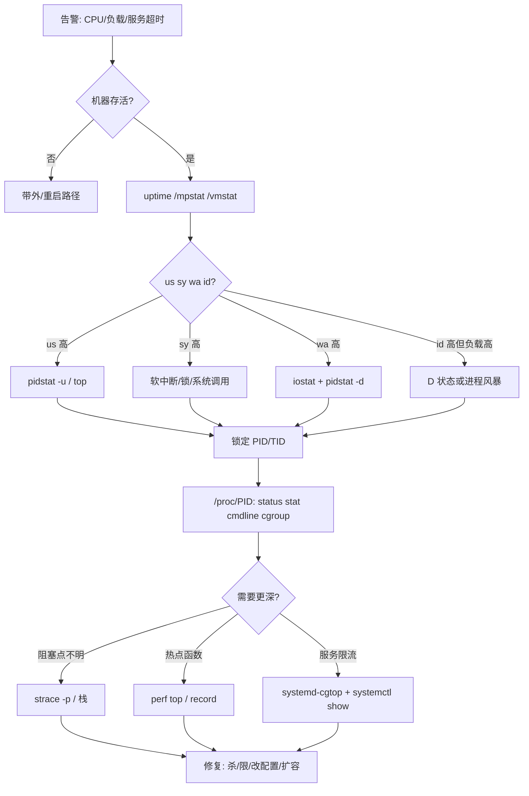
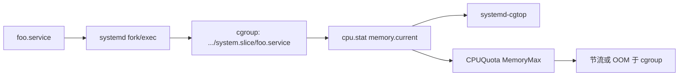

# CPU 100% 却找不到凶手？从 ps/top、/proc、信号到 systemd cgroup 排透

告警里写「CPU 100%」，`top` 第一屏却全是 idle，或者某个 `%CPU` 只有个位数的进程把整机拖死——这类故障几乎都不是「再看一眼 top 就行」。真正的凶手可能藏在 **短生命周期子进程**、**不可中断 D 状态**、**软中断/kworker**、**systemd slice 配额**，或 **OOM killer 刚杀完又被重启拉起**。运维侧要把 `/proc` 读成「进程真相」、把 `ps/top/pidstat` 读成「时间窗采样」、把信号与 `nice/chrt` 当成「可控干预」、把 `systemd-cgtop` 与 unit 资源限制当成「按服务收口」。

本文合并 Linux运维 chapter **019–024（进程管理）** 提纲，按真实路径与可执行命令重写。验收标准：给定一台告警机，你能在 5 分钟内区分 **用户态热点 / 内核态 / IO wait / cgroup 限速 / 进程风暴**，并留下可复现的证据链（命令输出 + `/proc` 快照 + 必要时 `strace`/`perf`）。

---

## 阅读地图

全文按五层展开，每层一个主问题：

| 层 | 主问题 | 你读完后应能做 |
|----|--------|----------------|
| 一、内核进程模型与 `/proc` | 进程在内核里长什么样？用户态从哪读？ | 用 `/proc/PID/*` 核对状态、线程、FD、oom_score |
| 二、观测工具 | `ps`/`top`/`htop`/`pidstat` 各自骗你什么？ | 选对工具与采样窗口，抓住短命进程 |
| 三、信号与优先级 | 如何优雅停、强制杀、调优先级？ | `kill`/`SIG*`、`nice`/`renice`/`chrt` 不踩坑 |
| 四、systemd 与 cgroup | 服务资源谁在记账？ | `systemd-cgtop`、slice/unit 限额、定位「整机空闲但服务被卡」 |
| 五、排障闭环 | CPU 满/僵尸/D 状态/OOM 怎么走？ | 固定路径：现象 → 资源 → PID → 栈/syscall → 修复 |

源归属：`articles/Linux运维/chapters/019-进程管理核心概念与原理.md` ～ `024-进程管理的常见问题与解决方案.md`。

---

## 源码锚点

| 路径 / 符号 / 手册 | 作用 |
|--------------------|------|
| `include/linux/sched.h` — `struct task_struct` | 内核进程描述符：状态、pid、mm、信号、调度实体 |
| `fs/proc/` — `/proc/PID/*` | 用户态观察入口：`status`/`stat`/`cmdline`/`fd`/`stack` |
| `kernel/signal.c` | 信号投递、`kill`/`tgkill` 路径 |
| `kernel/sched/core.c` | 调度入口；与 `%CPU`、load 间接相关 |
| `mm/oom_kill.c` | OOM 选人；对照 `/proc/PID/oom_score` |
| `man 5 proc` | `/proc` 字段语义 |
| `man 1 ps` `top` `htop` | 进程列表与交互观测 |
| `man 1 pidstat` | 按 PID 分 CPU/内存/IO 采样（sysstat） |
| `man 1 kill` `killall` `pkill` | 发信号 |
| `man 7 signal` | `SIGTERM`/`SIGKILL`/`SIGSTOP` 等 |
| `man 1 nice` `renice` `chrt` | 优先级与调度策略 |
| `man 1 systemd-cgtop` | cgroup 资源实时视图 |
| `man 5 systemd.resource-control` | `CPUQuota=`/`MemoryMax=` 等 |
| `man 1 strace` | 跟系统调用，抓「卡在哪」 |

`task_struct`（简述，字段随内核版本增减，以本机头文件为准）：

```c
/* include/linux/sched.h — 示意，非完整结构 */
struct task_struct {
	unsigned int			__state;   /* TASK_RUNNING / INTERRUPTIBLE / UNINTERRUPTIBLE … */
	void				*stack;
	int				prio, static_prio, normal_prio;
	const struct sched_class	*sched_class;
	struct sched_entity		se;        /* CFS */
	struct mm_struct		*mm;
	pid_t				pid;
	pid_t				tgid;      /* 线程组 ID，用户态常称「进程 PID」 */
	struct task_struct		*real_parent;
	/* signal / files / nsproxy / cgroups … */
};
```

对运维而言：用户态看到的「一个进程」多对应一个 **线程组（tgid）**；`ps -L` / `top -H` 才展开到每个 `task_struct`（tid）。

本机先摸清 `/proc` 与工具是否可用：

```bash
uname -r
ls /proc/self
ps --version
top -v 2>/dev/null || true
command -v htop pidstat systemd-cgtop strace chrt
cat /proc/1/status | head -20
```

---

## 调用链

### 从告警到 PID 的排障主链



### 信号投递与进程退出（运维视角）

```mermaid
sequenceDiagram
    participant OPS as 运维 kill
    participant KER as kernel/signal.c
    participant T as task_struct
    participant EXIT as do_exit
    OPS->>KER: kill(pid, SIGTERM)
    KER->>T: 挂 pending / 唤醒可中断睡眠
    alt 进程处理 SIGTERM
        T->>EXIT: 清理后退出
    else 忽略或卡在 D 状态
        OPS->>KER: kill -9 / SIGKILL
        KER->>T: 强制终止(不可忽略)
        Note over T: D 状态可能仍延迟到离开内核路径
    end
    EXIT-->>OPS: /proc 消失; 父未 wait 则变 Z
```

### systemd 服务进程与 cgroup 记账



---

## 第一层：进程模型与 `/proc/PID`——真相在文件系统里

### 进程、线程、线程组

- **PID（用户习惯）**：多数工具打印的是 **tgid**，即线程组领导者。
- **TID**：单个 `task_struct`；同组线程共享地址空间、打开文件表（默认）。
- **PPID**：父进程；孤儿被 `systemd`（PID 1）或子重父收养。
- **会话 / 进程组**：`setsid`、作业控制、`kill -- -PGID` 批量信号的基础。

```bash
# 当前 shell 的进程身份
echo "$$"
ps -o pid,ppid,pgid,sid,tty,cmd -p $$
cat /proc/$$/status | egrep '^(Name|State|Tgid|Pid|PPid|Uid|Gid|NSpid):'
```

### `/proc/PID` 必读文件

| 文件 | 用途 |
|------|------|
| `cmdline` | 启动参数（`\0` 分隔）；空则多为内核线程 |
| `comm` | 16 字节短名；`ps` 的 COMMAND 常来自此 |
| `status` | 人类可读：State、VmRSS、Threads、voluntary_ctxt_switches、oom_score |
| `stat` | 单行机器字段；`ps`/`top` 算 `%CPU` 的原料之一 |
| `statm` | 页为单位的内存概览 |
| `io` | rchar/wchar/read_bytes/write_bytes（需权限） |
| `fd/` | 打开文件与 socket |
| `fdinfo/` | 偏移、flags |
| `stack` | 内核栈（root；看卡在哪） |
| `wchan` | 阻塞通道名 |
| `cgroup` | 所属 cgroup 路径（对接 systemd） |
| `environ` | 环境变量（权限敏感） |
| `limits` | RLIMIT_* |
| `oom_score` / `oom_score_adj` | OOM 选人倾向 |
| `sched` / `schedstat` | 调度统计 |
| `smaps` / `smaps_rollup` | 内存映射明细 / PSS 汇总 |
| `task/` | 每个 TID 的子目录 |

```bash
PID=$(pgrep -n systemd || echo 1)
echo "=== cmdline ==="; tr '\0' ' ' < /proc/$PID/cmdline; echo
echo "=== status 摘要 ==="
egrep '^(Name|Umask|State|Tgid|Ngid|Pid|PPid|TracerPid|Uid|Gid|FDSize|Groups|NStgid|NSpid|VmPeak|VmSize|VmRSS|VmData|VmStk|Threads|SigQ|SigPnd|SigBlk|SigIgn|SigCgt|CapEff|Seccomp|Cpus_allowed_list|voluntary_ctxt_switches|nonvoluntary_ctxt_switches):' /proc/$PID/status
echo "=== cgroup ==="; cat /proc/$PID/cgroup
echo "=== oom ==="; cat /proc/$PID/oom_score /proc/$PID/oom_score_adj
echo "=== limits (部分) ==="; egrep 'Max open files|Max processes|Max rss' /proc/$PID/limits
```

### 状态字段怎么读

`status` 里 `State:` 常见：

| 字母 | 含义 | 运维含义 |
|------|------|----------|
| R | Running / runnable | 在跑或在跑队列 |
| S | Interruptible sleep | 正常等待（多数服务多数时间） |
| D | Uninterruptible sleep | 常卡在磁盘/NFS/锁；`kill -9` 也未必立刻消失 |
| T | Stopped | `SIGSTOP`/`SIGTSTP`；被调试或作业控制停住 |
| Z | Zombie | 已死未 wait；占 pid 不占 CPU |
| I | Idle kernel thread | 内核空闲线程（较新内核） |

```bash
# 全机异常状态速览
ps -eo pid,ppid,stat,wchan:20,cmd | awk '$3 ~ /D|Z|T/ {print}'
# 或
grep -H '^State:' /proc/[0-9]*/status 2>/dev/null | grep -E 'D|Z|T'
```

### `stat` 与「CPU 百分比」从哪来

`/proc/PID/stat` 字段很多（见 `man 5 proc`）。工具用两次采样间隔内的 **utime+stime** 差值相对墙上时间算 `%CPU`。所以：

- 采样窗口太短 → 抖动大；
- 进程生命周期短于窗口 → `top` 可能「看不见」；
- 多核上 `%CPU` 可超过 100（按线程累加时）。

```bash
# 原始 jiffies（字段 14=utime, 15=stime，从 1 起算）
awk '{print "pid="$1,"comm="$2,"state="$3,"ppid="$4,"utime="$14,"stime="$15,"num_threads="$20,"starttime="$22}' /proc/1/stat
# HZ
getconf CLK_TCK
```

### 线程与 FD 泄漏现场

```bash
PID=$(pgrep -n bash)
ls /proc/$PID/task | wc -l
ps -L -p $PID -o pid,tid,psr,pcpu,stat,comm
ls /proc/$PID/fd 2>/dev/null | wc -l
# 看 FD 指向
ls -l /proc/$PID/fd 2>/dev/null | head
```

FD 数逼近 `Max open files` 时，业务会报 `Too many open files`；此时 `%CPU` 可能不高，但连接建立失败。

---

## 第二层：ps / top / htop / pidstat——同一真相的不同镜头

### `ps`：快照与脚本友好

常用 BSD / UNIX 风格混用，记几组固定配方即可：

```bash
# 全量关键列
ps aux --sort=-%cpu | head -20
ps -eo pid,ppid,user,stat,pcpu,pmem,vsz,rss,nlwp,etime,cmd --sort=-pcpu | head -20

# 按内存
ps -eo pid,user,rss,vsz,cmd --sort=-rss | head -20

# 某用户 / 某命令
ps -u www-data -o pid,stat,pcpu,rss,cmd
ps -C nginx -o pid,ppid,stat,pcpu,rss,cmd

# 线程
ps -eLf | head
ps -T -p <PID>

# 森林（看谁拉起谁）
ps -ejH
pstree -aps <PID>
```

`STAT` 多字符：`Ssl` 表示会话领导者 + 多线程 + 可中断睡眠；`R+` 在前台跑。脚本里不要解析 `ps` 人类表头当稳定 API，优先读 `/proc` 或用 `ps -o` 固定列。

```bash
# 只输出 PID 列表给后续管道
pgrep -a nginx
pidof nginx
pgrep -f 'java.*OrderService'
```

### `top`：交互总览与字段含义

```bash
top -b -n 1 -o %CPU | head -40          # 批处理，适合采集
top -b -n 1 -o %MEM | head -40
top -H -p <PID>                         # 按线程
top -p $(pgrep -d, -f nginx)            # 限定若干 PID
```

第一行 load 与 CPU 行（us/sy/ni/id/wa/hi/si/st）决定下一步：

| 现象 | 优先动作 |
|------|----------|
| us 高 | `pidstat -u` / `perf top` |
| sy 高 | 系统调用过多、锁、内核模块；`pidstat -u` 看 system 列，必要时 `perf` |
| wa 高 | 磁盘/NFS；`iostat -xz 1`、`pidstat -d` |
| si/hi 高 | 软/硬中断；`/proc/interrupts`、`/proc/softirqs` |
| st 高 | 虚拟机被宿主机偷时间 |
| id 高但 load 高 | 大量 D 或短命进程；别只盯 `%CPU` |

`top` 默认是 **累计采样**；按 `i` 可隐藏 idle，按 `H` 开线程模式，按 `c` 显示完整命令行。

### `htop`：树、过滤、亲和力

有 TTY 时 `htop` 更适合人工：

```bash
htop
# F5 树状；F4 过滤；F6 排序；F9 发信号；F7/F8 nice
```

注意：容器/精简镜像可能没有 `htop`；自动化采集仍用 `ps`/`pidstat`/`top -b`。

### `pidstat`：带时间轴的分 PID 统计

`pidstat` 属于 sysstat，适合「每隔一秒看谁在涨」：

```bash
# CPU：含 user/system/guest，可看 -t 线程
pidstat -u 1 5
pidstat -u -p ALL 1 3
pidstat -u -t -p <PID> 1 5

# 内存
pidstat -r 1 5

# 磁盘 IO（找谁在刷盘）
pidstat -d 1 5

# 上下文切换（自愿/非自愿）
pidstat -w 1 5

# 同时多类
pidstat -urd 1 5
```

短命进程杀手锏：

```bash
# 显示已消失进程的累计（视版本选项）
pidstat -u 1 10
# 同时用：
execsnoop-bpfcc 2>/dev/null || true   # 若安装 BCC
# 或审计/execve 跟踪（环境允许时）
```

若 `%CPU` 总屏里看不到大户，但 `vmstat` 的 `r` 列长期 > CPU 核数，用下面「进程风暴」段。

### 工具对照

| 需求 | 首选 |
|------|------|
| 脚本取一次列表 | `ps -eo …` |
| 人眼扫整机 | `top` / `htop` |
| 确认是谁吃 CPU/IO 且要曲线 | `pidstat` |
| 核对状态/FD/cgroup | `/proc/PID` |
| 服务级资源 | `systemd-cgtop` |
| 卡在哪个 syscall | `strace -p` |

---

## 第三层：信号、优雅退出与优先级——干预也有协议

### 信号清单（运维高频）

| 信号 | 默认动作 | 典型用途 |
|------|----------|----------|
| `SIGTERM` (15) | 终止 | 优雅退出；systemd `systemctl stop` 默认先发 |
| `SIGINT` (2) | 终止 | Ctrl+C |
| `SIGHUP` (1) | 终止（daemon 常改义） | 重载配置（nginx/httpd 惯例） |
| `SIGUSR1`/`SIGUSR2` | 终止（常改义） | 应用自定义 |
| `SIGQUIT` (3) | core | 需 core 时 |
| `SIGKILL` (9) | 必杀 | 最后手段；进程不能捕获 |
| `SIGSTOP` (19) | 暂停 | 不能捕获；冻住排查 |
| `SIGCONT` (18) | 继续 | 解冻 |
| `SIGABRT` | core | abort() |

```bash
kill -l
# 优雅 → 等待 → 强杀
PID=<PID>
kill -TERM "$PID"
for i in 1 2 3 4 5; do kill -0 "$PID" 2>/dev/null || break; sleep 1; done
kill -0 "$PID" 2>/dev/null && kill -KILL "$PID"

# 按名 / 按完整命令行
killall -TERM nginx
pkill -TERM -f 'gunicorn: worker'
pkill -STOP -u baduser          # 先冻住再取证
```

### systemd 与信号的关系

```bash
systemctl show nginx.service -p KillMode -p KillSignal -p FinalKillSignal -p TimeoutStopSec -p SendSIGKILL
# KillMode=control-group 时，会对整个 cgroup 发信号
# TimeoutStopSec 到期后 FinalKillSignal（常为 SIGKILL）
```

手写 unit 时：`ExecStop=` 可自定义优雅停；不要把「业务必须落盘」只押在默认 `SIGTERM` 上而不设超时与数据路径。

### 信号排障现场

```bash
# 进程屏蔽了哪些信号
PID=<PID>
grep Sig /proc/$PID/status
# SigBlk 阻塞；SigIgn 忽略；SigCgt 捕获
# 用 python/perl 解码位图，或：
cat /proc/$PID/status | grep SigCgt
```

`SIGKILL` 杀不掉且长期 `D`：问题在内核路径（磁盘、nfs、fuse、驱动），应查 `wchan`、`stack`、存储健康，而不是反复 `-9`。

```bash
ps -eo pid,stat,wchan:25,cmd | awk '$2 ~ /D/'
cat /proc/<PID>/wchan; cat /proc/<PID>/stack 2>/dev/null
```

### `nice` / `renice`：CFS 静态优先级倾向

nice 范围 **-20～19**，数值越大越「谦让」（更不易抢 CPU）。非特权用户通常只能提高 nice（变慢），不能随意 `-20`。

```bash
nice -n 10 ionice -c2 -n7 long-batch.sh &
renice -n 5 -p <PID>
renice -n 5 -g <PGID>
# 查看
ps -o pid,ni,pri,cls,cmd -p <PID>
```

适合：编译、备份、批处理让路给在线流量。不适合：用 nice「加速」延迟敏感服务——应保证 CPU 容量或用 cgroup/`CPUWeight=`，而不是指望 nice 创造核数。

### `chrt`：实时与策略

```bash
chrt -m                    # 本机支持的策略与优先级范围
chrt -p <PID>              # 查看
# SCHED_FIFO / RR 需权限，慎用于生产业务线程
chrt -f -p 10 <PID>        # FIFO prio 10
chrt -r -p 10 <PID>        # RR
chrt -o -p 0 <PID>         # 回到 SCHED_OTHER
```

误把业务线程设成高 FIFO 优先级，可能饿死机器上其他任务（含 sshd）。实时策略多见于音频、工控、特定内核线程；线上改之前先在预发验证，并配合 watchdog。

```bash
ps -eo pid,cls,rtprio,pri,ni,cmd | egrep 'FF|RR|DL|TS' | head
```

---

## 第四层：systemd cgroup——服务才是资源边界

现代发行版上，进程多挂在 **systemd 管理的 cgroup** 下。整机 `top` 空闲，但某个 service 延迟爆炸，常见原因是 **CPUQuota / MemoryMax / TasksMax** 打满。

### `systemd-cgtop` 怎么读

```bash
systemd-cgtop
systemd-cgtop -d 2 -n 5
systemd-cgtop --depth=2
# 批处理
systemd-cgtop -b -n 3 -d 1
```

关注列：CPU%、Memory、Input/Output、Tasks。路径形如 `system.slice/nginx.service`、`user.slice/user-1000.slice`。

```bash
systemctl status nginx.service
systemctl show nginx.service -p ControlGroup -p MemoryCurrent -p CPUUsageNSec -p TasksCurrent -p MemoryMax -p CPUQuotaPerSecUSec
cat /proc/$(systemctl show -p MainPID --value nginx.service)/cgroup
```

### unit 资源限制（可执行配置）

```ini
# /etc/systemd/system/foo.service.d/resources.conf
[Service]
CPUQuota=200%
MemoryMax=2G
TasksMax=4096
# 可选：
# CPUWeight=100
# IOWeight=100
# OOMPolicy=stop
```

```bash
sudo systemctl edit foo.service
sudo systemctl daemon-reload
sudo systemctl restart foo.service
systemctl show foo.service -p CPUQuotaPerSecUSec -p MemoryMax -p TasksMax
```

`CPUQuota=200%` 表示最多约 2 个 CPU 核的时间；在 32 核机器上仍可能「看起来整机很闲」。此时 `top` 不会告诉你真相，`systemd-cgtop` 会。

### slice 层级

```bash
systemctl status system.slice
systemctl status user.slice
ls /sys/fs/cgroup/system.slice/ 2>/dev/null | head
# cgroup v2 统一层级（以发行版为准）
findmnt -t cgroup2
```

容器运行时（docker/containerd/cri-o）会再挂一层 cgroup；排障时确认 PID 的 `cgroup` 文件是否落在你以为的 service 下。

```bash
PID=<PID>
cat /proc/$PID/cgroup
# 对照
systemd-cgls | head -80
```

### 与 OOM 的交界

全局 OOM 看 `dmesg`；cgroup 内存峰值杀进程看 unit 的 `MemoryMax` 与 `OOMPolicy`。

```bash
dmesg -T | grep -i -E 'oom|killed process' | tail -20
journalctl -k -b --no-pager | grep -i oom | tail -20
# 进程侧
cat /proc/<PID>/oom_score
cat /proc/<PID>/oom_score_adj
# 调低被杀倾向（需理解副作用；-1000 接近豁免）
# echo -500 | sudo tee /proc/<PID>/oom_score_adj
```

`oom_score` 越高越容易被全局 OOM killer 选中；RSS 大、运行久的进程分数通常更高。`oom_score_adj` 在 -1000～1000。

---

## 第五层：排障闭环——从「CPU 100% 找不到凶手」开始

### 路径 A：用户态 CPU 打满

```bash
mpstat -P ALL 1 3
pidstat -u 1 5
ps -eo pid,pcpu,pmem,stat,cmd --sort=-pcpu | head -15
# 锁定 PID 后
PID=<PID>
cat /proc/$PID/cmdline; tr '\0' ' ' < /proc/$PID/cmdline; echo
ls -l /proc/$PID/exe
top -H -p $PID
pidstat -u -t -p $PID 1 5
```

需要函数级热点：

```bash
sudo perf top -p $PID
sudo perf record -g -p $PID -- sleep 10
sudo perf report
```

Java/Node 等还需语言级 profiler；`perf` 只到 JVM 符号时要额外符号包。

### 路径 B：整机 load 高但 top 没有大户

常见根因：**大量短命进程**（fork 风暴）、**D 状态堆积**、**僵尸占满 pid**。

```bash
vmstat 1 5
# r 列持续很高
ps -e --no-headers | wc -l
cat /proc/sys/kernel/pid_max
# 短命：反复采样 comm
for i in 1 2 3 4 5; do ps -eo comm= | sort | uniq -c | sort -rn | head -15; sleep 1; echo '---'; done

# D 状态
ps -eo pid,ppid,stat,wchan:20,cmd | awk '$3 ~ /^D/'

# 僵尸
ps -eo pid,ppid,stat,cmd | awk '$3 ~ /Z/'
pstree -p <PPID>
```

fork 风暴时，对「父进程」限 `TasksMax=` 或修业务重试逻辑；对恶意脚本先 `pkill`/`kill` 进程组。

### 路径 C：wa 高——不是 CPU 计算问题

```bash
iostat -xz 1 5
pidstat -d 1 5
# 谁在脏页/写
sudo iotop -oP 2>/dev/null || true
# 阻塞在 vfs/nfs？
ps -eo pid,stat,wchan:25,cmd | awk '$2 ~ /D/'
```

此时对进程 `renice` 几乎无用；应看磁盘队列、nfs `rpc`、阵列告警。

### 路径 D：服务「卡住」——`strace` 看 syscall

```bash
PID=<PID>
# 摘要：统计调用次数与耗时
sudo strace -p "$PID" -f -c -S time
# 跟 10 秒看阻塞
sudo timeout 10 strace -p "$PID" -f -tt -T -y 2>&1 | tee /tmp/strace.$PID.txt
# 只关心网络/文件
sudo timeout 10 strace -p "$PID" -f -e trace=network,file,desc
```

解读要点：

- 反复 `futex` / `poll`/`epoll_wait`：多半在等事件，不一定是 bug；
- 卡在 `read` 某设备、`nanosleep`、`wait4`：对照业务；
- `EAGAIN` 狂刷：忙等用户态，CPU us 会高；
- 附加到生产进程有性能影响，用完即卸；优先在副本或短时窗口做。

若 `strace` 显示「几乎无系统调用」但 CPU 高：纯用户态计算或自旋，转 `perf`。

### 路径 E：内存与 OOM，进程被反复拉起

```bash
free -h
cat /proc/meminfo | egrep 'MemAvailable|Dirty|SReclaimable|Swap'
pidstat -r 1 5
ps -eo pid,rss,vsz,cmd --sort=-rss | head
# 单进程 PSS
grep -i pss /proc/<PID>/smaps_rollup
# OOM 史
journalctl -b -k | grep -i 'killed process'
systemd-cgtop -b -n 1 | head -30
systemctl show <svc> -p MemoryMax -p MemoryCurrent -p OOMPolicy
```

`Restart=always` 的 unit 在 OOM 后会立刻回来，表象是「CPU 抖动 + 频繁启动」。查：

```bash
systemctl show <svc> -p Restart -p RestartUSec -p NRestarts
journalctl -u <svc> -b --no-pager | tail -50
```

### 路径 F：僵尸进程

```bash
ps -eo pid,ppid,stat,cmd | awk '$3 ~ /Z/'
# 对父进程：能修则修 wait；不能则重启父（会由 init 收尸）
cat /proc/<ZPID>/status | egrep 'State|PPid|Name'
```

僵尸不占 CPU/内存（几乎），但占 PID；`pid_max` 耗尽会导致无法创建新进程——表现为「所有服务起不来」。

### 路径 G：被停止的进程（T）

```bash
ps -eo pid,stat,cmd | awk '$2 ~ /T/'
# 恢复
kill -CONT <PID>
# 若是调试器挂着
grep TracerPid /proc/<PID>/status
```

### 综合：一分钟取证脚本骨架

```bash
#!/bin/bash
# proc-snapshot.sh — 告警机快速取证（只读为主）
set -euo pipefail
OUT=${1:-/tmp/proc-snap-$(date +%Y%m%d%H%M%S)}
mkdir -p "$OUT"
{
  date -Is
  uptime
  free -h
  mpstat -P ALL 1 2 || true
  vmstat 1 3 || true
} > "$OUT/sys.txt"
ps -eo pid,ppid,user,stat,pcpu,pmem,rss,nlwp,etime,cmd --sort=-pcpu > "$OUT/ps-cpu.txt"
ps -eo pid,ppid,stat,wchan:20,cmd | awk '$3 ~ /D|Z|T/' > "$OUT/ps-abnormal.txt"
pidstat -urd 1 3 > "$OUT/pidstat.txt" 2>&1 || true
systemd-cgtop -b -n 2 -d 1 > "$OUT/cgtop.txt" 2>&1 || true
cp /proc/loadavg /proc/meminfo "$OUT/" 
echo "done: $OUT"
```

把该目录连同 `journalctl -b -p err --no-pager | tail -100` 一并归档，避免「重启后现场消失」。

---

## 配置与日常操作要点

### 按服务收口，而不是按「某次 top 第一名」

1. 确认 PID 属于哪个 unit：`systemctl status <PID>`（新版本）或读 `/proc/PID/cgroup`；
2. 在 unit drop-in 设 `MemoryMax=`/`CPUQuota=`/`TasksMax=`；
3. `daemon-reload` + `restart`；
4. 用 `systemd-cgtop` 与 `systemctl show` 验证。

### 日志与进程的配合

```bash
journalctl -u foo.service -b --no-pager | tail -100
journalctl _PID=<PID> -b --no-pager
# 内核侧
dmesg -T | tail -50
```

进程被 `SIGSEGV`/`SIGABRT` 时，配置 `coredump`/`systemd-coredump` 再查 `coredumpctl`。

### 权限与安全边界

- 普通用户不能随意 `strace` 他人进程（Yama `ptrace_scope`）；
- `oom_score_adj=-1000` 滥用会导致内存耗尽时系统无选择；
- 生产发 `SIGKILL` 前确认不是分布式成员的「唯一写者」而未切主。

```bash
cat /proc/sys/kernel/yama/ptrace_scope
```

### 容器内视角差异

容器内 PID 命名空间里，`ps` 只见容器内进程；`systemd-cgtop` 在容器内可能不可用或视图不全。宿主机查：

```bash
# 宿主机
ps -eo pid,nsid,cmd 2>/dev/null | head
lsns -t pid
# 用容器运行时找到宿主 PID 后再查 /proc
```

---

## 重点知识串讲

### 为什么「CPU 100%」和「找不到凶手」可以同时成立

1. **采样窗口**：短命进程在两次 `top` 刷新之间创建并退出；
2. **聚合层级**：真正热点在 TID，未开 `-H`/`pidstat -t`；
3. **记账层级**：cgroup 配额导致服务内 100%，整机仍 idle；
4. **状态类型**：D/Z/T 不贡献 us，但破坏可用性和 pid 资源；
5. **内核线程**：`kworker`/`migration` 等，需结合 `perf` 与中断，而不是杀用户进程。

### `/proc` 与工具的一致性原则

工具都是 `/proc` 的前端。当 `ps` 与 `top` 不一致时，以 **同一时刻的 `/proc/PID/stat` + `status`** 为准，并统一采样间隔。写监控 agent 时，直接解析 `/proc` 比正则抠 `top` 输出稳定。

### 信号与 cgroup KillMode

`KillMode=cgroup`（或 `control-group`）保证 stop 时子进程不漏网；`process` 只杀主进程，容易留下孤儿 worker 继续占 CPU——这是「systemctl stop 后 CPU 仍高」的经典原因。

```bash
systemctl show foo.service -p KillMode -p MainPID -p ControlGroup
# stop 后确认 cgroup 空
systemd-cgls "$(systemctl show -p ControlGroup --value foo.service)"
```

### `nice` 与 `CPUQuota` 别混用预期

- `nice`：同机器上 CFS 相对谦让；
- `CPUQuota`：硬天花板（带宽限制）；
- `CPUWeight`：相对权重（在有竞争时）。

在线延迟敏感服务优先保证容量与 `CPUWeight`，批处理用更高 nice 或单独 slice + 低权重。

---

## 常见误区与纠正

**误区：看到 `%CPU` 第一就杀**

纠正：先看 us/sy/wa，再看是否短命风暴、是否 cgroup 限额、是否关键路径上的唯一实例。先 `SIGTERM` 与摘流量，再 `SIGKILL`。

**误区：`kill -9` 一定立刻消失**

纠正：`D` 状态可能粘住；应查存储与 `wchan`。反复 `-9` 只增加心理安慰。

**误区：load 高 = CPU 不够**

纠正：load 含 R+D；nfs 卡死可让 load 爆表而 id 仍高。

**误区：容器内 `top` 看宿主**

纠正：PID/mount/cgroup 命名空间会裁剪视图；到宿主机或用运行时 API 查真实 PID。

**误区：只调 `oom_score_adj` 防 OOM**

纠正：根因是工作集与限额；调 adj 只改变「死谁」，不减少内存压力。

**误区：生产长期挂 `strace -p`**

纠正：开销明显；用 `timeout` 包一层，或换 `perf`/`ebpf` 短时采样。

---

## 可复现实验（本机验证）

在测试机（勿在生产）验证工具链：

```bash
# 1) 用户态烧 CPU
timeout 30 bash -c 'while true; do :; done' &
BURN=$!
pidstat -u -p $BURN 1 3
kill -TERM $BURN

# 2) 多线程
python3 - <<'PY' &
import threading
def f():
    while True:
        pass
for _ in range(4):
    threading.Thread(target=f, daemon=True).start()
import time; time.sleep(60)
PY
PYPID=$!
pidstat -u -t -p $PYPID 1 3
kill -TERM $PYPID

# 3) 僵尸演示（父不 wait）
bash -c 'sleep 0.2 & exec sleep 30' &
FP=$!
sleep 0.5
ps -o pid,ppid,stat,cmd -p $(pgrep -P $FP) || true
kill $FP 2>/dev/null || true

# 4) nice 对比（观察 cpu 占比差异，需双烧）
nice -n 19 bash -c 'while true; do :; done' &
LOW=$!
nice -n 0 bash -c 'while true; do :; done' &
HIGH=$!
pidstat -u -p $LOW,$HIGH 1 5
kill -9 $LOW $HIGH
```

systemd 限额实验（需可写 unit 的环境）：

```bash
# 临时 transient 服务
systemd-run --unit=burncpu.service --property=CPUQuota=50% \
  bash -c 'while true; do :; done'
systemd-cgtop -b -n 3 -d 1 | grep burncpu || true
systemctl show burncpu.service -p CPUQuotaPerSecUSec -p MainPID
systemctl stop burncpu.service
```

---

## 与上下游章节的关系

- **019 核心概念**：进程/线程、状态、`/proc` 观察面——对应本文第一层。
- **020 实现机制**：调度与信号如何落到 `task_struct`——对应锚点与调用链。
- **021 关键技术点**：`ps`/`top`/`pidstat`、信号、nice——对应第二、三层。
- **022 源码级分析**：`task_struct`、signal、oom——对应锚点简述（运维深度到「能对照」即可）。
- **023 配置与使用**：systemd 资源控制、`systemd-cgtop`——对应第四层。
- **024 常见问题**：CPU 满、D/Z、OOM、strace——对应第五层闭环。

内核调度细节（CFS vruntime、迁移）见内核专题；本文停留在 **运维可执行观测与干预**。

---

## 收束：固定一条可执行的排障口令

下次再遇到「CPU 100% 找不到凶手」，按顺序只跑这一组，再决定是否深入 `perf`：

```bash
uptime; mpstat -P ALL 1 2; vmstat 1 3
pidstat -urd 1 5
ps -eo pid,ppid,stat,pcpu,pmem,wchan:16,cmd --sort=-pcpu | head -25
ps -eo pid,ppid,stat,wchan:20,cmd | awk '$3 ~ /D|Z|T/'
systemd-cgtop -b -n 2 -d 1 | head -40
# 锁定 PID 后：
# cat /proc/$PID/{status,cgroup,oom_score,cmdline}
# systemctl status $PID
# sudo timeout 10 strace -f -tt -p $PID
```

把输出留下，才有「凶手」的物证；否则重启只能消灭现场，不能消灭根因。
