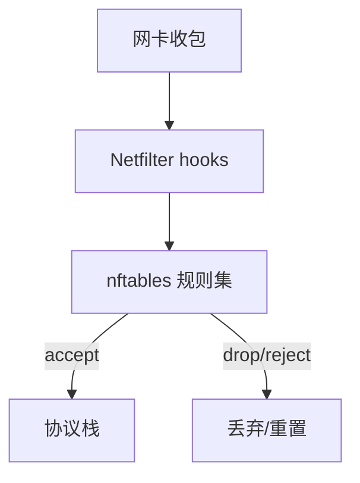

# Linux 防火墙：nftables 与 iptables 兼容层

端口「本机 curl 通、外网不通」、Docker 改表导致规则错乱，需要先分清 **nftables 原生集合** 与 **iptables-nft 兼容**，再谈策略。

## 源码锚点

| 路径 / 手册 | 作用 |
|-------------|------|
| `man nft` | nftables 命令 |
| `man iptables` | 兼容前端 |
| `/etc/nftables.conf` | 常见落盘 |
| `man nftables` | 集合概念 |

放行本机 SSH 示例（示意）：

```bash
nft add table inet filter
nft add chain inet filter input '{ type filter hook input priority 0; policy drop; }'
nft add rule inet filter input ct state established,related accept
nft add rule inet filter input iif lo accept
nft add rule inet filter input tcp dport 22 accept
```

## 调用链



## 重点知识

### 查清当前用哪套

```bash
nft list ruleset
iptables -L -n -v
# 有的系统 iptables 是 nft 后端
update-alternatives --display iptables 2>/dev/null
```

### 策略设计

- 默认策略与显式 accept 成对出现。
- `established,related` 放前面，避免回包被丢。
- 管理口（SSH）先保证，再收紧。

### 容器与防火墙

Docker/Podman 会插入自己的链。排障时同时看 `nft list ruleset` 与容器网络，不要只改 filter 的 input。

### 持久化

```bash
nft list ruleset > /etc/nftables.conf
systemctl enable --now nftables
```

重启后规则消失 = 没落盘或服务未开。
