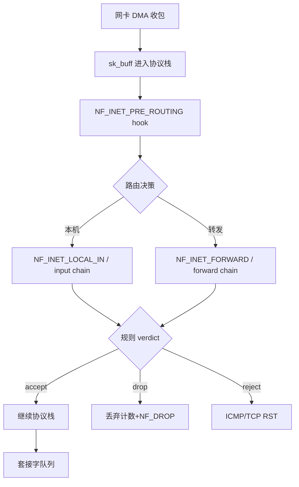
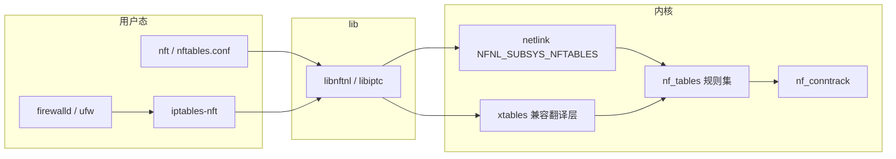
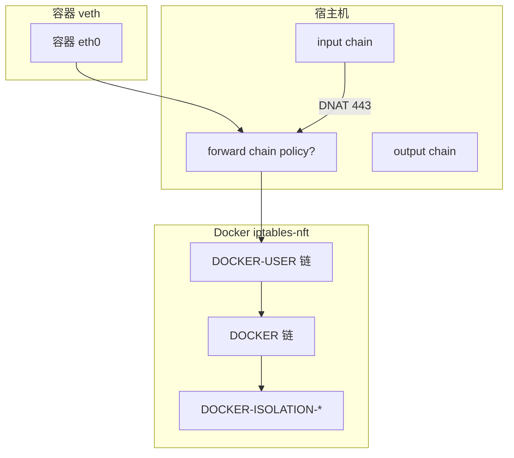

# Linux 防火墙完整篇：nftables、iptables-nft 兼容层与 Netfilter 排障

「本机 curl 127.0.0.1 通、外网 telnet 22 超时」「Docker 起容器后宿主机规则被改乱」「重启规则全丢」——三类现象对应三套根因：**nft 原生规则集**、**iptables-nft 兼容翻译**、**conntrack 状态与 hook 优先级**。不先分清当前机器跑的是哪一层，改 `iptables -A` 可能只是在 nft 后端追加一条与 `nft list ruleset` 对不上的规则。

本文合并 Linux 运维 chapter 043–048（源文为提纲），按内核 **Netfilter → nf_tables → 用户态 nft/iptables** 主线，覆盖 table/chain/hook、conntrack、落盘、Docker 插链与生产排障顺序。

---

## 源码锚点

| 路径 | 作用 |
|------|------|
| `net/netfilter/core.c` | Netfilter hook 注册、`nf_hook_entry` |
| `net/netfilter/nf_tables*.c` | nftables 核心：table/chain/rule/set |
| `net/netfilter/nf_tables_core.c` | 规则求值、`nft_do_chain` |
| `net/netfilter/nf_conntrack*.c` | 连接跟踪、`ct state` 匹配 |
| `net/netfilter/x_tables.c` | iptables 兼容层 x_tables |
| `net/ipv4/netfilter/ip_tables.c` | IPv4 iptables 表（legacy 或 nft 后端） |
| `include/uapi/linux/netfilter.h` | NF_INET_PRE_ROUTING 等 hook 枚举 |
| `include/uapi/linux/netfilter/nf_tables.h` | nft 用户态 ioctl 协议 |
| `include/uapi/linux/netfilter/nfnetlink.h` | nfnetlink 控制面 |
| `/usr/sbin/nft` | nftables 用户态（libnftnl） |
| `/usr/sbin/iptables` / `xtables-nft.multi` | iptables-nft 前端 |
| `/etc/nftables.conf` | Debian/Ubuntu/RHEL 常见落盘 |
| `/usr/lib/systemd/system/nftables.service` | 开机加载 |
| `man nft`(8) / `man iptables`(8) / `man iptables-nft`(8) | 手册 |
| `Documentation/networking/nf_tables.rst` | 内核 nft 文档 |
| `Documentation/networking/netfilter-messages.rst` | nfnetlink 日志 |

Netfilter 五个 IPv4 hook（`include/uapi/linux/netfilter.h`）：

```c
enum nf_inet_hooks {
    NF_INET_PRE_ROUTING,   /* 路由前，DNAT 常见 */
    NF_INET_LOCAL_IN,      /* 本机入 */
    NF_INET_FORWARD,       /* 转发 */
    NF_INET_LOCAL_OUT,     /* 本机出 */
    NF_INET_POST_ROUTING,  /* 路由后，SNAT 常见 */
};
```

最小 nft 规则集（SSH 放行骨架）：

```bash
nft add table inet filter
nft add chain inet filter input '{ type filter hook input priority filter; policy drop; }'
nft add rule inet filter input ct state established,related accept
nft add rule inet filter input iif lo accept
nft add rule inet filter input tcp dport 22 ct state new accept
```

---

## 调用链

### 收包到 verdict



### 用户态配置到内核规则集



### Docker 与 FORWARD 插链



---

## 重点知识

### 1. nftables 与 iptables-nft：谁在后端

现代发行版（RHEL 8+、Debian 10+、Ubuntu 20.04+）默认 **iptables 命令走 nft 后端**（`iptables-nft`），底层仍是 `nf_tables`，不是 legacy 的 `ip_tables` 内核模块。

查清当前后端：

```bash
readlink -f "$(which iptables)"
update-alternatives --display iptables 2>/dev/null
iptables --version          # 含 nf_tables 字样多为 nft 后端
ls -l /usr/sbin/iptables*
```

| 前端 | 内核实现 | 查看规则 |
|------|----------|----------|
| `nft` | nf_tables 原生 | `nft list ruleset` |
| `iptables-nft` | x_tables 翻译到 nft | `iptables-save` + `nft list ruleset` 对照 |
| `iptables-legacy` | ip_tables | `iptables-save`（无对应 nft 表） |

**混用灾难**：同一台机器既跑 `iptables-legacy` 又跑 `nft`，或 firewalld 与手工 `nft -f` 互踩，会出现「iptables -L 有规则但 nft 也有另一套」——以 **`nft list ruleset` 为最终真相**，iptables 只是视图之一。

legacy 切换示例（Ubuntu/Debian）：

```bash
update-alternatives --set iptables /usr/sbin/iptables-legacy
update-alternatives --set ip6tables /usr/sbin/ip6tables-legacy
```

生产建议：**选定一种管理面**（纯 nft、或 firewalld、或 Docker 自带的 iptables-nft），文档化，禁止多人各用各的前端。

### 2. table、chain、rule 与 family

nftables 四层模型：

| 层级 | 含义 | 示例 |
|------|------|------|
| table | 规则容器，按 address family | `table inet filter` |
| chain | 规则链，挂 hook 或跳转 | `chain input { type filter hook input ... }` |
| rule | 匹配 + 动作 | `tcp dport 22 accept` |
| set/map | 批量匹配、字典 | `@allowed_ports { type inet_service; }` |

**family**：`ip`（仅 IPv4）、`ip6`、`inet`（双栈，推荐）、`arp`、`bridge`、`netdev`（ingress 早期）。

```bash
nft add table inet myfilter
nft add chain inet myfilter input '{ type filter hook input priority 0; policy drop; }'
nft add chain inet myfilter forward '{ type filter hook forward priority 0; policy drop; }'
```

**chain type**：`filter`（过滤）、`route`（路由决策链，需 `CONFIG_NF_TABLES_ROUTE`）、`nat`（SNAT/DNAT）。

**policy**：`accept` / `drop`；仅 base chain（带 hook）可有 policy；无 hook 的 regular chain 用于 `jump`/`goto`。

### 3. hook、priority 与 base chain

Base chain 必须声明 hook 与 priority。同 hook 上多条 chain 按 **priority 数值**排序（越小越早）。

常见 priority（见 `include/uapi/linux/netfilter_ipv4.h` 等）：

| 名称 | 约 priority | 用途 |
|------|-------------|------|
| raw | -300 | 不跟踪 conntrack |
| mangle | -150 | 改 TTL/TOS |
| nat (dst) | -100 | PREROUTING DNAT |
| filter | 0 | 过滤 |
| security | +50 | SELinux 标记 |
| nat (src) | +100 | POSTROUTING SNAT |

```bash
nft add chain inet filter prerouting '{ type nat hook prerouting priority dstnat; policy accept; }'
nft add chain inet filter postrouting '{ type nat hook postrouting priority srcnat; policy accept; }'
```

**排障**：DNAT 在 filter 之前；若在 input 里拦了，PREROUTING 已改目的地址仍可能到不了本机 socket——要分 **PREROUTING / INPUT / FORWARD** 三段想。

### 4. 匹配表达式与集合

nft 用 **表达式** 组合匹配（非 iptables 线性扩展模块）：

```bash
# 端口集合
nft add set inet filter allowed_tcp { type inet_service; flags interval; elements = { 22, 80, 443 } }
nft add rule inet filter input tcp dport @allowed_tcp accept

# 动态集合 timeout
nft add set inet filter blocklist { type ipv4_addr; flags timeout; }
nft add element inet filter blocklist { 192.0.2.1 timeout 1h }
```

**interval 标志**：`elements = { 1024-65535 }` 表端口段。

**map**：根据键选动作：

```bash
nft add map inet filter nat_map { type ipv4_addr : ipv4_addr; }
nft add element inet filter nat_map { 10.0.0.0/24 : 203.0.113.1 }
```

性能：大量 IP 用 set/hash 优于逐条 rule；内核 `nf_tables` 对 set 有 per-CPU 优化。

### 5. conntrack 状态与 ct 表达式

状态防火墙依赖 **nf_conntrack**（`net/netfilter/nf_conntrack*.c`）。规则常用：

```bash
nft add rule inet filter input ct state established,related accept
nft add rule inet filter input ct state invalid drop
nft add rule inet filter input ct state new tcp dport 22 accept
```

| 状态 | 含义 |
|------|------|
| new | 首包，无条目 |
| established | 已确认连接 |
| related | 相关流（如 FTP data、ICMP error） |
| invalid | 无法跟踪（畸形、超时、无 syn 的 ack） |

查看表：

```bash
cat /proc/net/nf_conntrack | head
conntrack -L 2>/dev/null | head
sysctl net.netfilter.nf_conntrack_max
sysctl net.netfilter.nf_conntrack_count
```

**典型坑**：

- 只放行 NEW 不放 established → 回包被 drop。
-  asymmetric routing 导致 invalid 暴增。
- 大流量下 `nf_conntrack_max` 满 → 新连接失败，dmesg 有 drop 日志。

**notrack**（raw 表 / nft equivalent）：

```bash
nft add chain inet filter raw '{ type filter hook prerouting priority raw; policy accept; }'
nft add rule inet filter raw ip daddr 10.0.0.0/8 ct state new ct mark set 0x1 notrack
```

### 6. NAT：SNAT、DNAT、masquerade

```bash
# SNAT 出网
nft add table ip nat
nft add chain ip nat postrouting '{ type nat hook postrouting priority srcnat; policy accept; }'
nft add rule ip nat postrouting oifname "eth0" masquerade

# DNAT 发布服务
nft add chain ip nat prerouting '{ type nat hook prerouting priority dstnat; policy accept; }'
nft add rule ip nat prerouting tcp dport 8080 dnat to 192.168.1.10:80
```

**masquerade** vs **snat**：动态源地址用 masquerade（出接口主地址）；固定公网 IP 用 `snat to`。

**hairpin NAT**：内网访问自己的公网 IP，需额外 SNAT/路由回环。

验证：

```bash
nft list chain ip nat postrouting
conntrack -L | grep 8080
tcpdump -i any port 8080 -nn
```

### 7. 规则落盘与 systemd

内存规则重启丢失。落盘路径因发行版而异：

| 发行版 | 路径 | 服务 |
|--------|------|------|
| Debian/Ubuntu | `/etc/nftables.conf` | `nftables.service` |
| RHEL/Fedora | `/etc/sysconfig/nftables.conf` 或 `/etc/nftables/` | `nftables.service` |
| 手工 | 任意 | `nft -f /path/rules.nft` |

```bash
# 导出当前规则
nft list ruleset > /etc/nftables.conf

# 启用开机加载
systemctl enable --now nftables
systemctl status nftables

# 语法检查
nft -c -f /etc/nftables.conf
```

**include** 拆分：

```nft
#!/usr/sbin/nft -f
flush ruleset
include "/etc/nftables/filter.nft"
include "/etc/nftables/nat.nft"
```

**与 firewalld 共存**：firewalld 也写 nft 后端时，手工 `nft flush` 会被 firewalld 重载覆盖——选一种管理源。

### 8. firewalld 与 ufw 在栈中的位置

**firewalld**（RHEL/Fedora）：D-Bus API → 生成 nft 或 iptables 规则；概念 zone/service/port。

```bash
firewall-cmd --state
firewall-cmd --list-all
firewall-cmd --permanent --add-service=http
firewall-cmd --reload
# 底层
nft list ruleset | less
```

**ufw**（Ubuntu）：iptables 前端封装，底层多为 iptables-nft：

```bash
ufw status verbose
cat /etc/ufw/before.rules
iptables-save | head
```

排障：**改 ufw 规则后仍不通** → 看 `before.rules` 里是否已有 DROP；看 Docker 是否改 FORWARD policy。

### 9. Docker / containerd 插链模型

Docker 默认 `--iptables=true` 时通过 **iptables-nft** 插入：

- `DOCKER`：DNAT 到容器
- `DOCKER-USER`：**管理员应改这里**，在 Docker 规则之前
- `DOCKER-ISOLATION-STAGE-1/2`：网络隔离
- 常把 **FORWARD policy 设为 DROP**，靠 DOCKER 链放行

```bash
iptables -L DOCKER-USER -n -v
iptables -L FORWARD -n -v
nft list chain ip filter FORWARD
```

**禁止 Docker 改 iptables**（自建路由/NAT 时）：

```json
// /etc/docker/daemon.json
{ "iptables": false, "ip6tables": false }
```

后果：端口映射、容器互访需自己写 nft 规则。

**DOCKER-USER 放行示例**：

```bash
iptables -I DOCKER-USER -i ext0 -o docker0 -j ACCEPT
iptables -I DOCKER-USER -m conntrack --ctstate RELATED,ESTABLISHED -j ACCEPT
iptables -A DOCKER-USER -j DROP
```

Kubernetes（kube-proxy iptables/ipvs 模式）同理：Service NodePort 在 nat 表，排查要看 **全 ruleset**。

### 10. bridge / 容器 L2：netdev 与 bridge 表

容器 macvlan/ipvlan 或纯 L2 桥接时，过滤点在 **bridge family** 或 **netdev ingress**：

```bash
nft add table bridge filter
nft add chain bridge filter forward '{ type filter hook forward priority 0; policy drop; }'
```

**physdev**（iptables）在 nft 用 `meta iifname` / `meta oifname` 与 bridge 链配合。

K8s NetworkPolicy 实现（calico/cilium）可能绕开传统 filter——排障要看 CNI 文档。

### 11. 计数器、日志与 nft monitor

```bash
# 带计数
nft add rule inet filter input tcp dport 22 counter accept
nft list ruleset -a    # 看 packets/bytes

# 日志（需内核 CONFIG_NF_LOG）
nft add rule inet filter input tcp dport 9999 log prefix "DROP9999: " drop

# 实时事件
nft monitor
```

**ulogd2** / **nft log** 到 syslog：

```bash
journalctl -k | grep DROP9999
dmesg | tail
```

生产：**先 counter 再 drop**，确认命中后再改 policy。

### 12. 性能与规则规模

nf_tables 相对 legacy iptables 优势：原子更新、set/map、更少锁争用。

调优方向：

```bash
sysctl net.netfilter.nf_conntrack_max=262144
sysctl net.netfilter.nf_conntrack_tcp_timeout_established=86400
```

- 合并重复 rule 为 set
- 把最常 hit 的 rule 放前面（仍要注意 established 优先）
- 避免巨型 linear 规则链同步 flush

**XDP/eBPF** 防火墙在更早层，与 nft 互补，不在本文展开。

### 13. IPv6 与 ip6tables-nft

双栈必须同时管 `inet` 或 `ip`+`ip6`：

```bash
nft add table inet filter
# 一条规则覆盖 v4/v6
nft add rule inet filter input tcp dport 22 accept
```

ICMPv6 邻居发现不可误拦：

```bash
nft add rule inet filter input ip6 nexthdr ipv6-icmp icmpv6 type { nd-neighbor-solicit, nd-neighbor-advert, nd-router-solicit, nd-router-advert } accept
```

```bash
ip6tables-nft -L
nft list ruleset
```

### 14. 排障顺序：从现象到 hook

固定顺序：

1. **复现方向**：外→内、内→外、本机→本机（lo）
2. **`nft list ruleset`** 全量；对照 iptables-save
3. **conntrack**：状态是否 invalid
4. **tcpdump** 在正确 netns：`ip netns exec`、`nsenter`
5. **计数器**：哪条 rule 命中
6. **路由/NAT**：`ip route get`、`conntrack -L`

```bash
# 外网连不通 22
ss -lntp | grep :22
nft list chain inet filter input
tcpdump -i any port 22 -nn
conntrack -L | grep dport=22
iptables -L INPUT -n -v --line-numbers
```

**本机通外网不通**：INPUT 链、云安全组、上游 ACL 三层查。

### 15. 案例：established 缺失导致 HTTPS 半开

现象：curl 外网 HTTPS 超时，tcpdump 见 SYN-ACK 回来但被 drop。

根因：input policy drop，只有 `tcp dport 443 accept`，无 `ct state established,related accept`。

修复：

```bash
nft insert rule inet filter input position 0 ct state established,related accept
```

验证：`nft list chain inet filter input -a` 看 counter 增长。

### 16. 案例：Docker 覆盖 FORWARD

现象：容器访问外网正常，宿主机转发其他流量失败。

根因：Docker 设 `FORWARD policy DROP`，仅 DOCKER 链放行容器网段。

修复：在 DOCKER-USER 加业务网段，或 `--iptables=false` 自建 forward 规则。

### 17. 案例：重启规则丢失

现象：reboot 后 SSH 全断。

根因：规则只在内存，`nftables.service` 未 enable 或 `/etc/nftables.conf` 空。

```bash
systemctl is-enabled nftables
nft -c -f /etc/nftables.conf
journalctl -u nftables -b
```

### 18. 案例：iptables-nft 与 legacy 双写

现象：删 iptables 规则仍拦截。

根因：legacy 模块仍加载，或 nft 里还有 set。

```bash
lsmod | grep ip_tables
lsmod | grep nf_tables
nft list ruleset
update-alternatives --display iptables
```

### 19. 安全设计：默认拒绝与白名单

推荐骨架：

```nft
table inet filter {
  chain input {
    type filter hook input priority filter; policy drop;
    ct state established,related accept
    iif lo accept
    tcp dport { 22, 80, 443 } accept
    ip protocol icmp accept
    # log drop
    counter drop
  }
  chain forward { type filter hook forward priority filter; policy drop; }
  chain output { type filter hook output priority filter; policy accept; }
}
```

管理口 SSH 限制源 IP：

```bash
nft add set inet filter admin_src { type ipv4_addr; elements = { 203.0.113.0/24 } }
nft add rule inet filter input tcp dport 22 ip saddr @admin_src accept
```

### 20. reject vs drop

- **drop**：静默丢包，扫描慢
- **reject**：发 ICMP unreachable 或 TCP RST，客户端快速失败

```bash
nft add rule inet filter input tcp dport 23 reject with tcp reset
nft add rule inet filter input udp dport 53 reject with icmp port-unreachable
```

对外服务 scan 面通常 drop；内网调试可用 reject 加快定位。

### 21. 完整生产 nftables.conf 示例

```nft
#!/usr/sbin/nft -f
flush ruleset

table inet filter {
    set allowed_tcp {
        type inet_service
        elements = { 22, 80, 443 }
    }
    set admin_v4 {
        type ipv4_addr
        elements = { 203.0.113.0/24 }
    }
    chain input {
        type filter hook input priority filter; policy drop;
        ct state established,related accept
        iif lo accept
        ip saddr @admin_v4 tcp dport 22 ct state new accept
        tcp dport @allowed_tcp accept
        ip protocol icmp icmp type { echo-request, echo-reply, destination-unreachable, time-exceeded } accept
        counter log prefix "input-drop: " drop
    }
    chain forward {
        type filter hook forward priority filter; policy drop;
        ct state established,related accept
    }
    chain output {
        type filter hook output priority filter; policy accept;
    }
}

table ip nat {
    chain postrouting {
        type nat hook postrouting priority srcnat; policy accept;
        oifname != "lo" masquerade
    }
}
```

### 22. nft 子命令速查

| 命令 | 作用 |
|------|------|
| `nft list ruleset` | 列出全部 table/chain/rule |
| `nft list table inet filter` | 单表 |
| `nft add table inet t` | 建表 |
| `nft delete table inet t` | 删表 |
| `nft flush table inet filter` | 清空表内规则 |
| `nft add chain inet f input '{ ... }'` | 建 base chain |
| `nft add rule inet f input tcp dport 22 accept` | 追加规则 |
| `nft insert rule inet f input position 0 ...` | 头部插入 |
| `nft delete rule inet f input handle 42` | 按 handle 删 |
| `nft -c -f file.nft` | 检查语法不加载 |
| `nft -f file.nft` | 加载文件 |
| `nft monitor` | 监听 netlink 事件 |
| `nft list ruleset -a` | 含 handle 与 counter |

### 23. 云主机安全组与 nft 双层

现象：nft counter 为 0 仍不通。包在到达 OS 前被云厂商 drop。`tcpdump -i eth0` 无 SYN 到达。先在控制台放行，再改 nft。

### 24. rp_filter 与 asymmetric routing

现象：conntrack 大量 invalid。`sysctl net.ipv4.conf.all.rp_filter` 严格模式丢弃非对称包。调 rp_filter 或修路由。

### 25. MTU / MSS 与防火墙无关的误判

现象：大包不通小包通。`tracepath` 看 PMTU。nft 里可 `tcp flags syn tcp option maxseg size set rt mtu`。

### 26. 时间同步与 TLS 无关但常并发

排障 SSH/HTTPS 时顺带确认 NTP，避免证书错误误判为防火墙。

### 27. namespace 隔离

```bash
ip netns add test
ip link add veth0 type veth peer name veth1
ip link set veth1 netns test
# 规则在各自 netns 独立
ip netns exec test nft list ruleset
```

### 28. kube-proxy 与 NodePort

Service NodePort 在 nat 表 PREROUTING。`iptables-save | grep NODEPORT` 或 `nft list ruleset | grep -i kube`。

### 29. WireGuard 与 fwmark

WireGuard 常配合 policy routing + mark。nft 用 `meta mark` 匹配。

### 30. auditd 与防火墙

LSM/audit 日志与 nft log 互补。`/var/log/audit/audit.log` 看 AVC 非 packet drop。

### 31. 相关 sysctl 一览

| sysctl | 含义 |
|--------|------|
| `net.netfilter.nf_conntrack_max` | conntrack 条目上限 |
| `net.netfilter.nf_conntrack_count` | 当前条目（只读） |
| `net.ipv4.ip_forward` | 是否转发 IPv4 |
| `net.ipv6.conf.all.forwarding` | 是否转发 IPv6 |
| `net.ipv4.conf.all.rp_filter` | 反向路径过滤 |
| `net.netfilter.nf_log_all_netns` | 多 netns 日志 |

### 32. iptables-nft 到 nft 概念对照

| iptables | nftables |
|----------|----------|
| `-A INPUT` | `nft add rule inet filter input` |
| `-I INPUT 1` | `nft insert rule ... position 0` |
| `-D INPUT` | `nft delete rule ... handle N` |
| `-P INPUT DROP` | chain policy drop |
| `-s 1.2.3.4` | `ip saddr 1.2.3.4` |
| `-p tcp --dport 22` | `tcp dport 22` |
| `-m conntrack --ctstate ESTABLISHED` | `ct state established` |
| `-j SNAT --to-source` | `snat to` in nat chain |
| `-j DNAT --to-destination` | `dnat to` |
| `-m limit --limit 5/s` | `limit rate 5/second` |
| `-j LOG` | `log prefix ...` |

### 33. limit 与 rate 防爆破

```bash
nft add rule inet filter input tcp dport 22 ct state new limit rate over 10/minute drop
nft add rule inet filter input tcp flags syn tcp dport 443 limit rate 100/second accept
```

`limit` 用 token bucket；超限包走后续规则或 policy drop。

### 34. 分片与 defrag

```bash
nft add rule inet filter input ip frag-off != 0 drop   # 谨慎：可能误伤
```

conntrack 需首包建状态；filter 过早 drop 分片会导致 established 失败。通常让内核 defrag 后再 filter。

### 35. icmpv6 邻居发现必放

```bash
nft add rule inet filter input ip6 nexthdr ipv6-icmp icmpv6 type {
  nd-neighbor-solicit, nd-neighbor-advert,
  nd-router-solicit, nd-router-advert,
  packet-too-big, time-exceeded, parameter-problem
} accept
```

IPv6 双栈漏放 ND → 邻居不可达，表现像「防火墙随机丢包」。

### 36. flowtable 与 fastpath

```nft
table inet filter {
  flowtable ft {
    hook ingress priority filter
    devices = { eth0 }
  }
  chain ingress {
    type filter hook ingress priority filter; policy accept;
    ip saddr 192.0.2.0/24 ct state established,related offload
  }
}
```

offload 到硬件/驱动 fastpath；排障时先 `nft list flowtable` 看是否 hit。

### 37. nft reset counters

```bash
nft reset counters table inet filter
nft list chain inet filter input -a
```

变更规则后清零 counter，便于 A/B 对比命中。

### 38. 原子替换 ruleset

```bash
nft -f /etc/nftables.new.conf
# 文件首行 flush ruleset 则全量替换
```

大改前 `nft list ruleset > backup.nft`；`-c` 仅检查语法。

### 39. 与 ipset 迁移

legacy `ipset` 仍可用；nft 原生 set 推荐：

```bash
# 旧：ipset create block hash:ip + iptables match
# 新：
nft add set inet filter block { type ipv4_addr; flags timeout; }
nft add element inet filter block { 198.51.100.99 timeout 1h }
nft add rule inet filter input ip saddr @block drop
```

### 40. 多表协作：filter + nat + mangle

| 表 family/类型 | hook | 典型动作 |
|--------------|------|----------|
| inet filter | input/forward | accept/drop |
| ip nat | prerouting/postrouting | dnat/snat |
| inet mangle | prerouting | mark/conntrack |

```bash
nft list tables
nft list table ip nat
```

DNAT 改目的后再路由；filter input 看的是 **DNAT 后** 地址。

### 41. meta 表达式常用

```bash
nft add rule inet filter input meta iifname "docker0" accept
nft add rule inet filter input meta l4proto tcp accept
nft add rule inet filter forward meta oifname != "docker0" drop
```

`meta mark`、`meta priority` 与 policy routing 联动。

### 42. reject 类型选择

```bash
nft add rule inet filter input tcp dport 23 reject with tcp reset
nft add rule inet filter input udp dport 53 reject with icmp port-unreachable
```

内网调试 `reject` 快失败；对外扫描面 `drop` 减信息泄露。

### 43. 持久化故障：include 路径

```bash
grep include /etc/nftables.conf
ls -la /etc/nftables/
journalctl -u nftables -b --no-pager
```

`include` 指向不存在文件 → 服务 start 失败 → reboot 后无规则。

### 44. firewalld direct 规则

```bash
firewall-cmd --direct --get-all-rules
firewall-cmd --direct --add-rule ipv4 filter INPUT 0 -p tcp --dport 8080 -j ACCEPT
```

direct 规则与 zone 并存；`--reload` 行为以版本文档为准，改前备份。

### 45. ufw before.rules 链

```bash
grep -n '^#' /etc/ufw/before.rules | head
iptables-save | grep ufw-before-input
```

`before.rules` 在 ufw 用户规则之前执行；「ufw allow 仍不通」常在此被 DROP。

### 46. Podman 与 iptables

Podman rootless/rootful 均可能改 netfilter。`podman network inspect` 看 interface；`nft list ruleset | grep -i podman`。

### 47. CNI 与 FORWARD

Calico/Flannel/Cilium 各自插入规则。Kubernetes 节点：

```bash
iptables-save | wc -l
nft list ruleset | wc -l
```

规则爆炸时查 CNI 文档，勿手工删 CNI 链。

### 48. conntrack 超时调优

```bash
sysctl net.netfilter.nf_conntrack_tcp_timeout_established
sysctl net.netfilter.nf_conntrack_tcp_timeout_time_wait
conntrack -S
```

短连接风暴占满表 → 调小 time_wait 或增大 max（内存换）。

### 49. 排障：tcpdump 与 nft 同向

```bash
tcpdump -i any 'host 203.0.113.5 and port 22' -nn -c 20
nft monitor
```

包到网卡无 SYN → 上游/云 ACL；有 SYN 无 SYN-ACK 出 → 本机 drop 或路由；双向有仍不通 → conntrack invalid。

### 50. 排障：ss 与 listen

```bash
ss -lntp | grep ':22'
nft list chain inet filter input | grep 22
```

LISTEN 无 → 服务未起；LISTEN 有 counter 0 → 包未到 input 或被更早 hook drop。

### 51. 排障：ip_forward

```bash
sysctl net.ipv4.ip_forward
cat /proc/sys/net/ipv4/ip_forward
```

转发场景 FORWARD policy drop 且 ip_forward=0 → 容器/路由网关双失败。

### 52. 安全组 + nft 双检清单

1. 云控制台 inbound/outbound
2. 宿主机 `nft list ruleset`
3. 中间 WAF/LB 健康检查源 IP
4. `conntrack -L | grep ESTABLISHED`

任一层 deny 即现象复现。

### 53. 变更窗口操作纪律

- 会话 `tmux` 防 SSH 断
- `at now + 5min` 或 cron 回滚脚本加载 backup.nft
- 先 `insert` 放行管理 IP 再改 policy
- 改完 `nft -c -f` + counter 验证

### 54. 从 iptables-save 迁移 nft

```bash
iptables-save > /tmp/ipt.save
# 手工或 iptables-translate（部分发行版提供）
iptables-translate < /tmp/ipt.save > /tmp/nft.new
nft -c -f /tmp/nft.new
```

自动翻译需人工审 priority/nat 链。

### 55. 与 SELinux port 的交界

```bash
semanage port -l | grep ssh
ausearch -m avc -ts recent | grep port
```

DAC+ nft accept 后 bind 仍失败可能是 SELinux port 未标记。

### 56. 小结

nftables 是 Netfilter 现代配置面；**`nft list ruleset` 为真相**，iptables-nft 是视图。排障链：**云 ACL → hook/counter → conntrack → tcpdump → Docker/CNI 链**。落盘靠 `nftables.service`；混用 frontend 是「幽灵规则」主因。
