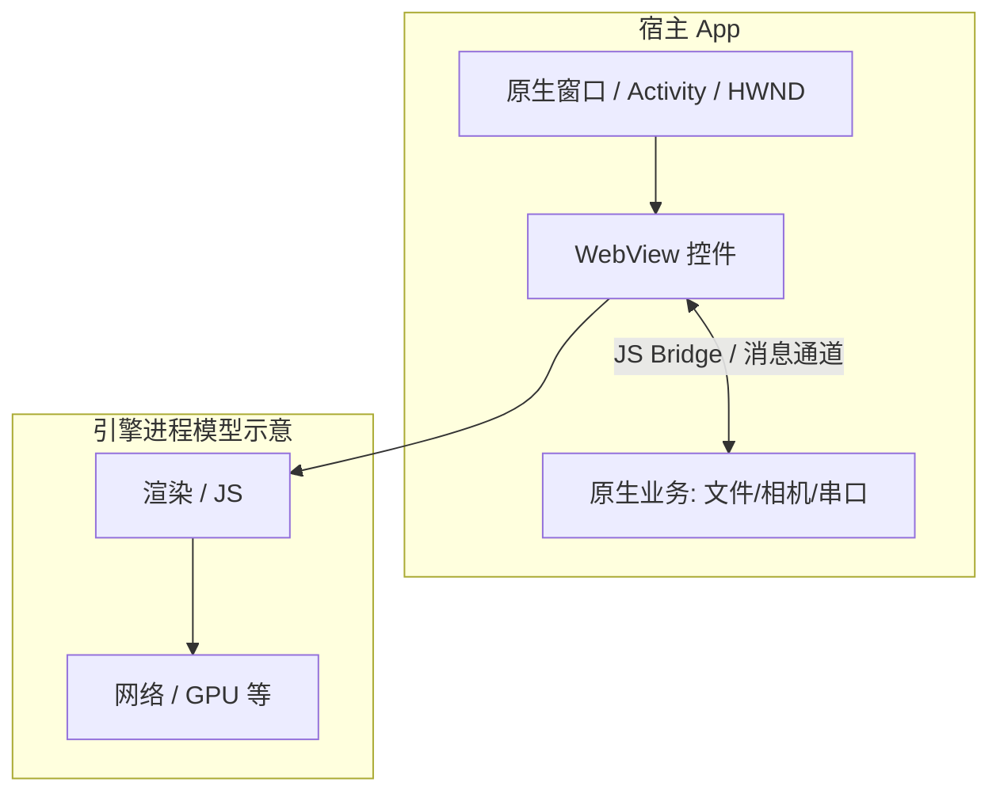
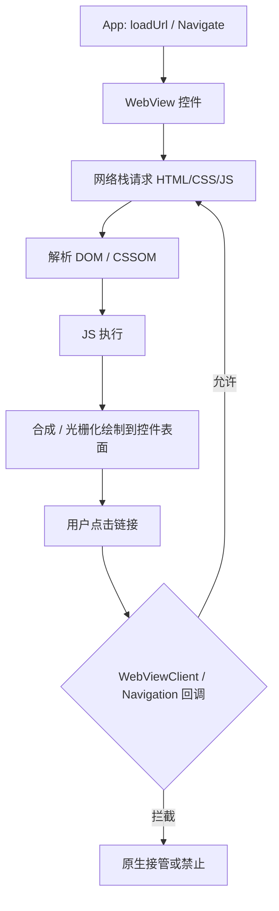
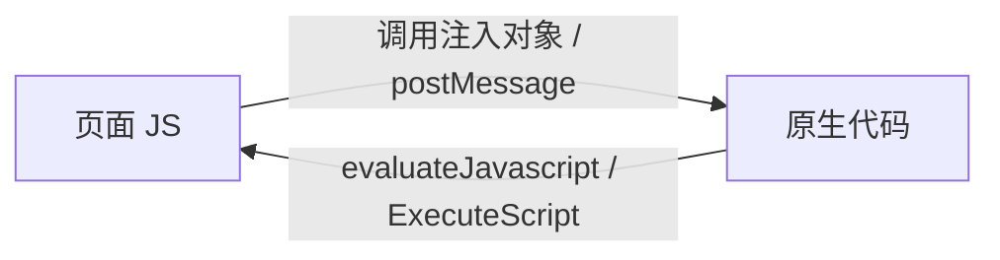

# WebView 完整篇：从嵌入浏览器到 JS Bridge，覆盖 Android / iOS / 桌面三大端

做混合应用或「套壳」工具时，最先碰到的词是 **WebView**：在原生窗口里嵌一个浏览器引擎，用 HTML/CSS/JS 画界面，必要时再和原生代码通话。很多人把它等同于「打开一个网页」，结果在权限、进程、更新、安全上踩坑。

本文把 **WebView 是什么、和系统浏览器有何不同、各平台实现、与原生通信、安全与性能** 讲全，并落到 Android、iOS/macOS、Windows、Linux 的真实组件名与典型 API，方便嵌入式/桌面/移动统一理解。

## 源码与官方锚点

| 平台 / 组件 | 锚点 | 作用 |
|-------------|------|------|
| Android | `android.webkit.WebView`、`WebViewClient`、`WebChromeClient` | 系统 WebView（Chromium 系，随 WebView 包更新） |
| iOS / macOS | `WKWebView`（WebKit） | 现代推荐；旧 `UIWebView` 已废弃 |
| Windows | **WebView2**（Edge Chromium / `Microsoft.Web.WebView2`） | 桌面嵌 Chromium；旧 IE `WebBrowser` 不建议新项目 |
| Linux | **WebKitGTK**（`WebKitWebView`） | GNOME/GTK 生态常用 |
| 跨端壳 | Electron / Tauri / CEF | 整窗或嵌引擎的产品化方案（详见下一篇打包文） |

Android 加载与回调（概念）：

```java
WebView webView = findViewById(R.id.webview);
WebSettings s = webView.getSettings();
s.setJavaScriptEnabled(true);
webView.setWebViewClient(new WebViewClient()); // 页内导航
webView.loadUrl("https://example.com");
// 或 loadDataWithBaseURL / loadUrl("file:///android_asset/...")
```

iOS WKWebView（概念）：

```swift
let config = WKWebViewConfiguration()
let webView = WKWebView(frame: .zero, configuration: config)
webView.load(URLRequest(url: URL(string: "https://example.com")!))
```

Windows WebView2（概念）：

```csharp
// 需安装 WebView2 Runtime；控件 EnsureCoreWebView2Async 后
await webView.EnsureCoreWebView2Async(null);
webView.CoreWebView2.Navigate("https://example.com");
```

## 先建立模型：WebView ≠ 完整 Chrome 窗口



**要点**：

1. **引擎**：Chromium 系（Android WebView、WebView2、Electron）或 WebKit（WKWebView、WebKitGTK）。
2. **壳**：原生只提供窗口、生命周期、权限与系统 API。
3. **内容**：远程 URL、本地 HTML（`file://` / 资产目录）、或自定义协议（`app://`）。

和「用户打开 Chrome」的差异：无独立地址栏（除非你做）、权限跟宿主走、进程策略由宿主/引擎配置、更新路径不同（系统 WebView 包 vs 应用自带引擎）。

## 调用链：一次页面加载在 WebView 里发生什么



各端都有「导航钩子」：Android `shouldOverrideUrlLoading` / `shouldInterceptRequest`；WK `decidePolicyFor`；WebView2 `NavigationStarting` / `WebResourceRequested`。嵌入式/壳应用常在这里做 **URL 白名单、token 注入、本地资源映射**。

## 重点知识

### 1. 三大桌面 + 移动的 WebView 地图

| 系统 | 推荐组件 | 引擎 | 备注 |
|------|----------|------|------|
| Android | `android.webkit.WebView` | Chromium（独立 APK 更新） | 旧机系统 WebView 版本滞后 |
| iOS | `WKWebView` | WebKit | 多进程；与 Safari 同系 |
| macOS | `WKWebView` | WebKit | 可用 AppKit/Catalyst |
| Windows 10/11 | **WebView2** | Evergreen Edge Chromium | 需 Runtime；可 Fixed Version 随应用分发 |
| Linux | **WebKitGTK** | WebKit | GTK 应用；Qt 另有 Qt WebEngine（Chromium） |

另：**CEF**（Chromium Embedded Framework）可自嵌 Chromium，体积大、控制强，常用于专业桌面壳。

### 2. 进程与稳定性

现代 WebView 多为 **多进程**（至少「UI 宿主 + 渲染」）。渲染崩溃不一定拖死宿主，但要处理：

- Android：`onRenderProcessGone`
- WebView2：`ProcessFailed`
- WKWebView：进程终止相关回调

嵌入式设备内存紧时，多进程 WebView 可能被杀；需测峰值 RSS、限制同时打开的页面数。

### 3. JS Bridge：网页与原生如何通话



常见模式：

| 模式 | 例子 |
|------|------|
| 注入全局对象 | Android `addJavascriptInterface`（注意注解与安全） |
| 脚本消息 | WK `WKScriptMessageHandler`；WebView2 `AddHostObjectToScript` / `WebMessage` |
| URL Scheme 伪协议 | `myapp://pay?id=`（易被日志泄露，需校验） |
| 本地 HTTP 服务 | 宿主起 `127.0.0.1` 小服务（注意端口与 CSRF） |

**安全底线**：永远不要对不可信网页开启无过滤的原生桥；校验来源、鉴权、最小化暴露 API。

### 4. 本地内容与离线

- Android：`file:///android_asset/`、`WebViewAssetLoader`（推荐，避免 `file` 域弱点）
- iOS：`loadFileURL`、关联目录读权限
- 桌面：读安装目录 `resources/app`、或自定义协议映射到包内文件

CORS、cookie、混合内容（HTTPS 页加载 HTTP 资源）在本地打包场景同样踩坑。

### 5. Cookie、存储、缓存

WebView 有独立或半独立的 Cookie / localStorage / IndexedDB / HTTP 缓存。

- 登出要清 Cookie 与存储，否则「换账号仍登录」。
- 多 WebView 实例是否共享存储，取决于配置（partition / data folder）。
- WebView2 可指定 **User Data Folder**，多开应用注意目录冲突。

### 6. 硬件与系统能力

纯网页拿不到的能力，靠 Bridge 补：

- 串口 / USB / GPIO（嵌入式工控壳常见）
- 文件系统、打印、托盘、全局快捷键
- 相机、推送、生物识别（移动）

设计时分清：**UI 用 Web，能力用原生**，不要幻想「一个 HTML 通杀所有硬件」。

### 7. 调试手段

| 平台 | 做法 |
|------|------|
| Android | `chrome://inspect`，`WebView.setWebContentsDebuggingEnabled` |
| iOS 模拟器/真机 | Safari → 开发 → WebView |
| WebView2 | Edge DevTools 附加；环境变量或注册表开调试 |
| WebKitGTK | 视发行版开启检查器 |
| Electron | 自带 Chromium DevTools |

### 8. 性能要点

- 避免巨型同步 JS；首屏拆包。
- 谨慎 `domStorage` / 大图；嵌入式 GPU 弱时少用重特效。
- 减少 `evaluateJavascript` 往返频率；批量消息优于高频桥接。
- 预加载 / 复用同一 WebView 实例，比重建引擎便宜。

### 9. 与「用系统浏览器打开」如何选

| 需求 | 更合适 |
|------|--------|
| 要深度嵌 UI、自定义导航、桥接硬件 | WebView |
| 只要 OAuth / 文档外链 | Custom Tabs / ASWebAuthenticationSession / 外部浏览器更安全 |
| 要完整扩展生态、多标签 | 独立浏览器或 Electron 级产品 |

### 10. 版本碎片（移动尤其痛）

Android 系统 WebView 随设备差异大 → 用 Play 更新的 **Android System WebView**；测主流 API 级别。  
iOS WebKit 跟系统走，不能自带 Chromium（上架规则）。  
Windows WebView2 Evergreen 跟 Edge 更新；离线现场可用 Fixed Version。

## Checklist

- [ ] 能说出本项目用的引擎：Chromium 还是 WebKit，以及组件名（WebView2 / WKWebView / WebKitGTK…）
- [ ] 清楚导航拦截与资源拦截分别在哪类回调里做
- [ ] JS Bridge 有来源校验与最小权限，无对任意站点暴露危险 API
- [ ] 本地资源加载方式安全（优先 AssetLoader / 自定义协议，慎用裸 `file://`）
- [ ] 处理过渲染进程崩溃与存储目录（多实例不打架）
- [ ] 会用对应平台的远程调试查看控制台与网络
- [ ] 嵌入式场景评估过内存与 GPU，避免多 WebView 无节制

---

> 成稿：`articles/csdn-merged/WebView原理与三大端完整篇.md`  
> 下一篇：如何把网页打包成 Windows / macOS / Linux 桌面程序（Electron、Tauri、原生 WebView 等）
