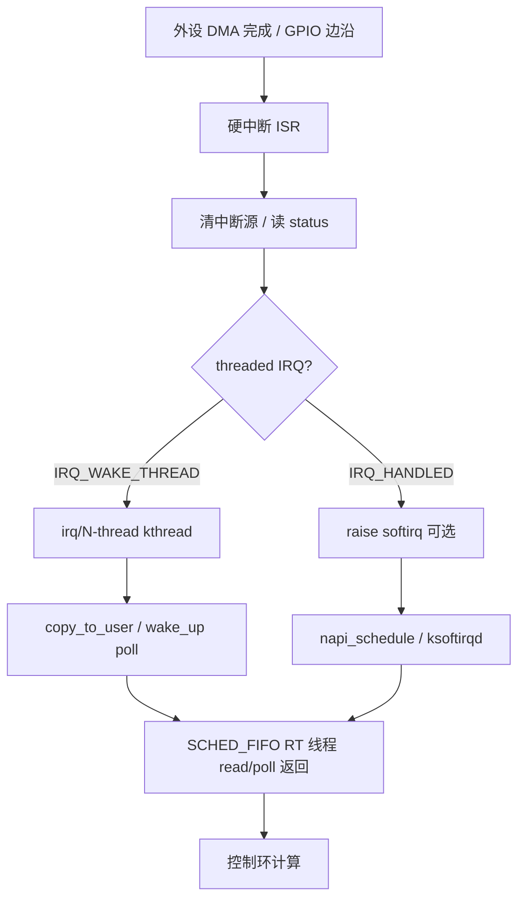
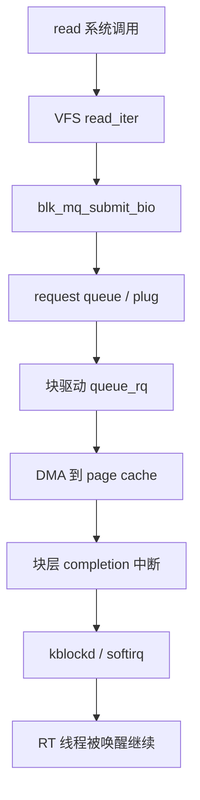

# 实时 I/O 完整篇：从中断线程化、DMA 到零拷贝与延迟排障

工业现场 **1 ms 控制环** 偶发 **3 ms 毛刺**、网卡收包把 **SCHED_FIFO 90** 打断、ADC DMA 缓冲区偶发脏字节——根因很少是「CPU 不够快」，而是 **I/O 路径上的不可抢占区、cache 一致性遗漏、IRQ 与 RT 任务同核、page fault 与 C-state 退出** 叠加。PREEMPT_RT 把 spinlock 睡眠化、推 threaded IRQ，但 **DMA 映射、软中断 budget、块层 plug、零拷贝 mmap 生命周期** 仍可能引入毫秒级最坏延迟。

本文合并实时系统 chapter 033–038，覆盖 **硬实时 I/O 约束、中断上下半部与线程化 IRQ、DMA 与 cache 一致性、轮询 vs 中断、PREEMPT_RT 下 I/O 全路径、isolcpus/nohz、cyclictest/ftrace/perf 观测、常见毛刺坑**，附内核锚点与可复现实验。

---

## 源码锚点

| 路径 / 手册 | 作用 |
|-------------|------|
| `include/linux/interrupt.h` | `request_irq`、`request_threaded_irq`、`IRQF_*` |
| `kernel/irq/manage.c` | IRQ 注册、线程化安装、`irq_set_affinity_hint` |
| `kernel/irq/handle.c` | 通用中断入口、hardirq 上下文 |
| `kernel/softirq.c` | NET_RX、BLOCK、TASKLET 软中断 |
| `include/linux/dma-mapping.h` | DMA API：`dma_map_single`、`dma_sync_*` |
| `kernel/dma/mapping.c` | 一致性映射、IOMMU 交互 |
| `drivers/base/dma-coherent.c` | CMA / coherent 池 |
| `mm/page_alloc.c` | DMA 区页分配、GFP_DMA 约束 |
| `block/blk-mq.c` | 多队列块层、plug/unplug 延迟 |
| `net/core/dev.c` | `netif_receive_skb`、NAPI poll |
| `drivers/net/ethernet/*/...` | 网卡 `ndo_start_xmit`、MSI-X |
| `fs/read_write.c` | `read`/`write`/`sendfile` 系统调用 |
| `mm/mmap.c` | `do_mmap`、用户态零拷贝映射 |
| `drivers/uio/uio.c` | UIO 用户态中断与 mmap 寄存器 |
| `Documentation/core-api/dma-api.rst` | DMA 映射语义 |
| `Documentation/core-api/genericirq.rst` | threaded IRQ 说明 |
| `tools/testing/rt-tests/cyclictest/` | I/O 负载下延迟测量 |
| `man 2 mlock` `man 2 sendfile` | 内存锁定与零拷贝 |

threaded IRQ 安装骨架（`kernel/irq/manage.c` 路径）：

```c
int request_threaded_irq(unsigned int irq,
                         irq_handler_t handler,
                         irq_handler_t thread_fn,
                         unsigned long flags,
                         const char *name, void *dev);
/* handler 返回 IRQ_WAKE_THREAD → 唤醒 thread_fn 所在 kthread */
```

---

## 调用链

### ① 设备中断到 RT 用户态读数据



### ② DMA 映射与用户态零拷贝


### ③ PREEMPT_RT 下块设备 read 路径（简化）



---

## 重点知识

## 一、硬实时 I/O 约束

### 1.1 延迟预算分解

硬实时 I/O 不是「平均延迟低」，而是 **最坏情况延迟（WCL）** 可界定。典型 1 kHz 控制环周期 1 ms，I/O 子路径预算常仅 **100–300 µs**，其余留给算法与通信。

| 子路径 | 典型预算 | 超限后果 |
|--------|----------|----------|
| 传感器采样触发 → 数据就绪 | 50–150 µs | 采样相位漂移 |
| DMA 完成 → 用户态可见 | 30–100 µs | 控制律用旧数据 |
| 网络命令包 → 解析完成 | 200–500 µs | 安全 PLC 超时 |
| 日志/持久化 | **禁止在 RT 环** | 毫秒级毛刺 |

### 1.2 RT 线程 I/O 三禁止

1. **禁止阻塞式磁盘 I/O**：`fprintf`、`syslog`、SQLite、`fsync` 可能触发 journal、块层 plug、驱动 DMA 重试。
2. **禁止运行期分配**：`malloc`、`std::vector::push_back` 触发 page fault 与 glibc 锁。
3. **禁止无界等待**：`read` 无 `O_NONBLOCK`/`poll` 超时；socket 默认阻塞可无限延迟。

正确模式：**预分配 ring**、**非 RT 线程写盘**、**SCHED_FIFO 只消费已就绪数据**。

### 1.3 可预测 vs 高吞吐

| 目标 | 手段 | 代价 |
|------|------|------|
| 可预测 | 单队列、绑核、关 GRO/LRO、小 MTU 测试 | 吞吐下降 |
| 高吞吐 | 多队列 RSS、GRO、大块 read | WCET 难证明 |

工业 RT 网关常 **数据面单队列 + affinity**，管理面走独立网口。

### 1.4 I/O 与调度策略配合

```bash
chrt -f 85 ./control_loop    # 控制环
chrt -f 50 ./io_logger       # 低优先级写盘线程
taskset -c 2 chrt -f 85 ./control_loop
```

控制环优先级须 **高于** I/O 辅助线程，但 **低于** 同核 errant IRQ thread（应移核而非降 IRQ prio）。

---

## 二、中断：上半部、下半部与线程化

### 2.1 硬中断上下文规则

硬中断（hardirq）上下文 **不可睡眠、不可调度**。允许：读/清设备状态、极短寄存器访问、`IRQ_WAKE_THREAD`。禁止：`mutex_lock`、大块 `copy_to_user`、阻塞式 `i2c_transfer`、**`kmalloc(GFP_KERNEL)`**。

违反时内核报 `BUG: sleeping function called from invalid context`，或表现为 **中断风暴**（未清源反复进 ISR）。

### 2.2 软中断与 ksoftirqd

部分驱动在 ISR 里 `raise_softirq(NET_RX_SOFTIRQ)`；NET 子系统在 **ksoftirqd** 或 **硬中断尾** 执行 `net_rx_action`。高 PPS 时 softirq 可在单核 **占用数百微秒**（受 `net.core.netdev_budget` 限制）。

```bash
cat /proc/softirqs
sysctl net.core.netdev_budget net.core.netdev_budget_usecs
watch -n1 'grep NET_RX /proc/softirqs'
```

PREEMPT_RT 下 softirq 仍可能 **延迟 RT 线程**——对策：IRQ/RPS 移出 RT 核。

### 2.3 request_threaded_irq

PREEMPT_RT **推荐默认 threaded IRQ**：ISR 只做 ack + `IRQ_WAKE_THREAD`；**thread_fn** 在 `irq/NN-name` kthread 中跑，可 `mutex`、可睡眠 I2C/SPI。

```c
static irqreturn_t my_hardirq(int irq, void *dev_id)
{
    u32 st = readl(dev->regs + STATUS);
    if (!(st & MY_IRQ_BIT))
        return IRQ_NONE;
    writel(st, dev->regs + STATUS);
    return IRQ_WAKE_THREAD;
}

static irqreturn_t my_thread(int irq, void *dev_id)
{
    struct my_dev *dev = dev_id;
    process_samples(dev);
    wake_up_interruptible(&dev->waitq);
    return IRQ_HANDLED;
}
```

`IRQF_ONESHOT`：线程处理完前屏蔽该线，防共享中断重入。

### 2.4 IRQ 线程优先级与 affinity

```bash
ps -Lo pid,tid,class,rtprio,comm | grep 'irq/'
cat /proc/irq/42/smp_affinity_list
echo 1 | sudo tee /proc/irq/42/smp_affinity_list
```

**threaded IRQ kthread** 默认较高 RT 优先级；与业务 RT 同核时，业务会被打断。**首选移 IRQ 到 housekeeping 核**，而非全局降低 IRQ thread prio。

### 2.5 用户态中断：UIO / vfio

**UIO**（`drivers/uio/uio.c`）mmap 寄存器与 **IRQ eventfd**；用户态 `read()` 阻塞等中断。适合 **极简 FPGA 寄存器轮询+中断**，但用户态 handler **无内核 PI**，须绑核 + mlock。

```bash
modprobe uio_pdrv_genirq
ls -l /dev/uio0 /sys/class/uio/uio0/
```

**vfio** 用于直通 PCI 设备到用户态，绕过内核驱动栈，WCET 更可控但 **IOMMU 配置复杂**。

---

## 三、DMA 与 cache 一致性

### 3.1 一致性 vs 流式映射

| API | 语义 | RT 场景 |
|-----|------|---------|
| `dma_alloc_coherent` | CPU/设备一致视图 | 小控制块、状态字 |
| `dma_map_single` (streaming) | 单向所有权转移 | 大 ADC 缓冲、网卡 TX/RX |

**streaming** 必须：
- TX 前：`dma_sync_single_for_device`
- RX 后（CPU 读前）：`dma_sync_single_for_cpu`
- 完成：`dma_unmap_single`

ARM/部分 x86 **non-coherent DMA** 漏 sync → **PIO 正常、DMA 随机错字节**。

### 3.2 IOMMU 与 dma_mask

```c
ret = dma_set_mask_and_coherent(dev, DMA_BIT_MASK(32));
coherent = dma_alloc_coherent(dev, size, &dma_handle, GFP_KERNEL);
```

`lspci -vv` 看 **Region** 与 **IOMMU**；32 位设备在 64 位物理内存机器上须 **swiotlb** 或 **CMA 低区**，否则 `dma_map` 失败或 **bounce buffer 拷贝** 引入延迟。

### 3.3 CMA 与 reserved-memory

设备树 **reserved-memory** / **CMA** 提供连续物理页：

```dts
reserved-memory {
    adc_dma: buffer@0x90000000 {
        compatible = "shared-dma-pool";
        reusable;
        size = <0x01000000>;
    };
};
```

漏配 CMA → 驱动 `dma_alloc_coherent` 失败或 **运行时从 buddy 慢路径分配** 导致 **首包延迟尖刺**。

### 3.4 cache line 与 false sharing

DMA 缓冲与 **控制变量（head/tail）** 不得同 cache line：

```c
struct rt_adc_ring {
    alignas(64) atomic_uint head;
    alignas(64) atomic_uint tail;
};
```

CPU 写 tail 时若与 DMA 写同一 line，ARM 上需 **explicit sync**；x86 上表现为 **偶发 stale 数据**。

### 3.5 dma-buf 与零拷贝 pipeline

摄像头/ISP/GPU 用 **dma-buf fd** 在进程间传递：

```c
int fd = dma_buf_fd(dma_buf, O_CLOEXEC);
/* 另一进程 dma_buf_import + mmap */
```

RT 消费者须 **在 import 阶段完成 mmap + prefault**，运行期只读已就绪 slot。

---

## 四、轮询 vs 中断

### 4.1 选型矩阵

| 场景 | 推荐 | 理由 |
|------|------|------|
| 微秒级固定采样 | 硬件定时器触发 + DMA | 抖动最小 |
| 中等速率传感器 | threaded IRQ + 小 batch | CPU 占用均衡 |
| 极高频 GPIO | GPIO 轮询或 PRU/FPGA | 中断开销大于轮询 |
| 10G 网卡吞吐 | NAPI 中断合并 | WCET 差，勿与 RT 同核 |

**轮询** 占用 100% 核但 **延迟方差小**；**中断** 省 CPU 但 **ISR + softirq + 调度** 叠加 WCET。

### 4.2 混合模式：中断通知 + 批量轮询

IRQ 仅 **唤醒 RT 线程**；线程内 **while (cons != prod)** 批量处理，减少 **用户态/内核态切换** 次数。

```c
for (;;) {
    poll(&pfd, 1, -1);
    while (cons != prod)
        process_one(&ring[cons++ & mask]);
}
```

### 4.3 NAPI 与实时

网卡 RX：**硬中断 → napi_schedule → softirq poll**。`budget=300` 意味着单次 softirq 最多处理 300 帧。RT 核上应：

```bash
for irq in $(grep eth0 /proc/interrupts | cut -d: -f1 | tr -d ' '); do
  echo 0-1 | sudo tee /proc/irq/$irq/smp_affinity_list
done
echo 0 | sudo tee /sys/class/net/eth0/queues/rx-0/rps_cpus
```

### 4.4 busy-wait 的电源代价

纯轮询阻止 **C-state**，功耗上升；嵌入式可接受。**`/dev/cpu_dma_latency`** 写 0 可 pin C0（与轮询效果类似）。

---

## 五、PREEMPT_RT 下 I/O 路径变化

### 5.1 spinlock → sleeping lock

非 RT 内核：块层、网络栈持 **spinlock** 关抢占。PREEMPT_RT：**大部分 spinlock_t 变为 rt_mutex**，持锁可睡眠，**缩短 hardirq 临界区**，但 **mutex 慢路径** 仍可能阻塞 RT 线程。

```bash
zcat /proc/config.gz | grep PREEMPT
cat /sys/kernel/realtime
```

### 5.2 线程化 IRQ 成为默认倾向

主线 + RT 补丁均推 **thread_fn** 处理重活。驱动 probe 后：

```bash
cat /proc/interrupts
# 可见 irq/123-eth0 线程名
```

**raw_spinlock** 仍存在于 **scheduler、timer base** 等极短路径。

### 5.3 块层 blk-mq 与 RT

`blk_mq` 多队列：每 CPU **software queue** + **hardware queue**。`read()` 路径：**plug → submit bio → DMA → completion interrupt → end_io**。

RT 场景：避免 RT 线程直接读 **慢速 eMMC/SD**；日志走 **tmpfs RAM ring**，异步刷盘。

### 5.4 网络栈延迟点

`tcp_recvmsg` → `sk_wait_data` 可睡眠；**UDP recvfrom** 路径更短。工业现场 **EtherCAT/PROFINET** 常用户态 raw socket 或专用驱动，绕过完整 TCP。

```bash
ss -u -a
ethtool -c eth0
ethtool -C eth0 rx-usecs 0
```

---

## 六、isolcpus、nohz 与 I/O 干扰隔离

### 6.1 内核参数

```text
isolcpus=2,3 nohz_full=2,3 rcu_nocbs=2,3
```

| 参数 | 对 I/O 的意义 |
|------|----------------|
| isolcpus | RT 核少 migration；**不自动迁 IRQ** |
| nohz_full | RT 核无 tick；减少 timer 中断 |
| rcu_nocbs | RCU callback 不在 RT 核 |

仍须 **手工 IRQ affinity + taskset**。

### 6.2 housekeeping vs isolated CPU

```bash
# CPU 0-1：内核、IRQ、ssh、日志
# CPU 2-3：仅 RT 控制环
taskset -c 2-3 chrt -f 90 ./rt_app
```

**错误**：isolcpus 后仍把 **eth0 IRQ、ksoftirqd、kworker** 留在 RT 核。

### 6.3 cpuset 与 cgroup

```bash
mkdir -p /sys/fs/cgroup/myrt
echo 2-3 > /sys/fs/cgroup/myrt/cpuset.cpus
echo 0 > /sys/fs/cgroup/myrt/cpuset.mems
echo $$ > /sys/fs/cgroup/myrt/cgroup.procs
```

### 6.4 irqbalance

```bash
systemctl stop irqbalance
systemctl disable irqbalance
```

**irqbalance** 与静态 affinity **打架** → 延迟随机；RT 系统常 **disable** 并文档化 affinity 表。

---

## 七、零拷贝路径

### 7.1 read/write vs mmap

传统 `read`：**内核 page cache → 用户 buffer**，至少一次拷贝。`mmap(MAP_SHARED)`：**用户直接触页**，适合 **大环缓、DMA 导出**。

```c
void *p = mmap(NULL, size, PROT_READ|PROT_WRITE, MAP_SHARED, fd, 0);
mlock(p, size);
```

### 7.2 sendfile / splice

```c
sendfile(out_fd, in_fd, &off, count);
splice(fd_in, NULL, fd_out, NULL, len, SPLICE_F_MOVE);
```

**静态文件服务** 可零拷贝；**RT 控制环** 仍应避免走 **慢速磁盘 sendfile**。

### 7.3 驱动 mmap

```c
static int my_mmap(struct file *f, struct vm_area_struct *vma)
{
    return dma_mmap_coherent(dev, vma, cpu_addr, dma_handle, size);
}
```

用户 **close(fd) 或 munmap** 前驱动须 **quiesce DMA**，否则 **UAF**。

### 7.4 memfd + 共享 ring

**memfd_create + mmap** 做进程间 I/O 环；**eventfd** 做就绪通知，比 pipe **少一次拷贝**。

---

## 八、观测：cyclictest、ftrace、perf

### 8.1 cyclictest under I/O 负载

```bash
cyclictest -a2,3 -t2 -p90 -n -i1000 -l100000 -m -q
dd if=/dev/nvme0n1 of=/dev/null bs=1M &
cyclictest -a2,3 -t2 -p90 -n -i1000 -l100000 -m -h200 -q
iperf3 -c server &
cyclictest -a2,3 -t2 -p90 -n -i200 -l50000 -m -q
```

记录 **空载 Max** vs **I/O 负载 Max** 比值。

### 8.2 ftrace：irq 与 block

```bash
cd /sys/kernel/debug/tracing
echo function_graph > current_tracer
echo 'irq:irq_handler_entry' > set_event
echo 'block:block_rq_complete' >> set_event
echo 1 > tracing_on
# 复现毛刺后
echo 0 > tracing_on
cat trace | head -200
```

**function_graph 开销大**，仅短窗口。

### 8.3 perf sched

```bash
perf record -e sched:sched_switch -e irq:irq_handler_entry -a sleep 5
perf script | head
perf sched latency
```

### 8.4 blktrace

```bash
blktrace -d /dev/nvme0n1 -o - | blkparse -i -
```

### 8.5 硬件计数器

```bash
ethtool -S eth0 | grep -i drop
cat /proc/interrupts
iostat -x 1
```

---

## 九、常见毛刺坑与案例

### 9.1 page fault 尖刺

RT 线程首次触页或 **swap in** → **毫秒级**。

```c
mlockall(MCL_CURRENT | MCL_FUTURE);
for (i = 0; i < size; i += 4096) buf[i] = 0;
```

```bash
ulimit -l unlimited
vmstat 1
```

### 9.2 C-state / P-state

```bash
cpupower idle-info
echo performance | sudo tee /sys/devices/system/cpu/cpu*/cpufreq/scaling_governor
echo 0 | sudo tee /dev/cpu_dma_latency
```

### 9.3 SMI（x86）

System Management Interrupt **OS 不可屏蔽**，百微秒～毫秒。表现：**cyclictest 无规律尖刺**，ftrace 看不到对应 irq。

### 9.4 日志与 journald

RT 线程 `printf` → **line discipline → journald → 磁盘**。对策：**内存 ring** + 低优先级线程异步写。

### 9.5 案例：ADC DMA 偶发跳变

**现象**：1 kHz 采样，每 ~30 s 一个坏点。**根因**：RX 后未 `dma_sync_single_for_cpu`。**验证**：PIO 读 FIFO 坏点消失。**修复**：thread_fn 完成路径加 sync。

### 9.6 案例：网卡与 RT 同核

**现象**：cyclictest Max 从 40 µs → 2 ms。**根因**：eth0 MSI-X 与 RT 均在 cpu2。**修复**：IRQ affinity → cpu0。

### 9.7 案例：SD 卡 fsync 拖死控制环

**根因**：RT 线程直接 `write+fsync` eMMC。**修复**：SPSC 命令队列到 **SCHED_OTHER** 写盘线程。

---

## 十、字符设备 read/poll 路径

### 10.1 wait_queue 与 NONBLOCK

```c
wait_event_interruptible(dev->waitq, dev->data_ready);
fcntl(fd, F_SETFL, O_NONBLOCK);
poll(&pfd, 1, timeout_ms);
```

RT 线程 **`poll` 必须带超时** 或纯 **busy-check ring**。

### 10.2 copy_to_user 成本

大块 `copy_to_user` 在 **thread_fn** 中执行；更高频应 **mmap 环缓** 零拷贝。

### 10.3 io_uring 与 RT（谨慎）

`io_uring` 异步批处理 **提高吞吐**，但 **completion 到达时刻不确定**。硬 RT **不建议** 依赖 io_uring 完成路径。

---

## 十一、块设备与文件系统

### 11.1 延迟组成

**read** 路径：VFS → page cache miss → read_bio → 驱动 → 中断 completion → wake_up。NVMe 通常 **几十 µs**；**eMMC/SD** 可达 **ms**。

### 11.2 tmpfs 作 RT 缓冲

```bash
mount -t tmpfs -o size=256M tmpfs /var/rtlog
```

### 11.3 direct I/O

`O_DIRECT` **绕过 page cache**；须 **512 对齐缓冲**。

### 11.4 fallocate 预分配

```bash
fallocate -l 100M /var/rtlog/ring.bin
```

避免 **ext4 delayed allocation** 运行期阻塞。

---

## 十二、网络 I/O 实时化要点

### 12.1 socket 缓冲

```bash
sysctl net.core.rmem_max net.core.wmem_max
ss -nm
```

### 12.2 SO_BUSY_POLL

```bash
setsockopt(fd, SOL_SOCKET, SO_BUSY_POLL, &usec, sizeof(usec));
```

内核 **busy poll** → **降延迟、增 CPU**；仅 **专用核** 启用。

### 12.3 XDP / AF_PACKET

旁路部分协议栈；**WCET 需实测**。XDP 在 softirq 中执行。

### 12.4 PTP 硬件时间戳

```bash
ethtool -T eth0
phc2sys -s eth0 -m
```

---

## 十三、GPIO / SPI / I2C 实时访问

### 13.1 gpio-cdev vs sysfs

**libgpiod** 延迟 **低于 sysfs**；RT 环 **mmap 寄存器** 或 **threaded GPIO IRQ**。

### 13.2 SPI 批量传输

```c
spi_sync(spi, &msg);  /* 可睡眠 — 必须在 thread 上下文 */
```

硬 IRQ 里 **禁止 spi_sync**。

### 13.3 I2C 时钟拉伸

慢从设备 **clock stretch** 可 **阻塞数百 µs**；关键传感器改 **SPI**。

---

## 十四、电源、温度与 I/O 耦合

### 14.1 thermal throttling

```bash
cat /sys/class/thermal/thermal_zone0/temp
dmesg | grep -i throttle
```

### 14.2 USB autosuspend

```bash
echo on > /sys/bus/usb/devices/.../power/control
```

USB **runtime suspend** → **首包唤醒 ms 级**；工业采集 **禁止 autosuspend**。

---

## 十五、虚拟化与容器中的 I/O RT

### 15.1 KVM steal time

```bash
grep steal /proc/stat
```

### 15.2 SR-IOV / VFIO

**网卡 VF 直通** 可接近裸机；**virtio** 适合吞吐不适合 **硬 RT 证明**。

### 15.3 K8s 静态 CPU

须 **static CPU manager** + **Guaranteed QoS**。

---

## 十六、测量文档化模板

| 项 | 示例 |
|----|------|
| 内核 | 6.6.XX-rtYY |
| boot 参数 | isolcpus=2,3 nohz_full=2,3 |
| IRQ 表 | eth0 → cpu0, adc → cpu2 |
| cyclictest | 命令、空载/IO 负载 Max |
| 硬件 | NIC 型号、存储类型、SoC |

---

## 十七、反模式汇总

| 反模式 | 后果 |
|--------|------|
| RT 线程读 eMMC 配置 | ms 尖刺 |
| ISR 里 spi_sync | 死锁/BUG |
| DMA 缓冲与 tail 同 line | 脏数据 |
| 开 irqbalance | affinity 漂移 |
| 未 mlock 的 mmap ring | page fault |
| GRO on + RT 同核 | softirq burst |
| printf 调试 RT 环 | 不可预测 |
| 虚拟机无 CPU pin | steal 尖刺 |

---

## 十八、与相关篇章边界

- **PREEMPT_RT 篇**：内核抢占、isolcpus、cyclictest 通用测量。
- **实时通信篇**：shm/MQ/futex IPC。
- **本文**：**外设 → 驱动 → DMA/中断 → 用户态 I/O** 全路径。

---

## 附录 A：DMA API 速查

| 函数 | 用途 |
|------|------|
| dma_alloc_coherent | 一致缓冲 |
| dma_map_single | 流式映射 |
| dma_sync_single_for_cpu/device | cache 同步 |
| dma_unmap_single | 释放映射 |
| dma_mmap_coherent | 导出用户 mmap |

---

## 附录 B：cyclictest 与 I/O 组合脚本

```bash
#!/bin/bash
LOG=/tmp/cy_io.log
for load in none dd iperf; do
  case $load in
    dd) dd if=/dev/nvme0n1 of=/dev/null bs=1M & LP=$! ;;
    iperf) iperf3 -c 192.168.1.10 -t 120 & LP=$! ;;
  esac
  cyclictest -a2,3 -t2 -p90 -n -i1000 -l50000 -m -q >> $LOG
  kill $LP 2>/dev/null
done
```

---

## 附录 C：ethtool 中断合并

```bash
ethtool -c eth0
ethtool -C eth0 adaptive-rx off rx-usecs 0
```

**rx-usecs** 越大 → **单次 batch 越大** → RT 尖刺风险升。

---

## 附录 D：RPS / XPS

```bash
echo 0 | tee /sys/class/net/eth0/queues/rx-0/rps_cpus
```

RT 核 **RPS mask 应为 0**。

---

## 附录 E：NUMA 与 I/O

```bash
numactl --hardware
numactl --cpunodebind=0 --membind=0 ./rt_app
```

**跨 node DMA** → 延迟翻倍。

---

## 附录 F：ftrace irqsoff tracer

```bash
echo irqsoff > /sys/kernel/debug/tracing/current_tracer
echo 1 > tracing_max_latency
cat /sys/kernel/debug/tracing/tracing_max_latency
```

---

## 附录 G：I/O scheduler

```bash
echo none > /sys/block/nvme0n1/queue/scheduler
```

NVMe 常 **none**；避免 **mq-deadline reorder** 影响 WCET。

---

## 附录 H：swap 禁用

```bash
swapoff -a
```

**zram swap** 仍引入 **不可预测压缩延迟**。

---

## 附录 I：udev IRQ affinity 规则

```bash
# /etc/udev/rules.d/99-irq-affinity.rules
ACTION=="add", SUBSYSTEM=="pci", KERNELS=="0000:03:00.0", \
  RUN+="/bin/sh -c 'echo 0 > /proc/irq/$kernel/smp_affinity_list'"
```

---

## 附录 J：实时串口

```bash
stty -F /dev/ttyS0 115200 raw -echo
setserial /dev/ttyS0 low_latency
```

---

## 附录 K：CAN socket

```c
int s = socket(PF_CAN, SOCK_RAW, CAN_RAW);
```

**RX 队列** 深度有限；**burst 帧** 丢包 → 控制 **poll 频率**。

---

## 附录 L：ADC 采样 jitter 预算

| 环节 | 典型 jitter |
|------|-------------|
| 硬件 trigger | ±1 µs |
| DMA + IRQ | ±10–50 µs |
| threaded fn + wake | ±20–100 µs |
| 用户态 read | ±10–50 µs |

**总和** 须小于 **采样周期 10%**。

---

## 附录 M：perf c2c false sharing

```bash
perf c2c record -a sleep 5
perf c2c report
```

查 **DMA ring 控制变量** 是否与数据区同 line。

---

## 附录 N：驱动 remove 与 DMA 竞态

`remove` 必须：**stop DMA → kill IRQ → free coherent**。否则 **RT 用户 mmap UAF**。

---

## 附录 O：hrtimer DMA 超时

```c
hrtimer_start(&dev->timeout, ms_to_ktime(5), HRTIMER_MODE_REL);
```

超时须 **abort DMA + complete 错误码**，避免 RT **永久阻塞**。

---

## 附录 P：LTTng / trace-cmd

```bash
trace-cmd record -e irq -e sched_switch -P 2
trace-cmd report
```

**长窗口** 比 function_graph 开销低。

---

## 附录 Q：工业协议旁路

**EtherCAT** 主站常 **内核模块或 RTDM**；**Modbus TCP** 可走 **用户态 poll** — **协议选型** 决定 I/O WCET 上限。

---

## 附录 R：watchdog 与 I/O

**soft lockup** 可能由 **ISR 死循环** 触发；I/O 驱动 **ISR 过长** → **watchdog panic** — 用 **threaded IRQ** 拆分。

---

## 附录 S：BPF ringbuf 对比

内核 **BPF_MAP_TYPE_RINGBUF** 与用户态 **mmap ring** 类似；**perf ring buffer** 用于 **观测** 而非控制环数据面。

---

## 附录 T：案例复盘模板

1. **现象**：cyclictest Max / 业务超时
2. **负载**：空载 / dd / iperf / 实际工艺
3. **亲和**：IRQ、RT、ksoftirqd CPU 分布
4. **根因**：单句机制
5. **验证**：改一项测一项
6. **固化**：boot 参数、udev IRQ 规则

---

## 附录 U：PREEMPT_RT 与 vendor ko

闭源 **ko** 若 **ISR 持 raw_spinlock 过久**，破坏 RT — **vendor 驱动** 须 audit。

---

## 附录 V：ARM DMA 非一致二分

1. 设备树 `dma-coherent` 是否误标？
2. `dma_ops` 是否 hook sync？
3. 用户 mmap 是否 **noncached**？
4. **PIO 对照** 是否坏点消失？

---

## 附录 W：iostat 解读

```bash
iostat -x 1
# await：平均 IO 等待 ms
# %util 接近 100：饱和
```

RT 线程若 **与饱和磁盘同 NUMA**，`await` 上升 correlates cyclictest Max。

---

## 附录 X：evl / Xenomai 对照

**EVL** 提供 **oob** 线程访问 **user-space I/O**；延迟低于纯 PREEMPT_RT，但 **双内核/模块** 运维成本高。

---

## 附录 Y：术语

| 术语 | 含义 |
|------|------|
| WCET | 最坏执行时间 |
| WCL | 最坏情况延迟 |
| NAPI | 网络自适应中断 poll |
| CMA | 连续内存分配器 |
| UIO | 用户态 I/O 框架 |
| GRO | 通用接收 offload |

---

*合并自实时系统 033–038；I/O 延迟排障必先固定 IRQ affinity 与 DMA sync，再谈算法优化。*
