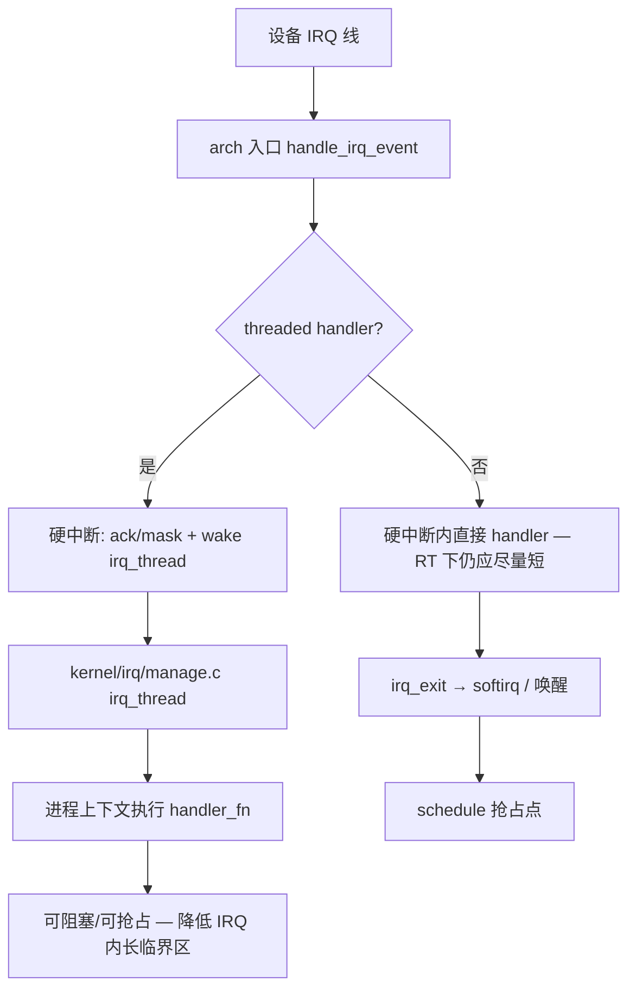
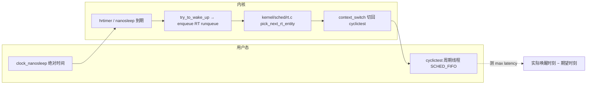

# 实时 Linux 完整篇：从 PREEMPT_RT、线程化中断到 cyclictest 验证

控制环周期抖动从几十微秒飙到毫秒、偶发 deadline miss 却找不到「谁占了 CPU」——这类问题往往不是业务算法错，而是 **Linux 内核抢占模型、中断上下文与锁语义** 与硬实时假设不一致。许多团队停在 `nice -20` 或 `chrt -f 99`，cyclictest 一跑 Max 仍上千微秒，根因常在：**内核未开 PREEMPT_RT、IRQ handler 在硬中断里跑慢路径、RT 线程与 ksoftirqd/RCU 同核竞争**。

本文专讲 **Linux + PREEMPT_RT 落地**（区别于 FreeRTOS/Zephyr 选型类的「嵌入式系统-实时系统」综述）：从 Kconfig 编译、启动参数、内核关键路径到 `cyclictest` 闭环验证，按源码锚点组织，便于排障与评审。读完应能独立完成：**选内核 → 配隔离 → 设 RT 策略 → 测 latency → 用 ftrace 追尖刺**。下文默认读者已了解 `SCHED_FIFO` 与 CFS 的分层关系（详见「Linux 内核-进程管理与调度完整篇」）。

---

## 源码锚点

| 路径 | 作用 |
|------|------|
| `kernel/Kconfig.preempt` | 抢占模型：`PREEMPT_NONE` / `PREEMPT_VOLUNTARY` / `PREEMPT` / **`PREEMPT_RT`** |
| `kernel/locking/spinlock.c` | 经典 spinlock；**PREEMPT_RT 下多数 `spin_lock()` 变为可睡眠路径**（配合 `spinlock_rt.h` 宏展开） |
| `include/linux/spinlock_rt.h` | RT 变体：`spin_lock()` 映射到 rt_mutex 类实现，消除长临界区关抢占 |
| `kernel/irq/manage.c` | `request_threaded_irq`、`setup_irq`、`irq_thread` — 硬中断与线程化 handler 分工 |
| `kernel/sched/rt.c` | `SCHED_FIFO`/`SCHED_RR` 调度；**`sched_rt_runtime` / `sched_rt_period` RT 带宽节流** |
| `kernel/sched/core.c` | `schedule`、`preempt_schedule` — 抢占点与调度入口 |
| `kernel/time/hrtimer.c` | 高精度定时器，用户态 `clock_nanosleep` / cyclictest 唤醒链终点 |
| `tools/testing/selftests/rt-tests/cyclictest.c` | 主线 cyclictest 源码（发行版常打包为 `rt-tests`） |
| `Documentation/admin-guide/kernel-parameters.txt` | `isolcpus`、`nohz_full`、`rcu_nocbs`、`threadirqs` 等启动参数说明 |

以上路径均来自主线 Linux 树；读 RT 相关补丁时优先对照 **6.12+ 合入后的同一文件**，避免沿用旧补丁树已删除的符号名。

PREEMPT_RT 自 **Linux 6.12** 起合入主线，`make menuconfig → Preemption Model → Fully Preemptible Kernel (Realtime)` 即可启用；6.12 之前需使用 RT 补丁树（如 `linux-rt-devel`）。Kconfig 入口在 `kernel/Kconfig.preempt`，四档抢占模型互斥选一。编译安装后务必更新 bootloader 并重启，仅 `modprobe` 无法切换抢占模型。

验证是否生效：

```bash
grep PREEMPT /boot/config-$(uname -r)   # CONFIG_PREEMPT_RT=y
uname -a                                # 部分发行版内核名带 -rt
zcat /proc/config.gz 2>/dev/null | grep PREEMPT_RT
# 运行中查看：/sys/kernel/realtime 存在且为 1 表示 RT 内核（部分配置）
cat /sys/kernel/realtime 2>/dev/null || true
```

---

## 调用链

### 1. 硬中断 → 线程化 handler（PREEMPT_RT 关键路径）



`request_threaded_irq()` 注册时：`handler` 为 top-half（快速 ack），`thread_fn` 为慢路径。启动参数 **`threadirqs`**（对应 `CONFIG_IRQ_FORCED_THREADING`）强制未显式声明 `IRQF_NO_THREAD` 的 IRQ 走线程化，便于 RT 环境统一在进程上下文处理设备逻辑。查看某 IRQ 是否已线程化：`cat /proc/interrupts` 对应行若显示 `irq/NN-name` 线程名，通常表示 threaded 路径已生效。

### 2. RT 任务唤醒 → 调度 → cyclictest 测延迟



cyclictest 在 `tools/testing/selftests/rt-tests/cyclictest.c` 中维护 per-thread 的 `struct thread_param`，循环 `clock_nanosleep(TIMER_ABSTIME)`，统计 **最大/平均 wakeup latency**；这是验收 PREEMPT_RT 与 CPU 隔离是否达标的工业标准工具，发行版包名通常为 `rt-tests`。

---

## 重点知识

### 1. 四种抢占模型：为何只有 PREEMPT_RT 够「硬软实时」

| 模型 | Kconfig | 内核态可抢占性 | 典型 jitter |
|------|---------|----------------|-------------|
| 无抢占 | `PREEMPT_NONE` | 仅返回用户态时 | ms 级 |
| 自愿抢占 | `PREEMPT_VOLUNTARY` | 显式 `cond_resched()` 点 | ms～百 μs |
| 完全抢占 | `PREEMPT` | 大多数内核路径可抢占 | 十～百 μs |
| **实时抢占** | **`PREEMPT_RT`** | spinlock/IRQ 路径线程化或可睡眠 | 十 μs 级（需实测） |

`PREEMPT` 仍可能在 **关中断、raw spinlock 临界区** 内阻塞高优先级 RT 任务；`PREEMPT_RT` 的核心是把「不可抢占的内核区」尽量搬到 **可抢占、可线程化** 的实现上，而不是 magic 保证硬实时。选型时常见误区：

- **`CONFIG_PREEMPT=y` 不等于 RT**：这是「完全抢占内核」，工业控制仍可能百 μs 级尖刺。
- **用户态 `SCHED_FIFO`  alone 不够**：内核路径不可抢占时，RT 线程照样被拖住。
- **PREEMPT_RT 不替代 RTOS 形式化 WCET**：它提供的是工程上可测的低 jitter 平台，截止期保证仍靠隔离、代码审查与压测签字。

### 2. Sleeping spinlock：RT 对锁语义的重写

经典 `kernel/locking/spinlock.c` 语义：**持锁关抢占、不可睡眠**。PREEMPT_RT 下通过 `spinlock_rt.h` 将多数 `spin_lock()` 变为基于 **rt_mutex** 的睡眠锁——持锁任务可被更高优先级 RT 任务抢占，阻塞在锁上的任务进入睡眠而非自旋 burn CPU。

排障含义：

- 驱动里在 IRQ 上下文或 `spin_lock_irqsave` 临界区调用可能睡眠的 API（`kmalloc(GFP_KERNEL)`、`mutex_lock`）在 RT 下可能 **死锁或 WARN**。
- 读 `/proc/lock_stat`（若启用）与 `ftrace` 的 `function_graph` 查长持有锁路径。
- 自研内核模块应遵循：**top-half 只做 ack 与 `wake_thread`，慢逻辑放 threaded handler**。

对比记忆：经典 spinlock 在 `kernel/locking/spinlock.c` 中 `preempt_disable()` 后自旋；RT 变体在 `include/linux/spinlock_rt.h` 中走 **rt_mutex 慢路径**，持锁等待者睡眠而非空转。这解释了为何 PREEMPT_RT 下 `spin_lock()` 可能触发调度——与裸机 RTOS「关中断即临界区」直觉不同，移植驱动时必须重审锁与 IRQ 分层。

### 3. 强制中断线程化与 `kernel/irq/manage.c`

关键 API（`kernel/irq/manage.c`）：

```c
int request_threaded_irq(unsigned int irq, irq_handler_t handler,
                         irq_handler_t thread_fn, unsigned long flags,
                         const char *name, void *dev);
```

- **硬中断 handler**：极短，返回 `IRQ_WAKE_THREAD` 唤醒线程。
- **irq_thread**：以 SCHED_FIFO 或 SCHED_OTHER 运行 `thread_fn`，可调用可能阻塞的驱动逻辑。

启动参数示例：

```text
threadirqs isolcpus=2,3 nohz_full=2,3 rcu_nocbs=2,3
```

`threadirqs` 与 PREEMPT_RT 常配合使用；未线程化的 legacy handler 是 jitter 尖刺的常见来源。在 `kernel/irq/manage.c` 中，`irq_thread` 内核线程循环等待 `IRQD_IRQ_WAKE_THREAD` 标志，被唤醒后调用 `thread_fn`——这条路径与 `ksoftirqd` 分离，便于把 **设备慢逻辑** 从硬中断剥离。

驱动迁移检查清单：是否仍用 `request_irq` 而非 `request_threaded_irq`；top-half 是否含 `msleep`/`i2c_transfer` 等等待；共享 IRQ 线上是否有其他设备拖长 handler。

### 4. RT 带宽节流：`kernel/sched/rt.c` 与 `rt_runtime`

纯 `SCHED_FIFO` 高优先级任务可 **饿死** CFS 普通任务（包括 ssh、日志、watchdog）。内核通过 **RT throttling** 限制每周期 RT 可用 CPU 时间：

```bash
# 默认常见：950ms / 1000ms 周期内 RT 最多占 950ms
cat /proc/sys/kernel/sched_rt_period_us      # 1000000
cat /proc/sys/kernel/sched_rt_runtime_us     # 950000；-1 表示不限

# 临时放开（慎用，仅调试）
sysctl -w kernel.sched_rt_runtime_us=-1
```

实现位于 `kernel/sched/rt.c` 的 `sched_rt_runtime` / `sched_rt_period` 与 `rt_throttled` 逻辑。当 RT 任务在一周期内耗尽的 runtime 超过配额，runqueue 上 RT 实体被 throttle，**直到下一周期**——表现为控制环「周期性卡顿」 exactly 每 `sched_rt_period_us` 一次。工业现场：**控制环用隔离核 + FIFO**， housekeeping 核跑普通任务；或保留 throttling 防止 RT 占满导致 ssh/log 不可用。

用户态设置 RT 策略（需 `CAP_SYS_NICE` 或 `ulimit -r`）：

```bash
chrt -f 80 ./control_loop              # SCHED_FIFO 优先级 80
chrt -r 50 ./periodic_task               # SCHED_RR
ulimit -r                                # 查看允许的最大 RT priority
# /etc/security/limits.d/ 配置 @rtprio 99
```

### 5. CPU 隔离：`isolcpus`、`nohz_full`、`rcu_nocbs`

| 参数 | 作用 |
|------|------|
| `isolcpus=n` | 指定 CPU 不参与普通 CFS 负载均衡，专供 RT 任务 `taskset` |
| `nohz_full=n` | 隔离核 tickless，减少 timer tick 打断 |
| `rcu_nocbs=n` | RCU 回调卸载到非隔离核，避免 RT 核上 RCU softirq |
| `irqaffinity=0` | 引导时将 IRQ 默认绑 housekeeping 核（平台相关） |

完整 cmdline 示例（双核隔离 RT）：

```text
isolcpus=2,3 nohz_full=2,3 rcu_nocbs=2,3 skew_tick=1 intel_pstate=disable processor.max_cstate=1 idle=poll
```

注意：`idle=poll` / 关 C-states **显著增功耗**，仅在实验室测 worst-case latency 时使用；生产需权衡散热与能效。`skew_tick=1` 让各 CPU tick 错开，减轻同时 tick 带来的 IPI 风暴；与 `nohz_full` 联用时需确认 `CONFIG_NO_HZ_FULL=y`。

典型双核隔离拓扑：CPU0–1 跑 systemd/网络/存储（housekeeping），CPU2–3 专供 RT；启动后 **手动或 systemd unit** 把 cyclictest 与控制环 `taskset` 到 2–3，并把 eth/storage IRQ affinity 改到 0–1。

将 housekeeping 中断与 RT 控制环分离：

```bash
# 将 RT 线程绑隔离核
taskset -c 2 chrt -f 90 ./motor_control

# 查看 IRQ 亲和
grep eth0 /proc/interrupts
echo 1 > /proc/irq/42/smp_affinity   # 绑 CPU0
```

### 6. cyclictest：编译、运行与结果解读

源码路径：`tools/testing/selftests/rt-tests/cyclictest.c`（主线内核）；Debian/Ubuntu 等可 `apt install rt-tests`。

```bash
# 主线内核树内
cd tools/testing/selftests/rt-tests
make cyclictest
sudo ./cyclictest -p 90 -m -c 2 -i 1000 -n -h 100 -q

# 常用参数
# -p 90     FIFO 优先级 90
# -m       锁定内存 mlockall，避免缺页
# -c 2     绑 CPU 2（与 isolcpus 一致）
# -i 1000   周期 1000 μs
# -h 100    延迟直方图
# -l 100000 循环次数
```

输出中 **Max latency** 是验收核心：在 PREEMPT_RT + 隔离 + 关 C-states 的实验室条件下，常见目标为 **< 50 μs**（视硬件与负载而定，以项目 SLA 为准）。若 Max 偶发 ms 级尖刺，继续查：未线程化 IRQ、NVMe 中断风暴、内核模块 `printk` 洪水、SMI/BIOS、CPU frequency scaling。

应用侧最小 RT 线程模板（与 cyclictest 同类思路）：

```c
#define _GNU_SOURCE
#include <sched.h>
#include <pthread.h>
#include <sys/mman.h>

static void *rt_loop(void *arg)
{
    struct sched_param sp = { .sched_priority = 80 };
    sched_setscheduler(0, SCHED_FIFO, &sp);
    mlockall(MCL_CURRENT | MCL_FUTURE);   /* 避免缺页 fault */

    struct timespec next;
    clock_gettime(CLOCK_MONOTONIC, &next);
    for (;;) {
        next.tv_nsec += 1000000;          /* 1 ms 周期 */
        if (next.tv_nsec >= 1000000000) {
            next.tv_sec++;
            next.tv_nsec -= 1000000000;
        }
        clock_nanosleep(CLOCK_MONOTONIC, TIMER_ABSTIME, &next, NULL);
        /* 控制逻辑 */
    }
    return NULL;
}
```

与 **stress-ng** 组合压测：

```bash
stress-ng --cpu 4 --io 2 --vm 2 &
cyclictest -p 90 -m -c 2 -i 500 -l 50000 -h 200 -q
```

### 7. latencytop 与延迟观测替代

**latencytop**（用户态工具，早期 Intel 出品）通过内核延迟统计接口，按进程/栈聚合「谁让谁等」——适合找 **用户态锁竞争、磁盘 read、page fault** 导致的调度延迟。用法示意：

```bash
sudo latencytop    # 需 root；部分发行版包名 latencytop
# 运行控制环负载，观察 TOP 延迟栈
```

较新内核已移除 `CONFIG_LATENCYTOP`，工具可能无数据；思路仍可用以下替代：

```bash
# ftrace：测 irq-off / preempt-off 最长关断时间
echo 1 > /sys/kernel/debug/tracing/tracing_on
echo 1 > /sys/kernel/debug/tracing/events/preemptirq/preempt_disable/enable
echo 1 > /sys/kernel/debug/tracing/events/preemptirq/irq_disable/enable
# 或使用 trace-cmd
trace-cmd record -e preempt -e irq -e sched:sched_wakeup sleep 10
trace-cmd report | less

# perf 调度延迟
perf sched record -a -- sleep 5
perf sched latency

# 内核栈
cat /proc/<pid>/stack
```

排障顺序：**cyclictest 量化 jitter → ftrace irqsoff/preemptoff 找内核长临界区 → `/proc/interrupts` 查 IRQ 分布 → latencytop/perf 查用户态**。

### 8. sysctl 与运行时调优速查

| 参数 | 典型值 | 说明 |
|------|--------|------|
| `kernel.sched_rt_runtime_us` | 950000 或 -1 | RT 带宽上限；-1 调试慎用 |
| `kernel.sched_rt_period_us` | 1000000 | 与 runtime 配合 |
| `kernel.sched_migration_cost_ns` | 500000（视场景） | 迁移代价，隔离环境可调大减少迁移 |
| `vm.swappiness` | 0 | RT 场景避免换出 RT 进程内存 |
| `kernel.numa_balancing` | 0 | 减少 NUMA 平衡打断 |

持久化写入 `/etc/sysctl.d/99-realtime.conf`，与 GRUB cmdline 一并纳入配置管理。

### 9. 常见配置与坑

| 现象 | 常见根因 | 对策 |
|------|----------|------|
| cyclictest Max 仍 ms 级 | 未启用 PREEMPT_RT 或未用 -rt 内核 | 查 `CONFIG_PREEMPT_RT`，换内核 |
| 尖刺与网络包同步 | 网卡 IRQ 打在 RT 核 | `smp_affinity` / RPS 分散到 housekeeping 核 |
| RT 任务「莫名」停跑 | `sched_rt_runtime_us` 节流触发 | 查 `/proc/sys/kernel/sched_rt_runtime_us` |
| 加载驱动后 jitter 恶化 | 非线程化 IRQ handler 过长 | `request_threaded_irq` 或 `threadirqs` |
| `insmod` 后系统卡死 | RT 下 spinlock 临界区睡眠 | 改锁顺序，慢路径移出 IRQ |
| 实验室正常、现场偶发 | C-states / P-states / SMI | 限 C-state、固定频率、BIOS 关 C6 |
| `SCHED_FIFO` 误用 | 同优先级多线程互占 CPU | 拆分优先级或改 RR |
| 只看平均延迟 | 平均值掩盖 rare tail | 必看 cyclictest **Max** 与 histogram |
| 升级内核未回归 | PREEMPT_RT 行为随版本变 | 固定 cyclictest 脚本进 CI/发布门禁 |
| NUMA 跨节点内存 | RT 线程与 buffer 不同节点 | `numactl --membind` 绑本地内存 |

**与「嵌入式实时系统」综述的区别**：FreeRTOS/Zephyr 讨论的是 **内核即 RTOS** 的固定优先级与 WCET；本篇讨论的是在 **通用 Linux 上通过 PREEMPT_RT 补丁/主线选项、调度策略与隔离参数** 逼近软/准硬实时——**必须 cyclictest + 压测签字**，不能凭 `chrt` 或 `nice` 自我安慰。

### 10. 上线前回归场景

建议维护三类回归用例，内核/驱动/BIOS 任一变更都重跑：

1. **空闲基线**：无 stress，cyclictest 跑 1 小时，记录 Max/P99。
2. **负载基线**：stress-ng 压 CPU/IO/网络，cyclictest 同核运行，Max 不得超 SLA。
3. **故障注入**：实验台可用 `echo l > /proc/sys/sysrq` 等 sysrq 触发栈回溯；生产用 **watchdog 超时复位** 验证 RT 环 fail-safe。

文档中固定记录：内核 `CONFIG_PREEMPT_RT` 版本、完整 cmdline、IRQ affinity 脚本、cyclictest 命令行与 Max 截图——便于六个月后「为什么变抖了」的对照 diff。

---


---

## 小结

实时 Linux 的落地链是：**Kconfig 选 PREEMPT_RT → 启动参数隔离核与 tickless → 中断线程化与睡眠 spinlock 缩短不可抢占区 → `SCHED_FIFO` 用户态控制环 → `kernel/sched/rt.c` 带宽节流防系统不可管 → cyclictest 量化验收**。这是一条可重复、可测量的工程路径，而非单次调参碰运气。读码从 `kernel/Kconfig.preempt`、`kernel/irq/manage.c`、`kernel/sched/rt.c` 三处切入，再用 `cyclictest` 与 ftrace 闭环，比空谈「硬实时 Linux」更接近工程真相。

若你维护的是 **MCU 侧硬实时 + Linux 侧 HMI** 的双栈架构，RTOS 截止期与 Linux PREEMPT_RT 验收应 **分开签字**：前者看 WCET 与优先级反转，后者看 cyclictest Max 与 IRQ 拓扑——勿混为一谈。
