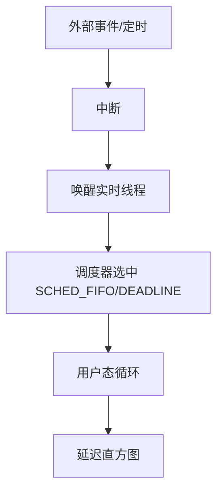

# 实时 Linux：PREEMPT_RT、延迟来源与观测

软实时/硬实时需求里，主线内核默认抢占往往不够。**PREEMPT_RT** 把自旋锁等路径改成可抢占，降低最坏延迟，但要配合隔离核、关机外干扰与实测。

## 源码锚点

| 路径 / 手册 | 作用 |
|-------------|------|
| `Documentation/scheduler/` | 调度说明 |
| `kernel/sched/` | 调度实现 |
| `tools/rt-tests/` | `cyclictest` 等 |
| `man chrt` | 设调度策略 |

## 调用链



## 重点知识

### 延迟从哪来

中断下半部、关抢占临界区、同核干扰、电源管理休眠、SMI（x86）、显卡锁。RT 内核降低部分最坏情况，不能替代 dual-OS/AMP 硬实时方案。

### 观测

```bash
cyclictest -p 90 -i 1000 -l 100000
chrt -f 90 ./my_rt_app
# isolcpus / cpuset 隔离
```

### 实践要点

- 实时线程绑核，避开 IRQ 重载核。
- 避免在 RT 线程里写磁盘、打日志刷屏。
- 先测空载基线，再加业务。
