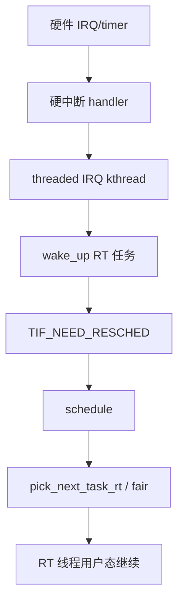

# 实时 Linux 内核 PREEMPT_RT 完整篇：延迟来源、isolcpus、cyclictest 与 IRQ 亲和

换 **PREEMPT_RT** 内核后 cyclictest 最大延迟仍到毫秒级，或业务线程 `SCHED_FIFO` 仍被周期性打断——根因常在 **测量方法不对、未隔离 CPU、IRQ/工作队列落在同核、电源管理 C-state、内存 balloon** 而非「RT 补丁没生效」。PREEMPT_RT 把大量 **spinlock → sleeping mutex**、threaded IRQ 化，降低最坏延迟，但不等价于硬实时 MCU。

本文合并实时系统 chapter 017–022，覆盖 **PREEMPT_RT 机制、延迟来源、isolcpus/cpuset、chrt、cyclictest、IRQ 亲和、反模式**，附内核锚点与可复现实验。

---

## 源码锚点

| 路径 / 手册 | 作用 |
|-------------|------|
| `kernel/Kconfig.preempt` | `CONFIG_PREEMPT_RT` 选项树 |
| `kernel/sched/core.c` | `schedule`、`preempt_enable` |
| `kernel/sched/rt.c` | `SCHED_FIFO/RR`、`pick_next_task_rt` |
| `kernel/sched/deadline.c` | `SCHED_DEADLINE` EDF |
| `kernel/locking/rtmutex.c` | RT mutex、PI 优先级继承 |
| `kernel/irq/manage.c` | IRQ 注册、`request_threaded_irq` |
| `include/linux/preempt.h` | `preempt_disable/enable` |
| `kernel/time/hrtimer.c` | 高精度定时器 |
| `Documentation/admin-guide/kernel-parameters.txt` | `isolcpus`、`nohz_full` |
| `tools/testing/rt-tests/cyclictest/` | 延迟测量 |
| `man chrt` `man taskset` | 调度策略与绑核 |

PREEMPT_RT 关键：不可抢占区缩短，**spinlock_t** 在 RT 内核变为 **sleeping lock**（`kernel/locking/spinlock_rt.c`）。

```c
asmlinkage __visible void __sched schedule(void)
{
    struct task_struct *tsk = current;
    /* pick_next_task → context_switch */
}
```

---

## 调用链

### ① 外部事件到 RT 线程运行



### ② cyclictest 测量路径


---

## 一、PREEMPT_RT 是什么

### 1.1 内核抢占模型对比

| 配置 | 含义 | 最坏延迟 |
|------|------|----------|
| CONFIG_PREEMPT_NONE | 仅用户态抢占 | 高 |
| CONFIG_PREEMPT_VOLUNTARY | 自愿抢占点 | 中高 |
| CONFIG_PREEMPT | 内核可抢占（非 RT） | 中 |
| CONFIG_PREEMPT_RT | 全抢占 + sleeping locks | 低（仍非硬 RT） |

主线内核 **CONFIG_PREEMPT** 仍有关中断临界区持 spinlock 的长路径；**PREEMPT_RT** 把 spinlock 路径改为 **rt_mutex**，使持锁睡眠可抢占。

### 1.2 如何确认 RT 内核

```bash
uname -a
zcat /proc/config.gz | grep PREEMPT
cat /sys/kernel/realtime 2>/dev/null
```

### 1.3 RT 不能解决什么

- **SMI**（x86 管理中断）、**GPU 驱动** 长临界区。
- **NUMA 远端内存**、**page fault**（mlock 可避免）。
- **硬实时**（微秒级保证）→ MCU/FPGA/AMP 更合适。

---

## 二、延迟来源分解

### 2.1 中断与软中断

硬 IRQ handler 应尽量短；**PREEMPT_RT** 推 **threaded IRQ**，ISR 只 wake thread。仍要注意 **同一 CPU 上 IRQ thread 与 RT 任务竞争**。

```bash
cat /proc/interrupts
grep . /proc/irq/*/smp_affinity_list
watch -n1 'cat /proc/softirqs | head'
```

### 2.2 内核临界区

非 RT：`spin_lock_irqsave` 关抢占+关 IRQ。**RT**：可睡眠锁缩短不可抢占窗口，但 **raw_spinlock**（scheduler runqueue）仍存在短临界区。

### 2.3 同核干扰

CFS 普通任务、**kworker**、**ksoftirqd**、**migration** 与 RT 同核 → 延迟尖刺。

**对策**：`isolcpus`、`nohz_full`、IRQ affinity、cpuset。

### 2.4 电源管理

**C-states** 退出延迟可达百微秒级：

```bash
cpupower idle-info
cat /sys/devices/system/cpu/cpu0/cpufreq/scaling_governor
```

BIOS **C6/EIST** 在硬 RT 场景常关闭。

### 2.5 内存：swap 与 page fault

RT 线程应 **mlockall**：

```c
mlockall(MCL_CURRENT | MCL_FUTURE);
```

```bash
ulimit -l unlimited
```

### 2.6 SMI（x86）

无法从 OS 屏蔽；工业 PC 选低 SMI BIOS 或 disable 部分 ACPI。

---

## 三、isolcpus、nohz_full 与 cpuset

### 3.1 内核参数

```text
isolcpus=2,3 nohz_full=2,3 rcu_nocbs=2,3
```

| 参数 | 作用 |
|------|------|
| isolcpus | 隔离 CPU，balancer 默认不迁入普通任务 |
| nohz_full | 无 tick 干扰（需 isolcpus 配合） |
| rcu_nocbs | RCU callback offload 到非隔离核 |

仍须 **taskset/cset** 把 RT 任务放进隔离核；**isolcpus 不会自动绑 IRQ**。

### 3.2 taskset 与 cpuset

```bash
taskset -c 2 chrt -f 80 ./control_loop
echo 2-3 | sudo tee /sys/fs/cgroup/myrt/cpuset.cpus
echo 0 | sudo tee /sys/fs/cgroup/myrt/cpuset.mems
echo $$ | sudo tee /sys/fs/cgroup/myrt/cgroup.procs
```

### 3.3 把 IRQ 移出 RT 核

```bash
grep eth0 /proc/interrupts
echo 1 | sudo tee /proc/irq/NN/smp_affinity_list
```

多队列网卡须逐队列调整 **msi_irqs**。

### 3.4 tuned realtime profile

```bash
sudo tuned-adm profile realtime
tuned-adm active
```

含 **kernel.sched_rt_runtime_us=-1** 等；理解副作用再用于生产。

---

## 四、chrt 与 SCHED 策略

### 4.1 策略一览

| policy | 值 | 行为 |
|--------|-----|------|
| SCHED_OTHER | 0 | CFS 默认 |
| SCHED_FIFO | 1 | 固定优先级，同prio FIFO |
| SCHED_RR | 2 | 时间片轮转 |
| SCHED_DEADLINE | 6 | EDF，需 runtime/deadline/period |

### 4.2 chrt 用法

```bash
chrt -f 50 ./app
chrt -r 30 ./app
chrt -p 80 $(pidof app)
chrt -m
```

FIFO/RR 优先级 1-99，越大越高。

### 4.3 SCHED_FIFO 注意

- 高优先级 **忙等** 会饿死低优先级与 **同核 kthread**。
- 须 **主动 yield/block**；临界区极短。
- **sched_rt_runtime_us** 默认 950ms/秒 RT 带宽限制（可改 -1 取消）。

```bash
sysctl kernel.sched_rt_runtime_us
sysctl kernel.sched_rt_period_us
```

### 4.4 SCHED_DEADLINE

```bash
chrt -d -T 1000000 -P 5000000 -D 5000000 ./task
```

适合周期任务可证明 schedulability；需 **CONFIG_SCHED_DEADLINE**。

---

## 五、cyclictest 实测

### 5.1 安装与基本跑法

```bash
cyclictest -a -t1 -p 80 -n -i 1000 -l 100000 -m -q
```

### 5.2 读输出

```text
T: 0 ( 1234) P:80 I:1000 C:100000 Min: 3 Act: 5 Avg: 8 Max: 45
```

**Max** 为最坏；对比 **baseline 空载** vs **stress 负载**：

```bash
stress-ng --cpu 4 --io 2 --vm 1 &
cyclictest -a -t4 -p 90 -i 200 -l 50000 -m
```

### 5.3 多核与 histogram

```bash
cyclictest -p 99 -a2,3 -t2 -i 1000 -l 100000 -h 1000 --histfile /tmp/cy.hist
```

### 5.4 常见误判

- 未 **-m** mlock → page fault 尖刺。
- priority 低于 **IRQ thread** 或系统任务。
- **虚拟机** 未 pin vCPU / 宿主机 overload → Max 无意义。

### 5.5 trace 辅助

```bash
sudo trace-cmd record -p function_graph -e sched:sched_switch cyclictest
```

---

## 六、IRQ 亲和与 RPS

### 6.1 /proc/irq 亲和

```bash
for irq in $(grep eth0 /proc/interrupts | awk -F: '{print $1}'); do
  echo 1 | sudo tee /proc/irq/$irq/smp_affinity_list
done
```

RT 系统常 **disable irqbalance** 并静态 affinity。

### 6.2 网卡多队列

```bash
ethtool -l eth0
```

### 6.3 RPS

RT 核上应减少 RPS 把包 steer 到 RT 核。

```bash
cat /sys/class/net/eth0/queues/rx-0/rps_cpus
```

---

## 七、反模式

### 7.1 反模式列表

| 反模式 | 后果 |
|--------|------|
| RT 线程 printf/写磁盘日志 | I/O 阻塞、不可预测 |
| RT 线程 malloc 大堆 | page fault、锁竞争 |
| 高优先级 FIFO 死循环 | 系统挂死 |
| 未 isolcpus 即宣称硬 RT | cyclictest Max 毫秒级 |
| 虚拟机无 CPU pinning | steal time 尖刺 |
| 开 irqbalance 与手工 affinity 打架 | 延迟随机 |
| 忽略 NUMA 跨 node 访问 | 内存延迟翻倍 |
| RT 路径长时间 mutex 临界区 | 优先级反转风险 |

### 7.2 日志与 tracing

用 **内存 ring buffer**、**低优先级 kthread** 写盘。

### 7.3 数据库/JSON 解析放 RT 环

应 **非 RT 线程预处理 + lock-free queue** 交给 RT 环只算控制律。

---

## 八、优先级反转与 PI

Linux **rt_mutex** 支持 **优先级继承**：低优先级持锁，高优先级等待时临时提升持有者 priority。

```bash
echo 1 | sudo tee /sys/kernel/debug/tracing/events/sched/sched_pi_setprio/enable
```

---

## 九、/proc/sys/kernel 实时相关 sysctl

```bash
sysctl kernel.sched_rt_runtime_us=-1
sysctl kernel.sched_migration_cost_ns
sysctl kernel.timer_migration
cat /proc/sys/kernel/sched_latency_ns
```

**sched_rt_runtime_us=950000** 默认：每 1s 内 RT 最多跑 950ms。

---

## 十、PREEMPT_RT 与主线合并现状

PREEMPT_RT 逐步 **mainline**：跟踪内核 6.x 发布说明中 RT 支持架构。发行版 **Ubuntu lowlatency**、**RHEL RT** 提供预编译包。

```bash
apt search linux-image | grep rt
```

---

## 十一、mlock、stack prefault

```c
#define STACK_SIZE (64*1024)
static unsigned char stack[STACK_SIZE];
void prefault_stack(void) {
    for (size_t i = 0; i < STACK_SIZE; i += sysconf(_SC_PAGESIZE))
        stack[i] = 0;
}
```

---

## 十二、timerfd 与周期任务

```c
int fd = timerfd_create(CLOCK_MONOTONIC, TFD_NONBLOCK);
struct itimerspec its = { .it_interval = {0, 1000000}, .it_value = {0, 1000000} };
timerfd_settime(fd, 0, &its, NULL);
```

比 **usleep** 更适合周期控制。

---

## 十三、硬件 timestamping（PHC）

```bash
ethtool -T eth0
phc_ctl /dev/ptp0 get
```

PTP 中断亦需 **affinity** 规划。

---

## 十四、Xenomai / EVL 双内核（对照）

**EVL** 提供 **out-of-band** 线程，延迟低于纯 PREEMPT_RT；需 **EVL 内核模块**。与 PREEMPT_RT **单内核** 路径不同。

---

## 十五、ARM64 与 PREEMPT_RT

```bash
zcat /proc/config.gz | grep -E 'PREEMPT|RT'
```

SoC **devfreq** 调频引入延迟；嵌入式可 **cpufreq performance** 或定频。

---

## 十六、案例：cyclictest Max 8ms

**环境**：云 VM，PREEMPT_RT 内核。

**根因**：**steal time**、未 isolcpus、**kvmclock** 抖动。

**验证**：

```bash
grep steal /proc/stat
mpstat -P ALL 1
```

**对策**：裸金属或 **CPU pinning** + **host passthrough**。

---

## 十七、案例：FIFO 90 仍被周期性打断

**根因**：**hrtimer** 与其他 FIFO 99 同核；或 **watchdog** 线程。

**对策**：`ps -Lo pid,tid,class,rtprio,comm`；降低干扰线程 prio 或移核。

---

## 十八、案例：网卡 IRQ 风暴

**根因**：广播风暴 → 软中断占用 RT 核。

**对策**：IRQ affinity 到 non-RT；交换机层抑 storm。

---

## 十九、stress 与 rt-tests 套件

```bash
hackbench -p -l 1000
pi_stress
signaltest
pmqtest
```

---

## 二十、ftrace latency 追踪

```bash
echo function_graph | sudo tee /sys/kernel/debug/tracing/current_tracer
echo schedule | sudo tee /sys/kernel/debug/tracing/set_graph_function
```

**function_graph** 开销大，仅短窗口。

---

## 二十一、perf sched 观测

```bash
sudo perf sched record -a sleep 10
sudo perf sched latency
```

---

## 二十二、RCU 与 RT

**PREEMPT_RT** 下 **RCU** 回调可能 **offload**（`rcu_nocbs`）。

---

## 二十三、内核 module 与 RT

闭源 **ko** 若含 **raw spinlock 长持锁**，可破坏 RT 保证。

---

## 二十四、容器与 RT

```bash
docker run --cap-add SYS_NICE --ulimit rtprio=99 ...
docker run --cpuset-cpus="2,3" ...
```

K8s **static CPU manager** 才能接近裸机 RT。

---

## 二十五、实时性文档化

交付须含：**内核 config、cyclictest 命令、负载条件、Max/Avg、硬件型号、BIOS 电源项**。

---

## 附录 A：cyclictest 参数表

| 参数 | 含义 |
|------|------|
| -a | SMP auto CPUs |
| -t N | N 测量线程 |
| -p P | FIFO priority P |
| -i us | 间隔 |
| -l N | 循环次数 |
| -m | mlockall |
| -h us | histogram 桶 |
| -q | quiet summary |

---

## 附录 B：chrt 与 nice

**nice** 仅影响 CFS；与 **chrt -f** 独立。子进程继承 scheduling policy。

---

## 附录 C：/proc/PID/sched 字段

```bash
cat /proc/self/sched | grep -E 'policy|prio|nr_voluntary'
```

---

## 附录 D：kernel boot 参数汇总

```text
isolcpus=2,3 nohz_full=2,3 rcu_nocbs=2,3
processor.max_cstate=0 intel_idle.max_cstate=0
threadirqs
```

因平台而异，Intel/AMD/ARM 电源参数不同。

---

## 附录 E：RHEL RT 订阅

RHEL **kernel-rt** 包与 **Tuned realtime**；升级策略跟 Red Hat lifecycle。

---

## 附录 F：watchdog 与 RT

**soft lockup/hard lockup** 检测依赖 **hrtimer**；可调 **heartbeat** 或移核。

---

## 附录 G：GPIO 与 RT

用户态 **libgpiod** 控制循环若需 RT，仍须 **chrt+mlock+isolcpus**；**gpiochip irq** affinity 单独配置。

---

## 附录 H：对比 AMP 方案

**Linux + MCU**：Linux 跑网络/UI，MCU 跑电流环；**RPMsg/OpenAMP** 通信。硬截止在 MCU。

---

## 附录 I：编译 PREEMPT_RT 内核（简述）

```bash
make menuconfig
make -j$(nproc)
sudo make modules_install install
```

更新 bootloader；保留旧内核 fallback。

---

## 附录 J：latency 预算表（示例）

| 环节 | 典型量级 |
|------|----------|
| cache hot | 1–5 us |
| C-state exit | 50–200 us |
| VM exit | 1–50+ us |
| disk I/O | ms |
| SMI | 不可控 us-ms |

---

## 附录 K：taskset vs sched_setaffinity

```c
cpu_set_t cpuset;
CPU_ZERO(&cpuset);
CPU_SET(2, &cpuset);
sched_setaffinity(0, sizeof(cpuset), &cpuset);
```

---

## 附录 L：/sys/devices/system/cpu/isolated

```bash
cat /sys/devices/system/cpu/isolated
```

---

## 附录 M：NO_HZ_FULL

减少 **timer tick** 对 isolated CPU 干扰；见 **Documentation/admin-guide/hz.rst**。

---

## 附录 N：反模式补充

- **在 RT 线程调用 system()** → fork+shell 不可预测。
- **大栈自动变量** → 栈 expansion fault。
- **频繁 open/close 设备** → path lookup 与 alloc。

---

## 附录 O：综合验证脚本

```bash
#!/bin/bash
echo '=== kernel ==='; uname -a; zcat /proc/config.gz 2>/dev/null | grep PREEMPT
echo '=== isolated ==='; cat /sys/devices/system/cpu/isolated 2>/dev/null
echo '=== governor ==='; cat /sys/devices/system/cpu/cpu*/cpufreq/scaling_governor 2>/dev/null | sort -u
echo '=== rt sysctl ==='; sysctl kernel.sched_rt_runtime_us
chrt -m
if command -v cyclictest >/dev/null; then
  cyclictest -a -t1 -p 80 -n -i 1000 -l 5000 -m -q
fi
```

---

---

## 四十一、preempt_count 与 /proc/sched_debug

```bash
grep -i preempt /proc/sched_debug 2>/dev/null | head
cat /proc/softirqs
```

**preempt_count** 非零表示处于不可抢占区；RT 内核仍可能在 **raw_spinlock** 路径短暂非零。

---

## 四十二、工业验收 cyclictest 环境记录

现场验收须记录 **环境温度、风扇转速、同时运行的业务负载**，并与 **空载 baseline** 成对归档；否则 Max 尖刺无法复现。

*合并自实时系统 017–022；测量延迟前必先固定 CPU/IRQ/电源，否则数字无对比意义。*
---

## 二十六、spinlock 与 rt_mutex 机制差异

主线内核中 **spin_lock** 在持锁期间禁止抢占；持锁区过长会直接抬高 RT 延迟上界。PREEMPT_RT 将多数 **spinlock_t** 映射为 **rt_mutex**，等待者睡眠而非忙等 spin。

```text
非 RT: spin_lock → preempt_disable → 可能关 IRQ → 临界区 → unlock
RT:    rt_spin_lock → 可睡眠等待 → 持锁者可被更高优先级 RT 抢占（除 raw_spinlock 区）
```

**raw_spinlock** 仍用于极短路径（如 `scheduler` runqueue、`timer` wheel 部分），读 `/proc/sched_debug` 时不应忽视这些残留不可抢占区。

```bash
# 查看 RT 相关 tracepoint
grep -r preempt /sys/kernel/debug/tracing/events/sched/ 2>/dev/null | head
```

---

## 二十七、workqueue 与 kworker 干扰

**system_wq** 上运行的 **kworker/u*:* ** 可能与 RT 线程同核。延迟尖刺常来自 **flush_work**、驱动 **deferred probe**、**uevents**。

```bash
ps -eLo psr,pid,tid,class,rtprio,comm | grep -E 'kworker|RT|FF'
# 观察 kworker 是否占 RT 核
cat /sys/devices/virtual/workqueue/cpumask
```

对策：RT 核上除必要 IRQ thread 外，避免 **workqueue** 与 **ksoftirqd**；`echo 0 > /proc/sys/kernel/workqueue_cpu_mask` 等技巧因内核版本而异，优先 **isolcpus + IRQ affinity**。

---

## 二十八、ksoftirqd 与 NET_RX 软中断

网络密集型负载下 **NET_RX** softirq 在 **ksoftirqd** 或 **poll 上下文** 消耗 CPU。即使硬 IRQ 已迁走，**RPS** 仍可能把处理 steer 到 RT 核。

```bash
cat /proc/softirqs | column -t
watch -n1 'grep NET_RX /proc/softirqs'
sysctl net.core.netdev_max_backlog
```

工业网关上 **RT 控制环** 与 **大流量 eth** 分核：eth IRQ + softirq 在 CPU0-1，RT 在 CPU2-3 isolcpus。

---

## 二十九、hrtimer 子系统与 cyclictest 关系

cyclictest 使用 **clock_nanosleep(CLOCK_MONOTONIC, TIMER_ABSTIME)**，底层 **hrtimer_start** 排队；到期时在 **hrtimer_interrupt** 唤醒任务。

```bash
grep -i hrtimer /proc/timer_list 2>/dev/null | head
# 或 trace
echo hrtimer_expire_entry | sudo tee /sys/kernel/debug/tracing/set_event
```

若 **Max latency** 周期性等于 **jiffies tick** 倍数，怀疑 **NO_HZ** 未生效或 **tick 广播** 到 isolated CPU；检查 **nohz_full** 与 **/sys/devices/system/cpu/cpu*/ isolated**。

---

## 三十、pick_next_task_rt 优先级数组

`kernel/sched/rt.c` 中 **rt_prio_array** 以 bitmap 找最高就绪 FIFO/RR 任务；同优先级 FIFO 队列 **FIFO 顺序**。

```c
/* 概念结构 */
struct rt_prio_array {
    DECLARE_BITMAP(bitmap, MAX_RT_PRIO+1);
    struct list_head queue[MAX_RT_PRIO+1];
};
```

**sched_rt_runtime_us** 限制 RT 类总 CPU 时间；超过后 **RT 任务 throttle**，cyclictest 出现 **周期性 Max 尖刺** 时先查：

```bash
cat /proc/sys/kernel/sched_rt_runtime_us
grep throttled /proc/sched_debug 2>/dev/null | head
```

---

## 三十一、工业 PC BIOS 电源项（x86）

| BIOS 项 | RT 建议 | 原因 |
|---------|---------|------|
| Intel SpeedStep / EIST | Disable 或 OS controlled + performance | P-state 切换延迟 |
| C States (C1E/C6) | Disable 或 C1 only | C-state 退出延迟 |
| Turbo Boost | 视负载；测试期可 Disable | 频率跳变 |
| Hyper-Threading | 视隔离策略 | 同核 SMT 兄弟干扰 |
| VT-d / ACS | 虚拟化 passthrough 时需要 | 与 RT 无直接冲突 |

改 BIOS 后 **冷启动**，用 **cpupower frequency-info** 验证。

---

## 三十二、Yocto / Buildroot 启用 RT

Yocto：`PREFERRED_PROVIDER_virtual/kernel = "linux-yocto-rt"` 或 **PREEMPT_RT** 内核 recipe；`kernel-features` 含 `features/rt/rt.scc`。

Buildroot：`BR2_LINUX_KERNEL_CUSTOM_PATCH` 打 RT patch，或选 **rt** 分支。

```bash
# 目标板验证
zcat /proc/config.gz | grep -E 'PREEMPT_RT|PREEMPT=y'
uname -v
```

镜像须含 **rt-tests** 包便于现场 cyclictest。

---

## 三十三、latency histogram 解读

cyclictest **-h 1000** 输出直方图：桶宽 1us 时，**单桶计数突增** 指示 **周期性干扰源**（如 1ms tick、16ms 帧、100Hz  PLC 轮询）。

```bash
cyclictest -p 99 -a2 -t1 -n -i 1000 -l 200000 -h 100 --histfile=/tmp/hist
# 用 awk/python 找 99.9 分位
```

交付指标建议：**Max、Avg、99.9th**，而非仅 Max（Max 可能单次 outlier）。

---

## 三十四、perf 锁定延迟热点

```bash
sudo perf record -e sched:sched_switch -e sched:sched_wakeup -a sleep 30
sudo perf script | head -200
sudo perf sched timehist
```

**sched_wakeup** 到 **sched_switch** 间隔大 → 运行队列竞争或持锁；对照 **cyclictest Max** 时间戳用 **ftrace** 关联。

---

## 三十五、FOC / 运动控制环部署模式

```text
[非 RT 线程] 轨迹规划、参数下发、HMI
      ↓ lock-free ring / RPMsg
[RT FIFO 线程] 电流环 / 位置环（50us–1ms）
      ↓
[MCU] 硬 PWM 定时（可选）
```

Linux PREEMPT_RT 适合 **数百微秒～毫秒** 级；**数十微秒** 硬截止仍放 MCU/FPGA。

---

## 三十六、内存：THP 与 RT

**Transparent Huge Pages** 合并可能引入 **latency spike**（compact/ khugepaged）：

```bash
cat /sys/kernel/mm/transparent_hugepage/enabled
# RT 系统常见 madvise 或 echo never > enabled
echo never | sudo tee /sys/kernel/mm/transparent_hugepage/enabled
```

RT 进程 **mlockall** 后仍应注意 **首次 touch**；启动阶段 **prefault** 栈与堆。

---

## 三十七、NUMA 绑核与内存

```bash
numactl --hardware
numactl --cpunodebind=1 --membind=1 chrt -f 80 ./app
```

跨 node 访问内存延迟 **~1.3–2x**；isolcpus 与 **membind** 必须一致。

---

## 三十八、实时信号 SIGRTMIN

```bash
kill -RTMIN+1 $pid
```

**sigtimedwait** 与 **SCHED_FIFO** 配合做轻量 IPC；注意信号 handler 内不可调用非 async-signal-safe 函数。

---

## 三十九、/proc/latency_stats（若启用）

部分 RT 内核配置 **LatencyTOP** 或 **debugfs latency**；发行版差异大。通用手段仍是 **cyclictest + ftrace**。

---

## 四十、验收报告模板（字段）

```text
硬件：CPU 型号 / 核数 / SMT / 内存 / 网卡
内核：uname -r / CONFIG_PREEMPT_RT
启动参数：isolcpus nohz_full rcu_nocbs cpufreq
BIOS：C-state / EIST 截图或文字
cyclictest：完整命令行、-l 次数、负载条件
结果：Min/Avg/Max/99.9th，多核分别记录
IRQ affinity：/proc/interrupts 快照
```

---

## 附录 P：kernel/sched/rt.c 阅读顺序

1. `sched_rt_runtime_exceeded` — RT 带宽 throttle
2. `pick_next_task_rt` — 选任务
3. `enqueue_task_rt` / `dequeue_task_rt` — 入出队
4. `watchdog_next` — 与 watchdog 交互

---

## 附录 Q：Documentation/scheduler 索引

主线 `Documentation/scheduler/` 含 **sched-rt-group**、**sched-deadline**；PREEMPT_RT 细节另见 **PREEMPT_RT wiki** 与内核 **Documentation/preempt-locking.rst**（路径随版本变化）。

---

## 附录 R：rt-tests 其他工具

| 工具 | 用途 |
|------|------|
| hackbench | 进程/context switch 压力 |
| pi_stress | 优先级反转 + PI 测试 |
| ptsematest | pthread mutex 延迟 |
| svsematest | SysV sem 延迟 |
| mqprioest | 消息队列优先级 |

---

## 附录 S：Docker/K8s CPU static policy

```yaml
# kubelet CPU Manager static + Guaranteed QoS
resources:
  limits:
    cpu: "2"
    memory: 512Mi
  requests:
    cpu: "2"
    memory: 512Mi
```

配合 **cpuset-cpus** 与 **isolcpus** 对齐；**Burstable** Pod 无法保证 RT。

---

## 附录 T：x86 intel_pstate vs acpi-cpufreq

```bash
cat /sys/devices/system/cpu/cpu0/cpufreq/scaling_driver
```

**intel_pstate** 的 **powersave** 与 **performance** 行为与 **acpi-cpufreq ondemand** 不同；RT 基准测试固定 **performance** 并记录 driver 名称。

---

## 附录 U：ARM big.LITTLE 与 RT

大核跑 RT、小核跑 background；**taskset** 绑 **CPU4-7（big）**。**sched_energy** 可能迁移任务 — 用 **cpuset** 限制。

```bash
lscpu | grep -E 'CPU\(s\)|Model name|MHz'
taskset -c 4-7 chrt -f 90 ./loop
```

---

## 附录 V：lockdep 与 RT 测试

```bash
zcat /proc/config.gz | grep LOCKDEP
```

**LOCKDEP** 开销极大，仅开发内核启用；性能/sign-off 用 **release kernel**。

---

## 附录 W：cyclictest 与 stress-ng 组合

```bash
stress-ng --cpu 8 --io 4 --vm 2 --timeout 600s &
cyclictest -a -t4 -p 95 -n -i 200 -l 300000 -m -h 200 -q
wait
```

记录 **stress 前后** Max 比值作为 **负载下 RT 退化指标**。

---

## 附录 X：IRQ thread 优先级

```bash
ps -Lo pid,tid,class,rtprio,comm | grep -i irq
```

**threaded IRQ** 线程默认 SCHED_FIFO 优先级；若 **高于** 业务 RT 线程，业务会被打断 — 调整 `/proc/irq/*/smp_affinity` 优于降 IRQ thread prio。

---

## 附录 Y：/dev/cpu_dma_latency

```bash
echo 0 | sudo tee /dev/cpu_dma_latency
# 保持 C-state 退出；需 root；退出进程恢复
```

音频/RT 应用常 open 此设备 **pin C0**；与 **intel_idle** 交互，测试期有效。

---

## 附录 Z：与《实时调度完整篇》边界

《实时调度完整篇》讲 **CFS/RT 通用机制**；本文聚焦 **PREEMPT_RT 补丁、隔离、测量、反模式**。读者应先理解 **SCHED_FIFO 基础** 再上 isolcpus。

---

*合并自实时系统 017–022；测量延迟前必先固定 CPU/IRQ/电源，否则数字无对比意义。*
