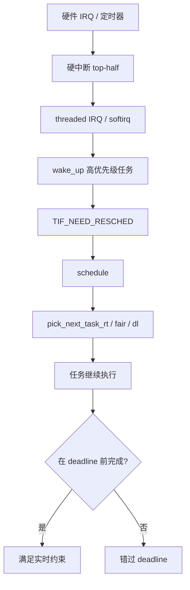
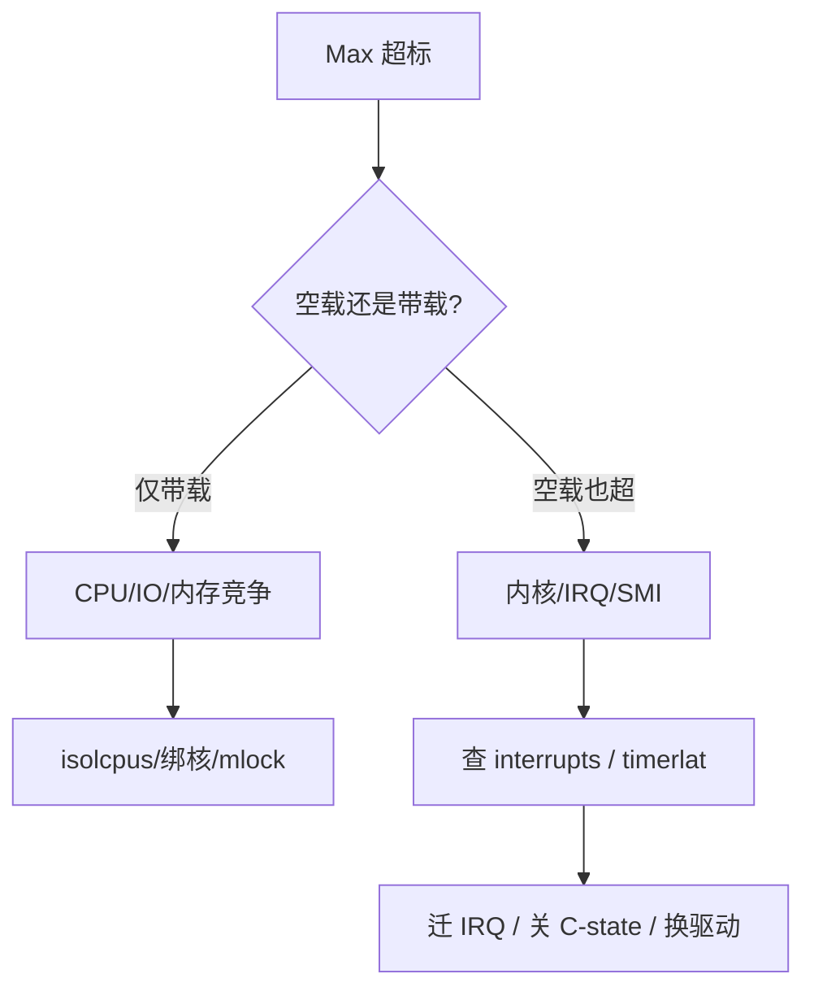

# deadline 错过一次就翻车？硬实时/软实时、延迟预算与可调度性一条线讲透

产线 PLC 周期 1 ms，某次采样晚了 3 ms 就撞机；车载域控标「硬实时」却跑在默认 Linux 上，cyclictest Max 偶尔跳到 10 ms；RTOS 任务优先级拍脑袋，联调时低优先级反而饿死高优先级——根因往往不是「再买一个更快的 CPU」，而是 **硬/软/ firm 实时语义没分清、延迟预算没拆、可调度性没验**。本文从 **实时定义与 deadline 语义 → WCET 与延迟来源 → 速率单调/EDF 直觉 → RTOS vs PREEMPT_RT Linux → cyclictest/osnoise 观测 → 排障分层**，路径对齐 `kernel/sched/`、`kernel/time/hrtimer.c` 与内核文档中的 `cyclictest`、`osnoise`、`timerlat`（工具与 tracepoint 以本机内核版本文档为准）。

## 阅读地图

1. **第一层：硬实时、软实时与 firm**——解决「错过 deadline 后果是什么、该选哪类系统」。
2. **第二层：延迟预算与 WCET**——解决「1 ms 周期里时间花在哪、最坏情况怎么估」。
3. **第三层：延迟来源**——解决「中断、调度、锁、缓存/缺页如何叠成长尾」。
4. **第四层：可调度性直觉**——解决「RM/EDF 何时理论上可行、利用率边界在哪」。
5. **第五层：RTOS vs PREEMPT_RT Linux**——解决「MCU 上的 FreeRTOS 与 Linux RT 补丁各自边界」。
6. **第六层：测量与排障**——解决「cyclictest 直方图、osnoise/timerlat 如何把毛刺钉到 IRQ/调度」。

## 源码锚点

| 路径 / 文档 | 作用 |
|-------------|------|
| `kernel/sched/core.c` | `schedule()`、抢占点、上下文切换 |
| `kernel/sched/rt.c` | `SCHED_FIFO/RR`、RT 带宽限制 |
| `kernel/sched/deadline.c` | `SCHED_DEADLINE`、EDF 实现 |
| `kernel/sched/fair.c` | CFS、`SCHED_OTHER` 公平调度 |
| `kernel/time/hrtimer.c` | 高精度定时器、`hrtimer_interrupt` |
| `kernel/time/tick-sched.c` | tick、NOHZ |
| `kernel/locking/rtmutex.c` | RT mutex、优先级继承（PREEMPT_RT） |
| `kernel/irq/manage.c` | IRQ 注册、threaded IRQ |
| `include/linux/preempt.h` | `preempt_disable/enable` |
| `kernel/Kconfig.preempt` | `CONFIG_PREEMPT_*` 选项树 |
| `Documentation/scheduler/sched-deadline.rst` | SCHED_DEADLINE 语义 |
| `Documentation/admin-guide/kernel-parameters.txt` | `isolcpus`、`nohz_full` |
| `tools/testing/rt-tests/cyclictest/` | 周期唤醒延迟测量 |
| `tools/testing/selftests/proc/` 等 | 部分 RT 自测 |
| 内核文档 `Documentation/trace/osnoise.rst`（若启用） | osnoise tracer |
| 内核文档 `Documentation/trace/timerlat.rst`（若启用） | timerlat tracer |
| `man 7 sched` `man chrt` | 用户态调度策略 |

`schedule()` 是延迟链路的汇聚点（逻辑摘录）：

```c
/* kernel/sched/core.c — 概念路径 */
asmlinkage __visible void __sched schedule(void)
{
    struct task_struct *tsk = current;
    /* 关抢占区检查 → pick_next_task() → context_switch() */
}
```

hrtimer 到期经 softirq/workqueue 唤醒任务（`kernel/time/hrtimer.c`）：

```c
/* kernel/time/hrtimer.c — 语义摘要 */
enum hrtimer_restart hrtimer_interrupt(struct hrtimer *timer, ...)
{
    /* 到期队列 → __hrtimer_run_queues → 唤醒等待任务 */
}
```

---

## 调用链

### 外部事件到任务按时运行



### cyclictest 测量路径


---

## 一、硬实时、软实时与 firm 实时

### 1.1 定义轴：错过 deadline 的代价

| 类型 | 错过 deadline | 典型场景 | 系统形态 |
|------|---------------|----------|----------|
| **硬实时（Hard）** | **不可接受**，可能导致灾难 | 飞控、引擎点火、安全 PLC | MCU RTOS、FPGA、专用 ASIC |
| **软实时（Soft）** | 可偶发，质量下降 |  VoIP、视频直播、UI 刷新 | Linux + RT 补丁、通用 OS |
| **firm 实时** | 偶发错过作废本次结果 | 工业视觉单帧、数据采集 | RTOS 或隔离 Linux 核 |

「实时」≠「快」，而是 **可预测的及时性（timeliness）**：在已知最坏情况下，能在 deadline 前完成。

### 1.2 硬实时为何常离开 Linux

Linux（即使 PREEMPT_RT）仍面临：

- **SMI**（x86 管理中断）、**GPU/NVMe 驱动** 长路径（不可控上限）。
- **页 fault**、**C-state 唤醒**、**NUMA 远端访问**。
- **内核维护线程**、**文件系统 journal** 等后台活动。

硬实时 **单点 deadline 保证** 多在 **无 MMU 或 MPU 的 RTOS**、或 **AMP（Linux + RTOS 分核）** 上完成；Linux 侧做 **软/firm** 更现实。

### 1.3 软实时的工程目标

不是「Max=0」，而是：

- **有界延迟**：如 cyclictest 在固定负载下 Max < 100 µs（指标由产品定）。
- **可回归**：内核/驱动升级后同一套测试不退化。
- **延迟预算**：把 1 ms 周期拆给传感、控制、通信，每段有 WCET 上限。

### 1.4 firm 与「结果过期」

工业相机 30 fps：某帧处理超过 33 ms，该帧丢弃，不影响下一帧——这是 **firm**。调度上可容忍偶发 miss，但 **miss 率** 必须可测、可告警。

---

## 二、延迟预算与 WCET

### 2.1 延迟预算（Latency Budget）

对一个周期任务：

```
Period T = 1 ms
Deadline D ≤ T（常取 D = T）
Budget B = WCET + 中断/调度抖动 + 同步等待
必须满足：B ≤ D
```

示例（电机电流环 10 kHz，T=100 µs）：

| 阶段 | 预算 | 说明 |
|------|------|------|
| ADC 采样完成到 ISR | 5 µs | 硬件 + DMA |
| ISR → 控制任务 | 10 µs | RTOS 延迟 |
| PI 运算 | 20 µs | WCET（需实测） |
| PWM 更新 | 5 µs | 写寄存器 |
| **余量** | 60 µs | 应对抖动 |

余量不是浪费，是 **吸收 IRQ 风暴、总线争用** 的保险。

### 2.2 WCET（Worst-Case Execution Time）

**不能**用 `time()` 测平均时间当 WCET。方法：

1. **静态分析**（商业工具 / 简化模型）：路径、循环上界。
2. **测量 + 安全余量**：在 **最坏配置** 下测（cache 冷、中断开、竞争核跑 stress）。
3. **禁止 unbounded 等待**：无界 `malloc`、无界锁、无界递归。

Linux 上 WCET 更难，因 **内核路径不可完全控制**；RTOS 上仍要防 **优先级反转** 与 **长临界区**。

### 2.3 响应时间 vs 执行时间

- **执行时间** \(C_i\)：CPU 上纯跑的时间。
- **响应时间** \(R_i\)：从 **就绪/到达** 到 **完成** 的总时间，含等待高优先级与阻塞。

实时分析算的是 **响应时间上界**，不是 profiler 里的 self time。

### 2.4 抖动（Jitter）

周期任务理想每 T 唤醒；实际唤醒时刻 \(\pm J\)。**Jitter 来源**：tick 粒度（无 hrtimer 时）、调度延迟、IRQ 抢占。`TIMER_ABSTIME` + hrtimer 是为 **减 jitter**，cyclictest 测的就是这类偏差。

---

## 三、延迟来源分解

### 3.1 中断路径

```bash
cat /proc/interrupts
cat /proc/softirqs
```

硬 IRQ handler 在 **关本地中断** 或极短临界区运行；Linux PREEMPT_RT 推 **threaded IRQ**，ISR 只 ack + wake thread，缩短 **不可抢占区**。但 **IRQ thread 与 RT 任务仍竞争同一 CPU**。

排障：

```bash
# 查看 IRQ 亲和
grep . /proc/irq/*/smp_affinity_list
watch -n1 'cat /proc/interrupts | tail -20'
```

### 3.2 调度延迟

从 **任务就绪** 到 **实际运行**：

1. 唤醒路径：`try_to_wake_up()` → `wake_up_process()`（`kernel/sched/core.c`）。
2. 若当前运行低优先级，设 `TIF_NEED_RESCHED`。
3. 抢占点：`preempt_enable`、syscall 返回、中断返回。

RT 任务用 `SCHED_FIFO` 固定优先级；**数值越小优先级越高**（Linux 约定，与部分 RTOS 相反，移植时注意）。

```bash
chrt -f 80 ./control_loop
taskset -c 2 chrt -f 80 ./control_loop
```

### 3.3 锁与优先级反转

经典：L 持锁，H 等锁，M 抢占 L → H 间接被 M 阻塞（反转）。

- RTOS：**优先级继承**（PI mutex）。
- Linux PREEMPT_RT：`rt_mutex`（`kernel/locking/rtmutex.c`）在 RT 任务阻塞时提升持锁者优先级。

普通 `pthread_mutex` 在 **非 RT 内核** 上无 PI，RT 任务可能被普通任务拖死。

### 3.4 缓存、TLB 与缺页

| 因素 | 效应 | 缓解 |
|------|------|------|
| Cache miss | 执行时间变长 | 绑核、热路径预热、mlock |
| TLB miss | 内存访问变慢 | 大页、hugepage |
| Page fault | 毫秒级长尾 | `mlockall`、预 touch、禁止 swap |
| C-states | 唤醒延迟 | `intel_idle.max_cstate=0`（费电，仅测/关键核） |

```bash
# 锁定进程内存（需 CAP_IPC_LOCK）
ulimit -l unlimited
# 应用内 mlockall(MCL_CURRENT|MCL_FUTURE)
```

### 3.5 时钟与 tick

**CONFIG_HZ**、**NOHZ**、**hrtimer** 影响唤醒粒度。`nohz_full=` 让指定 CPU 在单任务时 **停 tick**，减周期性时钟中断干扰（见 `Documentation/admin-guide/kernel-parameters.txt`）。

---

## 四、速率单调与 EDF 直觉

### 4.1 固定优先级：速率单调（RM）

任务周期越短，优先级越高（Rate-Monotonic）。**充分条件**（Liu & Layland，独立周期、CPU 绑定）：

\[
\sum_{i=1}^{n} \frac{C_i}{T_i} \leq n(2^{1/n} - 1)
\]

n 大时右边 → **≈ 0.69**。即 RM 在利用率 ~69% 以下 **一定可调度**（充分非必要）。

直觉：**短周期任务更 urgent**，应优先。

### 4.2 最早截止期优先（EDF）

动态优先级：**deadline 最早** 的先跑。Linux **`SCHED_DEADLINE`**（`kernel/sched/deadline.c`）提供 EDF 语义 + 带宽控制。

利用率上界（理想单核、无阻塞）：

\[
\sum \frac{C_i}{T_i} \leq 1
\]

比 RM 理论利用率高，但 **过载时** 所有任务都可能 miss（降级策略要想好）。

### 4.3 用户态 SCHED_DEADLINE 要点

```c
/* 需 CAP_SYS_NICE；sched_setattr 设置 runtime/deadline/period */
struct sched_attr attr = {
    .size = sizeof(attr),
    .sched_policy = SCHED_DEADLINE,
    .sched_runtime  = 200000,   /* 200µs，单位 ns */
    .sched_deadline = 1000000,  /* 1ms */
    .sched_period   = 1000000,
};
sched_setattr(0, &attr, 0);
```

文档：`Documentation/scheduler/sched-deadline.rst`。

### 4.4 阻塞与资源：理论变复杂

有 **共享资源、优先级继承、自旋锁** 时，上面公式 **不再直接适用**。工程上：

- 临界区尽量短；
- 避免 RT 任务等 **非 RT 锁**；
- 用 **优先级天花板** 或 PI mutex。

---

## 五、RTOS vs PREEMPT_RT Linux

### 5.1 RTOS 典型特征

| 特征 | FreeRTOS / Zephyr / RT-Thread 等 |
|------|-------------------------------------|
| 内核 | 单地址空间或轻量 MMU |
| 调度 | 固定优先级为主，可配时间片 |
| 中断 | 可预测 ISR 长度（开发者负责） |
| 协议栈/FS | 可选组件，常裁剪 |
| 适用 | 传感器融合、MCU 控制环、硬 deadline |

### 5.2 PREEMPT_RT Linux

| 特征 | 说明 |
|------|------|
| 目标 | 降低 **最坏** 内核延迟，非硬实时证明 |
| 手段 | spinlock → sleeping lock、threaded IRQ、可抢占 RCU 等 |
| 确认 | `uname` 带 `PREEMPT_RT`；`/sys/kernel/realtime` 为 1（若存在） |
| 适用 | 网关、软 PLC、机器人中间件、需 Linux 生态的 firm 实时 |

```bash
uname -a
zcat /proc/config.gz 2>/dev/null | grep PREEMPT
cat /sys/kernel/realtime 2>/dev/null
```

### 5.3 AMP / hypervisor 分核

**Linux 跑网络/UI，FreeRTOS 跑 1 ms 环**：通过 **RPU/MCU** 或 **分区 hypervisor** 隔离。选型不是二选一，而是 **哪条 deadline 必须硬保证**。

### 5.4 选型决策表

| 需求 | 倾向 |
|------|------|
| miss 即安全事故 | MCU RTOS / FPGA |
| ms 级可预测 + 丰富协议 | PREEMPT_RT + isolcpus |
| 100 ms 级 | 普通 Linux + 合理优先级 |
| 需容器/K8s | 软实时，接受长尾 |

---

## 六、cyclictest 与延迟直方图

### 6.1 基本用法

```bash
# 安装 rt-tests（发行版包名示例：rt-tests）
cyclictest -p 80 -t 1 -n -i 1000 -l 100000 -m -H 400 --histfile=/tmp/hist.txt
```

| 参数 | 含义 |
|------|------|
| `-p 80` | SCHED_FIFO 优先级 80 |
| `-t 1` | 1 个测试线程 |
| `-n` | 使用 clock_nanosleep（非 /dev/rtpipe 旧路径） |
| `-i 1000` | 间隔 1000 µs |
| `-l 100000` | 循环次数 |
| `-m` | 锁定内存 mlockall |
| `-H 400` | 直方图桶 |

输出关注：**Min / Avg / Max**，以及 **超过某阈值的计数**。

### 6.2 多核与绑核

```bash
cyclictest -p 99 -a 2 -t 1 -n -i 200 -l 500000 -m
# -a 2：CPU 2 上跑
```

与 **isolcpus** 联用：测核应与生产 RT 任务同核。

### 6.3 带负载测量

```bash
# 终端 1：背景 stress
stress-ng --cpu 4 --io 2 --vm 1 --timeout 600

# 终端 2：cyclictest
cyclictest -p 90 -a 2 -t 1 -n -i 1000 -l 200000 -m
```

**空载 Max 好看、带载崩** 是常见验收陷阱——必须 **同负载回归**。

### 6.4 直方图解读

- **Max 单点尖刺**：查 IRQ、SMI、电源管理、单次 fault。
- **Avg 慢慢升**：CPU 饱和、优先级设错、锁竞争。
- **周期性尖刺**：tick、其他核 IPI、定时器广播。

---

## 七、osnoise 与 timerlat（内核文档为准）

以下工具随 **内核版本与 CONFIG** 变化，使用前读本机：

```bash
ls /sys/kernel/tracing/events/osnoise/ 2>/dev/null
ls /sys/kernel/tracing/events/timerlat/ 2>/dev/null
```

### 7.1 osnoise tracer 意图

度量 **CPU 被 os noise**（IRQ、softirq、内核线程等）占用的间隔，帮助解释 cyclictest 毛刺。启用方式见 `Documentation/trace/osnoise.rst`（若存在）：

```bash
# 示例性步骤，以本机文档为准
sudo mount -t tracefs tracefs /sys/kernel/tracing 2>/dev/null
# echo osnoise > /sys/kernel/tracing/current_tracer
# 启动 cyclictest 同时抓 trace
```

### 7.2 timerlat tracer 意图

聚焦 **定时器 latency**：从 **预期 timer 到期** 到 **handler/线程运行** 的偏差。与 cyclictest 互补——cyclictest 是 **用户态端到端**，timerlat 更靠近 **内核 hrtimer 路径**（`kernel/time/hrtimer.c`）。

### 7.3 与 ftrace 联动

```bash
sudo trace-cmd record -e sched:sched_wakeup -e irq:irq_handler_entry sleep 10
sudo trace-cmd report | head -100
```

高延迟时刻对齐 **wake → schedule → switch** 与 **IRQ 名称**。

---

## 八、PREEMPT_RT 与 isolcpus 配置要点

### 8.1 内核启动参数（Host/RT 节点）

```bash
# /etc/default/grub 示例
GRUB_CMDLINE_LINUX="isolcpus=2-3 nohz_full=2-3 rcu_nocbs=2-3 intel_pstate=disable nosoftlockup"
```

| 参数 | 作用 |
|------|------|
| `isolcpus` | 减少 CFS 向这些 CPU 派普通任务 |
| `nohz_full` | 单任务 CPU 上减少 tick |
| `rcu_nocbs` | RCU 回调迁出 |
| `intel_pstate=disable` | 部分平台用 acpi-cpufreq 便于锁频（平台相关） |

**isolcpus 不迁 IRQ**——必须手动 `/proc/irq/*/smp_affinity_list`。

### 8.2 应用侧

```bash
taskset -c 2 chrt -f 90 ./rt_app
ulimit -r unlimited   # RT priority 上限
```

### 8.3 反模式

1. **SCHED_FIFO 99 开满多个线程** → RT 带宽耗尽（`sched_rt_runtime_us`）。
2. **只换 RT 内核不绑核不隔离** → Max 仍 ms 级。
3. **RT 任务 malloc/printf** → 非有界路径。
4. **cyclictest 空载通过即签字** → 产线带载失败。

```bash
cat /proc/sys/kernel/sched_rt_runtime_us   # 默认 950000 µs/s
cat /proc/sys/kernel/sched_rt_period_us
```

---

## 九、排障分层流程

### 9.1 第一步：定义指标

- Period / Deadline / 可接受 Max / 可接受 miss 率。
- 测量工具：cyclictest 参数固定进 CI。

### 9.2 第二步：复现

```bash
# 记录环境
uname -a > env.txt
cat /proc/cmdline >> env.txt
lscpu >> env.txt
cyclictest ... | tee baseline.txt
```

### 9.3 第三步：分层



### 9.4 案例：Max 随网络流量上升

```bash
cat /proc/interrupts | grep eth
# 发现 eth IRQ 全在 CPU 2，而 RT 任务也在 CPU 2
echo 3 | sudo tee /proc/irq/NN/smp_affinity_list
```

### 9.5 案例：偶发 5 ms 尖刺

- 查 **SMI**：部分平台 `intel-cstates` / BIOS 设置。
- 查 **kswapd**：`vmstat 1`，`mlock` RT 进程。
- 查 **journald/audit** 突发 IO。

### 9.6 案例：EDF 任务饿死

- 是否 **runtime 设太小** 相对实际 WCET？
- 是否 **多 DL 任务过载**？文档要求过载策略。

---

## 十、与调度器源码的阅读顺序

1. **`kernel/time/hrtimer.c`**：周期唤醒从哪来。
2. **`kernel/sched/core.c`**：`schedule()`、`__schedule()`、抢占检查。
3. **`kernel/sched/rt.c`**：FIFO 选任务规则。
4. **`kernel/sched/deadline.c`**：EDF 红黑树、带宽。
5. **`kernel/irq/manage.c`**：request_threaded_irq 如何拆 ISR。

读源码目的：**知道延迟可能插在哪条路径**，不是为了手算每行 WCET。

---

## 十一、RTOS 侧对照（概念）

| 概念 | RTOS | Linux |
|------|------|-------|
| 任务 | Task | thread |
| 临界区 | disable interrupt / mutex | spinlock / rt_mutex |
| 延迟测量 | GPIO toggle + 示波器 / DWT cycle | cyclictest |
| 优先级 | 厂商 API | nice / sched_setscheduler |
| 栈大小 | 静态配置 | 默认 8MB，RT 仍要控栈 |

移植控制环时：**不要**假设 Linux 线程优先级数字与 FreeRTOS 一致。

---

## 十二、工程文档：延迟预算表模板

| 任务 | T (ms) | D (ms) | C (WCET µs) | 优先级/策略 | 同步 | 备注 |
|------|--------|--------|-------------|-------------|------|------|
| 电流环 | 0.1 | 0.1 | 25 | FIFO 90 | SPI mutex PI | mlock |
| 速度环 | 1 | 1 | 80 | FIFO 70 | 读电流环输出 | |
| 通信 | 10 | 10 | 500 | CFS | socket | 软实时 |

评审时问三句：**WCET 怎么测的？miss 后果？过载谁降级？**

---

## 十三、命令速查

```bash
# 调度策略
chrt -p $(pidof rt_app)
ps -eLo pid,tid,class,rtprio,pri,psr,comm | grep rt_app

# 内核抢占
grep PREEMPT /boot/config-$(uname -r)

# 延迟测试
cyclictest -p 80 -a 2 -t 1 -n -i 1000 -l 100000 -m -h 100 -q

# IRQ
cat /proc/interrupts
grep . /proc/irq/*/smp_affinity_list

# 内存锁定
grep VmLck /proc/$(pidof rt_app)/status

# RT 带宽
sysctl kernel.sched_rt_runtime_us
```

---

## 十四、与专篇边界

| 主题 | 本文 | 同目录专篇 |
|------|------|------------|
| PREEMPT_RT 细调 | 概述 + isolcpus | 实时 Linux PREEMPT_RT 完整篇 |
| 追踪工具链 | cyclictest + osnoise 入口 | 性能分析延迟与追踪 |
| RTOS API | 对照 | 嵌入式实时 RTOS 与 Linux 对照 |
| 调度算法实现 | 直觉 + 锚点 | 实时调度完整篇 |

---

## 十五、设计原则小结

1. **先分类实时等级**：硬实时别押在默认 Linux。
2. **延迟预算可审计**：每个周期任务有 C、T、D 与余量。
3. **测最坏不测平均**：带载 cyclictest + 固定 CI。
4. **隔离是手段不是信仰**：isolcpus + IRQ + mlock + 锁 PI 组合验证。
5. **可调度性有理论界**：RM ~69%、EDF 100% 是起点，阻塞会恶化。
6. **工具链分层**：cyclictest 看结果，timerlat/osnoise/ftrace 看段落。

合并自 `articles/实时系统/chapters/001～006`（实时系统概述系列）；工具与 tracepoint 以本机内核 `Documentation/` 为准，不确定处不编造寄存器级细节。
