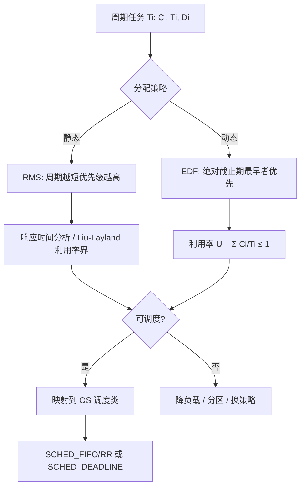
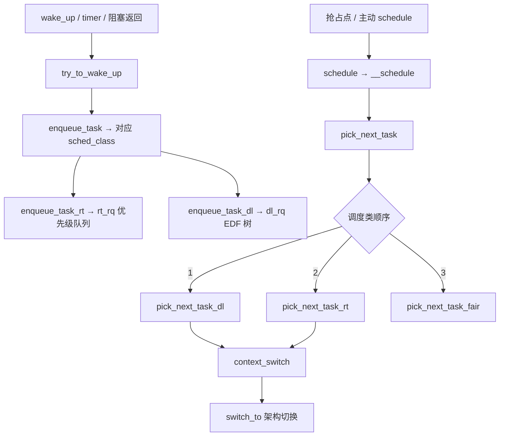
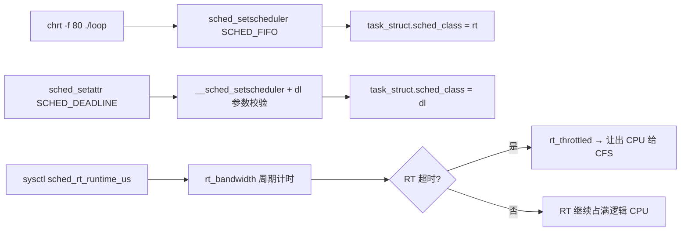

# 实时调度完整篇：从 RMS/EDF、优先级到 Linux SCHED_FIFO/Deadline 排障

控制环周期抖动从 200 µs 漂到 3 ms、音频线程偶发爆音、工业网关「软实时线程」却把 SSH 饿死——这类问题往往不是「再加核」能解决的，而是 **截止期模型、静态/动态优先级分配、Linux 调度类与 RT 带宽** 没对齐。嵌入式团队常在 FreeRTOS 上熟练 RMS，一换 Linux 就把 `SCHED_FIFO 99` 当万能钥匙；服务端 SRE 看到 load 飙高却 CPU idle，也很少联想到 RT throttling 或 DL 参数填错。

本文把经典实时理论（RMS/EDF、可调度性分析、优先级反转）与 Linux 内核 `rt.c`/`deadline.c` 及 `chrt`/`sched_setattr` 配置合成一篇闭环：**先纸面证明可调度，再选调度类，最后用观测命令验收**，便于对照源码与 `perf sched` 验证。CFS 公平调度不在此展开，可与《Linux 进程调度完整篇》对照阅读。

---

## 源码锚点

| 路径 | 作用 |
|------|------|
| `kernel/sched/core.c` | `schedule()`、`__schedule()`、`pick_next_task()` 总入口 |
| `kernel/sched/rt.c` | `SCHED_FIFO`/`SCHED_RR`：RT 就绪队列、`rt_bandwidth` 限流 |
| `kernel/sched/deadline.c` | `SCHED_DEADLINE`：EDF + CBS 带宽隔离 |
| `include/uapi/linux/sched/types.h` | `SCHED_*` 常量、`struct sched_attr` |
| `kernel/sched/sched.h` | `sched_class` 分层：`dl_sched_class`、`rt_sched_class` |
| `kernel/locking/rtmutex.c` | RT mutex 优先级继承，缓解优先级反转 |

用户态可见的策略与 Deadline 参数：

```c
/* include/uapi/linux/sched/types.h */
#define SCHED_FIFO     1
#define SCHED_RR       2
#define SCHED_DEADLINE 6

struct sched_attr {
	__u32 size;
	__u32 sched_policy;
	__u64 sched_flags;
	__s32 sched_nice;
	__u32 sched_priority;   /* RT: 1~99，越大越高 */
	__u64 sched_runtime;    /* DL: 运行预算 (ns) */
	__u64 sched_deadline;   /* DL: 相对周期起点截止期 (ns) */
	__u64 sched_period;     /* DL: 周期 (ns) */
};
```

主动调度入口（所有策略最终都经此切换）：

```c
/* kernel/sched/core.c */
asmlinkage __visible void __sched schedule(void)
{
	struct task_struct *tsk = current;

	sched_submit_work(tsk);
	do {
		preempt_disable();
		__schedule(SM_NONE);
		sched_preempt_enable_no_resched();
	} while (need_resched());
}
```

RT 类在 `pick_next_task` 中优先于 CFS 被选中；`rt.c` 里 `pick_next_task_rt()` 从 per-CPU 的 `rt_rq` 优先级数组取最高就绪实体，同优先级用 FIFO 链表排队。`enqueue_task_rt()` / `dequeue_task_rt()` 在唤醒、阻塞、`sched_yield` 时维护队列；`SCHED_RR` 在时间片耗尽时触发重排队列轮转。

Deadline 类走 `deadline.c`：每个 CPU 有 `dl_rq`，就绪任务按 **绝对截止期** 插入红黑树；`update_curr_dl()` 递减剩余 runtime，耗尽则 CBS 规则推迟下一截止期。`sched_setattr(2)` 系统调用经 `__sched_setscheduler()` 写入 `task_struct.dl` 字段，内核 `dl_policy()` 校验参数合法性——用户态填错 `runtime > deadline` 会直接 `EINVAL`，排障时先查 man 再 strace。

`task_struct` 通过 `sched_class` 指针绑定调度类；切换策略时 `set_sched_class()` 把任务从旧类 runqueue 迁移到新类，**已在 CPU 上运行时不允许改策略**（需先阻塞或停在其他 CPU）。

---

## 调用链

### 理论层：周期任务 → 策略 → 可调度性



### 内核层：唤醒到选中 RT/DL 任务



### 用户态配置到内核



---

## 重点知识

### 1. 硬实时 vs 软实时：先定指标再选 OS 语义

**硬实时**要求截止期违约等于系统失效；**软实时**允许偶发违约但需统计上可控。Linux 主线 + `SCHED_FIFO` 提供 **尽力型** 低延迟：无形式化 WCET 证明，抖动来自中断、锁、SMM、其他 RT 任务。周期采样若要求可证明截止期，应评估 RTOS 或 `PREEMPT_RT` + 隔离核 + 实测 worst-case；勿把 `nice -20` 或 busy-loop 当硬实时。

### 2. RMS：静态优先级里的经典最优

**Rate Monotonic Scheduling（RMS）** 规则：周期 `Ti` 越短，静态优先级越高（与 `Ci` 无关）。在抢占式单处理器、独立周期任务、截止期等于周期（`Di = Ti`）前提下，RMS 是 **所有静态优先级算法中最优的**——若 RMS 都调度不了，任何固定优先级分配也不行。

**Liu & Layland 充分条件**（任务数 `n`）：

\[
U = \sum \frac{C_i}{T_i} \leq n\left(2^{1/n} - 1\right)
\]

当 `n → ∞` 时上界约为 **0.693**。该条件是充分的而非必要——利用率 0.8 仍可能可调度，需做 **响应时间分析（RTA）** 迭代：

\[
R_i = C_i + \sum_{j \in hp(i)} \left\lceil \frac{R_i}{T_j} \right\rceil C_j
\]

`hp(i)` 为优先级高于 `i` 的任务集；迭代从 `R_i = C_i` 起直到收敛或 `R_i > Di`（不可调度）。工程上：先用 RMS 赋优先级，再用 RTA 或仿真验证最坏响应时间。

**映射到 Linux**：RMS 的静态优先级表通常对应 **`SCHED_FIFO`/`SCHED_RR` 的 1～99**。例如 1 ms 周期任务优先级 90、10 ms 周期任务优先级 70。内核不会替你按周期自动赋优先级——必须在用户态或启动脚本里用 `chrt`/`sched_setscheduler` 显式设置，并保证 **同级 FIFO 任务会互相阻塞**（无时间片），长临界区任务应降优先级或改 RR。

### 3. EDF：动态优先级与 Linux SCHED_DEADLINE

**Earliest Deadline First（EDF）** 在任意时刻选 **绝对截止期最早** 的就绪任务。单处理器抢占式下，独立周期任务若 \(U = \sum C_i/T_i \leq 1\)，则 **可调度当且仅当** 利用率不超过 100%——比 RMS 的 69% 充分界更紧。

Linux **`SCHED_DEADLINE`**（`kernel/sched/deadline.c`）实现 **EDF + Constant Bandwidth Server（CBS）**：

- 每个任务有 `(runtime, deadline, period)`，内核维护 **剩余运行预算** 与 **绝对截止期**。
- 预算耗尽则推迟截止期（带宽隔离），防止某个 DL 任务占满 CPU。
- `pick_next_task_dl()` 从 EDF 红黑树取截止期最小且可运行实体。

用户态设置示例（需 `CAP_SYS_NICE`）：

```c
struct sched_attr attr = {
	.size            = sizeof(attr),
	.sched_policy    = SCHED_DEADLINE,
	.sched_runtime   =  3 * 1000 * 1000,   /* 3 ms 预算 */
	.sched_deadline  = 10 * 1000 * 1000,   /* 10 ms 截止期 */
	.sched_period    = 10 * 1000 * 1000,   /* 10 ms 周期 */
};
sched_setattr(0, &attr, 0);
```

内核校验：`runtime ≤ deadline ≤ period`（具体约束以当前内核 `dl_policy()` 为准）；`sched_flags` 可设 `SCHED_FLAG_RESET_ON_FORK` 等。周期控制环若参数已知，**优先 DL 而非盲目 FIFO 99**——DL 自带带宽语义，FIFO 高优先级可能饿死整台机器上的 CFS。

**EDF 与 RMS 选型速查**：

| 维度 | RMS | EDF / SCHED_DEADLINE |
|------|-----|----------------------|
| 优先级 | 固定，按周期 | 动态，按绝对截止期 |
| 单核利用率界 | 充分条件 ≈ 69% | 必要充分 `U ≤ 1` |
| Linux 接口 | `chrt -f/-r` | `sched_setattr` + DL 三元组 |
| 多同优先级行为 | FIFO 无轮转 | CBS 自动限带宽 |
| 实现复杂度 | 用户态赋优先级表 | 内核维护 EDF 树与预算 |

多核场景下 EDF 不再保证 `U ≤ 1` 可调度（任务迁移、共享 runqueue 引入额外干扰），需 **分区调度（每个核绑一组任务）** 或 `isolcpus` + `taskset` 减少跨核迁移。

### 4. 优先级调度：FIFO、RR 与「99 不是越多越好」

| 策略 | 行为 | 典型场景 |
|------|------|----------|
| `SCHED_FIFO` | 同优先级先进先出；运行直到阻塞或被 **更高** RT 抢占 | 短临界区控制环 |
| `SCHED_RR` | 同优先级时间片轮转（`sched_rr_timeslice_ms`） | 多同级 RT 任务需公平 |
| `SCHED_DEADLINE` | EDF + CBS | 已知 `(C,T,D)` 的周期任务 |

RT 静态优先级 **1～99**（`MAX_RT_PRIO`），数字越大越高；**CFS 的 nice 与 RT 优先级是两套刻度**。`pick_next_task` 顺序为 `stop → deadline → rt → fair → idle`，故 DL 与 RT 均优先于普通进程。

命令行：

```bash
chrt -f 80 ./control_loop      # FIFO 优先级 80
chrt -r 50 ./sensor_poll       # RR 优先级 50
chrt -p <pid>                  # 查看当前策略与优先级
```

### 5. RT 带宽：`sched_rt_runtime_us` 与饿死防护

`kernel/sched/rt.c` 的 **`rt_bandwidth`** 机制：在每个 **`sched_rt_period_us`**（默认 1 s）窗口内，所有 RT 任务合计最多运行 **`sched_rt_runtime_us`**（默认 950 ms）。超出后 RT runqueue **被节流（throttled）**，CPU 回落给 CFS，避免 RT 占满导致 sshd、journald 无法运行。`rt_period_timer` 在每个周期结束时重置计数，形成 **RT 时间预算的周期性分享**——有时文档或运维口语里说的「RT runtime 份额」指的就是这一组 sysctl，而非单独一个叫 `rt_runtime_share` 的内核变量。

```bash
sysctl kernel.sched_rt_runtime_us   # 默认 950000（微秒）
sysctl kernel.sched_rt_period_us    # 默认 1000000
# 设为 -1 可关闭 RT 带宽限制（危险，仅实验环境）
cat /proc/sys/kernel/sched_rt_runtime_us
```

排障时若「RT 线程突然变慢」，查 RT 带宽是否触顶；`sched_rt_runtime_us` 过小会把 50 ms 控制环切成多段睡眠。`grep -i rt /proc/sched_debug` 可看 per-CPU `rt_nr_running` 与 throttle 状态（需 `CONFIG_SCHED_DEBUG`）。cgroup v1 的 `cpu.rt_runtime_us` / `cpu.rt_period_us` 可对 cgroup 子树做 **RT 时间片配额**；cgroup v2 继承 CPU 控制器但 RT 带宽语义与 v1 略有差异，容器里 RT 任务「有时不实时」常是 **cgroup RT 配额用尽** 而非业务逻辑 bug。

**与 CFS 的「公平份额」对比**：CFS 用 vruntime 做长期公平；RT/DL 是 **绝对优先级语义**，只在 RT 带宽窗口耗尽时才短暂让出 CPU 给普通任务——二者设计目标不同，不可混谈。

### 6. 可调度性分析：从公式到实测

理论侧 checklist：

1. 列出所有周期任务 `(Ci, Ti, Di)` 与依赖（共享资源会引入阻塞时间 `Bi`）。
2. 选 RMS 或 EDF，计算利用率 `U`；EDF 用 `U ≤ 1` 作必要条件。
3. RMS 用 RTA 迭代或 Liu-Layland 充分条件初筛。
4. 加 **上下文切换、中断、锁、缓存** 开销到 `Ci`（测量 WCET，勿只用平均 profiling 值）。
5. 若有 sporadic 非周期任务，需单独算 **密度（density）** 或改模型，勿硬套周期 RMS。

**共享资源扩展**：当任务访问互斥锁，RMS 的 RTA 公式需加阻塞项 `Bi`（优先级天花板协议可算 `Bi = max` 持锁时间）。Linux 上持锁时间包含内核路径——`PREEMPT_RT` 补丁把大量 spinlock 改为 sleeping mutex，使高优先级任务更可抢占内核临界区，但 **仍须实测** 最坏延迟。

Linux 侧验证：

```bash
cyclictest -p 80 -t 1 -n -i 1000 -l 10000   # PREEMPT_RT 环境常用
perf sched record -a -- sleep 5
perf sched latency
perf sched map
cat /proc/<pid>/sched                          # policy、prio、se.sum_exec_runtime
taskset -c 2 chrt -f 80 ./loop               # 绑核减少迁移 jitter
```

`cyclictest` 量的是 **唤醒延迟**，与 `isolcpus=2`、`nohz_full`、`irqaffinity` 强相关。工业验收通常要求 **99.9 分位延迟** 低于阈值，而非平均值——平均值掩盖毛刺。`/proc/<pid>/sched` 的 `se.exec_start`/`nr_voluntary_switches` 可辅助判断任务是否频繁被抢占或睡过头。

### 7. 优先级反转：理论陷阱与 Linux 对策

经典 **优先级反转**：低优先级任务 `L` 持锁，高优先级 `H` 等锁；中优先级 `M` 抢占 `L`，导致 `H` 间接被 `M` 阻塞——`M` 的优先级本低于 `H` 却影响了 `H` 的截止期。

对策：

- **优先级继承（PI）**：`L` 临时提升到 `H` 的优先级，直到放锁。Linux **`CONFIG_RT_MUTEXES`** + `kernel/locking/rtmutex.c`；用户态 `pthread_mutexattr_setprotocol(&attr, PTHREAD_PRIO_INHERIT)`。
- **优先级天花板**：锁的优先级设为访问该锁的所有任务中最高优先级。

注意：PI 只解决 **mutex 型** 阻塞；`SCHED_FIFO` 下若高优先级线程忙等 spinlock 或长时间占 CPU，低优先级仍可能永远得不到 CPU——需缩短临界区、避免用户态 spin、配合 `PREEMPT_RT` 减少内核不可抢占区。

**三类反转对比**：

| 类型 | 机制 | Linux 典型场景 |
|------|------|----------------|
| 直接阻塞 | 高优先级等低优先级持有的 mutex | PI futex/rtmutex |
| 间接（链式） | 多锁传递 | 统一锁顺序、减少嵌套 |
| 无限期（livelock） | 高优先级忙等 | 禁止 RT 线程 spin；用 `sched_yield` 或改设计 |

用户态示例：

```c
pthread_mutexattr_t ma;
pthread_mutexattr_init(&ma);
pthread_mutexattr_setprotocol(&ma, PTHREAD_PRIO_INHERIT);
pthread_mutex_init(&lock, &ma);
```

内核态驱动若在中断与进程上下文共享数据，需区分 spinlock（短临界区）与 mutex（可睡眠）；RT 用户线程等持 spinlock 的慢路径会放大 jitter。

### 8. `sched_setattr` 与 `chrt` 实践要点

`sched_setattr(2)` 是设置 `SCHED_DEADLINE` 的推荐入口（比旧 `sched_setscheduler` 信息更全），也可改 FIFO/RR：

```bash
# 查看 DL 任务参数（需内核支持 schedstat）
cat /proc/<pid>/sched
chrt -p <pid>

# strace 跟踪 EINVAL
strace -e sched_setattr ./your_dl_app 2>&1 | tail
```

权限：`CAP_SYS_NICE` 或 ulimit `RLIMIT_RTPRIO` 非零。容器默认可能禁止 RT，需在 securityContext/capabilities 显式放开。**fork 行为**：DL 任务默认子进程继承策略；若设 `SCHED_FLAG_RESET_ON_FORK`，子进程回到 `SCHED_NORMAL`，避免子进程意外继承高权限 RT。

### 9. 常见故障对照

| 现象 | 常见根因 | 对策 |
|------|----------|------|
| 周期抖动 ms 级 | 仍跑在 CFS / nice 误解 | `chrt -f` 或 `sched_setattr` DL |
| RT 线程周期性卡顿 | `sched_rt_runtime_us` 或 cgroup RT 配额用尽 | 调带宽或优化 RT CPU 占用 |
| 整机卡死、无法 SSH | 多个 FIFO 99 无 yield | 降优先级、RR、DL，或依赖 RT 带宽 |
| 高优先级仍等锁很久 | 优先级反转 / 非 PI 锁 | PI mutex；缩短持锁时间 |
| DL 设置 errno EINVAL | runtime/deadline/period 不满足约束 | 对照 `sched_setattr(2)` 与内核校验 |
| cyclictest 偶发超大 latency | SMI、C-state、未绑核 | `intel_idle.max_cstate=0`、`isolcpus`、关 Turbo 做基线 |

---

## Checklist

- [ ] 能区分 **RMS（静态周期越短越高）** 与 **EDF（动态最早截止期）**，并写出利用率判别式
- [ ] 能指出 `schedule()` → `pick_next_task` → `pick_next_task_rt` / `pick_next_task_dl` 所在文件
- [ ] 能说明 `SCHED_FIFO` 与 `SCHED_RR` 差异，以及 RT 优先级 1～99 与 CFS nice 无关
- [ ] 会用 `chrt` 与 `sched_setattr` 配置 FIFO/RR/DEADLINE，并理解 `runtime/deadline/period` 含义
- [ ] 知道 `kernel.sched_rt_runtime_us` / `sched_rt_period_us` 的作用，能解释 RT throttling
- [ ] 能描述优先级反转链条，并知道 PI mutex / `PTHREAD_PRIO_INHERIT` 适用边界
- [ ] 会用 `cyclictest` 或 `perf sched latency` 做延迟验证，而非只改优先级数字

---

## 小结

实时调度的核心链条是：**用 RMS/EDF 与可调度性分析在纸面上证明「来得及」**，再 **映射到 Linux 的 DL（带 CBS 的 EDF）或 FIFO/RR（静态 RT 优先级）**，并用 **`sched_rt_runtime_us` 防止 RT 饿死系统**、用 **PI 缓解锁导致的优先级反转**。读码从 `kernel/sched/core.c` 的 `schedule()` 与 `rt.c`/`deadline.c` 的入队/选任务函数对照；改配置从 `chrt`/`sched_setattr` 与 sysctl 两端夹击，最后用 `cyclictest`/`perf sched` 闭环，比单独背「99 最高优先级」更有效。
